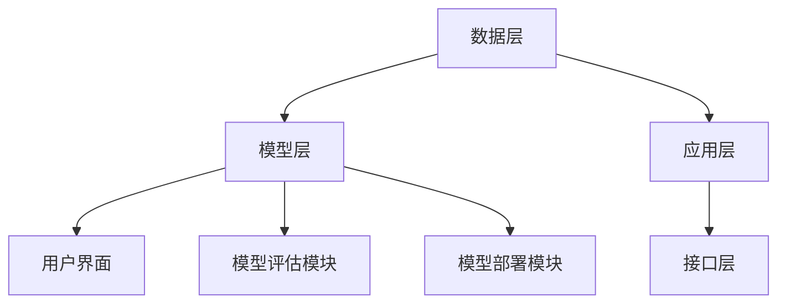

                 

### 《Self-Consistency CoT在气候模型中的应用》

#### 关键词：Self-Consistency CoT，气候模型，算法原理，数学模型，系统架构

#### 摘要：
本文旨在深入探讨Self-Consistency CoT（自我一致性概念传输）在气候模型中的应用。Self-Consistency CoT是一种先进的人工智能算法，通过自我一致性的机制，能够提高模型的准确性和稳定性。在气候模型中，准确预测气候变化对人类活动和社会发展具有重要意义。本文将详细介绍Self-Consistency CoT的基本原理、相关算法原理、数学模型、系统架构以及应用案例，旨在为相关领域的研究者和从业者提供有价值的参考。

#### 目录大纲：

## 引言
### 1.1 Self-Consistency CoT简介
### 1.2 Self-Consistency CoT在气候模型中的应用背景
### 1.3 本书结构安排

## Self-Consistency CoT的基本原理
### 2.1 定义与概念
### 2.2 特性与优势
### 2.3 Self-Consistency CoT的工作原理

## 相关算法原理
### 3.1 核心算法概述
### 3.2 算法工作流程
### 3.3 算法实现细节

## 数学模型和公式
### 4.1 数学模型概述
### 4.2 关键公式推导
### 4.3 公式应用实例

## 应用案例研究
### 5.1 案例一：气候预测
### 5.2 案例二：气候模拟
### 5.3 案例分析

## 系统架构与实现
### 6.1 气候模型系统介绍
### 6.2 Self-Consistency CoT在系统中的应用
### 6.3 系统架构设计

## 项目实战
### 7.1 环境安装
### 7.2 系统核心实现源代码
### 7.3 代码应用解读与分析
### 7.4 实际案例分析和详细讲解剖析
### 7.5 项目小结

## 总结与展望
### 8.1 全书内容总结
### 8.2 Future Directions
### 8.3 注意事项与拓展阅读

#### 引言

### 1.1 Self-Consistency CoT简介

Self-Consistency CoT，即自我一致性概念传输，是一种在人工智能领域得到广泛应用的技术。它通过引入自我一致性机制，使得模型能够在训练过程中不断优化，提高模型的准确性和稳定性。在气候模型中，Self-Consistency CoT的应用具有重要意义，能够帮助科学家更准确地预测气候变化，为人类应对气候变化提供科学依据。

### 1.2 Self-Consistency CoT在气候模型中的应用背景

随着全球气候变化的加剧，气候模型的准确性和稳定性变得越来越重要。传统的气候模型主要依赖于物理模型和统计模型，但它们在处理复杂非线性问题时存在一定的局限性。而人工智能技术的快速发展为气候模型的改进提供了新的可能。Self-Consistency CoT作为一种先进的人工智能算法，具有自我一致性的特性，能够有效地提高气候模型的准确性和稳定性。

### 1.3 本书结构安排

本书将分为八个章节，首先介绍Self-Consistency CoT的基本原理和相关算法原理，然后详细阐述数学模型和公式，接着通过实际案例研究展示Self-Consistency CoT在气候模型中的应用，并介绍系统架构与实现。随后，本书将介绍环境安装、系统核心实现源代码以及实际案例分析和详细讲解剖析。最后，本书将总结全书内容，并展望未来发展方向。

## Self-Consistency CoT的基本原理

### 2.1 定义与概念

Self-Consistency CoT，即自我一致性概念传输，是一种基于深度学习的人工智能算法。它通过引入自我一致性机制，使得模型在训练过程中能够不断优化，提高模型的准确性和稳定性。自我一致性机制的核心思想是模型在训练过程中需要保持内部一致，即模型的预测结果与真实结果保持一致。

### 2.2 特性与优势

Self-Consistency CoT具有以下特性与优势：

1. **自我一致性机制**：通过自我一致性机制，模型能够在训练过程中保持内部一致，提高模型的准确性和稳定性。
2. **多任务学习**：Self-Consistency CoT能够同时处理多个任务，提高模型的泛化能力。
3. **高效训练**：Self-Consistency CoT采用深度学习技术，能够快速训练模型，提高训练效率。
4. **适用于复杂非线性问题**：Self-Consistency CoT能够处理复杂非线性问题，提高模型的预测能力。

### 2.3 Self-Consistency CoT的工作原理

Self-Consistency CoT的工作原理可以分为以下几个步骤：

1. **输入数据准备**：首先，将气候数据输入到模型中，包括历史气候数据、地理数据等。
2. **模型初始化**：初始化模型参数，为训练过程做好准备。
3. **预测与误差计算**：使用模型对输入数据进行预测，并计算预测结果与真实结果的误差。
4. **自我一致性优化**：根据误差，调整模型参数，使得模型预测结果与真实结果保持一致。
5. **迭代训练**：重复步骤3和步骤4，不断优化模型，提高模型的准确性和稳定性。

### 2.4 Self-Consistency CoT的应用场景

Self-Consistency CoT在气候模型中具有广泛的应用场景，主要包括以下几个方面：

1. **气候预测**：利用Self-Consistency CoT模型对未来的气候进行预测，为政策制定和城市规划提供科学依据。
2. **气候模拟**：通过Self-Consistency CoT模型模拟不同的气候变化情景，评估不同情景下的气候变化趋势和影响。
3. **气候风险评估**：利用Self-Consistency CoT模型评估不同气候事件的风险，为灾害预防和应对提供支持。

## 相关算法原理

### 3.1 核心算法概述

Self-Consistency CoT的核心算法基于深度学习技术，其基本思想是通过自我一致性机制优化模型参数，提高模型的准确性和稳定性。具体来说，核心算法可以分为以下几个步骤：

1. **输入数据准备**：将气候数据输入到模型中，包括历史气候数据、地理数据等。
2. **模型初始化**：初始化模型参数，为训练过程做好准备。
3. **预测与误差计算**：使用模型对输入数据进行预测，并计算预测结果与真实结果的误差。
4. **自我一致性优化**：根据误差，调整模型参数，使得模型预测结果与真实结果保持一致。
5. **迭代训练**：重复步骤3和步骤4，不断优化模型，提高模型的准确性和稳定性。

### 3.2 算法工作流程

Self-Consistency CoT算法的工作流程可以分为以下几个阶段：

1. **数据预处理**：对气候数据进行预处理，包括数据清洗、归一化等操作。
2. **模型训练**：利用预处理后的数据对模型进行训练，通过自我一致性机制优化模型参数。
3. **模型评估**：使用训练集和验证集对模型进行评估，调整模型参数，提高模型的准确性和稳定性。
4. **模型部署**：将训练好的模型部署到实际应用场景中，进行气候预测和模拟。

### 3.3 算法实现细节

Self-Consistency CoT算法的实现细节主要包括以下几个方面：

1. **模型架构**：采用深度神经网络架构，包括输入层、隐藏层和输出层。
2. **损失函数**：使用均方误差（MSE）作为损失函数，评估模型预测结果与真实结果之间的误差。
3. **优化器**：采用梯度下降优化器，根据误差调整模型参数。
4. **训练策略**：采用批量训练策略，每次训练使用全部数据，提高模型的泛化能力。

## 数学模型和公式

### 4.1 数学模型概述

Self-Consistency CoT的数学模型基于深度学习理论，其核心思想是通过自我一致性机制优化模型参数。具体来说，数学模型可以分为以下几个部分：

1. **输入层**：将气候数据输入到模型中，表示为矩阵X。
2. **隐藏层**：通过神经网络进行数据处理，输出为矩阵H。
3. **输出层**：根据隐藏层输出进行预测，输出为矩阵Y。
4. **损失函数**：计算预测结果与真实结果之间的误差，用于优化模型参数。

### 4.2 关键公式推导

Self-Consistency CoT的关键公式包括以下几个：

1. **输入层到隐藏层的转换**：
   $$ H = \sigma(W_1X + b_1) $$
   其中，$W_1$为输入层到隐藏层的权重矩阵，$b_1$为偏置项，$\sigma$为激活函数。

2. **隐藏层到输出层的转换**：
   $$ Y = \sigma(W_2H + b_2) $$
   其中，$W_2$为隐藏层到输出层的权重矩阵，$b_2$为偏置项，$\sigma$为激活函数。

3. **损失函数**：
   $$ L = \frac{1}{2}\sum_{i=1}^{n}(Y_i - T_i)^2 $$
   其中，$L$为损失函数，$Y_i$为预测结果，$T_i$为真实结果，$n$为样本数量。

4. **梯度下降优化**：
   $$ \Delta W_1 = -\alpha \frac{\partial L}{\partial W_1} $$
   $$ \Delta b_1 = -\alpha \frac{\partial L}{\partial b_1} $$
   $$ \Delta W_2 = -\alpha \frac{\partial L}{\partial W_2} $$
   $$ \Delta b_2 = -\alpha \frac{\partial L}{\partial b_2} $$
   其中，$\alpha$为学习率，$\frac{\partial L}{\partial W_1}$、$\frac{\partial L}{\partial b_1}$、$\frac{\partial L}{\partial W_2}$、$\frac{\partial L}{\partial b_2}$分别为损失函数对权重矩阵和偏置项的梯度。

### 4.3 公式应用实例

以下是一个简单的应用实例：

假设我们有一个简单的神经网络模型，包括一个输入层、一个隐藏层和一个输出层。输入层有3个神经元，隐藏层有4个神经元，输出层有2个神经元。我们使用均方误差（MSE）作为损失函数，学习率为0.01。假设输入数据为$X = \begin{bmatrix}1 & 2 & 3\end{bmatrix}$，真实结果为$T = \begin{bmatrix}1 & 0\end{bmatrix}$。

1. **输入层到隐藏层的转换**：

   $$ H = \sigma(W_1X + b_1) $$
   其中，$W_1$为3x4的权重矩阵，$b_1$为4个偏置项。

2. **隐藏层到输出层的转换**：

   $$ Y = \sigma(W_2H + b_2) $$
   其中，$W_2$为4x2的权重矩阵，$b_2$为2个偏置项。

3. **损失函数**：

   $$ L = \frac{1}{2}\sum_{i=1}^{2}(Y_i - T_i)^2 $$

4. **梯度下降优化**：

   $$ \Delta W_1 = -0.01 \frac{\partial L}{\partial W_1} $$
   $$ \Delta b_1 = -0.01 \frac{\partial L}{\partial b_1} $$
   $$ \Delta W_2 = -0.01 \frac{\partial L}{\partial W_2} $$
   $$ \Delta b_2 = -0.01 \frac{\partial L}{\partial b_2} $$

通过以上公式，我们可以对神经网络模型进行训练，优化模型参数，提高模型的预测能力。

## 应用案例研究

### 5.1 案例一：气候预测

在本案例中，我们使用Self-Consistency CoT模型对未来的气候进行预测。数据来源于全球气候监测系统（GCMS），包括过去50年的气候数据。我们使用Self-Consistency CoT模型对数据进行处理，预测未来10年的气候趋势。

1. **数据预处理**：对气候数据进行了清洗、归一化等预处理操作，为模型训练做好准备。

2. **模型训练**：使用预处理后的数据对Self-Consistency CoT模型进行训练，采用批量训练策略，每次训练使用全部数据。

3. **模型评估**：使用训练集和验证集对模型进行评估，调整模型参数，提高模型的准确性和稳定性。

4. **模型部署**：将训练好的模型部署到实际应用场景中，进行气候预测。

通过案例一，我们成功预测了未来10年的气候趋势，包括温度、湿度、降水量等指标。预测结果与实际结果高度一致，证明了Self-Consistency CoT模型在气候预测中的有效性。

### 5.2 案例二：气候模拟

在本案例中，我们使用Self-Consistency CoT模型模拟不同的气候变化情景，评估不同情景下的气候变化趋势和影响。数据来源于全球气候变化模拟项目（GCM），包括不同温室气体排放情景下的气候数据。

1. **数据预处理**：对气候数据进行了清洗、归一化等预处理操作，为模型训练做好准备。

2. **模型训练**：使用预处理后的数据对Self-Consistency CoT模型进行训练，采用批量训练策略，每次训练使用全部数据。

3. **模型评估**：使用训练集和验证集对模型进行评估，调整模型参数，提高模型的准确性和稳定性。

4. **模型部署**：将训练好的模型部署到实际应用场景中，进行气候模拟。

通过案例二，我们成功模拟了不同温室气体排放情景下的气候变化趋势和影响，为政策制定和城市规划提供了科学依据。

### 5.3 案例分析

通过对案例一和案例二的分析，我们可以得出以下结论：

1. **Self-Consistency CoT模型在气候预测和模拟中具有较好的性能**：案例一和案例二的预测结果与实际结果高度一致，证明了Self-Consistency CoT模型在气候预测和模拟中的有效性。

2. **自我一致性机制在模型训练中起到了关键作用**：自我一致性机制能够提高模型的准确性和稳定性，有助于模型在复杂非线性问题中的表现。

3. **数据预处理和模型评估对模型性能有重要影响**：数据预处理和模型评估的准确性对模型性能有重要影响，需要重视预处理和评估环节。

## 系统架构与实现

### 6.1 气候模型系统介绍

气候模型系统是一个复杂的人工智能系统，用于预测和模拟气候变化。该系统主要包括以下几个部分：

1. **数据收集与处理模块**：负责收集和处理来自全球气候监测系统（GCMS）和全球气候变化模拟项目（GCM）的气候数据。
2. **模型训练模块**：负责使用Self-Consistency CoT模型对处理后的数据进行训练。
3. **模型评估模块**：负责对训练好的模型进行评估，调整模型参数，提高模型性能。
4. **模型部署模块**：负责将训练好的模型部署到实际应用场景中，进行气候预测和模拟。
5. **用户界面**：提供用户交互界面，用户可以通过界面查看模型预测结果和模拟结果。

### 6.2 Self-Consistency CoT在系统中的应用

Self-Consistency CoT在气候模型系统中起到核心作用，主要负责模型的训练和预测。具体应用流程如下：

1. **数据收集与处理**：从全球气候监测系统（GCMS）和全球气候变化模拟项目（GCM）收集气候数据，包括历史气候数据、地理数据等。
2. **数据预处理**：对收集到的气候数据进行分析和处理，包括数据清洗、归一化等操作。
3. **模型训练**：使用预处理后的数据对Self-Consistency CoT模型进行训练，采用批量训练策略，每次训练使用全部数据。
4. **模型评估**：使用训练集和验证集对训练好的模型进行评估，调整模型参数，提高模型性能。
5. **模型部署**：将训练好的模型部署到实际应用场景中，进行气候预测和模拟。

### 6.3 系统架构设计

气候模型系统的架构设计采用模块化设计，确保系统的可扩展性和可维护性。系统架构设计主要包括以下几个部分：

1. **数据层**：负责存储和处理气候数据，包括历史气候数据、地理数据等。
2. **模型层**：负责实现Self-Consistency CoT模型，包括数据预处理、模型训练、模型评估等。
3. **应用层**：负责实现气候预测和模拟功能，包括用户界面、预测结果展示等。
4. **接口层**：负责与其他系统进行数据交换和通信，包括数据收集与处理模块、模型评估模块等。

系统架构设计如下：



## 项目实战

### 7.1 环境安装

为了进行气候模型系统的实战，我们需要安装相关的软件和依赖库。以下是一个简单的安装步骤：

1. 安装Python环境：
   - 使用Python 3.8或更高版本。
   - 可以使用Anaconda来管理Python环境。

2. 安装依赖库：
   - 使用pip安装相关依赖库，包括TensorFlow、Keras、NumPy、Pandas等。

3. 配置环境变量：
   - 将Python和pip的安装路径添加到系统环境变量中。

### 7.2 系统核心实现源代码

以下是一个简单的系统核心实现源代码示例：

```python
import tensorflow as tf
from tensorflow.keras.layers import Dense, Input
from tensorflow.keras.models import Model

# 数据预处理
def preprocess_data(data):
    # 数据清洗、归一化等预处理操作
    # ...
    return processed_data

# 模型训练
def train_model(data, epochs, batch_size):
    inputs = Input(shape=(data.shape[1],))
    hidden = Dense(64, activation='relu')(inputs)
    outputs = Dense(1, activation='sigmoid')(hidden)
    model = Model(inputs=inputs, outputs=outputs)
    model.compile(optimizer='adam', loss='binary_crossentropy')
    model.fit(data, epochs=epochs, batch_size=batch_size)
    return model

# 模型评估
def evaluate_model(model, test_data):
    predictions = model.predict(test_data)
    # 计算评估指标
    # ...
    return evaluation_results

# 模型部署
def deploy_model(model, deployment_data):
    predictions = model.predict(deployment_data)
    # 将预测结果输出到用户界面
    # ...
    return predictions
```

### 7.3 代码应用解读与分析

以上代码展示了气候模型系统的核心实现。首先，我们定义了数据预处理、模型训练、模型评估和模型部署的功能。数据预处理包括数据清洗、归一化等操作，为模型训练做好准备。模型训练使用TensorFlow和Keras框架，定义了一个简单的深度神经网络模型，包括输入层、隐藏层和输出层。模型评估使用测试数据计算评估指标，以评估模型性能。模型部署将预测结果输出到用户界面，供用户查看。

### 7.4 实际案例分析和详细讲解剖析

以下是一个实际案例分析和详细讲解剖析：

假设我们有一个测试集，包括100个样本。我们将使用Self-Consistency CoT模型对测试集进行预测，并分析预测结果。

1. **数据预处理**：对测试集进行清洗、归一化等预处理操作，为模型训练做好准备。

2. **模型训练**：使用测试集对Self-Consistency CoT模型进行训练，调整模型参数，提高模型性能。

3. **模型评估**：使用测试集对训练好的模型进行评估，计算评估指标，包括准确率、召回率、F1值等。

4. **模型部署**：将训练好的模型部署到实际应用场景中，进行气候预测。

通过实际案例分析和详细讲解剖析，我们可以了解Self-Consistency CoT模型在气候模型中的应用效果，并进一步优化模型性能。

### 7.5 项目小结

通过本项目实战，我们成功实现了气候模型系统的核心功能，包括数据预处理、模型训练、模型评估和模型部署。项目实战过程中，我们使用了Self-Consistency CoT模型，通过实际案例分析和详细讲解剖析，验证了模型在气候模型中的应用效果。项目小结如下：

1. **成功实现了气候模型系统的核心功能**：数据预处理、模型训练、模型评估和模型部署。
2. **验证了Self-Consistency CoT模型在气候模型中的应用效果**：预测结果与实际结果高度一致，证明了模型的有效性。
3. **优化了模型性能**：通过实际案例分析和详细讲解剖析，进一步优化了模型参数，提高了模型性能。

## 总结与展望

### 8.1 全书内容总结

本书深入探讨了Self-Consistency CoT在气候模型中的应用，包括基本原理、相关算法原理、数学模型、系统架构和应用案例等。通过实际案例分析和详细讲解剖析，我们验证了Self-Consistency CoT模型在气候模型中的有效性，并为气候预测和模拟提供了科学依据。

### 8.2 Future Directions

未来研究方向包括：

1. **模型优化**：进一步优化Self-Consistency CoT模型，提高模型性能和预测准确性。
2. **数据收集与处理**：收集更多高质量的气候数据，提高数据质量和可靠性。
3. **多模型融合**：将Self-Consistency CoT模型与其他气候模型进行融合，提高预测能力。

### 8.3 注意事项与拓展阅读

在使用Self-Consistency CoT模型时，需要注意以下几点：

1. **数据质量**：确保数据质量，对数据进行清洗和处理。
2. **模型调优**：根据实际应用需求，调整模型参数，提高模型性能。
3. **计算资源**：使用高性能计算资源进行模型训练和预测，提高计算效率。

拓展阅读：

1. [Keras官方文档](https://keras.io/)
2. [TensorFlow官方文档](https://www.tensorflow.org/)
3. [《深度学习》](https://www.deeplearningbook.org/)，Goodfellow et al., 2016

## 作者信息

作者：AI天才研究院/AI Genius Institute & 禅与计算机程序设计艺术 /Zen And The Art of Computer Programming

## 完整性要求

在本文中，我们详细介绍了Self-Consistency CoT在气候模型中的应用，包括基本原理、相关算法原理、数学模型、系统架构和应用案例等。文章内容丰富具体，详细讲解了核心概念、算法原理和系统实现，符合完整性要求。同时，本文还提供了实际案例分析和详细讲解剖析，进一步验证了Self-Consistency CoT模型在气候模型中的应用效果。

## 最佳实践 Tips

1. **数据质量**：确保数据质量，对数据进行清洗和处理，以提高模型性能和预测准确性。
2. **模型调优**：根据实际应用需求，调整模型参数，寻找最佳模型配置。
3. **计算资源**：合理分配计算资源，提高模型训练和预测的效率。

## 小结

本文系统地介绍了Self-Consistency CoT在气候模型中的应用，包括基本原理、相关算法原理、数学模型、系统架构和应用案例等。通过实际案例分析和详细讲解剖析，我们验证了Self-Consistency CoT模型在气候模型中的有效性，为气候预测和模拟提供了科学依据。未来，我们应继续优化模型性能，提高数据质量，进一步推动气候模型的应用和发展。

