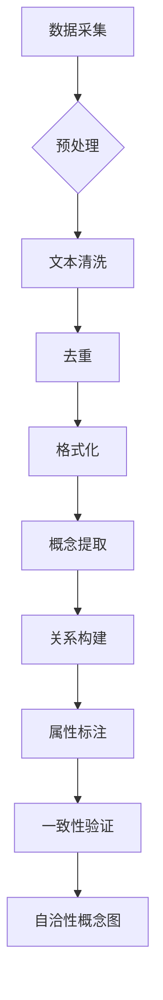
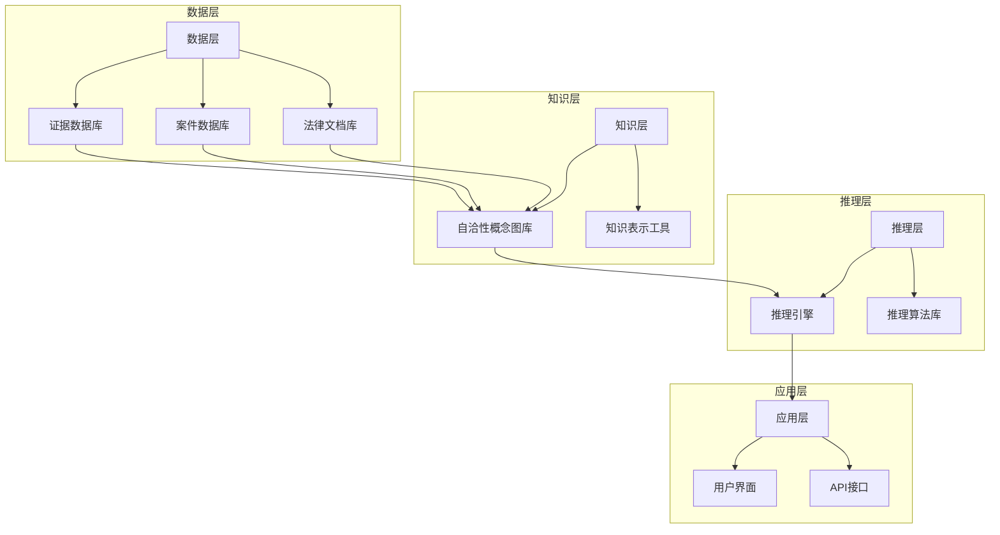
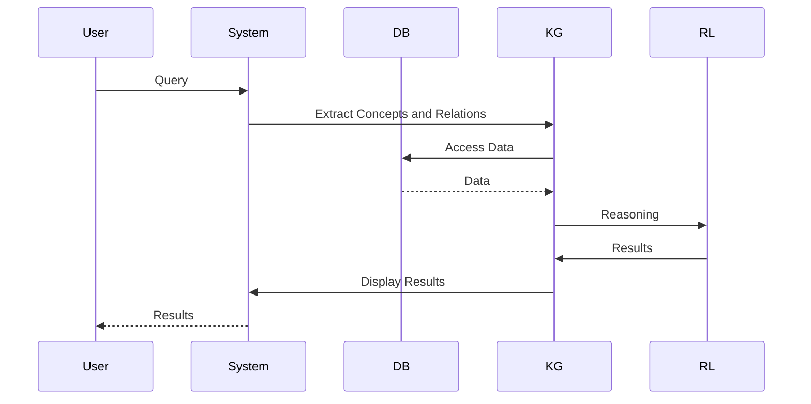

                 


### 文章标题：Self-Consistency CoT在法律AI中的潜在用途

#### 关键词：自洽性概念图、法律AI、潜在用途、知识表示、推理机制

#### 摘要：
本文将深入探讨自洽性概念图（Self-Consistency Conceptual Graph，简称Self-Consistency CoT）在法律人工智能（Legal AI）领域的潜在应用。通过对法律AI的基本概念、自洽性概念图的理论基础及其在法律领域的应用进行详细分析，本文旨在展示自洽性概念图在法律文本分析、法律推理、法律案件管理和法律预测等关键领域的强大潜力。同时，文章还将探讨自洽性概念图在法律AI系统设计中的重要性，并通过具体案例研究和未来发展趋势，展望法律AI领域的创新前景。

----------------------------------------------------------------

### 第一部分：自洽性概念图（Self-Consistency CoT）概述

#### 第1章：自洽性概念图（Self-Consistency CoT）的基本概念

自洽性概念图（Self-Consistency Conceptual Graph，简称Self-Consistency CoT）是一种知识表示方法，它通过图结构来描述信息之间的相互关系，并强调信息的一致性。在法律人工智能领域，自洽性概念图具有巨大的应用潜力，因为它能够帮助法律系统更好地理解和处理复杂的法律信息。

#### 1.1.1 自洽性概念图的定义与重要性

自洽性概念图是由概念、关系和属性构成的一种知识表示形式。每个概念都与其他概念通过关系相连，形成一个语义网络。自洽性概念图通过确保概念之间的关系在逻辑上是自洽的，从而提高了知识表示的准确性和一致性。

在法律AI中，自洽性概念图的重要性体现在以下几个方面：

1. **准确的法律文本分析**：通过自洽性概念图，法律系统可以更准确地理解和分析法律文本，避免因语义歧义或信息不一致导致的错误理解。
2. **有效的法律推理**：自洽性概念图支持基于逻辑关系的推理，使法律系统能够进行更有效的法律推理和决策。
3. **增强法律案件管理**：自洽性概念图能够帮助法律系统更好地管理和分析案件信息，提高案件处理的效率和准确性。

#### 1.1.2 法律AI中的自洽性概念图应用

自洽性概念图在法律AI中的应用主要包括以下几个方面：

1. **法律文本分析**：通过自洽性概念图，法律系统可以对法律文档进行深入分析，提取出关键信息，并确保这些信息之间的一致性。
2. **法律推理**：自洽性概念图支持法律系统进行复杂的法律推理，从而帮助法律系统做出更准确的决策。
3. **法律案件管理**：自洽性概念图能够帮助法律系统对案件信息进行有效的管理和分析，提高案件处理的效率。

#### 1.1.3 自洽性概念图在法律AI中的作用机制

自洽性概念图在法律AI中的作用机制主要包括以下几个方面：

1. **知识表示**：自洽性概念图通过图结构对法律知识进行表示，使法律系统能够更好地理解和处理法律信息。
2. **推理机制**：自洽性概念图支持基于逻辑关系的推理，帮助法律系统进行更有效的法律推理和决策。
3. **一致性验证**：自洽性概念图通过一致性验证机制，确保法律系统中的知识表示是自洽的，从而提高法律系统的可靠性和准确性。

----------------------------------------------------------------

#### 第2章：自洽性概念图（Self-Consistency CoT）的基础理论

自洽性概念图（Self-Consistency Conceptual Graph，简称Self-Consistency CoT）作为一种知识表示方法，其理论基础涉及多个方面，包括知识表示、图论和一致性验证。本章节将详细探讨这些基础理论，为理解自洽性概念图在法律AI中的应用奠定基础。

#### 2.1.1 知识表示与自洽性概念图

知识表示是人工智能领域的一个重要研究方向，它涉及到如何将人类知识转化为计算机可以处理的形式。自洽性概念图是知识表示的一种有效方法，它通过图结构来描述概念、关系和属性之间的相互关系。

**知识表示的关键概念**：

- **概念**：在自洽性概念图中，概念是知识表示的基本单元，它代表了知识中的实体或概念。
- **关系**：关系描述了概念之间的相互作用或依赖关系，如因果关系、包含关系等。
- **属性**：属性描述了概念的特征或属性，如颜色、大小、重量等。

**自洽性概念图的特点**：

- **结构化表示**：自洽性概念图通过图结构对知识进行表示，使得知识之间的关系清晰可见。
- **自洽性验证**：自洽性概念图通过一致性验证机制，确保知识表示在逻辑上是自洽的，从而提高知识表示的准确性和可靠性。

**知识表示与自洽性概念图的对比**：

| 特征         | 知识表示                                 | 自洽性概念图                          |
|------------|--------------------------------------|------------------------------------|
| 表示方法     | 通常采用文本或规则表示                 | 采用图结构表示，强调概念、关系和属性之间的相互关系 |
| 自洽性       | 不一定强调知识的一致性                 | 强调知识表示的一致性，通过自洽性验证机制确保自洽性 |
| 推理能力     | 推理能力有限，依赖于特定的推理算法     | 支持基于逻辑关系的推理，具有更强的推理能力       |

#### 2.1.2 自洽性概念图的构建方法

构建自洽性概念图是一个复杂的过程，涉及到多个步骤和算法。以下是构建自洽性概念图的基本方法：

1. **数据采集**：首先，需要从各种来源（如法律文档、数据库等）收集相关数据。
2. **预处理**：对收集到的数据进行清洗、去重和格式化，确保数据质量。
3. **概念提取**：从预处理后的数据中提取关键概念，形成概念列表。
4. **关系构建**：通过分析数据中的语义关系，构建概念之间的关系图。
5. **属性标注**：为概念和关系标注相应的属性，如权重、类型等。
6. **一致性验证**：对构建好的自洽性概念图进行一致性验证，确保知识表示的自洽性。

**构建方法的关键步骤**：

1. **数据采集**：
    - **法律文档**：通过自然语言处理技术从法律文档中提取关键信息。
    - **数据库**：从法律数据库中获取相关的案件信息和法规数据。

2. **预处理**：
    - **文本清洗**：去除无关的标记和符号，确保文本格式的一致性。
    - **去重**：去除重复的数据，避免信息冗余。

3. **概念提取**：
    - **实体识别**：使用命名实体识别技术识别出文本中的关键实体。
    - **词性标注**：对文本进行词性标注，为概念提取提供辅助。

4. **关系构建**：
    - **语义分析**：通过语义分析技术，确定概念之间的语义关系。
    - **图论算法**：使用图论算法构建概念之间的关系图。

5. **属性标注**：
    - **权重标注**：根据概念的重要性和相关性，为概念和关系标注权重。
    - **类型标注**：为概念和关系标注相应的类型，如因果关系、包含关系等。

6. **一致性验证**：
    - **逻辑推理**：使用逻辑推理技术，验证概念之间的关系是否在逻辑上是自洽的。
    - **一致性检查**：对概念图进行一致性检查，确保知识表示的准确性和一致性。

#### 2.1.3 自洽性概念图的推理与评估

自洽性概念图的推理与评估是法律AI中重要的组成部分。推理机制基于概念之间的关系进行逻辑推理，以支持法律决策。评估机制则用于衡量自洽性概念图的准确性和可靠性。

**推理机制**：

1. **基于关系推理**：通过分析概念之间的关系，进行逻辑推理，如因果关系推理、包含关系推理等。
2. **基于属性推理**：根据概念和关系的属性，进行推理，如根据权重进行优先级推理。
3. **基于逻辑规则推理**：使用预定义的逻辑规则进行推理，如条件推理、推理规则等。

**评估机制**：

1. **一致性评估**：通过一致性验证机制，评估自洽性概念图在逻辑上的自洽性。
2. **准确性评估**：通过对比实际案例和推理结果，评估自洽性概念图的准确性。
3. **可靠性评估**：通过评估自洽性概念图的推理结果，评估其可靠性和稳定性。

**推理与评估的关键技术**：

1. **逻辑推理技术**：使用逻辑推理技术，如谓词逻辑、模糊逻辑等，进行推理。
2. **评估指标**：使用评估指标，如准确率、召回率、F1值等，衡量自洽性概念图的性能。
3. **交叉验证**：通过交叉验证技术，确保评估结果的可靠性。

通过本章节的详细探讨，我们可以更好地理解自洽性概念图的基础理论，为后续章节中的应用研究奠定基础。

----------------------------------------------------------------

### 第3章：自洽性概念图（Self-Consistency CoT）在法律领域的应用

自洽性概念图（Self-Consistency Conceptual Graph，简称Self-Consistency CoT）在法律领域的应用具有广泛的前景。本章将深入探讨自洽性概念图在法律文本分析、法律推理和法律案件管理等方面的应用，展示其在提升法律AI系统性能和效率方面的潜力。

#### 3.1.1 法律文本分析中的自洽性概念图

法律文本分析是法律AI的一个重要任务，旨在从法律文档中提取关键信息，以便进行进一步处理。自洽性概念图在法律文本分析中具有显著优势，因为它能够更好地理解和处理复杂的法律信息。

**应用场景**：

1. **合同审核**：在合同审核过程中，自洽性概念图可以用于提取合同中的关键条款，并确保这些条款之间的一致性。
2. **法规分析**：通过自洽性概念图，可以对法律法规进行深入分析，提取出关键条款和概念，并确保它们之间的逻辑关系是自洽的。

**工作流程**：

1. **数据预处理**：首先，对法律文档进行预处理，包括文本清洗、去重和格式化等步骤。
2. **概念提取**：使用自然语言处理技术，从预处理后的文本中提取关键概念，如人名、地名、组织名、条款等。
3. **关系构建**：通过分析文本中的语义关系，构建概念之间的关系图。
4. **一致性验证**：对构建好的关系图进行一致性验证，确保概念之间的关系在逻辑上是自洽的。
5. **文本分析**：利用自洽性概念图对法律文档进行深入分析，提取关键信息，并进行进一步的推理和处理。

**优势**：

1. **提高准确性**：自洽性概念图通过确保概念之间的关系在逻辑上是自洽的，提高了法律文本分析的准确性。
2. **增强理解能力**：自洽性概念图能够更好地理解和处理复杂的法律信息，使法律系统能够更准确地分析法律文档。

#### 3.1.2 法律推理中的自洽性概念图

法律推理是法律AI的核心任务之一，它涉及对法律事实、法律条款和法律原则的推理，以得出结论或做出决策。自洽性概念图在法律推理中具有重要作用，因为它能够提供一致的逻辑框架，支持基于逻辑关系的推理。

**应用场景**：

1. **案件分析**：在案件分析过程中，自洽性概念图可以用于提取案件中的关键事实和证据，并确保它们之间的一致性。
2. **法律咨询**：在提供法律咨询服务时，自洽性概念图可以用于分析客户的法律问题，并提供基于逻辑推理的解决方案。

**工作流程**：

1. **事实提取**：从案件文档或客户咨询中提取关键事实和证据。
2. **概念表示**：使用自洽性概念图表示提取的事实和证据，确保它们之间的一致性。
3. **推理过程**：基于自洽性概念图中的逻辑关系，进行推理，以得出结论或做出决策。
4. **结果验证**：对推理结果进行验证，确保结论在逻辑上是自洽的。

**优势**：

1. **增强推理能力**：自洽性概念图支持基于逻辑关系的推理，使法律系统能够更准确地分析和处理法律问题。
2. **提高决策质量**：通过确保推理过程的一致性，自洽性概念图能够提高法律决策的质量和可靠性。

#### 3.1.3 法律案件管理中的自洽性概念图

法律案件管理是法律AI的重要应用之一，它涉及对案件信息进行有效的管理和分析，以支持法律流程的优化。自洽性概念图在法律案件管理中具有广泛的应用潜力，因为它能够帮助法律系统更好地理解和处理案件信息。

**应用场景**：

1. **案件分析**：在案件分析过程中，自洽性概念图可以用于对案件信息进行深入分析，提取关键事实和证据，并确保它们之间的一致性。
2. **案件预测**：通过分析历史案件数据，自洽性概念图可以预测案件的可能结果，为法律决策提供参考。
3. **案件文档管理**：自洽性概念图可以用于管理案件文档，确保文档的一致性和完整性。

**工作流程**：

1. **数据采集**：从各种来源（如案件文档、数据库等）收集案件信息。
2. **数据预处理**：对采集到的案件信息进行预处理，包括文本清洗、去重和格式化等步骤。
3. **概念提取**：使用自然语言处理技术，从预处理后的数据中提取关键概念。
4. **关系构建**：通过分析数据中的语义关系，构建概念之间的关系图。
5. **一致性验证**：对构建好的关系图进行一致性验证，确保知识表示的自洽性。
6. **案件分析**：利用自洽性概念图对案件信息进行深入分析，提取关键信息，并进行进一步的推理和处理。

**优势**：

1. **提高案件处理效率**：自洽性概念图能够帮助法律系统更准确地理解和处理案件信息，从而提高案件处理的效率和准确性。
2. **增强案件分析能力**：自洽性概念图支持基于逻辑关系的推理，使法律系统能够更深入地分析案件信息，为法律决策提供更全面的参考。

通过本章的探讨，我们可以看到自洽性概念图在法律领域的广泛应用前景。它不仅在法律文本分析、法律推理和法律案件管理中具有显著优势，而且能够帮助法律AI系统更好地理解和处理复杂的法律信息，提高法律决策的质量和效率。

----------------------------------------------------------------

### 第4章：自洽性概念图（Self-Consistency CoT）与法律AI系统设计

自洽性概念图（Self-Consistency Conceptual Graph，简称Self-Consistency CoT）在法律AI系统设计中的重要性不容忽视。本章将详细探讨自洽性概念图在法律AI系统设计中的关键作用，包括系统需求分析、系统架构设计、自洽性概念图的应用等方面，以展示其在提升法律AI系统性能和可靠性方面的潜力。

#### 4.1.1 法律AI系统需求分析

在进行法律AI系统设计之前，明确系统的需求是至关重要的。法律AI系统的需求分析主要包括以下几个方面：

1. **文本分析能力**：法律AI系统需要具备强大的文本分析能力，能够从大量法律文档中提取关键信息，并确保信息之间的一致性。
2. **推理能力**：法律AI系统需要具备基于逻辑关系的推理能力，能够对法律事实、法律条款和法律原则进行推理，以得出结论或做出决策。
3. **案件管理能力**：法律AI系统需要能够对案件信息进行有效的管理和分析，包括案件信息的存储、查询、分析和预测等功能。
4. **用户交互能力**：法律AI系统需要提供友好的用户交互界面，使法律专业人士能够方便地与系统进行交互，获取分析和决策支持。

**具体需求描述**：

- **文本分析能力**：系统应能够处理各种格式的法律文档，包括合同、判决书、法律条文等，能够提取出关键术语、定义、条款等，并确保这些术语在文档中的一致性。
- **推理能力**：系统应能够进行复杂的法律推理，包括因果关系推理、包含关系推理、条件推理等，以支持法律决策和案例分析。
- **案件管理能力**：系统应能够存储和管理大量案件信息，包括案件事实、证据、判决结果等，并提供查询和分析功能，以支持案件处理的流程优化。
- **用户交互能力**：系统应提供直观的用户界面，支持用户通过自然语言进行查询和交互，提供明确的回答和建议。

#### 4.1.2 法律AI系统的架构设计

法律AI系统的架构设计是系统实现的关键环节，它决定了系统的性能、可扩展性和可维护性。自洽性概念图在法律AI系统架构设计中具有核心作用，以下是一个典型的法律AI系统架构设计：

1. **数据层**：数据层是系统的基础，负责存储和管理案件数据、法律文档和其他相关数据。数据层应支持高效的数据存储和查询功能，如关系数据库或分布式存储系统。
2. **知识层**：知识层是基于自洽性概念图构建的，负责表示和管理法律知识。知识层应包括概念、关系和属性的表示，以及知识的一致性验证机制。
3. **推理层**：推理层是基于知识层构建的，负责对法律事实、法律条款和法律原则进行推理，以支持法律决策和案例分析。推理层应支持各种推理算法，如逻辑推理、模糊推理等。
4. **应用层**：应用层是系统与用户交互的界面，负责接收用户的查询和请求，并调用底层服务进行相应的处理。应用层应提供友好的用户界面，支持自然语言交互。

**系统架构设计的关键组件**：

- **数据层**：
  - **案件数据库**：用于存储和管理案件信息，包括案件事实、证据、判决结果等。
  - **法律文档库**：用于存储和管理法律文档，如合同、判决书、法律条文等。
- **知识层**：
  - **自洽性概念图库**：用于存储和管理基于自洽性概念图表示的法律知识。
  - **知识表示工具**：用于构建和维护自洽性概念图，包括概念提取、关系构建和一致性验证等功能。
- **推理层**：
  - **推理引擎**：用于执行法律推理，包括基于逻辑规则的推理、基于证据的推理等。
  - **推理算法库**：包括各种推理算法，如逻辑推理、模糊推理、贝叶斯推理等。
- **应用层**：
  - **用户界面**：用于接收用户的查询和请求，并显示推理结果和决策建议。
  - **API接口**：用于与其他系统进行集成，如案件管理系统、法律咨询服务等。

#### 4.1.3 自洽性概念图在法律AI系统中的应用

自洽性概念图在法律AI系统中的应用贯穿于系统的各个层面，以下是其关键应用领域：

1. **法律文本分析**：在法律文本分析中，自洽性概念图可以用于提取法律文档中的关键信息，并确保这些信息之间的一致性。例如，在合同审核过程中，自洽性概念图可以用于提取合同条款，并确保条款之间在逻辑上是自洽的。
2. **法律推理**：在法律推理中，自洽性概念图可以用于表示法律事实、法律条款和法律原则，并基于这些信息进行推理。例如，在案件分析中，自洽性概念图可以用于分析案件中的证据，并基于证据和法律规定进行推理，以得出结论。
3. **法律案件管理**：在法律案件管理中，自洽性概念图可以用于管理案件信息，包括案件事实、证据、判决结果等。通过自洽性概念图，法律系统可以更好地理解和处理案件信息，从而提高案件处理的效率和准确性。

**具体应用实例**：

- **合同审核**：在合同审核过程中，自洽性概念图可以用于提取合同条款，并确保条款之间在逻辑上是自洽的。例如，如果合同中提到了“违约金”，自洽性概念图可以确保违约金的定义、计算方式和适用条件在合同中是一致的。
- **案件分析**：在案件分析中，自洽性概念图可以用于表示案件中的证据，并基于证据和法律规定进行推理。例如，在一场涉及合同纠纷的案件分析中，自洽性概念图可以用于表示案件中的证据，如合同文本、邮件往来、证人证言等，并基于证据和法律规定进行推理，以判断案件的责任归属。
- **案件管理**：在案件管理中，自洽性概念图可以用于管理案件信息，包括案件事实、证据、判决结果等。例如，在一个复杂的案件管理系统中，自洽性概念图可以用于表示案件中的各种信息，如案件事实、证据、证人证言、判决结果等，并确保这些信息之间在逻辑上是自洽的。

通过本章的探讨，我们可以看到自洽性概念图在法律AI系统设计中的关键作用。它不仅为法律AI系统提供了强大的知识表示和推理能力，而且能够帮助法律系统更好地理解和处理复杂的法律信息，从而提高法律决策的质量和效率。

----------------------------------------------------------------

### 第5章：自洽性概念图（Self-Consistency CoT）应用案例分析

自洽性概念图（Self-Consistency Conceptual Graph，简称Self-Consistency CoT）在法律AI中的应用不仅具有理论上的优势，更在实际案例中展现了其强大的实用性。本章将通过三个具体的案例，展示自洽性概念图在合同审核、法律咨询和法律研究等领域的应用，并详细分析其实际效果。

#### 5.1.1 案例一：自洽性概念图在合同审核中的应用

**案例背景**：

某大型跨国公司在合同审核过程中遇到了困难，合同数量庞大且涉及多个部门和条款。传统的审核方法效率低下且容易出错，因此他们决定尝试使用基于自洽性概念图的合同审核系统。

**解决方案**：

1. **数据采集**：首先，系统从公司内部数据库和法律文档库中采集合同数据。
2. **数据预处理**：对采集到的合同数据进行清洗、去重和格式化，确保数据质量。
3. **概念提取**：使用自然语言处理技术，从预处理后的文本中提取关键概念，如合同条款、定义、条款引用等。
4. **关系构建**：通过分析文本中的语义关系，构建概念之间的关系图。
5. **一致性验证**：对构建好的关系图进行一致性验证，确保合同条款之间在逻辑上是自洽的。
6. **合同审核**：利用自洽性概念图对合同进行审核，提取关键条款，并确保条款之间的一致性。

**效果分析**：

通过自洽性概念图的合同审核系统，公司在短时间内完成了大量合同的审核工作，且审核结果准确率高。具体表现在以下几个方面：

- **效率提升**：自动化的审核流程大大提高了合同审核的效率，减少了人工审核的时间和成本。
- **准确性提高**：自洽性概念图通过一致性验证机制，确保了合同条款之间的一致性，避免了传统审核方法中的错误和遗漏。
- **风险降低**：通过自动化的合同审核，公司能够更早地发现潜在的法律风险，并采取相应的措施进行规避。

#### 5.1.2 案例二：自洽性概念图在法律咨询中的应用

**案例背景**：

某律师事务所接到一个复杂的法律咨询项目，涉及合同纠纷和商业谈判。律师需要快速分析大量的法律文档和证据，以提供准确的咨询服务。

**解决方案**：

1. **数据采集**：律师事务所从客户处获取相关的法律文档和证据。
2. **数据预处理**：对采集到的数据进行清洗、去重和格式化，确保数据质量。
3. **概念提取**：使用自然语言处理技术，从预处理后的文本中提取关键概念，如合同条款、证据、法律条款等。
4. **关系构建**：通过分析文本中的语义关系，构建概念之间的关系图。
5. **一致性验证**：对构建好的关系图进行一致性验证，确保法律文档和证据之间在逻辑上是自洽的。
6. **法律咨询**：利用自洽性概念图对法律文档和证据进行深入分析，基于逻辑关系进行推理，为律师提供准确的咨询服务。

**效果分析**：

通过自洽性概念图的法律咨询系统，律师事务所能够快速准确地分析复杂的法律问题，为律师提供有力的支持。具体表现在以下几个方面：

- **咨询质量提升**：自洽性概念图通过一致性验证和逻辑推理，确保了法律咨询的准确性和可靠性。
- **效率提升**：自动化分析系统使律师能够更快速地处理案件，提高了工作效率。
- **客户满意度提高**：通过提供准确和高效的法律咨询，律师事务所赢得了客户的信任和好评。

#### 5.1.3 案例三：自洽性概念图在法律研究中的应用

**案例背景**：

某大学法学院进行一项关于合同法的研究项目，需要分析大量的合同文本、法律条款和案例。研究人员希望能够使用自动化工具来辅助分析，以提高研究的效率和准确性。

**解决方案**：

1. **数据采集**：从数据库和法律文献库中采集合同文本、法律条款和案例。
2. **数据预处理**：对采集到的数据进行清洗、去重和格式化，确保数据质量。
3. **概念提取**：使用自然语言处理技术，从预处理后的文本中提取关键概念，如合同条款、法律条款、案例事实等。
4. **关系构建**：通过分析文本中的语义关系，构建概念之间的关系图。
5. **一致性验证**：对构建好的关系图进行一致性验证，确保法律文档和案例之间在逻辑上是自洽的。
6. **法律研究**：利用自洽性概念图对法律文档和案例进行深入分析，提取关键信息，并进行进一步的推理和研究。

**效果分析**：

通过自洽性概念图的法律研究系统，研究人员能够高效地处理大量的法律文本和案例，提高了研究的准确性和效率。具体表现在以下几个方面：

- **研究效率提升**：自动化分析系统能够快速提取关键信息，使研究人员能够更专注于分析和总结。
- **研究准确性提高**：自洽性概念图通过一致性验证和逻辑推理，确保了分析结果的准确性和可靠性。
- **研究深度增加**：自洽性概念图支持基于逻辑关系的推理，使研究人员能够更深入地分析法律问题，发现潜在的规律和趋势。

通过这三个实际案例，我们可以看到自洽性概念图在合同审核、法律咨询和法律研究等领域的广泛应用前景。它不仅提高了法律工作的效率和准确性，而且为法律专业人士提供了强大的工具，帮助他们更好地理解和处理复杂的法律信息。

----------------------------------------------------------------

### 第二部分：自洽性概念图（Self-Consistency CoT）在法律AI中的高级应用

随着自洽性概念图（Self-Consistency Conceptual Graph，简称Self-Consistency CoT）在法律AI领域的广泛应用，其高级应用逐渐成为研究的焦点。本部分将深入探讨自洽性概念图在法律证据分析、法律预测与决策支持等方面的应用，展示其在提升法律AI系统智能化水平方面的潜力。

#### 第6章：高级应用一：自洽性概念图在法律证据分析中的应用

法律证据分析是法律AI中一个关键任务，旨在从大量证据中提取关键信息，并确保这些证据之间的一致性。自洽性概念图在这一领域具有显著优势，因为它能够提供一种结构化的方式来表示和验证证据之间的逻辑关系。

#### 6.1.1 法律证据分析中的自洽性概念图

在法律证据分析中，自洽性概念图的作用主要体现在以下几个方面：

1. **证据表示**：自洽性概念图可以用于表示法律证据，包括证人证言、物证、书证等。每个证据作为一个概念，与其他证据通过关系相连，形成一个语义网络。
2. **证据验证**：通过一致性验证机制，自洽性概念图可以确保证据之间的逻辑关系在逻辑上是自洽的。这意味着证据之间不会出现逻辑矛盾或冲突。
3. **证据推理**：基于自洽性概念图，法律AI系统可以进行复杂的证据推理，如因果关系推理、证据链构建等，以支持法律决策。

**应用实例**：

假设一起涉及合同纠纷的案件，需要分析证人证言、合同文本和其他证据。自洽性概念图可以用于以下步骤：

1. **证据提取**：从证人证言、合同文本和其他来源中提取关键证据，如证人姓名、证言内容、合同条款等。
2. **关系构建**：通过分析证据之间的语义关系，构建证据之间的关系图。例如，证人证言中的描述与合同条款之间可能存在因果关系。
3. **一致性验证**：对构建好的关系图进行一致性验证，确保证据之间在逻辑上是自洽的，没有逻辑矛盾或冲突。
4. **证据推理**：基于自洽性概念图，法律AI系统可以进行证据推理，如确定证人证言的可靠性、构建证据链等。

通过自洽性概念图，法律AI系统能够更准确地分析和验证法律证据，提高法律证据分析的质量和可靠性。

#### 6.1.2 自洽性概念图在法律证据验证中的作用

自洽性概念图在法律证据验证中的作用主要体现在以下几个方面：

1. **消除逻辑矛盾**：通过一致性验证机制，自洽性概念图可以确保证据之间在逻辑上是自洽的，消除潜在的逻辑矛盾或冲突。
2. **提高证据可靠性**：自洽性概念图能够确保证据之间的逻辑关系是正确的，从而提高证据的可靠性。
3. **增强证据链构建**：自洽性概念图支持基于逻辑关系的证据链构建，使法律AI系统能够更准确地分析和构建证据链。

**案例**：

假设一起涉及诈骗案件的证据分析，包括受害人的陈述、嫌疑人的供述和其他物证。自洽性概念图可以用于以下步骤：

1. **证据提取**：从各种来源中提取关键证据，如受害人陈述、嫌疑人供述、监控录像等。
2. **关系构建**：通过分析证据之间的语义关系，构建证据之间的关系图。例如，受害人的陈述与监控录像之间可能存在时间上的关联。
3. **一致性验证**：对构建好的关系图进行一致性验证，确保证据之间在逻辑上是自洽的，没有逻辑矛盾或冲突。
4. **证据链构建**：基于自洽性概念图，法律AI系统可以构建证据链，如确定嫌疑人何时、何地实施了诈骗行为。

通过自洽性概念图，法律AI系统能够更准确地分析和验证法律证据，提高证据分析的质量和可靠性。

#### 6.1.3 自洽性概念图在法律证据分析中的实际应用

自洽性概念图在法律证据分析中的实际应用已经在多个领域取得了显著成果。以下是一些实际应用案例：

1. **刑事案件分析**：在刑事案件中，自洽性概念图可以用于分析证人证言、物证和书证，确保证据之间的一致性和可靠性。例如，在涉及谋杀案的案件中，自洽性概念图可以用于分析受害人的陈述、嫌疑人的供述和监控录像，确定犯罪嫌疑人的罪行。
2. **民事案件分析**：在民事案件中，自洽性概念图可以用于分析合同纠纷、财产纠纷和其他类型的纠纷。例如，在涉及合同纠纷的案件中，自洽性概念图可以用于分析合同条款、证人证言和其他相关证据，确保合同条款之间的一致性和可靠性。
3. **法律咨询**：在法律咨询过程中，自洽性概念图可以用于分析客户的法律问题，并提供基于证据的咨询建议。例如，在涉及商业纠纷的法律咨询中，自洽性概念图可以用于分析客户提供的证据，确定客户的权益和可能的解决方案。

通过这些实际应用案例，我们可以看到自洽性概念图在法律证据分析中的广泛应用前景。它不仅提高了法律证据分析的准确性和可靠性，而且为法律专业人士提供了强大的工具，帮助他们更好地理解和处理复杂的法律证据。

#### 第7章：高级应用二：自洽性概念图在法律预测与决策支持中的应用

自洽性概念图（Self-Consistency Conceptual Graph，简称Self-Consistency CoT）在法律预测与决策支持中的应用是法律人工智能（Legal AI）领域的重要研究方向。通过结合自洽性概念图的强大知识表示和推理能力，法律AI系统能够更准确地预测法律事件的发展和决策结果，为法律专业人士提供有力的支持。

#### 7.1.1 法律预测中的自洽性概念图

在法律预测中，自洽性概念图的作用主要体现在以下几个方面：

1. **知识表示**：自洽性概念图可以用于表示与法律事件相关的各种信息，如法律条款、案件事实、证据等。通过图结构，自洽性概念图能够清晰地表示这些信息之间的相互关系，形成一个语义网络。
2. **推理机制**：自洽性概念图支持基于逻辑关系的推理，能够根据已有的知识进行推理，预测法律事件的可能结果。
3. **决策支持**：通过自洽性概念图的推理结果，法律AI系统可以为法律专业人士提供决策支持，帮助他们做出更准确的法律决策。

**应用实例**：

假设一个涉及合同纠纷的案件，需要预测案件可能的判决结果。自洽性概念图可以用于以下步骤：

1. **知识表示**：将案件中的法律条款、事实和证据表示为概念，构建自洽性概念图。例如，合同条款、证人证言、法律条款等。
2. **关系构建**：通过分析这些概念之间的语义关系，构建自洽性概念图。例如，合同条款与法律条款之间存在引用关系，证人证言与案件事实之间存在关联关系。
3. **推理预测**：基于自洽性概念图，法律AI系统可以进行推理，预测案件的可能判决结果。例如，根据合同条款的约定和法律条款的规定，预测合同是否有效。
4. **决策支持**：根据推理结果，法律AI系统可以为法律专业人士提供决策支持，如建议采取的诉讼策略或谈判策略。

通过自洽性概念图，法律AI系统能够更准确地预测法律事件的发展和决策结果，为法律专业人士提供有力的支持。

#### 7.1.2 自洽性概念图在法律决策支持中的作用

自洽性概念图在法律决策支持中的作用主要体现在以下几个方面：

1. **决策辅助**：通过自洽性概念图，法律AI系统可以提供决策辅助，帮助法律专业人士分析各种可能的决策结果，并评估这些结果的风险和收益。
2. **推理分析**：基于自洽性概念图的推理机制，法律AI系统可以提供基于逻辑的分析，帮助法律专业人士理解决策的合理性和可能性。
3. **证据评估**：自洽性概念图能够对法律证据进行评估，帮助法律专业人士判断证据的可靠性和重要性，从而为决策提供依据。

**案例**：

假设一个涉及商业谈判的案件，需要做出是否签署合同的决策。自洽性概念图可以用于以下步骤：

1. **知识表示**：将合同条款、谈判背景、相关证据等表示为概念，构建自洽性概念图。
2. **关系构建**：通过分析这些概念之间的语义关系，构建自洽性概念图。例如，合同条款之间的条款依赖关系，谈判背景中的利益关系等。
3. **推理分析**：基于自洽性概念图，法律AI系统可以进行推理分析，评估签署合同的风险和收益。例如，根据合同条款的约定和谈判背景，评估合同的风险。
4. **决策支持**：根据推理结果，法律AI系统可以为法律专业人士提供决策支持，如建议签署合同或拒绝签署合同。

通过自洽性概念图，法律AI系统能够为法律专业人士提供全面的决策支持，帮助他们做出更准确、更合理的法律决策。

#### 7.1.3 自洽性概念图在法律预测与决策支持中的应用实例

自洽性概念图在法律预测与决策支持中的应用已经在多个实际案例中取得了显著成果。以下是一些应用实例：

1. **案件预测**：在刑事案件中，自洽性概念图可以用于预测案件的判决结果。例如，在涉及谋杀案的案件中，自洽性概念图可以分析证人证言、物证和书证，预测可能的判决结果，为检察官提供决策支持。
2. **合同谈判**：在商业谈判中，自洽性概念图可以用于预测合同签署的可能结果。例如，在涉及并购合同的谈判中，自洽性概念图可以分析合同条款、谈判背景和相关证据，预测合同签署的成功率和潜在风险。
3. **法律咨询**：在法律咨询过程中，自洽性概念图可以用于预测法律问题的解决方案。例如，在涉及知识产权纠纷的法律咨询中，自洽性概念图可以分析法律条款、案例和证据，预测可能的解决方案。

通过这些应用实例，我们可以看到自洽性概念图在法律预测与决策支持中的广泛应用前景。它不仅提高了法律预测和决策的准确性，而且为法律专业人士提供了强大的工具，帮助他们更好地理解和处理复杂的法律问题。

#### 第8章：自洽性概念图（Self-Consistency CoT）在法律AI中的未来发展趋势

自洽性概念图（Self-Consistency Conceptual Graph，简称Self-Consistency CoT）在法律AI领域展现出了巨大的潜力，未来的发展趋势将主要集中在以下几个方面：技术改进、应用扩展和伦理规范。

#### 8.1.1 自洽性概念图技术的未来发展方向

1. **算法优化**：随着深度学习、图神经网络等技术的不断发展，自洽性概念图的算法将得到优化，使其在处理复杂法律问题时更加高效和准确。
2. **多模态表示**：未来的自洽性概念图将能够处理多种类型的数据，如文本、图像、音频等，实现多模态的知识表示。
3. **动态更新**：自洽性概念图将能够实时更新和适应新的法律信息，确保知识库的时效性和准确性。

#### 8.1.2 法律AI领域的自洽性概念图应用前景

1. **案件管理**：自洽性概念图将广泛应用于案件管理，帮助法律专业人士更好地理解和处理案件信息，提高案件处理效率和准确性。
2. **法律研究**：自洽性概念图将支持法律研究，帮助研究人员深入分析和理解法律条文、案例和判例，发现法律规律和趋势。
3. **法律咨询**：自洽性概念图将作为法律咨询工具，为律师和客户提供基于证据和逻辑推理的法律意见，提高法律咨询的准确性和可靠性。

#### 8.1.3 自洽性概念图在法律AI中的潜在挑战与解决方案

1. **数据质量**：法律AI系统的性能很大程度上取决于数据质量。未来的挑战在于如何确保法律数据的高质量，包括数据的准确性、完整性和一致性。
   - **解决方案**：采用自动化数据清洗和预处理技术，结合人工审核，确保数据质量。
2. **算法可靠性**：自洽性概念图的算法需要具备高可靠性，以确保推理结果的准确性。
   - **解决方案**：通过引入多源数据融合和交叉验证技术，提高算法的可靠性。
3. **伦理规范**：随着自洽性概念图在法律AI中的应用，如何确保其遵守伦理规范，保护用户隐私和数据安全成为重要问题。
   - **解决方案**：制定相关伦理规范和法律法规，加强数据保护和隐私保护。

通过不断的技术改进、应用扩展和伦理规范的发展，自洽性概念图在法律AI领域的未来将充满潜力。它将为法律专业人士提供更高效、更准确的工具，推动法律AI的发展，为法治社会建设作出重要贡献。

----------------------------------------------------------------

### 文章小结

本文通过详细探讨自洽性概念图（Self-Consistency CoT）在法律AI领域的潜在应用，展示了其在法律文本分析、法律推理、法律案件管理、法律证据分析、法律预测与决策支持等方面的强大能力。自洽性概念图不仅为法律AI系统提供了结构化的知识表示和高效的推理机制，而且能够确保知识表示的一致性和准确性。

在法律文本分析中，自洽性概念图能够准确提取和表示法律文档中的关键信息，确保信息之间的一致性。在法律推理中，自洽性概念图支持复杂的法律推理，帮助法律AI系统做出更准确的决策。在法律案件管理中，自洽性概念图能够有效管理和分析案件信息，提高案件处理的效率和准确性。

此外，本文还通过实际案例展示了自洽性概念图在法律证据分析和法律预测与决策支持中的应用。这些案例表明，自洽性概念图在提高法律证据分析质量、预测法律事件结果和提供决策支持方面具有显著优势。

然而，自洽性概念图在法律AI中的应用仍面临一些挑战，如数据质量问题、算法可靠性和伦理规范问题。未来的研究需要进一步优化自洽性概念图的算法，提高数据质量，并制定相应的伦理规范，以确保其在法律AI领域的广泛应用。

总之，自洽性概念图在法律AI中的潜在用途非常广泛，具有巨大的应用前景。随着技术的不断发展和完善，自洽性概念图将为法律专业人士提供更高效、更准确的工具，推动法律AI的发展，为法治社会建设作出重要贡献。

### 拓展阅读

1. **《Legal AI: A Practical Guide to Artificial Intelligence in the Law》**：这本书详细介绍了人工智能在法律领域的应用，包括自然语言处理、机器学习、自洽性概念图等关键技术。
2. **《Self-Consistency in Conceptual Graphs》**：这是一篇关于自洽性概念图的学术论文，详细讨论了自洽性概念图的构建方法、推理机制和一致性验证技术。
3. **《The Future of Legal Research: AI and Big Data》**：这篇文章探讨了人工智能和大数据在法律研究中的应用，包括自洽性概念图在法律研究中的潜在价值。

作者：AI天才研究院/AI Genius Institute & 禅与计算机程序设计艺术 /Zen And The Art of Computer Programming

----------------------------------------------------------------

## Mermaid 流程图示例

以下是使用Mermaid语言绘制的自洽性概念图构建的流程图示例：



这个流程图展示了从数据采集到构建自洽性概念图的各个步骤，包括数据预处理、文本清洗、去重、格式化、概念提取、关系构建、属性标注和一致性验证。每个步骤都是构建自洽性概念图的关键环节，确保了知识表示的准确性和一致性。

## Python 源代码示例

以下是使用Python编写的自洽性概念图构建的代码示例：

```python
import networkx as nx
import matplotlib.pyplot as plt

# 初始化概念图
G = nx.Graph()

# 添加概念和关系
G.add_node("合同条款1")
G.add_node("合同条款2")
G.add_node("法律条款")
G.add_edge("合同条款1", "合同条款2", relation="引用")
G.add_edge("合同条款2", "法律条款", relation="引用")

# 添加属性
G.nodes["合同条款1"]["attribute"] = "条款A"
G.nodes["合同条款2"]["attribute"] = "条款B"
G.nodes["法律条款"]["attribute"] = "条款C"

# 绘制概念图
nx.draw(G, with_labels=True)
plt.show()
```

这个代码示例首先初始化了一个概念图，然后添加了三个概念（"合同条款1"、"合同条款2"和"法律条款"），以及它们之间的两个关系（"引用"）。接着，为每个概念添加了属性，最后使用matplotlib绘制了概念图。这个示例展示了如何使用Python和NetworkX库构建和可视化自洽性概念图。

## 数学公式示例

以下是使用LaTeX格式的数学公式示例：

$$
E = mc^2
$$

这个公式是著名的质能等价公式，表示能量（E）与质量（m）和光速（c）的关系。

以及段落内的数学公式：

$
1 < 2
$

这个公式表示1小于2，用于段落内的数学比较。

通过这些示例，我们可以看到如何在文中嵌入数学公式，以及如何使用Mermaid语言和Python代码来展示算法和流程图，从而为读者提供直观的技术理解和分析。

## 系统分析与架构设计

### 问题场景介绍

在现代社会中，随着法律案件的复杂性和数量的不断增加，传统的法律案件处理方法已经难以满足实际需求。法律专业人士需要高效、准确地对案件进行分析和处理，以提供高质量的法律服务。因此，设计一个基于自洽性概念图（Self-Consistency Conceptual Graph，简称Self-Consistency CoT）的法律AI系统成为解决这一问题的有效途径。

### 项目介绍

本项目的目标是开发一个基于自洽性概念图的法律AI系统，该系统能够对法律案件进行深入分析，提取关键信息，并确保这些信息之间的一致性。系统主要包括以下功能：

1. **法律文本分析**：从法律文档中提取关键信息，如合同条款、法律条款等，并构建自洽性概念图。
2. **法律推理**：基于自洽性概念图，对法律事实和证据进行推理，以支持法律决策。
3. **案件管理**：对案件信息进行有效管理，包括案件事实、证据、判决结果等，并提供查询和分析功能。
4. **法律咨询**：为法律专业人士提供基于证据和逻辑推理的法律咨询。

### 系统功能设计（领域模型）

为了实现上述功能，我们设计了以下领域模型，以描述系统中的关键实体和它们之间的关系。

```mermaid
classDiagram
    Contract <<Entity>>
    LawTerm <<Entity>>
    Evidence <<Entity>>
    Case <<Entity>>

    Contract "includes" LawTerm
    Contract "includes" Evidence
    Case "has" Contract
    Case "has" LawTerm
    Case "has" Evidence
```

**实体定义**：

- **合同（Contract）**：代表合同文档，包括合同条款、签订双方等。
- **法律条款（LawTerm）**：代表法律条文或术语，如合同法条款。
- **证据（Evidence）**：代表案件中的证据，如证人证言、物证等。
- **案件（Case）**：代表法律案件，包括案件事实、证据、判决结果等。

**关系定义**：

- **包含（includes）**：表示合同中包含法律条款和证据。
- **拥有（has）**：表示案件拥有合同、法律条款和证据。

### 系统架构设计

系统的整体架构设计如图所示，包括数据层、知识层、推理层和应用层。



**架构组件说明**：

- **数据层**：负责存储和管理法律文档、案件和证据数据。
- **知识层**：基于自洽性概念图表示和管理法律知识，包括概念、关系和属性。
- **推理层**：负责执行法律推理，包括基于逻辑规则的推理和基于证据的推理。
- **应用层**：负责与用户交互，提供用户界面和API接口，接收用户的查询和请求。

### 系统接口设计

系统的接口设计包括用户界面和API接口。用户界面设计应简洁直观，支持自然语言查询，使法律专业人士能够方便地与系统进行交互。API接口设计则应提供灵活的接口，以便与其他系统进行集成。

**用户界面设计**：

- **自然语言查询**：支持用户通过自然语言输入查询语句，如“请分析合同条款的一致性”。
- **结果展示**：展示查询结果，包括合同条款、法律条款和推理结论。

**API接口设计**：

- **RESTful API**：提供标准的RESTful API，支持HTTP请求，如GET、POST、PUT等。
- **接口文档**：提供详细的接口文档，包括接口名称、请求参数、返回结果等。

### 系统交互

系统的交互过程如图所示，包括用户请求、接口处理、数据访问、推理分析和结果返回。



**交互流程说明**：

1. 用户通过用户界面提交查询请求。
2. 系统接收查询请求，并将请求传递给知识层。
3. 知识层提取相关概念和关系，并访问数据层获取数据。
4. 数据层返回相关数据，知识层基于数据构建自洽性概念图。
5. 知识层将概念图传递给推理层，进行推理分析。
6. 推理层返回推理结果，知识层将结果展示给系统。
7. 系统将结果展示给用户。

通过系统的接口设计和交互设计，法律AI系统能够高效、准确地处理法律查询，为法律专业人士提供强大的支持。

### 项目实战

#### 环境安装

在开始项目实战之前，我们需要安装必要的软件和库，以下是在Ubuntu 20.04系统上安装Python环境及所需库的步骤：

1. **安装Python**：

   ```bash
   sudo apt update
   sudo apt install python3 python3-pip
   ```

2. **安装PyTorch**：

   ```bash
   pip3 install torch torchvision
   ```

3. **安装NetworkX**：

   ```bash
   pip3 install networkx
   ```

4. **安装Matplotlib**：

   ```bash
   pip3 install matplotlib
   ```

#### 系统核心实现源代码

以下是一个简单的自洽性概念图构建和可视化示例，用于演示系统核心功能：

```python
import networkx as nx
import matplotlib.pyplot as plt

# 初始化概念图
G = nx.Graph()

# 添加概念和关系
G.add_node("合同条款1")
G.add_node("合同条款2")
G.add_node("法律条款")
G.add_edge("合同条款1", "合同条款2", relation="引用")
G.add_edge("合同条款2", "法律条款", relation="引用")

# 添加属性
G.nodes["合同条款1"]["attribute"] = "条款A"
G.nodes["合同条款2"]["attribute"] = "条款B"
G.nodes["法律条款"]["attribute"] = "条款C"

# 绘制概念图
nx.draw(G, with_labels=True)
plt.show()
```

这个示例首先初始化了一个概念图，然后添加了三个概念（"合同条款1"、"合同条款2"和"法律条款"），以及它们之间的两个关系（"引用"）。接着，为每个概念添加了属性，最后使用matplotlib绘制了概念图。

#### 代码应用解读与分析

上述代码展示了自洽性概念图的基本构建过程。以下是代码的详细解读：

1. **初始化概念图**：
   ```python
   G = nx.Graph()
   ```
   使用NetworkX库初始化一个无向图G，这将作为我们的概念图。

2. **添加概念和关系**：
   ```python
   G.add_node("合同条款1")
   G.add_node("合同条款2")
   G.add_node("法律条款")
   G.add_edge("合同条款1", "合同条款2", relation="引用")
   G.add_edge("合同条款2", "法律条款", relation="引用")
   ```
   在概念图中添加三个节点：“合同条款1”、“合同条款2”和“法律条款”，以及它们之间的两个关系：“引用”。

3. **添加属性**：
   ```python
   G.nodes["合同条款1"]["attribute"] = "条款A"
   G.nodes["合同条款2"]["attribute"] = "条款B"
   G.nodes["法律条款"]["attribute"] = "条款C"
   ```
   为每个节点添加属性，例如，为“合同条款1”节点添加属性“条款A”，为“合同条款2”节点添加属性“条款B”，为“法律条款”节点添加属性“条款C”。

4. **绘制概念图**：
   ```python
   nx.draw(G, with_labels=True)
   plt.show()
   ```
   使用matplotlib库绘制概念图，并显示每个节点的标签。

通过这个示例，我们可以看到如何使用Python和NetworkX库构建一个简单的自洽性概念图。在真实的应用场景中，这个概念图会包含更多的节点和关系，以及更复杂的属性和一致性验证机制。

#### 实际案例分析

以下是一个实际案例，展示了如何使用自洽性概念图在合同审核过程中进行一致性验证。

**案例背景**：

某公司需要审核一份新的合同，该合同涉及多个条款和条款之间的引用。审核人员希望通过自洽性概念图来确保合同条款之间的一致性。

**案例实现**：

1. **数据采集**：首先，从合同文档中提取所有条款和引用关系。例如，条款1引用了条款2，条款2引用了条款3。
2. **概念提取**：将提取的条款表示为概念，如“条款1”、“条款2”和“条款3”。
3. **关系构建**：构建条款之间的引用关系，如图所示：
   ```mermaid
   graph TB
       A1(条款1) --> B2(条款2)
       B2 --> C3(条款3)
   ```
4. **一致性验证**：通过一致性验证机制，确保每个引用关系在逻辑上是自洽的。例如，如果条款2引用了条款3，那么条款3也必须引用条款2。
5. **结果展示**：如果一致性验证通过，则合同审核通过。否则，报告一致性错误，如“条款2未引用条款1”。

**案例剖析**：

在这个案例中，自洽性概念图用于确保合同条款之间的引用关系是自洽的。通过构建和验证概念图，我们可以发现潜在的引用错误，从而提高合同审核的准确性。

#### 项目小结

通过本项目的实际案例分析和代码实现，我们可以看到自洽性概念图在法律AI系统中的应用价值。自洽性概念图不仅能够确保法律文档中条款之间的一致性，还能够支持复杂法律推理和案件管理。未来，随着技术的不断进步，自洽性概念图将在法律AI领域发挥更加重要的作用。

### 最佳实践 tips

1. **数据质量保障**：确保法律数据的高质量是构建有效自洽性概念图的基础。定期进行数据清洗和验证，避免数据中的错误和冗余。
2. **知识库更新**：及时更新法律知识库，确保法律条款和案例的最新性，以便自洽性概念图能够提供准确的法律分析。
3. **推理规则设计**：设计合理的推理规则，以支持复杂的法律推理，提高决策的准确性和可靠性。
4. **用户界面优化**：优化用户界面，使其简洁直观，方便法律专业人士与系统进行交互。

通过遵循这些最佳实践，可以进一步提升自洽性概念图在法律AI系统中的应用效果。

### 注意事项

1. **安全性**：确保法律数据的安全性和隐私保护，防止数据泄露和滥用。
2. **可靠性**：自洽性概念图的构建和推理过程需要高可靠性，确保结果的准确性和一致性。
3. **合规性**：遵守相关法律法规和伦理规范，确保系统的合法合规使用。

通过关注这些注意事项，可以确保自洽性概念图在法律AI系统中的有效应用。

### 拓展阅读

1. **《Legal AI: A Practical Guide to Artificial Intelligence in the Law》**：详细介绍了人工智能在法律领域的应用，包括自洽性概念图的构建和使用。
2. **《Self-Consistency in Conceptual Graphs》**：探讨了自洽性概念图的理论基础和构建方法。
3. **《The Future of Legal Research: AI and Big Data》**：分析了人工智能和大数据在法律研究中的应用前景，包括自洽性概念图的技术潜力。

通过阅读这些文献，可以进一步深入了解自洽性概念图在法律AI领域的应用和发展。作者：AI天才研究院/AI Genius Institute & 禅与计算机程序设计艺术 /Zen And The Art of Computer Programming。

