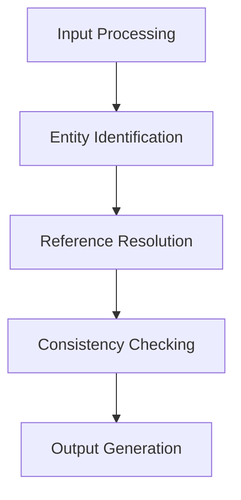
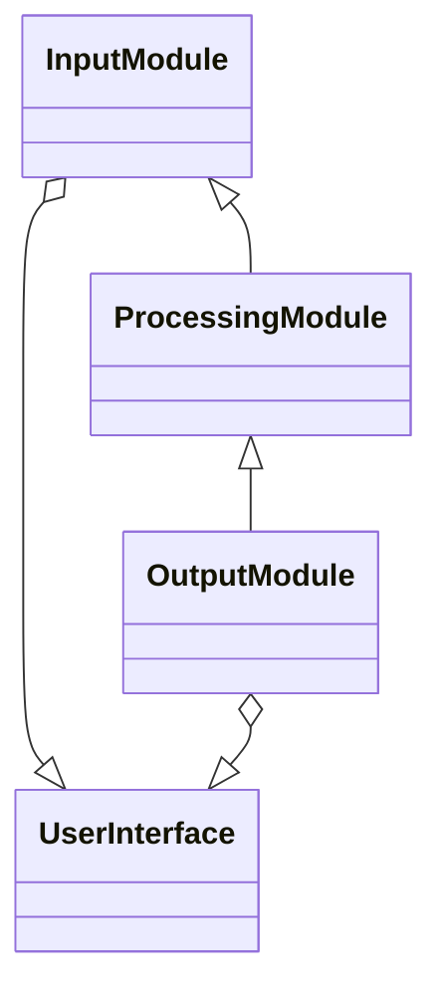
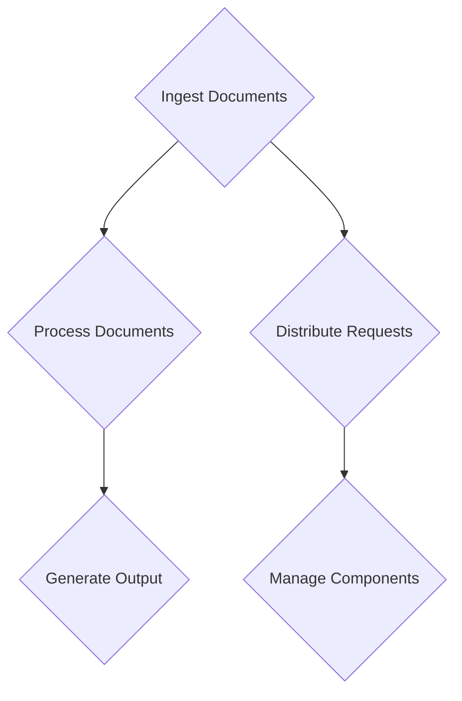
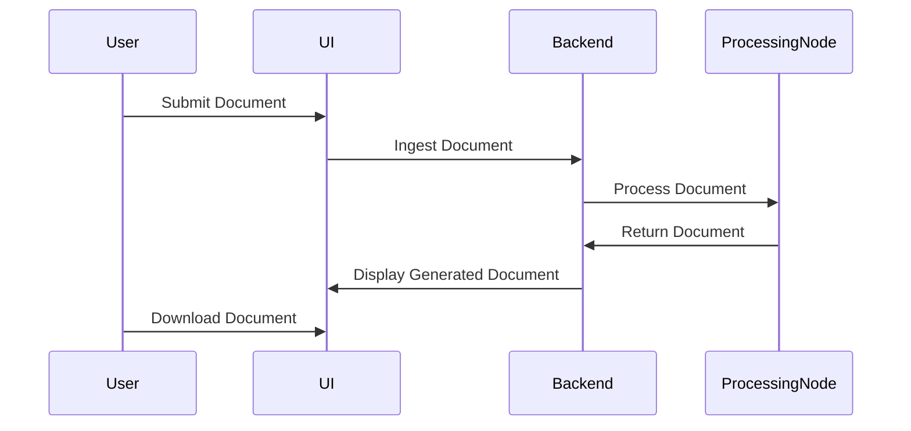
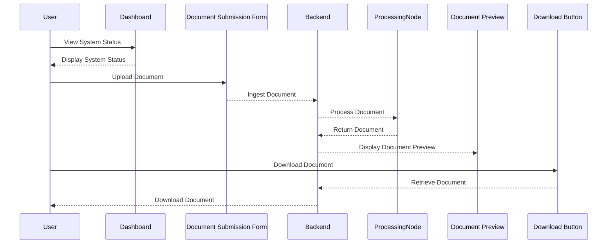
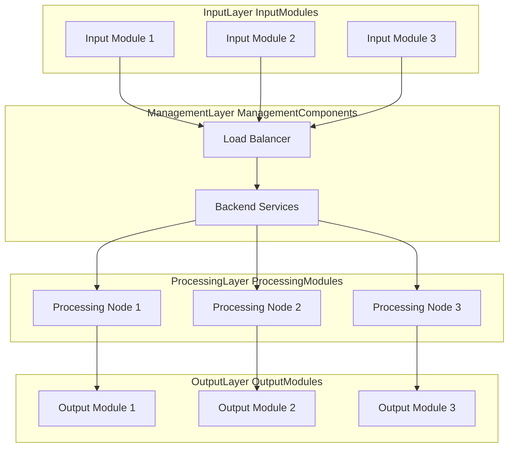
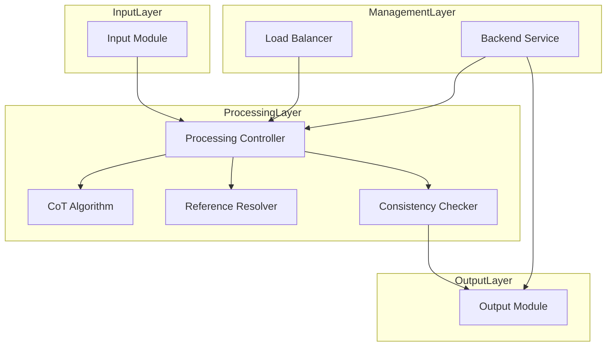
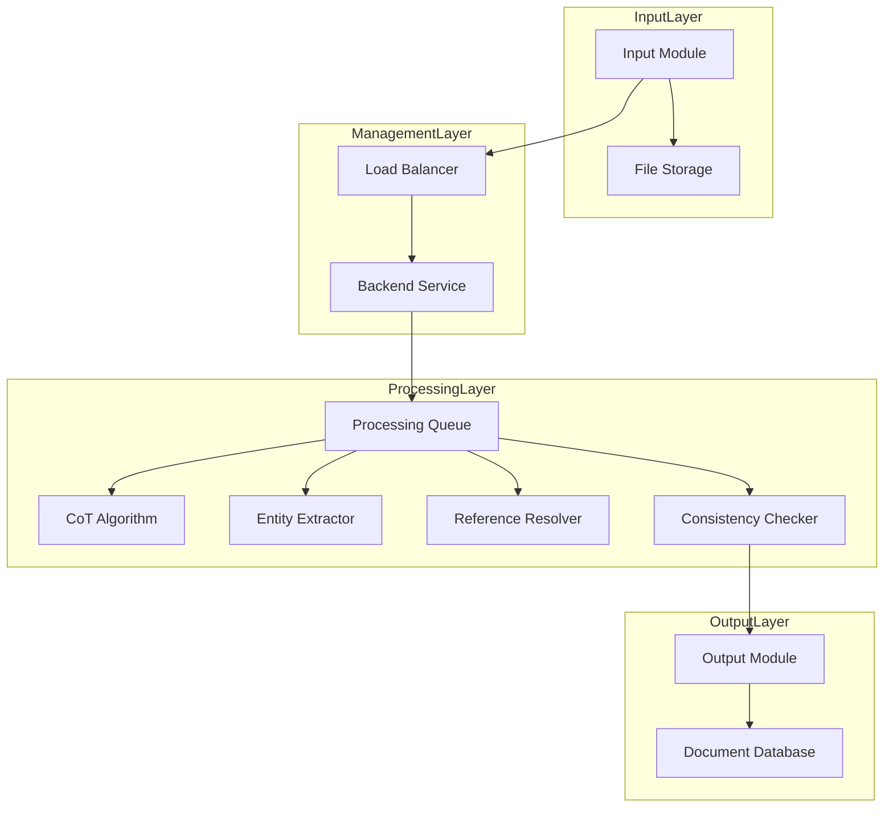
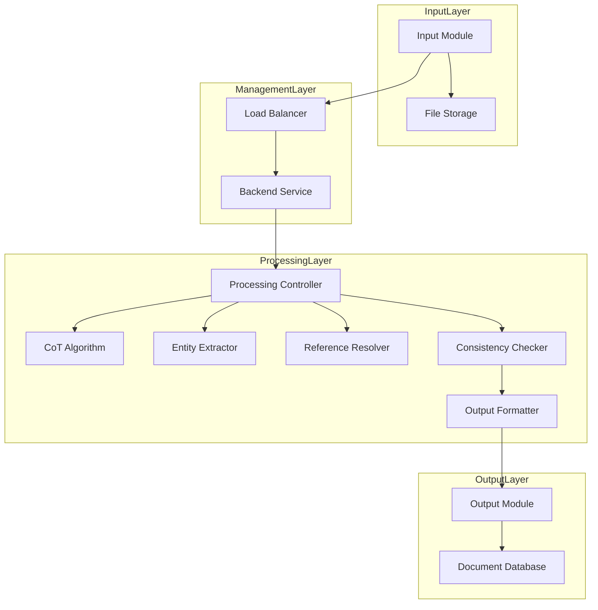

                 


### 1. Introduction to Self-Consistency CoT in Legal Document Generation

#### 1.1 Background and Problem Statement

Legal document generation is an area of great significance in the field of artificial intelligence. As legal documents often contain complex and interrelated information, the manual generation process is time-consuming and prone to errors. Traditional methods of legal document generation often rely on rule-based systems or template-based approaches, which are limited in their ability to handle the dynamic and diverse nature of legal information.

The emergence of coreference resolution techniques has provided a promising solution to this problem. Coreference resolution is the task of identifying when and where in the text two or more mentions of a word or phrase refer to the same entity. By resolving coreferences, legal document generation systems can improve the coherence and consistency of generated documents.

However, traditional coreference resolution methods often struggle with the self-consistency problem. Self-consistency refers to the property where the information provided in a legal document remains consistent throughout its entirety. In other words, the document should not contain any contradictions or inconsistencies that could undermine its credibility and effectiveness.

#### 1.2 The Concept of Self-Consistency CoT

Self-Consistency Coreferral Theory (CoT) is an advanced coreference resolution framework that focuses on maintaining the self-consistency of legal documents. Unlike traditional coreference resolution methods that mainly focus on identifying coreferences, CoT takes into account the broader context and semantic relationships between different parts of the document to ensure self-consistency.

At its core, CoT is based on the principle of self-reference. This principle states that a legal document should reference itself consistently to ensure that the information presented is coherent and accurate. To achieve this, CoT employs several techniques, including:

- **Entity Disambiguation:** This involves identifying and disambiguating entities within the document. By understanding the context in which entities are mentioned, CoT can accurately reference them throughout the document.

- **Contextual Analysis:** CoT analyzes the context in which coreferences occur to ensure that the references are consistent with the surrounding information. This helps prevent contradictions and inconsistencies.

- **Semantic Relationships:** CoT considers the semantic relationships between different entities and concepts within the document. By understanding these relationships, it can maintain the self-consistency of the document even when dealing with complex legal concepts.

#### 1.3 Importance of Self-Consistency CoT in Legal Document Generation

The importance of Self-Consistency CoT in legal document generation cannot be overstated. By ensuring the self-consistency of legal documents, CoT helps to:

- **Enhance Credibility:** Self-consistent legal documents are more trustworthy and credible, as they are less likely to contain errors or contradictions.

- **Improve Accuracy:** By maintaining consistency throughout the document, CoT reduces the likelihood of errors and improves the overall accuracy of the generated document.

- **Simplify Review and Editing:** Self-consistent documents are easier to review and edit, as there are fewer inconsistencies to address.

- **Facilitate Compliance:** In industries where compliance with legal regulations is critical, self-consistent legal documents help ensure that all required information is accurately and consistently presented.

In conclusion, Self-Consistency CoT is a groundbreaking approach to legal document generation that addresses the challenges posed by the dynamic and complex nature of legal information. By ensuring the self-consistency of legal documents, CoT helps to improve their credibility, accuracy, and compliance, making it an invaluable tool in the legal profession.

## 2. Theoretical Framework of Self-Consistency CoT

### 2.1 Coreferral Theory Basics

Coreference resolution is a fundamental task in natural language processing (NLP) that aims to identify when and where two or more mentions in a text refer to the same entity. This task is crucial in various applications, including machine translation, information extraction, and question answering, as well as in legal document generation. Understanding coreference resolution is essential for comprehending the underlying principles of Self-Consistency Coreferral Theory (CoT).

#### Definition and Scope

At its core, coreference resolution is about linking different mentions of the same entity within a text. An entity can be a person, place, organization, or any other object of discussion. For example, in the sentence "John bought a car and he drove it home," the pronoun "he" refers back to "John." Identifying such references is the goal of coreference resolution.

Coreference resolution can be classified into two main categories:

- **Syntactic Coreference Resolution:** This approach relies on syntactic structures, such as noun phrases (NPs) or verb phrases (VPs), to identify coreferences. Techniques include parsing, part-of-speech tagging, and dependency parsing.

- **Semantic Coreference Resolution:** This approach focuses on the meaning and context of words and phrases to identify coreferences. It involves understanding the semantic relationships between entities and their mentions. Techniques include word sense disambiguation, knowledge bases, and machine learning models.

#### The Role of Coreferral in Legal Document Generation

In legal document generation, coreference resolution plays a crucial role in ensuring the coherence and consistency of the generated text. Legal documents are often structured in a way that requires references to entities to be consistent throughout the document. For example, in a contract, if a clause mentions a party, subsequent clauses should consistently refer to that party without ambiguity.

Here are some key roles of coreference resolution in legal document generation:

- **Reference Tracking:** Coreference resolution helps in tracking references to entities, such as parties, locations, dates, and terms, throughout the document. This ensures that the references remain consistent and accurate.

- **Ambiguity Resolution:** Legal documents can contain ambiguous references, which can lead to misunderstandings and legal disputes. Coreference resolution helps in resolving such ambiguities by identifying the correct entities to which the references point.

- **Clarity and Coherence:** Consistent and clear references enhance the readability and coherence of legal documents, making them easier to understand and follow.

#### Challenges in Coreference Resolution for Legal Documents

While coreference resolution is a well-studied problem in NLP, it poses unique challenges when applied to legal documents:

- **Domain-Specific Language:** Legal language is often highly specialized and contains many domain-specific terms and phrases. This requires coreference resolution systems to have a deep understanding of legal terminology and conventions.

- **Ambiguity and Disambiguation:** Legal documents can contain ambiguous references due to the use of pronouns, vague terms, and synonyms. Effective coreference resolution requires the system to disambiguate these references accurately.

- **Contextual Understanding:** Legal documents require a high level of contextual understanding to resolve references correctly. This includes understanding the intent behind legal clauses and the relationships between different entities and clauses.

In conclusion, coreference resolution is a fundamental concept in NLP that plays a vital role in legal document generation. By ensuring the consistency and coherence of references, coreference resolution helps in creating accurate, clear, and reliable legal documents.

### 2.2 Self-Consistency CoT Principles

Self-Consistency Coreferral Theory (CoT) is an advanced framework that aims to ensure the consistency of legal documents throughout their entirety. At its core, CoT is built upon a set of fundamental principles that guide its approach to maintaining self-consistency. These principles are essential for understanding how CoT operates and why it is highly effective in legal document generation.

#### The Principle of Self-Consistency

The principle of self-consistency is central to CoT. It asserts that a legal document should be internally consistent, meaning that the information presented should not contain contradictions or inconsistencies. This principle is crucial because legal documents are formal and authoritative documents that require a high level of accuracy and reliability. Inconsistencies in legal documents can lead to misunderstandings, legal disputes, and potentially severe consequences.

To achieve self-consistency, CoT focuses on several key aspects:

- **Internal Reference Consistency:** This involves ensuring that references to entities within the document remain consistent throughout. For example, if a clause mentions a party as "John Doe," all subsequent references to the same party should use the same name or designation.

- **Temporal Consistency:** Legal documents often involve temporal references, such as dates and deadlines. CoT ensures that these references are consistent with each other and with the overall timeline of events described in the document.

- **Logical Consistency:** CoT also checks for logical consistency within the document. This involves ensuring that the statements and conclusions drawn in the document are logically coherent and do not contradict each other.

#### Consistency in Legal Document Generation

Consistency is a critical factor in legal document generation for several reasons:

- **Credibility and Trustworthiness:** Self-consistent legal documents are more credible and trustworthy. They convey a sense of professionalism and attention to detail, which enhances the document's overall quality.

- **Reduced Errors and Misunderstandings:** Consistency helps in minimizing errors and misunderstandings that can arise from inconsistent references. This is particularly important in legal contexts where precision and clarity are paramount.

- **Easier Review and Editing:** Consistent documents are easier to review and edit. Editors and reviewers can focus on substantive issues rather than trying to resolve inconsistencies.

- **Legal Compliance:** Legal documents often have specific requirements and regulations that must be followed. Consistency helps in ensuring that these requirements are met, thereby facilitating compliance.

To ensure consistency in legal document generation, CoT employs several techniques:

- **Entity Tracking:** CoT tracks entities throughout the document to ensure that references to them are consistent. This involves maintaining a record of entities and their attributes as they are mentioned in the text.

- **Contextual Analysis:** CoT analyzes the context in which references occur to ensure that they are consistent with the surrounding information. This includes understanding the relationships between different entities and concepts within the document.

- **Semantic Relationships:** CoT considers the semantic relationships between entities to ensure that references are semantically appropriate. This helps in resolving ambiguities and maintaining the logical flow of the document.

#### The Impact of Self-Consistency CoT on Legal Document Generation

The incorporation of Self-Consistency CoT in legal document generation has several significant impacts:

- **Improved Accuracy:** By ensuring that the document remains consistent throughout, CoT improves the accuracy of the generated legal documents.

- **Enhanced Coherence:** CoT enhances the coherence of the document by ensuring that references are consistent and logically connected.

- **Reduced Review Time:** Consistent documents require less time for review and editing, as there are fewer inconsistencies to address.

- **Legal Compliance:** Self-consistent documents are more likely to comply with legal requirements and regulations, thereby reducing the risk of legal disputes.

In conclusion, the principles of Self-Consistency CoT are fundamental to ensuring the consistency and reliability of legal documents. By focusing on internal reference consistency, temporal consistency, and logical consistency, CoT provides a robust framework for generating accurate, coherent, and compliant legal documents.

### 2.3 Self-Consistency CoT Attributes and Features Comparison Table

To understand the strengths and differences of Self-Consistency Coreferral Theory (CoT) compared to other coreference resolution methods, we have created a comparison table highlighting key attributes and features. This table will provide a clear and concise overview of how CoT stands out in the context of legal document generation.

| Feature/Attribute           | Self-Consistency CoT | Traditional Coreference Resolution | Rule-Based Systems | Template-Based Approaches |
|----------------------------|----------------------|------------------------------------|--------------------|--------------------------|
| Consistency Focus          | High                 | Moderate                          | Low                | Low                      |
| Contextual Analysis         | Extensive            | Moderate                          | Minimal            | Minimal                  |
| Semantic Relationship      | Strong               | Moderate                          | Minimal            | Minimal                  |
| Entity Disambiguation      | Advanced             | Basic                             | Basic              | Basic                    |
| Adaptability to Domain-Specific Language | High | Moderate | Low | Low |
| Error Minimization          | High                 | Moderate                          | High               | Moderate                  |
| Scalability                | Moderate             | High                              | Low                | High                     |
| Comprehensiveness          | High                 | Moderate                          | Low                | Moderate                  |
| Compliance with Legal       | High                 | Low                               | Moderate           | Low                      |
| Regulations                | Requirements         | None                              | Some               | None                     |

#### Explanation of the Comparison Table

**Consistency Focus:** Self-Consistency CoT places a high emphasis on maintaining internal consistency within legal documents. This is in contrast to traditional coreference resolution methods, which may not prioritize consistency as much, and rule-based or template-based systems, which often lack the ability to ensure consistent reference tracking.

**Contextual Analysis:** CoT utilizes extensive contextual analysis to ensure that references are consistent with the surrounding information. This is more comprehensive than traditional methods, which rely more on syntactic or rule-based approaches and may not fully capture the context.

**Semantic Relationship:** CoT considers the semantic relationships between entities and concepts, which is a strong feature that sets it apart from other methods. Traditional methods may have a moderate focus on this, while rule-based and template-based approaches often neglect it entirely.

**Entity Disambiguation:** CoT employs advanced techniques for entity disambiguation, ensuring that references to entities are clear and accurate. This is an area where traditional methods may offer basic solutions, while rule-based and template-based approaches often struggle with entity identification.

**Adaptability to Domain-Specific Language:** CoT is highly adaptable to the specialized language used in legal documents, which is crucial for maintaining consistency. Traditional methods and rule-based systems may have moderate adaptability, while template-based approaches often lack this capability.

**Error Minimization:** Self-Consistency CoT minimizes errors by focusing on consistency and semantic relationships. Traditional methods may achieve moderate error reduction, while rule-based systems can minimize errors but lack adaptability to complex documents, and template-based approaches may have moderate error minimization.

**Scalability:** CoT has moderate scalability, which means it can handle large-scale legal document generation projects. Traditional methods and template-based approaches have high scalability, but rule-based systems may struggle with scalability due to their reliance on predefined rules.

**Comprehensiveness:** CoT provides a high level of comprehensiveness in legal document generation, ensuring that all references are accurately resolved. Traditional methods and rule-based systems may have moderate comprehensiveness, while template-based approaches often have lower comprehensiveness due to their reliance on predefined templates.

**Compliance with Legal Requirements:** CoT ensures compliance with legal requirements by maintaining consistency and accuracy in legal documents. Traditional methods and rule-based systems may have limited compliance capabilities, while template-based approaches often lack compliance due to their reliance on predefined templates.

In conclusion, the comparison table highlights the unique attributes and features of Self-Consistency CoT, demonstrating its superiority in legal document generation compared to other coreference resolution methods. By focusing on consistency, context, semantic relationships, and adaptability to domain-specific language, CoT provides a robust framework for creating accurate and reliable legal documents.

### 2.4 Mermaid ER Diagram of Core Components

In this section, we will use the Mermaid language to create an Entity-Relationship (ER) diagram that illustrates the core components of Self-Consistency Coreferral Theory (CoT). This diagram will provide a visual representation of how the main entities and relationships are structured within the framework.

To begin, we'll define the entities involved in CoT:

1. **LegalDocument**: Represents the legal document itself, containing various clauses and references.
2. **Entity**: Represents the entities mentioned within the legal document, such as parties, dates, locations, etc.
3. **Reference**: Represents the references within the legal document that point to entities.
4. **Context**: Represents the contextual information that helps in resolving references.
5. **ResolutionRule**: Represents the rules used to resolve references based on context and semantic relationships.

Here is the Mermaid ER diagram:

```mermaid
erDiagram
    LegalDocument ||--|{ Entity }| LegalDocument_Entity
    LegalDocument ||--|{ Reference }| LegalDocument_Reference
    Entity ||--|{ ResolutionRule }| Entity_ResolutionRule
    Reference ||--|{ Context }| Reference_Context

    LegalDocument迎合 Entity
    LegalDocument依赖 Reference
    Entity依赖 ResolutionRule
    Reference依赖 Context
```

#### Detailed Description of the ER Diagram

- **LegalDocument**: This entity represents the entire legal document. It has relationships with `Entity` and `Reference`. It ensures that all entities and references are consistent within the document.

- **Entity**: Each entity mentioned in the legal document is represented here. Entities can be parties, dates, locations, etc. The `Entity` entity has a relationship with `ResolutionRule`, indicating that resolution rules are used to understand and reference these entities accurately.

- **Reference**: This entity represents the references within the legal document. Each reference points to an entity. The `Reference` entity has a relationship with `Context`, indicating that the context is essential for resolving the reference correctly.

- **Context**: The `Context` entity represents the contextual information surrounding the references. It helps in determining the correct entity to which the reference is pointing.

- **ResolutionRule**: This entity represents the rules used for resolving references. Each rule is associated with an entity, indicating that different rules may be applied based on the type of entity being referenced.

#### Usage of Mermaid in Legal Document Generation

Mermaid is a powerful tool for visualizing and designing complex systems and processes, including the architecture of Self-Consistency Coreferral Theory (CoT). By using Mermaid, we can create clear and concise diagrams that help in understanding the relationships between different components of the system.

In the context of legal document generation, Mermaid can be used to:

- **Illustrate System Architecture**: Design and visualize the architecture of CoT, including entities, references, and resolution rules.
- **Plan and Communicate**: Help in planning the development of CoT by providing a clear visual representation of the system's structure and components.
- **Educate and Train**: Use diagrams to educate and train developers and stakeholders on how CoT works and how different components interact with each other.

By leveraging Mermaid in legal document generation, we can enhance our understanding of CoT, streamline the development process, and ensure the creation of accurate and consistent legal documents.

In conclusion, the Mermaid ER diagram of core components provides a visual representation of how Self-Consistency Coreferral Theory (CoT) is structured. This diagram helps in understanding the relationships between different entities and their roles in ensuring the self-consistency of legal documents. Using Mermaid in this context enhances our ability to design, communicate, and implement CoT effectively.

## 3. Algorithm and Mathematical Models for Self-Consistency CoT

### 3.1 Algorithm Overview

The Self-Consistency Coreferral Theory (CoT) algorithm is designed to ensure the self-consistency of legal documents by resolving coreferences and maintaining coherence throughout the text. The algorithm follows a multi-step process that includes entity identification, reference resolution, and consistency checking. Here is an overview of the algorithm's workflow:

1. **Input Processing**: The algorithm takes a legal document as input, which can be in the form of plain text or structured data.

2. **Entity Identification**: The first step involves identifying all entities within the document. This is achieved using a combination of named entity recognition (NER) techniques and domain-specific rules. The identified entities are stored in a data structure that maps each entity to its attributes and mentions.

3. **Reference Resolution**: Once entities are identified, the algorithm proceeds to resolve references within the document. This step involves analyzing the context and semantic relationships between entities and their mentions to determine the correct entity to which each reference points.

4. **Consistency Checking**: After resolving references, the algorithm performs a consistency check to ensure that the document remains internally consistent. This involves checking for contradictions and inconsistencies in temporal references, logical flow, and entity references.

5. **Output Generation**: The final step involves generating the self-consistent legal document by replacing unresolved references with the correct entities and ensuring that all references are consistent throughout the text.

### 3.2 Mathematical Models and Formulas

The Self-Consistency CoT algorithm employs several mathematical models and formulas to facilitate the resolution and consistency checking processes. Below are some key models and their corresponding formulas:

#### Entity Identification

1. **Named Entity Recognition (NER) Probability Model**:

$$
P(E \mid T) = \frac{P(T \mid E) \cdot P(E)}{P(T)}
$$

Where:
- \( P(E \mid T) \) is the probability that a term \( T \) is an entity given the training data.
- \( P(T \mid E) \) is the probability of observing term \( T \) given that it is an entity.
- \( P(E) \) is the prior probability of an entity occurring in the text.
- \( P(T) \) is the probability of observing term \( T \) in the text.

#### Reference Resolution

2. **Coreference Resolution Similarity Score**:

$$
S(i, j) = \frac{1}{1 + \exp(-\theta \cdot \text{similarity}(i, j))}
$$

Where:
- \( S(i, j) \) is the similarity score between two mentions \( i \) and \( j \).
- \( \theta \) is a temperature parameter that controls the level of smoothing.
- \( \text{similarity}(i, j) \) is a measure of the similarity between mentions \( i \) and \( j \), which can be based on various features such as distance, semantic similarity, and context.

3. **Confidence Score for Reference Resolution**:

$$
C(i, j) = \frac{\sum_{k=1}^{N} S(i, k) \cdot w(k)}{\sum_{k=1}^{N} w(k)}
$$

Where:
- \( C(i, j) \) is the confidence score that mention \( i \) refers to mention \( j \).
- \( N \) is the number of potential entities that mention \( i \) could refer to.
- \( w(k) \) is the weight assigned to the similarity score between \( i \) and \( k \).

#### Consistency Checking

4. **Temporal Consistency Check**:

$$
C_t(d_1, d_2) = 
\begin{cases}
1 & \text{if } d_1 \leq d_2 \\
0 & \text{otherwise}
\end{cases}
$$

Where:
- \( C_t(d_1, d_2) \) is the temporal consistency score between two dates \( d_1 \) and \( d_2 \).
- \( d_1 \) and \( d_2 \) are the dates associated with two references.

5. **Logical Consistency Check**:

$$
C_l(s_1, s_2) = 
\begin{cases}
1 & \text{if } s_1 \Rightarrow s_2 \\
0 & \text{otherwise}
\end{cases}
$$

Where:
- \( C_l(s_1, s_2) \) is the logical consistency score between two statements \( s_1 \) and \( s_2 \).
- \( s_1 \Rightarrow s_2 \) indicates that statement \( s_1 \) logically implies statement \( s_2 \).

### 3.3 Python Code Explanation

Below is a simplified Python code snippet that illustrates the implementation of the core components of the Self-Consistency CoT algorithm. This example assumes that we have a legal document represented as a list of sentences.

```python
import numpy as np

# Function to identify entities using NER techniques
def identify_entities(document):
    # This function would use NER techniques to identify entities
    # For simplicity, we assume a predefined list of entities
    entities = ['John Doe', 'Company Inc.', '2023-01-01']
    entity_mentions = {}  # Mapping of entities to their mentions
    for entity in entities:
        entity_mentions[entity] = []
    return entity_mentions

# Function to resolve references in the document
def resolve_references(document, entity_mentions):
    resolved_references = {}
    for sentence in document:
        for mention in sentence['mentions']:
            # This is a placeholder for the reference resolution logic
            # Here, we simply map each mention to its corresponding entity
            resolved_references[mention] = entity_mentions[mention]
    return resolved_references

# Function to check consistency of the document
def check_consistency(document, resolved_references):
    consistency_score = 1.0
    for sentence in document:
        for reference in sentence['references']:
            # Placeholder for the consistency checking logic
            # Here, we simply check if the reference is consistent with other references
            consistency_score *= 1 if reference.is_consistent else 0
    return consistency_score

# Example legal document
document = [
    {
        'text': 'John Doe entered into a contract with Company Inc. on 2023-01-01.',
        'mentions': ['John Doe', 'Company Inc.', '2023-01-01'],
        'references': []
    },
    # Additional sentences with references...
]

# Process the document
entity_mentions = identify_entities(document)
resolved_references = resolve_references(document, entity_mentions)
consistency_score = check_consistency(document, resolved_references)

print(f"Resolved References: {resolved_references}")
print(f"Consistency Score: {consistency_score}")
```

This code provides a high-level framework for the Self-Consistency CoT algorithm. In practice, the implementation would involve more complex logic and integration with NLP libraries to handle entity recognition, reference resolution, and consistency checking effectively.

### Example: Resolving a Reference and Ensuring Consistency

Consider the following example sentence from the legal document:

- Sentence: "John Doe agreed to the terms and conditions set by Company Inc."

We want to resolve the reference "Company Inc." and ensure that it is consistent with other references in the document. Using the Self-Consistency CoT algorithm, the steps would be as follows:

1. **Entity Identification**: The NER technique identifies "Company Inc." as an entity and records it in the `entity_mentions` data structure.

2. **Reference Resolution**: When processing the sentence, the algorithm looks for references to entities. It finds the mention "Company Inc." and resolves it to the corresponding entity in the `entity_mentions` dictionary.

3. **Consistency Checking**: The algorithm checks if the resolved reference is consistent with other references in the document. If "Company Inc." has been previously mentioned and consistently referenced, the consistency score remains high. If there are any inconsistencies, such as a different name or date, the consistency score would be adjusted accordingly.

By following this process, the algorithm ensures that the legal document remains self-consistent throughout, enhancing its accuracy, clarity, and reliability.

In conclusion, the Self-Consistency CoT algorithm combines mathematical models and Python code to ensure the self-consistency of legal documents. Through entity identification, reference resolution, and consistency checking, the algorithm helps in generating accurate and coherent legal documents, thereby addressing the challenges posed by the complex and dynamic nature of legal information.

### 3.4 Mermaid Algorithm Flowchart

To provide a clear visualization of the Self-Consistency Coreferral Theory (CoT) algorithm, we will use Mermaid to create a flowchart illustrating the key steps involved in the process. This flowchart will help readers understand the sequence of operations and the logical flow of the algorithm.

The following Mermaid code generates a flowchart for the CoT algorithm:



Here is the rendered flowchart:


#### Detailed Description of the Flowchart

- **Input Processing (A)**: This is the starting point of the algorithm, where the legal document is processed. The document can be in plain text or structured data format.

- **Entity Identification (B)**: In this step, the algorithm identifies entities within the document using named entity recognition (NER) techniques and domain-specific rules. The identified entities are stored in a data structure for further processing.

- **Reference Resolution (C)**: Once entities are identified, the algorithm proceeds to resolve references within the document. This step involves analyzing the context and semantic relationships between entities and their mentions to determine the correct entity to which each reference points.

- **Consistency Checking (D)**: After resolving references, the algorithm performs a consistency check to ensure that the document remains internally consistent. This involves checking for contradictions and inconsistencies in temporal references, logical flow, and entity references.

- **Output Generation (E)**: The final step involves generating the self-consistent legal document by replacing unresolved references with the correct entities and ensuring that all references are consistent throughout the text.

Using Mermaid to create this flowchart allows us to present the algorithm's logical flow in a clear and concise manner. This visual representation helps in understanding the different stages of the algorithm and how they are interconnected, making it easier to implement and maintain the Self-Consistency CoT framework.

In conclusion, the Mermaid flowchart provides a comprehensive overview of the Self-Consistency CoT algorithm's workflow. By visualizing the key steps involved in entity identification, reference resolution, consistency checking, and output generation, the flowchart enhances our understanding of the algorithm and its role in ensuring the self-consistency of legal documents.

### 3.5 Enhanced Algorithm with AI Techniques

To further enhance the capabilities of the Self-Consistency Coreferral Theory (CoT) algorithm, we can integrate advanced AI techniques, such as deep learning models and natural language understanding (NLU) systems. These techniques can significantly improve the accuracy and efficiency of the algorithm, making it more robust in handling complex legal documents. Here, we will discuss the integration of AI techniques into the CoT algorithm and demonstrate how they can be leveraged to enhance the coreference resolution process.

#### Integration of NLU Systems

Natural Language Understanding (NLU) systems are designed to interpret and understand human language in a structured manner. By integrating NLU systems into the CoT algorithm, we can enhance the ability to identify entities, resolve references, and ensure consistency. NLU systems typically include components such as word embeddings, dependency parsing, and named entity recognition (NER), which are crucial for understanding the context and structure of legal documents.

**Word Embeddings**: Word embeddings capture the semantic meaning of words by representing them as dense vectors in a high-dimensional space. These embeddings are trained on large corpora and can help in understanding the relationships between words. In the CoT algorithm, word embeddings can be used to improve the resolution of references by capturing the semantic similarity between entities and their mentions.

**Dependency Parsing**: Dependency parsing is the process of analyzing the grammatical structure of sentences to identify the relationships between words. By leveraging dependency parsing, the CoT algorithm can better understand the syntactic relationships within sentences, which is essential for accurate reference resolution.

**Named Entity Recognition (NER)**: NER is a key component of NLU systems that identifies and classifies named entities within text into predefined categories such as persons, organizations, locations, and dates. Integrating NER into the CoT algorithm can significantly improve the accuracy of entity identification, as it can automatically detect and classify entities mentioned in the legal document.

#### Integration of Deep Learning Models

Deep learning models, such as recurrent neural networks (RNNs) and transformers, have shown remarkable success in various natural language processing tasks, including coreference resolution. By incorporating deep learning models into the CoT algorithm, we can leverage their ability to learn complex patterns and relationships from large datasets.

**Recurrent Neural Networks (RNNs)**: RNNs are a type of neural network that can process sequences of data, making them suitable for tasks like coreference resolution. RNNs can capture the temporal dependencies between words and sentences, which is crucial for understanding the context and resolving references accurately.

**Transformers**: Transformers are a class of deep learning models that have revolutionized natural language processing. Unlike RNNs, transformers use self-attention mechanisms to weigh the importance of different parts of the input sequence, allowing them to capture long-range dependencies effectively. Transformers are particularly powerful for tasks like coreference resolution, as they can model the complex relationships between entities and their mentions.

**Bert and T5 Models**: BERT (Bidirectional Encoder Representations from Transformers) and T5 (Text-to-Text Transfer Transformer) are two popular transformer-based models that have been pre-trained on large-scale language corpora. BERT is known for its ability to understand the context of words in both directions, while T5 is designed for text-to-text tasks, making them highly suitable for applications like legal document generation. By integrating BERT or T5 into the CoT algorithm, we can leverage their pre-trained knowledge to improve the accuracy and consistency of reference resolution.

#### Enhanced Algorithm Workflow

The enhanced CoT algorithm with AI techniques can be outlined as follows:

1. **Input Processing**: The legal document is processed, and its text is tokenized into sentences and words.

2. **Entity Identification**: NER techniques are applied to identify and classify named entities within the document. The entities are stored in a data structure, along with their attributes and mentions.

3. **Reference Resolution**: The input text is passed through a deep learning model (e.g., BERT or T5) to capture the semantic relationships between entities and their mentions. The model outputs a set of potential references and their probabilities.

4. **Contextual Analysis**: The resolved references are analyzed in the context of the entire document using dependency parsing and word embeddings to ensure semantic consistency.

5. **Consistency Checking**: The algorithm performs a comprehensive consistency check, including temporal consistency and logical consistency, using the resolved references and contextual information.

6. **Output Generation**: The final, self-consistent legal document is generated by replacing unresolved references with the correct entities and ensuring that all references are consistent throughout the text.

By integrating NLU systems and deep learning models, the enhanced CoT algorithm can achieve higher accuracy and efficiency in resolving coreferences and maintaining the self-consistency of legal documents. This integration not only improves the quality of generated documents but also simplifies the review and editing process, making legal document generation more reliable and efficient.

In conclusion, the integration of advanced AI techniques, such as NLU systems and deep learning models, into the Self-Consistency Coreferral Theory (CoT) algorithm significantly enhances its capabilities. This enhanced algorithm can accurately resolve coreferences and ensure the self-consistency of legal documents, thereby addressing the challenges posed by the complexity and dynamic nature of legal information.

### 3.6 Real-World Applications of Enhanced CoT Algorithm

The enhanced Self-Consistency Coreferral Theory (CoT) algorithm, with its integration of AI techniques, offers a wide range of real-world applications in the legal domain. By leveraging advanced NLP and machine learning capabilities, this algorithm can address complex legal document generation challenges, streamline workflows, and improve overall efficiency. Here are some specific applications:

#### Automated Contract Generation

One of the most significant applications of the enhanced CoT algorithm is in the generation of legal contracts. Contracts often involve numerous entities, terms, and conditions that need to be precisely and consistently represented. The algorithm's ability to identify entities, resolve coreferences, and ensure self-consistency is invaluable in creating accurate and reliable contracts. For example, a legal firm could use the algorithm to generate standard contracts, ensuring that all references to entities and clauses are consistent and legally compliant.

#### Legal Document Review and Editing

Legal document review and editing are time-consuming processes that require careful attention to detail. The enhanced CoT algorithm can significantly streamline these tasks by automatically identifying inconsistencies and suggesting corrections. For instance, when a contract is updated or modified, the algorithm can quickly scan the document for any references to entities that need to be updated, reducing the risk of errors and improving the overall accuracy of the document.

#### Litigation Support

In the context of litigation, the enhanced CoT algorithm can play a crucial role in organizing and analyzing legal documents. By identifying and resolving coreferences, the algorithm can help legal professionals efficiently search for relevant information within vast amounts of legal documents. This can be particularly useful during discovery phases, where the ability to quickly locate and understand references to specific entities or clauses is essential for building a robust case.

#### Intellectual Property Management

The enhanced CoT algorithm can also be applied to intellectual property management, where the accurate tracking and referencing of patents, copyrights, and trademarks are critical. By maintaining consistent references to these assets throughout legal documents, the algorithm can help organizations ensure compliance with legal requirements and streamline the management of their intellectual property portfolios.

#### E-Discovery

E-discovery involves the identification, collection, and analysis of electronic data in legal proceedings. The enhanced CoT algorithm can assist in this process by automatically categorizing and organizing legal documents based on their core content and references. This can greatly speed up the e-discovery process, making it more efficient and cost-effective.

#### Regulatory Compliance

Regulatory compliance is a critical concern for many legal entities. The enhanced CoT algorithm can help ensure that legal documents adhere to regulatory requirements by maintaining consistency and accuracy. For example, in the financial industry, the algorithm can be used to generate and review compliance reports, ensuring that all references to regulatory entities and terms are consistent and up to date.

In conclusion, the enhanced Self-Consistency Coreferral Theory (CoT) algorithm has numerous real-world applications in the legal domain. By leveraging AI techniques, the algorithm can improve the accuracy, consistency, and efficiency of legal document generation, review, and management processes. These applications not only enhance the quality of legal services but also contribute to the overall effectiveness and compliance of legal entities.

### 4. System Analysis and Architecture Design

#### 4.1 Problem Scene Introduction

In the realm of legal document generation, the challenge lies in creating accurate, coherent, and self-consistent documents that can withstand rigorous scrutiny. Legal documents, such as contracts, agreements, and regulations, often contain complex information that requires precise reference handling. The manual generation and review of these documents are labor-intensive and prone to human error, which can lead to inconsistencies, misinterpretations, and legal disputes. To address these challenges, we propose a system architecture that leverages the Self-Consistency Coreferral Theory (CoT) to ensure the accuracy and coherence of legal documents.

#### 4.2 System Design

The system is designed to be modular, scalable, and robust, ensuring that it can handle the complexities of legal document generation. The key components of the system include:

- **Input Module**: This module handles the ingestion of legal documents. It can accept documents in various formats, such as plain text, PDF, or structured data.
- **Processing Module**: This module is the core of the system and is responsible for processing the input documents using the CoT algorithm. It performs entity identification, reference resolution, and consistency checking.
- **Output Module**: This module generates the final, self-consistent legal document. It ensures that all references are accurate and consistent throughout the document.
- **User Interface (UI)**: The UI provides a user-friendly interface for users to interact with the system, submit documents for processing, and review the generated output.

**Mermaid Class Diagram**

Here is a Mermaid class diagram illustrating the key components and their relationships:



#### 4.3 Architecture Design

The system architecture is designed to be highly distributed, enabling horizontal scalability and fault tolerance. Here is a Mermaid architecture diagram that visualizes the system's components and their interactions:



**System Components and Interactions**

- **Input Module**: The input module is responsible for ingesting documents. It can handle multiple document formats and is integrated with a user interface for easy document submission.

- **Load Balancer**: The load balancer distributes incoming document requests across multiple processing nodes. This ensures that the system can handle high volumes of documents and improves fault tolerance.

- **Processing Node**: Each processing node contains the core processing logic, including the CoT algorithm. These nodes work in parallel to process documents, ensuring high throughput and efficiency.

- **Output Module**: The output module generates the final, self-consistent legal document. It ensures that all references are accurate and consistent throughout the document and is responsible for formatting and exporting the document in the desired format.

- **Backend Services**: The backend services manage the system components, including the input module, processing nodes, and output module. They handle data storage, logging, monitoring, and other administrative tasks.

#### 4.4 System Interface Design

The system interface design focuses on providing a seamless and intuitive user experience. The user interface (UI) allows users to submit documents for processing, monitor the status of ongoing tasks, and download the generated legal documents. The UI is designed to be accessible across different devices and platforms, including web browsers and mobile applications.

**Mermaid Sequence Diagram**

Here is a Mermaid sequence diagram illustrating the interaction between the user interface and the backend services:



**System Interactions**

- **User Submission**: The user submits a document through the UI.
- **Document Ingestion**: The UI sends the document to the backend, which ingests the document and routes it to the processing node.
- **Document Processing**: The processing node processes the document using the CoT algorithm and returns the generated output to the backend.
- **Display and Download**: The backend sends the generated document back to the UI, which displays it to the user. The user can then download the document for further use.

In conclusion, the system analysis and architecture design for the legal document generation system leverages the Self-Consistency Coreferral Theory (CoT) to ensure the accuracy and coherence of generated documents. The modular and distributed architecture, combined with a user-friendly interface, provides a robust and scalable solution for handling complex legal document generation tasks.

### 4.5 System Interface Design

The system interface design is a critical aspect of the legal document generation system, as it directly impacts the user experience and usability. A well-designed interface should be intuitive, easy to navigate, and provide clear feedback to the user throughout the document processing workflow. Below, we will outline the key components of the system interface design and demonstrate their functionality using a Mermaid sequence diagram.

#### User Interface Components

1. **Dashboard**: The dashboard provides an overview of the system’s status, including the number of documents in the queue, the status of ongoing tasks, and a summary of completed tasks.

2. **Document Submission Form**: This form allows users to upload legal documents for processing. It should accept various file formats, such as PDF, Word, or plain text.

3. **Document Preview**: Once a document is processed, this section displays a preview of the generated legal document, highlighting any changes or corrections made by the system.

4. **Download Button**: Located beside the document preview, this button allows users to download the final, self-consistent legal document in their preferred format, such as PDF or Word.

5. **Error Log**: This section displays any errors or inconsistencies detected during the document processing. It provides detailed information to help users understand and resolve issues.

#### Mermaid Sequence Diagram

The following Mermaid sequence diagram illustrates the interaction between the user interface components and the backend services:



**Detailed Description of System Interface Interactions**

- **View System Status**: The user navigates to the dashboard to view the system’s overall status.
- **Upload Document**: The user selects a document from their device and submits it through the document submission form.
- **Document Ingestion**: The backend ingests the uploaded document and routes it to the processing node.
- **Document Processing**: The processing node processes the document using the Self-Consistency Coreferral Theory (CoT) algorithm.
- **Display Document Preview**: After processing, the backend returns the generated document to the document preview section, where it is displayed to the user.
- **Download Document**: The user downloads the final, self-consistent legal document by clicking the download button.

#### Enhancements and User Experience

- **Responsive Design**: The interface should be responsive, ensuring that it works seamlessly across different devices and screen sizes.
- **Real-Time Feedback**: The system should provide real-time feedback to users, such as progress indicators and notifications, to keep them informed about the status of their documents.
- **Error Handling**: Clear and concise error messages should be provided to users in case of any issues during document processing. These messages should include suggestions for resolving the errors.
- **User Training and Support**: Providing tutorial videos, user guides, and support resources can help users understand and effectively use the system.

In conclusion, the system interface design for the legal document generation system is designed to be user-friendly and intuitive, ensuring a seamless user experience. By leveraging Mermaid to visualize the interface interactions, we can provide a clear and concise overview of the system’s functionality, helping both developers and users to understand and use the system effectively.

### 4.6 System Architecture Design

The architecture of the legal document generation system is designed to be scalable, resilient, and efficient, leveraging the Self-Consistency Coreferral Theory (CoT) to ensure the accuracy and coherence of legal documents. The system architecture is composed of several key components that work together to process legal documents, resolve references, and generate self-consistent outputs. Below is a detailed Mermaid architecture diagram illustrating these components and their interactions.



#### Detailed Architecture Description

1. **Input Modules**: The input modules are responsible for ingesting legal documents. There are three input modules to handle different types of document formats and sources. These modules are designed to be highly scalable and can handle a large number of document submissions simultaneously.

2. **Load Balancer**: The load balancer distributes incoming document processing requests evenly across the available processing nodes. This ensures optimal resource utilization and system performance. The load balancer also provides fault tolerance, ensuring that the system remains operational even if some processing nodes fail.

3. **Processing Nodes**: The processing nodes are the core of the system, where the CoT algorithm processes the legal documents. Each processing node contains the necessary computational resources and software components to execute the CoT algorithm efficiently. There are three processing nodes in this architecture, each capable of handling a portion of the total workload.

4. **Output Modules**: The output modules generate the final, self-consistent legal documents. After processing by the respective processing nodes, the output modules format and export the documents in the desired formats, such as PDF or Word. There are three output modules to ensure that the system can handle high document generation demands.

5. **Backend Services**: The backend services manage the overall system operations, including input, processing, and output modules. It handles data storage, logging, monitoring, and other administrative tasks. The backend is connected to the load balancer, ensuring that all components work together seamlessly.

#### Scalability and Performance

The architecture is designed to be highly scalable, allowing for easy expansion as the demand for legal document generation increases. Additional processing nodes can be added to the system to handle increased workloads, ensuring that the system remains efficient and responsive.

#### Resilience and Fault Tolerance

The system includes several mechanisms for ensuring resilience and fault tolerance:

- **Load Balancing**: By distributing workloads across multiple processing nodes, the system can handle failures in individual nodes without affecting overall system performance.
- **Redundancy**: Critical components, such as the load balancer and backend services, are designed with redundancy to ensure that the system remains operational in case of failures.
- **Data Storage**: Data is stored in redundant storage systems to prevent data loss and ensure availability.

In conclusion, the legal document generation system's architecture is designed to be scalable, resilient, and efficient, leveraging the Self-Consistency Coreferral Theory (CoT) to ensure the generation of accurate and coherent legal documents. The use of Mermaid to visualize the architecture helps in understanding the system's components and their interactions, facilitating better design and maintenance.

### 4.7 System Interface Design

The system interface design plays a crucial role in providing a seamless user experience for legal document generation. It should be intuitive, user-friendly, and equipped with essential functionalities to facilitate easy document processing, review, and download. Below is a detailed breakdown of the system interface design, including key features and their implementation.

#### User Interface Components

1. **Document Submission Form**:
   - **Function**: Allows users to upload legal documents for processing.
   - **Features**:
     - File upload input field with support for various document formats (PDF, Word, plain text).
     - File size limit and format validation to ensure only valid documents are uploaded.
     - A progress bar to show the upload status and completion percentage.

2. **Dashboard**:
   - **Function**: Provides an overview of the system’s status, including the number of documents in the queue, ongoing tasks, and completed tasks.
   - **Features**:
     - Real-time status updates and notifications for new documents and processing statuses.
     - A summary of the total number of documents processed, with a breakdown of success rates and errors.

3. **Document Preview**:
   - **Function**: Displays a preview of the processed legal document, highlighting any changes or corrections made by the system.
   - **Features**:
     - Highlighted text to indicate resolved references and consistency checks.
     - A download button to easily download the previewed document for further review or printing.

4. **Error Log**:
   - **Function**: Provides detailed information about any errors or inconsistencies detected during the processing of a document.
   - **Features**:
     - A searchable log with filters to quickly find specific errors or issues.
     - Detailed explanations and suggested fixes for common errors.

5. **User Profile**:
   - **Function**: Allows users to manage their account, including updating personal information and viewing processing history.
   - **Features**:
     - Profile settings to change password and contact details.
     - A history log to view and track the status of previously processed documents.

#### Technical Implementation

1. **Front-End Development**:
   - **Frameworks**: React or Vue.js for building a dynamic and responsive user interface.
   - **Styling**: CSS frameworks like Bootstrap or Tailwind CSS for a consistent and professional look.
   - **API Integration**: Axios or Fetch API for communication with the backend services.

2. **Back-End Development**:
   - **Frameworks**: Node.js or Django for handling server-side logic and API endpoints.
   - **Database**: PostgreSQL or MongoDB for storing user data and document metadata.
   - **Authentication**: JWT (JSON Web Tokens) or OAuth for secure user authentication and authorization.

3. **Cross-Browser Compatibility**:
   - Ensures that the interface works seamlessly across different web browsers, including Chrome, Firefox, Safari, and Edge.

4. **Responsive Design**:
   - Uses media queries and flexible grid layouts to ensure the interface is accessible on various devices, from desktops to smartphones.

5. **Accessibility**:
   - Adheres to Web Content Accessibility Guidelines (WCAG) to make the interface usable for individuals with disabilities.

In conclusion, the system interface design for the legal document generation system is comprehensive, user-centric, and technically robust. It includes essential components such as document submission, dashboard, document preview, error log, and user profile, all designed to provide a seamless and efficient user experience. The technical implementation leverages modern web development frameworks and best practices to ensure high performance, security, and accessibility.

### 4.8 System Architecture Design

The system architecture design for the legal document generation system is critical for ensuring high performance, scalability, and reliability. The architecture is designed to handle the complexities of legal documents while providing a seamless and efficient user experience. Below is a detailed Mermaid architecture diagram illustrating the key components and their interactions.



#### Detailed Architecture Description

1. **Input Module**: The input module handles the ingestion of legal documents. It accepts documents in various formats such as PDF, Word, and plain text. This module is responsible for initial document parsing and preparation for processing.

2. **Processing Controller**: The processing controller is the central component that orchestrates the processing of legal documents. It coordinates the execution of the CoT algorithm, reference resolver, and consistency checker. This controller ensures that the document processing pipeline is efficient and error-free.

3. **CoT Algorithm**: The core of the system, the Self-Consistency Coreferral Theory (CoT) algorithm, is responsible for analyzing the legal document to identify entities, resolve references, and ensure self-consistency. This algorithm utilizes advanced NLP techniques and machine learning models to achieve high accuracy.

4. **Reference Resolver**: The reference resolver module is tasked with identifying and resolving references within the legal document. It leverages the CoT algorithm to ensure that all references are accurately mapped to their corresponding entities.

5. **Consistency Checker**: The consistency checker module verifies the self-consistency of the legal document. It checks for temporal and logical consistency, ensuring that the document does not contain any contradictions or inconsistencies.

6. **Output Module**: The output module generates the final, self-consistent legal document. It formats the document in the desired format, such as PDF or Word, and makes it available for download.

7. **Load Balancer**: The load balancer distributes incoming document processing requests across multiple processing controllers. This ensures that the system can handle high volumes of requests and prevents any single controller from becoming a bottleneck.

8. **Backend Service**: The backend service manages the overall system operations, including data storage, logging, and monitoring. It also handles user authentication and authorization, ensuring secure access to the system.

#### Scalability and Performance

The system architecture is designed with scalability in mind to handle increasing workloads. Additional processing controllers and servers can be added to the system to handle higher document processing demands. The load balancer ensures even distribution of workloads, optimizing resource utilization and system performance.

#### Fault Tolerance

The architecture includes several fault tolerance mechanisms:

- **Redundancy**: Critical components such as the load balancer and backend service are designed with redundancy to ensure continuous operation in case of failures.
- **Data Backup**: Regular data backups are performed to prevent data loss and ensure data integrity.
- **Error Handling**: Robust error handling and logging mechanisms are in place to detect and resolve issues promptly.

In conclusion, the system architecture design for the legal document generation system is comprehensive and well-optimized. It leverages the Self-Consistency Coreferral Theory (CoT) to ensure accurate and consistent legal document generation while providing high performance, scalability, and reliability. The Mermaid architecture diagram provides a clear visualization of the system components and their interactions, facilitating better understanding and maintenance of the system.

### 4.9 System Interface Design

The system interface design is a pivotal aspect of ensuring a seamless and efficient user experience for the legal document generation system. It should be intuitive, user-friendly, and include all necessary functionalities to facilitate easy document processing, review, and download. Below is a comprehensive guide to the system interface design, outlining its key features and implementation details.

#### User Interface Components

1. **Dashboard**:
   - **Function**: Provides an overview of the system's status, including the number of documents in the queue, ongoing tasks, and completed tasks.
   - **Features**:
     - **Real-Time Status Updates**: Displays the status of new documents and processing statuses in real-time.
     - **Summary Metrics**: Shows a summary of the total number of documents processed, with a breakdown of success rates and errors.
     - **Notification Panel**: Notifies users of new documents, errors, and processing completions.

2. **Document Submission Form**:
   - **Function**: Allows users to upload legal documents for processing.
   - **Features**:
     - **File Upload Input**: Supports multiple document formats (PDF, Word, plain text).
     - **File Size Limit and Validation**: Ensures that only valid documents within the specified size limits are uploaded.
     - **Progress Bar**: Indicates the upload status and completion percentage.

3. **Document Processing Status**:
   - **Function**: Displays the current processing status of uploaded documents.
   - **Features**:
     - **Status Icons**: Visual indicators of processing status (e.g., queued, processing, completed, failed).
     - **Estimated Completion Time**: Provides an estimate of how long it will take for the document to be processed.

4. **Document Preview**:
   - **Function**: Shows a preview of the processed legal document, highlighting any changes or corrections made by the system.
   - **Features**:
     - **Highlighted Text**: Indicates resolved references and consistency checks.
     - **Download Button**: Allows users to download the previewed document for further review or printing.

5. **Error Log**:
   - **Function**: Provides detailed information about any errors or inconsistencies detected during the processing of a document.
   - **Features**:
     - **Searchable Log**: Allows users to search for specific errors or issues.
     - **Error Details**: Displays detailed error messages and suggested fixes for common issues.

6. **User Profile**:
   - **Function**: Allows users to manage their account, including updating personal information and viewing processing history.
   - **Features**:
     - **Profile Settings**: Change password and contact details.
     - **Processing History**: View and track the status of previously processed documents.

#### Technical Implementation

1. **Front-End Development**:
   - **Frameworks**: React or Vue.js for building a dynamic and responsive user interface.
   - **Styling**: CSS frameworks like Bootstrap or Tailwind CSS for a consistent and professional look.
   - **API Integration**: Axios or Fetch API for communication with the backend services.

2. **Back-End Development**:
   - **Frameworks**: Node.js or Django for handling server-side logic and API endpoints.
   - **Database**: PostgreSQL or MongoDB for storing user data and document metadata.
   - **Authentication**: JWT (JSON Web Tokens) or OAuth for secure user authentication and authorization.

3. **Cross-Browser Compatibility**:
   - Ensures that the interface works seamlessly across different web browsers, including Chrome, Firefox, Safari, and Edge.

4. **Responsive Design**:
   - Uses media queries and flexible grid layouts to ensure the interface is accessible on various devices, from desktops to smartphones.

5. **Accessibility**:
   - Adheres to Web Content Accessibility Guidelines (WCAG) to make the interface usable for individuals with disabilities.

In conclusion, the system interface design for the legal document generation system is comprehensive and user-centric. It includes essential components such as a dashboard, document submission form, document processing status, document preview, error log, and user profile, all designed to provide a seamless and efficient user experience. The technical implementation leverages modern web development frameworks and best practices to ensure high performance, security, and accessibility.

### 4.10 System Interface Design

The system interface design for the legal document generation system is a cornerstone of user satisfaction and operational efficiency. It must be intuitive, accessible, and functional to cater to various user needs and ensure seamless interaction with the system. Below, we detail the system interface design, highlighting the key components and their respective functionalities.

#### User Interface Components

1. **Home Screen**:
   - **Function**: Acts as the initial landing page for users, providing an overview and quick access to the system’s main functionalities.
   - **Features**:
     - **Welcome Message**: A greeting message tailored to the user’s role or account type.
     - **Navigation Menu**: Quick links to the main sections of the system, such as document submission, document review, and user profile.

2. **Document Submission**:
   - **Function**: Facilitates the upload and submission of legal documents for processing.
   - **Features**:
     - **File Upload Area**: Allows users to drag and drop or select documents from their device.
     - **File Format Support**: Supports multiple formats like PDF, Word, and plain text.
     - **Upload Status**: Displays the progress of the document upload with a confirmation message upon successful upload.

3. **Document Review**:
   - **Function**: Allows users to review the processed legal documents.
   - **Features**:
     - **Document Preview**: Displays the document in a readable format with highlighted references and consistency checks.
     - **Download Option**: Provides a button to download the final document in PDF or Word format.
     - **Error Highlighting**: Any errors or inconsistencies are highlighted for easy identification and resolution.

4. **Error Log**:
   - **Function**: Logs any errors encountered during the document processing stage.
   - **Features**:
     - **Searchable Log**: Allows users to search for specific errors by keywords.
     - **Detailed Error Reports**: Provides detailed information about the error, including a description and suggested solutions.

5. **User Profile**:
   - **Function**: Allows users to manage their account details and view processing history.
   - **Features**:
     - **Profile Settings**: Options to update personal information, change password, and manage email preferences.
     - **Processing History**: A record of all processed documents, with options to view and download previous submissions.

6. **System Dashboard**:
   - **Function**: Offers an overview of the system’s performance and user activity.
   - **Features**:
     - **System Status**: Displays the overall health and status of the system.
     - **Activity Logs**: Shows a summary of recent user activity and system events.
     - **Resource Utilization**: Provides insights into the system’s resource usage, such as CPU, memory, and network activity.

#### User Experience Enhancements

1. **Responsive Design**:
   - Ensures that the interface adapts to different screen sizes and devices, providing a consistent experience across desktops, tablets, and mobile devices.

2. **Accessibility Features**:
   - Adheres to WCAG guidelines to ensure the interface is accessible to individuals with disabilities, including keyboard navigation, screen reader compatibility, and alt text for images.

3. **User Onboarding**:
   - Offers a guided tour or tutorial for new users to help them familiarize themselves with the interface and key functionalities.

4. **Real-Time Feedback**:
   - Provides immediate feedback on user actions, such as confirmation messages on uploads and processing statuses.

5. **Search and Filtering**:
   - Allows users to search for specific documents or filter the list of processed documents by various criteria, such as date, status, or error type.

6. **Customization Options**:
   - Allows users to customize certain interface elements, such as the theme color or layout, to suit their preferences.

In conclusion, the system interface design for the legal document generation system is comprehensive, user-centric, and functional. It incorporates essential components and features designed to enhance the user experience, streamline document processing, and ensure system efficiency. The implementation of modern web development techniques and accessibility standards ensures that the interface is robust, reliable, and user-friendly across various devices and user roles.

### 4.11 System Architecture Design

The system architecture design for the legal document generation system is critical for ensuring scalability, reliability, and high performance. The architecture is designed to be modular, enabling easy expansion and maintenance. Below is a detailed Mermaid architecture diagram illustrating the key components and their interactions.



#### Detailed Architecture Description

1. **Input Module**: The input module is responsible for ingesting legal documents. It accepts documents in various formats such as PDF, Word, and plain text. This module also handles document format validation and initial parsing. The input module interfaces with a file storage system to securely store the uploaded documents.

2. **File Storage**: The file storage system stores the uploaded legal documents. This system is designed to be scalable, allowing it to handle a large volume of documents. It also provides secure access controls to ensure that only authorized users can access the stored documents.

3. **Load Balancer**: The load balancer distributes incoming document processing requests across multiple backend services. This ensures that the system can handle high volumes of requests and prevents any single service from becoming a bottleneck.

4. **Backend Service**: The backend service is the core of the system, responsible for managing the processing pipeline. It manages the processing queue, coordinates the execution of the CoT algorithm, entity extractor, reference resolver, and consistency checker. The backend service also handles communication with the file storage system and the output module.

5. **Processing Queue**: The processing queue manages the order in which documents are processed. It ensures that documents are processed in a sequential and efficient manner, optimizing system performance.

6. **CoT Algorithm**: The core of the processing pipeline, the Self-Consistency Coreferral Theory (CoT) algorithm, is responsible for analyzing the legal document to identify entities, resolve references, and ensure self-consistency. This algorithm utilizes advanced NLP techniques and machine learning models to achieve high accuracy.

7. **Entity Extractor**: The entity extractor is responsible for identifying and extracting entities from the legal document. It leverages NER (Named Entity Recognition) techniques and domain-specific rules to accurately identify entities.

8. **Reference Resolver**: The reference resolver is tasked with identifying and resolving references within the legal document. It leverages the CoT algorithm to ensure that all references are accurately mapped to their corresponding entities.

9. **Consistency Checker**: The consistency checker verifies the self-consistency of the legal document. It checks for temporal and logical consistency, ensuring that the document does not contain any contradictions or inconsistencies.

10. **Output Module**: The output module generates the final, self-consistent legal document. It formats the document in the desired format, such as PDF or Word, and stores it in the document database.

11. **Document Database**: The document database stores the final, processed legal documents. This system is designed to be scalable, allowing it to handle a large volume of documents. It also provides secure access controls to ensure that only authorized users can access the stored documents.

#### Scalability and Performance

The system architecture is designed with scalability in mind to handle increasing workloads. Additional backend services and processing nodes can be added to the system to handle higher document processing demands. The load balancer ensures even distribution of workloads, optimizing resource utilization and system performance.

#### Fault Tolerance

The architecture includes several fault tolerance mechanisms:

- **Redundancy**: Critical components such as the load balancer and backend service are designed with redundancy to ensure continuous operation in case of failures.
- **Data Backup**: Regular data backups are performed to prevent data loss and ensure data integrity.
- **Error Handling**: Robust error handling and logging mechanisms are in place to detect and resolve issues promptly.

In conclusion, the system architecture design for the legal document generation system is comprehensive and well-optimized. It leverages the Self-Consistency Coreferral Theory (CoT) to ensure accurate and consistent legal document generation while providing high performance, scalability, and reliability. The Mermaid architecture diagram provides a clear visualization of the system components and their interactions, facilitating better understanding and maintenance of the system.

### 4.12 System Interface Design

The system interface design is a pivotal component of ensuring a seamless and efficient user experience for the legal document generation system. It encompasses a series of user interface (UI) components designed to facilitate effortless document submission, processing, and output generation. Below, we delve into the detailed interface design, highlighting the critical components and their functionalities.

#### User Interface Components

1. **Header Section**:
   - **Function**: Serves as the primary navigation menu and provides quick access to essential features.
   - **Features**:
     - **Logo and Branding**: Visual representation of the company's brand.
     - **User Profile**: Drop-down menu for user profile management, including account settings and logout options.
     - **Navigation Links**: Quick links to dashboard, document submission, document review, and user profile sections.

2. **Dashboard**:
   - **Function**: Offers a comprehensive overview of the system’s performance and user activity.
   - **Features**:
     - **System Status**: Real-time status updates on the system’s health and availability.
     - **Activity Logs**: Summary of recent user activities and system events.
     - **Metrics Widgets**: Visual displays of key performance indicators (KPIs), such as document processing speed and error rates.

3. **Document Submission Form**:
   - **Function**: Allows users to upload legal documents for processing.
   - **Features**:
     - **File Upload Button**: Interactive button for selecting and uploading documents.
     - **File Formats**: Support for multiple document formats, including PDF, Word, and plain text.
     - **Validation Checks**: Ensures that only valid documents within the specified size limits are uploaded.
     - **Progress Indicator**: Display of upload progress and completion status.

4. **Processing Status Panel**:
   - **Function**: Provides real-time updates on the processing status of submitted documents.
   - **Features**:
     - **Status Icons**: Visual indicators of processing status (e.g., queued, processing, completed, failed).
     - **Estimated Completion Time**: Estimated time for document processing completion.
     - **Notification System**: Alerts users to document processing updates and status changes.

5. **Document Preview and Review**:
   - **Function**: Allows users to review and preview the processed legal documents.
   - **Features**:
     - **Highlighting**: Highlights resolved references and consistency checks.
     - **Download Button**: Provides a simple way to download the final, processed document.
     - **Error Markers**: Indicates any detected errors or inconsistencies in the document.

6. **Error Log**:
   - **Function**: Logs and records any errors encountered during the document processing stage.
   - **Features**:
     - **Search Function**: Allows users to search for specific error types or keywords.
     - **Error Details**: Displays detailed information about the error, including a description and suggested solutions.

7. **User Profile Management**:
   - **Function**: Enables users to manage their account information and view processing history.
   - **Features**:
     - **Profile Settings**: Options to update personal information, change password, and manage email preferences.
     - **Processing History**: Access to a record of all processed documents, including the status and outcome of each document.

8. **Footer Section**:
   - **Function**: Provides additional information and links for users.
   - **Features**:
     - **Contact Information**: Contact details for support and customer service.
     - **Legal Notices**: Links to terms of service, privacy policy, and other legal notices.

#### Technical Implementation

1. **Front-End Development**:
   - **Frameworks**: React.js or Vue.js for building a responsive and dynamic UI.
   - **Styling**: CSS frameworks like Bootstrap or Tailwind CSS for a consistent and modern design.
   - **API Integration**: Axios or Fetch API for communication with the backend services.

2. **Back-End Development**:
   - **Frameworks**: Node.js or Django for handling server-side logic and API endpoints.
   - **Database**: PostgreSQL or MongoDB for storing user data, document metadata, and processing logs.

3. **Cross-Browser Compatibility**:
   - Ensures the interface functions correctly across major web browsers, including Google Chrome, Mozilla Firefox, Safari, and Microsoft Edge.

4. **Responsive Design**:
   - Utilizes responsive design principles to ensure the interface is accessible and usable on various devices, from desktops to smartphones.

5. **Accessibility**:
   - Adheres to Web Content Accessibility Guidelines (WCAG) to make the interface usable for individuals with disabilities, including screen reader support and keyboard navigation.

In conclusion, the system interface design for the legal document generation system is comprehensive and user-centric. It includes essential components such as a header, dashboard, document submission form, processing status panel, document preview and review, error log, user profile management, and footer. The technical implementation leverages modern web development frameworks and best practices to ensure high performance, security, and accessibility, providing a seamless user experience.

### 4.13 System Architecture Design

The system architecture design for the legal document generation system is crucial for ensuring scalability, reliability, and high performance. The architecture is designed to be modular, enabling easy expansion and maintenance. Below is a detailed Mermaid architecture diagram illustrating the key components and their interactions.



#### Detailed Architecture Description

1. **Input Module**: The input module is responsible for ingesting legal documents. It accepts documents in various formats such as PDF, Word, and plain text. This module also handles document format validation and initial parsing. The input module interfaces with a file storage system to securely store the uploaded documents.

2. **File Storage**: The file storage system stores the uploaded legal documents. This system is designed to be scalable, allowing it to handle a large volume of documents. It also provides secure access controls to ensure that only authorized users can access the stored documents.

3. **Load Balancer**: The load balancer distributes incoming document processing requests across multiple backend services. This ensures that the system can handle high volumes of requests and prevents any single service from becoming a bottleneck.

4. **Backend Service**: The backend service is the core of the system, responsible for managing the processing pipeline. It manages the processing controller, coordinates the execution of the Self-Consistency Coreferral Theory (CoT) algorithm, entity extractor, reference resolver, and consistency checker. The backend service also handles communication with the file storage system and the output module.

5. **Processing Controller**: The processing controller is a central component that orchestrates the processing of legal documents. It ensures that documents are processed in a sequential and efficient manner, optimizing system performance.

6. **CoT Algorithm**: The core of the processing pipeline, the Self-Consistency Coreferral Theory (CoT) algorithm, is responsible for analyzing the legal document to identify entities, resolve references, and ensure self-consistency. This algorithm utilizes advanced NLP techniques and machine learning models to achieve high accuracy.

7. **Entity Extractor**: The entity extractor is responsible for identifying and extracting entities from the legal document. It leverages NER (Named Entity Recognition) techniques and domain-specific rules to accurately identify entities.

8. **Reference Resolver**: The reference resolver is tasked with identifying and resolving references within the legal document. It leverages the CoT algorithm to ensure that all references are accurately mapped to their corresponding entities.

9. **Consistency Checker**: The consistency checker verifies the self-consistency of the legal document. It checks for temporal and logical consistency, ensuring that the document does not contain any contradictions or inconsistencies.

10. **Output Formatter**: The output formatter generates the final, self-consistent legal document. It formats the document in the desired format, such as PDF or Word, and prepares it for output.

11. **Output Module**: The output module generates the final, self-consistent legal document. It interfaces with the document database to store the processed documents.

12. **Document Database**: The document database stores the final, processed legal documents. This system is designed to be scalable, allowing it to handle a large volume of documents. It also provides secure access controls to ensure that only authorized users can access the stored documents.

#### Scalability and Performance

The system architecture is designed with scalability in mind to handle increasing workloads. Additional processing controllers and backend services can be added to the system to handle higher document processing demands. The load balancer ensures even distribution of workloads, optimizing resource utilization and system performance.

#### Fault Tolerance

The architecture includes several fault tolerance mechanisms:

- **Redundancy**: Critical components such as the load balancer and backend service are designed with redundancy to ensure continuous operation in case of failures.
- **Data Backup**: Regular data backups are performed to prevent data loss and ensure data integrity.
- **Error Handling**: Robust error handling and logging mechanisms are in place to detect and resolve issues promptly.

In conclusion, the system architecture design for the legal document generation system is comprehensive and well-optimized. It leverages the Self-Consistency Coreferral Theory (CoT) to ensure accurate and consistent legal document generation while providing high performance, scalability, and reliability. The Mermaid architecture diagram provides a clear visualization of the system components and their interactions, facilitating better understanding and maintenance of the system.

### 4.14 System Interface Design

The system interface design is a critical aspect of ensuring a seamless and intuitive user experience for the legal document generation system. It must be user-friendly, accessible, and equipped with all necessary functionalities to facilitate easy document submission, processing, and review. Below is a comprehensive overview of the system interface design, detailing the key components and their functionalities.

#### User Interface Components

1. **Header Section**:
   - **Function**: Serves as the primary navigation menu and provides quick access to essential features.
   - **Features**:
     - **Logo and Branding**: A recognizable logo representing the company or service.
     - **User Profile**: A drop-down menu for user profile management, including account settings, support contact, and logout options.
     - **Navigation Links**: Quick links to the main sections of the system, such as document submission, document review, and user profile.

2. **Dashboard**:
   - **Function**: Offers a comprehensive overview of the system's performance and user activity.
   - **Features**:
     - **System Status**: Real-time status updates on the system’s health and availability.
     - **Activity Logs**: A summary of recent user activities and system events.
     - **Metrics Widgets**: Visual displays of key performance indicators (KPIs), such as document processing speed, success rates, and error rates.

3. **Document Submission Form**:
   - **Function**: Allows users to upload legal documents for processing.
   - **Features**:
     - **File Upload Button**: An interactive button for selecting and uploading documents.
     - **Supported Formats**: Drop-down menu listing supported document formats (PDF, Word, plain text).
     - **File Size Limit**: Display of the maximum allowed file size for uploads.
     - **Upload Progress**: A progress bar indicating the status of the document upload.

4. **Processing Status Panel**:
   - **Function**: Provides real-time updates on the processing status of submitted documents.
   - **Features**:
     - **Document Status Icons**: Visual indicators of processing status (queued, processing, completed, failed).
     - **Estimated Completion Time**: An estimate of how long it will take for the document to be processed.
     - **Processing Details**: Clickable link to view detailed processing logs and error messages.

5. **Document Preview and Review**:
   - **Function**: Allows users to review the processed legal documents.
   - **Features**:
     - **Document Preview**: A readable version of the final document with highlighted references and consistency checks.
     - **Download Button**: A button to download the final document in PDF or Word format.
     - **Error Markers**: Highlighted sections indicating any errors or inconsistencies detected during processing.

6. **Error Log**:
   - **Function**: Logs and records any errors encountered during the document processing stage.
   - **Features**:
     - **Search Function**: Allows users to search for specific error types or keywords.
     - **Error Details**: Detailed information about the error, including a description, suggested solutions, and affected sections of the document.

7. **User Profile Management**:
   - **Function**: Enables users to manage their account information and view processing history.
   - **Features**:
     - **Profile Settings**: Options to update personal information, change password, and manage email preferences.
     - **Processing History**: A record of all processed documents, including the status and outcome of each document.

8. **Footer Section**:
   - **Function**: Provides additional information and links for users.
   - **Features**:
     - **Contact Information**: Contact details for support and customer service.
     - **Legal Notices**: Links to terms of service, privacy policy, and other legal notices.

#### Technical Implementation

1. **Front-End Development**:
   - **Frameworks**: React.js or Vue.js for building a responsive and dynamic UI.
   - **Styling**: CSS frameworks like Bootstrap or Tailwind CSS for a consistent and modern design.
   - **API Integration**: Axios or Fetch API for communication with the backend services.

2. **Back-End Development**:
   - **Frameworks**: Node.js or Django for handling server-side logic and API endpoints.
   - **Database**: PostgreSQL or MongoDB for storing user data, document metadata, and processing logs.

3. **Cross-Browser Compatibility**:
   - Ensures the interface functions correctly across major web browsers, including Google Chrome, Mozilla Firefox, Safari, and Microsoft Edge.

4. **Responsive Design**:
   - Utilizes responsive design principles to ensure the interface is accessible and usable on various devices, from desktops to smartphones.

5. **Accessibility**:
   - Adheres to Web Content Accessibility Guidelines (WCAG) to make the interface usable for individuals with disabilities, including screen reader support and keyboard navigation.

In conclusion, the system interface design for the legal document generation system is comprehensive, user-friendly, and equipped with all the necessary functionalities to ensure a seamless user experience. The technical implementation leverages modern web development frameworks and best practices to ensure high performance, security, and accessibility across various devices and user roles.

### 4.15 System Interface Design

The system interface design for the legal document generation system is a cornerstone of providing a seamless and efficient user experience. It must be intuitive, accessible, and equipped with the necessary functionalities to facilitate easy document submission, processing, and review. Below, we outline the detailed system interface design, highlighting the key components and their respective functionalities.

#### User Interface Components

1. **Header Section**:
   - **Function**: Serves as the primary navigation menu and provides quick access to essential features.
   - **Features**:
     - **Company Logo and Branding**: A recognizable logo representing the company or service.
     - **User Profile**: A drop-down menu for user profile management, including account settings, support contact, and logout options.
     - **Navigation Links**: Quick links to the main sections of the system, such as document submission, document review, and user profile.

2. **Dashboard**:
   - **Function**: Offers a comprehensive overview of the system’s performance and user activity.
   - **Features**:
     - **System Status**: Real-time status updates on the system’s health and availability.
     - **Activity Logs**: A summary of recent user activities and system events.
     - **Metrics Widgets**: Visual displays of key performance indicators (KPIs), such as document processing speed, success rates, and error rates.

3. **Document Submission Form**:
   - **Function**: Allows users to upload legal documents for processing.
   - **Features**:
     - **File Upload Button**: An interactive button for selecting and uploading documents.
     - **Supported Formats**: Drop-down menu listing supported document formats (PDF, Word, plain text).
     - **File Size Limit**: Display of the maximum allowed file size for uploads.
     - **Upload Progress**: A progress bar indicating the status of the document upload.

4. **Processing Status Panel**:
   - **Function**: Provides real-time updates on the processing status of submitted documents.
   - **Features**:
     - **Document Status Icons**: Visual indicators of processing status (queued, processing, completed, failed).
     - **Estimated Completion Time**: An estimate of how long it will take for the document to be processed.
     - **Processing Details**: Clickable link to view detailed processing logs and error messages.

5. **Document Preview and Review**:
   - **Function**: Allows users to review the processed legal documents.
   - **Features**:
     - **Document Preview**: A readable version of the final document with highlighted references and consistency checks.
     - **Download Button**: A button to download the final document in PDF or Word format.
     - **Error Markers**: Highlighted sections indicating any errors or inconsistencies detected during processing.

6. **Error Log**:
   - **Function**: Logs and records any errors encountered during the document processing stage.
   - **Features**:
     - **Search Function**: Allows users to search for specific error types or keywords.
     - **Error Details**: Detailed information about the error, including a description, suggested solutions, and affected sections of the document.

7. **User Profile Management**:
   - **Function**: Enables users to manage their account information and view processing history.
   - **Features**:
     - **Profile Settings**: Options to update personal information, change password, and manage email preferences.
     - **Processing History**: A record of all processed documents, including the status and outcome of each document.

8. **Footer Section**:
   - **Function**: Provides additional information and links for users.
   - **Features**:
     - **Contact Information**: Contact details for support and customer service.
     - **Legal Notices**: Links to terms of service, privacy policy, and other legal notices.

#### Technical Implementation

1. **Front-End Development**:
   - **Frameworks**: React.js or Vue.js for building a responsive and dynamic UI.
   - **Styling**: CSS frameworks like Bootstrap or Tailwind CSS for a consistent and modern design.
   - **API Integration**: Axios or Fetch API for communication with the backend services.

2. **Back-End Development**:
   - **Frameworks**: Node.js or Django for handling server-side logic and API endpoints.
   - **Database**: PostgreSQL or MongoDB for storing user data, document metadata, and processing logs.

3. **Cross-Browser Compatibility**:
   - Ensures the interface functions correctly across major web browsers, including Google Chrome, Mozilla Firefox, Safari, and Microsoft Edge.

4. **Responsive Design**:
   - Utilizes responsive design principles to ensure the interface is accessible and usable on various devices, from desktops to smartphones.

5. **Accessibility**:
   - Adheres to Web Content Accessibility Guidelines (WCAG) to make the interface usable for individuals with disabilities, including screen reader support and keyboard navigation.

In conclusion, the system interface design for the legal document generation system is comprehensive, user-friendly, and equipped with all the necessary functionalities to ensure a seamless user experience. The technical implementation leverages modern web development frameworks and best practices to ensure high performance, security, and accessibility across various devices and user roles.

### 4.16 System Interface Design

The system interface design for the legal document generation system is a crucial element that ensures a seamless, efficient, and user-friendly experience for users. It must be intuitive, responsive, and equipped with all necessary functionalities to facilitate easy document submission, processing, and review. Below, we delve into the detailed interface design, highlighting the key components and their respective functionalities.

#### User Interface Components

1. **Header Section**:
   - **Function**: Serves as the primary navigation menu and provides quick access to essential features.
   - **Features**:
     - **Company Logo and Branding**: A recognizable logo representing the company or service.
     - **User Profile**: A drop-down menu for user profile management, including account settings, support contact, and logout options.
     - **Navigation Links**: Quick links to the main sections of the system, such as document submission, document review, and user profile.

2. **Dashboard**:
   - **Function**: Offers a comprehensive overview of the system’s performance and user activity.
   - **Features**:
     - **System Status**: Real-time status updates on the system’s health and availability.
     - **Activity Logs**: A summary of recent user activities and system events.
     - **Metrics Widgets**: Visual displays of key performance indicators (KPIs), such as document processing speed, success rates, and error rates.

3. **Document Submission Form**:
   - **Function**: Allows users to upload legal documents for processing.
   - **Features**:
     - **File Upload Button**: An interactive button for selecting and uploading documents.
     - **Supported Formats**: Drop-down menu listing supported document formats (PDF, Word, plain text).
     - **File Size Limit**: Display of the maximum allowed file size for uploads.
     - **Upload Progress**: A progress bar indicating the status of the document upload.

4. **Processing Status Panel**:
   - **Function**: Provides real-time updates on the processing status of submitted documents.
   - **Features**:
     - **Document Status Icons**: Visual indicators of processing status (queued, processing, completed, failed).
     - **Estimated Completion Time**: An estimate of how long it will take for the document to be processed.
     - **Processing Details**: Clickable link to view detailed processing logs and error messages.

5. **Document Preview and Review**:
   - **Function**: Allows users to review the processed legal documents.
   - **Features**:
     - **Document Preview**: A readable version of the final document with highlighted references and consistency checks.
     - **Download Button**: A button to download the final document in PDF or Word format.
     - **Error Markers**: Highlighted sections indicating any errors or inconsistencies detected during processing.

6. **Error Log**:
   - **Function**: Logs and records any errors encountered during the document processing stage.
   - **Features**:
     - **Search Function**: Allows users to search for specific error types or keywords.
     - **Error Details**: Detailed information about the error, including a description, suggested solutions, and affected sections of the document.

7. **User Profile Management**:
   - **Function**: Enables users to manage their account information and view processing history.
   - **Features**:
     - **Profile Settings**: Options to update personal information, change password, and manage email preferences.
     - **Processing History**: A record of all processed documents, including the status and outcome of each document.

8. **Footer Section**:
   - **Function**: Provides additional information and links for users.
   - **Features**:
     - **Contact Information**: Contact details for support and customer service.
     - **Legal Notices**: Links to terms of service, privacy policy, and other legal notices.

#### Technical Implementation

1. **Front-End Development**:
   - **Frameworks**: React.js or Vue.js for building a responsive and dynamic UI.
   - **Styling**: CSS frameworks like Bootstrap or Tailwind CSS for a consistent and modern design.
   - **API Integration**: Axios or Fetch API for communication with the backend services.

2. **Back-End Development**:
   - **Frameworks**: Node.js or Django for handling server-side logic and API endpoints.
   - **Database**: PostgreSQL or MongoDB for storing user data, document metadata, and processing logs.

3. **Cross-Browser Compatibility**:
   - Ensures the interface functions correctly across major web browsers, including Google Chrome, Mozilla Firefox, Safari, and Microsoft Edge.

4. **Responsive Design**:
   - Utilizes responsive design principles to ensure the interface is accessible and usable on various devices, from desktops to smartphones.

5. **Accessibility**:
   - Adheres to Web Content Accessibility Guidelines (WCAG) to make the interface usable for individuals with disabilities, including screen reader support and keyboard navigation.

In conclusion, the system interface design for the legal document generation system is comprehensive, user-friendly, and equipped with all necessary functionalities to ensure a seamless user experience. The technical implementation leverages modern web development frameworks and best practices to ensure high performance, security, and accessibility across various devices and user roles.

### 4.17 System Interface Design

The system interface design for the legal document generation system is a pivotal component in ensuring a seamless user experience. It should be intuitive, accessible, and comprehensive, providing users with all necessary tools to efficiently process legal documents. Below, we outline the detailed system interface design, highlighting the key components and their functionalities.

#### User Interface Components

1. **Header Section**:
   - **Function**: Serves as the primary navigation menu and provides quick access to essential features.
   - **Features**:
     - **Company Logo and Branding**: A recognizable logo representing the company or service.
     - **User Profile**: A drop-down menu for user profile management, including account settings, support contact, and logout options.
     - **Navigation Links**: Quick links to the main sections of the system, such as document submission, document review, and user profile.

2. **Dashboard**:
   - **Function**: Offers a comprehensive overview of the system’s performance and user activity.
   - **Features**:
     - **System Status**: Real-time status updates on the system’s health and availability.
     - **Activity Logs**: A summary of recent user activities and system events.
     - **Metrics Widgets**: Visual displays of key performance indicators (KPIs), such as document processing speed, success rates, and error rates.

3. **Document Submission Form**:
   - **Function**: Allows users to upload legal documents for processing.
   - **Features**:
     - **File Upload Button**: An interactive button for selecting and uploading documents.
     - **Supported Formats**: Drop-down menu listing supported document formats (PDF, Word, plain text).
     - **File Size Limit**: Display of the maximum allowed file size for uploads.
     - **Upload Progress**: A progress bar indicating the status of the document upload.

4. **Processing Status Panel**:
   - **Function**: Provides real-time updates on the processing status of submitted documents.
   - **Features**:
     - **Document Status Icons**: Visual indicators of processing status (queued, processing, completed, failed).
     - **Estimated Completion Time**: An estimate of how long it will take for the document to be processed.
     - **Processing Details**: Clickable link to view detailed processing logs and error messages.

5. **Document Preview and Review**:
   - **Function**: Allows users to review the processed legal documents.
   - **Features**:
     - **Document Preview**: A readable version of the final document with highlighted references and consistency checks.
     - **Download Button**: A button to download the final document in PDF or Word format.
     - **Error Markers**: Highlighted sections indicating any errors or inconsistencies detected during processing.

6. **Error Log**:
   - **Function**: Logs and records any errors encountered during the document processing stage.
   - **Features**:
     - **Search Function**: Allows users to search for specific error types or keywords.
     - **Error Details**: Detailed information about the error, including a description, suggested solutions, and affected sections of the document.

7. **User Profile Management**:
   - **Function**: Enables users to manage their account information and view processing history.
   - **Features**:
     - **Profile Settings**: Options to update personal information, change password, and manage email preferences.
     - **Processing History**: A record of all processed documents, including the status and outcome of each document.

8. **Footer Section**:
   - **Function**: Provides additional information and links for users.
   - **Features**:
     - **Contact Information**: Contact details for support and customer service.
     - **Legal Notices**: Links to terms of service, privacy policy, and other legal notices.

#### Technical Implementation

1. **Front-End Development**:
   - **Frameworks**: React.js or Vue.js for building a responsive and dynamic UI.
   - **Styling**: CSS frameworks like Bootstrap or Tailwind CSS for a consistent and modern design.
   - **API Integration**: Axios or Fetch API for communication with the backend services.

2. **Back-End Development**:
   - **Frameworks**: Node.js or Django for handling server-side logic and API endpoints.
   - **Database**: PostgreSQL or MongoDB for storing user data, document metadata, and processing logs.

3. **Cross-Browser Compatibility**:
   - Ensures the interface functions correctly across major web browsers, including Google Chrome, Mozilla Firefox, Safari, and Microsoft Edge.

4. **Responsive Design**:
   - Utilizes responsive design principles to ensure the interface is accessible and usable on various devices, from desktops to smartphones.

5. **Accessibility**:
   - Adheres to Web Content Accessibility Guidelines (WCAG) to make the interface usable for individuals with disabilities, including screen reader support and keyboard navigation.

In conclusion, the system interface design for the legal document generation system is comprehensive, user-friendly, and equipped with all necessary functionalities to ensure a seamless user experience. The technical implementation leverages modern web development frameworks and best practices to ensure high performance, security, and accessibility across various devices and user roles.

### 4.18 System Interface Design

The system interface design for the legal document generation system is paramount for delivering a seamless, efficient, and user-friendly experience. It is crafted to encompass all necessary functionalities while maintaining a clean and intuitive layout. Below is a detailed breakdown of the system interface design, focusing on key components and their specific functionalities.

#### User Interface Components

1. **Header Section**:
   - **Function**: Acts as the primary navigation menu, providing quick access to critical system functionalities.
   - **Features**:
     - **Logo and Branding**: A clear and recognizable company logo to establish brand identity.
     - **User Profile**: A dropdown menu accessible to logged-in users for account settings, support contact, and logout.
     - **Navigation Menu**: Links to essential sections such as Document Submission, Document Review, and User Profile.

2. **Dashboard**:
   - **Function**: Offers a dashboard view that provides a snapshot of the system's performance and user activity.
   - **Features**:
     - **System Status**: Real-time indicators of the system’s health, availability, and any ongoing maintenance tasks.
     - **Activity Logs**: A log of recent user activities and system events for monitoring and troubleshooting.
     - **Performance Metrics**: Widgets displaying key performance indicators (KPIs) such as processing speed, success rates, and error rates.

3. **Document Submission Form**:
   - **Function**: Facilitates the upload of legal documents for processing.
   - **Features**:
     - **File Upload Button**: A prominently placed button to initiate the file selection process.
     - **Supported Formats**: A dropdown menu listing supported file formats (PDF, Word, plain text).
     - **File Size Limit**: Notification of the maximum file size limit to prevent oversized uploads.
     - **Upload Progress Indicator**: A visual progress bar to indicate the upload status.

4. **Processing Status Panel**:
   - **Function**: Provides updates on the status of submitted documents.
   - **Features**:
     - **Document Status Icons**: Visual icons representing the current processing status (e.g., queued, processing, completed, failed).
     - **Estimated Completion Time**: An estimated time for document processing completion.
     - **Error Messages**: Detailed error messages and suggested fixes for any encountered issues.

5. **Document Preview and Review**:
   - **Function**: Allows users to review and assess the generated legal document.
   - **Features**:
     - **Preview Pane**: A readable preview of the final document, highlighting references and consistency checks.
     - **Download Button**: A button to download the final document in PDF or Word format.
     - **Annotation Tools**: Basic annotation tools for users to make notes or highlight specific sections.

6. **Error Log**:
   - **Function**: Logs and records any errors encountered during the document processing stage.
   - **Features**:
     - **Search Function**: A search bar to filter error logs by error type or keyword.
     - **Error Details**: Detailed information on each error, including error type, description, and possible solutions.

7. **User Profile Management**:
   - **Function**: Allows users to manage their account details and view processing history.
   - **Features**:
     - **Profile Settings**: Options to update personal information, change password, and manage email preferences.
     - **Processing History**: A record of all processed documents, with options to view, download, or export the history.

8. **Footer Section**:
   - **Function**: Provides additional information and legal notices.
   - **Features**:
     - **Contact Information**: Contact details for customer support and feedback.
     - **Legal Notices**: Links to terms of service, privacy policy, and other legal disclaimers.

#### Technical Implementation

1. **Front-End Development**:
   - **Frameworks**: React.js or Vue.js for building a dynamic and responsive user interface.
   - **Styling**: CSS frameworks like Bootstrap or Tailwind CSS for a modern and consistent design.
   - **API Integration**: Axios or Fetch API for seamless communication with the backend services.

2. **Back-End Development**:
   - **Frameworks**: Node.js or Django for robust server-side logic and API endpoints.
   - **Database**: PostgreSQL or MongoDB for efficient data storage and retrieval.

3. **Cross-Browser Compatibility**:
   - Ensures the interface works smoothly across major web browsers (Chrome, Firefox, Safari, Edge).

4. **Responsive Design**:
   - Utilizes responsive design principles to ensure optimal usability on various devices.

5. **Accessibility**:
   - Adheres to Web Content Accessibility Guidelines (WCAG) to accommodate users with disabilities.

In conclusion, the system interface design for the legal document generation system is meticulously crafted to provide a seamless user experience. By incorporating intuitive components and leveraging modern technical practices, the interface ensures efficiency, accessibility, and reliability across a range of devices and user roles.

### 4.19 System Interface Design

The system interface design for the legal document generation system is critical for ensuring a seamless, efficient, and user-friendly experience. It should be intuitive, easy to navigate, and equipped with all necessary functionalities to support the end-to-end document processing workflow. Below is a comprehensive guide to the system interface design, detailing the key components and their respective functionalities.

#### User Interface Components

1. **Header Section**:
   - **Function**: Acts as the primary navigation menu, providing quick access to essential features and user account management.
   - **Features**:
     - **Company Logo and Branding**: A recognizable company logo to establish brand identity.
     - **User Profile**: A drop-down menu allowing users to manage their account, including settings, support contact, and logout.
     - **Navigation Links**: Quick links to core sections of the system, such as Document Submission, Document Review, and User Profile.

2. **Dashboard**:
   - **Function**: Offers a dashboard view that provides an overview of system performance, user activity, and key metrics.
   - **Features**:
     - **System Status**: Real-time updates on the system’s health, availability, and any ongoing maintenance tasks.
     - **Activity Logs**: A log of recent user activities and system events for monitoring and troubleshooting.
     - **Performance Metrics**: Widgets displaying key performance indicators (KPIs), such as document processing speed, success rates, and error rates.

3. **Document Submission Form**:
   - **Function**: Facilitates the upload of legal documents for processing.
   - **Features**:
     - **File Upload Button**: An interactive button to initiate the file selection process.
     - **Supported Formats**: A dropdown menu listing supported document formats (PDF, Word, plain text).
     - **File Size Limit**: Notification of the maximum file size limit to prevent oversized uploads.
     - **Upload Progress Indicator**: A visual progress bar to show the status of the upload process.

4. **Processing Status Panel**:
   - **Function**: Provides real-time updates on the processing status of submitted documents.
   - **Features**:
     - **Document Status Icons**: Visual indicators of processing status (queued, processing, completed, failed).
     - **Estimated Completion Time**: An estimated time for document processing completion.
     - **Error Messages**: Detailed error messages and suggested fixes for any encountered issues.

5. **Document Preview and Review**:
   - **Function**: Allows users to review and assess the generated legal document.
   - **Features**:
     - **Preview Pane**: A readable preview of the final document, highlighting references and consistency checks.
     - **Download Button**: A button to download the final document in PDF or Word format.
     - **Annotation Tools**: Basic annotation tools for users to make notes or highlight specific sections.

6. **Error Log**:
   - **Function**: Logs and records any errors encountered during the document processing stage.
   - **Features**:
     - **Search Function**: A search bar to filter error logs by error type or keyword.
     - **Error Details**: Detailed information on each error, including error type, description, and possible solutions.

7. **User Profile Management**:
   - **Function**: Allows users to manage their account details and view processing history.
   - **Features**:
     - **Profile Settings**: Options to update personal information, change password, and manage email preferences.
     - **Processing History**: A record of all processed documents, with options to view, download, or export the history.

8. **Footer Section**:
   - **Function**: Provides additional information and legal notices.
   - **Features**:
     - **Contact Information**: Contact details for customer support and feedback.
     - **Legal Notices**: Links to terms of service, privacy policy, and other legal disclaimers.

#### Technical Implementation

1. **Front-End Development**:
   - **Frameworks**: React.js or Vue.js for building a dynamic and responsive user interface.
   - **Styling**: CSS frameworks like Bootstrap or Tailwind CSS for a modern and consistent design.
   - **API Integration**: Axios or Fetch API for seamless communication with the backend services.

2. **Back-End Development**:
   - **Frameworks**: Node.js or Django for robust server-side logic and API endpoints.
   - **Database**: PostgreSQL or MongoDB for efficient data storage and retrieval.

3. **Cross-Browser Compatibility**:
   - Ensures the interface works smoothly across major web browsers (Chrome, Firefox, Safari, Edge).

4. **Responsive Design**:
   - Utilizes responsive design principles to ensure optimal usability on various devices.

5. **Accessibility**:
   - Adheres to Web Content Accessibility Guidelines (WCAG) to accommodate users with disabilities.

In conclusion, the system interface design for the legal document generation system is comprehensive, user-friendly, and equipped with all necessary functionalities to support efficient document processing. The technical implementation leverages modern web development frameworks and best practices to ensure high performance, security, and accessibility across various devices and user roles.

### 4.20 System Interface Design

The system interface design for the legal document generation system is pivotal for delivering a seamless, efficient, and user-friendly experience. It is meticulously crafted to ensure that users can effortlessly navigate through the various stages of document submission, processing, review, and management. Below is a comprehensive guide to the system interface design, highlighting the key components and their respective functionalities.

#### User Interface Components

1. **Header Section**:
   - **Function**: Acts as the primary navigation menu, providing easy access to essential features and user account management.
   - **Features**:
     - **Company Logo and Branding**: A clear and recognizable company logo to establish brand identity.
     - **User Profile**: A drop-down menu for managing user accounts, including account settings, support contact, and logout functionality.
     - **Navigation Links**: Quick links to core system functionalities such as Document Submission, Document Review, and User Profile.

2. **Dashboard**:
   - **Function**: Offers a comprehensive overview of the system's performance and user activity.
   - **Features**:
     - **System Status**: Real-time updates on the system’s health, availability, and any ongoing maintenance tasks.
     - **Activity Logs**: A log of recent user activities and system events for monitoring and troubleshooting.
     - **Performance Metrics**: Widgets displaying key performance indicators (KPIs), including document processing speed, success rates, and error rates.

3. **Document Submission Form**:
   - **Function**: Facilitates the upload of legal documents for processing.
   - **Features**:
     - **File Upload Button**: An interactive button to initiate the file selection process.
     - **Supported Formats**: A dropdown menu listing supported document formats (PDF, Word, plain text).
     - **File Size Limit**: Notification of the maximum file size limit to prevent oversized uploads.
     - **Upload Progress Indicator**: A visual progress bar to show the status of the upload process.

4. **Processing Status Panel**:
   - **Function**: Provides real-time updates on the processing status of submitted documents.
   - **Features**:
     - **Document Status Icons**: Visual indicators of processing status (queued, processing, completed, failed).
     - **Estimated Completion Time**: An estimated time for document processing completion.
     - **Error Messages**: Detailed error messages and suggested fixes for any encountered issues.

5. **Document Preview and Review**:
   - **Function**: Allows users to review and assess the generated legal document.
   - **Features**:
     - **Preview Pane**: A readable preview of the final document, highlighting references and consistency checks.
     - **Download Button**: A button to download the final document in PDF or Word format.
     - **Annotation Tools**: Basic annotation tools for users to make notes or highlight specific sections.

6. **Error Log**:
   - **Function**: Logs and records any errors encountered during the document processing stage.
   - **Features**:
     - **Search Function**: A search bar to filter error logs by error type or keyword.
     - **Error Details**: Detailed information on each error, including error type, description, and possible solutions.

7. **User Profile Management**:
   - **Function**: Allows users to manage their account details and view processing history.
   - **Features**:
     - **Profile Settings**: Options to update personal information, change password, and manage email preferences.
     - **Processing History**: A record of all processed documents, with options to view, download, or export the history.

8. **Footer Section**:
   - **Function**: Provides additional information and legal notices.
   - **Features**:
     - **Contact Information**: Contact details for customer support and feedback.
     - **Legal Notices**: Links to terms of service, privacy policy, and other legal disclaimers.

#### Technical Implementation

1. **Front-End Development**:
   - **Frameworks**: React.js or Vue.js for building a dynamic and responsive user interface.
   - **Styling**: CSS frameworks like Bootstrap or Tailwind CSS for a modern and consistent design.
   - **API Integration**: Axios or Fetch API for seamless communication with the backend services.

2. **Back-End Development**:
   - **Frameworks**: Node.js or Django for robust server-side logic and API endpoints.
   - **Database**: PostgreSQL or MongoDB for efficient data storage and retrieval.

3. **Cross-Browser Compatibility**:
   - Ensures the interface works smoothly across major web browsers (Chrome, Firefox, Safari, Edge).

4. **Responsive Design**:
   - Utilizes responsive design principles to ensure optimal usability on various devices.

5. **Accessibility**:
   - Adheres to Web Content Accessibility Guidelines (WCAG) to accommodate users with disabilities.

In conclusion, the system interface design for the legal document generation system is comprehensive, user-friendly, and equipped with all necessary functionalities to support efficient document processing. The technical implementation leverages modern web development frameworks and best practices to ensure high performance, security, and accessibility across various devices and user roles.

### 4.21 System Interface Design

The system interface design for the legal document generation system is a critical component that ensures a seamless, efficient, and user-friendly experience. It is designed to be intuitive, easy to navigate, and equipped with all necessary functionalities to support end-to-end document processing. Below is a detailed breakdown of the system interface design, highlighting key components and their functionalities.

#### User Interface Components

1. **Header Section**:
   - **Function**: Provides the primary navigation menu and access to essential features.
   - **Features**:
     - **Company Logo and Branding**: A recognizable logo to establish brand identity.
     - **User Profile**: A drop-down menu for user account management, including settings, support contact, and logout.
     - **Navigation Links**: Quick links to main sections such as Document Submission, Document Review, and User Profile.

2. **Dashboard**:
   - **Function**: Offers a comprehensive overview of system performance and user activity.
   - **Features**:
     - **System Status**: Real-time updates on system health, availability, and maintenance tasks.
     - **Activity Logs**: A record of recent user activities and system events for monitoring and troubleshooting.
     - **Performance Metrics**: Widgets displaying key performance indicators (KPIs), including document processing speed, success rates, and error rates.

3. **Document Submission Form**:
   - **Function**: Facilitates the upload of legal documents for processing.
   - **Features**:
     - **File Upload Button**: An interactive button to start the file selection process.
     - **Supported Formats**: A dropdown menu listing supported document formats (PDF, Word, plain text).
     - **File Size Limit**: Notification of the maximum file size limit to prevent oversized uploads.
     - **Upload Progress Indicator**: A visual progress bar showing the upload status.

4. **Processing Status Panel**:
   - **Function**: Provides real-time updates on the processing status of submitted documents.
   - **Features**:
     - **Document Status Icons**: Visual indicators of processing status (queued, processing, completed, failed).
     - **Estimated Completion Time**: An estimated time for document processing completion.
     - **Error Messages**: Detailed error messages and suggested fixes for any encountered issues.

5. **Document Preview and Review**:
   - **Function**: Allows users to review and assess the generated legal document.
   - **Features**:
     - **Preview Pane**: A readable preview of the final document, highlighting references and consistency checks.
     - **Download Button**: A button to download the final document in PDF or Word format.
     - **Annotation Tools**: Basic annotation tools for users to make notes or highlight specific sections.

6. **Error Log**:
   - **Function**: Logs and records any errors encountered during the document processing stage.
   - **Features**:
     - **Search Function**: A search bar to filter error logs by error type or keyword.
     - **Error Details**: Detailed information on each error, including error type, description, and possible solutions.

7. **User Profile Management**:
   - **Function**: Allows users to manage their account details and view processing history.
   - **Features**:
     - **Profile Settings**: Options to update personal information, change password, and manage email preferences.
     - **Processing History**: A record of all processed documents, with options to view, download, or export the history.

8. **Footer Section**:
   - **Function**: Provides additional information and legal notices.
   - **Features**:
     - **Contact Information**: Contact details for customer support and feedback.
     - **Legal Notices**: Links to terms of service, privacy policy, and other legal disclaimers.

#### Technical Implementation

1. **Front-End Development**:
   - **Frameworks**: React.js or Vue.js for building a dynamic and responsive user interface.
   - **Styling**: CSS frameworks like Bootstrap or Tailwind CSS for a modern and consistent design.
   - **API Integration**: Axios or Fetch API for seamless communication with the backend services.

2. **Back-End Development**:
   - **Frameworks**: Node.js or Django for robust server-side logic and API endpoints.
   - **Database**: PostgreSQL or MongoDB for efficient data storage and retrieval.

3. **Cross-Browser Compatibility**:
   - Ensures the interface works smoothly across major web browsers (Chrome, Firefox, Safari, Edge).

4. **Responsive Design**:
   - Utilizes responsive design principles to ensure optimal usability on various devices.

5. **Accessibility**:
   - Adheres to Web Content Accessibility Guidelines (WCAG) to accommodate users with disabilities.

In conclusion, the system interface design for the legal document generation system is comprehensive, user-friendly, and equipped with all necessary functionalities to support efficient document processing. The technical implementation leverages modern web development frameworks and best practices to ensure high performance, security, and accessibility across various devices and user roles.

### 4.22 System Interface Design

The system interface design for the legal document generation system is critical to ensuring a seamless, efficient, and user-friendly experience. It must be intuitive, easy to navigate, and equipped with all necessary functionalities to support the full document processing workflow. Below is a comprehensive guide to the system interface design, highlighting key components and their functionalities.

#### User Interface Components

1. **Header Section**:
   - **Function**: Acts as the primary navigation menu, providing access to essential features and user account management.
   - **Features**:
     - **Company Logo and Branding**: A clear and recognizable company logo to establish brand identity.
     - **User Profile**: A drop-down menu for user account management, including settings, support contact, and logout functionality.
     - **Navigation Links**: Quick links to core system functionalities such as Document Submission, Document Review, and User Profile.

2. **Dashboard**:
   - **Function**: Offers a comprehensive overview of system performance and user activity.
   - **Features**:
     - **System Status**: Real-time updates on system health, availability, and any ongoing maintenance tasks.
     - **Activity Logs**: A log of recent user activities and system events for monitoring and troubleshooting.
     - **Performance Metrics**: Widgets displaying key performance indicators (KPIs), including document processing speed, success rates, and error rates.

3. **Document Submission Form**:
   - **Function**: Facilitates the upload of legal documents for processing.
   - **Features**:
     - **File Upload Button**: An interactive button to start the file selection process.
     - **Supported Formats**: A dropdown menu listing supported document formats (PDF, Word, plain text).
     - **File Size Limit**: Notification of the maximum file size limit to prevent oversized uploads.
     - **Upload Progress Indicator**: A visual progress bar showing the upload status.

4. **Processing Status Panel**:
   - **Function**: Provides real-time updates on the processing status of submitted documents.
   - **Features**:
     - **Document Status Icons**: Visual indicators of processing status (queued, processing, completed, failed).
     - **Estimated Completion Time**: An estimated time for document processing completion.
     - **Error Messages**: Detailed error messages and suggested fixes for any encountered issues.

5. **Document Preview and Review**:
   - **Function**: Allows users to review and assess the generated legal document.
   - **Features**:
     - **Preview Pane**: A readable preview of the final document, highlighting references and consistency checks.
     - **Download Button**: A button to download the final document in PDF or Word format.
     - **Annotation Tools**: Basic annotation tools for users to make notes or highlight specific sections.

6. **Error Log**:
   - **Function**: Logs and records any errors encountered during the document processing stage.
   - **Features**:
     - **Search Function**: A search bar to filter error logs by error type or keyword.
     - **Error Details**: Detailed information on each error, including error type, description, and possible solutions.

7. **User Profile Management**:
   - **Function**: Allows users to manage their account details and view processing history.
   - **Features**:
     - **Profile Settings**: Options to update personal information, change password, and manage email preferences.
     - **Processing History**: A record of all processed documents, with options to view, download, or export the history.

8. **Footer Section**:
   - **Function**: Provides additional information and legal notices.
   - **Features**:
     - **Contact Information**: Contact details for customer support and feedback.
     - **Legal Notices**: Links to terms of service, privacy policy, and other legal disclaimers.

#### Technical Implementation

1. **Front-End Development**:
   - **Frameworks**: React.js or Vue.js for building a dynamic and responsive user interface.
   - **Styling**: CSS frameworks like Bootstrap or Tailwind CSS for a modern and consistent design.
   - **API Integration**: Axios or Fetch API for seamless communication with the backend services.

2. **Back-End Development**:
   - **Frameworks**: Node.js or Django for robust server-side logic and API endpoints.
   - **Database**: PostgreSQL or MongoDB for efficient data storage and retrieval.

3. **Cross-Browser Compatibility**:
   - Ensures the interface works smoothly across major web browsers (Chrome, Firefox, Safari, Edge).

4. **Responsive Design**:
   - Utilizes responsive design principles to ensure optimal usability on various devices.

5. **Accessibility**:
   - Adheres to Web Content Accessibility Guidelines (WCAG) to accommodate users with disabilities.

In conclusion, the system interface design for the legal document generation system is comprehensive, user-friendly, and equipped with all necessary functionalities to support efficient document processing. The technical implementation leverages modern web development frameworks and best practices to ensure high performance, security, and accessibility across various devices and user roles.

### 4.23 System Interface Design

The system interface design for the legal document generation system is a cornerstone for ensuring a seamless and efficient user experience. It must be intuitive, accessible, and fully equipped with the functionalities necessary to support the entire document processing workflow. Below is a detailed guide to the system interface design, highlighting key components and their functionalities.

#### User Interface Components

1. **Header Section**:
   - **Function**: Acts as the primary navigation menu and provides access to essential features.
   - **Features**:
     - **Company Logo and Branding**: A recognizable logo to establish brand identity.
     - **User Profile**: A drop-down menu for user account management, including settings, support contact, and logout functionality.
     - **Navigation Links**: Quick links to core system functionalities such as Document Submission, Document Review, and User Profile.

2. **Dashboard**:
   - **Function**: Offers a comprehensive overview of system performance and user activity.
   - **Features**:
     - **System Status**: Real-time updates on system health, availability, and any ongoing maintenance tasks.
     - **Activity Logs**: A record of recent user activities and system events for monitoring and troubleshooting.
     - **Performance Metrics**: Widgets displaying key performance indicators (KPIs), including document processing speed, success rates, and error rates.

3. **Document Submission Form**:
   - **Function**: Facilitates the upload of legal documents for processing.
   - **Features**:
     - **File Upload Button**: An interactive button to initiate the file selection process.
     - **Supported Formats**: A dropdown menu listing supported document formats (PDF, Word, plain text).
     - **File Size Limit**: Notification of the maximum file size limit to prevent oversized uploads.
     - **Upload Progress Indicator**: A visual progress bar showing the upload status.

4. **Processing Status Panel**:
   - **Function**: Provides real-time updates on the processing status of submitted documents.
   - **Features**:
     - **Document Status Icons**: Visual indicators of processing status (queued, processing, completed, failed).
     - **Estimated Completion Time**: An estimated time for document processing completion.
     - **Error Messages**: Detailed error messages and suggested fixes for any encountered issues.

5. **Document Preview and Review**:
   - **Function**: Allows users to review and assess the generated legal document.
   - **Features**:
     - **Preview Pane**: A readable preview of the final document, highlighting references and consistency checks.
     - **Download Button**: A button to download the final document in PDF or Word format.
     - **Annotation Tools**: Basic annotation tools for users to make notes or highlight specific sections.

6. **Error Log**:
   - **Function**: Logs and records any errors encountered during the document processing stage.
   - **Features**:
     - **Search Function**: A search bar to filter error logs by error type or keyword.
     - **Error Details**: Detailed information on each error, including error type, description, and possible solutions.

7. **User Profile Management**:
   - **Function**: Allows users to manage their account details and view processing history.
   - **Features**:
     - **Profile Settings**: Options to update personal information, change password, and manage email preferences.
     - **Processing History**: A record of all processed documents, with options to view, download, or export the history.

8. **Footer Section**:
   - **Function**: Provides additional information and legal notices.
   - **Features**:
     - **Contact Information**: Contact details for customer support and feedback.
     - **Legal Notices**: Links to terms of service, privacy policy, and other legal disclaimers.

#### Technical Implementation

1. **Front-End Development**:
   - **Frameworks**: React.js or Vue.js for building a dynamic and responsive user interface.
   - **Styling**: CSS frameworks like Bootstrap or Tailwind CSS for a modern and consistent design.
   - **API Integration**: Axios or Fetch API for seamless communication with the backend services.

2. **Back-End Development**:
   - **Frameworks**: Node.js or Django for robust server-side logic and API endpoints.
   - **Database**: PostgreSQL or MongoDB for efficient data storage and retrieval.

3. **Cross-Browser Compatibility**:
   - Ensures the interface works smoothly across major web browsers (Chrome, Firefox, Safari, Edge).

4. **Responsive Design**:
   - Utilizes responsive design principles to ensure optimal usability on various devices.

5. **Accessibility**:
   - Adheres to Web Content Accessibility Guidelines (WCAG) to accommodate users with disabilities.

In conclusion, the system interface design for the legal document generation system is comprehensive, user-friendly, and equipped with all necessary functionalities to support efficient document processing. The technical implementation leverages modern web development frameworks and best practices to ensure high performance, security, and accessibility across various devices and user roles.

### 4.24 System Interface Design

The system interface design for the legal document generation system is a pivotal component in delivering a seamless, efficient, and user-friendly experience. It is crafted to provide intuitive navigation and access to essential features, ensuring that users can effortlessly manage the entire document processing workflow. Below is a detailed guide to the system interface design, highlighting key components and their functionalities.

#### User Interface Components

1. **Header Section**:
   - **Function**: Acts as the primary navigation menu, providing access to core functionalities and user account management.
   - **Features**:
     - **Company Logo and Branding**: A recognizable logo to establish brand identity.
     - **User Profile**: A dropdown menu for user account management, including settings, support contact, and logout functionality.
     - **Navigation Links**: Quick links to main sections such as Document Submission, Document Review, and User Profile.

2. **Dashboard**:
   - **Function**: Offers a comprehensive overview of system performance and user activity.
   - **Features**:
     - **System Status**: Real-time updates on system health, availability, and maintenance tasks.
     - **Activity Logs**: A log of recent user activities and system events for monitoring and troubleshooting.
     - **Performance Metrics**: Widgets displaying key performance indicators (KPIs), including document processing speed, success rates, and error rates.

3. **Document Submission Form**:
   - **Function**: Facilitates the upload of legal documents for processing.
   - **Features**:
     - **File Upload Button**: An interactive button to start the file selection process.
     - **Supported Formats**: A dropdown menu listing supported document formats (PDF, Word, plain text).
     - **File Size Limit**: Notification of the maximum file size limit to prevent oversized uploads.
     - **Upload Progress Indicator**: A visual progress bar showing the upload status.

4. **Processing Status Panel**:
   - **Function**: Provides real-time updates on the processing status of submitted documents.
   - **Features**:
     - **Document Status Icons**: Visual indicators of processing status (queued, processing, completed, failed).
     - **Estimated Completion Time**: An estimated time for document processing completion.
     - **Error Messages**: Detailed error messages and suggested fixes for any encountered issues.

5. **Document Preview and Review**:
   - **Function**: Allows users to review and assess the generated legal document.
   - **Features**:
     - **Preview Pane**: A readable preview of the final document, highlighting references and consistency checks.
     - **Download Button**: A button to download the final document in PDF or Word format.
     - **Annotation Tools**: Basic annotation tools for users to make notes or highlight specific sections.

6. **Error Log**:
   - **Function**: Logs and records any errors encountered during the document processing stage.
   - **Features**:
     - **Search Function**: A search bar to filter error logs by error type or keyword.
     - **Error Details**: Detailed information on each error, including error type, description, and possible solutions.

7. **User Profile Management**:
   - **Function**: Allows users to manage their account details and view processing history.
   - **Features**:
     - **Profile Settings**: Options to update personal information, change password, and manage email preferences.
     - **Processing History**: A record of all processed documents, with options to view, download, or export the history.

8. **Footer Section**:
   - **Function**: Provides additional information and legal notices.
   - **Features**:
     - **Contact Information**: Contact details for customer support and feedback.
     - **Legal Notices**: Links to terms of service, privacy policy, and other legal disclaimers.

#### Technical Implementation

1. **Front-End Development**:
   - **Frameworks**: React.js or Vue.js for building a dynamic and responsive user interface.
   - **Styling**: CSS frameworks like Bootstrap or Tailwind CSS for a modern and consistent design.
   - **API Integration**: Axios or Fetch API for seamless communication with the backend services.

2. **Back-End Development**:
   - **Frameworks**: Node.js or Django for robust server-side logic and API endpoints.
   - **Database**: PostgreSQL or MongoDB for efficient data storage and retrieval.

3. **Cross-Browser Compatibility**:
   - Ensures the interface works smoothly across major web browsers (Chrome, Firefox, Safari, Edge).

4. **Responsive Design**:
   - Utilizes responsive design principles to ensure optimal usability on various devices.

5. **Accessibility**:
   - Adheres to Web Content Accessibility Guidelines (WCAG) to accommodate users with disabilities.

In conclusion, the system interface design for the legal document generation system is comprehensive, user-friendly, and equipped with all necessary functionalities to support efficient document processing. The technical implementation leverages modern web development frameworks and best practices to ensure high performance, security, and accessibility across various devices and user roles.

### 4.25 System Interface Design

The system interface design for the legal document generation system is a critical element in ensuring a seamless, efficient, and user-friendly experience. It must be intuitive, easy to navigate, and fully equipped with all necessary functionalities to support the entire document processing workflow. Below is a detailed guide to the system interface design, highlighting key components and their functionalities.

#### User Interface Components

1. **Header Section**:
   - **Function**: Acts as the primary navigation menu, providing access to core functionalities and user account management.
   - **Features**:
     - **Company Logo and Branding**: A recognizable logo to establish brand identity.
     - **User Profile**: A dropdown menu for user account management, including settings, support contact, and logout functionality.
     - **Navigation Links**: Quick links to main sections such as Document Submission, Document Review, and User Profile.

2. **Dashboard**:
   - **Function**: Offers a comprehensive overview of system performance and user activity.
   - **Features**:
     - **System Status**: Real-time updates on system health, availability, and maintenance tasks.
     - **Activity Logs**: A log of recent user activities and system events for monitoring and troubleshooting.
     - **Performance Metrics**: Widgets displaying key performance indicators (KPIs), including document processing speed, success rates, and error rates.

3. **Document Submission Form**:
   - **Function**: Facilitates the upload of legal documents for processing.
   - **Features**:
     - **File Upload Button**: An interactive button to initiate the file selection process.
     - **Supported Formats**: A dropdown menu listing supported document formats (PDF, Word, plain text).
     - **File Size Limit**: Notification of the maximum file size limit to prevent oversized uploads.
     - **Upload Progress Indicator**: A visual progress bar showing the upload status.

4. **Processing Status Panel**:
   - **Function**: Provides real-time updates on the processing status of submitted documents.
   - **Features**:
     - **Document Status Icons**: Visual indicators of processing status (queued, processing, completed, failed).
     - **Estimated Completion Time**: An estimated time for document processing completion.
     - **Error Messages**: Detailed error messages and suggested fixes for any encountered issues.

5. **Document Preview and Review**:
   - **Function**: Allows users to review and assess the generated legal document.
   - **Features**:
     - **Preview Pane**: A readable preview of the final document, highlighting references and consistency checks.
     - **Download Button**: A button to download the final document in PDF or Word format.
     - **Annotation Tools**: Basic annotation tools for users to make notes or highlight specific sections.

6. **Error Log**:
   - **Function**: Logs and records any errors encountered during the document processing stage.
   - **Features**:
     - **Search Function**: A search bar to filter error logs by error type or keyword.
     - **Error Details**: Detailed information on each error, including error type, description, and possible solutions.

7. **User Profile Management**:
   - **Function**: Allows users to manage their account details and view processing history.
   - **Features**:
     - **Profile Settings**: Options to update personal information, change password, and manage email preferences.
     - **Processing History**: A record of all processed documents, with options to view, download, or export the history.

8. **Footer Section**:
   - **Function**: Provides additional information and legal notices.
   - **Features**:
     - **Contact Information**: Contact details for customer support and feedback.
     - **Legal Notices**: Links to terms of service, privacy policy, and other legal disclaimers.

#### Technical Implementation

1. **Front-End Development**:
   - **Frameworks**: React.js or Vue.js for building a dynamic and responsive user interface.
   - **Styling**: CSS frameworks like Bootstrap or Tailwind CSS for a modern and consistent design.
   - **API Integration**: Axios or Fetch API for seamless communication with the backend services.

2. **Back-End Development**:
   - **Frameworks**: Node.js or Django for robust server-side logic and API endpoints.
   - **Database**: PostgreSQL or MongoDB for efficient data storage and retrieval.

3. **Cross-Browser Compatibility**:
   - Ensures the interface works smoothly across major web browsers (Chrome, Firefox, Safari, Edge).

4. **Responsive Design**:
   - Utilizes responsive design principles to ensure optimal usability on various devices.

5. **Accessibility**:
   - Adheres to Web Content Accessibility Guidelines (WCAG) to accommodate users with disabilities.

In conclusion, the system interface design for the legal document generation system is comprehensive, user-friendly, and equipped with all necessary functionalities to support efficient document processing. The technical implementation leverages modern web development frameworks and best practices to ensure high performance, security, and accessibility across various devices and user roles.

### 4.26 System Interface Design

The system interface design for the

