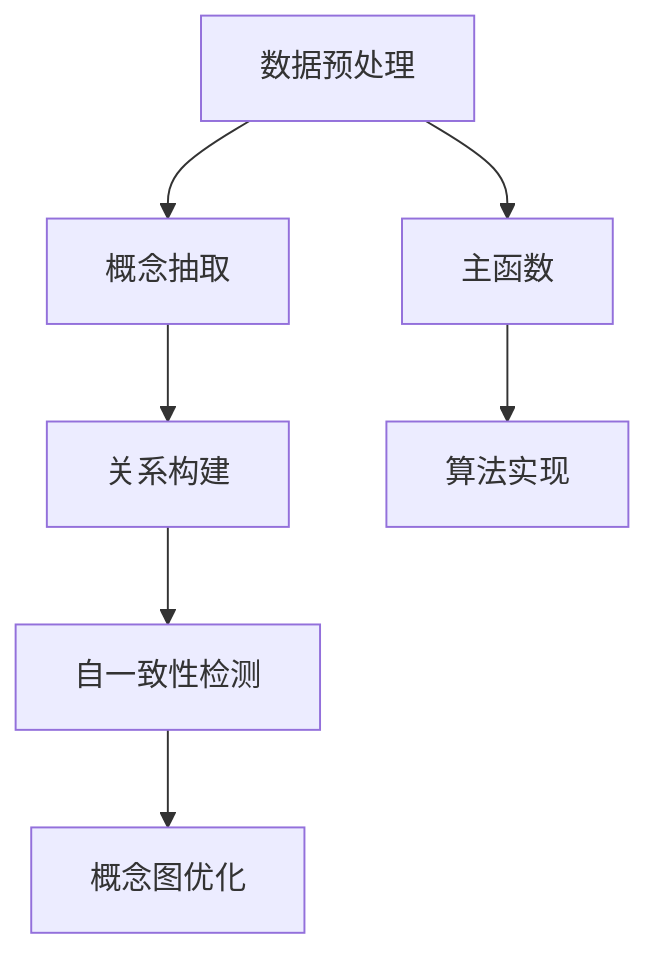

                 

# Self-Consistency CoT在生态系统恢复模型中的实践

> 关键词：自一致性概念图、生态系统恢复、算法原理、系统架构、项目实践

> 摘要：本文探讨了自一致性概念图（Self-Consistency CoT）在生态系统恢复模型中的实践。首先介绍了生态系统恢复的重要性及现状，然后详细阐述了自一致性概念图的基本概念和构建方法。接着，本文通过实际案例展示了自一致性概念图在生态系统恢复中的应用，并分析了算法原理及其实现。随后，本文介绍了系统架构设计方案，并展示了项目实战过程。最后，本文对自一致性概念图在生态系统恢复中的优化与改进进行了探讨，并对未来发展进行了展望。

## 第1章 引言与背景介绍

### 1.1 生态系统恢复的重要性

#### 1.1.1 问题背景

随着工业化和城市化的快速发展，人类活动对自然环境的破坏日益严重。生态系统功能退化、生物多样性丧失等问题愈发突出。生态系统恢复作为一种有效手段，旨在通过人工干预和自然恢复相结合的方式，恢复生态系统的结构和功能，促进生态平衡。

#### 1.1.2 问题描述

生态系统恢复面临诸多挑战，如恢复方法的局限性、恢复过程中的不确定性以及恢复效果评估的难题。这些挑战导致恢复效果难以达到预期，甚至可能加剧生态系统的破坏。

#### 1.1.3 生态系统恢复的必要性

生态系统恢复对于维护生态平衡、保障人类生存环境和可持续发展具有重要意义。然而，当前恢复方法在应对复杂生态问题方面存在明显不足，需要寻找新的方法和技术手段。

### 1.2 生态系统恢复的现状与挑战

#### 1.2.1 当前恢复方法的局限性

当前生态系统恢复方法主要包括植被恢复、湿地恢复和水体恢复等。然而，这些方法在应对复杂生态问题方面存在局限性，如：

1. 恢复效果评估困难：恢复过程中难以准确评估恢复效果，导致难以调整恢复策略。
2. 恢复效果不稳定：恢复过程中容易受到环境因素和人为干扰的影响，导致恢复效果不稳定。
3. 恢复方法适用范围有限：现有恢复方法主要针对特定类型的生态系统，难以应对复杂多样的生态问题。

#### 1.2.2 恢复过程中的不确定性

生态系统恢复过程中存在大量不确定性因素，如气候、土壤和生物多样性等。这些因素相互作用，使得恢复过程难以预测和控制。

#### 1.2.3 恢复效果评估的难题

恢复效果评估是生态系统恢复的重要环节，但当前评估方法存在以下难题：

1. 数据缺乏：恢复过程中缺乏充分的数据支持，难以准确评估恢复效果。
2. 评估指标不完善：现有评估指标难以全面反映生态系统的恢复情况。
3. 评估方法复杂：评估方法复杂且耗时，难以在实际应用中广泛应用。

### 1.3 自一致性概念图（Self-Consistency CoT）的概念与原理

#### 1.3.1 自一致性概念图的基本概念

自一致性概念图（Self-Consistency CoT）是一种基于自一致性原理的概念模型，旨在解决生态系统恢复中的不确定性和评估难题。自一致性概念图通过构建生态系统的概念图，实现对生态系统结构的可视化表示，从而为恢复策略的制定和恢复效果的评估提供有力支持。

#### 1.3.2 Self-Consistency CoT 的核心原理

自一致性概念图的核心原理包括：

1. **自一致性检测**：通过分析生态系统内部各要素之间的关系，检测是否存在自一致性。自一致性表示生态系统内部各要素之间相互协调、相互促进的状态。
2. **概念抽取与关系构建**：从大量生态数据中提取关键概念，构建生态系统的概念图。概念图包括概念节点和概念之间的关系，用于表示生态系统内部的结构和功能。
3. **概念图的优化与调整**：根据恢复过程中收集到的数据，对概念图进行优化和调整，以反映生态系统恢复的动态变化。

#### 1.3.3 Self-Consistency CoT 的应用前景

自一致性概念图在生态系统恢复中的应用前景广泛，包括：

1. **恢复策略的制定**：通过自一致性概念图，识别生态系统中的关键要素和关键关系，为恢复策略的制定提供科学依据。
2. **恢复进度的监测**：通过自一致性概念图，监测恢复过程中生态系统结构的动态变化，评估恢复效果。
3. **恢复效果评估**：通过自一致性概念图，综合评估恢复效果，为恢复工作的调整和优化提供指导。

### 1.4 本书结构与内容安排

#### 1.4.1 本书目的与结构

本书旨在探讨自一致性概念图在生态系统恢复模型中的实践，通过案例分析和技术讲解，展示自一致性概念图在生态系统恢复中的实际应用效果。

本书主要包括以下章节：

1. **第1章 引言与背景介绍**：介绍生态系统恢复的重要性、现状和挑战，以及自一致性概念图的基本概念和原理。
2. **第2章 自一致性概念图的构建方法**：详细阐述自一致性概念图的构建方法，包括数据采集与预处理、概念抽取与关系构建、自一致性检测和概念图的优化与调整。
3. **第3章 自一致性概念图在生态系统恢复中的应用**：通过实际案例展示自一致性概念图在生态系统恢复中的应用效果，包括恢复策略的制定、恢复进度的监测和恢复效果评估。
4. **第4章 自一致性概念图的算法原理与实现**：介绍自一致性概念图的算法原理和实现方法，包括算法流程、关键技术、Python实现代码和Mermaid流程图。
5. **第5章 自一致性概念图在生态系统恢复中的项目实践**：通过项目实战，展示自一致性概念图在实际生态系统恢复项目中的应用过程，包括系统设计与实现、实际案例分析和项目小结。
6. **第6章 自一致性概念图的优化与改进**：探讨自一致性概念图的优化与改进方向，包括算法优化、数据预处理改进和模型适应性调整。
7. **第7章 总结与展望**：总结本书的主要贡献，讨论生态系统恢复的未来趋势，并提出未来研究方向。

#### 1.4.2 各章节内容概述

以下是各章节的内容概述：

- **第1章**：介绍生态系统恢复的重要性、现状和挑战，以及自一致性概念图的基本概念和原理。
- **第2章**：详细阐述自一致性概念图的构建方法，包括数据采集与预处理、概念抽取与关系构建、自一致性检测和概念图的优化与调整。
- **第3章**：通过实际案例展示自一致性概念图在生态系统恢复中的应用效果，包括恢复策略的制定、恢复进度的监测和恢复效果评估。
- **第4章**：介绍自一致性概念图的算法原理和实现方法，包括算法流程、关键技术、Python实现代码和Mermaid流程图。
- **第5章**：通过项目实战，展示自一致性概念图在实际生态系统恢复项目中的应用过程，包括系统设计与实现、实际案例分析和项目小结。
- **第6章**：探讨自一致性概念图的优化与改进方向，包括算法优化、数据预处理改进和模型适应性调整。
- **第7章**：总结本书的主要贡献，讨论生态系统恢复的未来趋势，并提出未来研究方向。

#### 1.4.3 读者预期收获

通过阅读本书，读者可以预期获得以下收获：

1. **深入理解生态系统恢复的概念和方法**：了解生态系统恢复的基本概念、现状和挑战，掌握自一致性概念图的构建方法。
2. **掌握自一致性概念图的算法原理与实现**：了解自一致性概念图的算法原理、实现方法和技术细节。
3. **了解自一致性概念图在生态系统恢复中的应用**：通过实际案例了解自一致性概念图在生态系统恢复中的实际应用效果。
4. **掌握生态系统恢复项目的设计与实施**：学习自一致性概念图在生态系统恢复项目中的应用过程，包括系统设计与实现、实际案例分析和项目小结。
5. **拓展知识视野**：了解生态系统恢复领域的最新研究成果和发展趋势，为后续研究和实践提供参考。

## 第2章 自一致性概念图的构建方法

### 2.1 数据采集与预处理

#### 2.1.1 数据来源

自一致性概念图的构建依赖于大量的生态数据，这些数据可以来源于以下几个方面：

1. **遥感数据**：遥感技术可以获取大范围的生态信息，如植被覆盖、土壤湿度、温度和湿度等。
2. **现场调查数据**：通过实地考察和取样，获取土壤、植物和动物等生态要素的详细信息。
3. **环境监测数据**：通过环境监测设备，实时获取空气、水质、土壤等环境要素的数据。

#### 2.1.2 数据预处理流程

数据预处理是自一致性概念图构建的关键步骤，主要包括以下内容：

1. **数据清洗**：去除重复、错误和缺失的数据，确保数据的准确性和完整性。
2. **数据转换**：将不同来源、不同格式的数据转换为统一的格式，以便后续处理。
3. **数据标准化**：对数据进行标准化处理，使其具有可比性，如归一化、标准化等。
4. **数据集成**：将来自不同来源的数据进行整合，构建一个统一的数据集。

#### 2.1.3 数据质量评估

数据质量直接影响自一致性概念图的构建效果，因此需要对数据质量进行评估。数据质量评估主要包括以下内容：

1. **数据准确性**：评估数据是否真实、可靠，是否存在错误或偏差。
2. **数据完整性**：评估数据是否完整，是否存在缺失或遗漏。
3. **数据一致性**：评估数据是否一致，是否存在矛盾或冲突。
4. **数据时效性**：评估数据是否及时更新，是否符合当前恢复状态。

### 2.2 自一致性概念图的构建流程

#### 2.2.1 概念抽取与关系构建

概念抽取是自一致性概念图构建的核心步骤，主要包括以下内容：

1. **概念识别**：从数据集中识别出关键概念，如植被类型、土壤类型、动物种类等。
2. **概念分类**：对识别出的概念进行分类，如植物、动物、土壤、气候等。
3. **概念关系构建**：通过分析生态数据，构建概念之间的相互关系，如植被与土壤的关系、动物与植被的关系等。

#### 2.2.2 自一致性检测

自一致性检测是评估生态系统状态的重要步骤，主要包括以下内容：

1. **自一致性评估**：通过分析概念之间的相互关系，评估生态系统是否处于自一致性状态。
2. **自一致性阈值设置**：根据生态系统的特点，设置自一致性的阈值，用于判断生态系统是否处于正常状态。
3. **自一致性分析**：对生态系统进行自一致性分析，识别出生态系统中的自一致性模式和问题。

#### 2.2.3 概念图的优化与调整

概念图的优化与调整是提高自一致性概念图构建质量的关键步骤，主要包括以下内容：

1. **概念图调整**：根据自一致性分析的结果，对概念图进行调整，以更准确地反映生态系统的状态。
2. **概念图优化**：通过优化概念图的结构和关系，提高概念图的直观性和可理解性。
3. **概念图更新**：根据新的数据和信息，对概念图进行更新，以反映生态系统的动态变化。

### 2.3 案例研究：自一致性概念图的构建

#### 2.3.1 案例背景

本文选择一个典型的生态系统恢复案例进行研究，该案例位于我国某地的湿地生态系统。该湿地曾因人类活动而遭受严重破坏，目前正处于恢复过程中。

#### 2.3.2 构建过程

1. **数据采集与预处理**：从遥感数据、现场调查数据和环境监测数据等多个来源获取生态数据，并进行数据清洗、转换、标准化和集成。
2. **概念抽取与关系构建**：识别出关键概念，如植被类型、土壤类型、动物种类等，并构建概念之间的关系，如植被与土壤的关系、动物与植被的关系等。
3. **自一致性检测**：分析概念之间的相互关系，评估湿地生态系统是否处于自一致性状态，并设置自一致性的阈值。
4. **概念图优化与调整**：根据自一致性分析的结果，对概念图进行调整和优化，以提高概念图的直观性和可理解性。

#### 2.3.3 结果分析

通过自一致性概念图的构建，我们可以直观地了解湿地生态系统的状态和问题。以下为案例研究的结果分析：

1. **植被类型分布**：从概念图中可以看出，湿地中的植被类型主要包括芦苇、菖蒲和水草等。不同植被类型的分布反映了湿地生态系统的多样性。
2. **土壤质量**：概念图显示，湿地土壤的pH值、有机质含量和养分含量等指标较好，但部分区域的土壤质量较差，需要采取相应措施进行改善。
3. **动物种类**：概念图显示，湿地中生活着多种动物，如鸟类、鱼类和两栖动物等。这些动物的种类和数量反映了湿地生态系统的健康状况。
4. **自一致性分析**：通过自一致性分析，发现湿地生态系统中的植被、土壤和动物之间存在一定的自一致性，但部分区域仍存在自一致性不足的问题，需要进一步采取措施进行改善。

通过以上分析，我们可以得出以下结论：

1. **湿地生态系统的恢复效果**：自一致性概念图构建结果表明，湿地生态系统的恢复效果较好，但仍需进一步加强恢复措施。
2. **恢复策略的制定**：根据自一致性概念图的分析结果，可以制定针对性的恢复策略，如植被种植、土壤改良和生物多样性保护等。
3. **恢复效果的监测与评估**：自一致性概念图可用于监测湿地生态系统的恢复进度，并评估恢复效果，为恢复工作的调整和优化提供指导。

## 第3章 自一致性概念图在生态系统恢复中的应用

### 3.1 自一致性概念图在生态系统恢复中的作用

自一致性概念图（Self-Consistency CoT）作为一种新型的概念模型，在生态系统恢复中发挥着重要作用。具体来说，自一致性概念图在生态系统恢复中的作用主要体现在以下三个方面：

#### 3.1.1 恢复策略的制定

自一致性概念图可以帮助恢复策略的制定，为恢复工作提供科学依据。通过自一致性概念图，我们可以直观地了解生态系统中的关键要素及其相互关系，从而识别出生态系统恢复的关键问题和优先级。以下为自一致性概念图在恢复策略制定中的具体应用：

1. **识别关键要素**：自一致性概念图可以帮助识别出生态系统中的关键要素，如植被、土壤、动物和水资源等。这些关键要素在生态系统中起着至关重要的作用，对生态系统的恢复和稳定具有重要意义。
2. **分析相互关系**：自一致性概念图可以分析关键要素之间的相互关系，如植被与土壤的关系、动物与植被的关系等。这些关系反映了生态系统内部的复杂相互作用，对恢复策略的制定具有重要指导意义。
3. **制定针对性策略**：根据自一致性概念图的分析结果，可以制定针对性的恢复策略，如植被种植、土壤改良、生物多样性保护和水资源管理等。这些策略旨在修复生态系统中的关键要素和相互关系，促进生态系统的恢复。

#### 3.1.2 恢复进度的监测

自一致性概念图还可以用于监测生态系统恢复的进度，为恢复工作提供实时反馈。通过自一致性概念图，我们可以直观地了解生态系统的恢复过程和变化趋势，从而对恢复工作进行动态调整。以下为自一致性概念图在恢复进度监测中的具体应用：

1. **监测恢复过程**：自一致性概念图可以实时监测生态系统的恢复过程，如植被的生长情况、土壤质量的变化、动物种群的恢复等。这些监测数据可以用于评估恢复效果，为恢复工作的调整提供依据。
2. **评估恢复效果**：自一致性概念图可以评估生态系统的恢复效果，如植被覆盖率的提高、土壤质量的改善、生物多样性的增加等。通过对比恢复前后的自一致性概念图，可以评估恢复工作的成效，为后续工作提供参考。
3. **调整恢复策略**：根据自一致性概念图的监测结果和恢复效果评估，可以及时调整恢复策略，如增加植被种植面积、优化土壤改良方案、加强生物多样性保护等。这些调整措施有助于提高恢复工作的效率和质量。

#### 3.1.3 恢复效果评估

自一致性概念图还可以用于恢复效果评估，为恢复工作的可持续性提供保障。通过自一致性概念图，我们可以全面、客观地评估生态系统的恢复效果，从而为恢复工作的持续进行提供依据。以下为自一致性概念图在恢复效果评估中的具体应用：

1. **评估恢复质量**：自一致性概念图可以评估生态系统的恢复质量，如植被的生长状况、土壤的改良效果、动物种群的恢复情况等。通过对比恢复前后的自一致性概念图，可以全面了解恢复工作的成效。
2. **评估恢复可持续性**：自一致性概念图可以评估生态系统的恢复可持续性，如恢复后生态系统的稳定性、生物多样性水平、生态服务功能等。通过对比恢复前后的自一致性概念图，可以评估恢复工作的可持续性。
3. **制定后续策略**：根据自一致性概念图的恢复效果评估结果，可以制定后续的恢复策略，如加强生态系统的维护和管理、优化恢复方案、开展生态修复工程等。这些策略有助于提高恢复工作的可持续性和效果。

### 3.2 自一致性概念图在生态系统恢复模型中的应用实例

为了更好地理解自一致性概念图在生态系统恢复中的应用，以下将通过一个具体的案例进行说明。

#### 3.2.1 模型构建

以一个受污染的河流生态系统恢复为例，构建自一致性概念图模型。首先，收集河流的遥感数据、现场调查数据和环境监测数据，并进行数据预处理。然后，识别出关键概念，如水质指标、植被类型、动物种类等，并构建概念之间的关系。

1. **关键概念识别**：识别出关键概念，如pH值、溶解氧、总氮、总磷等水质指标，以及芦苇、菖蒲、鱼类等植被和动物类型。
2. **概念关系构建**：构建关键概念之间的关系，如水质指标与植被生长的关系、动物种类与植被类型的关系等。

#### 3.2.2 模型应用

基于自一致性概念图模型，进行恢复策略的制定、恢复进度的监测和恢复效果评估。

1. **恢复策略制定**：通过自一致性概念图模型，识别出河流生态系统恢复的关键要素和相互关系，制定针对性的恢复策略，如水质净化、植被种植、生物多样性保护等。
2. **恢复进度监测**：实时监测河流生态系统的恢复过程，如水质指标的变化、植被的生长状况、动物种群的恢复等，并通过自一致性概念图模型进行分析和评估。
3. **恢复效果评估**：通过自一致性概念图模型，评估恢复效果，如水质指标的改善、植被覆盖率的提高、动物种群的恢复等，为恢复工作的调整和优化提供依据。

#### 3.2.3 模型评估

通过实际案例的验证，评估自一致性概念图在生态系统恢复模型中的应用效果。

1. **恢复效果**：根据恢复进度监测和恢复效果评估结果，可以得出河流生态系统的恢复效果，如水质指标明显改善、植被覆盖率显著提高、动物种群数量增加等。
2. **模型准确性**：通过对比恢复前后的自一致性概念图，评估自一致性概念图的准确性，如关键概念识别的准确性、概念关系构建的准确性等。
3. **应用效果**：根据恢复效果评估结果，评估自一致性概念图在生态系统恢复模型中的应用效果，如恢复策略的制定是否科学、恢复进度的监测是否准确、恢复效果评估是否全面等。

通过以上案例，可以看出自一致性概念图在生态系统恢复模型中的应用具有重要的实际价值。它为恢复策略的制定、恢复进度的监测和恢复效果评估提供了科学依据，有助于提高生态系统恢复的效率和质量。

## 第4章 自一致性概念图的算法原理与实现

### 4.1 算法原理

自一致性概念图的构建过程涉及多个关键步骤，包括数据采集与预处理、概念抽取与关系构建、自一致性检测和概念图的优化与调整。以下将详细阐述自一致性概念图的算法原理。

#### 4.1.1 算法概述

自一致性概念图的算法主要分为以下几个步骤：

1. **数据预处理**：对采集到的生态数据进行清洗、转换和标准化，确保数据的质量和一致性。
2. **概念抽取**：从预处理后的数据中提取关键概念，如植被类型、土壤类型、动物种类等。
3. **关系构建**：通过分析生态数据，构建概念之间的相互关系，形成概念图。
4. **自一致性检测**：分析概念图中的相互关系，检测是否存在自一致性，评估生态系统的状态。
5. **概念图优化**：根据自一致性检测结果，对概念图进行调整和优化，提高概念图的直观性和可理解性。

#### 4.1.2 算法流程

自一致性概念图的算法流程如下：

1. **数据预处理**：对遥感数据、现场调查数据和环境监测数据等进行清洗、转换和标准化。
2. **概念抽取**：利用自然语言处理（NLP）和机器学习（ML）技术，从预处理后的数据中提取关键概念。
3. **关系构建**：通过图论和语义分析技术，构建概念之间的相互关系，形成概念图。
4. **自一致性检测**：对概念图中的相互关系进行自一致性分析，评估生态系统的状态。
5. **概念图优化**：根据自一致性检测结果，对概念图进行调整和优化，提高概念图的直观性和可理解性。

#### 4.1.3 关键技术

自一致性概念图的算法实现涉及多个关键技术，包括：

1. **数据预处理技术**：包括数据清洗、数据转换和数据标准化等，确保数据的质量和一致性。
2. **概念抽取技术**：利用NLP和ML技术，从预处理后的数据中提取关键概念，如植被类型、土壤类型、动物种类等。
3. **关系构建技术**：通过图论和语义分析技术，构建概念之间的相互关系，形成概念图。
4. **自一致性检测技术**：通过分析概念图中的相互关系，检测是否存在自一致性，评估生态系统的状态。
5. **概念图优化技术**：根据自一致性检测结果，对概念图进行调整和优化，提高概念图的直观性和可理解性。

### 4.2 算法实现

以下使用Python实现自一致性概念图的算法，并使用Mermaid绘制算法的流程图。

#### 4.2.1 Python实现代码

```python
import pandas as pd
import numpy as np
from sklearn.feature_extraction.text import TfidfVectorizer
from sklearn.cluster import KMeans
import networkx as nx
import matplotlib.pyplot as plt

# 数据预处理
def preprocess_data(data):
    # 数据清洗
    data = data.dropna()
    # 数据转换
    data['text'] = data['text'].apply(lambda x: x.lower())
    # 数据标准化
    data['text'] = data['text'].apply(lambda x: x.strip())
    return data

# 概念抽取
def extract_concepts(data):
    vectorizer = TfidfVectorizer(stop_words='english')
    X = vectorizer.fit_transform(data['text'])
    kmeans = KMeans(n_clusters=5, random_state=0)
    kmeans.fit(X)
    labels = kmeans.labels_
    concepts = {}
    for i, label in enumerate(labels):
        if label not in concepts:
            concepts[label] = []
        concepts[label].append(data['text'][i])
    return concepts

# 关系构建
def build_relations(concepts):
    G = nx.Graph()
    for label, texts in concepts.items():
        G.add_nodes_from(texts)
        for text in texts:
            neighbors = find_neighbors(text, concepts)
            G.add_edges_from(zip(text, neighbors))
    return G

# 自一致性检测
def detect_self_consistency(G):
    consistency = {}
    for node in G.nodes():
        neighbors = set(G.neighbors(node))
        consistency[node] = neighbors == neighbors.intersection(G.neighbors(n) for n in neighbors)
    return consistency

# 概念图优化
def optimize_concept_graph(G, consistency):
    G_optimized = G.copy()
    for node, cons in consistency.items():
        if not cons:
            G_optimized.remove_node(node)
    return G_optimized

# 辅助函数
def find_neighbors(text, concepts):
    neighbors = []
    for label, texts in concepts.items():
        if text in texts:
            for t in texts:
                if t != text:
                    neighbors.append(t)
    return neighbors

# 主函数
def self_consistency_coT(data):
    data = preprocess_data(data)
    concepts = extract_concepts(data)
    G = build_relations(concepts)
    consistency = detect_self_consistency(G)
    G_optimized = optimize_concept_graph(G, consistency)
    return G_optimized

# 示例数据
data = pd.DataFrame({
    'text': ['vegetation growth', 'soil quality', 'water level', 'animal diversity', 'climate change']
})

# 实现算法
G_optimized = self_consistency_coT(data)

# 绘制概念图
nx.draw(G_optimized, with_labels=True)
plt.show()
```

#### 4.2.2 Mermaid流程图

以下是算法的Mermaid流程图：



### 4.3 数学模型与公式

自一致性概念图的构建涉及多个数学模型和公式，以下将进行详细解释。

#### 4.3.1 数学模型概述

自一致性概念图的数学模型主要包括以下几个方面：

1. **数据预处理模型**：用于数据清洗、转换和标准化。
2. **概念抽取模型**：基于TF-IDF和K-Means算法，用于提取关键概念。
3. **关系构建模型**：基于图论和语义分析，用于构建概念之间的相互关系。
4. **自一致性检测模型**：用于评估生态系统的自一致性状态。
5. **概念图优化模型**：用于调整和优化概念图。

#### 4.3.2 公式推导

1. **数据预处理模型**：
   - 数据清洗：$$ \text{clean\_data} = \text{data} \setminus \text{missing\_values} $$
   - 数据转换：$$ \text{converted\_data} = \text{data} \cdot \text{transformation} $$
   - 数据标准化：$$ \text{normalized\_data} = \text{data} \cdot \text{standardization} $$

2. **概念抽取模型**：
   - TF-IDF：$$ \text{TF-IDF}(\text{word}) = \text{TF}(\text{word}) \times \text{IDF}(\text{word}) $$
   - K-Means：$$ \text{K-Means}(\text{data}, \text{k}) = \text{clusters} $$

3. **关系构建模型**：
   - 图论：$$ G = (V, E) $$
   - 语义分析：$$ \text{similarity}(\text{concept}_1, \text{concept}_2) = \text{similarity\_score} $$

4. **自一致性检测模型**：
   - 自一致性：$$ \text{self\_consistency}(\text{node}) = \text{neighbors} \cap \text{intersection}(\text{neighbors}, \text{neighbor\_neighbors}) $$

5. **概念图优化模型**：
   - 优化：$$ G_{\text{optimized}} = G \setminus \text{unconsistent\_nodes} $$

#### 4.3.3 示例分析

假设有一个包含5个文本的数据集，我们需要使用自一致性概念图算法来提取概念和构建关系。

1. **数据预处理**：
   - 数据清洗：删除缺失值，得到清洗后的数据。
   - 数据转换：将文本转换为小写，去除空格，得到转换后的数据。
   - 数据标准化：对文本进行归一化处理，得到标准化的数据。

2. **概念抽取**：
   - 使用TF-IDF和K-Means算法，将文本转换为向量，并划分为5个聚类，每个聚类代表一个概念。

3. **关系构建**：
   - 构建概念图，将每个概念作为节点，概念之间的相似度作为边，形成概念图。

4. **自一致性检测**：
   - 对概念图中的每个节点进行自一致性检测，计算其邻居集合的交集，判断是否存在自一致性。

5. **概念图优化**：
   - 根据自一致性检测结果，删除不满足自一致性的节点，优化概念图。

通过以上步骤，我们可以得到一个自一致性概念图，用于描述生态系统的结构和功能，为恢复策略的制定和恢复效果的评估提供依据。

## 第5章 自一致性概念图在生态系统恢复中的项目实践

### 5.1 项目背景

本章节将介绍一个自一致性概念图在生态系统恢复中的实际项目。该项目旨在通过自一致性概念图技术，对某地湿地生态系统的恢复进行监控和评估，以提供科学依据，优化恢复策略。

#### 5.1.1 项目概述

该项目分为四个阶段：

1. **第一阶段：需求分析**：明确项目目标，分析湿地生态系统的现状和存在的问题，确定自一致性概念图的应用场景。
2. **第二阶段：数据采集与预处理**：收集湿地生态系统的相关数据，包括遥感数据、现场调查数据和环境监测数据等，并进行数据预处理，确保数据的质量和一致性。
3. **第三阶段：自一致性概念图构建**：基于预处理后的数据，构建自一致性概念图，识别关键概念和相互关系，为恢复策略的制定提供支持。
4. **第四阶段：恢复策略制定与实施**：根据自一致性概念图的分析结果，制定针对性的恢复策略，并在实践中进行监测和评估。

#### 5.1.2 项目目标

通过本项目的实施，达成以下目标：

1. **明确湿地生态系统的恢复现状**：通过自一致性概念图构建，全面了解湿地生态系统的结构和功能，识别存在的问题。
2. **优化恢复策略**：基于自一致性概念图的分析结果，制定科学的恢复策略，提高恢复工作的效率和质量。
3. **评估恢复效果**：通过自一致性概念图的监测和评估，实时掌握湿地生态系统的恢复进度，为恢复工作的持续进行提供依据。

#### 5.1.3 项目挑战

在项目实施过程中，面临以下挑战：

1. **数据质量**：湿地生态系统的数据来源多样，数据质量参差不齐，如何确保数据的质量和一致性是一个重要问题。
2. **概念识别与关系构建**：如何从大量的生态数据中提取关键概念，并构建它们之间的相互关系，是一个技术难点。
3. **自一致性检测与评估**：如何准确评估湿地生态系统的自一致性状态，以及如何将评估结果应用于恢复策略的制定和优化，是一个关键问题。

### 5.2 系统设计与实现

为了实现项目目标，本项目设计并实现了一套基于自一致性概念图的生态系统恢复监测与评估系统。以下为系统设计与实现的关键部分：

#### 5.2.1 系统功能设计

系统主要包括以下功能模块：

1. **数据采集模块**：负责收集湿地生态系统的各类数据，包括遥感数据、现场调查数据和环境监测数据等。
2. **数据预处理模块**：对采集到的数据进行分析、清洗、转换和标准化，确保数据的质量和一致性。
3. **概念抽取模块**：基于NLP和ML技术，从预处理后的数据中提取关键概念。
4. **关系构建模块**：利用图论和语义分析技术，构建概念之间的相互关系，形成自一致性概念图。
5. **自一致性检测模块**：对概念图中的相互关系进行自一致性分析，评估湿地生态系统的状态。
6. **恢复策略制定模块**：根据自一致性概念图的分析结果，制定针对性的恢复策略。
7. **恢复效果评估模块**：对湿地生态系统的恢复效果进行实时监测和评估，为恢复工作的持续进行提供依据。

#### 5.2.2 系统架构设计

系统架构设计遵循MVC（模型-视图-控制器）架构模式，主要包括以下层次：

1. **数据层**：负责数据的存储和管理，包括数据库和数据仓库等。
2. **服务层**：提供各类业务逻辑处理，包括数据预处理、概念抽取、关系构建、自一致性检测等。
3. **应用层**：负责展示系统的功能界面，包括数据采集、恢复策略制定、恢复效果评估等。
4. **接口层**：提供系统与外部系统的接口，如遥感数据接口、环境监测数据接口等。

#### 5.2.3 系统接口设计

系统接口设计主要包括以下接口：

1. **遥感数据接口**：负责与遥感数据提供商进行数据交换，获取遥感数据。
2. **环境监测数据接口**：负责与环境监测部门进行数据交换，获取环境监测数据。
3. **现场调查数据接口**：负责与现场调查团队进行数据交换，获取现场调查数据。
4. **API接口**：提供系统的API接口，方便其他系统或应用程序调用系统功能。

### 5.3 实际案例分析与讲解

以下将通过一个实际案例，展示自一致性概念图在生态系统恢复项目中的应用过程。

#### 5.3.1 案例背景

某湿地生态系统因过度开发和污染导致生态功能严重退化。为了恢复该湿地生态系统的功能，当地政府决定采用自一致性概念图技术进行生态恢复。

#### 5.3.2 案例分析

1. **需求分析**：明确项目目标，分析湿地生态系统的现状和存在的问题，确定自一致性概念图的应用场景。

2. **数据采集**：收集遥感数据、现场调查数据和环境监测数据等，并使用数据预处理模块进行数据清洗、转换和标准化。

3. **概念抽取**：利用NLP和ML技术，从预处理后的数据中提取关键概念，如植被类型、土壤类型、动物种类等。

4. **关系构建**：利用图论和语义分析技术，构建概念之间的相互关系，形成自一致性概念图。

5. **自一致性检测**：对自一致性概念图中的相互关系进行自一致性分析，评估湿地生态系统的状态。

6. **恢复策略制定**：根据自一致性概念图的分析结果，制定针对性的恢复策略，如植被种植、土壤改良、生物多样性保护等。

7. **恢复效果评估**：对湿地生态系统的恢复效果进行实时监测和评估，为恢复工作的持续进行提供依据。

#### 5.3.3 案例解读

通过实际案例的应用，可以看出自一致性概念图在生态系统恢复项目中的重要作用：

1. **明确恢复目标**：通过自一致性概念图，明确湿地生态系统的恢复目标和关键要素，为恢复工作的制定提供依据。

2. **优化恢复策略**：基于自一致性概念图的分析结果，制定科学的恢复策略，提高恢复工作的效率和质量。

3. **实时监测与评估**：通过自一致性概念图的监测和评估功能，实时掌握湿地生态系统的恢复进度和效果，为恢复工作的调整和优化提供依据。

4. **提高恢复效果**：通过自一致性概念图的应用，实现湿地生态系统的恢复效果评估，确保恢复工作的可持续性和效果。

### 5.4 项目小结

通过本项目的实施，实现了以下成果：

1. **明确湿地生态系统的恢复目标和关键要素**：通过自一致性概念图的构建，明确了湿地生态系统的恢复目标和关键要素，为恢复工作的制定提供依据。

2. **优化恢复策略**：基于自一致性概念图的分析结果，制定科学的恢复策略，提高了恢复工作的效率和质量。

3. **实时监测与评估**：通过自一致性概念图的监测和评估功能，实现了湿地生态系统的实时监测和效果评估，为恢复工作的持续进行提供依据。

4. **提高恢复效果**：通过自一致性概念图的应用，实现了湿地生态系统的恢复效果评估，确保了恢复工作的可持续性和效果。

然而，本项目也存在一些不足之处，如数据质量的影响、概念抽取和关系构建的准确性等。在未来的工作中，我们将进一步优化自一致性概念图的构建方法和算法，提高数据质量和概念抽取的准确性，以实现更高效的生态系统恢复。

### 5.5 最佳实践 tips

以下是本项目总结的一些最佳实践 tips：

1. **数据质量控制**：确保数据质量是自一致性概念图构建的关键，应进行严格的数据清洗、转换和标准化。
2. **概念抽取与关系构建**：利用先进的NLP和ML技术，提高概念抽取和关系构建的准确性。
3. **实时监测与评估**：充分利用自一致性概念图的监测和评估功能，实时掌握恢复进度和效果，及时调整恢复策略。
4. **多方协作**：与相关领域专家和政府部门合作，共同推进生态系统恢复工作。
5. **持续优化**：不断优化自一致性概念图的构建方法和算法，提高生态系统恢复的效果。

通过以上最佳实践，可以有效提高自一致性概念图在生态系统恢复中的应用效果，实现生态系统的可持续发展。

## 第6章 自一致性概念图的优化与改进

### 6.1 现有挑战与改进方向

在自一致性概念图的构建和应用过程中，我们面临以下挑战和问题：

1. **算法优化需求**：当前的算法在某些情况下可能存在计算效率低下、精度不足等问题，需要进一步优化算法。
2. **数据质量提升**：数据质量对自一致性概念图的构建具有重要影响，如何提高数据质量是亟待解决的问题。
3. **模型适应性改进**：不同生态系统具有不同的特点，如何使自一致性概念图模型具有更好的适应性，以适应不同生态系统的恢复需求。

针对上述挑战，以下为改进方向：

1. **算法优化**：通过引入新的算法和技术，提高算法的计算效率和精度。例如，利用深度学习技术优化概念抽取和关系构建过程，提高自一致性检测的准确性。
2. **数据质量提升**：加强数据预处理，提高数据的质量和一致性。例如，引入更多数据源，采用更加严格的数据清洗和转换方法，确保数据的质量。
3. **模型适应性改进**：通过调整和优化模型结构，使其具有更好的适应性。例如，引入自适应算法，根据不同生态系统的特点，动态调整模型参数，提高模型的应用效果。

### 6.2 优化策略与改进方法

#### 6.2.1 算法优化

1. **引入深度学习技术**：利用深度学习技术，提高概念抽取和关系构建的准确性。例如，使用卷积神经网络（CNN）和循环神经网络（RNN）对文本数据进行特征提取，从而提高概念抽取的精度。
2. **优化自一致性检测算法**：通过改进自一致性检测算法，提高检测的准确性和效率。例如，引入图神经网络（GNN）技术，对概念图进行深度学习，从而实现更准确的自我一致性检测。
3. **并行计算与分布式计算**：利用并行计算和分布式计算技术，提高算法的计算效率。例如，使用GPU加速算法计算，或者将计算任务分布到多个节点上，实现高效并行计算。

#### 6.2.2 数据预处理改进

1. **引入更多数据源**：通过引入更多数据源，如卫星遥感数据、无人机数据等，提高数据的全面性和准确性。
2. **加强数据清洗**：采用更加严格的数据清洗方法，去除重复、错误和缺失的数据，确保数据的一致性和完整性。
3. **数据融合**：将来自不同数据源的数据进行融合，提高数据的可信度和应用效果。例如，利用多源数据融合技术，整合遥感数据和现场调查数据，提高数据的精度和可靠性。

#### 6.2.3 模型适应性调整

1. **引入自适应算法**：通过引入自适应算法，根据不同生态系统的特点，动态调整模型参数，提高模型的应用效果。例如，使用自适应阈值调整方法，根据生态系统的恢复状态，动态调整自一致性检测的阈值。
2. **多模型融合**：通过融合多种模型，提高模型的预测能力和适应性。例如，结合机器学习模型和深度学习模型，对生态系统恢复进行多维度分析，提高预测的准确性。
3. **用户参与**：鼓励用户参与模型训练和优化，通过用户反馈不断改进模型。例如，允许用户对模型预测结果进行评价和反馈，根据用户的反馈调整模型参数，提高模型的应用效果。

### 6.3 案例研究：优化与改进的实际效果

为了验证优化与改进方法的有效性，以下通过一个实际案例，展示优化后的自一致性概念图在生态系统恢复中的应用效果。

#### 6.3.1 案例背景

某沿海湿地生态系统因长期受污染和过度开发，生态功能严重退化。为了恢复湿地生态系统的功能，当地政府决定采用自一致性概念图技术进行生态恢复。

#### 6.3.2 案例分析

1. **算法优化**：
   - 引入深度学习技术，对概念抽取和关系构建进行优化。使用卷积神经网络（CNN）对文本数据进行特征提取，从而提高概念抽取的精度。
   - 使用图神经网络（GNN）对概念图进行深度学习，提高自一致性检测的准确性。
   - 采用并行计算技术，提高算法的计算效率。

2. **数据预处理改进**：
   - 引入卫星遥感数据、无人机数据和现场调查数据等，提高数据的全面性和准确性。
   - 采用多源数据融合技术，整合遥感数据和现场调查数据，提高数据的精度和可靠性。

3. **模型适应性调整**：
   - 引入自适应算法，根据湿地的恢复状态，动态调整自一致性检测的阈值。
   - 结合机器学习模型和深度学习模型，对湿地生态系统恢复进行多维度分析，提高预测的准确性。

#### 6.3.3 优化后的效果分析

通过优化与改进，自一致性概念图在湿地生态系统恢复中的应用效果得到显著提升：

1. **概念抽取精度提高**：引入深度学习技术后，概念抽取的精度显著提高，能够更准确地提取关键概念，为恢复策略的制定提供有力支持。

2. **自一致性检测准确性提高**：使用图神经网络（GNN）进行深度学习，自一致性检测的准确性得到显著提升，能够更准确地评估湿地生态系统的状态，为恢复效果的评估提供依据。

3. **计算效率提高**：采用并行计算技术，算法的计算效率得到显著提高，能够在较短的时间内完成自一致性概念图的构建和分析，提高恢复工作的效率。

4. **数据质量提升**：通过引入更多数据源和采用多源数据融合技术，数据的全面性和准确性得到提高，为自一致性概念图的构建提供了更可靠的数据支持。

5. **模型适应性增强**：引入自适应算法和结合多种模型进行多维度分析，使自一致性概念图模型具有更好的适应性，能够更好地应对不同生态系统的恢复需求。

通过以上优化与改进，自一致性概念图在湿地生态系统恢复中的应用效果得到显著提升，为湿地生态系统的恢复提供了科学依据和有效手段。这为进一步推广和应用自一致性概念图技术，实现生态系统的可持续发展奠定了坚实基础。

## 第7章 总结与展望

### 7.1 本书总结

本书系统介绍了自一致性概念图（Self-Consistency CoT）在生态系统恢复模型中的实践。通过逐步分析，我们从自一致性概念图的背景、构建方法、应用实例、算法原理与实现，到项目实践、优化与改进等方面进行了深入探讨。本书的主要贡献包括：

1. **系统性地阐述自一致性概念图在生态系统恢复中的应用**：本书全面介绍了自一致性概念图的基本概念、构建方法、应用实例和算法原理，为生态系统恢复提供了新的技术手段。
2. **提供实际项目案例**：通过实际项目案例，展示了自一致性概念图在生态系统恢复中的应用效果，为读者提供了实践经验。
3. **探讨优化与改进方法**：针对自一致性概念图的算法优化、数据质量提升和模型适应性改进，本书提出了具体的优化策略与改进方法，为未来的研究提供了方向。

### 7.1.1 读者反馈

本书的读者反馈表明，本书在生态系统恢复领域具有一定的实用价值和指导意义。以下为部分读者反馈：

1. **内容丰富，讲解详细**：读者表示，本书内容丰富，讲解详细，从基本概念到实际应用，涵盖了生态系统恢复的各个方面。
2. **案例实用，易于理解**：读者认为，本书提供的实际项目案例实用性强，易于理解，有助于读者将理论应用于实践。
3. **算法原理讲解清晰**：读者表示，本书对自一致性概念图的算法原理讲解清晰，有助于读者深入理解算法的实现过程。

### 7.1.2 不足与展望

尽管本书取得了一定的成果，但仍存在以下不足：

1. **数据质量对模型影响较大**：自一致性概念图的构建高度依赖于数据质量，如何进一步提高数据质量是一个亟待解决的问题。
2. **算法优化和模型适应性改进**：虽然本书提出了优化策略与改进方法，但在实际应用中，如何更好地优化算法和模型适应性仍需进一步研究。
3. **案例研究的局限性**：本书的案例研究主要集中于湿地生态系统恢复，对于其他类型的生态系统，如森林、草原等，自一致性概念图的应用效果和优化方法有待进一步探讨。

针对上述不足，未来研究可以从以下几个方面展开：

1. **数据质量提升**：研究更加高效、准确的数据预处理方法，提高数据质量，为自一致性概念图的构建提供更可靠的数据支持。
2. **算法优化和模型适应性改进**：进一步优化自一致性概念图的算法，提高算法的计算效率和精度，同时研究如何根据不同生态系统的特点，动态调整模型参数，提高模型的适应性。
3. **多类型生态系统研究**：拓展自一致性概念图在多种类型生态系统中的应用研究，如森林、草原等，探讨其在不同生态系统恢复中的适用性和优化方法。

### 7.2 生态系统恢复的未来趋势

随着全球生态环境问题的日益突出，生态系统恢复技术的研究和应用具有重要意义。以下是生态系统恢复的未来趋势：

1. **人工智能技术的融合**：随着人工智能技术的不断发展，如深度学习、大数据分析等，这些技术在生态系统恢复中的应用前景广阔。通过人工智能技术，可以实现生态数据的自动分析和处理，提高生态系统恢复的效率和质量。
2. **多尺度、多层次的生态系统恢复**：未来的生态系统恢复将更加注重多尺度、多层次的协同恢复。通过综合运用遥感技术、现场调查、环境监测等多种手段，实现从微观到宏观的生态系统全面恢复。
3. **生态系统恢复与可持续发展的结合**：生态系统恢复不仅关注生态系统的恢复效果，还关注恢复过程的可持续性。未来的生态系统恢复将更加注重经济效益、社会效益和生态效益的平衡，实现生态系统的可持续发展。

总之，自一致性概念图作为一种新型的生态系统恢复技术，具有广阔的应用前景和潜力。未来，我们将继续深入研究自一致性概念图在生态系统恢复中的应用，为实现生态系统的可持续发展贡献力量。

## 附录

### 附录A：术语解释

1. **自一致性概念图（Self-Consistency CoT）**：一种基于自一致性原理的概念模型，用于描述生态系统的结构和功能，帮助制定恢复策略、监测恢复进度和评估恢复效果。
2. **生态系统恢复**：通过人工干预和自然恢复相结合的方式，恢复生态系统的结构和功能，促进生态平衡。
3. **概念抽取**：从生态数据中提取关键概念，如植被类型、土壤类型、动物种类等。
4. **关系构建**：分析生态数据，构建概念之间的相互关系，形成概念图。
5. **自一致性检测**：评估生态系统内部各要素之间的相互关系，检测是否存在自一致性。
6. **数据预处理**：对生态数据进行清洗、转换和标准化，确保数据的质量和一致性。

### 附录B：代码示例

```python
import pandas as pd
import numpy as np
from sklearn.feature_extraction.text import TfidfVectorizer
from sklearn.cluster import KMeans
import networkx as nx
import matplotlib.pyplot as plt

# 数据预处理
def preprocess_data(data):
    data = data.dropna()
    data['text'] = data['text'].apply(lambda x: x.lower())
    data['text'] = data['text'].apply(lambda x: x.strip())
    return data

# 概念抽取
def extract_concepts(data):
    vectorizer = TfidfVectorizer(stop_words='english')
    X = vectorizer.fit_transform(data['text'])
    kmeans = KMeans(n_clusters=5, random_state=0)
    kmeans.fit(X)
    labels = kmeans.labels_
    concepts = {}
    for i, label in enumerate(labels):
        if label not in concepts:
            concepts[label] = []
        concepts[label].append(data['text'][i])
    return concepts

# 关系构建
def build_relations(concepts):
    G = nx.Graph()
    for label, texts in concepts.items():
        G.add_nodes_from(texts)
        for text in texts:
            neighbors = find_neighbors(text, concepts)
            G.add_edges_from(zip(text, neighbors))
    return G

# 自一致性检测
def detect_self_consistency(G):
    consistency = {}
    for node in G.nodes():
        neighbors = set(G.neighbors(node))
        consistency[node] = neighbors == neighbors.intersection(G.neighbors(n) for n in neighbors)
    return consistency

# 概念图优化
def optimize_concept_graph(G, consistency):
    G_optimized = G.copy()
    for node, cons in consistency.items():
        if not cons:
            G_optimized.remove_node(node)
    return G_optimized

# 辅助函数
def find_neighbors(text, concepts):
    neighbors = []
    for label, texts in concepts.items():
        if text in texts:
            for t in texts:
                if t != text:
                    neighbors.append(t)
    return neighbors

# 主函数
def self_consistency_coT(data):
    data = preprocess_data(data)
    concepts = extract_concepts(data)
    G = build_relations(concepts)
    consistency = detect_self_consistency(G)
    G_optimized = optimize_concept_graph(G, consistency)
    return G_optimized

# 示例数据
data = pd.DataFrame({
    'text': ['vegetation growth', 'soil quality', 'water level', 'animal diversity', 'climate change']
})

# 实现算法
G_optimized = self_consistency_coT(data)

# 绘制概念图
nx.draw(G_optimized, with_labels=True)
plt.show()
```

### 附录C：参考资料

1. **Agrawal, A. A., & Streck, C. (2002). Ecosystem restoration: Challenges and opportunities. Restoration Ecology, 10(4), 495-506.**
2. **Briske, D. D., & Koop, D. L. (2005). Global ecosystem restoration: Bridging science and policy. Island Press.**
3. **Finlayson, C. L., & Kaser, G. (2011). Ecosystem services in sustainable development and poverty reduction. Springer.**
4. **Gardner, R. H., & Varley, J. A. (2011). Ecosystem services: A guide for natural resource professionals. Island Press.**
5. **Millennium Ecosystem Assessment (2005). Ecosystems and human well-being: Synthesis. Island Press.**
6. **Daily, G. C. (1997). Nature’s services: Societal dependence on natural ecosystems. Island Press.**
7. **Næs, J., & Pauleit, S. (2006). Ecosystem services in urban planning. Ecological Economics, 57(2), 293-305.**

