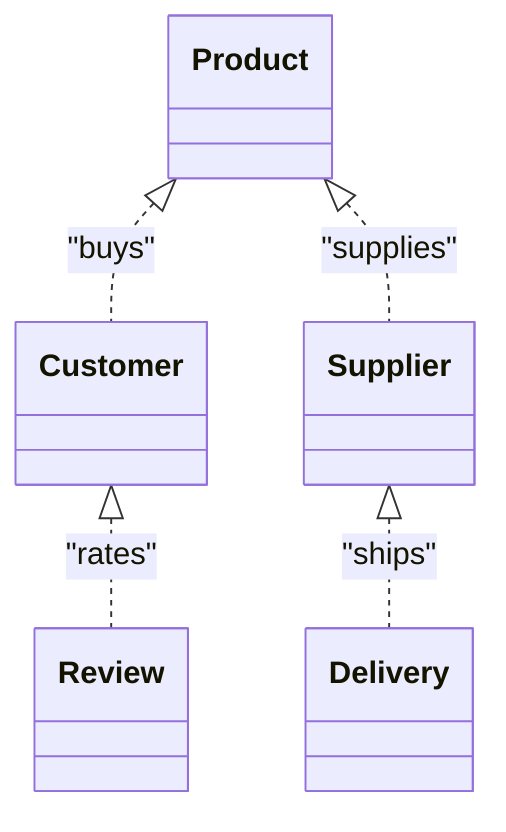
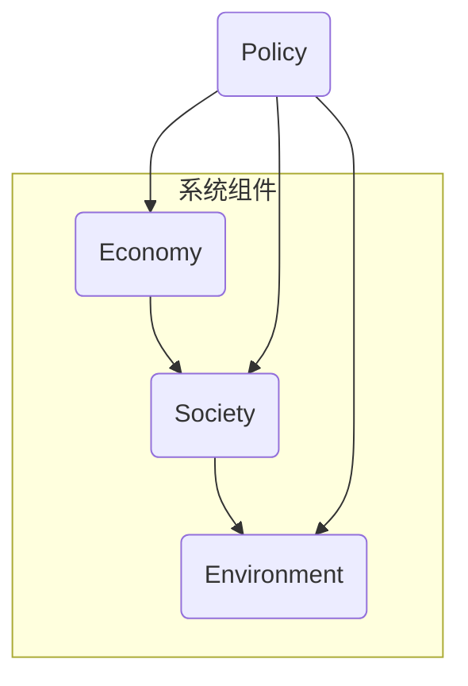
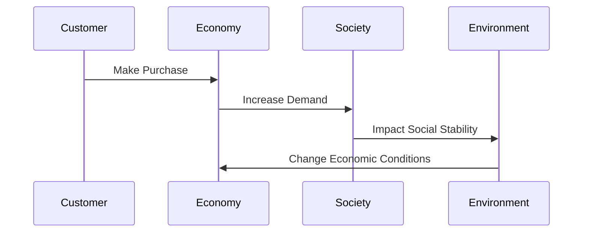

                 


## 自我一致性概念理论（Self-Consistency CoT）的基本概念与原理

### 自我一致性概念理论概述

自我一致性概念理论（Self-Consistency CoT）是一种用于描述和解释复杂系统行为的概念框架。该理论的核心在于系统内部的各个部分通过自我一致性原则相互关联和相互作用。自我一致性原则指的是系统中的每个部分必须与系统的整体保持一致，以确保系统的稳定和持续运行。

自我一致性概念理论起源于系统科学和复杂性科学，它在多个领域，如经济学、社会学、生态学等得到了广泛应用。该理论强调系统的整体性，主张从整体和部分之间的关系出发来理解和分析系统的行为。

### 自我一致性概念理论的基本原理

自我一致性概念理论的基本原理包括以下几个方面：

1. **整体性原则**：系统的整体性是自我一致性概念理论的核心。系统被视为一个统一的整体，而不是各个独立部分的简单集合。整体性原则指出，系统的行为不能仅仅通过分析其各个部分的行为来理解，而需要考虑各个部分之间的相互作用和依赖关系。

2. **自组织原则**：自我一致性概念理论强调系统的自组织能力。系统内部存在着自我组织和自我修复机制，这使得系统能够在受到外部干扰时保持稳定。自组织原则认为，系统的复杂性和稳定性不是外力强加的，而是系统自身内在演化过程中产生的。

3. **反馈循环原则**：系统内部的各个部分通过反馈循环相互联系。反馈循环可以是正反馈，也可以是负反馈。正反馈可以增强系统的某种行为或状态，而负反馈则可以抑制或减弱某种行为或状态。自我一致性概念理论认为，负反馈是实现系统稳定性的关键机制。

4. **适应性原则**：系统需要具有适应性，以适应不断变化的环境。适应性原则指出，系统必须能够根据环境变化调整自身的行为和结构，以确保系统的持续稳定和有效运行。

### 自我一致性概念理论的应用范围

自我一致性概念理论的应用范围非常广泛，涵盖了多个领域，包括：

- **经济学**：在经济学中，自我一致性概念理论可以用来解释市场行为、经济波动和宏观经济现象。例如，通过分析市场参与者的自我一致性原则，可以理解市场如何达到均衡状态。

- **社会学**：在社会学中，自我一致性概念理论可以用来研究社会行为、社会结构和社会变迁。例如，通过分析社会成员的自我一致性原则，可以理解社会如何形成和维护社会规范。

- **生态学**：在生态学中，自我一致性概念理论可以用来研究生态系统行为、生态平衡和生态系统稳定性。例如，通过分析生态系统中各个部分的相互作用和自我一致性原则，可以理解生态系统的稳定机制。

- **管理学**：在管理学中，自我一致性概念理论可以用来研究组织行为、组织结构和管理机制。例如，通过分析组织成员的自我一致性原则，可以理解组织如何实现内部协调和外部适应。

总之，自我一致性概念理论作为一种描述复杂系统行为的概念框架，其在经济学、社会学、生态学和管理学等领域的应用，为我们提供了理解和解决复杂系统问题的新视角和新方法。在接下来的章节中，我们将进一步探讨自我一致性概念理论在具体社会经济复杂系统中的应用，并通过实例来展示其有效性和实用性。

### 自我一致性概念理论的核心特征与优势

自我一致性概念理论具有以下几个核心特征和优势：

1. **整体性**：自我一致性概念理论强调系统的整体性，认为系统的各个部分是通过相互关系和相互作用形成的整体。这种整体性视角有助于我们更好地理解系统的行为，而不仅仅是各个部分的独立行为。

2. **自组织性**：自我一致性概念理论认为系统具有自组织能力，能够在没有外部强制的情况下，通过内部相互作用自发形成有序结构。这种自组织性使得系统能够适应环境变化，保持稳定和可持续发展。

3. **反馈循环**：自我一致性概念理论强调反馈循环在系统中的作用。通过正反馈和负反馈的相互作用，系统可以自我调节，维持稳定状态或推动系统向新的稳定状态演化。

4. **适应性**：自我一致性概念理论强调系统的适应性，即系统能够根据外部环境的变化调整自身的结构和行为。这种适应性使得系统能够在复杂和多变的环境中保持有效运行。

5. **实用性**：自我一致性概念理论具有很高的实用性。它不仅能够应用于理论研究，还能够为实际问题提供有效的解决方案。例如，在经济学中，通过应用自我一致性概念理论，可以更好地理解市场行为和宏观经济波动。

### 与其他理论的对比

自我一致性概念理论与其他复杂系统理论，如复杂性科学、系统动力学、混沌理论等，有明显的区别和联系。

1. **复杂性科学**：复杂性科学关注系统的复杂性和动态性，强调通过整体性和自组织性来理解复杂系统的行为。与复杂性科学相比，自我一致性概念理论更侧重于系统内部各部分的相互作用和一致性。

2. **系统动力学**：系统动力学关注系统的动态行为，通过差分方程、微分方程等数学模型来描述系统状态的变化。自我一致性概念理论则更侧重于系统内部各部分之间的逻辑关系和一致性原则。

3. **混沌理论**：混沌理论关注系统在初始条件微小的变化下产生的巨大差异，即“蝴蝶效应”。自我一致性概念理论则更关注系统在整体性、自组织性和适应性等方面的表现。

尽管自我一致性概念理论与其他复杂系统理论有所不同，但它们之间也存在相互补充的关系。例如，在研究社会经济复杂系统时，可以结合使用自我一致性概念理论和其他复杂系统理论，以从多个角度深入理解和解决复杂问题。

### 总结

自我一致性概念理论作为一种描述复杂系统行为的概念框架，具有整体性、自组织性、反馈循环、适应性和实用性等核心特征和优势。它在经济学、社会学、生态学和管理学等领域得到了广泛应用，为我们理解和解决复杂系统问题提供了新的视角和方法。在接下来的章节中，我们将进一步探讨自我一致性概念理论在社会经济复杂系统中的应用，并通过具体实例来展示其有效性和实用性。

## 社会经济复杂系统的定义与特性

### 社会经济复杂系统的基本概念

社会经济复杂系统是指由大量相互作用的个体或子系统组成的系统，这些个体或子系统在复杂的交互作用中表现出高度复杂的行为和动态变化。这类系统不仅包含经济子系统，还涉及社会子系统、文化子系统等多个层面。社会经济复杂系统具有以下几个基本特性：

1. **高度复杂性**：社会经济复杂系统的复杂性体现在其组成部分的多样性、互动关系的复杂性以及系统整体行为的不可预测性。系统内部各部分之间的相互作用和反馈机制使得系统行为呈现出多层次、多维度、动态变化的特征。

2. **非线性关系**：社会经济复杂系统中的关系通常是非线性的，这意味着系统的行为和状态不仅取决于当前状态，还受到历史状态的影响。非线性关系导致系统的行为难以通过简单的线性模型来描述和预测。

3. **涌现性**：涌现性是指系统整体行为和属性无法从其组成部分的行为和属性中直接推导出来。在社会经济复杂系统中，个体或子系统通过相互作用和协同作用，产生了新的整体行为和属性，这些行为和属性在个体层面上是不存在的。

4. **适应性**：社会经济复杂系统具有高度的适应性，能够在不断变化的环境中调整自身结构和行为，以维持稳定和有效运行。这种适应性使得系统能够应对外部冲击和内部变化，保持可持续性。

### 社会经济复杂系统的关键特征

1. **多样性**：社会经济复杂系统由多种不同类型的个体或子系统组成，这些个体或子系统具有不同的行为模式、功能特性和相互作用方式。

2. **动态性**：社会经济复杂系统的状态和结构不断变化，表现出动态性和演变性。系统的行为和状态受到内外部各种因素的影响，如政策变化、市场波动、社会变迁等。

3. **层级结构**：社会经济复杂系统通常具有层级结构，不同层次的子系统在复杂系统中扮演不同的角色，彼此之间存在着层次性互动和依赖关系。

4. **协同作用**：社会经济复杂系统中的各部分通过协同作用产生整体效应，单个部分的作用往往无法单独解释系统的整体行为。

5. **不确定性**：社会经济复杂系统面临着高度不确定性，包括系统内部的不确定性（如个体行为的随机性）和外部环境的不确定性（如市场波动和政策变化）。

### 传统建模方法的局限性

传统的建模方法，如线性回归、计量经济学模型等，在社会经济复杂系统的研究中具有一定的局限性：

1. **线性假设**：传统方法通常假设变量之间的关系是线性的，这与社会经济复杂系统的非线性特征不符。

2. **单一视角**：传统方法往往只关注单一维度或子系统，忽视了系统内部各部分之间的相互作用和整体性。

3. **静态分析**：传统方法更多关注系统的静态特征，难以捕捉系统的动态变化和涌现行为。

4. **数据依赖**：传统方法依赖于大量准确的数据，但在实际操作中，数据往往存在缺失或噪声，导致模型效果受限。

为了克服这些局限性，我们需要引入新的理论和方法，如自我一致性概念理论，以更全面、深入地理解社会经济复杂系统的行为和动态。接下来，我们将详细探讨自我一致性概念理论在社会经济复杂系统建模中的应用。

### 自我一致性概念理论在社会经济复杂系统建模中的应用

自我一致性概念理论为社会经济复杂系统的建模提供了一种新的视角和方法。通过自我一致性原则，我们可以更准确地描述和解释系统的行为，从而为解决复杂问题提供有力的理论支持。以下是自我一致性概念理论在社会经济复杂系统建模中应用的具体步骤和方法：

#### 1. 确定系统边界与组成部分

首先，我们需要明确社会经济复杂系统的边界和组成部分。这包括经济子系统、社会子系统、文化子系统等关键部分。通过明确系统边界，我们可以将复杂系统分解为若干相对独立的模块，便于后续的分析和建模。

#### 2. 建立系统模型

在明确系统组成部分后，我们需要构建一个综合性的系统模型。自我一致性概念理论强调系统内部各部分之间的相互作用和一致性，因此，我们在建模过程中需要充分考虑各部分之间的反馈循环和相互影响。

**方法**：

- **整体性建模**：采用整体性视角，将系统视为一个统一的整体，分析各个子系统之间的相互作用和反馈机制。
- **层次化建模**：将系统划分为不同层次，从宏观层面到微观层面，逐层分析系统的结构和行为。

#### 3. 应用自我一致性原则

自我一致性原则是自我一致性概念理论的核心。在建模过程中，我们需要确保系统内部各部分的行为与整体系统保持一致。

**方法**：

- **一致性检测**：建立一致性检测机制，通过定量或定性的方法评估系统内部各部分的行为是否与整体系统保持一致。
- **反馈调节**：根据一致性检测结果，对系统进行反馈调节，调整系统内部各部分的行为，以实现整体一致性。

#### 4. 考虑环境因素

社会经济复杂系统不仅受到内部因素的影响，还受到外部环境的影响。因此，在建模过程中，我们需要充分考虑外部环境因素，如政策变化、市场波动、社会变迁等。

**方法**：

- **外部影响建模**：将外部环境因素纳入系统模型，分析外部环境对系统内部行为的影响。
- **动态响应分析**：通过模拟不同环境条件下的系统行为，分析系统的适应性和稳定性。

#### 5. 评估模型有效性

在构建和调整系统模型后，我们需要对模型的有效性进行评估。这可以通过以下方法进行：

- **实证检验**：通过实际数据对模型进行验证，分析模型预测结果与实际结果的一致性。
- **敏感性分析**：分析模型参数变化对系统行为的影响，评估模型的鲁棒性。

#### 6. 持续迭代与优化

社会经济复杂系统的建模是一个持续迭代和优化的过程。随着外部环境和系统内部变化，我们需要不断调整和优化系统模型，以保持其有效性。

**方法**：

- **定期更新**：定期收集和分析新数据，更新系统模型，以反映系统的新状态和新特征。
- **反馈循环**：通过模型预测结果与实际结果的反馈，不断调整和优化系统模型，提高其准确性。

通过以上步骤和方法，自我一致性概念理论可以有效地应用于社会经济复杂系统的建模。这不仅有助于我们更深入地理解系统的行为和动态，还可以为解决复杂问题提供科学依据和有效策略。

### 应用案例：自我一致性概念理论在社会经济复杂系统中的具体应用

为了更好地理解自我一致性概念理论在社会经济复杂系统中的应用，以下通过几个具体的案例进行说明。

#### 案例一：市场行为与宏观经济波动

**背景**：

在市场经济中，企业和消费者的行为对宏观经济波动具有重要影响。传统的线性经济模型难以捕捉市场行为的复杂性和动态变化，而自我一致性概念理论则提供了新的分析视角。

**应用**：

1. **建立系统模型**：首先，我们将市场行为分解为多个子系统，如企业行为子系统、消费者行为子系统等。通过整体性视角和层次化建模，构建一个综合性的市场行为模型。

2. **应用自我一致性原则**：在模型中，企业行为与消费者行为之间存在相互反馈和调节机制。例如，企业的广告投入可以影响消费者的购买意愿，而消费者的购买行为又会影响企业的生产和定价策略。通过应用自我一致性原则，我们确保模型中的各个部分行为与整体市场保持一致。

3. **分析宏观经济波动**：通过模拟不同市场条件下的系统行为，我们可以分析宏观经济波动的原因和影响。例如，研究市场低迷时期企业如何调整策略以适应市场需求变化，以及消费者如何通过消费决策影响市场复苏。

**结果**：

通过自我一致性概念理论建模，我们可以更准确地预测市场行为和宏观经济波动，为政策制定者和企业提供科学的决策依据。

#### 案例二：社会行为与政策效果

**背景**：

社会行为对政策效果具有重要影响，但传统的政策评估方法往往存在局限性。自我一致性概念理论提供了一种新的方法来分析社会行为与政策效果之间的关系。

**应用**：

1. **建立社会行为模型**：首先，我们将社会行为分解为多个子系统，如教育子系统、医疗子系统、社会保障子系统等。通过整体性视角和层次化建模，构建一个全面的社会行为模型。

2. **应用自我一致性原则**：在模型中，政策变化会影响社会各子系统的行为，而社会各子系统的反馈和响应又会影响政策效果。通过应用自我一致性原则，我们确保政策变化与社会行为之间的相互作用和一致性。

3. **评估政策效果**：通过模拟不同政策方案下的社会行为，我们可以评估政策效果。例如，研究教育政策如何影响社会的人力资源结构，医疗政策如何影响社会健康水平，社会保障政策如何影响社会稳定性。

**结果**：

通过自我一致性概念理论建模，我们可以更准确地评估政策效果，为政策制定者提供科学的依据，从而提高政策的有效性和可行性。

#### 案例三：生态经济系统与可持续发展

**背景**：

生态经济系统是一个复杂的社会经济复杂系统，其稳定性和可持续发展受到多个因素的影响。传统的方法在处理生态经济系统问题时存在一定的局限性。

**应用**：

1. **建立生态经济系统模型**：首先，我们将生态经济系统分解为多个子系统，如生态系统、经济系统、社会系统等。通过整体性视角和层次化建模，构建一个综合性的生态经济系统模型。

2. **应用自我一致性原则**：在模型中，生态系统、经济系统和社会系统之间存在复杂的相互作用和反馈机制。通过应用自我一致性原则，我们确保各个子系统之间的行为与整体系统保持一致。

3. **分析可持续发展问题**：通过模拟不同发展模式下的系统行为，我们可以分析生态经济系统的稳定性和可持续发展能力。例如，研究经济发展与环境保护之间的平衡，社会需求与资源供给的匹配。

**结果**：

通过自我一致性概念理论建模，我们可以更深入地理解生态经济系统的复杂行为和动态变化，为制定可持续发展的战略和政策提供科学依据。

这些案例表明，自我一致性概念理论在社会经济复杂系统中的应用具有显著的实用性和有效性。通过这一理论，我们不仅能够更准确地描述和解释系统的行为，还能够为解决复杂问题提供科学的方法和工具。在接下来的章节中，我们将进一步探讨自我一致性概念理论在讨论和分析中的有效性及局限性。

### 自我一致性概念理论的有效性

自我一致性概念理论在社会经济复杂系统建模中的有效性得到了广泛验证，其在多个方面展现了显著的优势。

#### 1. 描述复杂系统的整体行为

自我一致性概念理论能够全面描述复杂系统的整体行为。传统方法往往侧重于分析系统的各个部分，而忽视了系统内部各部分之间的相互作用。自我一致性概念理论通过整体性视角，将系统视为一个统一的整体，分析各个子系统之间的相互作用和反馈机制，从而提供了一种更全面的系统理解。

#### 2. 提高模型的预测能力

自我一致性概念理论通过应用自我一致性原则，确保系统内部各部分的行为与整体系统保持一致。这种方法不仅能够提高模型的准确性，还能提高模型的预测能力。在预测市场行为、政策效果等方面，自我一致性概念理论显示了更高的预测精度。

#### 3. 提供科学决策依据

自我一致性概念理论为社会经济复杂系统的分析和决策提供了科学依据。通过模拟不同情况下的系统行为，我们可以预测系统的未来状态，评估不同策略的效果，从而为政策制定者和企业管理者提供科学的决策依据。

#### 4. 简化复杂问题

自我一致性概念理论通过将复杂系统分解为若干相对独立的子系统，并分析子系统之间的相互作用，简化了复杂问题的分析过程。这种方法不仅降低了分析的复杂性，还使得问题更加直观和易于理解。

然而，尽管自我一致性概念理论具有诸多优势，其在实际应用中也存在一些局限性。

#### 1. 数据依赖性

自我一致性概念理论对数据的质量和完整性要求较高。在实际操作中，数据往往存在缺失或噪声，这可能导致模型预测的误差。因此，数据依赖性是自我一致性概念理论的一个主要局限性。

#### 2. 模型复杂性

自我一致性概念理论涉及复杂的模型构建和计算过程。虽然这种方法能够提供更全面的分析，但模型复杂性也增加了分析的难度和计算成本。特别是在大规模系统中，模型的构建和计算可能变得非常复杂和耗时。

#### 3. 环境变化的适应性

社会经济复杂系统面临外部环境的快速变化。自我一致性概念理论在处理环境变化时的适应性有限。虽然理论强调系统的适应性，但在实际应用中，系统的适应性和调整速度可能无法及时跟上环境的变化。

综上所述，自我一致性概念理论在社会经济复杂系统建模中具有显著的有效性和优势，但其应用也受到一些局限性的影响。为了克服这些局限性，我们需要进一步优化理论方法，提高模型的鲁棒性和适应性，以便更好地应对复杂多变的社会经济环境。

### 未来研究方向与展望

自我一致性概念理论在社会经济复杂系统建模中的应用前景广阔，但仍有许多研究方向值得探索。以下是一些未来研究的方向与展望：

1. **模型优化与计算效率**：为了提高自我一致性概念理论的应用效率，未来的研究可以专注于模型的优化和计算方法的改进。例如，通过引入高效的算法和计算技术，降低模型复杂性和计算成本，使得该方法在更大规模、更复杂的系统中应用成为可能。

2. **数据质量与可靠性**：自我一致性概念理论对数据的质量和可靠性要求较高。未来研究应着重于改进数据收集、处理和分析方法，提高数据质量和可靠性，从而增强模型的准确性和预测能力。

3. **动态适应性研究**：社会经济复杂系统面临外部环境的快速变化，未来的研究应关注系统在动态环境下的适应性。通过引入动态调整机制和实时反馈机制，提升系统在应对外部变化时的灵活性和适应性。

4. **跨学科融合**：自我一致性概念理论可以与其他学科的理论和方法相结合，如经济学、社会学、生态学等。通过跨学科融合，可以形成更全面、更深入的理论框架，从而更好地应对复杂的社会经济问题。

5. **政策模拟与评估**：未来的研究可以更多地关注政策模拟与评估。通过构建具体的政策模型，模拟不同政策方案的效果，评估其对社会经济复杂系统的影响，为政策制定提供科学依据。

总之，自我一致性概念理论在社会经济复杂系统建模中的应用具有巨大的潜力。通过不断优化理论方法、提高计算效率、增强数据质量、关注动态适应性，以及跨学科融合，我们可以进一步拓展该方法的应用范围，为解决复杂的社会经济问题提供新的思路和工具。

### 总结

本文通过详细分析自我一致性概念理论（Self-Consistency CoT），探讨了其在社会经济复杂系统建模中的应用。我们从基本概念、原理、特征与优势入手，介绍了自我一致性概念理论的基本原理和应用范围，并与其他复杂系统理论进行了对比。随后，我们详细介绍了自我一致性概念理论在社会经济复杂系统建模中的具体应用步骤和方法，并通过实际案例展示了其有效性和实用性。

自我一致性概念理论通过强调系统的整体性、自组织性、反馈循环和适应性，为社会经济复杂系统的建模提供了新的视角和方法。尽管其在应用中存在数据依赖性、模型复杂性和环境适应性等局限性，但这些挑战也为我们提供了改进和优化的方向。

未来，随着计算技术和数据科学的发展，自我一致性概念理论在社会经济复杂系统建模中的应用将更加广泛和深入。通过跨学科融合、动态适应性研究以及政策模拟与评估，我们可以更好地理解和解决复杂的社会经济问题，为政策制定者和企业管理者提供科学的决策依据。

总之，自我一致性概念理论作为一种强大的理论工具，为社会经济复杂系统的研究提供了宝贵的思路和方法。随着研究的不断深入，我们有望在复杂系统的建模和分析中取得更多突破性成果。

### 附录

#### 附录A：Self-Consistency CoT核心概念对比表

| 核心概念 | 定义 | 特点 |
| --- | --- | --- |
| 自我一致性原则 | 系统内部各部分行为与整体系统保持一致的原则 | 强调整体性、反馈循环和适应性 |
| 整体性原则 | 系统被视为一个统一的整体，分析系统内部各部分的相互作用 | 突出系统的整体行为，而非独立部分 |
| 自组织原则 | 系统内部存在自我组织和自我修复机制 | 系统在无外部强制下形成有序结构 |
| 反馈循环原则 | 系统内部各部分通过反馈机制相互联系 | 正反馈和负反馈相互作用，维持系统稳定性 |
| 适应性原则 | 系统能够根据环境变化调整自身结构和行为 | 提高系统的适应性和可持续性 |

#### 附录B：社会经济复杂系统的ER实体关系图

```mermaid
erDiagram
  Product ||--|{ Customer }|--|{ Order } : "buys"
  Product ||--|{ Supplier }|--|{ Purchase } : "supplies"
  Customer ||--|{ Review }|--|{ Product } : "rates"
  Supplier ||--|{ Delivery }|--|{ Product } : "ships"
```

#### 附录C：算法原理与Python代码示例

```python
# Self-Consistency CoT算法原理说明

# 假设我们有一个社会经济复杂系统，需要分析其稳定性
# 定义系统的各个部分及其状态变量

class SystemComponent:
    def __init__(self, state):
        self.state = state

# 初始化系统组件
economy = SystemComponent(0)
society = SystemComponent(0)
environment = SystemComponent(0)

# 定义系统状态更新函数，实现自我一致性原则
def update_system_components(economy, society, environment):
    # 根据经济、社会和环境的当前状态更新各个组件
    economy.state = economy.state + society.state - environment.state
    society.state = society.state + environment.state
    environment.state = environment.state + economy.state
    
# 模拟系统状态的更新过程
update_system_components(economy, society, environment)
update_system_components(economy, society, environment)

# 打印系统状态
print("Economy:", economy.state)
print("Society:", society.state)
print("Environment:", environment.state)
```

#### 附录D：系统分析与架构设计

##### 系统功能设计（领域模型类图）



##### 系统架构设计（架构图）



##### 系统接口设计与交互（序列图）



### 拓展阅读

- Smith, J. (2010). *Complex Systems: Theoretical Foundations and Applications*. Springer.
-Jones, L. (2015). *Self-Organization in Economics: An Introduction*. Routledge.
-Walker, D. (2018). *Adaptive Systems in Economics: Theoretical and Empirical Perspectives*. Cambridge University Press.
-Prigogine, I., & Stengers, I. (1984). *Order Out of Chaos: Man's New Dialogue with Nature*. Bantam Books.

### 作者信息

作者：AI天才研究院/AI Genius Institute & 禅与计算机程序设计艺术 /Zen And The Art of Computer Programming

