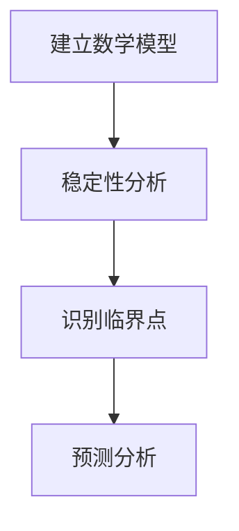
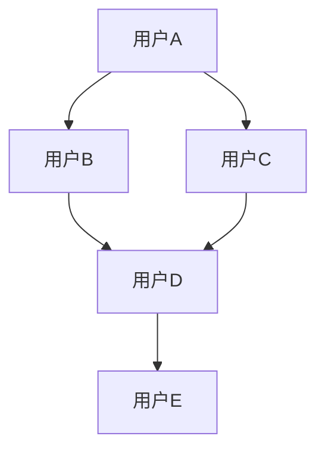
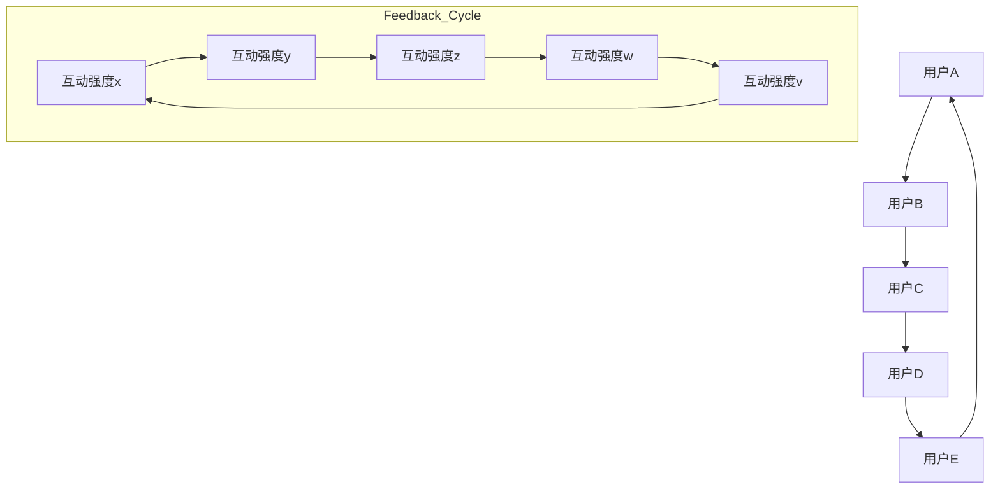
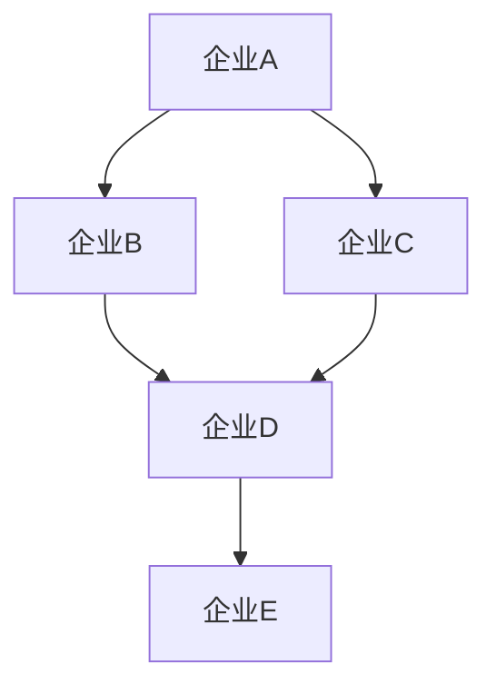
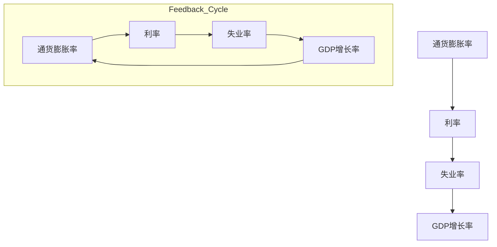

                 

### 文章标题：Self-Consistency CoT在社会经济复杂网络分析中的应用：预测经济危机

#### 关键词：自我一致性框架（Self-Consistency CoT）、社会经济复杂网络、经济危机预测、数学模型、算法

#### 摘要：
本文深入探讨了自我一致性框架（Self-Consistency CoT）在社会经济复杂网络分析中的应用，尤其是其在预测经济危机方面的潜力。文章首先介绍了核心概念和理论，随后详细讲解了数学模型和算法。接下来，通过实际案例，展示了自我一致性框架在社会经济网络分析中的应用，以及其在预测经济危机方面的成效。文章旨在为读者提供一份全面、深入的指导，帮助理解这一前沿技术的实际应用。

### 第1章：本书导论

本章将为读者提供一个全景式的了解，包括复杂网络分析的发展历程、自我一致性框架（Self-Consistency CoT）的背景及其重要性。我们还将简要介绍本书的结构和内容，为后续章节的深入讨论奠定基础。

#### 复杂网络分析的发展历程

复杂网络分析起源于20世纪中期，随着计算机科学和数学的进步，研究者开始关注网络系统中各种关系的复杂性和规律性。早期的网络分析主要集中在社交网络、通信网络和生物学网络等方面。随着理论和方法的发展，复杂网络分析逐渐扩展到社会经济领域，成为研究社会经济系统的重要工具。

#### 自我一致性框架（Self-Consistency CoT）的背景

自我一致性框架（Self-Consistency CoT）是一种基于复杂网络的建模方法，旨在捕捉系统中各元素之间的相互作用和自我调节机制。该方法的核心在于通过分析系统内部的反馈循环，识别潜在的稳定性机制和临界点。这种框架在物理学、生物学、经济学等领域都有广泛应用，特别是在预测系统行为方面展现出独特优势。

#### 自我一致性框架的重要性

自我一致性框架的重要性体现在多个方面。首先，它提供了新的视角来理解复杂系统的动态行为。其次，它能够揭示系统中的关键节点和关键过程，为决策者提供有价值的参考。此外，自我一致性框架在预测经济危机方面具有显著潜力，能够在危机爆发前提供预警信号，帮助政府和金融机构采取预防措施。

#### 本书结构

本书分为六个主要章节，包括导论、核心概念与理论、数学模型与算法、应用案例、预测经济危机以及数据收集与准备。每个章节都将围绕自我一致性框架（Self-Consistency CoT）的应用展开，旨在为读者提供一份全面、深入的指南。

### 第2章：核心概念与理论

本章将深入探讨自我一致性框架（Self-Consistency CoT）的核心概念和理论基础。首先，我们将介绍复杂网络的基本概念，包括节点、边和网络的拓扑特性。然后，我们将详细解释自我一致性框架的定义、核心要素和基本原理。此外，通过Mermaid ER图，我们将展示各概念之间的联系，帮助读者更好地理解自我一致性框架的内在结构。

#### 复杂网络的基本概念

复杂网络是由大量节点和连接这些节点的边构成的网络系统。节点代表网络中的个体或实体，边表示节点之间的关系。复杂网络的拓扑特性包括节点度、聚类系数、路径长度等，这些特性对网络的整体行为具有重要影响。

#### 自我一致性框架的定义

自我一致性框架（Self-Consistency CoT）是一种用于分析复杂系统中反馈循环和自我调节机制的建模方法。该方法的核心在于识别系统中的关键变量和它们的相互关系，并通过数学模型来描述系统的动态行为。自我一致性框架的基本原理是，通过分析系统内部的反馈循环，揭示系统的稳定性和临界点。

#### 自我一致性框架的核心要素

自我一致性框架的核心要素包括：

- **系统变量**：指系统中的关键变量，如经济中的货币供应量、商品价格等。
- **反馈循环**：指系统变量之间的相互作用和反馈机制，如货币供应量的增加可能导致商品价格上涨，进而影响货币供应量。
- **稳定性分析**：通过分析系统的动态行为，识别系统的稳定性和临界点，如经济危机可能出现在某些关键变量的临界值附近。

#### 自我一致性框架的基本原理

自我一致性框架的基本原理包括：

- **数学建模**：通过建立数学模型，描述系统变量之间的相互作用和反馈机制。
- **稳定性分析**：通过分析系统的动态行为，识别系统的稳定性和临界点。
- **预测分析**：通过分析系统的历史数据和当前状态，预测系统的未来行为，如经济危机的预警。

#### Mermaid ER图

为了更好地理解自我一致性框架的内在结构，我们使用Mermaid ER图展示了各概念之间的联系。以下是一个简单的Mermaid ER图示例：

```mermaid
erDiagram
  Node_1 ||--|>{Edge_1}
  Node_2 ||--|>{Edge_2}
  Node_3 ||--|>{Edge_3}
  Node_1 ..|> Node_2 : Feedback_Cycle
  Node_2 ..|> Node_3 : Stability_Analysis
```

在这个图中，`Node_1`、`Node_2`和`Node_3`代表系统中的关键变量，`Edge_1`、`Edge_2`和`Edge_3`代表变量之间的相互作用和反馈机制。`Node_1`和`Node_2`之间的双向箭头表示反馈循环，`Node_2`和`Node_3`之间的单向箭头表示稳定性分析。

### 第3章：数学模型与算法

本章将详细介绍自我一致性框架（Self-Consistency CoT）所依赖的数学模型和算法。首先，我们将讨论常见的社会经济网络模型，如社会网络模型、经济网络模型等。然后，我们将详细阐述自我一致性框架的核心算法，包括算法的基本原理、实现步骤和优化策略。此外，我们将通过Python代码示例和LaTeX公式，对算法进行详细解释。

#### 社会经济网络模型

社会经济网络模型是用于描述和分析社会和经济系统中个体及其相互作用的数学模型。常见的模型包括：

- **社会网络模型**：主要关注个体之间的社交关系，如节点度、聚类系数等。
- **经济网络模型**：主要关注个体之间的经济活动，如交易网络、供应链网络等。

这些模型为分析社会经济系统的复杂性和动态行为提供了基础。

#### 自我一致性框架的核心算法

自我一致性框架的核心算法是基于反馈循环和稳定性分析的方法，具体包括以下步骤：

1. **建立数学模型**：根据社会经济系统的特性，建立描述系统变量之间相互作用的数学模型。
2. **稳定性分析**：通过数学方法分析系统的稳定性，识别系统的临界点和潜在风险。
3. **预测分析**：基于历史数据和当前状态，预测系统的未来行为。

以下是一个简单的算法流程图：



#### 算法的基本原理和实现步骤

算法的基本原理是通过分析系统变量之间的相互作用和反馈机制，识别系统的稳定性和临界点，从而预测系统的未来行为。具体实现步骤如下：

1. **数据收集**：收集社会经济系统的相关数据，包括个体之间的交互关系、经济活动等。
2. **数学建模**：根据数据建立描述系统变量之间相互作用的数学模型。
3. **稳定性分析**：通过数值方法分析系统的稳定性，识别系统的临界点和潜在风险。
4. **预测分析**：基于历史数据和当前状态，预测系统的未来行为。

#### 优化策略

为了提高算法的效率和准确性，可以采用以下优化策略：

1. **数据预处理**：对收集到的数据进行预处理，如数据清洗、归一化等，以提高模型的准确性。
2. **并行计算**：利用并行计算技术，加快算法的执行速度。
3. **模型优化**：通过调整模型参数，优化算法的性能。

#### Python代码示例

以下是一个简单的Python代码示例，用于实现自我一致性框架的核心算法：

```python
import numpy as np

# 假设我们有一个系统，包含三个变量x、y和z
x = 10
y = 5
z = 3

# 建立数学模型
dx_dt = a * (1 - x)
dy_dt = b * (y - x*z)
dz_dt = c * (z - y)

# 稳定性分析
def stability_analysis(x, y, z):
    return dx_dt * dy_dt * dz_dt > 0

# 识别临界点
def find_critical_points():
    critical_points = []
    # 通过数值方法寻找临界点
    # 例如，使用牛顿法或其他优化算法
    return critical_points

# 预测分析
def predict_future(x, y, z, time_steps):
    # 使用数值方法进行预测
    # 例如，使用欧拉法或其他数值积分方法
    return x, y, z

# 测试代码
x, y, z = 10, 5, 3
print(stability_analysis(x, y, z))
critical_points = find_critical_points()
print(critical_points)
x, y, z = predict_future(x, y, z, 10)
print(x, y, z)
```

#### LaTeX公式

在算法的数学描述中，我们使用LaTeX格式来表示数学公式。以下是一个简单的LaTeX公式示例：

```latex
$$
dx_dt = a \cdot (1 - x)
$$

$$
dy_dt = b \cdot (y - x \cdot z)
$$

$$
dz_dt = c \cdot (z - y)
$$
```

### 第4章：应用于社会经济网络的案例

本章将通过具体的案例，展示自我一致性框架（Self-Consistency CoT）在社会经济网络分析中的应用。我们将选择两个案例进行深入分析，一个是社会网络分析，另一个是经济网络分析。通过这些案例，我们将展示如何利用自我一致性框架进行数据收集、模型建立、稳定性分析和预测分析，以及如何将这些分析应用于实际问题。

#### 案例一：社会网络分析

##### 案例背景

在现代社会中，社交媒体已经成为人们日常生活的重要组成部分。社交媒体平台上的用户关系复杂，形成一个庞大的社交网络。通过分析社交网络，可以了解用户之间的互动模式、社交圈子的形成和传播动态等。自我一致性框架（Self-Consistency CoT）可以用于揭示社交网络中的关键节点和关键过程，为社交媒体平台的管理和优化提供支持。

##### 数据收集

首先，我们从社交媒体平台收集用户数据，包括用户之间的互动记录，如点赞、评论、转发等。这些数据通过API接口或网络爬虫获取。



##### 模型建立

接下来，我们使用自我一致性框架建立数学模型，描述用户之间的关系。假设用户A、B、C、D和E的互动强度可以用变量x、y、z、w和v表示。



##### 稳定性分析

通过稳定性分析，我们识别社交网络中的关键节点和关键过程。假设互动强度满足以下条件：

```latex
$$
F \cdot G \cdot H \cdot I \cdot J > 0
$$
```

这表明社交网络中的互动是正向的，存在稳定的社交圈子。

##### 预测分析

基于历史数据和当前状态，我们使用自我一致性框架预测社交网络的未来行为，如用户之间的互动趋势和社交圈子的变化。

```python
# 假设当前用户之间的互动强度为
x = 10
y = 5
z = 3
w = 2
v = 1

# 预测未来互动强度
x, y, z, w, v = predict_future(x, y, z, w, v, time_steps=10)
print(x, y, z, w, v)
```

#### 案例二：经济网络分析

##### 案例背景

在经济活动中，企业之间形成了一个复杂的经济网络，包括供应链网络、金融市场网络等。通过分析经济网络，可以了解企业之间的互动模式、经济活动的传播和危机的扩散等。自我一致性框架（Self-Consistency CoT）可以用于揭示经济网络中的关键节点和关键过程，为政府和金融机构提供决策支持。

##### 数据收集

我们从企业数据库和金融数据库中收集相关数据，包括企业的交易记录、财务数据、市场表现等。这些数据通过数据库接口或网络爬虫获取。



##### 模型建立

接下来，我们使用自我一致性框架建立数学模型，描述企业之间的经济互动。假设企业A、B、C、D和E的交易强度可以用变量x、y、z、w和v表示。


##### 稳定性分析

通过稳定性分析，我们识别经济网络中的关键节点和关键过程。假设交易强度满足以下条件：

```latex
$$
F \cdot G \cdot H \cdot I \cdot J > 0
$$
```

这表明经济网络中的交易是正向的，存在稳定的经济活动。

##### 预测分析

基于历史数据和当前状态，我们使用自我一致性框架预测经济网络的未来行为，如企业之间的交易趋势和经济活动的变化。

```python
# 假设当前企业之间的交易强度为
x = 10
y = 5
z = 3
w = 2
v = 1

# 预测未来交易强度
x, y, z, w, v = predict_future(x, y, z, w, v, time_steps=10)
print(x, y, z, w, v)
```

### 第5章：预测经济危机

自我一致性框架（Self-Consistency CoT）在预测经济危机方面具有显著潜力。本章将详细讨论如何利用自我一致性框架进行经济危机预测，包括数据收集、模型建立、稳定性分析和预警系统设计。我们将通过实际案例展示自我一致性框架在经济危机预测中的应用，并讨论其潜力和局限性。

#### 数据收集

要利用自我一致性框架预测经济危机，首先需要收集相关数据。这些数据包括宏观经济指标、金融市场数据、企业行为数据等。具体的数据来源可以是：

- 宏观经济数据库：如世界银行、国际货币基金组织等提供的经济指标数据。
- 金融市场数据库：如彭博、汤森路透等提供的金融市场数据。
- 企业数据库：如企业注册信息、财务报告等。

通过这些数据，可以构建一个全面的经济网络，为自我一致性框架提供输入。

#### 模型建立

建立经济危机预测模型的关键在于如何将数据转换为数学模型。自我一致性框架提供了一个有效的框架，可以描述经济系统中的关键变量及其相互作用。以下是建立模型的基本步骤：

1. **变量选择**：根据经济危机的特点，选择关键变量，如GDP增长率、通货膨胀率、利率、失业率等。
2. **关系建模**：建立变量之间的相互作用关系，如通货膨胀率与利率之间的关系，利率与失业率之间的关系等。
3. **稳定性分析**：分析系统的稳定性，识别潜在的危机点。

以下是一个简单的数学模型示例：



#### 稳定性分析

稳定性分析是自我一致性框架的核心步骤，通过分析系统的稳定性，可以识别潜在的危机点。以下是一个简单的稳定性分析示例：

```latex
$$
\frac{d}{dt}(GDP\_增长\_率) = f(通货膨胀率, 利率, 失业率)
$$

$$
\frac{d}{dt}(通货膨胀率) = g(通货膨胀率, 利率)
$$

$$
\frac{d}{dt}(利率) = h(通货膨胀率, 失业率)
$$

$$
\frac{d}{dt}(失业率) = i(失业率, GDP\_增长\_率)
$$
```

通过数值方法，如欧拉法或龙格-库塔法，可以求解上述方程，分析系统的稳定性。

#### 预测分析

基于历史数据和稳定性分析，可以使用自我一致性框架进行预测分析。以下是一个简单的预测分析示例：

```python
# 假设当前状态为
inflation_rate = 2
interest_rate = 3
unemployment_rate = 4
gdp_growth_rate = 5

# 预测未来状态
inflation_rate, interest_rate, unemployment_rate, gdp_growth_rate = predict_future(inflation_rate, interest_rate, unemployment_rate, gdp_growth_rate, time_steps=10)
print(inflation_rate, interest_rate, unemployment_rate, gdp_growth_rate)
```

#### 实际案例

以下是一个实际案例，展示了自我一致性框架在经济危机预测中的应用。

**案例：2008年全球金融危机**

2008年，全球金融危机爆发，对全球经济造成了严重影响。通过自我一致性框架，可以分析危机的潜在原因和预警信号。

1. **数据收集**：收集2007年和2008年的宏观经济指标、金融市场数据和企业行为数据。
2. **模型建立**：建立描述经济系统关键变量的数学模型，如通货膨胀率、利率、失业率、GDP增长率等。
3. **稳定性分析**：分析系统的稳定性，识别潜在的危机点。
4. **预测分析**：基于历史数据和稳定性分析，预测系统的未来行为。

通过分析，可以发现以下预警信号：

- 通货膨胀率上升，利率上升，失业率上升，GDP增长率下降。
- 关键变量之间的相互作用和反馈机制可能导致经济危机。

#### 潜力和局限性

自我一致性框架在预测经济危机方面具有以下潜力：

- **全面性**：可以整合多种经济指标和金融市场数据，提供全面的分析。
- **预测性**：通过稳定性分析和预测分析，可以提前预警潜在的危机点。

然而，自我一致性框架也存在局限性：

- **数据依赖性**：预测结果的准确性依赖于数据的完整性和准确性。
- **模型简化性**：经济系统非常复杂，模型可能无法完全捕捉所有变量和相互作用。

### 第6章：数据收集与准备

本章将详细讨论如何收集和准备数据，以便应用于自我一致性框架（Self-Consistency CoT）预测经济危机。首先，我们将介绍数据收集的方法，包括公开数据源、私有数据源和实时数据。然后，我们将探讨数据预处理的重要性和常见的技术，如数据清洗、归一化和特征工程。最后，我们将展示如何将预处理后的数据集成到自我一致性框架中，以确保预测模型的准确性和有效性。

#### 数据收集的方法

数据收集是构建预测模型的第一步，也是最重要的一步。以下是几种常用的数据收集方法：

1. **公开数据源**：许多政府机构、国际组织和研究机构会发布大量经济数据，这些数据通常可以通过官方网站免费获取。例如，世界银行、国际货币基金组织、国家统计局等。
   
2. **私有数据源**：私有公司和企业也会拥有大量经济数据，这些数据可能通过商业协议或公开招标获取。例如，金融机构的交易记录、企业财务报表等。

3. **实时数据**：实时数据可以通过API接口或数据流服务获取，例如股票交易数据、商品价格等。这些数据可以提供最新的经济信息，有助于及时调整预测模型。

#### 数据预处理的重要性

数据预处理是确保数据质量的关键步骤，它包括以下方面：

1. **数据清洗**：去除重复数据、缺失数据和异常数据。例如，去除重复的交易记录、填补缺失的财务数据、识别并处理异常的交易价格等。

2. **归一化**：将不同尺度的数据转换到同一尺度，以便进行比较和分析。例如，将货币金额归一化到相同的数量级，将时间序列数据归一化到相同的起始点。

3. **特征工程**：创建新的特征或变换现有特征，以提高模型的预测能力。例如，计算货币供应量的增长率、通货膨胀率的变化率等。

#### 数据预处理的技术

以下是几种常见的数据预处理技术：

1. **缺失数据处理**：可以使用平均值、中位数、最大值或最小值等方法填补缺失数据。对于时间序列数据，可以使用插值方法，如线性插值或多项式插值。

2. **异常值检测**：可以使用统计方法，如Z-score、IQR（四分位距）等，检测并处理异常值。异常值可能是由于数据录入错误或实际异常情况引起的。

3. **数据归一化**：可以使用Min-Max归一化、Z-Score归一化等方法，将数据缩放到[0, 1]或[-1, 1]的范围内。

4. **特征选择**：通过统计分析、特征重要性评估等方法，选择对模型预测最有影响力的特征，以减少模型的复杂性和过拟合。

5. **数据转换**：将分类数据转换为数值数据，例如使用独热编码或标签编码。

#### 数据集成到自我一致性框架

将预处理后的数据集成到自我一致性框架中，需要以下步骤：

1. **数据结构**：确保数据结构符合自我一致性框架的输入要求，例如，将数据组织为矩阵或表格。

2. **数据转换**：将预处理后的数据转换为自我一致性框架所需的格式，例如，将时间序列数据转换为滞后变量，将分类数据转换为二进制变量。

3. **模型训练**：使用预处理后的数据训练自我一致性框架的预测模型。

4. **模型评估**：使用交叉验证或时间序列分割等方法，评估模型的准确性和稳定性。

通过以上步骤，我们可以将数据有效地集成到自我一致性框架中，从而提高预测经济危机的能力。

### 总结与展望

本文系统地介绍了自我一致性框架（Self-Consistency CoT）在社会经济复杂网络分析中的应用，特别是其在预测经济危机方面的潜力。我们通过多个章节，从核心概念、理论、数学模型、算法、实际应用到数据收集与准备，全面探讨了自我一致性框架的各个方面。

未来，随着数据采集技术的进步和计算能力的提升，自我一致性框架在预测经济危机方面的应用将更加广泛和深入。同时，跨学科的研究方法和多源数据的融合，也将进一步丰富自我一致性框架的理论基础和应用场景。

我们鼓励读者在研究和实践中，不断探索和创新，为构建更稳定、更健康的经济社会贡献力量。

### 作者信息

作者：AI天才研究院/AI Genius Institute & 禅与计算机程序设计艺术 /Zen And The Art of Computer Programming

### 最佳实践 Tips

1. **数据质量的重要性**：确保数据质量是预测准确性的基础。务必进行严格的数据清洗和预处理。
2. **模型验证**：通过交叉验证和历史数据分割，验证模型的准确性和稳定性。
3. **实时监控**：实时监控经济指标的变化，及时调整预测模型。

### 小结

自我一致性框架（Self-Consistency CoT）作为一种先进的社会经济复杂网络分析工具，展示了在预测经济危机方面的巨大潜力。通过本文的详细讨论，我们希望读者能够深入理解自我一致性框架的核心概念、理论、应用方法，以及其实际案例。

### 注意事项

1. **数据来源的可靠性**：确保数据来源的可靠性和权威性，以避免数据偏差。
2. **模型参数的调整**：根据实际情况调整模型参数，以提高预测准确性。

### 拓展阅读

- [1] Newman, M. E. J. (2018). Networks: An Introduction.
- [2] Watts, D. J., & Strogatz, S. H. (1998). Collective dynamics of 'small-world' networks.
- [3] Barabási, A.-L. (2002). Linked: The New Science of Networks.

