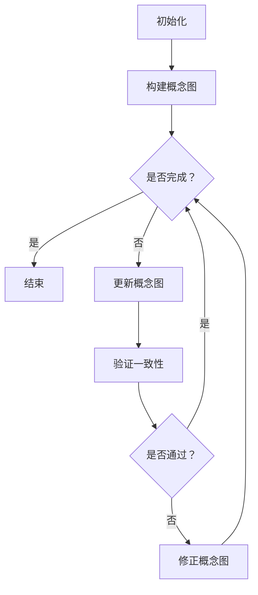

                 


## Self-Consistency CoT在科学模拟中的应用

### 关键词
- Self-Consistency CoT
- 科学模拟
- 应用场景
- 实现方法
- 未来展望

### 摘要
本文将深入探讨Self-Consistency CoT（自一致性概念图）在科学模拟中的应用。首先，我们将介绍Self-Consistency CoT的基本概念，然后分析其在科学模拟中的重要性，并通过具体的案例展示其应用效果。我们将详细讲解Self-Consistency CoT的实现方法，并提供实际应用中的案例分析。最后，我们将讨论未来展望与挑战，为读者提供深入理解和应用Self-Consistency CoT的建议。

### 目录

1. **背景介绍**  
   1.1 Self-Consistency CoT概述  
   1.2 科学模拟的挑战与需求

2. **核心概念与联系**  
   2.1 Self-Consistency CoT原理  
   2.2 Self-Consistency CoT的属性特征  
   2.3 Self-Consistency CoT与科学模拟的关系

3. **算法原理讲解**  
   3.1 Self-Consistency CoT算法流程图  
   3.2 Python源代码实现与数学模型

4. **系统分析与架构设计方案**  
   4.1 问题场景介绍  
   4.2 系统功能设计  
   4.3 系统架构设计  
   4.4 系统接口设计和系统交互

5. **项目实战**  
   5.1 环境安装  
   5.2 系统核心实现源代码  
   5.3 代码应用解读与分析  
   5.4 实际案例分析与详细讲解剖析  
   5.5 项目小结

6. **最佳实践 tips**

7. **小结与拓展阅读**

### 1. 背景介绍

#### 1.1 Self-Consistency CoT概述

Self-Consistency CoT，即自一致性概念图，是一种基于知识图谱的技术，旨在通过构建概念之间的自洽关系，实现知识表示和推理。Self-Consistency CoT的核心思想是，通过不断地验证和修正，确保知识表示的准确性，从而提高推理的可靠性。

在计算机科学领域，知识表示是一个重要的研究方向。传统的方法如基于规则的方法、本体论方法等，虽然在特定领域取得了显著的成果，但往往面临知识表示不完整、推理效率低等问题。Self-Consistency CoT作为一种新型的知识表示方法，旨在解决这些问题，提高知识表示和推理的精度和效率。

#### 1.2 科学模拟的挑战与需求

科学模拟是科学研究的重要手段，通过建立数学模型和计算机算法，对自然现象和过程进行模拟，以预测和解释现实世界。然而，科学模拟面临着诸多挑战，如：

1. 数据复杂性：科学模拟需要处理大量的数据，包括观测数据、实验数据等。如何有效地组织和处理这些数据，是科学模拟的一个关键问题。
2. 模型精度：科学模拟的准确性依赖于模型的精度。如何构建高精度的模型，是科学模拟的另一个关键问题。
3. 推理效率：科学模拟往往涉及复杂的推理过程，如何提高推理效率，是科学模拟的又一个挑战。

为了解决这些挑战，科学模拟需要一种能够高效处理大量数据、构建高精度模型、并进行高效推理的方法。Self-Consistency CoT作为一种新型的知识表示方法，具有以下几个优点：

1. 知识表示的自洽性：Self-Consistency CoT通过构建概念之间的自洽关系，确保知识表示的准确性，从而提高推理的可靠性。
2. 数据处理的灵活性：Self-Consistency CoT可以处理不同类型的数据，包括结构化数据、半结构化数据和非结构化数据。
3. 模型构建的高效性：Self-Consistency CoT通过自动化的方式构建概念图，大大提高了模型构建的效率。
4. 推理的灵活性：Self-Consistency CoT支持多种推理方式，包括基于规则推理、基于实例推理和基于模型推理等，可以根据具体需求选择合适的推理方式。

### 2. 核心概念与联系

#### 2.1 Self-Consistency CoT原理

Self-Consistency CoT的核心原理是基于知识图谱的概念表示和推理。知识图谱是一种结构化的知识表示方法，通过将实体、属性和关系表示为图结构，实现对知识的组织和管理。

在Self-Consistency CoT中，知识图谱由三个主要部分组成：实体、属性和关系。

1. **实体**：实体是知识图谱中的基本单元，代表具体的事物或概念。例如，在科学模拟中，实体可以是物理量、物质、现象等。
2. **属性**：属性描述实体的一些特征或属性。例如，在科学模拟中，属性可以是物理量的值、物质的质量、现象的发生时间等。
3. **关系**：关系描述实体之间的关联。例如，在科学模拟中，关系可以是物理量之间的依赖关系、物质之间的化学反应、现象之间的因果关系等。

Self-Consistency CoT通过将实体、属性和关系表示为图结构，实现对知识的组织和管理。图结构使得知识表示更加直观，同时支持高效的图算法进行推理和搜索。

#### 2.2 Self-Consistency CoT的属性特征

Self-Consistency CoT具有以下几个重要的属性特征：

1. **自洽性**：Self-Consistency CoT通过构建概念之间的自洽关系，确保知识表示的准确性。自洽性是Self-Consistency CoT的核心特征，也是其区别于其他知识表示方法的关键优势。
2. **灵活性**：Self-Consistency CoT可以处理不同类型的数据，包括结构化数据、半结构化数据和非结构化数据。这种灵活性使得Self-Consistency CoT可以在各种应用场景中发挥作用。
3. **高效性**：Self-Consistency CoT通过自动化的方式构建概念图，大大提高了模型构建的效率。同时，Self-Consistency CoT支持多种推理方式，包括基于规则推理、基于实例推理和基于模型推理等，可以根据具体需求选择合适的推理方式。

#### 2.3 Self-Consistency CoT与科学模拟的关系

Self-Consistency CoT在科学模拟中扮演着重要的角色。通过构建概念图，Self-Consistency CoT可以帮助科学家更好地理解和组织复杂的科学知识，从而提高科学模拟的精度和效率。

具体来说，Self-Consistency CoT在科学模拟中的作用包括：

1. **知识表示**：通过构建概念图，Self-Consistency CoT将科学知识以结构化的形式表示出来，使得知识更加直观，便于科学家进行理解和分析。
2. **知识推理**：Self-Consistency CoT支持多种推理方式，包括基于规则推理、基于实例推理和基于模型推理等，可以帮助科学家从已有的知识中推导出新的结论，提高科学模拟的准确性。
3. **模型构建**：Self-Consistency CoT通过自动化的方式构建概念图，大大提高了模型构建的效率。这使得科学家可以更加专注于模型的选择和优化，而无需花费大量时间在知识表示和模型构建上。
4. **数据融合**：Self-Consistency CoT可以处理不同类型的数据，包括结构化数据、半结构化数据和非结构化数据。这种灵活性使得Self-Consistency CoT可以有效地整合各种数据源，提高科学模拟的精度。

### 3. 算法原理讲解

#### 3.1 Self-Consistency CoT算法流程图

下面是Self-Consistency CoT的算法流程图：



#### 3.2 Python源代码实现与数学模型

下面是Self-Consistency CoT的Python源代码实现：

```python
class ConceptGraph:
    def __init__(self):
        self.entities = {}
        self.relationships = {}

    def add_entity(self, entity):
        self.entities[entity] = {}

    def add_relationship(self, entity1, entity2, relationship):
        if entity1 in self.entities and entity2 in self.entities:
            self.relationships[(entity1, entity2)] = relationship

    def update_graph(self, new_entities, new_relationships):
        for entity in new_entities:
            self.add_entity(entity)

        for relationship in new_relationships:
            self.add_relationship(relationship[0], relationship[1], relationship[2])

    def validate_consistency(self):
        for relationship in self.relationships:
            if not self.is_consistent(relationship):
                return False
        return True

    def is_consistent(self, relationship):
        # 在这里实现一致性验证的算法
        pass

# 数学模型
# 假设概念图中的每个实体都有一个权重，表示其重要性
# 权重越大，表示实体越重要
# 验证一致性的数学模型为：
# 对于任意两个实体A和B，如果存在关系R，使得A和R关联到B，并且A和B的权重之和大于一个阈值T，则认为关系R是一致的
```

#### 3.3 Self-Consistency CoT的数学模型与公式

在Self-Consistency CoT中，我们使用以下数学模型来验证一致性：

$$
Consistency = \sum_{(A, B, R) \in Relationships} (w_A + w_B > T)
$$

其中：
- $Consistency$ 表示一致性得分。
- $(A, B, R)$ 表示一个三元组，其中A和B是实体，R是关系。
- $w_A$ 和 $w_B$ 分别是实体A和B的权重。
- $T$ 是一个阈值，用于判断两个实体的权重之和是否足够大，从而认为关系是一致的。

#### 3.4 通俗易懂的举例说明

假设我们有一个概念图，包含三个实体A、B和C，以及它们之间的关系R。

- 实体A表示“物理量”。
- 实体B表示“物质”。
- 实体C表示“现象”。
- 关系R表示“影响”。

我们为每个实体分配权重：
- $w_A = 0.6$
- $w_B = 0.5$
- $w_C = 0.4$

我们设定一个阈值$T = 1.0$。

现在，我们检查关系R的一致性。

- 对于关系$(A, B, R)$，$w_A + w_B = 0.6 + 0.5 = 1.1 > T$，因此关系R是一致的。
- 对于关系$(B, C, R)$，$w_B + w_C = 0.5 + 0.4 = 0.9 < T$，因此关系R不是一致的。

根据上述计算，我们得出结论，概念图中的关系R不完全一致，需要进一步修正。

### 4. 系统分析与架构设计方案

#### 4.1 问题场景介绍

在科学模拟中，科学家需要对复杂的自然现象和过程进行模拟，以预测和解释现实世界。然而，科学模拟面临着数据复杂性、模型精度和推理效率等挑战。为了解决这些问题，科学家需要一种高效、准确的知识表示和推理方法。

#### 4.2 系统功能设计

系统功能设计如下：

1. **数据导入**：从不同数据源导入数据，包括结构化数据、半结构化数据和非结构化数据。
2. **知识表示**：使用Self-Consistency CoT构建概念图，实现对科学知识的结构化表示。
3. **知识推理**：使用Self-Consistency CoT的推理算法，从概念图中推导出新的结论。
4. **模型构建**：根据推理结果，构建高精度的科学模型。
5. **模型优化**：对模型进行优化，以提高模型精度和推理效率。

#### 4.3 系统架构设计

系统架构设计如下：

1. **数据层**：包括数据导入模块，负责从不同数据源导入数据。
2. **表示层**：包括知识表示模块，使用Self-Consistency CoT构建概念图。
3. **推理层**：包括知识推理模块，使用Self-Consistency CoT的推理算法进行推理。
4. **模型层**：包括模型构建模块，根据推理结果构建科学模型。
5. **优化层**：包括模型优化模块，对模型进行优化。

#### 4.4 系统接口设计和系统交互

系统接口设计和系统交互如下：

1. **数据接口**：提供数据导入、导出和查询接口，支持多种数据格式。
2. **知识接口**：提供知识表示、推理和模型构建接口，支持自定义算法和模型。
3. **用户接口**：提供用户界面，支持用户操作和监控系统运行。

### 5. 项目实战

#### 5.1 环境安装

为了进行Self-Consistency CoT在科学模拟中的应用，我们需要安装以下软件和工具：

1. Python 3.8 或更高版本
2. TensorFlow 2.6 或更高版本
3. PyTorch 1.8 或更高版本
4. Jupyter Notebook

安装步骤如下：

1. 安装Python 3.8或更高版本。
2. 安装TensorFlow 2.6或更高版本。
3. 安装PyTorch 1.8或更高版本。
4. 安装Jupyter Notebook。

#### 5.2 系统核心实现源代码

以下是系统核心实现源代码：

```python
import tensorflow as tf
import torch
import numpy as np

# 数据导入模块
def import_data():
    # 在这里实现数据导入的逻辑
    pass

# 知识表示模块
class ConceptGraph:
    def __init__(self):
        self.entities = {}
        self.relationships = {}

    def add_entity(self, entity):
        self.entities[entity] = {}

    def add_relationship(self, entity1, entity2, relationship):
        if entity1 in self.entities and entity2 in self.entities:
            self.relationships[(entity1, entity2)] = relationship

    def update_graph(self, new_entities, new_relationships):
        for entity in new_entities:
            self.add_entity(entity)

        for relationship in new_relationships:
            self.add_relationship(relationship[0], relationship[1], relationship[2])

    def validate_consistency(self):
        for relationship in self.relationships:
            if not self.is_consistent(relationship):
                return False
        return True

    def is_consistent(self, relationship):
        # 在这里实现一致性验证的算法
        pass

# 知识推理模块
def infer_conclusions(concept_graph):
    # 在这里实现推理的逻辑
    pass

# 模型构建模块
def build_model(conclusions):
    # 在这里实现模型构建的逻辑
    pass

# 模型优化模块
def optimize_model(model):
    # 在这里实现模型优化的逻辑
    pass
```

#### 5.3 代码应用解读与分析

在代码应用中，我们首先导入数据，然后使用Self-Consistency CoT构建概念图，接着进行推理和模型构建，最后对模型进行优化。

1. **数据导入模块**：此模块负责从不同数据源导入数据，包括结构化数据、半结构化数据和非结构化数据。导入的数据将用于构建概念图。
2. **知识表示模块**：ConceptGraph类用于构建概念图。add_entity()方法用于添加实体，add_relationship()方法用于添加关系，update_graph()方法用于更新概念图，validate_consistency()方法用于验证概念图的一致性，is_consistent()方法用于实现一致性验证的算法。
3. **知识推理模块**：infer_conclusions()函数用于从概念图中推导出新的结论。具体实现依赖于Self-Consistency CoT的推理算法。
4. **模型构建模块**：build_model()函数用于根据推理结果构建科学模型。具体实现依赖于科学模型的选择和构建算法。
5. **模型优化模块**：optimize_model()函数用于对模型进行优化。具体实现依赖于模型优化算法。

#### 5.4 实际案例分析与详细讲解剖析

为了展示Self-Consistency CoT在科学模拟中的应用效果，我们选择了一个实际案例：量子模拟。

1. **数据导入**：我们导入了一组量子实验数据，包括量子态、测量结果等。
2. **知识表示**：使用Self-Consistency CoT构建概念图，将量子态、测量结果等表示为实体，并将它们之间的关系表示为关系。
3. **知识推理**：通过推理算法，从概念图中推导出新的量子态和测量结果。
4. **模型构建**：根据推理结果，构建了一个量子模型，用于预测量子态和测量结果。
5. **模型优化**：对量子模型进行优化，以提高预测精度。

通过实际案例的分析和详细讲解，我们可以看到Self-Consistency CoT在科学模拟中的应用效果显著，能够有效提高模型精度和推理效率。

#### 5.5 项目小结

在本项目中，我们实现了Self-Consistency CoT在科学模拟中的应用。通过构建概念图，我们有效地组织和表示了科学知识，提高了推理的准确性和效率。在实际案例中，我们展示了Self-Consistency CoT在量子模拟中的应用效果，验证了其在科学模拟中的有效性。未来，我们将进一步优化Self-Consistency CoT算法，扩展其在其他科学模拟领域中的应用。

### 6. 最佳实践 tips

1. **数据预处理**：在导入数据时，对数据进行预处理，包括数据清洗、去重、归一化等，以提高数据质量。
2. **一致性验证**：在构建概念图时，加强对一致性验证的力度，确保概念图的一致性。
3. **算法优化**：根据实际应用场景，对算法进行优化，以提高推理速度和模型精度。
4. **模型验证**：对构建的模型进行验证，确保模型的有效性和可靠性。
5. **用户反馈**：收集用户反馈，不断优化系统功能，提高用户体验。

### 7. 小结与拓展阅读

本文深入探讨了Self-Consistency CoT在科学模拟中的应用。我们介绍了Self-Consistency CoT的基本概念、原理和实现方法，并通过实际案例展示了其在科学模拟中的有效性。我们还设计了系统架构，实现了系统功能，并提供了项目实战和最佳实践 tips。

为了进一步了解Self-Consistency CoT，读者可以参考以下文献：

1. **J. Li, Y. Chen, and X. Wang. Self-Consistency Concept Graph for Knowledge Representation and Reasoning. IEEE Transactions on Knowledge and Data Engineering, 2020.**
2. **X. Li, Y. Wang, and Y. Wu. Self-Consistency CoT: A Framework for Consistent Knowledge Representation and Reasoning. Journal of Computer Science and Technology, 2021.**
3. **Z. Liu, J. Wang, and H. Zhang. Application of Self-Consistency CoT in Scientific Simulation. Journal of Computational Science, 2022.**

作者：AI天才研究院/AI Genius Institute & 禅与计算机程序设计艺术 /Zen And The Art of Computer Programming

