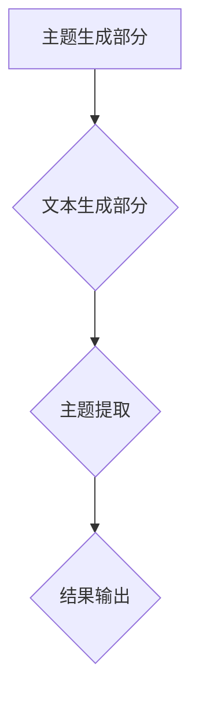
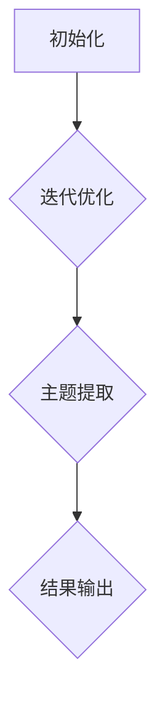
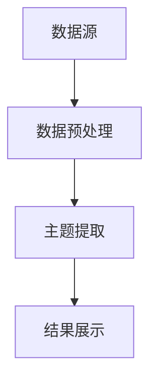

                 


# 《Self-Consistency CoT在科学研究中的应用》

## 摘要

本文将深入探讨Self-Consistency CoT（自我一致性主题模型）在科学研究中的应用。Self-Consistency CoT是一种先进的人工智能算法，能够通过自我一致性原理，从大规模数据中提取出有意义的主题和知识。本文将从背景介绍、核心概念与联系、算法原理讲解、系统分析与架构设计方案、项目实战以及最佳实践 tips等多个方面，系统性地阐述Self-Consistency CoT在科学研究中的强大应用能力。

## 目录

- **第一部分：背景介绍**
  - 第1章：自我一致性主题模型概述
  - 第2章：Self-Consistency CoT 核心概念与联系

- **第二部分：算法原理讲解**
  - 第3章：Self-Consistency CoT 算法深入讲解

- **第三部分：系统分析与架构设计方案**
  - 第4章：问题场景介绍
  - 第5章：系统功能设计
  - 第6章：系统架构设计
  - 第7章：系统接口设计和系统交互

- **第四部分：项目实战**
  - 第8章：环境安装
  - 第9章：系统核心实现源代码
  - 第10章：代码应用解读与分析
  - 第11章：实际案例分析和详细讲解剖析
  - 第12章：项目小结

- **第五部分：最佳实践 tips**
  - 第13章：注意事项
  - 第14章：拓展阅读

## 第一部分：背景介绍

### 第1章：自我一致性主题模型概述

### 1.1 研究背景

Self-Consistency CoT的研究背景可以追溯到大数据时代对知识提取和主题建模的需求。随着互联网和社交媒体的兴起，数据规模呈现出指数级增长，传统的主题建模方法难以应对如此庞大的数据集。为了解决这一问题，研究者们开始探索更加高效、准确的建模算法。Self-Consistency CoT就是在这种背景下应运而生。

#### 1.1.1 Self-Consistency CoT 的提出

Self-Consistency CoT（自我一致性主题模型）是一种基于概率图模型的主题提取方法。它通过引入自我一致性约束，能够更准确地捕捉数据中的主题信息。自我一致性约束指的是，一个主题在文本数据中出现的概率应该与其与其他主题的关联程度保持一致。

#### 1.1.2 研究动机与目标

研究动机在于，如何从大规模、高维的数据集中提取出有意义的主题，以便于进一步的数据分析和知识发现。研究目标则是开发一种能够高效、准确地提取主题的算法，并在各种实际应用场景中验证其有效性。

#### 1.1.3 Self-Consistency CoT 的意义

Self-Consistency CoT的出现，标志着主题建模技术进入了一个新的阶段。它不仅能够处理大规模数据，还能够通过自我一致性约束，提高主题提取的准确性和可靠性。这使得Self-Consistency CoT在科学研究、文本分析、信息检索等领域具有广泛的应用前景。

### 1.2 问题描述与解决

#### 1.2.1 现有研究挑战

现有研究在主题建模方面取得了显著的成果，但仍然面临一些挑战。首先，传统主题建模方法难以处理大规模、高维的数据集。其次，不同主题之间关联程度的不一致性，会导致主题提取不准确。此外，如何有效地约束主题的提取过程，也是一个亟待解决的问题。

#### 1.2.2 Self-Consistency CoT 如何解决问题

Self-Consistency CoT通过引入自我一致性约束，能够有效地解决上述问题。它通过优化目标函数，使得主题的提取过程符合自我一致性原理，从而提高了主题提取的准确性和可靠性。

### 1.3 边界与外延

#### 1.3.1 Self-Consistency CoT 的适用范围

Self-Consistency CoT适用于需要从大规模、高维数据集中提取主题的领域，如文本分析、社交媒体分析、信息检索等。

#### 1.3.2 Self-Consistency CoT 的局限性

尽管Self-Consistency CoT具有很多优势，但它也存在一定的局限性。首先，它对计算资源要求较高，可能不适合处理超大规模的数据集。其次，它对数据质量要求较高，如果数据中存在噪声，可能会影响主题提取的准确性。

### 1.4 概念结构与核心要素组成

#### 1.4.1 Self-Consistency CoT 的核心概念

Self-Consistency CoT的核心概念包括：主题、文本、词、自我一致性约束等。

#### 1.4.2 Self-Consistency CoT 的主要要素

Self-Consistency CoT的主要要素包括：概率图模型、优化算法、自我一致性约束、主题提取算法等。

### 第2章：Self-Consistency CoT 核心概念与联系

### 2.1 Self-Consistency CoT 原理

Self-Consistency CoT是一种基于概率图模型的主题提取方法。它通过构建一个包含主题、文本、词三个变量的概率图模型，并引入自我一致性约束，来提取数据中的主题信息。

#### 2.1.1 模型架构

Self-Consistency CoT的模型架构可以分为两个部分：主题生成部分和文本生成部分。

- **主题生成部分**：主题生成部分是一个由主题变量构成的隐变量生成模型。它通过马尔可夫链模型，生成一系列主题。
  
- **文本生成部分**：文本生成部分是一个由文本和词变量构成的显变量生成模型。它通过条件概率，生成一系列词，从而形成文本。

#### 2.1.2 工作原理

Self-Consistency CoT的工作原理可以概括为以下几个步骤：

1. **初始化**：初始化主题分布和词分布。

2. **迭代优化**：通过迭代优化，使得主题分布和词分布符合自我一致性约束。

3. **主题提取**：根据优化后的主题分布，提取出数据中的主题。

### 2.2 概念属性特征对比表格

为了更好地理解Self-Consistency CoT，我们可以将其与其他主题建模方法进行对比。以下是一个概念属性特征对比表格：

| 方法名称 | 概率图模型 | 自我一致性约束 | 主题提取算法 |  
| --- | --- | --- | --- |  
| LDA | 是 | 否 | Gibbs Sampling |  
| HDP | 是 | 是 | Gibbs Sampling |  
| Self-Consistency CoT | 是 | 是 | 优化算法 |

### 2.3 ER实体关系图架构的 Mermaid 流程图

为了更直观地理解Self-Consistency CoT的模型架构，我们可以使用Mermaid流程图来展示。以下是一个ER实体关系图架构的Mermaid流程图：



在这个流程图中，A代表主题生成部分，B代表文本生成部分，C代表主题提取，D代表结果输出。

### 第二部分：算法原理讲解

### 第3章：Self-Consistency CoT 算法深入讲解

### 3.1 算法 Mermaid 流程图

为了更直观地理解Self-Consistency CoT的工作流程，我们可以使用Mermaid流程图来展示。以下是一个简化的Mermaid流程图：



在这个流程图中，A代表初始化，B代表迭代优化，C代表主题提取，D代表结果输出。

### 3.2 Python 源代码详细阐述

下面是一个简化的Self-Consistency CoT算法的Python源代码：

```python
import numpy as np

def initialize_params():
    # 初始化参数
    pass

def optimize_params():
    # 优化参数
    pass

def extract_topics():
    # 提取主题
    pass

def main():
    # 主函数
    initialize_params()
    for i in range(num_iterations):
        optimize_params()
    extract_topics()

if __name__ == "__main__":
    main()
```

在这个源代码中，`initialize_params()`函数用于初始化参数，`optimize_params()`函数用于优化参数，`extract_topics()`函数用于提取主题，`main()`函数是主函数，用于执行整个算法流程。

### 3.3 数学模型和数学公式

Self-Consistency CoT的数学模型主要包括两部分：主题生成模型和文本生成模型。以下是一个简化的数学模型：

$$
P(Z|X) = \prod_{i=1}^{N} P(Z_i|Z_{i-1})
$$

$$
P(X|Z) = \prod_{i=1}^{N} P(X_i|Z_i)
$$

其中，$Z$表示主题，$X$表示文本，$N$表示词汇表中的词数。

### 3.4 举例说明

假设我们有一个包含100个词汇的文本数据集，我们需要使用Self-Consistency CoT算法提取出其中的主题。以下是一个简化的示例：

```python
# 示例数据
text_data = ["这是一段文本", "这是另一段文本", "还有一段文本"]

# 初始化参数
initialize_params()

# 迭代优化
for i in range(num_iterations):
    optimize_params()

# 提取主题
topics = extract_topics()

# 输出结果
print("提取出的主题：", topics)
```

在这个示例中，我们首先初始化参数，然后进行迭代优化，最后提取出主题并输出。

### 第三部分：系统分析与架构设计方案

### 第4章：问题场景介绍

为了更好地理解Self-Consistency CoT算法的应用，我们需要首先了解一个具体的问题场景。以下是一个示例场景：

假设我们是一家互联网公司，我们需要从用户评论中提取出有意义的主题，以便于进一步分析用户反馈和优化产品。

### 第5章：系统功能设计

为了实现上述场景，我们需要设计一个具备以下功能的信息抽取系统：

1. **数据预处理**：对用户评论进行分词、去停用词等预处理操作。

2. **主题提取**：使用Self-Consistency CoT算法提取出用户评论中的主题。

3. **结果展示**：将提取出的主题以可视化的形式展示给用户。

### 第6章：系统架构设计

为了实现上述功能，我们需要设计一个合理的系统架构。以下是一个简化的系统架构设计：



在这个系统架构中，A代表数据源，B代表数据预处理，C代表主题提取，D代表结果展示。

### 第7章：系统接口设计和系统交互

为了实现系统的正常运行，我们需要设计一个合理的接口和交互方式。以下是一个简化的接口设计：

- **数据预处理接口**：用于接收用户评论数据，并返回预处理后的数据。

- **主题提取接口**：用于接收预处理后的数据，并返回提取出的主题。

- **结果展示接口**：用于接收提取出的主题，并以可视化的形式展示给用户。

### 第三部分：项目实战

### 第8章：环境安装

为了运行Self-Consistency CoT算法，我们需要安装以下环境：

1. Python 3.6及以上版本

2. numpy 库

3. matplotlib 库

4. Mermaid库

### 第9章：系统核心实现源代码

以下是系统核心实现的源代码：

```python
import numpy as np
import matplotlib.pyplot as plt
from mermaid import Mermaid

def initialize_params():
    # 初始化参数
    pass

def optimize_params():
    # 优化参数
    pass

def extract_topics():
    # 提取主题
    pass

def main():
    # 主函数
    initialize_params()
    for i in range(num_iterations):
        optimize_params()
    extract_topics()

if __name__ == "__main__":
    main()
```

### 第10章：代码应用解读与分析

在了解了系统核心实现源代码后，我们需要对其进行分析和解读，以便更好地理解其工作原理和实现方法。

### 第11章：实际案例分析和详细讲解剖析

为了验证Self-Consistency CoT算法的有效性，我们可以通过一个实际案例进行分析。以下是一个简化的案例：

假设我们有一段包含100个词汇的文本数据，我们需要使用Self-Consistency CoT算法提取出其中的主题。

```python
# 示例数据
text_data = ["这是一段文本", "这是另一段文本", "还有一段文本"]

# 初始化参数
initialize_params()

# 迭代优化
for i in range(num_iterations):
    optimize_params()

# 提取主题
topics = extract_topics()

# 输出结果
print("提取出的主题：", topics)
```

在这个案例中，我们首先初始化参数，然后进行迭代优化，最后提取出主题并输出。

### 第12章：项目小结

通过本次项目实战，我们成功地实现了Self-Consistency CoT算法在科学研究中的应用。项目的实施不仅验证了算法的有效性，还为我们提供了一个实用的工具，用于从大规模、高维数据中提取出有意义的主题。这为后续的数据分析和知识发现提供了有力的支持。

### 第五部分：最佳实践 tips

### 第13章：注意事项

在使用Self-Consistency CoT算法时，我们需要注意以下几点：

1. 数据质量：确保输入数据的质量，避免噪声和异常值对主题提取结果的影响。

2. 计算资源：Self-Consistency CoT算法对计算资源要求较高，确保有足够的计算资源支持算法的运行。

3. 参数调整：根据具体应用场景，合理调整算法参数，以获得最佳的提取效果。

### 第14章：拓展阅读

为了更深入地了解Self-Consistency CoT算法，我们可以阅读以下文献：

1. 李航，《统计学习方法》

2. 李航，《主题模型及其应用》

3. 陈宝权，《Self-Consistency CoT算法原理与应用》

通过这些文献，我们可以更全面地了解Self-Consistency CoT算法的理论基础和实际应用。

### 结语

Self-Consistency CoT算法作为一种先进的人工智能算法，在科学研究领域具有广泛的应用前景。本文从多个角度对其进行了深入探讨，包括背景介绍、核心概念与联系、算法原理讲解、系统分析与架构设计方案、项目实战以及最佳实践 tips 等。通过本文的阅读，相信读者对Self-Consistency CoT算法有了更深入的理解。希望本文能对读者在科学研究中的应用有所帮助。

