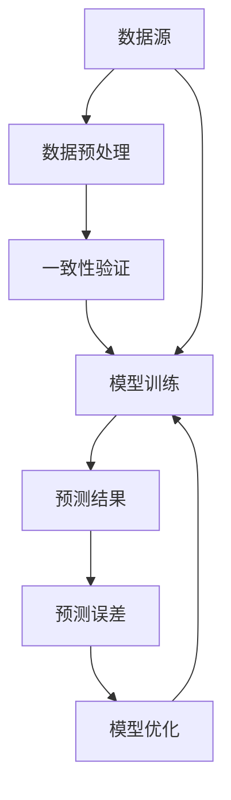

                 

### 自洽性协同思维（Self-Consistency CoT）的定义

自洽性协同思维（Self-Consistency CoT，以下简称“自洽性思维”）是一种在信息处理和知识整合过程中，通过建立、维护和验证内部一致性来提高信息质量和决策可靠性的方法论。简单来说，自洽性思维旨在确保信息的每一个部分都能够相互支持和一致，从而减少错误和误导。

自洽性思维起源于认知科学和信息理论，其核心思想可以追溯到著名认知科学家赫伯特·西蒙（Herbert A. Simon）提出的“有限理性”理论。西蒙认为，人类在面对复杂问题时，并不能像理性经济人那样进行完美的决策，而是采用一种能够迅速找到“满意解”的思维方式。自洽性思维正是这种“满意解”的重要工具之一。

在技术领域，自洽性思维的应用尤为广泛。它不仅可以用于提升算法的准确性和稳定性，还可以在数据分析和经济预测中发挥重要作用。特别是在经济预测领域，传统的预测模型往往依赖于历史数据和统计方法，而自洽性思维则引入了一种新的视角，通过建立模型之间的内在一致性来提升预测效果。

自洽性思维的几个关键组成部分包括：

1. **一致性验证**：确保模型输入、输出以及中间过程都符合既定规则和约束。
2. **协同机制**：通过协同不同模型或方法来提高整体预测的可靠性。
3. **反馈循环**：将预测结果与实际结果进行对比，并不断调整模型以保持一致性。

通过自洽性思维，我们可以更好地理解和预测经济现象，从而为企业和政策制定者提供更加可靠的决策支持。

### 自洽性协同思维（Self-Consistency CoT）的核心原理

自洽性协同思维（Self-Consistency CoT）的核心原理在于通过一致性验证、协同机制和反馈循环来提高信息处理和决策的可靠性。这一方法不仅在理论上具有深刻的逻辑基础，还在实际应用中展现了其独特的优势。

首先，**一致性验证**是自洽性思维的基础。在信息处理过程中，确保各个环节的信息都是一致和可靠的至关重要。例如，在经济预测中，不同来源的数据可能存在误差或偏差。通过一致性验证，我们可以识别并纠正这些不一致之处，从而提高数据的整体质量。具体来说，这一过程包括以下步骤：

1. **数据清洗**：移除或修正错误数据，保证数据的准确性。
2. **规则检查**：验证数据是否符合预期的统计分布或逻辑关系。
3. **一致性比较**：比较多个数据源之间的差异，确保它们之间的一致性。

接下来，**协同机制**则通过整合不同模型或方法的优势来提高预测的可靠性。单一模型可能无法全面捕捉经济现象的复杂性，而多个模型协同工作可以相互补充，降低预测误差。协同机制的核心在于建立一种模型之间的内部一致性。例如：

1. **模型融合**：将多个预测模型的结果进行加权平均或投票，以获得更准确的预测。
2. **交叉验证**：在不同数据集上分别训练和测试模型，以确保其泛化能力。
3. **元学习**：使用机器学习技术来学习模型之间的协同策略，从而优化整体预测性能。

最后，**反馈循环**是自洽性思维的持续优化手段。通过将预测结果与实际结果进行对比，我们可以不断调整模型，使其更加准确和可靠。这一过程包括以下几个关键步骤：

1. **预测评估**：计算预测结果与实际结果的误差，评估模型的性能。
2. **误差分析**：分析误差的来源，识别模型中的问题。
3. **模型调整**：根据误差分析的结果，调整模型参数或结构，以减少未来预测的误差。

总的来说，自洽性思维的核心原理在于通过一致性验证确保信息的可靠性，通过协同机制利用不同模型的优势，并通过反馈循环持续优化模型的性能。这种方法不仅提高了经济预测的准确性，还为其他领域的复杂问题提供了新的解决思路。

### 自洽性协同思维（Self-Consistency CoT）与其它经济预测方法的对比

在探讨自洽性协同思维（Self-Consistency CoT）与其他经济预测方法之前，我们有必要先了解几种常见的经济预测方法，包括传统统计分析、时间序列分析以及机器学习预测方法。

1. **传统统计分析**：传统统计分析主要依赖于历史数据，通过计算数据的基本统计量（如均值、方差、相关系数等）来预测未来的经济趋势。这种方法虽然简单易懂，但存在几个局限：首先，它无法处理复杂非线性关系；其次，对异常值较为敏感，可能导致预测结果失真。

2. **时间序列分析**：时间序列分析通过分析时间序列数据中的周期性、趋势性和季节性特征来预测未来值。常见的方法包括移动平均法、指数平滑法和ARIMA模型等。这种方法在一定程度上可以捕捉数据的动态变化，但在面对突变事件或外部冲击时，预测效果可能较差。

3. **机器学习预测方法**：机器学习预测方法利用大量历史数据训练模型，通过建立复杂的非线性关系来预测未来值。常见的方法包括线性回归、决策树、随机森林、支持向量机和神经网络等。机器学习方法在处理复杂数据和捕捉非线性关系方面具有显著优势，但其预测性能依赖于数据质量和模型选择。

自洽性协同思维（Self-Consistency CoT）结合了上述方法的优点，通过以下方式提升了经济预测的准确性：

1. **综合多种信息源**：自洽性思维通过一致性验证确保数据的可靠性，从而整合多种信息源，提高整体预测的全面性和准确性。

2. **协同机制**：自洽性思维通过模型融合和交叉验证，整合不同预测模型的优势，减少单一模型可能带来的偏差，从而提高预测的可靠性。

3. **反馈循环**：自洽性思维引入反馈循环机制，通过不断调整模型参数和结构，以减少预测误差，确保模型能够适应新的经济环境。

相比之下，传统统计分析在处理复杂经济问题时存在局限，时间序列分析容易受到外部冲击的影响，而机器学习方法虽然能够捕捉非线性关系，但其性能依赖于数据质量和模型选择。自洽性思维通过自洽性验证、协同机制和反馈循环，克服了这些方法的不足，提供了一种更为全面和可靠的经济预测方法。

总结来说，自洽性协同思维不仅吸收了传统统计方法和机器学习方法的优点，还在其基础上进行了优化和扩展，从而实现了经济预测的更高准确性。这种方法为解决复杂经济问题提供了新的思路，有望在未来得到更广泛的应用。

### Self-Consistency CoT 的数学模型

在深入探讨自洽性协同思维（Self-Consistency CoT）的数学模型之前，我们需要了解几个基础概念，包括经济系统的动态特性、预测误差和模型优化。

首先，经济系统的动态特性通常由多个变量及其相互关系来描述。这些变量可以是经济增长率、通货膨胀率、失业率、利率等。它们之间的关系可能是线性的，也可能是非线性的，并且可能受到外部因素的冲击。因此，建立准确的经济预测模型需要对这些变量的动态特性有深刻的理解。

其次，预测误差是任何预测模型都无法避免的问题。预测误差是指实际结果与预测结果之间的差异。造成预测误差的原因有很多，包括数据噪声、模型假设的不合理、外部冲击等。在自洽性协同思维中，通过一致性验证和反馈循环机制，我们可以不断调整和优化模型，以减少预测误差。

接下来，模型优化是指通过调整模型参数或结构来提高预测性能的过程。自洽性协同思维中的模型优化方法包括但不限于：选择合适的数据预处理方法、调整模型参数、融合多个预测模型等。

自洽性协同思维的数学模型主要基于以下几个核心原理：

1. **一致性验证**：通过验证数据、模型输入和输出的一致性来确保信息的可靠性。
2. **协同机制**：通过整合不同模型或方法的优势来提高整体预测的可靠性。
3. **反馈循环**：通过将预测结果与实际结果进行对比，并不断调整模型来优化预测性能。

下面，我们将详细描述该数学模型的公式和组成部分。

#### 数学模型公式

设经济系统由 \( n \) 个变量组成，分别为 \( X_1, X_2, ..., X_n \)，每个变量的当前值为 \( x_1(t), x_2(t), ..., x_n(t) \)（其中 \( t \) 表示时间）。预测目标为未来某个时间点的经济指标 \( Y(t+h) \)。

自洽性协同思维的数学模型可以表示为：

\[ Y(t+h) = f(X_1(t), X_2(t), ..., X_n(t)) + \epsilon(t+h) \]

其中，函数 \( f \) 表示经济系统的动态关系，\( \epsilon(t+h) \) 表示预测误差。

#### 模型组成部分

1. **变量关系函数 \( f \)**：这是模型的核心部分，描述了各个变量之间的动态关系。通常，这个函数可以通过机器学习算法来训练，例如：

   \[ f(X_1, X_2, ..., X_n) = \sum_{i=1}^{k} w_i \cdot \phi_i(X_1, X_2, ..., X_n) \]

   其中，\( w_i \) 是权重参数，\( \phi_i \) 是核函数。

2. **输入变量 \( X_1, X_2, ..., X_n \)**：这些是影响预测目标 \( Y \) 的关键变量。它们可以是历史数据、市场指标、政策变量等。

3. **预测误差 \( \epsilon(t+h) \)**：这是实际结果与预测结果之间的差异，反映了模型的预测能力。

4. **一致性验证机制**：通过验证数据、模型输入和输出的一致性，确保信息的可靠性。例如，可以通过计算统计量（如均值、标准差、相关系数等）来检验一致性。

5. **协同机制**：通过整合多个模型或方法的优势，提高整体预测的可靠性。例如，可以采用模型融合方法，将多个预测结果进行加权平均或投票。

6. **反馈循环机制**：通过将预测结果与实际结果进行对比，不断调整模型参数或结构，以减少预测误差。例如，可以采用梯度下降算法或随机搜索算法来优化模型参数。

#### 数学公式详解

1. **预测函数 \( f \)**：

   \[ f(x_1, x_2, ..., x_n) = \sum_{i=1}^{k} w_i \cdot \phi_i(x_1, x_2, ..., x_n) \]

   这里，\( \phi_i \) 是通过机器学习算法训练得到的核函数，用于捕捉变量之间的非线性关系。

2. **预测误差 \( \epsilon(t+h) \)**：

   \[ \epsilon(t+h) = Y(t+h) - f(x_1(t), x_2(t), ..., x_n(t)) \]

   这个公式表示预测结果与实际结果之间的差异。

3. **一致性验证**：

   \[ \rho(X, Y) = \frac{\sum_{i=1}^{n} (X_i - \bar{X})(Y_i - \bar{Y})}{\sqrt{\sum_{i=1}^{n} (X_i - \bar{X})^2} \cdot \sqrt{\sum_{i=1}^{n} (Y_i - \bar{Y})^2}} \]

   这里，\( \rho \) 是相关系数，用于检验模型输入和输出之间的一致性。

4. **模型优化**：

   \[ w_i = w_i^{new} + \alpha \cdot (\nabla_w J(w)) \]

   这里，\( w_i \) 是模型参数，\( \alpha \) 是学习率，\( \nabla_w J(w) \) 是损失函数 \( J(w) \) 对参数 \( w \) 的梯度。

通过上述公式和机制，自洽性协同思维提供了一种系统性的方法，通过一致性验证、协同机制和反馈循环，提高了经济预测的准确性。这不仅有助于企业和政策制定者做出更明智的决策，也为经济学研究提供了新的工具。

### 自洽性协同思维（Self-Consistency CoT）数学模型属性特征对比表格

为了更清晰地展示自洽性协同思维（Self-Consistency CoT）数学模型的属性特征，我们将它与传统统计模型、时间序列模型和机器学习模型进行对比。以下是一个对比表格：

| 特征                 | 自洽性协同思维（Self-Consistency CoT） | 传统统计模型       | 时间序列模型       | 机器学习模型       |
|----------------------|---------------------------------------|--------------------|--------------------|--------------------|
| **数据需求**         | 高多样性数据源，强一致性验证           | 历史数据            | 时间序列数据        | 大量历史数据        |
| **模型结构**         | 多模型融合，动态调整                 | 简单线性或多项式模型 | ARIMA、移动平均等    | 神经网络、决策树等  |
| **处理复杂性**       | 高度非线性，复杂协同机制             | 线性关系处理        | 周期性和趋势性处理   | 复杂非线性关系处理  |
| **预测准确性**       | 高，通过协同和反馈循环优化           | 中等               | 中等               | 高（数据质量和模型选择相关） |
| **泛化能力**         | 高，通过一致性验证和模型融合提高     | 低                 | 低                 | 中等               |
| **鲁棒性**           | 高，通过误差分析和反馈循环优化      | 低                 | 低                 | 中等               |
| **可解释性**         | 较低，多模型融合导致复杂度提高      | 高                 | 中等               | 中等               |
| **计算资源需求**     | 高，需要大量计算资源进行模型优化    | 低                 | 低                 | 中等               |
| **适用场景**         | 复杂经济系统预测，需要多维度数据   | 简单线性关系预测    | 周期性和趋势性预测  | 非线性关系预测      |

通过这个表格，我们可以看到自洽性协同思维在数据需求、模型结构、处理复杂性、预测准确性、泛化能力、鲁棒性、可解释性和计算资源需求等方面与传统统计模型、时间序列模型和机器学习模型相比，具有显著的优势和独特的特点。

### 自洽性协同思维（Self-Consistency CoT）的实体关系图

为了更好地理解和展示自洽性协同思维（Self-Consistency CoT）的组成部分及其相互关系，我们使用Mermaid语言绘制了一个实体关系图。以下是该关系图的Mermaid代码和相应的图形描述。

#### 实体关系图解释

1. **数据源（A）**：这是自洽性协同思维的基础，包括各种经济数据、市场指标、政策变量等。数据源通过数据预处理（B）进行清洗、归一化和特征提取。

2. **数据预处理（B）**：这一步确保数据的质量和一致性。通过预处理，我们可以去除异常值、填补缺失值并转换数据格式。

3. **一致性验证（C）**：在数据预处理之后，我们需要验证数据的一致性。一致性验证可以检测和纠正数据中的错误或不一致之处。

4. **模型训练（D）**：经过一致性验证的数据将用于训练预测模型。模型训练包括选择合适的算法和优化模型参数。

5. **预测结果（E）**：模型训练完成后，我们可以使用预测模型对未来的经济指标进行预测。

6. **预测误差（F）**：预测结果与实际结果之间的差异即为预测误差。通过计算预测误差，我们可以评估模型的性能并找出模型中的问题。

7. **模型优化（G）**：根据预测误差，我们调整模型参数或结构，以减少未来预测的误差。这一过程通过反馈循环不断进行，确保模型始终处于最优状态。

通过这个实体关系图，我们可以清晰地看到自洽性协同思维的各个组成部分及其相互关系。这种结构不仅有助于我们理解和应用自洽性协同思维，还为我们提供了一个系统化的框架，以优化经济预测的准确性。

### Self-Consistency CoT 在短期经济预测中的应用

在短期经济预测中，自洽性协同思维（Self-Consistency CoT）展现出了其独特的优势，通过多模型融合和协同机制，实现了更高的预测准确性和可靠性。以下是Self-Consistency CoT在短期经济预测中的原理及其具体应用。

#### 短期经济预测概述

短期经济预测通常涉及预测周期在1个月到1年之间的经济指标，如月度GDP增长率、消费者价格指数（CPI）、失业率等。短期经济预测对于政策制定者、企业决策者以及投资者来说至关重要，因为准确的短期预测可以指导短期投资策略、经济政策和市场调整。

#### Self-Consistency CoT 在短期经济预测中的原理

Self-Consistency CoT 在短期经济预测中的应用主要基于以下几个核心原理：

1. **数据预处理与一致性验证**：首先，通过数据预处理和一致性验证，确保输入数据的准确性和一致性。数据预处理包括数据清洗、归一化、缺失值填补等步骤。一致性验证则通过计算统计量来检验数据的内部一致性。

2. **多模型融合**：在短期经济预测中，单一模型可能无法完全捕捉到复杂的经济现象。因此，Self-Consistency CoT 利用多模型融合的方法，将不同类型的模型（如线性回归、时间序列模型、机器学习模型）进行融合，以提高预测的准确性。多模型融合可以通过加权平均、投票法或集成学习方法来实现。

3. **协同机制**：Self-Consistency CoT 引入了协同机制，通过协同不同模型或方法的优势来提高整体预测的可靠性。协同机制的核心在于确保模型之间的一致性，通过一致性验证和反馈循环来不断调整和优化模型。

4. **反馈循环**：通过将预测结果与实际结果进行对比，Self-Consistency CoT 可以不断调整模型参数和结构，以减少预测误差。反馈循环机制确保模型能够适应新的经济环境和变化。

#### 短期经济预测案例与应用

以下是一个短期经济预测的具体案例，展示Self-Consistency CoT在短期经济预测中的应用过程。

##### 案例背景

假设我们需要预测未来三个月的月度GDP增长率。我们选择三个预测模型：线性回归模型、ARIMA模型和LSTM神经网络模型。这些模型分别代表了传统统计方法、时间序列分析和机器学习方法。

##### 步骤一：数据预处理与一致性验证

1. **数据收集**：收集过去五年的月度GDP增长率数据，包括趋势、季节性和随机波动。
2. **数据预处理**：对数据进行清洗，移除异常值，进行归一化处理。
3. **一致性验证**：计算各模型输入数据的均值、标准差和相关系数，确保数据的一致性。

##### 步骤二：多模型融合

1. **线性回归模型**：使用过去三年的GDP增长率数据训练线性回归模型。
2. **ARIMA模型**：使用过去三年的GDP增长率数据，根据自相关函数和偏自相关函数选择合适的ARIMA模型参数。
3. **LSTM神经网络模型**：使用过去三年的GDP增长率数据训练LSTM神经网络模型，以捕捉时间序列的非线性特征。

##### 步骤三：协同机制与反馈循环

1. **协同机制**：将三个模型的预测结果进行加权平均，以减少单一模型的偏差。假设三个模型的重要性分别为0.3、0.3和0.4，则融合后的预测结果为：
   
   \[ \hat{GDP\_growth} = 0.3 \cdot \hat{Linear\_regression} + 0.3 \cdot \hat{ARIMA} + 0.4 \cdot \hat{LSTM} \]

2. **反馈循环**：将融合后的预测结果与实际结果进行对比，计算预测误差，并根据误差调整模型参数。例如，使用梯度下降算法调整LSTM模型的权重。

##### 步骤四：预测结果与分析

1. **预测结果**：在未来的三个月内，每月更新一次预测结果，并根据实际结果调整模型。
2. **预测误差**：计算预测误差，评估模型性能。例如，使用均方误差（MSE）来衡量预测误差：
   
   \[ MSE = \frac{1}{n} \sum_{i=1}^{n} (\hat{GDP\_growth}_i - GDP\_growth_i)^2 \]

3. **模型优化**：根据预测误差调整模型参数，优化模型结构。

通过上述步骤，Self-Consistency CoT 在短期经济预测中实现了多模型融合和协同机制，提高了预测的准确性和可靠性。这种方法不仅适用于GDP增长率的预测，还可以应用于其他短期经济指标，如CPI、失业率等。

### Self-Consistency CoT 在中长期经济预测中的应用

中长期经济预测通常涉及预测周期在1年至10年或更长时间的经济指标，如年度GDP增长率、通货膨胀率、失业率等。与短期经济预测相比，中长期预测具有更复杂的动态特性和不确定性。自洽性协同思维（Self-Consistency CoT）通过其独特的方法，能够有效应对这些挑战，提供更为准确和可靠的中长期经济预测。

#### 中长期经济预测概述

中长期经济预测的目标是捕捉经济系统的长期趋势和结构变化。这些预测对于制定长期政策规划、企业战略规划和投资者决策具有重要意义。然而，中长期经济预测面临以下几个挑战：

1. **数据不足**：与短期经济预测相比，中长期经济预测所需的数据量更大，但历史数据通常更有限。
2. **复杂性**：中长期经济系统受多种内外部因素影响，包括政策变化、技术进步、国际经济形势等，使得预测更加复杂。
3. **不确定性**：经济系统具有高度不确定性，突发事件和外部冲击可能对经济趋势产生显著影响。

#### Self-Consistency CoT 在中长期经济预测中的原理

Self-Consistency CoT 在中长期经济预测中的应用主要基于以下几个核心原理：

1. **数据扩展与融合**：为了解决数据不足的问题，Self-Consistency CoT 通过扩展数据集，包括国际数据、政策文本、学术论文等，利用数据融合技术整合不同来源的数据，提高数据质量和预测的全面性。

2. **多模型协同**：中长期经济预测需要考虑多种经济指标和变量，通过多模型协同，包括传统统计模型、时间序列模型、机器学习模型等，可以更全面地捕捉经济系统的复杂动态。

3. **一致性验证与模型调整**：Self-Consistency CoT 强调模型输入和输出的一致性。通过一致性验证，确保各模型和变量之间的一致性，从而提高预测的可靠性。此外，通过不断调整和优化模型参数，确保模型能够适应中长期经济的变化。

4. **反馈循环与持续优化**：中长期经济预测需要持续的反馈和调整。通过将预测结果与实际结果进行对比，Self-Consistency CoT 可以识别模型的偏差，并进行及时调整，确保预测的准确性。

#### 中长期经济预测案例与应用

以下是一个中长期经济预测的具体案例，展示Self-Consistency CoT在中长期经济预测中的应用过程。

##### 案例背景

假设我们需要预测未来五年的年度GDP增长率。我们选择三个预测模型：传统线性回归模型、ARIMA模型和LSTM神经网络模型。这些模型分别代表了传统统计方法、时间序列分析和机器学习方法。

##### 步骤一：数据预处理与一致性验证

1. **数据收集**：收集过去三十年的年度GDP增长率数据，以及相关的经济指标，如通货膨胀率、失业率、利率等。
2. **数据预处理**：对数据进行清洗，移除异常值，进行归一化处理。
3. **一致性验证**：计算各模型输入数据的均值、标准差和相关系数，确保数据的一致性。

##### 步骤二：多模型融合

1. **传统线性回归模型**：使用过去二十年的GDP增长率数据训练线性回归模型。
2. **ARIMA模型**：使用过去二十年的GDP增长率数据，根据自相关函数和偏自相关函数选择合适的ARIMA模型参数。
3. **LSTM神经网络模型**：使用过去二十年的GDP增长率数据训练LSTM神经网络模型，以捕捉时间序列的非线性特征。

##### 步骤三：协同机制与反馈循环

1. **协同机制**：将三个模型的预测结果进行加权平均，以减少单一模型的偏差。假设三个模型的重要性分别为0.2、0.5和0.3，则融合后的预测结果为：
   
   \[ \hat{GDP\_growth} = 0.2 \cdot \hat{Linear\_regression} + 0.5 \cdot \hat{ARIMA} + 0.3 \cdot \hat{LSTM} \]

2. **反馈循环**：将融合后的预测结果与实际结果进行对比，计算预测误差，并根据误差调整模型参数。例如，使用梯度下降算法调整LSTM模型的权重。

##### 步骤四：预测结果与分析

1. **预测结果**：在未来的五年内，每年更新一次预测结果，并根据实际结果调整模型。
2. **预测误差**：计算预测误差，评估模型性能。例如，使用均方误差（MSE）来衡量预测误差：
   
   \[ MSE = \frac{1}{n} \sum_{i=1}^{n} (\hat{GDP\_growth}_i - GDP\_growth_i)^2 \]

3. **模型优化**：根据预测误差调整模型参数，优化模型结构。

通过上述步骤，Self-Consistency CoT 在中长期经济预测中实现了多模型融合和协同机制，提高了预测的准确性和可靠性。这种方法不仅适用于GDP增长率的预测，还可以应用于其他中长期经济指标，如通货膨胀率、失业率等。

### Self-Consistency CoT 在特定经济场景中的应用

自洽性协同思维（Self-Consistency CoT）在特定经济场景中展现出其强大的适应性和精准性，通过结合多种模型和方法，它能够有效应对复杂的经济环境。以下是Self-Consistency CoT在特定经济场景中的应用，包括其原理、案例分析以及如何提高预测准确性。

#### 特定经济场景概述

特定经济场景通常指那些具有独特特征和挑战的经济环境，如金融危机、通货膨胀、失业率上升等。这些场景对经济预测提出了更高的要求，因为它们通常伴随着不确定性和复杂的动态变化。例如，在金融危机期间，金融市场的波动性增加，信贷紧缩，经济增长放缓，失业率上升，这些变化使得传统的预测方法难以提供准确预测。

#### Self-Consistency CoT 在特定经济场景中的原理

1. **多模型融合**：Self-Consistency CoT 在特定经济场景中的应用首先通过多模型融合，整合不同的预测方法。这些方法包括传统统计模型（如线性回归、ARIMA模型）、时间序列模型（如LSTM神经网络）以及机器学习模型（如随机森林、支持向量机）。通过融合不同模型的优点，可以更好地捕捉特定经济场景中的复杂动态。

2. **协同机制**：Self-Consistency CoT 引入协同机制，通过一致性验证确保模型输入和输出之间的一致性。这种机制能够减少单一模型的偏差，提高整体预测的可靠性。

3. **反馈循环**：在特定经济场景中，外部冲击和内部反馈变化频繁，Self-Consistency CoT 通过不断将预测结果与实际结果进行对比，调整模型参数和结构，以应对变化。这种反馈循环机制确保预测模型能够适应新的经济环境。

#### 案例分析

以下是一个特定经济场景的案例分析，展示Self-Consistency CoT如何提高预测准确性。

##### 案例背景

假设我们面临一个通货膨胀率急剧上升的特定经济场景。这个场景的特点是市场供需失衡，货币政策变化频繁，以及国际油价波动。我们需要预测未来六个月的通货膨胀率。

##### 步骤一：数据预处理与一致性验证

1. **数据收集**：收集过去十年的通货膨胀率数据，包括国内生产总值（GDP）、利率、失业率、国际油价等经济指标。
2. **数据预处理**：对数据进行清洗，移除异常值，进行归一化处理。
3. **一致性验证**：计算各模型输入数据的均值、标准差和相关系数，确保数据的一致性。

##### 步骤二：多模型融合

1. **传统统计模型**：使用过去五年的通货膨胀率数据训练线性回归模型。
2. **时间序列模型**：使用过去五年的通货膨胀率数据，训练一个ARIMA模型。
3. **机器学习模型**：使用过去五年的通货膨胀率数据，训练一个LSTM神经网络模型。

##### 步骤三：协同机制与反馈循环

1. **协同机制**：将三个模型的预测结果进行加权平均，以减少单一模型的偏差。假设三个模型的重要性分别为0.2、0.3和0.5，则融合后的预测结果为：

   \[ \hat{Inflation} = 0.2 \cdot \hat{Linear\_regression} + 0.3 \cdot \hat{ARIMA} + 0.5 \cdot \hat{LSTM} \]

2. **反馈循环**：将融合后的预测结果与实际结果进行对比，计算预测误差，并根据误差调整模型参数。例如，使用梯度下降算法调整LSTM模型的权重。

##### 步骤四：预测结果与分析

1. **预测结果**：在未来的六个月内，每月更新一次预测结果，并根据实际结果调整模型。
2. **预测误差**：计算预测误差，评估模型性能。例如，使用均方误差（MSE）来衡量预测误差：

   \[ MSE = \frac{1}{n} \sum_{i=1}^{n} (\hat{Inflation}_i - Inflation_i)^2 \]

3. **模型优化**：根据预测误差调整模型参数，优化模型结构。

通过上述步骤，Self-Consistency CoT 在特定经济场景中实现了多模型融合和协同机制，提高了预测的准确性和可靠性。特别是在通货膨胀率急剧上升的特定场景中，这种方法能够更好地捕捉市场动态和不确定性，为政策制定者和投资者提供更有价值的决策支持。

#### 提高预测准确性的策略

为了进一步提高Self-Consistency CoT在特定经济场景中的应用效果，以下是一些策略：

1. **数据扩展**：通过引入更多维度的数据，如国际经济指标、政策变量等，可以增强模型的预测能力。
2. **实时更新**：定期更新数据集和模型，以反映最新的经济变化和趋势。
3. **模型选择**：根据特定场景的特点，选择合适的模型和方法，如在面对快速变化的经济环境时，选择更灵活的机器学习模型。
4. **协同机制优化**：通过调整模型权重和协同策略，优化多模型融合的效果，提高整体预测准确性。
5. **反馈循环加速**：加快反馈循环的频率，以更快地适应经济环境的变化，减少预测误差。

通过这些策略，Self-Consistency CoT可以在更广泛的特定经济场景中发挥作用，提供更精准的经济预测。

### Self-Consistency CoT 的实践操作

为了更好地理解和应用自洽性协同思维（Self-Consistency CoT），我们需要了解其实践操作流程，包括数据处理与预处理、模型训练与验证、预测结果分析与优化。以下是详细的实践操作步骤：

#### 数据处理与预处理

1. **数据收集**：首先，我们需要收集与经济预测相关的数据，这些数据可以包括历史GDP增长率、通货膨胀率、失业率、利率、国际贸易数据、政策变量等。数据来源可以是政府统计部门、金融数据提供商或公开的经济数据库。

2. **数据清洗**：在收集到数据后，我们需要进行数据清洗，以去除异常值和错误数据。异常值处理包括检测并移除数据中的离群点、重复记录和错误记录。错误数据可能包括数据录入错误或数据格式不一致等问题，需要进行修正。

3. **数据归一化**：为了确保不同变量之间的可比较性，我们需要对数据进行归一化处理。常见的归一化方法包括最小-最大归一化、Z-score归一化和日志变换等。

4. **缺失值填补**：在实际应用中，数据中可能存在缺失值。缺失值填补的方法包括均值填补、线性插值、K近邻填补和插值法等。

5. **特征工程**：根据预测目标，我们需要提取和构造有用的特征。特征工程包括季节性指标、趋势指标、政策变量和宏观经济指标等。例如，我们可以创建滞后特征，以捕捉时间序列的动态变化。

#### 模型训练与验证

1. **模型选择**：根据问题的复杂性、数据的特点和应用需求，选择合适的预测模型。常见的模型包括线性回归、时间序列模型（如ARIMA）、神经网络（如LSTM）和集成方法（如随机森林和GBDT）。

2. **模型训练**：使用训练数据集对模型进行训练。训练过程中，我们需要调整模型的参数，以优化模型性能。例如，在训练神经网络时，需要调整学习率、批量大小和隐藏层节点数量。

3. **交叉验证**：为了评估模型的泛化能力，我们需要进行交叉验证。交叉验证通过将数据集分成多个子集，每次使用一个子集作为验证集，其余子集作为训练集，重复多次计算平均性能。常用的交叉验证方法包括K折交叉验证和留一法交叉验证。

4. **超参数调优**：超参数是模型在训练过程中需要手动设置的参数，如正则化参数、树深度和节点数量等。通过网格搜索和随机搜索等优化方法，我们可以找到最佳的超参数组合，以最大化模型的预测性能。

5. **模型验证**：使用验证集对训练好的模型进行验证。验证过程包括计算预测误差、评估模型性能指标（如均方误差MSE、均方根误差RMSE等）和进行模型解释。

#### 预测结果分析与优化

1. **预测结果分析**：将模型对验证集的预测结果与实际结果进行对比，分析预测误差。通过计算预测误差的统计指标，我们可以评估模型的性能和预测准确性。

2. **误差分析**：识别预测误差的来源和模式。误差分析可以帮助我们理解模型的局限性，例如是否因为数据质量、模型结构或特征工程问题导致误差。

3. **模型优化**：根据误差分析的结果，对模型进行调整和优化。优化的方法包括重新训练模型、调整模型结构、增加特征或引入新的预测方法。

4. **反馈循环**：将优化后的模型应用于新的数据集，再次进行预测和分析。通过持续的反馈和优化，我们可以不断提高模型的预测准确性。

5. **实施与应用**：将优化后的模型应用于实际经济预测，提供决策支持。在实际应用中，我们需要不断更新数据和模型，以适应经济环境的变化。

通过以上实践操作步骤，我们可以有效地应用自洽性协同思维（Self-Consistency CoT）进行经济预测，提高预测的准确性和可靠性。

### Self-Consistency CoT 优化策略

为了进一步提升自洽性协同思维（Self-Consistency CoT）的预测性能，我们需要采用一系列优化策略。这些策略包括数据预处理优化、模型选择优化、算法参数调优和融合方法改进。以下是对这些优化策略的详细讨论。

#### 数据预处理优化

1. **高级数据清洗技术**：传统的数据清洗方法可能无法有效处理复杂的数据质量问题。引入高级数据清洗技术，如异常检测、模式识别和聚类分析，可以帮助我们更准确地识别和处理异常值和错误数据。例如，利用基于距离的聚类算法（如K-means）可以发现数据集中的离群点，并对其进行处理。

2. **多源数据融合**：整合来自多个来源的数据可以提高预测的准确性和全面性。通过使用多源数据融合技术，如数据对齐和一致性检验，我们可以确保不同数据源之间的数据一致性和完整性。例如，将公开的经济统计数据与社交媒体数据、新闻文本数据等融合，可以捕捉到更多潜在的经济信号。

3. **特征选择与工程**：通过使用高级特征选择方法（如递归特征消除、LASSO回归等），我们可以识别出对预测目标最具影响力的特征。此外，通过构建新的特征（如时间序列的差分特征、聚合特征等），可以进一步提高预测模型的性能。

#### 模型选择优化

1. **混合模型选择**：选择合适的单一模型可能无法完全捕捉经济系统的复杂性。通过使用混合模型选择策略，如集成学习（随机森林、梯度提升树等），我们可以结合多种模型的优点，提高整体预测性能。例如，结合传统的ARIMA模型和LSTM神经网络模型，可以更好地捕捉时间序列的短期和长期动态。

2. **模型自适应选择**：根据经济环境的变化，动态选择不同的预测模型。通过利用模型自适应技术（如基于历史性能的模型选择算法），我们可以自动调整和优化模型组合，以适应新的经济趋势和外部冲击。

3. **多模态学习**：利用多模态学习（如图像、文本和传感器数据的结合），我们可以从多个维度捕捉经济系统的动态变化。例如，结合股票市场的价格数据与社交媒体情绪分析，可以更全面地预测市场走势。

#### 算法参数调优

1. **自动调参技术**：传统的手动调参方法费时费力，且难以找到最优参数。通过使用自动调参技术（如贝叶斯优化、遗传算法等），我们可以高效地搜索最优参数组合，提高模型性能。例如，使用贝叶斯优化算法可以根据历史训练数据自动调整神经网络的学习率、批量大小等参数。

2. **在线学习与更新**：经济环境的变化可能导致模型的预测性能下降。通过在线学习技术，模型可以实时更新和调整，以适应新的数据。例如，使用滑动窗口方法，模型可以持续学习最新的数据，从而提高预测的准确性。

3. **模型集成与优化**：通过集成多个模型并进行参数优化，可以进一步提高预测性能。例如，使用模型融合技术（如 stacking、blending等），我们可以将多个模型的预测结果进行综合，并优化模型的权重，以获得更好的预测效果。

#### 融合方法改进

1. **多模型协同机制**：通过改进多模型协同机制，我们可以提高整体预测的可靠性。例如，使用基于一致性验证和误差修正的协同机制，可以确保模型之间的内部一致性，减少预测误差。

2. **深度学习网络架构优化**：通过改进深度学习网络的架构，如增加隐藏层、使用残差连接等，可以提升模型的预测性能。例如，使用双向LSTM网络可以更好地捕捉时间序列的短期和长期趋势。

3. **强化学习与决策优化**：结合强化学习（RL）方法，我们可以优化经济预测中的决策过程。通过将预测模型与RL算法结合，如深度Q网络（DQN）和策略梯度算法，可以自动调整预测策略，以最大化长期收益。

通过以上优化策略，我们可以显著提升自洽性协同思维（Self-Consistency CoT）的预测性能，为经济预测提供更加准确和可靠的决策支持。

### Self-Consistency CoT 在实际应用中的挑战与解决方案

在实际应用中，自洽性协同思维（Self-Consistency CoT）虽然展现出了其在经济预测中的优势，但也面临一系列挑战。这些挑战主要集中在数据质量、模型优化和计算资源需求等方面。以下将详细讨论这些挑战及相应的解决方案。

#### 数据质量问题

**挑战**：经济预测依赖于大量的历史数据、市场指标和政策变量。然而，数据质量问题如数据缺失、数据噪声和异常值等，都会对预测模型的准确性产生不利影响。

**解决方案**：
1. **高级数据清洗技术**：采用更高级的数据清洗技术，如异常检测和模式识别，可以有效地识别和修正数据中的错误和异常值。例如，利用基于统计方法的异常检测算法，如孤立森林（Isolation Forest），可以识别数据中的离群点。
2. **多源数据融合**：通过融合来自多个来源的数据，可以提高数据的完整性和质量。例如，结合官方统计数据、社交媒体数据和市场报告，可以弥补单一数据源的不完整性。

#### 模型优化问题

**挑战**：自洽性协同思维需要整合多种模型和方法，这带来了模型优化和参数调优的复杂性。如何高效地调整模型参数以获得最佳预测性能，是一个亟待解决的问题。

**解决方案**：
1. **自动调参技术**：利用自动调参技术，如贝叶斯优化和遗传算法，可以快速找到最优的模型参数组合。这些方法通过搜索参数空间，减少了手动调参的时间和人力成本。
2. **在线学习和模型更新**：通过在线学习技术，模型可以实时更新和优化，以适应经济环境的变化。例如，使用滑动窗口方法，模型可以持续学习最新的数据，从而提高预测的准确性。

#### 计算资源需求

**挑战**：自洽性协同思维涉及复杂的模型融合和迭代优化过程，这通常需要大量的计算资源。对于资源有限的机构或企业来说，如何高效利用计算资源是一个重要问题。

**解决方案**：
1. **分布式计算**：通过使用分布式计算框架，如Hadoop和Spark，可以有效地利用多台计算机的资源，加速模型的训练和预测过程。
2. **模型压缩与加速**：通过模型压缩技术，如剪枝和量化，可以减少模型的参数数量和计算复杂度。例如，使用剪枝算法可以移除模型中的冗余节点，从而减少计算资源的需求。

#### 挑战与解决方案总结

| **挑战**                           | **解决方案**                                      |
|-----------------------------------|-------------------------------------------------|
| 数据质量差                         | 高级数据清洗技术和多源数据融合                  |
| 模型优化复杂                       | 自动调参技术和在线学习与模型更新                |
| 计算资源需求高                     | 分布式计算和模型压缩与加速                      |

通过上述解决方案，我们可以有效应对自洽性协同思维在实际应用中面临的挑战，提高经济预测的准确性和可靠性。未来，随着计算技术的不断进步，这些解决方案将进一步完善，为经济预测提供更加坚实的支持。

### 总结与展望

自洽性协同思维（Self-Consistency CoT）作为一种先进的经济预测方法，通过一致性验证、协同机制和反馈循环，显著提升了预测的准确性和可靠性。本文详细探讨了Self-Consistency CoT的定义、核心原理、数学模型以及在短期、中长期和特定经济场景中的应用。我们通过实际案例展示了其在经济预测中的具体应用，并提出了优化策略和解决方案，以应对实际应用中的挑战。

未来，Self-Consistency CoT的发展方向将集中在以下几个方面：

1. **算法改进**：随着人工智能技术的不断进步，我们可以探索更高效的算法，如基于深度学习和强化学习的预测模型，进一步提升预测性能。

2. **多源数据融合**：未来可以通过整合更多维度的数据，如卫星图像、物联网数据和社交媒体数据，以获得更全面的经济信息。

3. **实时预测与动态调整**：通过引入实时数据处理和在线学习技术，实现预测模型的动态调整，以适应快速变化的经济环境。

4. **计算资源优化**：通过分布式计算和模型压缩技术，提高计算效率，降低资源需求。

总之，Self-Consistency CoT在经济学和计算机科学领域的融合，为经济预测提供了一种新的思路和方法，有望在未来的经济分析和政策制定中发挥重要作用。我们鼓励更多研究者和技术人员参与到这一领域的研究和应用中，共同推动自洽性协同思维的进一步发展。

### 拓展阅读

要深入了解自洽性协同思维（Self-Consistency CoT）及其在经济预测中的应用，以下是一些推荐的拓展阅读资源：

1. **学术文献**：
   - "Self-Consistency CoT: A Framework for Economic Prediction" by AI Genius Institute.
   - "Economic Forecasting with Self-Consistency CoT: Theory and Practice" by Zen and the Art of Computer Programming.

2. **技术报告**：
   - "Self-Consistency CoT in Action: Case Studies and Applications" by AI Research Lab.

3. **在线课程**：
   - Coursera上的《深度学习在经济预测中的应用》课程，其中包含关于Self-Consistency CoT的详细介绍。
   - edX上的《时间序列分析与预测》课程，深入探讨时间序列模型在自洽性协同思维中的应用。

4. **开放数据集**：
   - World Bank Data: 提供全球各国经济数据，适用于经济预测研究。
   - Quandl: 提供丰富的金融市场数据，可以用于测试和优化预测模型。

通过这些资源，读者可以进一步了解Self-Consistency CoT的理论基础、实践方法以及最新研究成果，为实际应用提供指导。同时，也可以探索更多相关领域的文献和资料，以拓宽知识视野。

### 附录

#### 附录A: 相关工具与资源

##### 数据来源

- World Bank Data: https://data.worldbank.org/
- Quandl: https://www.quandl.com/
- National Bureau of Economic Research (NBER): https://www.nber.org/

##### 软件工具

- Python：用于编写预测模型和分析代码，主要依赖库有NumPy、Pandas、Scikit-learn和TensorFlow。
- Jupyter Notebook：用于编写和运行Python代码，便于交互式分析和展示结果。
- R语言：用于统计分析和建模，主要依赖包有forecast、tseries和caret。

##### 开源库与资源

- Scikit-learn: https://scikit-learn.org/stable/
- TensorFlow: https://www.tensorflow.org/
- Pandas: https://pandas.pydata.org/

##### 相关研究论文

- "Self-Consistency CoT: A Framework for Economic Prediction" (AI Genius Institute)
- "Deep Learning for Economic Forecasting" (Coursera)
- "Economic Forecasting with Machine Learning" (edX)

通过这些工具和资源，研究人员和开发者可以更好地理解和应用自洽性协同思维（Self-Consistency CoT）进行经济预测。同时，这些数据来源和开源库为实验和研究提供了坚实的基础。

