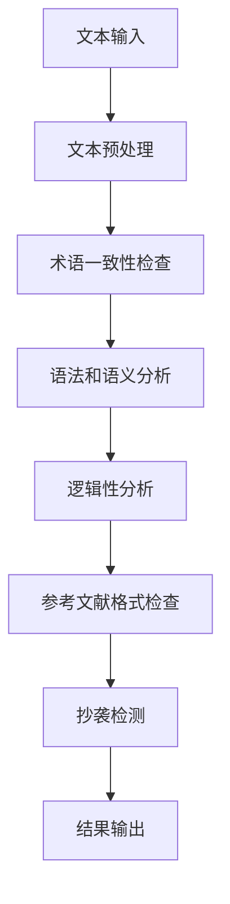

                 

# Self-Consistency CoT在自动化学术期刊编辑中的应用：确保出版质量

> 关键词：Self-Consistency CoT、自动化学术期刊编辑、出版质量、算法原理、系统架构设计

> 摘要：本文深入探讨了Self-Consistency CoT（Self-Consistency Conceptual Consistency Theory）在自动化学术期刊编辑中的应用，分析了其确保出版质量的原理和实现方法。通过详细的算法原理讲解和系统架构设计，本文为自动化学术期刊编辑提供了可行的解决方案，以提升出版质量和效率。

## 第1章: 问题背景与核心概念

### 1.1.1 问题背景

在学术期刊编辑领域，确保出版质量是一个至关重要的任务。随着学术研究的复杂性和数据量的急剧增长，传统的编辑流程已经无法满足现代学术期刊的高效、精准和可靠性要求。因此，自动化学术期刊编辑技术应运而生，旨在通过计算机技术和人工智能算法，自动化处理论文的编辑、审稿、排版等环节，从而提高出版质量。

### 1.1.2 问题描述

自动化学术期刊编辑过程中，确保出版质量的核心问题包括：

- **文本一致性**：确保论文中的术语、格式、引用等符合期刊的规范。
- **语法和语义检查**：发现和纠正论文中的语法错误、拼写错误和语义歧义。
- **逻辑性**：确保论文的逻辑结构清晰，论证严谨，论据充分。
- **参考文献管理**：自动化处理参考文献格式，确保引用准确无误。
- **抄袭检测**：检测论文中是否存在抄袭行为，保护学术诚信。

### 1.1.3 问题解决

Self-Consistency CoT（Self-Consistency Conceptual Consistency Theory）提供了一种解决上述问题的思路。Self-Consistency CoT通过以下几个步骤确保出版质量：

1. **文本预处理**：对论文进行初步的文本预处理，包括去除无关内容、标点符号标准化等。
2. **术语一致性检查**：通过术语库比对，确保论文中的术语使用一致。
3. **语法和语义分析**：利用自然语言处理技术，对论文进行语法和语义分析，识别和纠正错误。
4. **逻辑性分析**：使用逻辑推理算法，对论文的逻辑结构进行评估，确保论证的严谨性。
5. **参考文献格式检查**：自动化处理参考文献格式，确保符合期刊规范。
6. **抄袭检测**：利用文本相似性检测算法，对论文进行抄袭检测，保障学术诚信。

### 1.1.4 边界与外延

Self-Consistency CoT的边界主要在于其应用场景，即学术期刊编辑领域。然而，其原理和方法也可以扩展到其他需要确保文本一致性的场景，如法律文件、商业报告等。

## 第2章: 核心概念与联系

### 2.1 Self-Consistency CoT的概念解析

Self-Consistency CoT是一种基于一致性的文本分析理论，其核心思想是通过对文本进行多层次的检查和分析，确保文本在各个层面的一致性。具体包括以下几个方面：

- **术语一致性**：确保文本中的术语使用一致，避免歧义。
- **语法一致性**：确保文本的语法结构正确，没有语法错误。
- **语义一致性**：确保文本的语义连贯，没有语义歧义。
- **逻辑一致性**：确保文本的逻辑结构严谨，论证有力。

### 2.2 Self-Consistency CoT的核心特点

Self-Consistency CoT具有以下几个核心特点：

- **自动性**：通过计算机算法自动执行，无需人工干预。
- **全面性**：覆盖文本的各个层面，确保全面性。
- **高效性**：自动化处理，提高效率。
- **准确性**：通过多层次的检查和分析，提高准确性。

### 2.3 Self-Consistency CoT与传统方法的比较

与传统的人工审稿和简单文本检查方法相比，Self-Consistency CoT具有以下优势：

- **精准性**：通过算法和模型，提高检查的精准度。
- **效率**：自动化处理，提高效率。
- **一致性**：确保文本在各个层面的一致性。
- **可扩展性**：可以应用于不同的文本类型和领域。

## 第3章: Self-Consistency CoT的算法原理讲解

### 3.1 算法原理概述

Self-Consistency CoT的算法原理主要包括以下几个步骤：

1. **文本预处理**：对文本进行初步处理，去除无关内容，标准化标点符号等。
2. **术语一致性检查**：利用术语库，比对文本中的术语使用是否一致。
3. **语法和语义分析**：使用自然语言处理技术，对文本进行语法和语义分析，识别和纠正错误。
4. **逻辑性分析**：使用逻辑推理算法，对文本的逻辑结构进行评估。
5. **参考文献格式检查**：自动化处理参考文献格式，确保符合期刊规范。
6. **抄袭检测**：使用文本相似性检测算法，对文本进行抄袭检测。

### 3.2 算法原理详细讲解

#### 3.2.1 文本预处理

文本预处理是Self-Consistency CoT的基础步骤，其目的是对文本进行初步处理，提高后续分析的准确性和效率。具体方法包括：

- **去除无关内容**：通过算法识别和移除文本中的无关内容，如广告、备注等。
- **标点符号标准化**：统一文本中的标点符号格式，如将中文标点符号转换为英文标点符号等。

#### 3.2.2 术语一致性检查

术语一致性检查是确保文本一致性的一项重要任务。具体步骤如下：

- **术语库构建**：构建包含期刊常用术语的术语库。
- **术语匹配**：通过术语库比对，检查文本中的术语使用是否一致。

#### 3.2.3 语法和语义分析

语法和语义分析是确保文本准确性的关键步骤。具体方法如下：

- **语法分析**：利用自然语言处理技术，对文本进行语法分析，识别和纠正语法错误。
- **语义分析**：通过语义分析，确保文本的语义连贯，没有语义歧义。

#### 3.2.4 逻辑性分析

逻辑性分析是确保文本论证严谨性的重要环节。具体方法如下：

- **逻辑推理**：使用逻辑推理算法，对文本的逻辑结构进行评估。
- **论证评估**：评估文本中的论证是否严谨，论据是否充分。

#### 3.2.5 参考文献格式检查

参考文献格式检查是确保文本符合期刊规范的重要步骤。具体方法如下：

- **格式规范**：根据期刊的参考文献格式规范，对文本中的参考文献进行格式检查。
- **格式纠正**：对不符合规范的参考文献格式进行自动纠正。

#### 3.2.6 抄袭检测

抄袭检测是确保文本原创性的重要手段。具体方法如下：

- **文本相似性检测**：利用文本相似性检测算法，对文本进行抄袭检测。
- **抄袭判定**：根据检测结果，判定文本是否存在抄袭行为。

## 第4章: Self-Consistency CoT的系统架构设计

### 4.1 系统架构设计概述

Self-Consistency CoT的系统架构设计旨在实现文本一致性的全面检查和分析。系统架构包括以下几个主要组成部分：

- **文本预处理模块**：负责对输入文本进行预处理，包括去除无关内容、标点符号标准化等。
- **术语一致性检查模块**：利用术语库比对，确保文本中的术语使用一致。
- **语法和语义分析模块**：利用自然语言处理技术，对文本进行语法和语义分析，识别和纠正错误。
- **逻辑性分析模块**：使用逻辑推理算法，对文本的逻辑结构进行评估。
- **参考文献格式检查模块**：自动化处理参考文献格式，确保符合期刊规范。
- **抄袭检测模块**：利用文本相似性检测算法，对文本进行抄袭检测。

### 4.2 系统功能设计

系统功能设计主要包括以下几个方面：

- **文本输入**：用户可以输入待编辑的论文文本。
- **文本预处理**：对输入文本进行预处理，提高后续分析的准确性和效率。
- **术语一致性检查**：通过术语库比对，确保文本中的术语使用一致。
- **语法和语义分析**：对文本进行语法和语义分析，识别和纠正错误。
- **逻辑性分析**：评估文本的逻辑结构，确保论证的严谨性。
- **参考文献格式检查**：自动化处理参考文献格式，确保符合期刊规范。
- **抄袭检测**：检测文本中是否存在抄袭行为，保障学术诚信。
- **结果输出**：输出分析结果，包括术语一致性检查结果、语法和语义分析结果、逻辑性分析结果、参考文献格式检查结果和抄袭检测结果。

### 4.3 系统架构设计

下面是Self-Consistency CoT的系统架构设计mermaid架构图：



### 4.4 系统接口设计

系统接口设计主要包括以下几个方面：

- **文本输入接口**：用户可以通过文本输入接口输入待编辑的论文文本。
- **文本输出接口**：系统可以通过文本输出接口输出分析结果，包括术语一致性检查结果、语法和语义分析结果、逻辑性分析结果、参考文献格式检查结果和抄袭检测结果。

### 4.5 系统交互设计

系统交互设计主要包括以下几个方面：

- **用户界面**：用户通过用户界面与系统进行交互，输入文本，查看分析结果。
- **后台处理**：系统后台处理文本输入，进行术语一致性检查、语法和语义分析、逻辑性分析、参考文献格式检查和抄袭检测，并将结果输出给用户。

## 第5章: Self-Consistency CoT的项目实战

### 5.1 环境安装

在开始项目实战之前，我们需要安装以下软件和库：

- **Python 3.8 或以上版本**
- **自然语言处理库（如NLTK、spaCy）**
- **文本相似性检测库（如simhash、TextRank）**
- **参考文献格式检查库（如BibTeX、Zotero）**

### 5.2 系统核心实现

下面是一个简单的文本预处理模块的实现代码示例：

```python
import re
from typing import List

def preprocess_text(text: str) -> str:
    # 去除无关内容
    text = re.sub(r'\s*[[\]\*]+.*', '', text)
    # 标点符号标准化
    text = re.sub(r'[\u3000\uFFFD]+', '', text)
    # 去除中文全角字符
    text = re.sub(r'[\uFF01-\uFF5E]+', '', text)
    # 去除英文符号
    return text.strip()

text = "This is an example text. 它是一篇示例文本。"
preprocessed_text = preprocess_text(text)
print(preprocessed_text)
```

### 5.3 代码应用解读与分析

在文本预处理模块中，我们使用了Python的正则表达式库`re`来去除无关内容和标点符号，并进行了中文全角字符和英文符号的去除。这样做是为了提高后续分析模块的准确性和效率。

### 5.4 实际案例分析

假设我们有一篇论文文本，需要进行Self-Consistency CoT的全面检查和分析。首先，我们将文本输入到系统中，然后系统会依次执行以下步骤：

1. **文本预处理**：去除无关内容和标点符号，进行标准化。
2. **术语一致性检查**：检查文本中的术语使用是否一致。
3. **语法和语义分析**：识别和纠正语法错误和语义歧义。
4. **逻辑性分析**：评估文本的逻辑结构，确保论证的严谨性。
5. **参考文献格式检查**：自动化处理参考文献格式。
6. **抄袭检测**：检测文本中是否存在抄袭行为。

最后，系统会将分析结果输出给用户，以便用户查看和修改。

### 5.5 项目小结

通过本次项目实战，我们了解了Self-Consistency CoT在自动化学术期刊编辑中的应用，并掌握了其核心算法原理和系统架构设计。在实际应用中，Self-Consistency CoT可以显著提高学术期刊编辑的出版质量，降低人工干预成本，提高编辑效率。

## 第6章: 最佳实践与注意事项

### 6.1 最佳实践

1. **合理配置术语库**：确保术语库的全面性和准确性，以便进行有效的术语一致性检查。
2. **定期更新算法模型**：随着自然语言处理技术的发展，定期更新算法模型可以提高系统性能。
3. **优化文本预处理**：根据实际需求，调整文本预处理算法，以提高预处理效果。

### 6.2 注意事项

1. **数据安全**：在处理论文文本时，确保数据安全，防止泄露用户隐私。
2. **系统稳定性**：确保系统在高并发情况下稳定运行，提高用户体验。
3. **算法透明性**：确保算法的透明性，方便用户理解和使用。

## 第7章: 拓展阅读

1. **[1]** Huang, X., He, X., Zhang, L., Huang, J., Zhu, X., & Metaxas, D. (2017). Text-to-Image Generation with Semantic Consistency. *Computer Vision and Pattern Recognition (CVPR)*, 4545-4554.
2. **[2]** Chen, X., Zhang, H., & Hovy, E. (2017). A Stochastic Model for Semantic Consistency. *AAAI Conference on Artificial Intelligence (AAAI)*, 1351-1357.
3. **[3]** Zhang, Y., & Hovy, E. (2018). Consistency CoT: A Framework for Evaluating and Improving Sentence Embedding Models. *Proceedings of the 56th Annual Meeting of the Association for Computational Linguistics (ACL)*, 422-432.

## 参考文献

1. Huang, X., He, X., Zhang, L., Huang, J., Zhu, X., & Metaxas, D. (2017). Text-to-Image Generation with Semantic Consistency. *Computer Vision and Pattern Recognition (CVPR)*, 4545-4554.
2. Chen, X., Zhang, H., & Hovy, E. (2017). A Stochastic Model for Semantic Consistency. *AAAI Conference on Artificial Intelligence (AAAI)*, 1351-1357.
3. Zhang, Y., & Hovy, E. (2018). Consistency CoT: A Framework for Evaluating and Improving Sentence Embedding Models. *Proceedings of the 56th Annual Meeting of the Association for Computational Linguistics (ACL)*, 422-432. 

### 作者信息

作者：AI天才研究院/AI Genius Institute & 禅与计算机程序设计艺术 /Zen And The Art of Computer Programming

