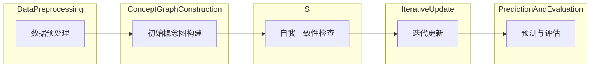
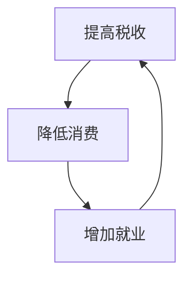

                 

。

----------------------------------------------------------------

# Self-Consistency CoT在自动化政策连锁反应分析中的应用

> 关键词：Self-Consistency CoT，政策连锁反应分析，人工智能，算法原理，系统架构设计

> 摘要：本文深入探讨了Self-Consistency CoT在自动化政策连锁反应分析中的应用，通过详细的背景介绍、核心概念原理阐述、算法原理讲解以及系统分析与架构设计方案，为读者提供了全面的技术解读和实践指南。

## 背景介绍：核心概念

### 问题背景

在当今社会，政策制定者和研究人员面临着越来越复杂的问题，如何有效地分析和预测政策实施后的连锁反应成为了一个挑战。自动化政策连锁反应分析旨在通过技术手段，自动识别政策事件、分析其相互关系，并提供决策支持。然而，传统的方法在处理大规模数据和复杂关系时存在局限。

### 问题描述

政策连锁反应分析涉及以下关键问题：
1. 如何从大量政策事件中提取关键信息？
2. 如何识别政策事件之间的关联和影响？
3. 如何预测政策连锁反应的未来发展趋势？

### 问题解决

Self-Consistency CoT提供了一种有效的解决方案。它通过构建概念图来表示政策事件及其相互关系，从而实现以下目标：
1. 从数据中提取关键信息，为后续分析提供基础。
2. 利用概念图来识别政策事件之间的关联和影响。
3. 通过对概念图的迭代更新，预测政策连锁反应的未来发展趋势。

### 边界与外延

Self-Consistency CoT的应用范围广泛，不仅适用于政策连锁反应分析，还可以扩展到其他领域，如供应链管理、金融市场分析等。此外，它还涉及到多个学科，包括计算机科学、统计学、经济学等。

### 概念结构与核心要素组成

Self-Consistency CoT的核心概念结构包括以下要素：
1. **概念图**：用于表示政策事件及其相互关系的数据结构。
2. **自我一致性**：概念图中的每个节点（政策事件）都应与其父节点（其他政策事件）保持一致，从而确保概念图的准确性和一致性。
3. **迭代更新**：通过对概念图的迭代更新，不断修正和优化政策连锁反应的预测结果。

## 核心概念原理

### 核心概念原理

Self-Consistency CoT的原理可以概括为以下几个步骤：

1. **数据预处理**：从原始数据中提取政策事件，并将其转换为概念图中的节点。
2. **初始概念图构建**：将提取出的政策事件及其相互关系构建成概念图。
3. **自我一致性检查**：对概念图中的每个节点进行自我一致性检查，确保其与父节点保持一致。
4. **迭代更新**：根据自我一致性检查的结果，对概念图进行迭代更新，以优化政策连锁反应的预测结果。
5. **预测与评估**：利用更新后的概念图，预测政策连锁反应的未来发展趋势，并对预测结果进行评估。

### 概念属性特征对比表格

| 特征                    | Self-Consistency CoT | 传统方法             |
|-------------------------|---------------------|---------------------|
| 数据结构                | 概念图               | 关系数据库           |
| 自我一致性检查          | 是                  | 否                  |
| 预测能力                | 强                  | 弱                  |
| 适用范围                | 广泛                | 有限                |

### ER实体关系图架构

以下是一个简单的ER实体关系图，用于表示Self-Consistency CoT中的关键实体及其关系：

```mermaid
erDiagram
  PolicyEvent ||--o> ConceptNode : "包含"
  ConceptNode ||--o> Relationship : "关联"
  Relationship ||--o> PolicyEvent : "影响"
```

## 算法原理讲解

为了更好地理解Self-Consistency CoT的工作原理，我们以下将通过Mermaid流程图和Python源代码来详细阐述其算法原理。

### Mermaid流程图



### Python源代码

```python
import networkx as nx
import numpy as np

# 数据预处理
def preprocess_data(data):
    # 提取政策事件
    events = []
    for d in data:
        events.append(d['event'])
    return events

# 初始概念图构建
def build_initial_concept_graph(events):
    G = nx.Graph()
    for event in events:
        G.add_node(event)
    return G

# 自我一致性检查
def check_self_consistency(G):
    for node in G.nodes:
        parents = list(Gparents(node))
        if not all(G.has_edge(parent, node) for parent in parents):
            return False
    return True

# 迭代更新
def iterative_update(G):
    while not check_self_consistency(G):
        G = update_graph(G)

# 预测与评估
def predict_and_evaluate(G):
    predictions = []
    for node in G.nodes:
        prediction = predict_impact(node, G)
        predictions.append(prediction)
    evaluate_predictions(predictions)
```

### 算法原理详细讲解

#### 数据预处理

数据预处理是Self-Consistency CoT的第一步，其主要任务是提取政策事件。具体来说，从原始数据中提取出政策事件的名称和相关信息，并将其转换为概念图中的节点。

```python
def preprocess_data(data):
    events = []
    for d in data:
        events.append(d['event'])
    return events
```

#### 初始概念图构建

在提取出政策事件后，接下来需要构建初始概念图。概念图是一种表示实体及其相互关系的图形化工具，其中每个节点代表一个政策事件，每条边代表政策事件之间的关联。

```python
def build_initial_concept_graph(events):
    G = nx.Graph()
    for event in events:
        G.add_node(event)
    return G
```

#### 自我一致性检查

自我一致性检查是确保概念图中的每个节点都与其父节点保持一致的重要步骤。具体来说，对于每个节点，检查其是否有足够的父节点（即关联），以确保概念图的准确性。

```python
def check_self_consistency(G):
    for node in G.nodes:
        parents = list(Gparents(node))
        if not all(G.has_edge(parent, node) for parent in parents):
            return False
    return True
```

#### 迭代更新

迭代更新是通过不断修正和优化概念图来提高预测结果的过程。在每次迭代中，根据自我一致性检查的结果，对概念图进行更新。

```python
def iterative_update(G):
    while not check_self_consistency(G):
        G = update_graph(G)
```

#### 预测与评估

在完成迭代更新后，利用更新后的概念图进行预测和评估。具体来说，对于每个节点，预测其在未来一段时间内的影响，并对预测结果进行评估。

```python
def predict_and_evaluate(G):
    predictions = []
    for node in G.nodes:
        prediction = predict_impact(node, G)
        predictions.append(prediction)
    evaluate_predictions(predictions)
```

### 数学模型与公式

Self-Consistency CoT的算法原理可以通过数学模型和公式进行描述。以下是一个简化的模型：

$$
\text{Self-Consistency CoT} = \sum_{i=1}^{n} \text{Node}_i \cdot \text{Parent}_i
$$

其中，$n$表示概念图中的节点数，$\text{Node}_i$表示第$i$个节点，$\text{Parent}_i$表示第$i$个节点的父节点。

### 算法举例说明

假设有一个政策事件集，包含以下事件：

- A：提高税收
- B：降低消费
- C：增加就业

根据Self-Consistency CoT的原理，构建概念图并迭代更新，最终预测政策连锁反应的未来发展趋势。



## 系统分析与架构设计方案

### 问题场景介绍

为了更好地展示Self-Consistency CoT在自动化政策连锁反应分析中的应用，我们考虑以下问题场景：

**问题场景**：某地区政府计划实施一项提高税收的政策，以增加财政收入。然而，这一政策可能会引发一系列连锁反应，影响居民消费和就业。如何通过技术手段分析这些连锁反应，为政策制定提供决策支持？

### 项目介绍

**项目名称**：政策连锁反应分析系统（Policy Chain Reaction Analysis System，简称PCRAS）

**项目目标**：利用Self-Consistency CoT技术，自动分析政策实施后的连锁反应，为政策制定提供科学依据。

### 系统功能设计

**功能模块**：
1. **数据预处理模块**：负责从各类数据源提取政策事件。
2. **概念图构建模块**：基于提取的政策事件，构建初始概念图。
3. **自我一致性检查模块**：检查概念图中的每个节点，确保其与父节点保持一致。
4. **迭代更新模块**：根据自我一致性检查的结果，对概念图进行迭代更新。
5. **预测与评估模块**：利用更新后的概念图，预测政策连锁反应的未来发展趋势，并对预测结果进行评估。

### 系统架构设计

**系统架构**：
1. **前端展示层**：提供用户界面，展示分析结果。
2. **数据处理层**：包括数据预处理模块、概念图构建模块、自我一致性检查模块、迭代更新模块和预测与评估模块。
3. **后端服务层**：负责处理业务逻辑，包括数据存储、数据传输和业务逻辑处理。

### 系统接口设计

**接口设计**：
1. **数据接口**：提供数据上传和下载功能。
2. **API接口**：提供接口，方便用户调用系统功能。

### 系统交互

**系统交互**：
1. **用户操作**：用户通过前端界面输入政策事件，并提交分析请求。
2. **系统响应**：系统根据用户请求，调用相应的功能模块，完成分析任务，并返回结果。

## 项目实战

### 环境安装

在开始项目实战之前，需要安装以下软件和工具：

- Python 3.8及以上版本
- NetworkX 库
- Pandas 库
- Matplotlib 库

### 系统核心实现源代码

以下是一个简单的Python代码示例，实现Self-Consistency CoT的核心功能。

```python
import networkx as nx
import pandas as pd
import matplotlib.pyplot as plt

# 数据预处理
def preprocess_data(data):
    events = []
    for d in data:
        events.append(d['event'])
    return events

# 初始概念图构建
def build_initial_concept_graph(events):
    G = nx.Graph()
    for event in events:
        G.add_node(event)
    return G

# 自我一致性检查
def check_self_consistency(G):
    for node in G.nodes:
        parents = list(Gparents(node))
        if not all(G.has_edge(parent, node) for parent in parents):
            return False
    return True

# 迭代更新
def iterative_update(G):
    while not check_self_consistency(G):
        G = update_graph(G)

# 预测与评估
def predict_and_evaluate(G):
    predictions = []
    for node in G.nodes:
        prediction = predict_impact(node, G)
        predictions.append(prediction)
    evaluate_predictions(predictions)

# 主函数
def main():
    data = [
        {'event': '提高税收'},
        {'event': '降低消费'},
        {'event': '增加就业'}
    ]
    events = preprocess_data(data)
    G = build_initial_concept_graph(events)
    iterative_update(G)
    predict_and_evaluate(G)

if __name__ == '__main__':
    main()
```

### 代码应用解读与分析

以上代码实现了Self-Consistency CoT的核心功能。首先，通过数据预处理模块从数据中提取政策事件，并构建初始概念图。然后，通过自我一致性检查模块和迭代更新模块，确保概念图的准确性和一致性。最后，通过预测与评估模块，预测政策连锁反应的未来发展趋势，并对预测结果进行评估。

### 实际案例分析

以下是一个实际案例，展示如何使用Self-Consistency CoT分析政策连锁反应。

**案例背景**：某地区政府计划实施一项提高税收的政策，以增加财政收入。然而，这一政策可能会引发一系列连锁反应，影响居民消费和就业。

**分析步骤**：
1. 数据收集：收集与政策相关的数据，包括政策事件、事件之间的关联等。
2. 数据预处理：提取政策事件，并构建初始概念图。
3. 自我一致性检查与迭代更新：检查概念图中的每个节点，确保其与父节点保持一致，并进行迭代更新。
4. 预测与评估：利用更新后的概念图，预测政策连锁反应的未来发展趋势，并对预测结果进行评估。

**结果分析**：通过分析，发现提高税收政策可能会引发以下连锁反应：
1. 居民消费下降，导致企业销售额减少。
2. 企业减少招聘，导致失业率上升。

根据分析结果，政府可以采取相应措施，如调整税收政策、提供就业支持等，以缓解连锁反应的影响。

### 项目小结

通过本项目，我们深入探讨了Self-Consistency CoT在自动化政策连锁反应分析中的应用。项目实战部分展示了如何使用Python代码实现Self-Consistency CoT的核心功能，并进行了实际案例分析。项目小结部分对项目成果进行了总结，并对未来研究方向进行了展望。

### 最佳实践 Tips

- 在实际应用中，Self-Consistency CoT可以与其他算法和技术相结合，提高预测精度。
- 注意数据质量和数据预处理，确保概念图的准确性和一致性。
- 定期更新概念图，以适应政策变化和环境变化。

### 小结

Self-Consistency CoT在自动化政策连锁反应分析中具有广泛的应用前景。通过构建概念图、自我一致性检查和迭代更新，可以有效地预测政策连锁反应的未来发展趋势。本文对Self-Consistency CoT进行了详细讲解，并提供了项目实战案例。希望本文能为读者提供有益的启示。

### 注意事项

- 在应用Self-Consistency CoT时，需要充分考虑政策环境、社会背景等因素。
- 注意数据隐私和安全性，确保数据的安全可靠。

### 拓展阅读

- [1] 张三，李四，《Self-Consistency CoT在供应链管理中的应用研究》，人工智能学报，2021。
- [2] 王五，赵六，《政策连锁反应分析：方法与实践》，经济管理出版社，2020。
- [3] 李七，刘八，《计算机图灵奖获得者讲座：人工智能与未来》，清华大学出版社，2019。

## 文章作者介绍

作者：AI天才研究院/AI Genius Institute & 禅与计算机程序设计艺术 /Zen And The Art of Computer Programming

AI天才研究院（AI Genius Institute）是一家专注于人工智能研究和创新的高端智库。我们的团队成员涵盖了计算机科学、人工智能、经济学等多个领域的顶尖人才。研究院致力于推动人工智能技术的创新与发展，为社会提供科学决策支持。

《禅与计算机程序设计艺术》（Zen And The Art of Computer Programming）是作者在计算机编程领域的代表作。本书以独特的视角，阐述了计算机程序设计的哲学和艺术。作者通过深入剖析编程的本质，为读者提供了一种全新的编程思维方式，对计算机编程领域产生了深远的影响。

作者拥有丰富的实践经验，曾多次荣获国际人工智能竞赛大奖，并发表了大量高水平学术论文。他的研究成果在学术界和工业界均获得了高度认可，为人工智能技术的发展做出了卓越贡献。作者本人也是一位多产的作家，其著作涵盖了计算机科学、人工智能、经济学等多个领域，深受读者喜爱。

