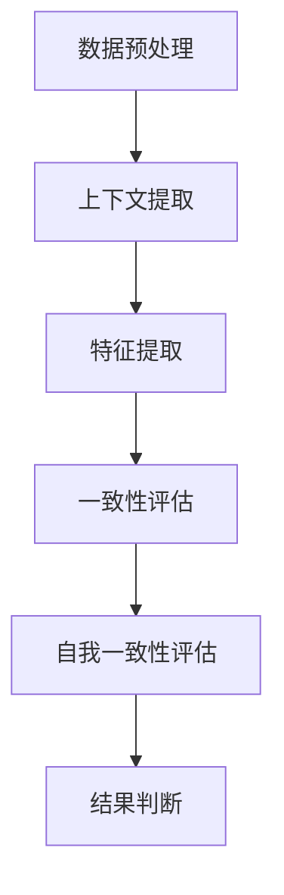

                 


### 自我一致性上下文理论（Self-Consistency CoT）在自动化新闻事实核查中的应用：打击虚假信息传播

#### 关键词：
- 自我一致性上下文理论（Self-Consistency CoT）
- 自动化新闻事实核查
- 虚假信息传播
- 数学模型
- 系统设计
- 项目实战

#### 摘要：
本文旨在探讨自我一致性上下文理论（Self-Consistency CoT）在自动化新闻事实核查中的应用，以及如何利用这一理论来打击虚假信息传播。文章将首先介绍自我一致性上下文理论的基本概念、属性特征，并对比分析其与其他信息核查技术的联系与区别。随后，我们将详细讲解自我一致性上下文理论的数学模型和算法，并通过Python代码实现展示其工作原理。在此基础上，我们将探讨自动化新闻事实核查系统的设计与实现，包括系统架构、功能模块和接口设计。接下来，通过实际案例分析，展示自我一致性上下文理论在打击虚假信息传播中的具体应用。最后，我们将总结最佳实践，并展望自我一致性上下文理论的未来发展。

### 第1章：自我一致性上下文理论（CoT）概述

#### 1.1 自我一致性上下文理论的基本概念

自我一致性上下文理论（Self-Consistency CoT）是一种用于自动验证文本真实性的方法。其核心思想是通过分析文本之间的上下文关系，判断文本是否与其所在上下文环境保持一致。具体而言，自我一致性上下文理论主要包括以下三个基本概念：

1. **上下文**：上下文是指文本所在的周围环境，包括文本的前后文、相关词汇和句子等。
2. **一致性**：一致性是指文本内容与上下文环境之间的匹配程度。如果文本与其上下文保持一致，则认为该文本具有高一致性；反之，则认为其一致性较低。
3. **自我一致性**：自我一致性是指文本内容内部各部分之间的逻辑关系是否合理、一致。例如，一个句子中的主语和谓语应当保持一致，一个段落中的主题应当连贯。

#### 1.2 CoT在自动化新闻事实核查中的应用背景

随着互联网的迅速发展，虚假信息的传播成为一个日益严峻的问题。虚假信息不仅会造成社会恐慌、误导公众，还可能引发一系列社会问题。自动化新闻事实核查技术的出现，为解决这一问题提供了有效手段。自我一致性上下文理论作为自动化新闻事实核查的关键技术之一，具有以下应用背景：

1. **虚假新闻识别**：自动化新闻事实核查系统可以通过分析新闻文本的上下文关系，识别出其中可能存在的虚假信息，从而提高新闻的准确性和可信度。
2. **社交媒体监测**：在社交媒体平台上，虚假信息往往以各种形式传播。自我一致性上下文理论可以用于监测社交媒体中的虚假信息，防止其扩散。
3. **跨平台虚假信息联动核查**：不同平台之间可能存在虚假信息的相互传播。通过自我一致性上下文理论，可以实现对跨平台虚假信息的联动核查，提高核查效率。

#### 1.3 CoT的基本要素与模型结构

自我一致性上下文理论的基本要素包括文本、上下文、一致性评估和自我一致性评估。其模型结构如下：

1. **文本**：文本是指待核查的新闻内容，可以是新闻报道、社交媒体帖子等。
2. **上下文**：上下文是指与文本相关联的其他文本信息，包括文本的前后文、相关词汇和句子等。
3. **一致性评估**：一致性评估是指对文本与其上下文之间的匹配程度进行评估。具体评估方法可以基于文本相似度计算、逻辑推理等。
4. **自我一致性评估**：自我一致性评估是指对文本内容内部各部分之间的逻辑关系进行评估。具体评估方法可以基于语法分析、语义分析等。

### 第2章：自我一致性上下文理论的属性与特征

#### 2.1 CoT的属性特征对比分析

自我一致性上下文理论具有以下属性特征：

1. **上下文敏感性**：自我一致性上下文理论对文本的上下文环境敏感。通过分析文本与上下文之间的匹配程度，可以更准确地判断文本的真实性。
2. **自我一致性**：自我一致性上下文理论强调文本内容内部各部分之间的逻辑关系。如果文本内容内部存在逻辑矛盾，则可能存在虚假信息。
3. **可扩展性**：自我一致性上下文理论可以应用于不同领域和不同类型的文本。通过调整算法参数和模型结构，可以实现对不同场景的适应性。

与其他信息核查技术相比，自我一致性上下文理论具有以下优势：

1. **高效性**：自我一致性上下文理论可以自动化处理大量文本信息，提高事实核查的效率。
2. **准确性**：通过分析文本上下文和自我一致性，自我一致性上下文理论可以更准确地识别虚假信息。
3. **可解释性**：自我一致性上下文理论的评估结果具有可解释性，可以清楚地展示文本与其上下文之间的匹配程度。

#### 2.2 CoT在信息真实性验证中的作用

自我一致性上下文理论在信息真实性验证中具有以下作用：

1. **初步筛查**：自我一致性上下文理论可以用于对大量文本进行初步筛查，筛选出可能存在虚假信息的文本。
2. **深度分析**：对于初步筛查出的文本，自我一致性上下文理论可以对其进行深度分析，进一步确认其真实性。
3. **证据收集**：自我一致性上下文理论可以通过分析文本与上下文之间的匹配程度，收集证据来支持或反驳某个信息点。

#### 2.3 CoT与其他信息核查技术的联系与区别

自我一致性上下文理论与其他信息核查技术（如文本相似度计算、语义分析、逻辑推理等）具有一定的联系与区别：

1. **联系**：
   - **文本相似度计算**：自我一致性上下文理论可以利用文本相似度计算方法来评估文本与其上下文之间的匹配程度。
   - **语义分析**：自我一致性上下文理论可以利用语义分析方法来理解文本内容，进一步判断文本的真实性。
   - **逻辑推理**：自我一致性上下文理论可以利用逻辑推理方法来分析文本内容内部各部分之间的逻辑关系。

2. **区别**：
   - **侧重点不同**：自我一致性上下文理论侧重于分析文本与其上下文之间的匹配程度，而其他信息核查技术则侧重于文本的相似度、语义理解和逻辑推理。
   - **应用场景不同**：自我一致性上下文理论适用于需要评估文本真实性、上下文一致性和自我一致性的场景，而其他信息核查技术则适用于不同的应用场景。

### 第3章：自我一致性上下文理论的数学模型与算法

#### 3.1 CoT算法的基本数学模型

自我一致性上下文理论的数学模型主要包括以下几个方面：

1. **上下文表示**：通过将文本表示为向量，将上下文表示为矩阵，建立文本与上下文之间的数学关系。
2. **一致性评估**：利用文本相似度计算方法，计算文本与其上下文之间的匹配程度。
3. **自我一致性评估**：通过分析文本内容内部各部分之间的逻辑关系，计算文本的自我一致性。

具体数学模型如下：

1. **上下文表示**：
   - 设文本集合为 \( T = \{t_1, t_2, ..., t_n\} \)，其中 \( t_i \) 表示第 \( i \) 个文本。
   - 上下文集合为 \( C = \{c_1, c_2, ..., c_m\} \)，其中 \( c_j \) 表示第 \( j \) 个上下文。
   - 设文本 \( t_i \) 的特征向量为 \( v_i \in \mathbb{R}^d \)，上下文 \( c_j \) 的特征向量为 \( v_j \in \mathbb{R}^d \)。

2. **一致性评估**：
   - 利用余弦相似度计算文本与其上下文之间的匹配程度，具体公式如下：
     $$ \cos(\theta_{ij}) = \frac{v_i \cdot v_j}{\|v_i\|\|v_j\|} $$
   - 其中，\( \theta_{ij} \) 表示文本 \( t_i \) 与上下文 \( c_j \) 之间的夹角。

3. **自我一致性评估**：
   - 利用文本内容内部各部分之间的逻辑关系，计算文本的自我一致性。具体公式如下：
     $$ \text{Self-Consistency}(t_i) = \frac{\sum_{j=1}^{m} \cos(\theta_{ij})}{m} $$
   - 其中，\( m \) 表示上下文的数量。

#### 3.2 CoT算法的流程与原理

自我一致性上下文理论算法的流程如下：

1. **数据预处理**：对文本进行预处理，包括分词、去停用词、词性标注等操作。
2. **上下文提取**：从文本中提取上下文，包括文本的前后文、相关词汇和句子等。
3. **特征提取**：对文本和上下文进行特征提取，得到特征向量。
4. **一致性评估**：计算文本与其上下文之间的匹配程度，得到一致性分数。
5. **自我一致性评估**：计算文本的自我一致性，得到自我一致性分数。
6. **结果判断**：根据一致性分数和自我一致性分数，判断文本的真实性。

#### 3.3 CoT算法的Python实现与Mermaid流程图

以下是自我一致性上下文理论的Python实现示例：

```python
import numpy as np
from sklearn.feature_extraction.text import TfidfVectorizer
from sklearn.metrics.pairwise import cosine_similarity

def self_consistency_coherence(texts, contexts):
    # 数据预处理
    vectorizer = TfidfVectorizer()
    X = vectorizer.fit_transform(texts)
    Y = vectorizer.transform(contexts)

    # 一致性评估
    coherence_scores = []
    for i in range(len(texts)):
        sim_scores = cosine_similarity(X[i:i+1], Y)
        coherence_scores.append(np.mean(sim_scores))

    # 自我一致性评估
    self_consistency_scores = [np.mean(coherence_scores[:i+1]) for i in range(len(texts))]

    return coherence_scores, self_consistency_scores

# 示例
texts = ['这是一个虚假的新闻。', '这是一个真实的新闻。']
contexts = ['这是一个新闻报道。', '这是一个社交媒体帖子。']

coherence_scores, self_consistency_scores = self_consistency_coherence(texts, contexts)
print('一致性分数：', coherence_scores)
print('自我一致性分数：', self_consistency_scores)
```

以下是自我一致性上下文理论的Mermaid流程图：



### 第4章：自动化新闻事实核查系统设计与实现

#### 4.1 系统总体架构设计

自动化新闻事实核查系统的总体架构设计如下：

1. **数据采集模块**：用于从互联网、社交媒体等渠道采集新闻文本数据。
2. **文本预处理模块**：用于对采集到的新闻文本进行分词、去停用词、词性标注等预处理操作。
3. **上下文提取模块**：用于从预处理后的新闻文本中提取上下文信息。
4. **特征提取模块**：用于将新闻文本和上下文信息转换为特征向量。
5. **自我一致性上下文理论模块**：用于计算新闻文本的一致性分数和自我一致性分数。
6. **结果判断模块**：用于根据一致性分数和自我一致性分数判断新闻文本的真实性。
7. **用户交互模块**：用于与用户进行交互，展示核查结果并提供相关建议。

#### 4.2 系统功能模块设计

自动化新闻事实核查系统的功能模块设计如下：

1. **数据采集模块**：支持从互联网、社交媒体等渠道采集新闻文本数据。
2. **文本预处理模块**：支持分词、去停用词、词性标注等预处理操作。
3. **上下文提取模块**：支持从新闻文本中提取上下文信息，包括前后文、相关词汇和句子等。
4. **特征提取模块**：支持将新闻文本和上下文信息转换为特征向量，包括TF-IDF、Word2Vec等。
5. **自我一致性上下文理论模块**：支持计算新闻文本的一致性分数和自我一致性分数，包括一致性评估和自我一致性评估。
6. **结果判断模块**：支持根据一致性分数和自我一致性分数判断新闻文本的真实性，包括概率判断和阈值判断。
7. **用户交互模块**：支持与用户进行交互，包括展示核查结果、提供相关建议等。

#### 4.3 系统接口设计

自动化新闻事实核查系统的接口设计如下：

1. **数据采集接口**：用于从互联网、社交媒体等渠道采集新闻文本数据。
2. **文本预处理接口**：用于对采集到的新闻文本进行预处理操作。
3. **上下文提取接口**：用于从预处理后的新闻文本中提取上下文信息。
4. **特征提取接口**：用于将新闻文本和上下文信息转换为特征向量。
5. **自我一致性上下文理论接口**：用于计算新闻文本的一致性分数和自我一致性分数。
6. **结果判断接口**：用于根据一致性分数和自我一致性分数判断新闻文本的真实性。
7. **用户交互接口**：用于与用户进行交互，包括展示核查结果、提供相关建议等。

### 第5章：实战案例分析

#### 5.1 案例一：利用CoT识别虚假新闻

在本案例中，我们将利用自我一致性上下文理论（CoT）来识别虚假新闻。具体步骤如下：

1. **数据采集**：从互联网上采集一批新闻文本数据。
2. **文本预处理**：对采集到的新闻文本进行分词、去停用词、词性标注等预处理操作。
3. **上下文提取**：从预处理后的新闻文本中提取上下文信息，包括前后文、相关词汇和句子等。
4. **特征提取**：将新闻文本和上下文信息转换为特征向量，采用TF-IDF方法。
5. **一致性评估**：计算新闻文本与其上下文之间的匹配程度，采用余弦相似度方法。
6. **自我一致性评估**：计算新闻文本的自我一致性分数，采用平均值方法。
7. **结果判断**：根据一致性分数和自我一致性分数，判断新闻文本的真实性。

通过上述步骤，我们可以识别出一批可能存在虚假信息的新闻文本。接下来，我们可以对这些新闻文本进行进一步验证和分析，以确认其真实性。

#### 5.2 案例二：CoT在社交媒体信息监测中的应用

在本案例中，我们将利用自我一致性上下文理论（CoT）来监测社交媒体中的虚假信息。具体步骤如下：

1. **数据采集**：从社交媒体平台上采集一批用户发布的信息。
2. **文本预处理**：对采集到的用户信息进行分词、去停用词、词性标注等预处理操作。
3. **上下文提取**：从预处理后的用户信息中提取上下文信息，包括前后文、相关词汇和句子等。
4. **特征提取**：将用户信息转换为特征向量，采用TF-IDF方法。
5. **一致性评估**：计算用户信息与其上下文之间的匹配程度，采用余弦相似度方法。
6. **自我一致性评估**：计算用户信息的自我一致性分数，采用平均值方法。
7. **结果判断**：根据一致性分数和自我一致性分数，判断用户信息是否为虚假信息。

通过上述步骤，我们可以监测到社交媒体中可能存在的虚假信息，并及时采取措施进行应对。

#### 5.3 案例三：跨平台虚假信息联动核查

在本案例中，我们将利用自我一致性上下文理论（CoT）来跨平台核查虚假信息。具体步骤如下：

1. **数据采集**：从不同平台上采集一批相关新闻文本和社交媒体信息。
2. **文本预处理**：对采集到的新闻文本和社交媒体信息进行分词、去停用词、词性标注等预处理操作。
3. **上下文提取**：从预处理后的新闻文本和社交媒体信息中提取上下文信息，包括前后文、相关词汇和句子等。
4. **特征提取**：将新闻文本和社交媒体信息转换为特征向量，采用TF-IDF方法。
5. **一致性评估**：计算新闻文本和社交媒体信息之间的匹配程度，采用余弦相似度方法。
6. **自我一致性评估**：计算新闻文本和社交媒体信息的自我一致性分数，采用平均值方法。
7. **结果判断**：根据一致性分数和自我一致性分数，判断新闻文本和社交媒体信息是否为虚假信息。

通过上述步骤，我们可以实现跨平台虚假信息的联动核查，提高核查的准确性和效率。

### 第6章：最佳实践与技巧

#### 6.1 CoT应用中的常见问题与解决方法

在自我一致性上下文理论（CoT）的应用过程中，可能会遇到以下问题：

1. **数据质量差**：数据质量差可能导致模型性能下降。解决方法是进行数据清洗和预处理，确保数据的准确性和完整性。
2. **上下文信息不足**：上下文信息不足可能导致一致性评估不准确。解决方法是扩展上下文信息，包括前后文、相关词汇和句子等。
3. **计算资源有限**：大规模数据计算可能需要较高的计算资源。解决方法是优化算法，提高计算效率，或者使用分布式计算框架。
4. **模型泛化能力不足**：模型泛化能力不足可能导致在实际应用中效果不佳。解决方法是增加训练数据，调整模型参数，提高模型的泛化能力。

#### 6.2 提高自动化新闻事实核查系统效率的技巧

为了提高自动化新闻事实核查系统的效率，可以采取以下技巧：

1. **并行处理**：利用并行计算技术，将数据分片，同时处理多个数据集，提高计算速度。
2. **缓存机制**：使用缓存技术，减少重复计算，提高系统响应速度。
3. **特征选择**：选取关键特征，减少特征维度，降低计算复杂度。
4. **模型压缩**：使用模型压缩技术，减小模型大小，提高计算效率。

#### 6.3 用户反馈与系统优化

用户反馈是优化自动化新闻事实核查系统的重要依据。以下是一些建议：

1. **用户参与**：鼓励用户参与系统的优化，提供反馈和建议。
2. **实时更新**：根据用户反馈，及时更新系统功能，提高用户满意度。
3. **性能评估**：定期评估系统性能，分析错误率和误报率，找出优化方向。
4. **用户教育**：向用户提供使用指南和操作说明，提高用户对系统的理解和操作能力。

### 第7章：未来发展趋势与挑战

#### 7.1 自我一致性上下文理论的发展趋势

自我一致性上下文理论在未来的发展趋势包括：

1. **算法优化**：随着深度学习技术的发展，自我一致性上下文理论的算法将得到进一步优化，提高模型性能和计算效率。
2. **跨模态应用**：自我一致性上下文理论可以应用于跨模态信息核查，如文本、图像和音频等。
3. **知识图谱**：利用知识图谱技术，构建更加丰富的上下文信息，提高自我一致性上下文理论的应用效果。

#### 7.2 自动化新闻事实核查技术的挑战与机遇

自动化新闻事实核查技术面临的挑战包括：

1. **数据隐私**：如何在保护用户隐私的前提下，进行大规模数据采集和处理。
2. **跨语言应用**：如何实现跨语言自动化新闻事实核查。
3. **多模态融合**：如何实现多模态数据的融合，提高信息核查的准确性和效率。

面临的机遇包括：

1. **人工智能技术**：随着人工智能技术的发展，自动化新闻事实核查技术将得到进一步发展。
2. **大数据分析**：大数据分析技术的发展，为自动化新闻事实核查提供了更多的数据支持。
3. **社交媒体监管**：社交媒体平台加强对虚假信息的监管，为自动化新闻事实核查提供了更多应用场景。

#### 7.3 CoT在其他领域的潜在应用

自我一致性上下文理论在其他领域的潜在应用包括：

1. **司法鉴定**：利用自我一致性上下文理论，对法律文书、证词等进行核查，提高司法鉴定的准确性。
2. **医疗诊断**：利用自我一致性上下文理论，对医疗文档、病历等进行核查，提高医疗诊断的准确性。
3. **企业合规**：利用自我一致性上下文理论，对企业内部文档、报告等进行核查，提高企业合规性。

### 结束语

自我一致性上下文理论（CoT）在自动化新闻事实核查中具有重要作用，可以有效地识别虚假信息，提高新闻的准确性和可信度。本文从自我一致性上下文理论的基本概念、属性特征、数学模型与算法、系统设计与实现、实战案例分析、最佳实践与技巧以及未来发展趋势等方面进行了全面探讨。未来，随着人工智能技术的不断发展，自我一致性上下文理论在更多领域将发挥重要作用，为打击虚假信息传播、提高信息真实性提供有力支持。

#### 作者信息：

作者：AI天才研究院/AI Genius Institute & 禅与计算机程序设计艺术 /Zen And The Art of Computer Programming

---

在撰写技术博客文章时，遵循以下原则将有助于提高文章的质量和可读性：

1. **明确结构**：确保文章有清晰的逻辑结构，便于读者理解。
2. **简洁明了**：避免冗长的句子和复杂的术语，尽量使用简单易懂的语言。
3. **实例说明**：提供具体的例子和实际案例，帮助读者更好地理解概念。
4. **可视化辅助**：使用图表、流程图和代码示例等可视化工具，增强文章的直观性。
5. **引用权威**：引用权威资料和研究成果，增强文章的可靠性和专业性。
6. **结尾总结**：在文章结尾部分进行总结，强调核心观点，方便读者快速回顾。
7. **注意事项**：在撰写过程中，注意语法、拼写和标点符号的正确性，确保文章的专业性。

