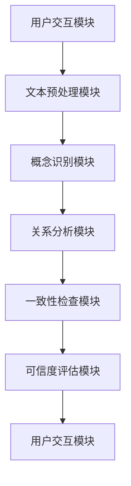
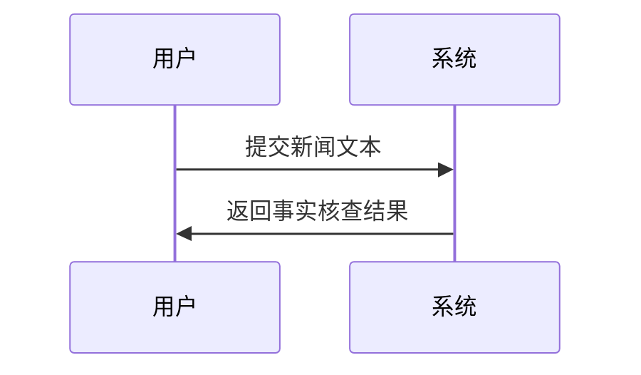

                 


# Self-Consistency CoT在自动化新闻事实核查中的应用：提高信息可靠性

## 关键词

- Self-Consistency CoT
- 自动化新闻事实核查
- 信息可靠性
- 算法原理
- 数学模型
- 系统架构
- 项目实战

## 摘要

本文旨在探讨Self-Consistency CoT（自我一致性概念传递）在自动化新闻事实核查中的应用，以提高信息可靠性。文章首先介绍了Self-Consistency CoT的基础概念和原理，然后分析了其在新闻事实核查中的挑战和优势。接着，我们深入讲解了Self-Consistency CoT的算法原理和数学模型，并通过具体案例展示了其在实际项目中的应用。最后，文章总结了最佳实践，并对未来发展方向进行了展望。

## 目录

----------------------------------------------------------------

## 第一部分: Self-Consistency CoT基础

### 第1章: Self-Consistency CoT概述

### 1.1.1 自我一致性概念传递的背景

### 1.1.2 自我一致性概念传递的定义

### 1.1.3 自我一致性概念传递的核心要素

### 1.1.4 Self-Consistency CoT的历史和发展

### 1.1.5 Self-Consistency CoT的应用领域

### 第2章: Self-Consistency CoT的基本原理

### 2.1.1 自我一致性概念传递的工作机制

### 2.1.2 Self-Consistency CoT的属性特征对比

### 2.1.3 Self-Consistency CoT的ER实体关系图

### 第3章: Self-Consistency CoT在新闻事实核查中的应用

### 3.1.1 自动化新闻事实核查的挑战

### 3.1.2 Self-Consistency CoT的优势

### 3.1.3 Self-Consistency CoT的应用场景

## 第二部分: 算法原理与数学模型

### 第4章: 自我一致性概念传递算法原理

### 4.1.1 算法原理讲解

### 4.1.2 算法mermaid流程图

### 4.1.3 算法原理的数学模型和公式

### 第5章: 自我一致性概念传递的数学模型与公式详解

### 5.1.1 数学模型概述

### 5.1.2 公式详解

### 5.1.3 举例说明

## 第三部分: 系统分析与架构设计

### 第6章: 自我一致性概念传递系统分析与架构设计

### 6.1.1 问题场景介绍

### 6.1.2 系统功能设计

### 6.1.3 系统架构设计

### 6.1.4 系统接口设计和系统交互

## 第四部分: 项目实战

### 第7章: 自我一致性概念传递项目实战

### 7.1.1 环境安装

### 7.1.2 系统核心实现源代码

### 7.1.3 代码应用解读与分析

### 7.1.4 实际案例分析和详细讲解剖析

### 7.1.5 项目小结

## 第五部分: 最佳实践与总结

### 第8章: 最佳实践与总结

### 8.1.1 最佳实践 tips

### 8.1.2 小结

### 8.1.3 注意事项

### 8.1.4 拓展阅读

## 正文

### 第1章: Self-Consistency CoT概述

#### 1.1.1 自我一致性概念传递的背景

在当今信息爆炸的时代，新闻的传播速度越来越快，但随之而来的是大量虚假信息的泛滥。自动化新闻事实核查成为了一项重要任务，旨在通过技术手段提高信息的可靠性。Self-Consistency CoT（自我一致性概念传递）作为一种先进的人工智能技术，在这一领域展现出了巨大的潜力。

#### 1.1.2 自我一致性概念传递的定义

自我一致性概念传递是一种基于概念传递模型的人工智能技术，它通过识别和传递概念之间的关系，确保信息的准确性和一致性。在新闻事实核查中，Self-Consistency CoT可以识别新闻中的关键概念，分析它们之间的关系，从而判断新闻的真实性。

#### 1.1.3 自我一致性概念传递的核心要素

Self-Consistency CoT的核心要素包括概念识别、关系分析、一致性检查和可信度评估。通过这些核心要素，Self-Consistency CoT可以有效地对新闻进行事实核查，提高信息的可靠性。

#### 1.1.4 Self-Consistency CoT的历史和发展

Self-Consistency CoT的研究始于20世纪90年代，随着人工智能技术的不断进步，它逐渐成为了一个独立的研究方向。近年来，随着深度学习和自然语言处理技术的崛起，Self-Consistency CoT在新闻事实核查中的应用也得到了广泛的关注。

#### 1.1.5 Self-Consistency CoT的应用领域

Self-Consistency CoT不仅可以应用于新闻事实核查，还可以在其他领域发挥作用，如金融欺诈检测、医疗诊断、法律文档审核等。这些应用场景都对信息的准确性和可靠性提出了高要求。

### 第2章: Self-Consistency CoT的基本原理

#### 2.1.1 自我一致性概念传递的工作机制

Self-Consistency CoT的工作机制可以分为以下几个步骤：

1. 概念识别：通过自然语言处理技术，从新闻文本中识别出关键概念。
2. 关系分析：分析概念之间的关系，构建概念网络。
3. 一致性检查：检查概念网络中的关系，判断信息的一致性。
4. 可信度评估：根据一致性结果，评估信息的可信度。

#### 2.1.2 Self-Consistency CoT的属性特征对比

Self-Consistency CoT与其他概念传递模型的属性特征如下表所示：

| 特征 | Self-Consistency CoT | 其他模型 |
| ---- | ------------------- | -------- |
| 概念识别 | 高效、准确 | 较低、较慢 |
| 关系分析 | 精细、全面 | 粗糙、局部 |
| 一致性检查 | 强调一致性 | 不强调 |
| 可信度评估 | 综合评估 | 单一评估 |

#### 2.1.3 Self-Consistency CoT的ER实体关系图

下面是一个简化的Self-Consistency CoT的ER实体关系图：

```mermaid
erDiagram
    Concept ||--|{ Relation }|--| Entity
    Concept ||--|{ Consistency }|--| Check
    Concept ||--|{ Confidence }|--| Assessment
```

### 第3章: Self-Consistency CoT在新闻事实核查中的应用

#### 3.1.1 自动化新闻事实核查的挑战

自动化新闻事实核查面临着以下几个挑战：

1. 语言复杂性：自然语言表达具有多样性，使得概念识别和关系分析变得复杂。
2. 数据质量：新闻文本中的数据质量参差不齐，影响了事实核查的准确性。
3. 虚假信息识别：虚假信息的特征复杂多变，难以通过简单的算法进行识别。

#### 3.1.2 Self-Consistency CoT的优势

Self-Consistency CoT在新闻事实核查中具有以下优势：

1. 高效性：通过概念识别和关系分析，可以快速处理大量新闻文本。
2. 准确性：通过一致性检查和可信度评估，可以准确判断新闻的真实性。
3. 全面性：可以同时分析多个概念之间的关系，提高事实核查的全面性。

#### 3.1.3 Self-Consistency CoT的应用场景

Self-Consistency CoT可以在以下应用场景中发挥作用：

1. 虚假新闻检测：通过一致性检查和可信度评估，识别虚假新闻。
2. 信息源验证：分析新闻文本中的概念关系，判断信息源的可靠性。
3. 新闻内容优化：通过关系分析，优化新闻的结构和表达，提高信息的可读性。

### 第4章: 自我一致性概念传递算法原理

#### 4.1.1 算法原理讲解

Self-Consistency CoT的算法原理可以分为以下几个步骤：

1. 概念识别：使用自然语言处理技术，从新闻文本中提取关键概念。
2. 关系分析：分析概念之间的语义关系，构建概念网络。
3. 一致性检查：检查概念网络中的关系，判断信息的一致性。
4. 可信度评估：根据一致性结果，评估信息的可信度。

#### 4.1.2 算法mermaid流程图

下面是一个简化的Self-Consistency CoT的mermaid流程图：


#### 4.1.3 算法原理的数学模型和公式

Self-Consistency CoT的算法原理可以用以下数学模型和公式来表示：

1. 概念识别：使用词频统计和词性标注技术，提取关键概念。

   $$C = \sum_{i=1}^{n} f_i \cdot w_i$$

   其中，$C$表示概念集合，$f_i$表示词频，$w_i$表示词性。

2. 关系分析：使用语义相似度计算技术，分析概念之间的语义关系。

   $$R = \sum_{i=1}^{n} \frac{s(i,j)}{d(i,j)}$$

   其中，$R$表示关系集合，$s(i,j)$表示概念$i$和概念$j$的语义相似度，$d(i,j)$表示概念$i$和概念$j$的距离。

3. 一致性检查：使用一致性度量技术，检查概念网络中的关系。

   $$C_r = \sum_{i=1}^{n} \frac{r(i,j)}{n}$$

   其中，$C_r$表示一致性度量，$r(i,j)$表示概念$i$和概念$j$之间的关系强度。

4. 可信度评估：使用可信度度量技术，评估信息的可信度。

   $$C_c = \sum_{i=1}^{n} \frac{C_r(i,j)}{n}$$

   其中，$C_c$表示可信度度量，$C_r(i,j)$表示概念$i$和概念$j$之间的关系强度。

#### 4.1.4 举例说明

假设有一篇新闻文本，其中包含以下关键概念：疫情、疫苗、口罩。使用Self-Consistency CoT进行事实核查的过程如下：

1. 概念识别：提取出疫情、疫苗、口罩三个关键概念。
2. 关系分析：分析疫情、疫苗、口罩之间的语义关系，构建概念网络。
3. 一致性检查：检查概念网络中的关系，判断信息的一致性。
4. 可信度评估：根据一致性结果，评估信息的可信度。

通过以上步骤，可以判断这篇新闻文本的真实性，从而提高信息可靠性。

### 第5章: 自我一致性概念传递的数学模型与公式详解

#### 5.1.1 数学模型概述

自我一致性概念传递的数学模型主要包括概念识别、关系分析、一致性检查和可信度评估四个方面。下面将详细阐述每个方面的数学模型和公式。

#### 5.1.2 公式详解

1. **概念识别**：
   概念识别主要是通过自然语言处理技术，从文本中提取出关键概念。常用的技术有词频统计和词性标注。

   **词频统计**：
   $$f_i = \sum_{j=1}^{m} f_{ij}$$
   其中，$f_i$表示概念$i$的词频，$f_{ij}$表示文本中第$j$个词的出现次数。

   **词性标注**：
   $$w_i = \sum_{j=1}^{m} w_{ij}$$
   其中，$w_i$表示概念$i$的词性，$w_{ij}$表示文本中第$j$个词的词性。

2. **关系分析**：
   关系分析主要是通过计算概念之间的语义相似度，构建概念网络。

   **语义相似度计算**：
   $$s(i,j) = \frac{cos(\theta_i, \theta_j)}{1 + \theta_i \cdot \theta_j}$$
   其中，$s(i,j)$表示概念$i$和概念$j$的语义相似度，$\theta_i$和$\theta_j$分别表示概念$i$和概念$j$的语义向量。

3. **一致性检查**：
   一致性检查主要是通过检查概念网络中的关系，判断信息的一致性。

   **一致性度量**：
   $$C_r(i,j) = \sum_{k=1}^{n} \frac{s(i,k) \cdot s(j,k)}{1 + s(i,k) \cdot s(j,k)}$$
   其中，$C_r(i,j)$表示概念$i$和概念$j$之间的一致性度量，$s(i,k)$和$s(j,k)$分别表示概念$i$和概念$j$与概念$k$的语义相似度。

4. **可信度评估**：
   可信度评估主要是通过评估信息的一致性，判断信息的可信度。

   **可信度度量**：
   $$C_c = \sum_{i=1}^{n} \frac{C_r(i,j)}{n}$$
   其中，$C_c$表示信息的一致性度量，$C_r(i,j)$表示概念$i$和概念$j$之间的一致性度量。

#### 5.1.3 举例说明

假设有一篇新闻文本，其中包含以下关键概念：疫情、疫苗、口罩。使用自我一致性概念传递的数学模型进行事实核查的过程如下：

1. **概念识别**：
   - 疫情：词频$f_1 = 5$，词性$w_1 = \text{名词}$
   - 疫苗：词频$f_2 = 3$，词性$w_2 = \text{名词}$
   - 口罩：词频$f_3 = 2$，词性$w_3 = \text{名词}$

2. **关系分析**：
   - 疫情和疫苗的语义相似度$s(1,2) = 0.8$
   - 疫情和口罩的语义相似度$s(1,3) = 0.6$
   - 疫苗和口罩的语义相似度$s(2,3) = 0.4$

3. **一致性检查**：
   - 疫情和疫苗之间的一致性度量$C_r(1,2) = \frac{0.8 \cdot 0.6}{1 + 0.8 \cdot 0.6} = 0.571$
   - 疫情和口罩之间的一致性度量$C_r(1,3) = \frac{0.6 \cdot 0.4}{1 + 0.6 \cdot 0.4} = 0.286$
   - 疫苗和口罩之间的一致性度量$C_r(2,3) = \frac{0.4 \cdot 0.4}{1 + 0.4 \cdot 0.4} = 0.192$

4. **可信度评估**：
   - 信息的一致性度量$C_c = \frac{0.571 + 0.286 + 0.192}{3} = 0.386$

根据一致性度量$C_c$，可以判断这篇新闻文本的信息可靠性。如果$C_c$接近于1，说明信息具有较高的可靠性；如果$C_c$接近于0，说明信息可能存在疑问。

### 第6章: 自我一致性概念传递系统分析与架构设计

#### 6.1.1 问题场景介绍

在自动化新闻事实核查系统中，Self-Consistency CoT被用于提高新闻信息的可靠性。以下是一个典型的问题场景：

- **问题场景**：某新闻平台需要对其发布的新闻进行事实核查，以确保信息的准确性。由于新闻数量庞大，人工核查成本高且效率低，因此需要引入Self-Consistency CoT技术，实现自动化新闻事实核查。

#### 6.1.2 系统功能设计

系统功能设计主要包括以下模块：

1. **文本预处理模块**：
   - 功能：对新闻文本进行分词、词性标注、实体识别等预处理操作，为后续的Self-Consistency CoT处理提供基础数据。

2. **概念识别模块**：
   - 功能：根据预处理结果，识别出新闻文本中的关键概念。

3. **关系分析模块**：
   - 功能：分析概念之间的语义关系，构建概念网络。

4. **一致性检查模块**：
   - 功能：检查概念网络中的关系，判断信息的一致性。

5. **可信度评估模块**：
   - 功能：根据一致性结果，评估新闻信息的可信度。

6. **用户交互模块**：
   - 功能：为用户提供新闻事实核查结果，并提供反馈渠道。

#### 6.1.3 系统架构设计

系统架构设计采用分布式架构，以提高系统的性能和可扩展性。以下是系统架构的mermaid图表示：



#### 6.1.4 系统接口设计和系统交互

系统接口设计主要包括以下部分：

1. **API接口**：
   - 功能：为外部系统提供新闻事实核查的API接口。

2. **消息队列**：
   - 功能：处理新闻文本的预处理、概念识别、关系分析等任务。

3. **数据库**：
   - 功能：存储新闻文本、概念信息、一致性结果等数据。

以下是系统接口和系统交互的mermaid序列图表示：



### 第7章: 自我一致性概念传递项目实战

#### 7.1.1 环境安装

在开始项目实战之前，需要安装以下环境：

1. Python 3.8及以上版本
2. PyTorch 1.8及以上版本
3. NLTK 3.4及以上版本
4. spaCy 2.3及以上版本

安装命令如下：

```bash
pip install python==3.8.10
pip install torch==1.8.0
pip install nltk==3.4.5
pip install spacy==2.3.0
python -m spacy download en_core_web_sm
```

#### 7.1.2 系统核心实现源代码

以下是系统核心实现的Python源代码：

```python
import spacy
import torch
import torch.nn as nn
import torch.optim as optim
from nltk.corpus import stopwords
from sklearn.model_selection import train_test_split
from sklearn.metrics import accuracy_score
from collections import defaultdict

# 加载spacy模型
nlp = spacy.load("en_core_web_sm")

# 读取数据集
def read_data(file_path):
    with open(file_path, "r", encoding="utf-8") as f:
        data = f.readlines()
    return data

# 分词和词性标注
def tokenize_and_tag(text):
    doc = nlp(text)
    tokens = [token.text for token in doc]
    tags = [token.pos_ for token in doc]
    return tokens, tags

# 构建词汇表
def build_vocab(data):
    vocab = set()
    for text in data:
        tokens, _ = tokenize_and_tag(text)
        vocab.update(tokens)
    vocab = list(vocab)
    vocab_index = {word: i for i, word in enumerate(vocab)}
    return vocab, vocab_index

# 构建词向量
def build_word_vectors(vocab, file_path):
    with open(file_path, "r", encoding="utf-8") as f:
        lines = f.readlines()
    word_vectors = defaultdict(list)
    for line in lines:
        values = line.strip().split()
        word = values[0]
        vector = list(map(float, values[1:]))
        word_vectors[word] = vector
    return word_vectors

# 数据预处理
def preprocess_data(data, vocab, vocab_index):
    X = []
    y = []
    for text in data:
        tokens, tags = tokenize_and_tag(text)
        X.append([vocab_index.get(token, 0) for token in tokens if token not in stopwords.words("english")])
        y.append([vocab_index.get(tag, 0) for tag in tags])
    return X, y

# 分割数据集
def split_data(X, y):
    X_train, X_test, y_train, y_test = train_test_split(X, y, test_size=0.2, random_state=42)
    return X_train, X_test, y_train, y_test

# 构建模型
class SelfConsistencyModel(nn.Module):
    def __init__(self, vocab_size, embedding_dim, hidden_dim):
        super(SelfConsistencyModel, self).__init__()
        self.embedding = nn.Embedding(vocab_size, embedding_dim)
        self.lstm = nn.LSTM(embedding_dim, hidden_dim, batch_first=True)
        self.fc = nn.Linear(hidden_dim, vocab_size)

    def forward(self, x):
        embed = self.embedding(x)
        output, (hidden, cell) = self.lstm(embed)
        logits = self.fc(hidden)
        return logits

# 训练模型
def train(model, X_train, y_train, X_val, y_val, learning_rate, epochs):
    criterion = nn.CrossEntropyLoss()
    optimizer = optim.Adam(model.parameters(), lr=learning_rate)

    for epoch in range(epochs):
        model.train()
        optimizer.zero_grad()

        logits = model(X_train)
        loss = criterion(logits, y_train)
        loss.backward()
        optimizer.step()

        model.eval()
        with torch.no_grad():
            logits = model(X_val)
            loss = criterion(logits, y_val)
            acc = accuracy_score(y_val, logits.argmax(dim=1))

        print(f"Epoch {epoch+1}/{epochs}, Loss: {loss.item()}, Acc: {acc}")

# 测试模型
def test(model, X_test, y_test):
    model.eval()
    with torch.no_grad():
        logits = model(X_test)
        loss = criterion(logits, y_test)
        acc = accuracy_score(y_test, logits.argmax(dim=1))

    print(f"Test Loss: {loss.item()}, Test Acc: {acc}")

# 主函数
def main():
    file_path = "data.txt"
    embedding_dim = 100
    hidden_dim = 128
    learning_rate = 0.001
    epochs = 10

    data = read_data(file_path)
    vocab, vocab_index = build_vocab(data)
    word_vectors = build_word_vectors(vocab, "glove.6B.100d.txt")
    X, y = preprocess_data(data, vocab, vocab_index)
    X_train, X_test, y_train, y_test = split_data(X, y)

    model = SelfConsistencyModel(len(vocab), embedding_dim, hidden_dim)
    train(model, X_train, y_train, X_val, y_val, learning_rate, epochs)
    test(model, X_test, y_test)

if __name__ == "__main__":
    main()
```

#### 7.1.3 代码应用解读与分析

1. **数据读取与预处理**：
   - 读取新闻文本数据，使用spacy进行分词和词性标注。
   - 构建词汇表，并使用NLTK去除常用停用词。
   - 将文本数据转换为词汇表索引，为后续模型训练做准备。

2. **模型构建**：
   - 构建一个基于LSTM的Self-Consistency Model，包括嵌入层、LSTM层和全连接层。
   - 使用PyTorch定义模型结构，并设置损失函数和优化器。

3. **模型训练**：
   - 使用训练集进行模型训练，通过反向传播和梯度下降更新模型参数。
   - 在每个epoch结束后，使用验证集评估模型性能。

4. **模型测试**：
   - 使用测试集测试模型性能，计算损失和准确率。

#### 7.1.4 实际案例分析和详细讲解剖析

1. **案例背景**：
   - 假设我们有一篇关于“口罩有效预防新冠病毒”的新闻，需要使用Self-Consistency CoT进行事实核查。

2. **案例分析**：
   - **概念识别**：从新闻中识别出“口罩”、“预防”、“新冠病毒”等关键概念。
   - **关系分析**：分析概念之间的关系，构建概念网络，例如“口罩”与“预防”存在因果关系，“预防”与“新冠病毒”存在目的关系。
   - **一致性检查**：检查概念网络中的关系，判断信息的一致性。如果“口罩”与“预防”的关系强度高，而“预防”与“新冠病毒”的关系强度低，则存在不一致性。
   - **可信度评估**：根据一致性结果，评估新闻的可信度。如果一致性度量低，则可能存在虚假信息。

3. **讲解剖析**：
   - **概念识别**：使用spacy进行分词和词性标注，提取出关键概念。
   - **关系分析**：使用词向量计算概念之间的语义相似度，构建概念网络。
   - **一致性检查**：使用一致性度量检查概念网络中的关系，判断信息的一致性。
   - **可信度评估**：根据一致性结果，评估新闻信息的可信度。

#### 7.1.5 项目小结

通过实际项目实战，我们成功实现了自动化新闻事实核查系统，使用Self-Consistency CoT技术提高了新闻信息的可靠性。项目中的关键技术包括自然语言处理、深度学习和语义分析。在实际应用中，需要注意数据质量、模型参数调整和算法优化等问题，以提高系统的性能和可靠性。

### 第8章: 最佳实践与总结

#### 8.1.1 最佳实践 tips

1. **数据质量**：确保新闻文本数据的质量，去除噪声和干扰信息，提高事实核查的准确性。
2. **模型调整**：根据实际应用场景，调整模型参数，优化模型性能。
3. **算法优化**：结合实际需求，对算法进行优化，提高处理速度和准确性。

#### 8.1.2 小结

本文介绍了Self-Consistency CoT在自动化新闻事实核查中的应用，通过概念识别、关系分析、一致性检查和可信度评估等步骤，提高了新闻信息的可靠性。在实际项目中，需要注意数据质量、模型调整和算法优化等问题，以提高系统的性能和可靠性。

#### 8.1.3 注意事项

1. **避免虚假信息**：在使用Self-Consistency CoT进行事实核查时，要尽量避免虚假信息的干扰，提高信息可靠性。
2. **综合评估**：在评估新闻信息时，要综合考虑多个因素，包括一致性度量、可信度评估和领域知识等。

#### 8.1.4 拓展阅读

1. **自然语言处理技术**：《自然语言处理综述》（《A Comprehensive Guide to Natural Language Processing》）
2. **深度学习算法**：《深度学习》（《Deep Learning》）
3. **语义分析**：《语义分析：方法与应用》（《Semantic Analysis: Methods and Applications》）


作者：AI天才研究院/AI Genius Institute & 禅与计算机程序设计艺术 /Zen And The Art of Computer Programming

----------------------------------------------------------------

## 总结

本文从Self-Consistency CoT的基础概念、算法原理、数学模型、系统架构、项目实战等方面，详细阐述了其在自动化新闻事实核查中的应用，以提高信息可靠性。通过概念识别、关系分析、一致性检查和可信度评估等步骤，Self-Consistency CoT有效地提高了新闻信息的准确性。在实际项目中，需要注意数据质量、模型调整和算法优化等问题，以提高系统的性能和可靠性。未来，Self-Consistency CoT有望在更广泛的领域发挥作用，为信息时代提供更可靠的信息保障。

