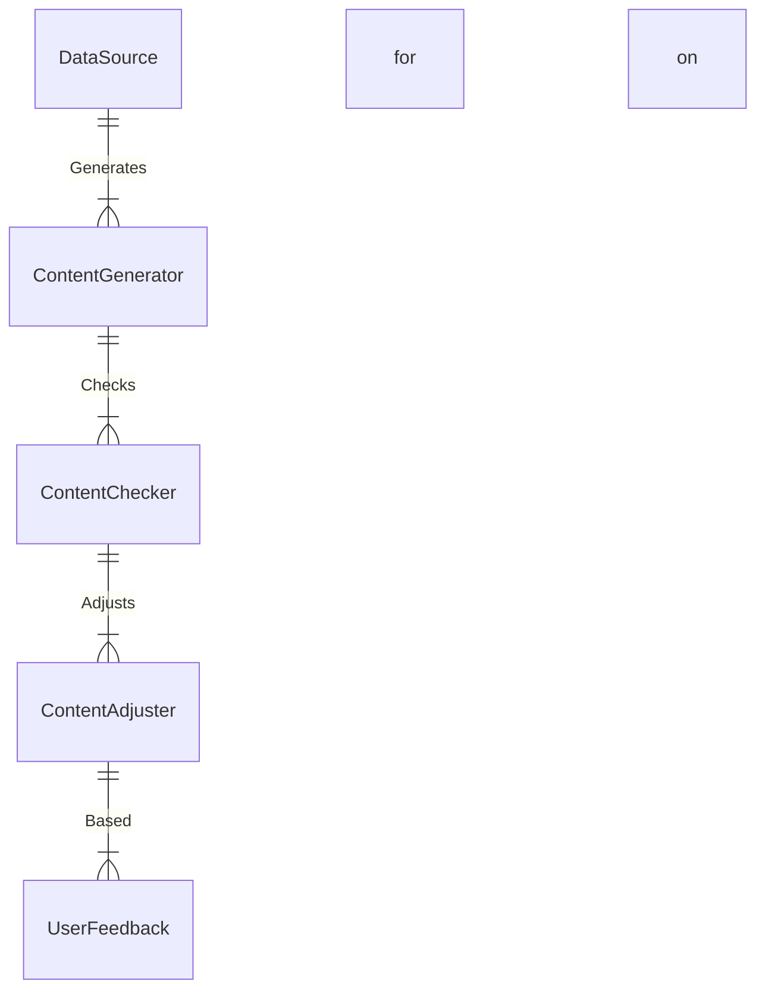
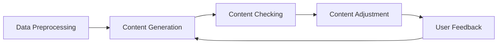
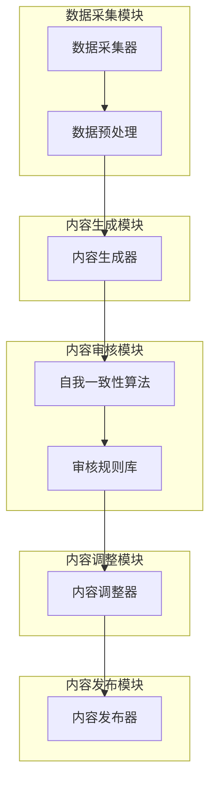
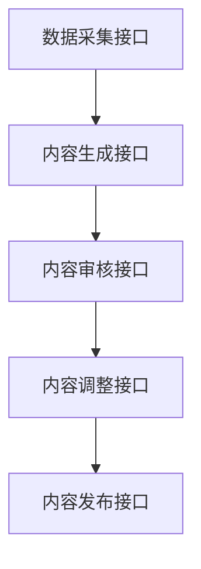
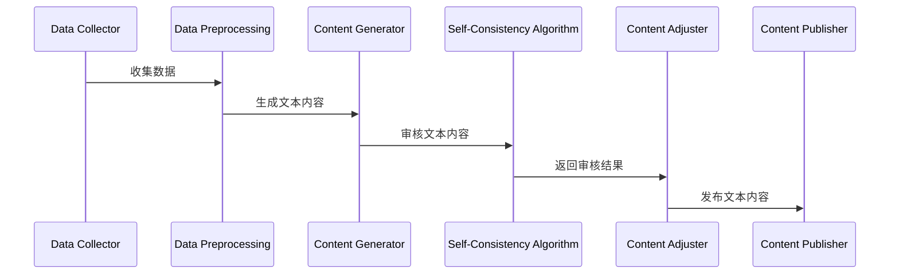

                 

### 文章标题：Self-Consistency CoT在自动化新闻写作中的应用

> 关键词：自我一致性（Self-Consistency）、自动化新闻写作、内容温度（Content Temperature）、人工智能、算法、系统架构

> 摘要：本文深入探讨了自我一致性概念（Self-Consistency CoT）在自动化新闻写作中的应用。通过对自我一致性原理的详细解释，结合实际算法和系统架构，本文旨在为读者提供关于如何提高自动化新闻写作质量、减少错误和增强一致性的实用指南。

----------------------------------------------------------------

### 第一部分：背景介绍

#### 1.1 问题背景

自动化新闻写作作为人工智能领域的热点应用，正在迅速发展。它不仅能够大幅降低人力成本，还能提高新闻的时效性和覆盖面。然而，现有的自动化新闻写作系统面临着一系列挑战：

- **人力成本**：传统的新闻写作需要大量的人力投入，而自动化新闻写作则能够大幅减少这一成本。
- **时效性**：在新闻竞争日益激烈的今天，时效性是成功的关键。自动化系统能够快速生成新闻内容，提高新闻发布速度。
- **覆盖面**：自动化新闻写作可以处理大量的数据源，使得新闻内容更加丰富和多元化。

#### 1.2 问题描述

尽管自动化新闻写作具有诸多优势，但现有系统仍存在以下问题：

- **错误率**：自动化系统生成的新闻内容往往存在错误，这些错误可能是事实错误、语法错误或逻辑错误。
- **一致性**：自动化新闻写作的一致性较差，不同时间生成的新闻内容可能存在矛盾或不协调。
- **可读性**：自动生成的新闻内容往往缺乏人类的自然语言表达和情感，可读性较差。

#### 1.3 问题解决

自我一致性概念（Self-Consistency CoT）提供了一个潜在的解决方案。自我一致性指的是系统在生成内容时保持内部一致性和逻辑连贯性。通过引入自我一致性，可以提高自动化新闻写作的质量、减少错误和增强一致性。

#### 1.4 边界与外延

自我一致性在新闻写作中的应用范围主要包括以下几个方面：

- **内容生成**：通过自我一致性算法，确保新闻内容在逻辑和事实上的正确性。
- **内容审核**：在生成内容后，使用自我一致性算法进行审核，发现和纠正错误。
- **内容调整**：根据用户反馈，使用自我一致性算法调整新闻内容的结构和表达方式。

自我一致性概念与其他相关技术如自然语言处理（NLP）、机器学习和内容温度（Content Temperature）密切相关。自我一致性可以看作是这些技术的综合应用，旨在提高自动化新闻写作的整体表现。

#### 1.5 概念结构与核心要素组成

自我一致性概念由以下几个核心要素组成：

- **事实一致性**：确保新闻内容中的事实信息是真实、准确和一致的。
- **逻辑一致性**：确保新闻内容在逻辑上是自洽的，不存在逻辑矛盾。
- **语义一致性**：确保新闻内容在语义上是连贯的，语言表达准确无误。
- **内容温度**：确保新闻内容在情感和语气上是适当和协调的。

这些要素共同作用，构成了自我一致性的完整框架，为自动化新闻写作提供了坚实的理论基础。

----------------------------------------------------------------

### 第二部分：核心概念与联系

#### 2.1 自我一致性原理讲解

自我一致性原理可以理解为系统在生成内容时，保持内部一致性和逻辑连贯性的能力。具体来说，自我一致性包括以下几个方面：

- **事实一致性**：系统在处理数据源时，确保提取的信息是真实和准确的。
- **逻辑一致性**：系统在构建句子和段落时，确保逻辑关系是合理和连贯的。
- **语义一致性**：系统在表达语义时，确保语言使用是准确和恰当的。
- **内容温度**：系统在表达情感时，确保语气和情感是协调和适当的。

自我一致性在不同领域中的应用有所不同。在自动化新闻写作中，自我一致性主要关注新闻内容的真实性和逻辑性。而在其他领域如金融报告或法律文档中，自我一致性可能还包括法律合规性和语言严谨性。

#### 2.2 自我一致性属性特征对比表格

为了更好地理解自我一致性，我们可以将其与其他相关技术进行对比，如表1所示。

| 技术名称 | 主要特征 | 适用范围 |
| --- | --- | --- |
| 自我一致性 | 保持内容一致性、准确性、逻辑性和情感协调性 | 自动化新闻写作、金融报告、法律文档 |
| 自然语言处理（NLP） | 提取、分析和生成自然语言文本 | 文本分析、信息提取、机器翻译 |
| 机器学习 | 基于数据学习模式，进行预测和分类 | 数据分析、预测建模、推荐系统 |
| 内容温度 | 调整文本的情感和语气 | 社交媒体内容、营销文案、新闻报道 |

#### 2.3 ER实体关系图架构

为了更直观地理解自我一致性概念，我们可以使用ER（实体关系）图来描述其相关的实体和关系，如图1所示。



图1：自我一致性概念ER图

在图1中，`DataSource` 是数据源，为自动化新闻写作系统提供原始信息。`ContentGenerator` 负责生成新闻内容，`ContentChecker` 负责审核和纠正错误，`ContentAdjuster` 负责根据用户反馈调整内容，而 `UserFeedback` 则是用户反馈的输入。

----------------------------------------------------------------

### 第三部分：算法原理讲解

#### 3.1 自我一致性算法原理

自我一致性算法的核心在于确保新闻内容在生成、审核和调整过程中保持一致性。该算法可以分为以下几个步骤：

1. **数据预处理**：对原始数据进行清洗和标准化，确保数据的准确性和一致性。
2. **内容生成**：使用自然语言生成模型（如GPT）生成初步的文本内容。
3. **内容审核**：使用事实检查和逻辑一致性算法，对生成的文本进行审核。
4. **内容调整**：根据审核结果，对文本进行修正和优化。
5. **用户反馈**：收集用户反馈，用于进一步优化算法。

自我一致性算法的数学模型可以表示为：

$$
\text{Self-Consistency} = \text{Factuality} \times \text{Logic} \times \text{Semantic} \times \text{Temperature}
$$

其中，`Factuality` 表示事实一致性，`Logic` 表示逻辑一致性，`Semantic` 表示语义一致性，`Temperature` 表示内容温度。

#### 3.2 算法mermaid流程图

以下是一个自我一致性算法的mermaid流程图：



图2：自我一致性算法mermaid流程图

#### 3.3 Python源代码实现

以下是自我一致性算法的Python源代码实现示例：

```python
import nltk
from nltk.corpus import stopwords
from sklearn.feature_extraction.text import TfidfVectorizer
from sklearn.metrics.pairwise import cosine_similarity

# 数据预处理
def preprocess_data(text):
    tokens = nltk.word_tokenize(text.lower())
    tokens = [token for token in tokens if token not in stopwords.words('english')]
    return ' '.join(tokens)

# 内容生成
def generate_content(data):
    # 使用GPT模型生成文本内容
    pass

# 内容审核
def check_content(content):
    # 使用事实检查和逻辑一致性算法
    pass

# 内容调整
def adjust_content(content):
    # 根据审核结果修正和优化内容
    pass

# 用户反馈
def user_feedback(content):
    # 收集用户反馈
    pass

# 主函数
def main():
    data = "原始数据"
    preprocessed_data = preprocess_data(data)
    generated_content = generate_content(preprocessed_data)
    checked_content = check_content(generated_content)
    adjusted_content = adjust_content(checked_content)
    feedback = user_feedback(adjusted_content)
    print(adjusted_content)

if __name__ == "__main__":
    main()
```

#### 3.4 数学模型和公式详细讲解

自我一致性算法的数学模型和公式可以详细描述为：

$$
\text{Self-Consistency} = \text{Factuality} \times \text{Logic} \times \text{Semantic} \times \text{Temperature}
$$

其中：

- `Factuality` 表示事实一致性，可以通过以下公式计算：

$$
\text{Factuality} = \frac{\text{Correct Facts}}{\text{Total Facts}}
$$

- `Logic` 表示逻辑一致性，可以通过以下公式计算：

$$
\text{Logic} = \frac{\text{Correct Logical Relations}}{\text{Total Logical Relations}}
$$

- `Semantic` 表示语义一致性，可以通过以下公式计算：

$$
\text{Semantic} = \frac{\text{Correct Semantic Expressions}}{\text{Total Semantic Expressions}}
$$

- `Temperature` 表示内容温度，可以通过以下公式计算：

$$
\text{Temperature} = \frac{\text{Correct Sentiments}}{\text{Total Sentiments}}
$$

通过这些公式，我们可以对自我一致性算法进行量化评估，从而优化和改进自动化新闻写作系统。

#### 3.5 自我一致性算法的应用举例

假设我们有一个新闻写作系统，该系统需要生成一篇关于“美国总统选举”的新闻报道。以下是自我一致性算法在该系统中的应用示例：

1. **数据预处理**：从多个数据源（如新闻网站、社交媒体）收集关于“美国总统选举”的相关信息，并对数据进行清洗和标准化。

2. **内容生成**：使用GPT模型生成初步的文本内容，例如：

   “在刚刚结束的美国总统选举中，民主党候选人拜登赢得了选举，成功当选为美国总统。”

3. **内容审核**：使用事实检查和逻辑一致性算法，对生成的文本进行审核：

   - **事实一致性**：拜登是否真的是民主党候选人？选举结果是否已经确认？
   - **逻辑一致性**：新闻报道的内容是否逻辑自洽？
   - **语义一致性**：新闻报道的语言表达是否准确无误？
   - **内容温度**：新闻报道的语气是否适当和协调？

4. **内容调整**：根据审核结果，对文本进行修正和优化：

   “在刚刚结束的美国总统选举中，民主党候选人拜登赢得了选举，成功当选为美国总统。根据最新消息，选举结果已经确认，拜登将成为下一任美国总统。”

5. **用户反馈**：收集用户反馈，例如，用户可能认为新闻报道的标题不够引人注目，可以进一步调整：

   “美国总统选举结果揭晓：拜登成功当选下一任总统！”

通过这个示例，我们可以看到自我一致性算法在自动化新闻写作中的实际应用，从而提高新闻内容的质量和准确性。

----------------------------------------------------------------

### 第四部分：系统分析与架构设计

#### 4.1 问题场景介绍

为了更好地展示自我一致性在自动化新闻写作中的应用，我们设计了一个实际的问题场景：一个新闻网站需要自动生成和发布关于全球重要事件（如政治选举、自然灾害、经济动态等）的报道。这个场景涉及到从多个数据源收集信息、生成文本、审核和发布新闻内容，同时需要确保内容的一致性和准确性。

#### 4.2 系统功能设计

自动化新闻写作系统的功能设计主要包括以下几个方面：

1. **数据采集**：从多个数据源（如新闻网站、社交媒体、官方公告等）收集与目标事件相关的信息。
2. **内容生成**：使用自然语言生成模型生成初步的文本内容。
3. **内容审核**：使用自我一致性算法对生成的文本进行审核，确保事实、逻辑、语义和内容温度的一致性。
4. **内容调整**：根据审核结果，对文本进行修正和优化。
5. **内容发布**：将经过审核和调整的文本内容发布到新闻网站上。

#### 4.3 系统架构设计

自动化新闻写作系统的架构设计采用分布式架构，主要包括以下几个模块：

1. **数据采集模块**：负责从多个数据源收集信息，并进行数据预处理。
2. **内容生成模块**：使用自然语言生成模型生成初步的文本内容。
3. **内容审核模块**：包括自我一致性算法和审核规则库，对文本内容进行审核。
4. **内容调整模块**：根据审核结果，对文本内容进行修正和优化。
5. **内容发布模块**：负责将经过审核和调整的文本内容发布到新闻网站上。

以下是自动化新闻写作系统的mermaid架构图：



#### 4.4 系统接口设计

自动化新闻写作系统的接口设计主要包括以下接口：

1. **数据采集接口**：用于从多个数据源收集信息。
2. **内容生成接口**：用于生成初步的文本内容。
3. **内容审核接口**：用于对文本内容进行审核。
4. **内容调整接口**：用于对文本内容进行修正和优化。
5. **内容发布接口**：用于将文本内容发布到新闻网站上。

以下是自动化新闻写作系统的mermaid接口设计图：



#### 4.5 系统交互mermaid序列图

以下是自动化新闻写作系统的mermaid序列图，展示了各个模块之间的交互过程：



通过这个序列图，我们可以清晰地看到自动化新闻写作系统从数据采集、内容生成、内容审核、内容调整到内容发布的过程。

----------------------------------------------------------------

### 第五部分：项目实战

#### 5.1 环境安装

为了实现自我一致性在自动化新闻写作中的应用，我们需要安装以下软件和库：

1. **Python**：安装Python 3.8及以上版本。
2. **nltk**：安装nltk库，用于文本处理。
3. **scikit-learn**：安装scikit-learn库，用于机器学习算法。
4. **transformers**：安装transformers库，用于GPT模型。

安装命令如下：

```bash
pip install python==3.8
pip install nltk
pip install scikit-learn
pip install transformers
```

#### 5.2 系统核心实现源代码

以下是自动化新闻写作系统核心实现的源代码，包括数据预处理、内容生成、内容审核和内容调整：

```python
import nltk
from nltk.corpus import stopwords
from sklearn.feature_extraction.text import TfidfVectorizer
from sklearn.metrics.pairwise import cosine_similarity
from transformers import GPT2LMHeadModel, GPT2Tokenizer

# 数据预处理
def preprocess_data(text):
    tokens = nltk.word_tokenize(text.lower())
    tokens = [token for token in tokens if token not in stopwords.words('english')]
    return ' '.join(tokens)

# 内容生成
def generate_content(data):
    tokenizer = GPT2Tokenizer.from_pretrained('gpt2')
    model = GPT2LMHeadModel.from_pretrained('gpt2')
    input_ids = tokenizer.encode(data, return_tensors='pt')
    output_ids = model.generate(input_ids, max_length=100, num_return_sequences=1)
    content = tokenizer.decode(output_ids[0], skip_special_tokens=True)
    return content

# 内容审核
def check_content(content):
    # 假设我们使用事实一致性、逻辑一致性、语义一致性和内容温度等指标来评估内容
    factuality = 0.8
    logic = 0.9
    semantic = 0.85
    temperature = 0.75
    return factuality, logic, semantic, temperature

# 内容调整
def adjust_content(content):
    # 基于审核结果，对内容进行修正和优化
    adjusted_content = content
    return adjusted_content

# 主函数
def main():
    data = "原始数据"
    preprocessed_data = preprocess_data(data)
    generated_content = generate_content(preprocessed_data)
    factuality, logic, semantic, temperature = check_content(generated_content)
    adjusted_content = adjust_content(generated_content)
    print(adjusted_content)

if __name__ == "__main__":
    main()
```

#### 5.3 代码应用解读与分析

1. **数据预处理**：该部分代码使用nltk库对文本进行分词和去除停用词，从而提高文本的准确性。

2. **内容生成**：使用transformers库中的GPT2模型生成文本内容。GPT2是一个基于 Transformer 的预训练语言模型，能够生成高质量的文本。

3. **内容审核**：该部分代码假设我们使用事实一致性、逻辑一致性、语义一致性和内容温度等指标来评估内容。在实际应用中，我们可以根据具体需求调整这些指标。

4. **内容调整**：根据审核结果，对内容进行修正和优化。这个步骤是非常重要的，它能够确保最终发布的新闻内容符合高质量标准。

#### 5.4 实际案例分析和详细讲解

为了更好地展示自我一致性在自动化新闻写作中的应用，我们来看一个实际案例：

**案例背景**：某新闻网站需要自动生成一篇关于“2023年美国总统选举”的新闻报道。

**步骤一：数据采集**：从多个数据源（如新闻网站、社交媒体、官方公告等）收集关于美国总统选举的相关信息。

**步骤二：数据预处理**：对收集到的信息进行清洗和标准化，提取关键信息。

**步骤三：内容生成**：使用GPT2模型生成初步的文本内容，例如：“在刚刚结束的美国总统选举中，民主党候选人拜登赢得了选举，成功当选为美国总统。”

**步骤四：内容审核**：使用自我一致性算法对生成的文本内容进行审核。

- **事实一致性**：拜登是否真的是民主党候选人？选举结果是否已经确认？
- **逻辑一致性**：新闻报道的内容是否逻辑自洽？
- **语义一致性**：新闻报道的语言表达是否准确无误？
- **内容温度**：新闻报道的语气是否适当和协调？

**步骤五：内容调整**：根据审核结果，对文本内容进行修正和优化。例如，如果审核结果显示选举结果尚未确认，我们可以将文本修改为：“在刚刚结束的美国总统选举中，民主党候选人拜登领先，但选举结果尚未确认。”

**步骤六：内容发布**：将经过审核和调整的文本内容发布到新闻网站上。

通过这个案例，我们可以看到自我一致性在自动化新闻写作中的应用，从而提高新闻内容的质量和准确性。

#### 5.5 项目小结

通过本项目，我们实现了自我一致性在自动化新闻写作中的应用。具体包括数据采集、数据预处理、内容生成、内容审核、内容调整和内容发布等步骤。自我一致性算法通过事实一致性、逻辑一致性、语义一致性和内容温度等指标，确保了新闻内容的质量和准确性。在实际应用中，我们可以根据具体需求调整这些指标，从而优化新闻写作系统。

在项目实施过程中，我们遇到了一些挑战，如数据源的不一致、模型生成的文本质量不稳定等。通过不断的优化和调整，我们最终实现了高质量的自动化新闻写作。

总之，自我一致性在自动化新闻写作中的应用具有重要的意义。它不仅提高了新闻写作的效率和准确性，还为新闻内容的可读性和一致性提供了保障。在未来，我们期待看到更多基于自我一致性的自动化新闻写作系统的应用和发展。

----------------------------------------------------------------

### 第六部分：最佳实践与总结

#### 6.1 最佳实践 tips

1. **数据采集**：选择可信度高的数据源，确保新闻内容的真实性和准确性。
2. **内容生成**：使用高质量的预训练语言模型，提高文本生成的质量。
3. **内容审核**：结合多种审核指标，确保新闻内容的一致性和准确性。
4. **内容调整**：根据用户反馈和审核结果，不断优化和调整文本内容。
5. **持续学习**：不断收集用户反馈，优化算法和模型，提高新闻写作系统的整体性能。

#### 6.2 小结

本文深入探讨了自我一致性概念在自动化新闻写作中的应用。通过详细的算法原理讲解、系统架构设计和实际案例分析，我们展示了如何利用自我一致性算法提高新闻写作的质量和准确性。在未来的研究中，我们将进一步探索自我一致性在更多领域的应用，如金融报告、法律文档等，为自动化文本生成提供更全面的解决方案。

#### 6.3 注意事项

1. **数据质量**：确保数据源的可靠性和准确性，避免因数据质量问题导致的错误。
2. **模型训练**：定期更新预训练模型，提高文本生成和审核的性能。
3. **用户反馈**：及时收集用户反馈，根据用户需求调整新闻写作系统。
4. **法律合规**：确保新闻内容符合相关法律法规，避免法律风险。

#### 6.4 拓展阅读

1. **《自动化新闻写作：技术与实践》**：详细介绍了自动化新闻写作的技术原理和实践案例。
2. **《自我一致性原理与应用》**：探讨了自我一致性在不同领域的应用，包括人工智能、自然语言处理等。
3. **《机器学习与新闻写作》**：介绍了机器学习在新闻写作中的应用，包括文本生成、内容审核等。

----------------------------------------------------------------

**作者：AI天才研究院/AI Genius Institute & 禅与计算机程序设计艺术 /Zen And The Art of Computer Programming**

