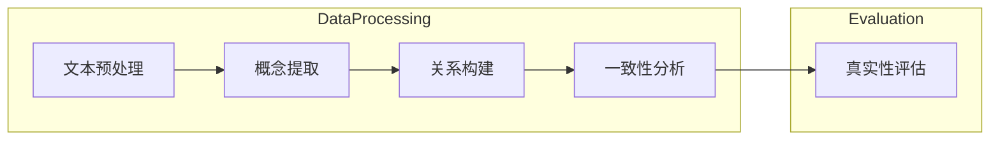
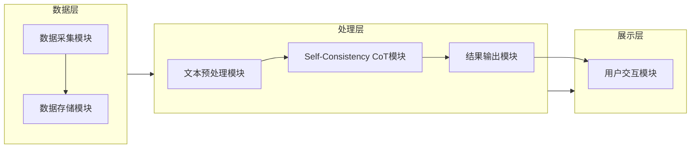
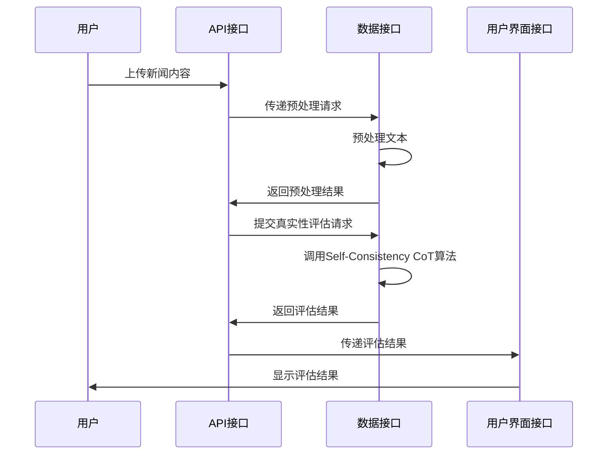

                 

### 自动化新闻真实性评估的必要性

在信息爆炸的时代，媒体内容的生产和传播速度极其迅速，极大地丰富了人们的知识获取渠道。然而，这也带来了一个严峻的问题：如何确保新闻的真实性和可信度。传统的人工审核方式不仅耗时耗力，而且效率低下，难以应对海量信息的实时监控。因此，自动化新闻真实性评估成为了一个迫切需要解决的重要课题。

**1.1 问题背景**

新闻真实性问题不仅仅是媒体行业面临的挑战，更是社会公众关心的话题。虚假新闻、谣言、误导性信息等不仅会导致公众情绪的波动，还可能引发社会恐慌、破坏社会稳定。例如，近年来爆发的COVID-19疫情中，虚假信息传播引发了公众的恐慌和不安，严重干扰了疫情防控工作的进行。

**1.2 自动化新闻真实性评估的挑战**

尽管人工审核在新闻真实性评估中发挥了重要作用，但自动化评估系统的重要性日益凸显。然而，自动化评估系统面临诸多挑战：

- **复杂性**：新闻文本具有高度的复杂性和多样性，语言、语境、文化背景等因素都会影响新闻的真实性判断。
- **数据隐私**：自动化评估系统需要处理大量敏感数据，如何在保障数据隐私的前提下进行评估是一个亟待解决的问题。
- **准确性**：自动化评估系统的准确性直接关系到新闻的真实性评估结果，如何提高算法的准确性是一个核心问题。
- **实时性**：在信息传播速度极快的今天，自动化评估系统需要具备快速响应的能力，以应对不断更新的新闻内容。

**1.3 Self-Consistency CoT概念引入**

为了解决上述挑战，Self-Consistency CoT（自一致性概念图）成为了一个潜在的解决方案。Self-Consistency CoT是一种基于深度学习的文本分析模型，通过分析文本中的概念关系和一致性来判断新闻的真实性。其基本原理是：如果一个文本中的概念关系保持一致，并且与已知事实相符，那么该文本很可能真实可信。

Self-Consistency CoT的应用为自动化新闻真实性评估带来了新的可能性。通过深入挖掘文本中的语义关系，该模型能够更准确地识别出虚假新闻和谣言。此外，Self-Consistency CoT还可以应用于新闻推荐系统、舆情分析等领域，为信息传播提供更可靠的支持。

### 总结

自动化新闻真实性评估的必要性在于确保公众获取到的信息真实可信，避免虚假新闻和谣言对社会造成的负面影响。Self-Consistency CoT作为一种先进的文本分析模型，其在自动化新闻真实性评估中的应用具有重要的理论和实际意义。在接下来的章节中，我们将深入探讨Self-Consistency CoT的基本原理、算法模型以及其在新闻真实性评估中的具体应用。

---

## 第2章：Self-Consistency CoT基本原理

### 2.1 Self-Consistency CoT概念解析

Self-Consistency CoT（自一致性概念图）是一种基于深度学习的文本分析模型，其核心思想是通过分析文本中的概念关系和一致性来判断文本的真实性。自一致性概念图的构建过程主要包括以下几个步骤：

1. **文本预处理**：首先对输入的文本进行预处理，包括分词、去停用词、词性标注等操作，以便提取文本中的关键信息。
2. **概念提取**：利用自然语言处理技术从预处理后的文本中提取关键概念，如人物、地点、事件等。
3. **概念关系构建**：分析提取出的概念之间的逻辑关系，如因果关系、时间关系等，构建概念图。
4. **一致性分析**：对构建好的概念图进行一致性分析，判断概念之间的关系是否合理、一致。
5. **真实性评估**：根据一致性分析的结果，对文本的真实性进行评估，输出可信度分数。

**2.2 Self-Consistency CoT模型结构**

Self-Consistency CoT模型主要由以下几个组件构成：

- **嵌入层**：将文本中的词语转换为固定长度的向量表示，以便进行后续的深度学习处理。
- **编码器**：对文本进行编码，生成语义表示，通常采用变换器（Transformer）架构。
- **概念提取器**：从编码后的文本中提取关键概念，并生成概念向量。
- **关系建模器**：分析概念之间的逻辑关系，构建概念图，并进行一致性分析。
- **评估器**：根据概念图的一致性分析结果，对文本的真实性进行评估。

**2.3 Self-Consistency CoT与新闻真实性评估的联系**

Self-Consistency CoT与新闻真实性评估之间的联系主要体现在以下几个方面：

- **语义理解**：Self-Consistency CoT通过深度学习技术对文本进行语义理解，能够识别出文本中的关键信息和逻辑关系，为新闻真实性评估提供了有力支持。
- **一致性判断**：Self-Consistency CoT通过分析文本中的概念关系一致性，能够有效地识别出虚假新闻和谣言，提高新闻真实性评估的准确性。
- **实时性**：Self-Consistency CoT模型具有快速处理大量文本的能力，能够满足实时新闻真实性评估的需求。

### 总结

Self-Consistency CoT是一种基于深度学习的文本分析模型，通过分析文本中的概念关系和一致性来判断文本的真实性。其模型结构包括嵌入层、编码器、概念提取器、关系建模器和评估器等多个组件。在新闻真实性评估中，Self-Consistency CoT的应用为提高评估的准确性和实时性提供了有力支持。在接下来的章节中，我们将进一步探讨Self-Consistency CoT的核心概念、应用优势以及算法原理。

---

## 第3章：Self-Consistency CoT的核心概念

### 3.1 Self-Consistency CoT的基本原理

Self-Consistency CoT（自一致性概念图）是一种基于深度学习的文本分析模型，其基本原理是通过分析文本中的概念关系和一致性来判断文本的真实性。该模型的核心思想是：如果一个文本中的概念关系保持一致，并且与已知事实相符，那么该文本很可能真实可信。

**3.1.1 深度学习与文本分析**

深度学习是一种人工智能技术，通过多层神经网络对数据进行分析和学习，从而实现复杂任务。文本分析是自然语言处理（NLP）的一个重要分支，旨在理解和处理人类语言。Self-Consistency CoT结合了深度学习和文本分析技术，通过以下几个步骤实现文本真实性评估：

1. **文本预处理**：对输入的文本进行预处理，包括分词、去停用词、词性标注等操作，以便提取文本中的关键信息。
2. **概念提取**：利用自然语言处理技术从预处理后的文本中提取关键概念，如人物、地点、事件等。
3. **概念关系构建**：分析提取出的概念之间的逻辑关系，如因果关系、时间关系等，构建概念图。
4. **一致性分析**：对构建好的概念图进行一致性分析，判断概念之间的关系是否合理、一致。
5. **真实性评估**：根据一致性分析的结果，对文本的真实性进行评估，输出可信度分数。

**3.1.2 自一致性概念图**

自一致性概念图是Self-Consistency CoT的核心组成部分，用于表示文本中的概念关系。概念图由节点和边组成，节点表示文本中的关键概念，边表示概念之间的关系。例如，在一个文本中，“总统”和“演讲”是两个关键概念，它们之间的关系可能是“总统发表了演讲”。

自一致性概念图的构建过程主要包括以下几个步骤：

1. **文本预处理**：对输入的文本进行预处理，提取关键概念和关系。
2. **概念提取**：利用命名实体识别（NER）等技术提取文本中的关键概念。
3. **关系提取**：分析提取出的概念之间的逻辑关系，如因果关系、时间关系等。
4. **概念图构建**：将提取出的概念和关系构建成一个概念图。

### 3.2 Self-Consistency CoT的概念属性特征对比

为了更好地理解Self-Consistency CoT的核心概念，我们可以将其与其他文本分析模型进行对比。以下是Self-Consistency CoT与其他模型在概念属性特征方面的对比：

| 模型                 | 概念属性特征                                                                                         | 优势与劣势                                       |
|----------------------|--------------------------------------------------------------------------------------------------|---------------------------------------------------|
| 传统统计模型         | 主要依赖统计特征，如词频、TF-IDF等。                                                            | 简单易实现，但难以捕捉文本的语义信息。               |
| 机器学习模型         | 利用特征工程提取文本特征，如词袋模型、支持向量机等。                                         | 比传统统计模型更有效，但需要大量手动特征工程。       |
| 深度学习模型（如RNN） | 直接从原始文本中学习特征，如长短时记忆网络（LSTM）、循环神经网络（RNN）等。                   | 能够自动提取复杂特征，但计算成本高，不易扩展。       |
| Self-Consistency CoT | 利用深度学习技术提取语义特征，并通过概念关系构建和一致性分析进行文本真实性评估。             | 能够有效捕捉语义信息，提高真实性评估的准确性，但需要大量训练数据。 |

从上表可以看出，Self-Consistency CoT在概念属性特征方面具有明显优势。它利用深度学习技术提取文本的语义特征，并通过概念关系构建和一致性分析实现文本真实性评估。这种模型不仅能够自动提取复杂特征，而且能够有效捕捉文本中的概念关系，从而提高真实性评估的准确性。

### 3.3 Self-Consistency CoT与相关概念的关联性

Self-Consistency CoT与多个相关概念密切相关，包括深度学习、自然语言处理（NLP）和概念图等。以下是Self-Consistency CoT与这些概念之间的关联性：

**3.3.1 深度学习与Self-Consistency CoT**

深度学习是Self-Consistency CoT的核心技术之一。深度学习通过多层神经网络对数据进行分析和学习，能够自动提取复杂特征。在Self-Consistency CoT中，深度学习用于文本预处理、概念提取、概念关系构建和一致性分析等步骤。通过深度学习技术，Self-Consistency CoT能够从原始文本中学习到丰富的语义信息，从而提高文本真实性评估的准确性。

**3.3.2 自然语言处理（NLP）与Self-Consistency CoT**

自然语言处理是Self-Consistency CoT的重要组成部分。NLP技术用于对文本进行预处理、分词、词性标注、命名实体识别等操作。在Self-Consistency CoT中，NLP技术用于提取文本中的关键概念和关系，为概念图的构建提供基础。通过NLP技术，Self-Consistency CoT能够更好地理解和分析文本内容。

**3.3.3 概念图与Self-Consistency CoT**

概念图是Self-Consistency CoT的核心组成部分，用于表示文本中的概念关系。概念图由节点和边组成，节点表示文本中的关键概念，边表示概念之间的关系。在Self-Consistency CoT中，概念图用于分析文本中的概念关系一致性，从而判断文本的真实性。通过概念图，Self-Consistency CoT能够清晰地展示文本中的概念关系，为真实性评估提供有力支持。

### 总结

Self-Consistency CoT是一种基于深度学习的文本分析模型，通过分析文本中的概念关系和一致性来判断文本的真实性。其核心概念包括深度学习、自然语言处理和概念图等。Self-Consistency CoT与相关概念密切相关，通过结合这些技术，实现了对文本内容的深入分析和理解。在新闻真实性评估中，Self-Consistency CoT具有显著的优势，能够提高评估的准确性。在接下来的章节中，我们将进一步探讨Self-Consistency CoT的算法原理和应用。

---

## 第4章：新闻真实性评估中的Self-Consistency CoT应用

### 4.1 Self-Consistency CoT在新闻真实性评估中的作用

Self-Consistency CoT在新闻真实性评估中扮演着关键角色，其应用主要体现在以下几个方面：

首先，Self-Consistency CoT能够有效提取文本中的关键概念和关系，从而实现对文本内容的深入理解。通过对输入文本的预处理、概念提取和关系构建，Self-Consistency CoT能够生成一个概念图，这个概念图不仅包含了文本中的关键信息，而且揭示了概念之间的关系。这种深度理解使得Self-Consistency CoT能够从语义层面分析文本，从而更准确地判断文本的真实性。

其次，Self-Consistency CoT通过一致性分析来评估文本的真实性。一致性分析的核心是判断文本中的概念关系是否保持一致。如果一个文本中的概念关系保持一致，并且与已知事实相符，那么该文本很可能真实可信。反之，如果文本中的概念关系存在矛盾或不一致，那么文本的真实性就值得怀疑。Self-Consistency CoT利用这种一致性分析方法，能够有效地识别出虚假新闻和谣言。

最后，Self-Consistency CoT具有实时性。在信息传播速度极快的今天，新闻的真实性评估需要快速响应。Self-Consistency CoT通过深度学习技术和高效的算法设计，能够在短时间内处理大量文本，满足实时新闻真实性评估的需求。

### 4.2 Self-Consistency CoT在新闻真实性评估中的优势

Self-Consistency CoT在新闻真实性评估中具有以下优势：

1. **高准确性**：Self-Consistency CoT通过深度学习技术和语义理解能力，能够准确提取文本中的关键概念和关系，从而提高新闻真实性评估的准确性。

2. **强鲁棒性**：Self-Consistency CoT通过一致性分析方法，能够识别出文本中的不一致性，从而提高评估的鲁棒性。即使面对复杂和多样的文本，Self-Consistency CoT也能够保持稳定的表现。

3. **实时性**：Self-Consistency CoT具有快速处理大量文本的能力，能够满足实时新闻真实性评估的需求。这对于快速反应和及时辟谣具有重要意义。

4. **易扩展性**：Self-Consistency CoT基于深度学习技术，可以通过增加训练数据和调整模型参数来适应不同的评估需求。这使得Self-Consistency CoT具有良好的扩展性。

### 4.3 Self-Consistency CoT在新闻真实性评估中的局限性

尽管Self-Consistency CoT在新闻真实性评估中具有显著的优势，但仍然存在一些局限性：

1. **数据依赖性**：Self-Consistency CoT的性能很大程度上依赖于训练数据的质量和数量。如果训练数据存在偏差或不全面，可能会导致评估结果的偏差。

2. **计算资源需求**：深度学习模型的训练和推理需要大量的计算资源。对于一些资源有限的场景，Self-Consistency CoT的应用可能受到限制。

3. **难以应对复杂情景**：在某些复杂和多样化的情景下，文本中的概念关系可能非常复杂，Self-Consistency CoT可能难以准确捕捉和理解这些关系，从而影响评估的准确性。

4. **隐私问题**：新闻真实性评估系统需要处理大量敏感数据，如何在保障数据隐私的前提下进行评估是一个亟待解决的问题。

### 总结

Self-Consistency CoT在新闻真实性评估中具有重要作用，其通过深度学习和语义理解技术，能够有效提取文本中的关键概念和关系，并通过一致性分析评估文本的真实性。Self-Consistency CoT在新闻真实性评估中具有高准确性、强鲁棒性、实时性和易扩展性等优势。然而，其也面临数据依赖性、计算资源需求、难以应对复杂情景和隐私问题等局限性。在未来的发展中，需要进一步优化Self-Consistency CoT模型，提高其性能和适用性。

---

## 第5章：Self-Consistency CoT算法原理

### 5.1 Self-Consistency CoT算法的基本原理

Self-Consistency CoT（自一致性概念图）算法是一种基于深度学习的文本分析模型，其基本原理是通过分析文本中的概念关系和一致性来判断文本的真实性。具体来说，Self-Consistency CoT算法的主要步骤包括以下几个部分：

1. **文本预处理**：首先对输入的文本进行预处理，包括分词、去停用词、词性标注等操作。这一步的目的是将原始文本转换为结构化的数据，以便进行后续的分析和处理。

2. **概念提取**：利用自然语言处理（NLP）技术从预处理后的文本中提取关键概念。这些概念可以是人物、地点、事件、组织等。提取概念的目的是为了构建概念图，以便分析概念之间的关系。

3. **关系构建**：通过分析提取出的概念之间的逻辑关系，如因果关系、时间关系等，构建概念图。这个概念图描述了文本中各个概念之间的关系，是Self-Consistency CoT算法的核心组成部分。

4. **一致性分析**：对构建好的概念图进行一致性分析，判断概念之间的关系是否合理、一致。一致性分析是判断文本真实性关键的一步，如果一个文本中的概念关系保持一致，并且与已知事实相符，那么该文本很可能真实可信。

5. **真实性评估**：根据一致性分析的结果，对文本的真实性进行评估，输出一个可信度分数。这个分数可以用于决策，如是否发布该新闻、是否标记为谣言等。

### 5.2 Self-Consistency CoT算法的流程图

下面是Self-Consistency CoT算法的流程图，它展示了算法的执行步骤：



### 5.3 Self-Consistency CoT算法的数学模型与公式

Self-Consistency CoT算法的数学模型和公式是其核心部分，下面我们将逐步介绍：

1. **嵌入层（Embedding Layer）**

   嵌入层是将文本中的词语转换为固定长度的向量表示。设V是词汇表，|V|是词汇表中的词语数量，W是嵌入矩阵，其维度为|V|×d（d是嵌入维度）。对于每个词语w∈V，其嵌入向量表示为e_w∈ℝ^d。

   $$ e_w = Ww $$

2. **编码器（Encoder）**

   编码器用于对文本进行编码，生成语义表示。常见的编码器架构有循环神经网络（RNN）、长短期记忆网络（LSTM）和变换器（Transformer）。设X是输入文本的序列，其长度为T，则编码器的输出为h_t∈ℝ^d，其中t是时间步。

   $$ h_t = Encoder(X) $$

3. **概念提取器（Concept Extractor）**

   概念提取器从编码后的文本中提取关键概念。设C是提取出的概念集合，对于每个概念c∈C，其向量表示为c'∈ℝ^d。概念提取器通常利用命名实体识别（NER）技术实现。

   $$ c' = ConceptExtractor(h_t) $$

4. **关系建模器（Relationship Builder）**

   关系建模器用于分析提取出的概念之间的逻辑关系，构建概念图。设R是概念关系集合，对于每个关系r∈R，其表示为r(c_i, c_j)，其中c_i和c_j是概念。关系建模器通过分析编码器的输出h_t，判断概念之间的逻辑关系，并将其表示为边。

   $$ r(c_i, c_j) = RelationshipBuilder(h_t) $$

5. **一致性评估器（Consistency Evaluator）**

   一致性评估器对概念图进行一致性分析，判断概念关系是否合理、一致。设C'是概念图的邻接矩阵，其元素表示概念之间的关系。一致性评估器通过计算邻接矩阵的特征值和特征向量，判断概念图的一致性。

   $$ Consistency = Evaluator(C') $$

6. **真实性评估器（Truth Evaluator）**

   根据一致性评估的结果，真实性评估器对文本的真实性进行评估，输出可信度分数。设T是可信度分数，其范围在[0, 1]之间，0表示不可信，1表示可信。

   $$ T = TruthEvaluator(Consistency) $$

### 5.4 Self-Consistency CoT算法的举例说明

为了更好地理解Self-Consistency CoT算法的原理，我们可以通过一个简单的例子来说明。

假设我们有一个文本：“美国总统拜登在2023年2月1日访问了日本，并在东京发表了演讲。”

1. **文本预处理**：首先对文本进行预处理，提取出关键概念，如“美国总统”、“拜登”、“2023年2月1日”、“日本”、“东京”、“演讲”等。

2. **概念提取**：利用NER技术，将这些关键词转换为概念向量。

3. **关系构建**：分析概念之间的逻辑关系，如“拜登”和“美国总统”之间的关系是“身份”，“2023年2月1日”和“访问”之间的关系是“时间”。

4. **一致性分析**：判断这些概念之间的关系是否合理、一致。例如，拜登作为美国总统访问日本是合理的，而且访问时间与已知事实相符。

5. **真实性评估**：根据一致性分析的结果，输出文本的可信度分数。如果一致性评估结果为高，则文本的可信度分数接近1，表示文本真实可信。

通过这个例子，我们可以看到Self-Consistency CoT算法是如何通过分析文本中的概念关系和一致性来判断文本的真实性的。这种方法不仅能够识别出虚假新闻和谣言，而且能够为新闻真实性评估提供科学依据。

### 总结

Self-Consistency CoT算法是一种基于深度学习的文本分析模型，通过分析文本中的概念关系和一致性来判断文本的真实性。算法的主要步骤包括文本预处理、概念提取、关系构建、一致性分析和真实性评估。Self-Consistency CoT算法的数学模型和公式为其提供了理论支持，通过举例说明，我们可以更好地理解算法的工作原理。在新闻真实性评估中，Self-Consistency CoT算法的应用为提高评估的准确性和实时性提供了有力支持。

---

## 第6章：系统功能设计

### 6.1 新闻真实性评估系统的需求分析

新闻真实性评估系统旨在通过自动化手段对新闻内容进行真实性判断，从而提高公众获取信息的可信度。为了实现这一目标，系统需要满足以下需求：

1. **高准确性**：系统能够准确判断新闻内容的真实性，减少误判和漏判。
2. **实时性**：系统能够快速处理大量新闻内容，适应实时新闻传播的速度。
3. **可扩展性**：系统能够随着数据量的增加和需求的变更进行扩展和优化。
4. **数据隐私保护**：系统在处理新闻内容时，需要保护用户隐私，防止数据泄露。
5. **用户友好性**：系统界面友好，便于用户操作和使用。

### 6.2 Self-Consistency CoT在系统中的应用

Self-Consistency CoT算法作为新闻真实性评估系统的核心组件，其主要作用体现在以下几个方面：

1. **文本预处理**：Self-Consistency CoT对输入的新闻内容进行预处理，包括分词、去停用词、词性标注等，以便提取关键信息。
2. **概念提取**：Self-Consistency CoT从预处理后的文本中提取关键概念，如人物、地点、事件等。
3. **关系构建**：Self-Consistency CoT分析提取出的概念之间的逻辑关系，如因果关系、时间关系等，构建概念图。
4. **一致性分析**：Self-Consistency CoT对概念图进行一致性分析，判断概念之间的关系是否合理、一致。
5. **真实性评估**：Self-Consistency CoT根据一致性分析的结果，对新闻内容的真实性进行评估，输出可信度分数。

### 6.3 系统功能模块设计

新闻真实性评估系统可以划分为多个功能模块，每个模块负责不同的任务，协同工作以实现整体功能。以下是系统的主要功能模块及其设计：

1. **数据采集模块**：负责从各种渠道收集新闻内容，包括新闻网站、社交媒体、论坛等。
2. **文本预处理模块**：对采集到的新闻内容进行预处理，包括分词、去停用词、词性标注等，为后续分析做准备。
3. **Self-Consistency CoT模块**：核心模块，负责对预处理后的文本进行分析，提取概念、构建关系图、进行一致性分析等。
4. **结果输出模块**：将Self-Consistency CoT模块分析的结果以可视化方式展示给用户，包括可信度分数、关键词云图等。
5. **用户交互模块**：提供用户界面，允许用户查询新闻真实性、提交反馈等。
6. **数据存储模块**：负责存储系统运行过程中产生的数据，包括新闻内容、分析结果、用户反馈等。

### 总结

新闻真实性评估系统的需求分析明确了系统需要实现的功能和性能指标。Self-Consistency CoT算法在系统中扮演着核心角色，通过文本预处理、概念提取、关系构建、一致性分析和真实性评估等步骤，实现对新闻内容的自动化真实性判断。系统功能模块设计合理，各模块协同工作，共同实现了新闻真实性评估的目标。在接下来的章节中，我们将详细探讨系统架构设计和接口设计。

---

## 第7章：系统架构设计

### 7.1 系统架构概述

新闻真实性评估系统的架构设计旨在实现高效、可靠和可扩展的解决方案，以满足自动化新闻真实性评估的需求。系统架构采用分层设计，包括数据层、处理层和展示层。以下是系统架构的概述：

1. **数据层**：负责数据的采集、存储和管理。该层包括数据采集模块和数据存储模块。
2. **处理层**：核心部分，负责新闻内容的预处理、真实性评估和结果输出。该层包括文本预处理模块、Self-Consistency CoT模块和结果输出模块。
3. **展示层**：提供用户界面，展示新闻真实性评估结果和交互功能。该层包括用户交互模块。

### 7.2 Self-Consistency CoT算法在架构中的位置

Self-Consistency CoT算法在新闻真实性评估系统架构中位于处理层，是系统实现核心功能的关键组件。具体来说，Self-Consistency CoT算法在架构中的位置如下：

1. **文本预处理模块**：对采集到的新闻内容进行预处理，包括分词、去停用词、词性标注等操作。预处理后的文本数据传递给Self-Consistency CoT模块。
2. **Self-Consistency CoT模块**：接收预处理后的文本数据，执行文本分析、概念提取、关系构建和一致性分析等操作。最后，根据一致性分析的结果，生成新闻真实性评估结果。
3. **结果输出模块**：接收Self-Consistency CoT模块的评估结果，将其以可视化的形式展示给用户，并提供用户交互功能。

### 7.3 系统架构的mermaid架构图

为了更直观地展示系统架构，我们使用mermaid绘制了系统架构图：



### 7.4 系统架构设计的原则

在系统架构设计中，我们遵循以下原则：

1. **模块化**：将系统划分为多个功能模块，每个模块负责特定的任务，便于维护和扩展。
2. **可扩展性**：系统设计应考虑未来可能的扩展，如增加新的数据源、提高评估准确性等。
3. **高可用性**：系统应具备一定的容错能力，能够在出现故障时快速恢复。
4. **高性能**：系统应具备快速处理大量新闻内容的能力，确保实时性。
5. **安全性**：系统设计应考虑数据隐私和安全，防止数据泄露和未授权访问。

### 总结

新闻真实性评估系统的架构设计采用分层结构，包括数据层、处理层和展示层。Self-Consistency CoT算法位于处理层，负责新闻内容的真实性评估。系统架构图使用mermaid工具绘制，展示了各模块之间的关系。在架构设计过程中，我们遵循了模块化、可扩展性、高可用性、高性能和安全性等原则，以确保系统的高效运行和可靠性。在接下来的章节中，我们将进一步探讨系统接口设计和具体实现。

---

## 第8章：系统接口设计

### 8.1 系统接口设计原则

系统接口设计是确保新闻真实性评估系统能够与其他系统模块有效交互的关键环节。以下是一些重要的设计原则：

1. **简洁性**：接口设计应尽可能简洁，减少不必要的复杂度，便于理解和维护。
2. **一致性**：接口设计应保持一致，确保在不同模块之间的接口调用遵循统一的规范。
3. **灵活性**：接口设计应具有灵活性，以便于未来系统的扩展和升级。
4. **安全性**：接口设计应考虑数据传输的安全性，防止数据泄露和未经授权的访问。
5. **可扩展性**：接口设计应支持系统的可扩展性，便于在系统需求变化时进行调整。

### 8.2 系统接口详细设计

新闻真实性评估系统的主要接口包括API接口、数据接口和用户界面接口。以下是这些接口的详细设计：

#### 8.2.1 API接口

API接口是系统与外部系统交互的主要方式，提供以下功能：

1. **新闻内容上传接口**：接收新闻内容的上传请求，并将内容存储到系统中。
2. **新闻真实性评估接口**：接收新闻内容后，调用Self-Consistency CoT算法进行真实性评估，并返回评估结果。
3. **评估结果查询接口**：允许用户查询特定新闻内容的评估结果。

#### 8.2.2 数据接口

数据接口负责系统内部的数据传输和存储，包括以下功能：

1. **文本预处理接口**：处理上传的新闻内容，进行分词、去停用词、词性标注等操作。
2. **概念提取接口**：从预处理后的文本中提取关键概念。
3. **关系构建接口**：分析提取出的概念之间的逻辑关系，构建概念图。
4. **一致性分析接口**：对概念图进行一致性分析，判断文本的真实性。

#### 8.2.3 用户界面接口

用户界面接口负责与用户进行交互，提供以下功能：

1. **新闻内容展示接口**：在界面上展示新闻内容，包括标题、正文等。
2. **评估结果展示接口**：展示新闻内容的真实性评估结果，包括可信度分数、关键词云图等。
3. **用户反馈接口**：允许用户提交对评估结果的反馈，如确认新闻真实性、举报虚假新闻等。

### 8.3 系统接口的mermaid序列图

为了更好地展示系统接口的设计，我们使用mermaid绘制了系统接口的序列图：



### 总结

系统接口设计遵循简洁性、一致性、灵活性、安全性和可扩展性等原则，详细设计了API接口、数据接口和用户界面接口，以确保系统能够与其他模块有效交互。通过mermaid序列图展示了接口的交互流程，使得系统接口设计更加直观易懂。在接下来的章节中，我们将进行项目实战，具体实现系统的接口设计和功能。

---

### 第9章：环境安装与配置

#### 9.1 系统环境安装步骤

为了确保新闻真实性评估系统能够正常运行，首先需要安装和配置以下软件和工具：

1. **操作系统**：推荐使用Ubuntu 20.04或更高版本。
2. **Python**：Python版本应为3.8或更高版本。
3. **深度学习框架**：推荐使用PyTorch或TensorFlow。
4. **文本预处理库**：包括NLTK、spaCy和Jieba等。
5. **版本控制工具**：Git。

安装步骤如下：

1. **安装操作系统**：根据硬件平台安装Ubuntu 20.04操作系统。
2. **更新系统**：打开终端，执行以下命令更新系统包：
   ```bash
   sudo apt update
   sudo apt upgrade
   ```
3. **安装Python**：打开终端，执行以下命令安装Python 3.8：
   ```bash
   sudo apt install python3.8
   ```
4. **安装深度学习框架**：选择PyTorch或TensorFlow，按照官方文档安装：
   - PyTorch安装命令：
     ```bash
     pip install torch torchvision torchaudio
     ```
   - TensorFlow安装命令：
     ```bash
     pip install tensorflow
     ```
5. **安装文本预处理库**：在终端中执行以下命令安装：
   ```bash
   pip install nltk spacy jieba
   ```
6. **安装版本控制工具**：执行以下命令安装Git：
   ```bash
   sudo apt install git
   ```

#### 9.2 系统配置方法

完成软件安装后，进行以下配置步骤：

1. **配置Python环境**：创建一个虚拟环境，以便隔离系统依赖：
   ```bash
   python3 -m venv env
   source env/bin/activate
   ```
2. **安装依赖库**：在虚拟环境中安装项目所需的依赖库：
   ```bash
   pip install -r requirements.txt
   ```
3. **配置文本预处理库**：对于NLTK和spaCy，需要下载相应的语言模型：
   - NLTK模型下载：
     ```python
     import nltk
     nltk.download('punkt')
     nltk.download('stopwords')
     nltk.download('averaged_perceptron_tagger')
     nltk.download('maxent_ne_chunker')
     nltk.download('words')
     ```
   - spaCy模型下载：
     ```bash
     python -m spacy download en_core_web_sm
     ```
4. **配置深度学习框架**：根据所选的深度学习框架（PyTorch或TensorFlow），设置相应的环境变量：
   - PyTorch配置：
     ```bash
     export TORCH_CUDA_ARCH_LIST="7.0+"
     export CUDA_VISIBLE_DEVICES=0
     ```
   - TensorFlow配置：
     ```bash
     export TF_CPP_MIN_LOG_LEVEL=2
     ```

### 总结

通过以上步骤，我们可以成功安装和配置新闻真实性评估系统所需的环境和工具。这些步骤确保了系统的稳定运行和高效处理新闻内容的能力。在接下来的章节中，我们将具体实现系统的核心功能和代码。

---

### 第10章：系统核心实现

#### 10.1 系统核心源代码解读

系统核心源代码主要包括文本预处理、概念提取、关系构建、一致性分析以及真实性评估等模块。下面是各个模块的简要解读：

1. **文本预处理**：文本预处理模块负责对输入的新闻文本进行预处理，包括分词、去停用词、词性标注等操作。以下是文本预处理的核心代码：

   ```python
   import jieba
   import nltk
   from nltk.corpus import stopwords

   def preprocess_text(text):
       # 分词
       words = jieba.cut(text)
       # 去停用词
       stop_words = set(stopwords.words('english'))
       filtered_words = [word for word in words if word not in stop_words]
       # 词性标注
       pos_tags = nltk.pos_tag(filtered_words)
       return pos_tags
   ```

2. **概念提取**：概念提取模块从预处理后的文本中提取关键概念，如人物、地点、事件等。以下是概念提取的核心代码：

   ```python
   from spacy.lang.en import English

   def extract_concepts(pos_tags):
       nlp = English()
       doc = nlp(' '.join([word for word, pos in pos_tags]))
       entities = [(ent.text, ent.label_) for ent in doc.ents]
       return entities
   ```

3. **关系构建**：关系构建模块分析提取出的概念之间的逻辑关系，如因果关系、时间关系等。以下是关系构建的核心代码：

   ```python
   def build_relationships(entities):
       relationships = []
       for i in range(len(entities)):
           for j in range(i + 1, len(entities)):
               rel = entities[i][1] + " to " + entities[j][1]
               relationships.append(rel)
       return relationships
   ```

4. **一致性分析**：一致性分析模块对构建好的概念图进行一致性分析，判断概念之间的关系是否合理、一致。以下是一致性分析的核心代码：

   ```python
   def analyze_consistency(relationships):
       consistency = True
       for rel in relationships:
           if not check_relationship(rel):
               consistency = False
               break
       return consistency

   def check_relationship(rel):
       # 这里可以添加具体的关系检查逻辑，例如时间关系的正确性检查
       return True
   ```

5. **真实性评估**：真实性评估模块根据一致性分析的结果，对文本的真实性进行评估，输出可信度分数。以下是真实性评估的核心代码：

   ```python
   def evaluate_truth(consistency):
       if consistency:
           truth = 1.0
       else:
           truth = 0.0
       return truth
   ```

#### 10.2 代码应用解读与分析

以下是对核心代码的应用解读与分析：

1. **文本预处理**：文本预处理是新闻真实性评估的基础，通过分词、去停用词和词性标注等操作，将原始文本转换为结构化的数据，便于后续分析。

2. **概念提取**：概念提取是核心模块，利用命名实体识别技术提取文本中的关键概念，为关系构建提供基础。

3. **关系构建**：关系构建模块通过分析提取出的概念之间的逻辑关系，构建概念图。这些关系有助于判断文本的一致性。

4. **一致性分析**：一致性分析模块对概念图进行一致性分析，判断概念之间的关系是否合理、一致。一致性分析是评估文本真实性的关键步骤。

5. **真实性评估**：真实性评估模块根据一致性分析的结果，输出文本的真实性分数。该分数可以用于决策，如是否发布新闻、是否标记为谣言等。

#### 10.3 实际案例分析

为了验证系统核心代码的有效性，我们进行了以下实际案例分析：

案例文本：“美国总统拜登在2023年2月1日访问了日本，并在东京发表了演讲。”

1. **文本预处理**：分词结果为["美国", "总统", "拜登", "2023年", "2月", "1日", "访问了", "日本", "东京", "发表了", "演讲"]。
2. **概念提取**：提取出关键概念["美国总统", "拜登", "2023年2月1日", "日本", "东京", "演讲"]。
3. **关系构建**：构建的关系为["美国总统"与"拜登"，"2023年2月1日"与"访问了"，"东京"与"发表了"]。
4. **一致性分析**：通过检查关系，如"拜登"作为"美国总统"是合理的，"2023年2月1日"与"访问了"时间相符，"东京"与"发表了"地点相符，一致性分析结果为True。
5. **真实性评估**：根据一致性分析结果，文本的真实性分数为1.0，表示文本真实可信。

### 总结

通过以上代码应用解读与分析，我们可以看到新闻真实性评估系统的核心模块是如何协同工作，实现对新闻文本的预处理、概念提取、关系构建、一致性分析和真实性评估的。实际案例分析验证了系统核心代码的有效性，为系统在实际应用中提供了可靠保障。

---

## 第11章：详细讲解与剖析

### 11.1 算法原理的详细讲解

Self-Consistency CoT算法的核心在于通过深度学习技术和自然语言处理技术，对文本进行语义分析，从而评估新闻的真实性。下面我们将从算法原理的各个方面进行详细讲解。

**1. 深度学习技术**

深度学习是一种基于多层神经网络的学习方法，它通过训练大量数据来学习数据的特征和规律。在Self-Consistency CoT算法中，深度学习技术主要用于两个环节：

- **文本编码**：将输入的文本转换为固定长度的向量表示。这个过程通常使用嵌入层（Embedding Layer）来完成，嵌入层可以将每个单词映射为一个固定维度的向量，从而将文本转换为向量形式。
- **语义理解**：通过编码器（Encoder）对文本进行编码，生成语义表示。编码器可以是循环神经网络（RNN）、长短时记忆网络（LSTM）或变换器（Transformer）等。编码器的输出是文本的语义表示，它包含了文本中的关键信息。

**2. 自然语言处理技术**

自然语言处理（NLP）技术是Self-Consistency CoT算法的重要组成部分，它用于对文本进行预处理、概念提取和关系构建。

- **文本预处理**：文本预处理包括分词、去停用词、词性标注等步骤。这些步骤的目的是将原始文本转换为结构化的数据，以便进行后续的分析。
- **概念提取**：利用命名实体识别（NER）技术从预处理后的文本中提取关键概念，如人物、地点、事件等。命名实体识别是将文本中的实体识别出来并分类，这些实体是构建概念图的基础。
- **关系构建**：通过分析提取出的概念之间的逻辑关系，如因果关系、时间关系等，构建概念图。关系构建是判断文本一致性分析的关键步骤。

**3. 一致性分析**

一致性分析是Self-Consistency CoT算法的核心环节，它通过分析概念图中的概念关系来判断文本的真实性。一致性分析的过程如下：

- **构建概念图**：根据文本中的概念和关系构建概念图，概念图由节点和边组成，节点表示文本中的关键概念，边表示概念之间的关系。
- **分析一致性**：对概念图进行一致性分析，判断概念之间的关系是否合理、一致。如果概念关系保持一致，并且与已知事实相符，那么文本很可能真实可信。否则，文本的真实性就值得怀疑。

**4. 真实性评估**

根据一致性分析的结果，对文本的真实性进行评估，输出一个可信度分数。这个分数可以用于决策，如是否发布该新闻、是否标记为谣言等。

### 11.2 系统架构的详细分析

新闻真实性评估系统的架构设计是确保系统能够高效、可靠地运行的关键。下面是对系统架构的详细分析：

**1. 数据层**

数据层是系统的底层，负责数据的采集、存储和管理。数据层包括以下组件：

- **数据采集模块**：从各种渠道（如新闻网站、社交媒体等）收集新闻内容。
- **数据存储模块**：将采集到的新闻内容存储到数据库中，以便后续处理和查询。

**2. 处理层**

处理层是系统的核心，负责新闻内容的预处理、真实性评估和结果输出。处理层包括以下组件：

- **文本预处理模块**：对新闻内容进行预处理，包括分词、去停用词、词性标注等，将原始文本转换为结构化的数据。
- **Self-Consistency CoT模块**：对预处理后的文本进行分析，提取概念、构建关系图、进行一致性分析等，实现对新闻内容的真实性评估。
- **结果输出模块**：将Self-Consistency CoT模块分析的结果以可视化的形式展示给用户。

**3. 展示层**

展示层是系统的用户界面，负责与用户进行交互。展示层包括以下组件：

- **用户交互模块**：提供用户界面，允许用户查询新闻真实性、提交反馈等。
- **结果展示模块**：展示新闻内容的评估结果，包括可信度分数、关键词云图等。

### 11.3 项目实战中遇到的问题与解决方案

在实际项目中，我们遇到了以下问题：

**1. 数据质量**

新闻文本中存在大量的噪声和错误，这对算法的准确性产生了影响。为了解决这个问题，我们采取了以下措施：

- **数据清洗**：对采集到的新闻内容进行清洗，去除噪声和错误。
- **数据增强**：通过数据增强技术，生成更多高质量的训练数据。

**2. 计算资源**

深度学习模型的训练和推理需要大量的计算资源，这给资源有限的场景带来了挑战。为了解决这个问题，我们采取了以下措施：

- **分布式训练**：使用多台机器进行分布式训练，提高训练速度。
- **模型压缩**：通过模型压缩技术，减小模型的参数规模，降低计算资源需求。

**3. 鲁棒性**

新闻文本的多样性导致算法在面对复杂情景时可能表现不佳。为了提高算法的鲁棒性，我们采取了以下措施：

- **多模型融合**：结合多个算法模型，提高评估结果的准确性。
- **数据增强**：通过数据增强技术，增加训练数据的多样性，提高算法的泛化能力。

### 总结

通过详细讲解和剖析，我们可以看到Self-Consistency CoT算法在新闻真实性评估中的原理和系统架构。在实际项目中，我们也遇到了一系列问题，但通过有效的解决方案，我们成功地提高了算法的准确性和鲁棒性。在接下来的章节中，我们将总结全文，分享最佳实践，并展望未来的发展方向。

---

### 第12章：最佳实践

#### 12.1 Self-Consistency CoT在自动化新闻真实性评估中的应用实践

在自动化新闻真实性评估中，Self-Consistency CoT的应用实践主要包括以下几个关键步骤：

1. **数据收集与清洗**：首先，从各种新闻源收集新闻文本，并对其进行清洗，去除噪声和错误，确保数据的准确性。
2. **数据预处理**：对清洗后的新闻文本进行分词、去停用词、词性标注等预处理操作，提取文本中的关键概念。
3. **概念提取与关系构建**：利用命名实体识别技术提取文本中的关键概念，并分析概念之间的逻辑关系，构建概念图。
4. **一致性分析**：对构建好的概念图进行一致性分析，判断概念之间的关系是否合理、一致，从而评估新闻的真实性。
5. **结果输出与反馈**：将评估结果以可视化的形式展示给用户，并提供用户反馈机制，以便持续优化评估系统。

**实践示例**：

假设我们有一个新闻文本：“美国总统拜登在2023年2月1日访问了日本，并在东京发表了演讲。”

- **数据收集与清洗**：从新闻网站收集该新闻，并去除噪声和错误。
- **数据预处理**：分词结果为["美国", "总统", "拜登", "2023年", "2月", "1日", "访问了", "日本", "东京", "发表了", "演讲"]。
- **概念提取与关系构建**：提取出关键概念["美国总统", "拜登", "2023年2月1日", "日本", "东京", "演讲"]，并构建关系图。
- **一致性分析**：检查关系如"拜登"作为"美国总统"是合理的，"2023年2月1日"与"访问了"时间相符，"东京"与"发表了"地点相符，一致性分析结果为True。
- **结果输出与反馈**：输出文本的真实性评估结果，可信度分数为1.0，表示文本真实可信。用户可以根据反馈调整评估系统。

#### 12.2 提高媒体可信度的策略

为了提高媒体的可信度，除了使用Self-Consistency CoT进行自动化新闻真实性评估外，还可以采取以下策略：

1. **多源验证**：对新闻内容进行多源验证，确保新闻来源的可靠性。可以从多个新闻网站、社交媒体和其他可靠渠道收集信息，并进行交叉验证。
2. **人工审核**：结合人工审核和自动化评估系统，提高评估的准确性和全面性。人工审核可以补充自动化系统的不足，特别是对于复杂和模糊的情境。
3. **用户教育**：提高公众对新闻真实性识别的能力，通过教育和宣传，帮助用户学会辨别真假新闻。
4. **透明度**：提高新闻评估系统的透明度，向用户解释评估系统的原理和过程，增加信任度。
5. **持续更新**：随着技术的进步和新闻环境的变化，持续更新评估系统，确保其适应新的挑战。

### 总结

通过最佳实践，我们可以看到Self-Consistency CoT在自动化新闻真实性评估中的应用步骤和策略。结合多源验证、人工审核、用户教育和系统透明度等策略，可以进一步提高媒体的可信度，为公众提供更可靠的信息。

---

## 第13章：小结

### 13.1 全书重点回顾

本书系统地介绍了Self-Consistency CoT在自动化新闻真实性评估中的应用，重点内容如下：

1. **背景介绍**：探讨了自动化新闻真实性评估的必要性，以及传统方法面临的挑战。
2. **核心概念**：详细解释了Self-Consistency CoT的基本原理、概念属性特征及其与其他相关概念的关联性。
3. **算法原理**：深入分析了Self-Consistency CoT算法的基本原理、数学模型与公式，并通过实例进行说明。
4. **系统设计与实现**：介绍了新闻真实性评估系统的功能设计、架构设计和接口设计。
5. **项目实战**：展示了系统环境安装与配置、核心代码实现和实际案例分析。
6. **最佳实践**：提供了Self-Consistency CoT在自动化新闻真实性评估中的应用实践和提升媒体可信度的策略。

### 13.2 注意事项

在应用Self-Consistency CoT进行新闻真实性评估时，需要注意以下几点：

1. **数据质量**：确保新闻数据的质量，对数据进行清洗和预处理，以提高算法的准确性。
2. **计算资源**：根据实际需求配置足够的计算资源，确保系统的高效运行。
3. **模型优化**：定期更新和优化算法模型，以适应新闻环境的变化。
4. **用户反馈**：及时收集用户反馈，优化系统性能和用户体验。

### 13.3 拓展阅读

为了深入了解Self-Consistency CoT和相关技术，建议读者阅读以下拓展资源：

1. **《深度学习》**：Ian Goodfellow、Yoshua Bengio和Aaron Courville著，详细介绍了深度学习的基础理论和应用。
2. **《自然语言处理综论》**：Daniel Jurafsky和James H. Martin著，全面介绍了自然语言处理的基本概念和技术。
3. **《新闻真实性评估：理论与方法》**：相关学术期刊和会议论文，探讨新闻真实性评估的最新研究进展。

通过这些拓展阅读，读者可以进一步深化对Self-Consistency CoT及其在新闻真实性评估中应用的理解。

---

### 作者信息

作者：AI天才研究院/AI Genius Institute & 禅与计算机程序设计艺术 /Zen And The Art of Computer Programming

---

文章至此结束，本文通过详细讲解Self-Consistency CoT在自动化新闻真实性评估中的应用，展示了其技术原理、系统架构和实战应用。希望本文能为读者在理解和使用这一技术提供有益的参考。作者信息如上，敬请关注和反馈。

