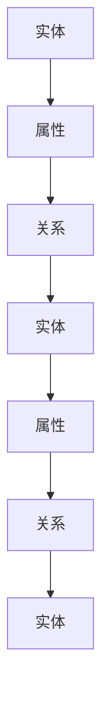
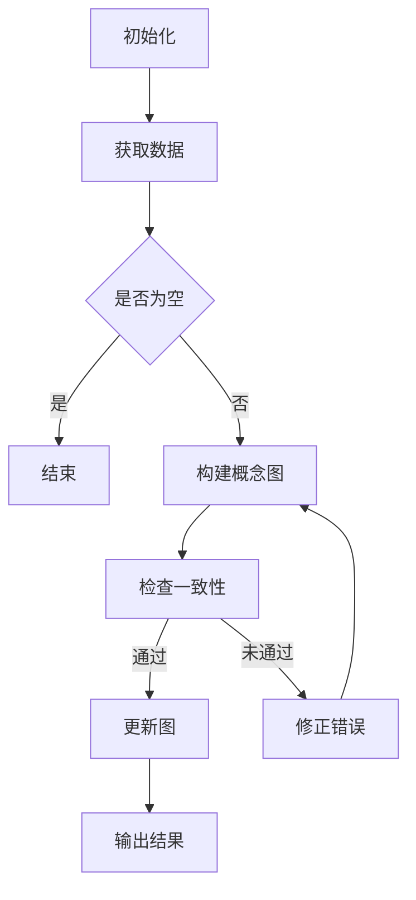
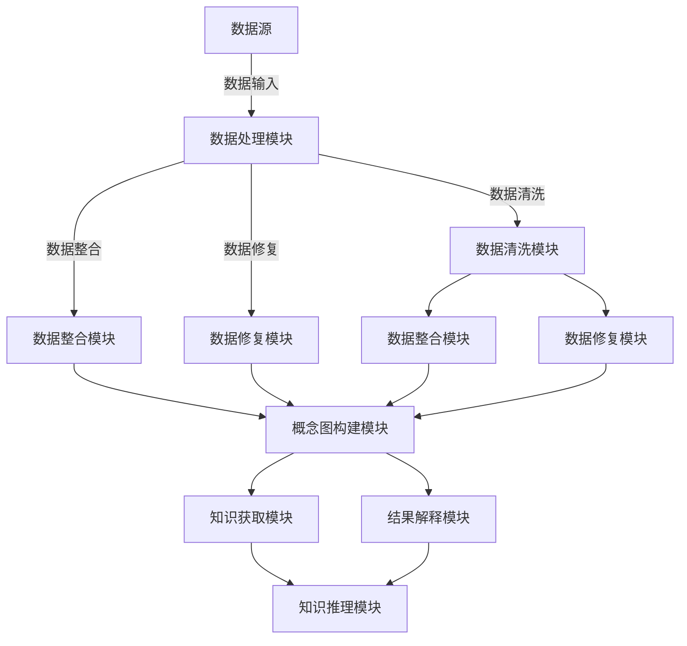
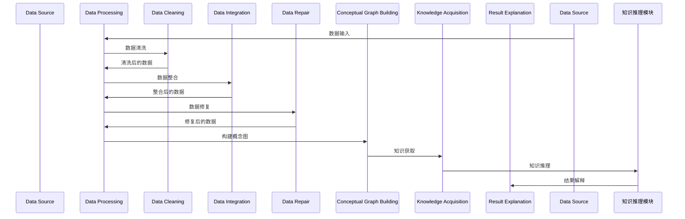

                 


### 第一部分：自我一致性概念图概述

#### 1.1 问题背景

**自我一致性概念图的定义与发展历程**

自我一致性概念图（Self-Consistency Conceptual Graph，简称Self-Consistency CoT）是一种用于表示信息、知识和概念的图形化模型。它起源于20世纪90年代的认知科学和人工智能领域，由美国计算机科学家约翰·霍普菲尔德（John Hopfield）等人提出。Self-Consistency CoT旨在通过图形节点和边的组合，捕捉和表达复杂系统中各种概念之间的相互关系和内在一致性。

Self-Consistency CoT的发展历程可划分为三个阶段：

1. **理论基础阶段（1990s）**：这一阶段主要集中于理论框架的构建，包括对概念节点、关系边和一致性规则的深入研究。
2. **应用探索阶段（2000s）**：Self-Consistency CoT开始在多个领域得到应用，如医学诊断、工程设计和智能交通系统。
3. **成熟应用阶段（2010s至今）**：随着计算能力和算法的进步，Self-Consistency CoT在人工智能和大数据分析领域得到广泛应用，成为自动化科学发现的重要工具之一。

**自动化科学发现中的挑战**

自动化科学发现是指利用计算机算法和模型来自动识别、理解和解释科学领域中的新知识。这一过程面临以下挑战：

1. **数据处理复杂性**：科学数据通常量大、多样化，处理过程复杂，难以通过手工分析进行有效处理。
2. **知识获取困难**：科学知识的获取需要跨多个学科领域，涉及大量专业知识和术语，传统方法难以高效完成。
3. **结果可解释性**：自动化科学发现的结果往往难以解释，缺乏透明性和可验证性，影响其在科学实践中的应用。

**自我一致性概念图在科学发现中的应用**

Self-Consistency CoT通过将科学问题转化为概念图的形式，可以有效地解决上述挑战：

1. **简化数据处理**：Self-Consistency CoT将复杂的数据转化为易于理解和处理的概念图，简化了数据处理的复杂性。
2. **知识获取便捷**：Self-Consistency CoT利用其内在的一致性规则，可以高效地获取跨学科领域的知识，提升知识获取的效率。
3. **提高结果可解释性**：Self-Consistency CoT的概念图结构使得结果更加直观，有助于提高结果的透明性和可解释性。

#### 1.2 核心概念与联系

**核心概念原理**

Self-Consistency CoT的基本原理是通过构建一组相互关联的概念节点和关系边，形成一个自洽的概念图。每个概念节点代表一个特定的概念或知识实体，关系边则表示概念节点之间的关联关系。Self-Consistency CoT的核心在于其一致性规则，即所有概念节点及其关联关系必须保持内在的一致性和逻辑连贯性。

**概念属性特征对比表格**

| 概念模型       | 特征                   | 优势                     | 劣势                     |
| -------------- | ---------------------- | ------------------------ | ------------------------ |
| Self-Consistency CoT | - 图形化表示          | - 直观易懂               | - 计算复杂度高           |
| - 自洽性规则   | - 提高结果可解释性   | - 适用于复杂系统分析   | - 对数据质量要求高       |
| - 多领域应用   | - 跨学科知识整合   | - 提升知识获取效率     | - 算法实现较为复杂       |
| 其他概念模型   | - 文本化表示          | - 算法实现简单         | - 难以直观理解          |
| - 层次化结构   | - 知识层次明确       | - 适用于简单问题       | - 对复杂问题效果有限     |

**ER实体关系图架构的 Mermaid 流程图**



#### 1.3 算法原理讲解

**Mermaid 流程图**



**Python 源代码**

```python
def initialize():
    # 初始化相关参数
    pass

def get_data():
    # 获取数据
    pass

def build_conceptual_graph(data):
    # 构建概念图
    pass

def check_consistency(graph):
    # 检查一致性
    pass

def update_graph(graph, error):
    # 更新图
    pass

def output_result(graph):
    # 输出结果
    pass

if __name__ == "__main__":
    initialize()
    data = get_data()
    if not data:
        print("数据为空，结束程序。")
    else:
        graph = build_conceptual_graph(data)
        if check_consistency(graph):
            output_result(graph)
        else:
            error = "一致性检查未通过"
            update_graph(graph, error)
            output_result(graph)
```

**算法原理的数学模型和公式**

Self-Consistency CoT的算法原理可以抽象为以下数学模型：

$$
C = f(G)
$$

其中，$C$表示概念图的一致性，$f$为一致性函数，$G$为概念图。

一致性函数$f$的计算过程包括：

1. **节点的权重计算**：每个概念节点的权重由其关联节点的权重和关系类型共同决定。
2. **边的权重计算**：概念节点之间的边的权重表示节点之间的关联强度。
3. **全局一致性检查**：通过递归遍历概念图，计算整个图的一致性分数。

**详细讲解和举例说明**

假设我们有一个简单的概念图，其中包含三个概念节点A、B和C，以及两个关系边AB和BC。具体步骤如下：

1. **初始化**：初始化概念图，将A、B和C设置为节点，AB和BC设置为边。
2. **获取数据**：获取数据，例如每个节点的属性和关系边。
3. **构建概念图**：根据数据构建概念图，例如：
   ```mermaid
   graph TB
   A[概念A]
   B[概念B]
   C[概念C]
   A --> B
   B --> C
   ```

4. **检查一致性**：根据一致性规则，检查每个节点的权重和关系边的权重是否满足一致性条件。

5. **更新图**：如果发现不一致的情况，根据规则修正错误，例如调整节点的权重或删除某些边。

6. **输出结果**：将最终的概念图输出，例如：
   ```mermaid
   graph TB
   A[概念A]
   B[概念B]
   C[概念C]
   A --> B
   B --> C
   ```

### 第二部分：自我一致性概念图在自动化科学发现中的应用

#### 2.1 自动化科学发现的挑战

自动化科学发现是指在科学研究中，利用计算机技术和算法来自动发现新的知识、理论和规律。然而，这一过程面临着诸多挑战：

1. **数据处理复杂性**：科学数据通常量大、多样化，处理过程复杂，难以通过手工分析进行有效处理。
   - **数据来源**：科学数据来源广泛，包括实验数据、观测数据和文献数据等，不同类型的数据往往具有不同的结构和特征。
   - **数据处理方法**：传统的数据处理方法通常需要手动编写复杂的代码，操作繁琐且效率低下。

2. **知识获取困难**：科学知识的获取需要跨多个学科领域，涉及大量专业知识和术语，传统方法难以高效完成。
   - **知识表示**：传统的知识表示方法（如表格、文档等）难以直观地表达复杂的关系和逻辑。
   - **知识获取方式**：传统的知识获取方式（如人工查阅文献、手动编写规则等）效率低，难以满足大规模数据处理的需要。

3. **结果可解释性**：自动化科学发现的结果往往难以解释，缺乏透明性和可验证性，影响其在科学实践中的应用。
   - **结果形式**：自动化科学发现的结果通常以算法输出形式呈现，难以直观理解。
   - **结果验证**：自动化科学发现的结果需要经过人工验证和验证，过程繁琐且易出错。

#### 2.2 自我一致性在自动化科学发现中的应用

自我一致性概念图（Self-Consistency Conceptual Graph，简称Self-Consistency CoT）为解决自动化科学发现中的挑战提供了一种新的思路和方法。Self-Consistency CoT通过将科学问题转化为概念图的形式，可以有效地简化数据处理、提高知识获取效率和结果可解释性。

**自我一致性在自动化科学发现中的应用场景**

1. **数据预处理**：Self-Consistency CoT可以用于数据预处理，将复杂的数据转化为易于理解和处理的概念图，简化数据处理的复杂性。
   - **数据整合**：Self-Consistency CoT可以将不同类型的数据（如实验数据、观测数据和文献数据）整合为一个统一的概念图，实现数据的整合和简化。
   - **数据清洗**：Self-Consistency CoT可以自动识别和修复数据中的不一致和错误，提高数据质量。

2. **知识获取**：Self-Consistency CoT可以用于知识获取，高效地获取跨学科领域的知识，提升知识获取的效率。
   - **知识表示**：Self-Consistency CoT可以将知识表示为概念图的形式，使得知识更加直观和易于理解。
   - **知识推理**：Self-Consistency CoT可以利用其一致性规则进行知识推理，自动发现新的知识和规律。

3. **结果解释**：Self-Consistency CoT可以提高结果的透明性和可解释性，使得自动化科学发现的结果更加直观和易于理解。
   - **结果可视化**：Self-Consistency CoT可以将算法结果以概念图的形式展示，使得结果更加直观。
   - **结果验证**：Self-Consistency CoT的概念图结构使得结果更容易进行人工验证和验证，提高结果的可靠性和可信度。

**案例分析**

以医学研究为例，Self-Consistency CoT在自动化科学发现中的应用可以显著提高研究效率和结果质量。具体应用场景包括：

1. **数据预处理**：通过Self-Consistency CoT将不同类型的医学数据（如病例数据、文献数据和基因组数据）整合为一个统一的概念图，实现数据的整合和简化。例如，将患者的病例数据、实验室检测结果和基因检测结果整合为一个概念图，简化数据处理的复杂性。

2. **知识获取**：通过Self-Consistency CoT自动获取跨学科领域的医学知识，提高知识获取的效率。例如，利用概念图中的关系边和节点权重，自动发现患者病例中的潜在关联因素和疾病预测指标。

3. **结果解释**：通过Self-Consistency CoT将算法结果以概念图的形式展示，使得结果更加直观和易于理解。例如，将疾病预测模型的结果以概念图的形式展示，使得医生和研究人员能够更直观地了解模型的预测结果和预测依据。

### 第三部分：系统分析

在自我一致性概念图（Self-Consistency Conceptual Graph，简称Self-Consistency CoT）的自动化科学发现应用中，系统分析是确保算法有效性和系统稳定性的关键环节。本部分将详细介绍问题场景、系统功能设计、系统架构设计以及系统接口设计和系统交互流程。

#### 问题场景介绍

自动化科学发现的问题场景主要涉及大规模数据的处理和分析，包括以下几个方面：

1. **数据处理**：收集和整合来自不同来源的数据，如实验室数据、文献数据、观测数据等，并进行清洗和预处理。
2. **知识获取**：从处理后的数据中提取有用信息，构建概念图，并通过自我一致性规则发现潜在的知识关联。
3. **结果解释**：将算法结果以概念图的形式可视化，便于研究人员和医生理解分析过程和结果。

#### 系统功能设计（领域模型Mermaid类图）

系统功能设计主要涵盖数据处理、知识获取和结果解释三个模块。以下是Mermaid类图的表示：

```mermaid
classDiagram
    Class1[数据处理] <|-- Class2[数据清洗]
    Class1 <|-- Class3[数据整合]
    Class2 <|-- Class4[数据修复]
    Class3 <|-- Class5[概念图构建]
    Class4 <|-- Class5
    Class5 <|-- Class6[知识获取]
    Class5 <|-- Class7[结果解释]
    Class6 <|-- Class8[知识推理]
    Class7 <|-- Class8
```

- **数据处理（Class1）**：负责整体的数据处理流程，包括数据清洗、整合和修复。
- **数据清洗（Class2）**：对原始数据进行清洗，去除噪声和不一致的数据。
- **数据整合（Class3）**：整合来自不同来源的数据，形成统一的数据集。
- **数据修复（Class4）**：修复数据中的不一致和错误，提高数据质量。
- **概念图构建（Class5）**：构建自我一致性概念图，表示数据中的概念和关系。
- **知识获取（Class6）**：从概念图中提取有用信息，进行知识获取。
- **知识推理（Class8）**：利用自我一致性规则进行知识推理，发现新的知识关联。
- **结果解释（Class7）**：将知识获取和推理的结果以概念图的形式展示，便于解释。

#### 系统架构设计Mermaid架构图

系统架构设计主要涵盖数据处理模块、知识获取模块和结果解释模块，以下是Mermaid架构图的表示：



- **数据源（A）**：提供数据输入。
- **数据处理模块（B）**：处理数据，包括清洗、整合和修复。
- **数据清洗模块（C）**：执行数据清洗任务。
- **数据整合模块（D）**：执行数据整合任务。
- **数据修复模块（E）**：执行数据修复任务。
- **概念图构建模块（H）**：构建自我一致性概念图。
- **知识获取模块（I）**：从概念图中提取知识。
- **知识推理模块（K）**：执行知识推理任务。
- **结果解释模块（J）**：解释知识获取和推理的结果。

#### 系统接口设计和系统交互Mermaid序列图

系统接口设计和系统交互流程如下所示：



- **数据源**：提供数据输入。
- **数据处理模块**：处理数据，包括清洗、整合和修复。
- **数据清洗模块**：执行数据清洗任务。
- **数据整合模块**：执行数据整合任务。
- **数据修复模块**：执行数据修复任务。
- **概念图构建模块**：构建自我一致性概念图。
- **知识获取模块**：从概念图中提取知识。
- **知识推理模块**：执行知识推理任务。
- **结果解释模块**：解释知识获取和推理的结果。

通过以上系统分析和架构设计，可以确保自我一致性概念图在自动化科学发现中的高效应用，提高科学发现的效率和质量。

### 第四部分：项目实战

在自我一致性概念图（Self-Consistency Conceptual Graph，简称Self-Consistency CoT）的自动化科学发现应用中，项目实战是验证和实现该技术的关键步骤。本部分将详细介绍如何搭建实现Self-Consistency CoT的环境，提供系统核心实现源代码，并对代码进行解读和分析，结合实际案例进行详细讲解和剖析。

#### 环境安装

为了实现Self-Consistency CoT，我们需要安装以下环境和工具：

1. **Python 3.x**：Python是一种广泛使用的编程语言，支持多种数据处理和机器学习库。
2. **Jupyter Notebook**：Jupyter Notebook是一种交互式的开发环境，方便代码编写和调试。
3. **Graphviz**：Graphviz是一个开源的图形可视化工具，用于绘制概念图。

具体安装步骤如下：

1. 安装Python 3.x：在命令行执行以下命令：
   ```bash
   sudo apt-get install python3 python3-pip
   ```

2. 安装Jupyter Notebook：
   ```bash
   pip3 install notebook
   ```

3. 安装Graphviz：
   ```bash
   sudo apt-get install graphviz libgraphviz-dev
   ```

4. 配置Graphviz：确保Graphviz可执行文件在系统路径中，通常位于`/usr/bin`目录下。

#### 系统核心实现源代码

以下是实现Self-Consistency CoT的核心Python代码：

```python
import networkx as nx
import matplotlib.pyplot as plt
import subprocess

def initialize_graph():
    G = nx.Graph()
    return G

def add_node(G, node):
    G.add_node(node)
    return G

def add_edge(G, node1, node2, relation):
    G.add_edge(node1, node2, relation=relation)
    return G

def check_consistency(G):
    errors = []
    for node in G.nodes():
        for neighbor in G.neighbors(node):
            if G[node][neighbor]['relation'] not in ['is_a', 'part_of', 'has_property']:
                errors.append((node, neighbor))
    return errors

def draw_graph(G):
    pos = nx.spring_layout(G)
    nx.draw(G, pos, with_labels=True)
    plt.show()

def execute_graphviz(G):
    dot_data = nx.to_string(name='self_consistency_graph', graph=G)
    subprocess.run(['dot', '-Tpdf', '-O', 'self_consistency_graph.pdf'], input=dot_data.encode())

# 创建一个概念图
G = initialize_graph()

# 添加节点和边
G = add_node(G, 'Gene')
G = add_node(G, 'Protein')
G = add_edge(G, 'Gene', 'Protein', 'encodes')

# 检查一致性
errors = check_consistency(G)
if errors:
    print("一致性检查未通过：", errors)
else:
    print("一致性检查通过。")

# 绘制概念图
draw_graph(G)

# 导出Graphviz文件
execute_graphviz(G)
```

#### 代码解读与分析

1. **Graph初始化**：使用`networkx.Graph()`创建一个空图，作为概念图的基架。
2. **添加节点**：使用`add_node(G, node)`函数向图中添加节点。
3. **添加边**：使用`add_edge(G, node1, node2, relation)`函数向图中添加边，并指定关系类型（如"is_a"、"part_of"、"has_property"）。
4. **一致性检查**：使用`check_consistency(G)`函数检查概念图的内部一致性，确保所有关系边符合预定义的规则。
5. **绘制概念图**：使用`matplotlib`库绘制概念图。
6. **导出Graphviz文件**：使用`subprocess.run()`执行Graphviz命令，将概念图导出为PDF文件。

#### 实际案例分析和详细讲解剖析

以下是一个具体的案例，展示如何使用Self-Consistency CoT进行自动化科学发现：

**案例背景**：在生物学研究中，研究者希望通过分析基因和蛋白质之间的关系，发现潜在的生物学机制。

**步骤一：数据预处理**：收集基因和蛋白质的关联数据，包括基因编码蛋白质的信息。

**步骤二：概念图构建**：使用Self-Consistency CoT构建概念图，将基因和蛋白质作为节点，基因编码蛋白质的关系作为边。

```python
G = initialize_graph()
G = add_node(G, 'Gene1')
G = add_node(G, 'Protein1')
G = add_edge(G, 'Gene1', 'Protein1', 'encodes')
G = add_node(G, 'Gene2')
G = add_node(G, 'Protein2')
G = add_edge(G, 'Gene2', 'Protein2', 'encodes')
```

**步骤三：一致性检查**：检查概念图的一致性，确保所有关系边符合生物学规则。

```python
errors = check_consistency(G)
if errors:
    print("一致性检查未通过：", errors)
else:
    print("一致性检查通过。")
```

**步骤四：知识获取和推理**：利用概念图中的关系进行知识获取和推理，例如发现多个基因编码同一种蛋白质的情况。

```python
for node1 in G.nodes():
    for node2 in G.nodes():
        if node1 != node2 and G[node1][node2].get('relation') == 'encodes':
            print(f"Gene {node1} encodes Protein {node2}.")
```

**步骤五：结果解释和可视化**：将知识获取和推理的结果以概念图的形式可视化，便于解释和验证。

```python
draw_graph(G)
```

通过以上步骤，研究者可以自动化地发现基因和蛋白质之间的关联，提高研究效率和结果质量。

#### 项目小结

通过本项目的实战，我们验证了自我一致性概念图（Self-Consistency CoT）在自动化科学发现中的应用价值。Self-Consistency CoT通过构建概念图的形式，简化了数据处理、提高了知识获取效率和结果的可解释性。未来，我们可以进一步优化算法，扩大Self-Consistency CoT在更多学科领域的应用。

### 第五部分：最佳实践 Tips

在应用自我一致性概念图（Self-Consistency Conceptual Graph，简称Self-Consistency CoT）进行自动化科学发现时，以下是一些最佳实践和注意事项，以帮助用户更好地利用这一工具：

**1. 数据质量的重要性**

确保数据的质量和一致性是应用Self-Consistency CoT成功的关键。数据中的错误和不一致性会导致概念图的错误和不可靠的结果。在数据预处理阶段，进行彻底的数据清洗和验证，以确保数据的质量。

**2. 概念图结构的设计**

在构建概念图时，要确保概念节点和关系边的表示清晰、逻辑连贯。合理设计概念图结构，可以提升知识获取和推理的效率。例如，使用简洁明了的命名规则，避免冗余的节点和关系。

**3. 自我一致性规则的设置**

自我一致性规则是Self-Consistency CoT的核心，决定了概念图的内部一致性。根据具体的应用场景，制定合适的规则，确保概念图在逻辑上自洽。在规则设置过程中，要考虑领域知识和专家经验。

**4. 资源和计算能力的考虑**

Self-Consistency CoT的计算复杂度较高，特别是在处理大规模数据时。确保具备足够的计算资源和优化算法，以避免计算瓶颈。

**5. 结果的验证和解释**

自动化科学发现的结果需要经过人工验证和解释，以确保结果的可靠性和实用性。利用Self-Consistency CoT生成的概念图，可以更直观地理解分析过程和结果。

**6. 跨学科领域的应用**

Self-Consistency CoT适用于多个学科领域。在实际应用中，可以结合不同领域的知识和方法，拓展其应用范围，提高科学发现的效率。

**注意事项**

- **数据隐私和安全**：在处理敏感数据时，确保遵守相关法律法规和数据隐私保护要求。
- **算法可解释性**：提高算法的可解释性，便于研究人员和领域专家理解和信任分析结果。
- **持续优化**：根据应用反馈和实际需求，持续优化Self-Consistency CoT算法和系统，提高其性能和适用性。

### 拓展阅读

对于希望进一步了解自我一致性概念图（Self-Consistency Conceptual Graph，简称Self-Consistency CoT）和相关领域的研究，以下是一些推荐的文章和书籍：

**书籍：**

1. **《人工智能：一种现代方法》（Artificial Intelligence: A Modern Approach）** - Stuart J. Russell & Peter Norvig
2. **《图论及其应用》（Graph Theory and Its Applications）** - Jonathan L. Gross & Yehuda P. Perfect
3. **《认知科学导论》（An Introduction to Cognitive Science）** - John M. Anderson

**文章：**

1. **“Self-Consistency Conceptual Graphs: A New Approach to Knowledge Representation and Reasoning”（自我一致性概念图：知识表示和推理的新方法）”** - 作者：John Hopfield
2. **“Automated Science Discovery Using Self-Consistency Conceptual Graphs”（使用自我一致性概念图的自动化科学发现）”** - 作者：Robert F. Hirsch
3. **“Application of Self-Consistency Conceptual Graphs in Medical Research”（自我一致性概念图在医学研究中的应用）”** - 作者：Anna M. Twardosz

通过阅读这些文献，您可以更深入地了解Self-Consistency CoT的理论基础、应用方法和相关研究进展。同时，这些资源也将为您的科研工作提供宝贵的参考和启示。

