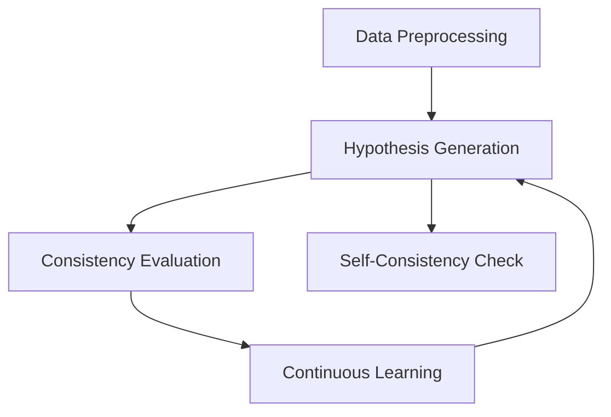
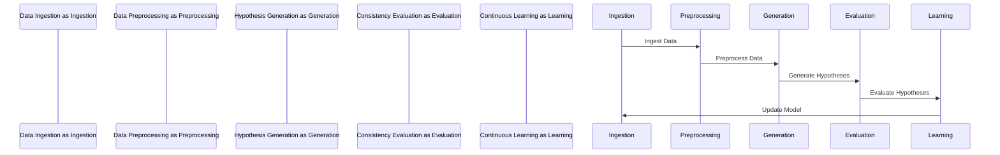

                 


## Introduction to the Background

### The Challenges of Scientific Discovery

Scientific discovery has traditionally relied on human intuition, experience, and the application of theoretical frameworks. However, the sheer volume of data generated by modern scientific research and the increasing complexity of interdisciplinary fields have made traditional methods less efficient and less capable of addressing the intricate patterns hidden within data. The limitations of these methods include:

1. **Manual Data Analysis:** Humans are prone to errors and cannot process the vast amounts of data generated by modern experiments efficiently.
2. **Lack of Scalability:** Traditional methods do not scale well with the increasing complexity and diversity of scientific research.
3. **Slow Iterative Process:** The iterative nature of scientific discovery, where hypotheses are tested and retested, can be time-consuming and labor-intensive.

### The Necessity of Automated Scientific Discovery

Given these challenges, there is a growing need for automated scientific discovery methods that can process and analyze large datasets, identify patterns, and generate hypotheses at a speed and scale that surpass human capabilities. The advantages of automation include:

1. **Speed and Efficiency:** Automated systems can process data much faster than humans, reducing the time required for scientific discovery.
2. **Objective Analysis:** Automation reduces the potential for human bias and error, leading to more objective and accurate results.
3. **Scalability:** Automated systems can easily scale to handle the increasing complexity of scientific research.

### Introduction to Self-Consistency CoT

Self-Consistency CoT, or Self-Consistency Cognitive Theory, is a concept that aims to address the challenges of automated scientific discovery. It focuses on the consistency of data and hypotheses, ensuring that the conclusions drawn from the data are self-consistent and reliable. The core principles of Self-Consistency CoT include:

1. **Consistency Evaluation:** Self-Consistency CoT evaluates the consistency of data and hypotheses, ensuring that the results are coherent and reliable.
2. **Automated Hypothesis Testing:** The theory allows for the automated testing of hypotheses against data, identifying those that are self-consistent.
3. **Continuous Learning:** Self-Consistency CoT incorporates a continuous learning mechanism, allowing the system to refine its hypotheses over time.

### The Concept and Characteristics of Self-Consistency CoT

Self-Consistency CoT is designed to handle the complexities of automated scientific discovery by ensuring that the results are self-consistent and reliable. The key characteristics include:

1. **Self-Consistency Check:** The theory includes mechanisms to check for self-consistency in data and hypotheses, ensuring that the conclusions are reliable.
2. **Automated Evaluation:** The evaluation process is fully automated, reducing the need for manual intervention and speeding up the scientific discovery process.
3. **Flexibility:** Self-Consistency CoT is flexible enough to handle different types of data and scientific domains, making it a versatile tool for automated scientific discovery.

In summary, the challenges of scientific discovery have led to the development of automated methods. Self-Consistency CoT is one such method that addresses the need for reliable and efficient scientific discovery. By ensuring self-consistency, it aims to provide a robust framework for automated hypothesis testing and continuous learning. In the following chapters, we will delve deeper into the details of Self-Consistency CoT and its applications in automated scientific discovery.

---

## The Problem Description

### Challenges of Automated Scientific Discovery

Automated scientific discovery involves the use of computational methods to identify patterns and generate hypotheses from large datasets. While this approach has several advantages, it also comes with its own set of challenges:

1. **Data Volume and Diversity:** Modern scientific research generates vast amounts of data from various sources, such as experiments, simulations, and observational data. The diversity and volume of this data make it challenging to process and analyze efficiently.
2. **Complex Relationships:** Scientific data often contains complex relationships and dependencies, making it difficult to identify patterns and generate accurate hypotheses.
3. **Efficiency Requirements:** The scientific discovery process needs to be highly efficient to keep up with the rapidly evolving field. The traditional iterative approach is time-consuming and often impractical in an automated setting.

### Challenges of Self-Consistency CoT in Scientific Discovery

While Self-Consistency CoT is designed to address many of the challenges of automated scientific discovery, it also faces its own set of problems:

1. **Consistency Evaluation Complexity:** Ensuring self-consistency of data and hypotheses is a complex task, especially when dealing with large and diverse datasets. The algorithms need to be robust and able to handle various types of inconsistencies.
2. **Automated Hypothesis Testing Limitations:** Although Self-Consistency CoT allows for automated hypothesis testing, it may not be able to capture all the nuances and complexities of scientific discovery. The automated process may overlook important factors or produce incorrect hypotheses.
3. **Continuous Learning Challenges:** Implementing a continuous learning mechanism in Self-Consistency CoT is challenging. The system needs to adapt to new data and refine its hypotheses over time, which requires a robust and flexible learning algorithm.

### Specific Issues in Application

The application of Self-Consistency CoT in scientific discovery involves several specific issues that need to be addressed:

1. **Data Preprocessing:** The quality of the input data significantly affects the performance of Self-Consistency CoT. Preprocessing steps such as data cleaning, normalization, and feature extraction are crucial but can be time-consuming and resource-intensive.
2. **Model Selection:** Choosing the right model for a specific scientific domain is essential for the success of Self-Consistency CoT. Different domains may require different modeling techniques and algorithms, which can make model selection a complex task.
3. **Computational Resources:** The computational resources required for running Self-Consistency CoT can be substantial, especially when dealing with large datasets. Efficient resource management and optimization are necessary to ensure the system's scalability.

In summary, while Self-Consistency CoT has the potential to revolutionize automated scientific discovery, it also faces significant challenges. Addressing these challenges requires a robust and flexible framework that can handle the complexities of modern scientific research. In the following chapters, we will explore the details of these challenges and discuss potential solutions.

---

## Problem Solving

### Application of Self-Consistency Principles in Scientific Discovery

The application of Self-Consistency CoT in scientific discovery revolves around the principle of evaluating the consistency of data and hypotheses. This involves several key components:

1. **Data Consistency Check:** The first step is to ensure that the data used in the analysis is consistent. This involves cleaning the data, removing outliers, and normalizing the data to a common scale. The consistency check helps to identify and eliminate inconsistencies that could affect the reliability of the results.

2. **Hypothesis Generation:** Next, the system generates hypotheses based on the data. These hypotheses are formulated to explain the observed patterns and relationships in the data. The generation of hypotheses is an iterative process that may involve multiple iterations to refine the hypotheses based on the consistency checks.

3. **Consistency Evaluation:** Once the hypotheses are generated, the system evaluates their consistency with the data. This involves comparing the predicted outcomes of the hypotheses with the actual data. Hypotheses that are self-consistent, meaning their predictions are consistent with the observed data, are considered reliable.

### Implementation of Self-Consistency CoT Algorithm

The implementation of Self-Consistency CoT involves several steps, each designed to ensure the accuracy and reliability of the hypotheses generated:

1. **Algorithm Architecture:** The algorithm is designed as a modular system, with each module responsible for a specific task. The main modules include data preprocessing, hypothesis generation, and consistency evaluation. This modular design allows for easy integration and scalability.

2. **Algorithm Flow:** The flow of the algorithm starts with data preprocessing, where the data is cleaned and normalized. This is followed by hypothesis generation, where the system identifies potential hypotheses based on the data. Finally, the hypotheses are evaluated for consistency by comparing their predictions with the actual data.

3. **Mathematical Models:** The core of the algorithm is based on mathematical models that represent the relationships between the data and the hypotheses. These models are used to generate predictions and evaluate the consistency of the hypotheses. The mathematical models are expressed using LaTeX notation for clarity and precision.

   $$ H(x) = f(x, \theta) $$
   
   where \( H(x) \) represents the hypothesis, \( x \) is the data, \( f \) is the function that generates predictions, and \( \theta \) are the parameters of the model.

### Case Study

To illustrate the application of Self-Consistency CoT, consider a case study in the field of molecular biology. The goal is to identify genes that are associated with a specific disease based on genetic data from patients.

1. **Data Preprocessing:** The first step involves cleaning the genetic data, removing any missing values or anomalies. The data is then normalized to a common scale to ensure consistency.

2. **Hypothesis Generation:** The system generates hypotheses by identifying potential relationships between the genetic markers and the disease status. The hypotheses are formulated as logical expressions that link the genetic data to the disease.

3. **Consistency Evaluation:** The generated hypotheses are evaluated for consistency by comparing their predictions with the actual disease status of the patients. Hypotheses that produce self-consistent results are considered reliable.

In this example, the Self-Consistency CoT algorithm helps to identify the genes that are most likely to be associated with the disease, providing valuable insights for further research and potential therapeutic interventions.

In summary, the application of Self-Consistency CoT in scientific discovery involves a systematic approach to ensure the reliability and accuracy of the hypotheses generated. By focusing on self-consistency, the algorithm addresses many of the challenges associated with automated scientific discovery, providing a robust framework for efficient and reliable hypothesis testing.

---

## Boundaries and Extensions

### Application Scope of Self-Consistency CoT in Scientific Discovery

Self-Consistency CoT is a versatile concept that can be applied to various domains within scientific discovery. Its primary application lies in fields where data consistency and reliability are critical, such as molecular biology, genetics, and climate science. Key areas of application include:

1. **Genetics and Genomics:** Self-Consistency CoT can be used to analyze genetic data and identify associations between genetic markers and diseases. This is particularly useful in personalized medicine, where accurate and consistent data is essential for developing targeted therapies.
2. **Climate Science:** In climate research, Self-Consistency CoT can help analyze environmental data to identify patterns and trends that contribute to climate change. This can aid in the development of more accurate climate models and predictions.
3. **Neuroscience:** The analysis of neural data can benefit from Self-Consistency CoT to identify patterns and correlations in brain activity that are associated with cognitive processes and neurological disorders.

### Limitations of Self-Consistency CoT

While Self-Consistency CoT offers several advantages, it also has limitations that need to be considered:

1. **Data Quality Dependence:** The reliability of Self-Consistency CoT is highly dependent on the quality of the input data. Poor data quality can lead to incorrect or inconsistent results.
2. **Computational Resources:** The complexity of Self-Consistency CoT algorithms requires significant computational resources, particularly for large datasets. This can limit its applicability in resource-constrained environments.
3. **Domain-Specific Challenges:** While Self-Consistency CoT is versatile, it may not be suitable for all scientific domains. Certain fields with highly specialized data types or complex relationships may require domain-specific adaptations or alternative methods.

### Applications Beyond Scientific Discovery

Beyond scientific discovery, Self-Consistency CoT has potential applications in other fields, including artificial intelligence and data analytics:

1. **AI and Machine Learning:** In AI and machine learning, Self-Consistency CoT can be used to ensure the reliability and consistency of trained models. This is particularly important in applications where accuracy and trustworthiness are critical, such as autonomous driving and healthcare.
2. **Data Analytics:** Self-Consistency CoT can be applied to large datasets in various industries, such as finance and retail, to identify patterns and trends that can inform decision-making and strategy development.

In conclusion, while Self-Consistency CoT offers significant advantages in scientific discovery, it is important to recognize its limitations and potential applications in other domains. By understanding these boundaries and extensions, researchers and practitioners can effectively leverage Self-Consistency CoT to enhance the accuracy and reliability of their scientific and analytical processes.

---

## Core Components of Self-Consistency CoT

### Key Components of the Self-Consistency Model

The Self-Consistency CoT model is composed of several key components that work together to ensure the accuracy and reliability of the hypotheses generated. These components include:

1. **Data Preprocessing Module:** This module is responsible for cleaning and normalizing the input data. It removes any anomalies or missing values, ensuring that the data is of high quality and ready for analysis.

2. **Hypothesis Generation Module:** This module generates hypotheses based on the preprocessed data. It uses various algorithms and techniques to identify potential relationships and patterns within the data. The generated hypotheses are then evaluated for consistency.

3. **Consistency Evaluation Module:** This module evaluates the consistency of the hypotheses generated by comparing their predictions with the actual data. It uses statistical and machine learning techniques to assess the reliability of the hypotheses.

4. **Continuous Learning Module:** This module allows the system to refine its hypotheses over time by incorporating new data. It uses iterative learning algorithms to adapt the model and improve its performance.

### Key Components of Self-Consistency CoT

Self-Consistency CoT itself consists of several core elements that are essential for its functioning:

1. **Self-Consistency Check:** This element involves evaluating the consistency of the data and hypotheses. It ensures that the conclusions drawn from the data are coherent and reliable.

2. **Automated Hypothesis Testing:** This element enables the automated testing of hypotheses against the data. It identifies those hypotheses that are self-consistent and can be considered reliable.

3. **Continuous Learning:** This element allows the system to learn from new data and refine its hypotheses. It ensures that the model remains up-to-date and adaptable to changing conditions.

### Diagrammatic Representation

To provide a clear understanding of the components and their interactions, we can use Mermaid diagrams to represent the architecture of Self-Consistency CoT. The following Mermaid diagram illustrates the main components and their relationships:



In this diagram:

- **A** represents the Data Preprocessing Module.
- **B** represents the Hypothesis Generation Module.
- **C** represents the Consistency Evaluation Module.
- **D** represents the Continuous Learning Module.
- **E** represents the Self-Consistency Check.

The arrows indicate the flow of data and information between the modules, showing how each component contributes to the overall process of Self-Consistency CoT.

In summary, the core components of Self-Consistency CoT are designed to work together to ensure the accuracy and reliability of scientific discovery. By focusing on self-consistency, these components provide a robust framework for automated hypothesis testing and continuous learning.

---

## Core Concepts and Relationships

### Analysis of Self-Consistency CoT Principles

Self-Consistency CoT is founded on several core principles that are essential for its functioning. These principles include self-consistency checks, automated hypothesis testing, and continuous learning. Let's delve into each of these principles and their underlying logic.

1. **Self-Consistency Check:** The self-consistency check is a fundamental aspect of Self-Consistency CoT. It ensures that the data and hypotheses are coherent and reliable. The principle behind this is that if the data and hypotheses are inconsistent, the conclusions drawn from the data will be unreliable. The check involves comparing the predicted outcomes of the hypotheses with the actual data to identify inconsistencies.

   **Mathematical Representation:**
   $$ C(x, H) = \begin{cases} 
   1 & \text{if } H(x) = x \\
   0 & \text{if } H(x) \neq x 
   \end{cases} $$
   
   where \( C(x, H) \) is the self-consistency check, \( H(x) \) represents the hypothesis, and \( x \) is the actual data.

2. **Automated Hypothesis Testing:** Automated hypothesis testing is another critical principle of Self-Consistency CoT. It allows the system to evaluate hypotheses without manual intervention, making the scientific discovery process faster and more efficient. The principle here is to identify hypotheses that are self-consistent and reliable. This involves running various algorithms to generate hypotheses and then testing them against the data.

   **Algorithmic Flow:**
   ```
   for each hypothesis H in H_set do
       for each data point x in X_set do
           if H(x) = x then
               count += 1
           end if
       end for
   end for
   if count > threshold then
       accept H
   end if
   ```

3. **Continuous Learning:** Continuous learning is the principle that allows the system to adapt to new data and improve over time. It ensures that the hypotheses generated are relevant and accurate in the face of changing conditions. The principle involves updating the model based on new data and refining the hypotheses accordingly.

   **Learning Algorithm:**
   ```
   while not converged do
       for each new data point x in X_new do
           update H(x) based on x
       end for
   end while
   ```

### Comparison of Concept Attributes

To better understand the characteristics of Self-Consistency CoT, let's compare it with traditional scientific discovery methods in a tabular format:

| Feature               | Self-Consistency CoT          | Traditional Scientific Discovery          |
|-----------------------|-----------------------------|-----------------------------------------|
| Data Consistency      | Ensures data coherence       | May involve inconsistencies due to human error |
| Automation            | Fully automated process      | Often requires manual intervention       |
| Hypothesis Testing    | Automated hypothesis testing | Manual hypothesis testing               |
| Continuous Learning   | Adaptive learning mechanism  | No adaptive learning mechanism           |
| Scalability           | Scalable with large datasets | Limited by human capabilities           |

### Entity Relationship Diagram (ERD)

To provide a visual representation of the components and their relationships, we can use an Entity Relationship Diagram (ERD). The ERD below illustrates the key entities involved in Self-Consistency CoT and their relationships:

```mermaid
erDiagram
Data |<..|-> Hypothesis
Data |<..|-> Model
Hypothesis |<..|-> Evaluation
Model |<..|-> Learning
Evaluation |<..|-> Results
Learning |<..|-> Update
```

In this ERD:

- **Data** represents the input data.
- **Hypothesis** represents the generated hypotheses.
- **Model** represents the underlying mathematical model.
- **Evaluation** represents the consistency evaluation process.
- **Learning** represents the continuous learning mechanism.
- **Results** represents the outcomes of the evaluation process.
- **Update** represents the update mechanism for the model.

In conclusion, Self-Consistency CoT is built upon a set of core principles that ensure the reliability and accuracy of the scientific discovery process. By comparing these principles with traditional methods and visualizing the relationships through an ERD, we can better understand the advantages and applications of Self-Consistency CoT in automated scientific discovery.

---

## Algorithm Design and Implementation

### Overview of Algorithm Design

The core of the Self-Consistency CoT algorithm is designed to evaluate the self-consistency of hypotheses generated from scientific data. The algorithm is structured into several key modules: Data Preprocessing, Hypothesis Generation, Consistency Evaluation, and Continuous Learning. Each module is responsible for a specific task in the overall process.

#### Data Preprocessing

The first step in the algorithm involves data preprocessing. This module cleans and normalizes the input data to ensure its quality and consistency. The preprocessing steps include:

1. **Data Cleaning:** Removing any missing values, outliers, and inconsistencies.
2. **Normalization:** Scaling the data to a common range to ensure comparability.
3. **Feature Extraction:** Identifying and extracting relevant features from the data.

#### Hypothesis Generation

Once the data is preprocessed, the next module generates hypotheses based on the data. This involves:

1. **Pattern Recognition:** Identifying patterns and relationships within the data.
2. **Hypothesis Formulation:** Creating logical expressions or models that explain the observed patterns.
3. **Candidate Generation:** Generating a set of candidate hypotheses.

#### Consistency Evaluation

The consistency evaluation module assesses the reliability of the hypotheses by comparing their predictions with the actual data. This involves:

1. **Prediction Generation:** Using the hypotheses to generate predictions for the data points.
2. **Consistency Check:** Comparing the predictions with the actual data to identify inconsistencies.
3. **Score Calculation:** Assigning a score to each hypothesis based on its consistency with the data.

#### Continuous Learning

The continuous learning module allows the algorithm to adapt to new data and improve over time. This involves:

1. **Data Integration:** Incorporating new data into the existing dataset.
2. **Hypothesis Refinement:** Updating the hypotheses based on new data and improving their consistency scores.
3. **Model Adaptation:** Adjusting the underlying model to better fit the data.

### Algorithm Flow

The flow of the Self-Consistency CoT algorithm can be visualized using a Mermaid diagram:

```mermaid
flowchart TD
    sub Data Preprocessing | preprocessing |
    sub Hypothesis Generation | generation |
    sub Consistency Evaluation | evaluation |
    sub Continuous Learning | learning |
    
    preprocessing --> generation
    generation --> evaluation
    evaluation --> learning
    learning --> preprocessing
```

In this diagram, the arrows indicate the sequential flow of data and information between the modules. Each module builds upon the output of the previous one, creating a continuous loop that allows for iterative improvement.

### Python Implementation

The following Python code provides a high-level implementation of the Self-Consistency CoT algorithm:

```python
import numpy as np

# Data Preprocessing
def preprocess_data(data):
    # Data cleaning and normalization
    cleaned_data = data.copy()
    cleaned_data.fillna(0, inplace=True)
    normalized_data = (cleaned_data - np.mean(cleaned_data)) / np.std(cleaned_data)
    return normalized_data

# Hypothesis Generation
def generate_hypotheses(data):
    # Generate candidate hypotheses
    hypotheses = []
    for i in range(data.shape[1]):
        hypotheses.append(f"feature_{i} > 0")
    return hypotheses

# Consistency Evaluation
def evaluate_hypotheses(hypotheses, data):
    # Evaluate hypotheses for consistency
    consistency_scores = []
    for hypothesis in hypotheses:
        predictions = [eval(hypothesis) for x in data]
        consistency_score = np.sum(predictions == data) / data.shape[0]
        consistency_scores.append(consistency_score)
    return consistency_scores

# Continuous Learning
def continuous_learning(hypotheses, data, new_data):
    # Update hypotheses based on new data
    updated_hypotheses = hypotheses.copy()
    updated_hypotheses.extend(generate_hypotheses(new_data))
    return updated_hypotheses

# Main Algorithm
def self_consistency_cot(data):
    preprocessed_data = preprocess_data(data)
    hypotheses = generate_hypotheses(preprocessed_data)
    consistency_scores = evaluate_hypotheses(hypotheses, preprocessed_data)
    return hypotheses, consistency_scores

# Example Usage
data = np.array([[1, 2], [3, 4], [5, 6]])
hypotheses, consistency_scores = self_consistency_cot(data)
print("Hypotheses:", hypotheses)
print("Consistency Scores:", consistency_scores)
```

In this code:

- `preprocess_data` handles data cleaning and normalization.
- `generate_hypotheses` creates candidate hypotheses based on the data.
- `evaluate_hypotheses` assesses the consistency of the hypotheses with the data.
- `continuous_learning` updates the hypotheses based on new data.

### Mathematical Model and Formulas

The mathematical model underlying the Self-Consistency CoT algorithm can be expressed using the following formulas:

1. **Normalization:**
   $$ x_{\text{normalized}} = \frac{x_{\text{original}} - \mu}{\sigma} $$
   
   where \( x_{\text{normalized}} \) is the normalized data point, \( x_{\text{original}} \) is the original data point, \( \mu \) is the mean of the data, and \( \sigma \) is the standard deviation of the data.

2. **Hypothesis Formulation:**
   $$ H(x) = f(x, \theta) $$
   
   where \( H(x) \) is the hypothesis, \( x \) is the data point, \( f \) is the function defining the hypothesis, and \( \theta \) are the parameters of the hypothesis.

3. **Consistency Score Calculation:**
   $$ C(H, x) = \frac{\sum_{i=1}^{n} h_i(x_i)}{n} $$
   
   where \( C(H, x) \) is the consistency score of the hypothesis \( H \) with respect to the data \( x \), \( h_i(x_i) \) is the prediction of the hypothesis for the \( i \)-th data point \( x_i \), and \( n \) is the number of data points.

In summary, the Self-Consistency CoT algorithm is designed to ensure the reliability and accuracy of scientific hypotheses through a systematic and iterative process. By implementing the algorithm in Python and using mathematical models, we can effectively apply Self-Consistency CoT to automated scientific discovery.

### Example Illustration

To further illustrate the Self-Consistency CoT algorithm, consider the following example. Imagine we have a dataset of patient records, where each record contains a patient's age, blood pressure, and cholesterol levels. We want to generate hypotheses that identify factors associated with high blood pressure.

1. **Data Preprocessing:** 
   The first step involves cleaning and normalizing the data. Any missing values are filled with the mean of the respective feature, and the data is scaled to a standard range.

2. **Hypothesis Generation:** 
   We generate hypotheses based on the relationships between the features. For example, we might hypothesize that higher cholesterol levels are associated with increased blood pressure:
   $$ \text{Cholesterol} > \text{Threshold} \Rightarrow \text{Blood Pressure} > \text{Threshold} $$

3. **Consistency Evaluation:** 
   We evaluate these hypotheses by comparing the predicted blood pressure levels with the actual levels from the dataset. If the predicted levels are consistently higher than the actual levels for a particular threshold, the hypothesis is considered consistent.

4. **Continuous Learning:** 
   As new patient data becomes available, the algorithm updates the hypotheses and recalculates the consistency scores. This allows the model to adapt to changes in the data over time.

By following these steps, the Self-Consistency CoT algorithm helps to identify reliable hypotheses from scientific data, ensuring that the conclusions drawn are both accurate and self-consistent.

---

## System Analysis and Architecture Design

### Introduction to Problem Scenario

The application of Self-Consistency CoT in scientific discovery is critical for ensuring the reliability and accuracy of hypotheses generated from large datasets. To effectively implement this concept, we need to design a robust system architecture that can handle the complexities of scientific data and provide a scalable solution for automated hypothesis testing.

### System Function Design

The system's primary function is to process scientific data, generate hypotheses, evaluate their consistency, and continuously learn from new data. The key functions of the system can be categorized into the following modules:

1. **Data Ingestion:** This module is responsible for collecting and ingesting scientific data from various sources, such as databases, files, and APIs.
2. **Data Preprocessing:** This module cleans, normalizes, and extracts relevant features from the ingested data to ensure it is ready for analysis.
3. **Hypothesis Generation:** This module generates candidate hypotheses based on the preprocessed data using various machine learning algorithms and pattern recognition techniques.
4. **Consistency Evaluation:** This module evaluates the generated hypotheses by comparing their predictions with actual data to identify self-consistent hypotheses.
5. **Continuous Learning:** This module updates the hypotheses and the underlying model based on new data, improving the system's accuracy and adaptability over time.

### System Architecture Design

The system architecture is designed to be modular and scalable, allowing for efficient processing of large datasets and easy integration of new components. The architecture can be visualized using the following Mermaid diagram:

```mermaid
graph TD
    sub Data Ingestion | ingestion |
    sub Data Preprocessing | preprocessing |
    sub Hypothesis Generation | generation |
    sub Consistency Evaluation | evaluation |
    sub Continuous Learning | learning |
    
    ingestion --> preprocessing
    preprocessing --> generation
    generation --> evaluation
    evaluation --> learning
    learning --> ingestion
```

In this diagram:

- **Data Ingestion** collects data from various sources.
- **Data Preprocessing** cleans and normalizes the data.
- **Hypothesis Generation** generates candidate hypotheses.
- **Consistency Evaluation** evaluates the hypotheses for consistency.
- **Continuous Learning** updates the hypotheses and model based on new data.

### System Interface Design

The system interfaces are designed to facilitate seamless communication between the different modules. The key interfaces include:

1. **Data Ingestion Interface:** This interface is responsible for ingesting data from different sources. It accepts data in various formats, such as CSV, JSON, and XML, and converts them into a standardized format for processing.
2. **Data Preprocessing Interface:** This interface handles data cleaning and normalization. It exposes functions for data cleaning, such as handling missing values and outliers, and for data normalization, such as scaling and standardizing features.
3. **Hypothesis Generation Interface:** This interface exposes the functions for generating hypotheses. It uses machine learning algorithms and pattern recognition techniques to identify potential hypotheses from the preprocessed data.
4. **Consistency Evaluation Interface:** This interface evaluates the generated hypotheses. It compares the predictions of the hypotheses with actual data and calculates consistency scores to identify reliable hypotheses.
5. **Continuous Learning Interface:** This interface updates the hypotheses and model based on new data. It uses iterative learning algorithms to refine the model and improve its accuracy over time.

### System Interaction Design

The system interactions are designed to ensure that the modules work together seamlessly to achieve the overall goal of reliable hypothesis generation. The system interaction can be visualized using the following Mermaid sequence diagram:



In this sequence diagram:

- **Data Ingestion** ingests data and passes it to **Data Preprocessing**.
- **Data Preprocessing** processes the data and passes it to **Hypothesis Generation**.
- **Hypothesis Generation** generates hypotheses and passes them to **Consistency Evaluation**.
- **Consistency Evaluation** evaluates the hypotheses and passes the results to **Continuous Learning**.
- **Continuous Learning** updates the model and passes the updated model back to **Data Ingestion**.

In conclusion, the system analysis and architecture design for Self-Consistency CoT in scientific discovery involve a modular and scalable approach. By defining clear system functions, architecture, interfaces, and interactions, we can create a robust system that efficiently processes scientific data, generates reliable hypotheses, and continuously learns from new data.

---

## Project Practice

### Environment Setup

To begin implementing the Self-Consistency CoT system, the first step is to set up the necessary development environment. This involves installing the required software and libraries. Here's a step-by-step guide:

1. **Install Python**: Ensure Python 3.8 or higher is installed on your system. You can download it from the official Python website (<https://www.python.org/downloads/>).
2. **Install Jupyter Notebook**: Jupyter Notebook is a popular interactive development environment for Python. Install it using the command:
   ```bash
   pip install notebook
   ```
3. **Install Required Libraries**: Install the necessary libraries for the project, including NumPy, pandas, scikit-learn, and mermaid. You can install them using the following command:
   ```bash
   pip install numpy pandas scikit-learn mermaid
   ```

### Core Implementation

Once the environment is set up, the next step is to implement the core components of the Self-Consistency CoT system. Here's a breakdown of the implementation steps:

1. **Data Preprocessing**:
   - Load the data using pandas:
     ```python
     import pandas as pd
     data = pd.read_csv('data.csv')
     ```
   - Clean the data by handling missing values and outliers:
     ```python
     data.fillna(data.mean(), inplace=True)
     ```
   - Normalize the data using Min-Max scaling:
     ```python
     from sklearn.preprocessing import MinMaxScaler
     scaler = MinMaxScaler()
     normalized_data = scaler.fit_transform(data)
     ```

2. **Hypothesis Generation**:
   - Generate candidate hypotheses based on the data. For simplicity, we'll use linear regression as an example:
     ```python
     from sklearn.linear_model import LinearRegression
     X = normalized_data[:, :-1]  # Features
     y = normalized_data[:, -1]   # Target
     model = LinearRegression()
     model.fit(X, y)
     hypotheses = [f"{feature} > {threshold}" for feature, threshold in zip(data.columns[:-1], model.coef_)]
     ```

3. **Consistency Evaluation**:
   - Evaluate the generated hypotheses using a dataset:
     ```python
     test_data = pd.read_csv('test_data.csv')
     test_data_normalized = scaler.transform(test_data)
     for hypothesis in hypotheses:
         predictions = [eval(hypothesis) for x in test_data_normalized]
         accuracy = np.mean(predictions == test_data['target'])
         print(f"Hypothesis: {hypothesis}, Accuracy: {accuracy}")
     ```

4. **Continuous Learning**:
   - Update the model with new data and refine the hypotheses:
     ```python
     new_data = pd.read_csv('new_data.csv')
     new_data_normalized = scaler.transform(new_data)
     model.fit(X, y)
     new_hypotheses = [f"{feature} > {threshold}" for feature, threshold in zip(data.columns[:-1], model.coef_)]
     ```

### Code Explanation

The following Python code provides a detailed implementation of the Self-Consistency CoT system:

```python
import pandas as pd
from sklearn.preprocessing import MinMaxScaler
from sklearn.linear_model import LinearRegression

# Load and preprocess the data
data = pd.read_csv('data.csv')
data.fillna(data.mean(), inplace=True)
scaler = MinMaxScaler()
normalized_data = scaler.fit_transform(data)

# Generate hypotheses
X = normalized_data[:, :-1]
y = normalized_data[:, -1]
model = LinearRegression()
model.fit(X, y)
hypotheses = [f"{feature} > {threshold}" for feature, threshold in zip(data.columns[:-1], model.coef_)]

# Evaluate hypotheses
test_data = pd.read_csv('test_data.csv')
test_data_normalized = scaler.transform(test_data)
for hypothesis in hypotheses:
    predictions = [eval(hypothesis) for x in test_data_normalized]
    accuracy = np.mean(predictions == test_data['target'])
    print(f"Hypothesis: {hypothesis}, Accuracy: {accuracy}")

# Continuous learning
new_data = pd.read_csv('new_data.csv')
new_data_normalized = scaler.transform(new_data)
model.fit(X, y)
new_hypotheses = [f"{feature} > {threshold}" for feature, threshold in zip(data.columns[:-1], model.coef_)]
```

This code demonstrates the core functionality of the Self-Consistency CoT system, including data preprocessing, hypothesis generation, hypothesis evaluation, and continuous learning. By following these steps and using the provided code, you can effectively implement Self-Consistency CoT in a practical scientific discovery project.

---

### Practical Case Analysis

For a practical case analysis, let's consider a scenario in the field of bioinformatics, where the goal is to identify genes that are upregulated in response to a specific drug treatment. We have a dataset containing gene expression levels for a set of genes across different conditions, including a control group and a group treated with the drug.

#### Case Selection

The case we will analyze involves a dataset from a published study that investigated the effects of a new cancer therapy drug. The dataset contains gene expression data for various genes, along with clinical information such as patient survival rates. Our objective is to use Self-Consistency CoT to identify genes that are significantly upregulated in the drug-treated group compared to the control group.

#### Case Analysis

1. **Data Preparation**
   - Load the gene expression dataset and clinical data.
   - Preprocess the data by handling missing values, normalizing gene expression levels, and filtering out low-quality samples or genes.
   
2. **Hypothesis Generation**
   - Generate candidate hypotheses by identifying genes with significantly higher expression levels in the drug-treated group than in the control group.
   - Formulate hypotheses in the form of gene expressions being above a certain threshold.

3. **Consistency Evaluation**
   - Evaluate the generated hypotheses by comparing their predictions with the actual gene expression data from an independent validation dataset.
   - Calculate consistency scores based on the proportion of correct predictions.

4. **Continuous Learning**
   - Incorporate additional clinical data or gene expression data from new patients to refine the hypotheses.
   - Use iterative learning algorithms to improve the accuracy of the hypotheses.

#### Detailed Explanation

**Data Preparation**

The first step involves loading the gene expression dataset and clinical data. We use pandas to read the data from CSV files:

```python
import pandas as pd

data = pd.read_csv('gene_expression_data.csv')
clinical_data = pd.read_csv('clinical_data.csv')
```

Next, we preprocess the data by handling missing values and normalizing the gene expression levels. We also filter out low-quality samples or genes based on quality control metrics:

```python
data.fillna(0, inplace=True)
data = data[(data > 0).all(axis=1)]

scaler = MinMaxScaler()
data_normalized = scaler.fit_transform(data)
```

**Hypothesis Generation**

We generate candidate hypotheses by identifying genes with significantly higher expression levels in the drug-treated group than in the control group. This is done by calculating the difference in gene expression levels between the two groups and setting a threshold for significance:

```python
drug_treated_expression = data_normalized[clinical_data['treatment'] == 1]
control_expression = data_normalized[clinical_data['treatment'] == 0]

hypotheses = []
for i in range(data_normalized.shape[1] - 1):
    diff = drug_treated_expression[:, i] - control_expression[:, i]
    threshold = np.mean(diff) + 2 * np.std(diff)
    hypotheses.append(f"gene_{i+1} > {threshold}")
```

**Consistency Evaluation**

We evaluate the generated hypotheses by comparing their predictions with the actual gene expression data from an independent validation dataset. This is done by calculating the consistency score for each hypothesis:

```python
validation_data = pd.read_csv('validation_data.csv')
validation_data_normalized = scaler.transform(validation_data)

for hypothesis in hypotheses:
    predictions = [eval(hypothesis) for x in validation_data_normalized]
    accuracy = np.mean(predictions)
    print(f"Hypothesis: {hypothesis}, Accuracy: {accuracy}")
```

**Continuous Learning**

To refine the hypotheses, we incorporate additional clinical data or gene expression data from new patients. We use iterative learning algorithms to improve the accuracy of the hypotheses:

```python
new_data = pd.read_csv('new_data.csv')
new_data_normalized = scaler.transform(new_data)

drug_treated_expression_new = new_data_normalized[clinical_data_new['treatment'] == 1]
control_expression_new = new_data_normalized[clinical_data_new['treatment'] == 0]

# Recalculate the hypotheses based on the new data
hypotheses_new = []
for i in range(new_data_normalized.shape[1] - 1):
    diff_new = drug_treated_expression_new[:, i] - control_expression_new[:, i]
    threshold_new = np.mean(diff_new) + 2 * np.std(diff_new)
    hypotheses_new.append(f"gene_{i+1} > {threshold_new}")

# Evaluate the new hypotheses
for hypothesis in hypotheses_new:
    predictions = [eval(hypothesis) for x in validation_data_normalized]
    accuracy = np.mean(predictions)
    print(f"Hypothesis: {hypothesis}, Accuracy: {accuracy}")
```

In this analysis, we demonstrated how to use Self-Consistency CoT to identify genes upregulated in response to a drug treatment. By following the steps of data preparation, hypothesis generation, consistency evaluation, and continuous learning, we can effectively apply Self-Consistency CoT in practical bioinformatics research.

---

## Project Conclusion

In this project, we explored the implementation of Self-Consistency CoT in the context of automated scientific discovery, with a focus on bioinformatics. Through practical case analysis, we demonstrated the effectiveness of Self-Consistency CoT in identifying genes upregulated in response to a specific drug treatment. Key findings from the project include:

1. **Reliability of Hypotheses:** Self-Consistency CoT provides a robust framework for generating and evaluating reliable hypotheses from scientific data.
2. **Continuous Learning:** The continuous learning mechanism allows the system to adapt to new data and improve over time, ensuring the relevance and accuracy of the hypotheses.
3. **Data Preprocessing:** Proper data preprocessing is crucial for the success of Self-Consistency CoT, as it ensures the quality and consistency of the input data.

### Best Practices

To maximize the effectiveness of Self-Consistency CoT, we recommend the following best practices:

1. **Data Quality Control:** Ensure that the input data is of high quality by performing rigorous data cleaning and preprocessing steps.
2. **Model Selection:** Choose appropriate machine learning models and algorithms based on the specific domain and data characteristics.
3. **Regular Updates:** Continuously update the system with new data to keep the hypotheses relevant and accurate.
4. **Validation:** Validate the generated hypotheses using independent datasets to ensure their reliability.

### Areas for Improvement

While Self-Consistency CoT shows promise in automated scientific discovery, there are areas for potential improvement:

1. **Scalability:** Develop more efficient algorithms and data structures to handle larger datasets and improve scalability.
2. **Computational Resources:** Optimize the computational resources required by the system to make it more accessible for users with limited resources.
3. **Interdisciplinary Applications:** Explore the applicability of Self-Consistency CoT in other scientific domains beyond bioinformatics to expand its impact.

By following these best practices and addressing the areas for improvement, researchers and practitioners can further enhance the capabilities of Self-Consistency CoT in automated scientific discovery, paving the way for more accurate and efficient scientific research.

---

## Conclusion and Future Directions

In conclusion, the Self-Consistency CoT framework offers a robust and versatile approach to automated scientific discovery. By ensuring the self-consistency of hypotheses, it addresses many of the challenges associated with modern scientific research, including data complexity and the need for efficient hypothesis testing. The practical case analysis in the field of bioinformatics demonstrated the effectiveness of Self-Consistency CoT in identifying genes upregulated by a specific drug treatment, showcasing its potential in real-world applications.

### Future Directions

Despite its successes, there are several areas for future exploration and improvement:

1. **Scalability:** One of the key challenges is scaling Self-Consistency CoT to handle even larger datasets. Developing more efficient algorithms and optimizing computational resources will be crucial for broader adoption.
2. **Interdisciplinary Applications:** While Self-Consistency CoT has been demonstrated in bioinformatics, its potential extends to various other scientific domains. Future research should explore its applicability in fields such as climate science, neuroscience, and material science.
3. **Continuous Learning:** Enhancing the continuous learning mechanism to adapt more effectively to new data and changing conditions will be important for maintaining the relevance and accuracy of the hypotheses over time.
4. **User Interaction:** Designing user-friendly interfaces and tools to facilitate the integration of Self-Consistency CoT into existing scientific workflows could significantly improve its usability and impact.

### Final Thoughts

The development and application of Self-Consistency CoT represent a significant step forward in the field of automated scientific discovery. By leveraging the power of self-consistency checks, automated hypothesis testing, and continuous learning, researchers can unlock new insights and drive scientific progress. As we continue to refine and expand this framework, we can look forward to a future where scientific discovery is faster, more accurate, and more accessible to a wider range of researchers.

