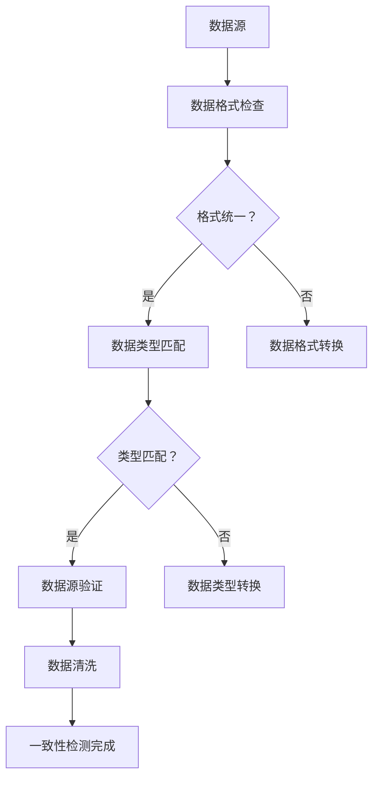
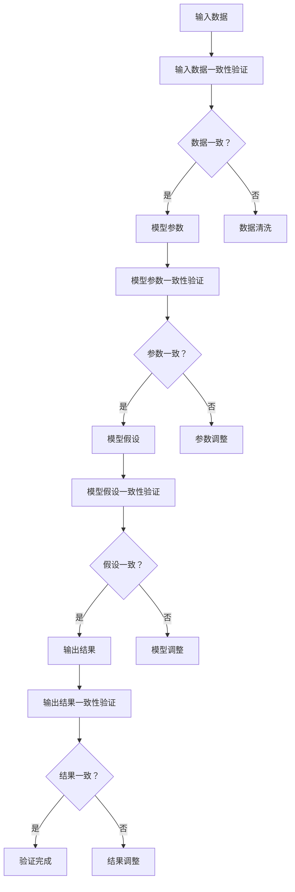
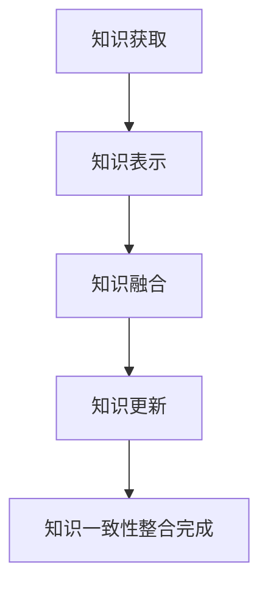

                 

### 摘要

本文旨在探讨自我一致性CoT（Self-Consistency CoT）在自动化科学理论生成中的突破性应用。随着科学研究的复杂度不断增加，传统科学理论生成方法面临诸多挑战，如理论一致性验证的困难、知识整合的复杂性等。自我一致性CoT通过引入自我一致性的概念，构建了一套完整的理论框架，能够在数据一致性检测、理论一致性验证以及知识一致性整合方面实现高度自动化，从而在自动化科学理论生成中展现出巨大的潜力。本文首先阐述了自动化科学理论生成的背景和挑战，接着介绍了Self-Consistency CoT的核心概念和原理，随后通过具体的应用场景和案例，展示了其在生物医学、物理学和社会科学等领域的实际应用，并最后提供了实践案例和优化策略。通过这些分析和探讨，本文希望能够为自动化科学理论生成的研究和实践提供新的思路和方向。

### 第一部分：问题背景与核心概念

#### 第1章：问题背景与核心概念

##### 1.1 问题的提出

随着科学研究的不断深入，科学理论生成的复杂性也在不断增加。传统的科学理论生成方法往往依赖于手动分析，这不仅效率低下，而且在处理大规模数据和复杂理论关系时显得力不从心。自动化科学理论生成的需求愈发迫切，但其实现却面临诸多挑战。

首先，科学理论生成涉及多个学科领域的交叉和融合，需要处理大量的数据和信息，这些数据不仅包括实验数据，还涉及文献资料、模型预测结果等。传统的科学理论生成方法往往无法有效地整合这些多源异构的数据，导致理论生成过程中信息的不完整性和不一致性。

其次，科学理论的一致性验证是一个关键问题。科学理论需要在不同的数据集和实验条件下保持一致性，以确保理论的可靠性和有效性。然而，传统的方法在验证理论一致性时往往需要大量的人工干预，难以实现自动化。

此外，知识整合的复杂性也是一大挑战。科学理论生成不仅需要处理数据，还需要整合已有的知识和理论，形成一套完整的科学体系。这要求在理论生成过程中，系统能够自动识别和整合相关领域的研究成果，形成高度一致的理论框架。

为了解决这些问题，近年来研究者们提出了多种自动化科学理论生成的方法，但这些方法在具体应用中仍存在一定的局限性。例如，一些方法在数据整合方面表现良好，但在理论一致性验证和知识整合方面效果不佳；另一些方法在理论一致性验证方面表现优异，但在处理大规模数据时效率较低。

因此，我们需要一种新的方法，能够在数据整合、理论一致性验证和知识整合等方面实现高度自动化，从而突破现有方法的局限。自我一致性CoT（Self-Consistency CoT）正是为此而提出的。

##### 1.2 Self-Consistency CoT的概念介绍

自我一致性CoT（Self-Consistency CoT）是一种基于自我一致性的自动化科学理论生成方法。它通过引入自我一致性的概念，构建了一套完整的理论框架，包括数据一致性检测、理论一致性验证和知识一致性整合三个方面。

数据一致性检测是自我一致性CoT的基础，它旨在确保在理论生成过程中所使用的数据具有一致性。通过一系列的数据预处理和清洗步骤，系统能够识别和纠正数据中的不一致性，从而保证后续分析结果的可靠性。

理论一致性验证是自我一致性CoT的核心。它通过建立一套理论一致性验证机制，确保生成的科学理论在不同数据集和实验条件下保持一致性。这一机制包括多个层次的验证步骤，从数据层到理论层，逐层验证理论的一致性，从而确保理论的可靠性。

知识一致性整合是自我一致性CoT的重要组成部分。它通过整合已有的知识和理论，形成一套完整的科学体系。在知识整合过程中，系统利用自我一致性原则，确保新理论和已有知识的一致性，从而构建高度一致的科学理论框架。

##### 1.3 Self-Consistency CoT与传统方法的对比

传统方法在科学理论生成中存在诸多局限性，而自我一致性CoT则在这些方面展现出明显的优势。

首先，在数据整合方面，传统方法往往依赖于人工处理，效率低下，且容易出现信息丢失和不一致。自我一致性CoT通过引入自我一致性的概念，能够自动识别和纠正数据中的不一致性，从而实现高效的数据整合。

其次，在理论一致性验证方面，传统方法通常需要大量的人工干预，难以实现自动化。而自我一致性CoT通过建立一套理论一致性验证机制，能够自动验证理论的一致性，从而大大提高验证的效率和准确性。

最后，在知识整合方面，传统方法往往无法有效整合多学科领域的研究成果，导致理论框架的碎片化。自我一致性CoT通过引入自我一致性原则，能够确保新理论和已有知识的一致性，从而构建高度一致的科学理论框架。

总之，自我一致性CoT在数据整合、理论一致性验证和知识整合等方面具有显著优势，为自动化科学理论生成提供了新的思路和方法。

##### 1.4 Self-Consistency CoT的应用前景

自我一致性CoT在自动化科学理论生成中的潜力巨大，具有广泛的应用前景。首先，在生物医学领域，自我一致性CoT可以用于自动化生成新的医学理论，帮助研究人员快速分析大量生物医学数据，提高医学研究的效率。其次，在物理学领域，自我一致性CoT可以用于自动化生成新的物理理论，帮助科学家快速验证和整合不同实验结果，推动物理学理论的进步。最后，在社会科学领域，自我一致性CoT可以用于自动化生成新的社会科学理论，帮助社会学家分析复杂的社交数据，提高社会科学研究的准确性。

此外，自我一致性CoT还可以应用于其他领域，如环境科学、材料科学等。在这些领域，自我一致性CoT能够帮助研究人员快速生成新的理论模型，提高科研效率，推动学科的发展。

总之，自我一致性CoT在自动化科学理论生成中具有广阔的应用前景，将为科学研究的进步提供强大的支持。

##### 1.5 本章小结

本章首先阐述了自动化科学理论生成的背景和挑战，接着介绍了Self-Consistency CoT的核心概念和原理，并通过与传统方法的对比，展示了其在数据整合、理论一致性验证和知识整合方面的优势。最后，本章讨论了Self-Consistency CoT在自动化科学理论生成中的广泛应用前景。通过本章的介绍，我们为后续章节的深入探讨奠定了基础。

## 第二部分：自我一致性CoT的基本原理

### 第2章：自我一致性CoT的基本原理

##### 2.1 Self-Consistency CoT的基本框架

自我一致性CoT（Self-Consistency CoT）的基本框架由三个核心组成部分构成：数据一致性检测、理论一致性验证和知识一致性整合。这三个部分相互关联，共同构成了自我一致性CoT的完整理论体系。

**数据一致性检测**是自我一致性CoT的基础。在科学理论生成过程中，数据的一致性是确保分析结果准确性的关键。数据一致性检测的主要目标是识别和纠正数据中的不一致性，包括数据格式、数据类型、数据来源等方面的不一致。通过一系列的数据预处理和清洗步骤，系统能够确保在理论生成过程中使用的数据具有一致性。

**理论一致性验证**是自我一致性CoT的核心。在科学理论生成过程中，确保理论在不同数据集和实验条件下保持一致性是至关重要的。理论一致性验证的主要任务是建立一套机制，从数据层到理论层逐层验证理论的一致性。这包括对理论模型进行验证，确保其输入数据、中间过程和输出结果之间的一致性。通过理论一致性验证，系统能够确保生成的科学理论具有可靠性和有效性。

**知识一致性整合**是自我一致性CoT的重要组成部分。在科学理论生成过程中，整合已有的知识和理论是形成一套完整科学体系的关键。知识一致性整合的主要目标是确保新理论和已有知识的一致性。通过自我一致性原则，系统能够识别和整合相关领域的研究成果，构建高度一致的科学理论框架。

这三个核心部分相互联系，共同构成了自我一致性CoT的基本框架。数据一致性检测提供了可靠的数据基础，理论一致性验证确保了理论的准确性，知识一致性整合则保证了科学理论的整体一致性。这种框架结构使得自我一致性CoT能够在自动化科学理论生成中发挥重要作用。

##### 2.2 数据一致性检测

数据一致性检测是自我一致性CoT的基础，其重要性不容忽视。在科学理论生成过程中，数据的一致性是确保分析结果准确性的关键。数据不一致性可能来源于多个方面，如数据格式不统一、数据类型不匹配、数据来源不一致等。这些不一致性问题会导致理论生成的结果不准确，甚至产生误导性的结论。

**数据一致性检测方法**主要包括以下步骤：

1. **数据格式检查**：检查不同数据源之间的数据格式是否统一，如时间戳格式、数值表示方法等。如果发现格式不统一，系统需要将数据进行转换，确保格式的一致性。

2. **数据类型匹配**：检查不同数据源之间的数据类型是否匹配，如字符串、整数、浮点数等。如果发现类型不匹配，系统需要进行类型转换，以确保数据类型的统一。

3. **数据来源验证**：验证数据来源的可靠性，确保数据来源一致。对于不同来源的数据，系统需要建立一个可信的数据源列表，对数据来源进行验证和筛选。

4. **数据清洗**：对数据进行清洗，去除重复、缺失和错误的数据。数据清洗是确保数据一致性的关键步骤，通过去除重复数据和缺失数据，系统能够确保数据的有效性和完整性。

**mermaid流程图**展示了数据一致性检测的详细流程：



通过这一流程，系统能够确保在理论生成过程中使用的数据具有一致性，为后续的理论一致性验证和知识整合提供可靠的数据基础。

##### 2.3 理论一致性验证

理论一致性验证是自我一致性CoT的核心，旨在确保生成的科学理论在不同数据集和实验条件下保持一致性。理论的一致性是科学理论可靠性和有效性的基础，如果理论在不同条件下不一致，可能会导致错误的结论和误导性的分析。

**理论一致性概念**涉及多个层次，包括数据层、模型层和结果层。在数据层，理论需要确保输入数据的一致性；在模型层，理论需要确保模型的参数和假设的一致性；在结果层，理论需要确保输出结果的一致性。

**理论一致性验证方法**主要包括以下步骤：

1. **输入数据一致性验证**：对输入数据进行一致性检查，确保数据在不同数据集之间保持一致。这可以通过建立数据集间的映射关系，以及数据预处理和清洗步骤来实现。

2. **模型参数一致性验证**：对模型的参数进行一致性检查，确保参数在不同实验条件下保持一致。这可以通过对模型进行参数敏感性分析，以及参数调整和优化来实现。

3. **模型假设一致性验证**：对模型的假设进行一致性检查，确保假设在不同数据集和实验条件下保持一致。这可以通过对模型进行验证和调整来实现。

4. **输出结果一致性验证**：对输出结果进行一致性检查，确保结果在不同实验条件下保持一致。这可以通过对结果进行统计分析，以及结果对比和验证来实现。

**mermaid流程图**展示了理论一致性验证的详细流程：



通过这一流程，系统能够确保生成的科学理论在不同数据集和实验条件下保持一致性，从而提高理论的可靠性和有效性。

##### 2.4 知识一致性整合

知识一致性整合是自我一致性CoT的重要组成部分，旨在确保新理论和已有知识的一致性。在科学理论生成过程中，整合已有的知识和理论是形成一套完整科学体系的关键。知识一致性整合不仅需要处理新理论和已有知识的一致性，还需要确保新理论与现有知识体系的高度兼容。

**知识整合的概念**涉及多个方面，包括知识的获取、知识的表示、知识的融合和知识的更新。知识获取是指从不同数据源和文献中提取和收集相关知识；知识表示是指将获取到的知识以结构化的形式表示，便于后续的处理和分析；知识融合是指将新知识和已有知识进行整合，确保知识的一致性和完整性；知识更新是指根据新的数据和研究成果，对已有知识进行更新和调整。

**知识一致性整合方法**主要包括以下步骤：

1. **知识获取**：通过数据挖掘、文献分析和专家访谈等方法，从不同数据源和文献中提取和收集相关知识。

2. **知识表示**：将获取到的知识以结构化的形式表示，如知识图谱、实体关系图等。这种表示方式有助于后续的知识整合和分析。

3. **知识融合**：将新知识和已有知识进行整合，确保知识的一致性和完整性。在知识融合过程中，系统需要利用自我一致性原则，确保新理论与已有知识的一致性。

4. **知识更新**：根据新的数据和研究成果，对已有知识进行更新和调整，确保知识体系的最新和准确性。

**mermaid流程图**展示了知识一致性整合的详细流程：



通过这一流程，系统能够确保新理论和已有知识的一致性，从而构建高度一致的科学理论框架。

##### 2.5 Self-Consistency CoT数学模型

Self-Consistency CoT的数学模型是其在自动化科学理论生成中的关键支撑。该模型通过一系列的数学公式和算法，实现了数据一致性检测、理论一致性验证和知识一致性整合的核心功能。以下将详细阐述Self-Consistency CoT数学模型的构建过程、关键公式以及其在理论框架中的应用。

**2.5.1 数学模型的构建**

Self-Consistency CoT的数学模型主要包括三个核心组件：数据一致性评估函数、理论一致性评估函数和知识一致性评估函数。这些评估函数共同构成了自我一致性CoT的数学框架，使得系统能够在数据处理、理论验证和知识整合方面实现高度自动化。

1. **数据一致性评估函数**：该函数用于评估不同数据源之间的数据一致性。其基本思想是，通过计算数据源之间的差异，判断数据是否一致。具体公式如下：

   $$ D(C_i, C_j) = \frac{1}{N} \sum_{k=1}^{N} |C_{ik} - C_{jk}| $$

   其中，$C_i$和$C_j$代表两个不同的数据源，$N$代表数据点的总数，$C_{ik}$和$C_{jk}$代表第$k$个数据点的值。该公式计算两个数据源之间每个数据点的差异，并取平均值作为整体的一致性评估。

2. **理论一致性评估函数**：该函数用于评估生成的科学理论在不同数据集和实验条件下的理论一致性。其基本思想是，通过比较理论在不同条件下的输出结果，判断理论是否一致。具体公式如下：

   $$ T(C_i, C_j) = \frac{1}{N} \sum_{k=1}^{N} |T(C_i, x_k) - T(C_j, x_k)| $$

   其中，$T(C_i, x_k)$和$T(C_j, x_k)$分别代表在不同数据集$C_i$和$C_j$下，理论对于输入$x_k$的输出结果，$N$代表输入数据点的总数。该公式计算理论在两个不同数据集下的输出结果差异，并取平均值作为整体的理论一致性评估。

3. **知识一致性评估函数**：该函数用于评估新理论和已有知识的一致性。其基本思想是，通过比较新理论与已有知识在关键指标上的差异，判断新理论是否与已有知识一致。具体公式如下：

   $$ K(T, K) = \frac{1}{M} \sum_{l=1}^{M} |T(K_l) - K_l| $$

   其中，$T$代表新理论，$K$代表已有知识集合，$M$代表知识点的总数，$K_l$代表第$l$个知识点的值，$T(K_l)$代表新理论对于知识点$K_l$的评估结果。该公式计算新理论对每个知识点的评估结果与已有知识点的差异，并取平均值作为整体的知识一致性评估。

**2.5.2 关键公式介绍**

除了上述的评估函数，Self-Consistency CoT数学模型还包括一些关键公式，用于具体实现数据一致性检测、理论一致性验证和知识一致性整合的过程。

1. **数据一致性纠正公式**：用于纠正数据中的不一致性。具体公式如下：

   $$ C_{corrected} = C_{original} - \alpha \cdot D(C_{original}, C_{standard}) $$

   其中，$C_{original}$代表原始数据，$C_{corrected}$代表纠正后的数据，$C_{standard}$代表标准数据，$\alpha$为校正系数，用于调整校正力度。

2. **理论一致性验证公式**：用于验证理论在不同数据集下的输出结果一致性。具体公式如下：

   $$ T_{valid} = \frac{1}{M} \sum_{l=1}^{M} |T(C_i, x_k) - T(C_j, x_k)| < \theta $$

   其中，$T_{valid}$代表理论的一致性验证结果，$\theta$为设定的阈值，用于判断理论是否通过验证。

3. **知识一致性整合公式**：用于整合新理论与已有知识。具体公式如下：

   $$ K_{integrated} = \alpha \cdot K(T, K) + (1 - \alpha) \cdot K_{original} $$

   其中，$K_{integrated}$代表整合后的知识，$\alpha$为整合系数，用于调整新理论与已有知识的权重。

**2.5.3 数学模型在Self-Consistency CoT中的应用**

Self-Consistency CoT的数学模型在自动化科学理论生成中发挥了关键作用。通过数据一致性评估函数、理论一致性评估函数和知识一致性评估函数，系统能够自动检测和纠正数据中的不一致性，验证理论在不同数据集下的输出结果一致性，并整合新理论与已有知识。这些评估和整合过程通过具体的数学公式实现，使得系统能够高效、准确地完成科学理论生成任务。

例如，在生物医学领域，数据一致性评估函数可以用于检测基因表达数据中的不一致性，确保分析结果的准确性；理论一致性评估函数可以用于验证基因表达模型在不同实验条件下的输出结果一致性，确保模型的可靠性；知识一致性整合函数可以用于整合新的基因表达模型与已有生物学知识，形成一套完整的生物学理论框架。

总之，Self-Consistency CoT的数学模型为自动化科学理论生成提供了坚实的理论基础，通过一系列的数学公式和算法，实现了数据一致性检测、理论一致性验证和知识一致性整合的核心功能，为科学理论生成提供了高效、可靠的工具。

##### 2.6 本章小结

本章详细介绍了自我一致性CoT的基本原理，包括其基本框架、数据一致性检测、理论一致性验证和知识一致性整合。通过这些核心组成部分，自我一致性CoT实现了一套完整的自动化科学理论生成方法。本章首先阐述了自我一致性CoT的基本框架，接着介绍了数据一致性检测、理论一致性验证和知识一致性整合的方法和步骤，最后详细介绍了Self-Consistency CoT的数学模型及其关键公式。通过本章的介绍，我们对自我一致性CoT的基本原理有了深入的理解，为其在自动化科学理论生成中的应用奠定了基础。

## 第三部分：自我一致性CoT的应用场景

### 第3章：自我一致性CoT在生物医学领域的应用

生物医学领域是科学研究中最为复杂且重要的领域之一。随着生物技术的进步，大量生物医学数据不断涌现，这为科学理论的生成提供了丰富的素材，但同时也带来了巨大的挑战。传统的科学理论生成方法在处理这些复杂、多变的数据时显得力不从心。自我一致性CoT（Self-Consistency CoT）作为一种新的自动化科学理论生成方法，其在生物医学领域中的应用具有显著的潜力。本章将深入探讨自我一致性CoT在生物医学领域的应用，包括具体的需求、应用实例以及案例研究。

##### 3.1 生物医学中的自动化科学理论生成需求

生物医学研究的复杂性主要体现在以下几个方面：

1. **数据的多样性**：生物医学数据包括基因表达数据、蛋白质序列、代谢路径、临床实验数据等，这些数据形式多样，且存在大量的冗余和噪声。传统方法在处理这些数据时，往往无法有效地整合不同类型的数据，导致理论生成过程中信息的不完整性和不一致性。

2. **跨学科交叉**：生物医学研究需要多个学科领域的交叉融合，如生物学、医学、化学、物理学等。传统方法在跨学科数据的整合和处理上存在一定的局限性，难以形成一套完整的科学理论体系。

3. **理论的一致性验证**：在生物医学研究中，理论的一致性验证是一个关键问题。生物医学理论需要在不同的数据集和实验条件下保持一致性，以确保理论的可靠性和有效性。然而，传统方法在验证理论一致性时，往往需要大量的人工干预，难以实现自动化。

4. **知识整合的复杂性**：生物医学领域积累了大量的研究成果和知识，这些知识散布在各种文献、数据库和实验报告中。传统方法在知识整合方面存在较大的困难，难以形成一套系统化和结构化的科学理论框架。

自我一致性CoT通过引入自我一致性的概念，能够在这些方面实现高度自动化，为生物医学理论生成提供了一种新的解决方案。其需求主要体现在：

- **高效的数据整合**：自我一致性CoT能够自动检测和纠正数据中的不一致性，确保数据的一致性，从而为理论生成提供可靠的数据基础。
- **自动化的理论一致性验证**：通过建立一套理论一致性验证机制，自我一致性CoT能够自动验证理论的一致性，确保理论在不同数据集和实验条件下保持一致性。
- **智能的知识整合**：自我一致性CoT能够整合已有的知识和理论，形成一套完整的科学体系，提高生物医学理论的系统性和完整性。

##### 3.2 Self-Consistency CoT在生物医学中的应用

自我一致性CoT在生物医学领域中的应用主要体现在数据一致性检测、理论一致性验证和知识一致性整合三个方面。

**数据一致性检测**：在生物医学研究中，数据的一致性是确保分析结果准确性的关键。自我一致性CoT通过一系列的数据预处理和清洗步骤，能够自动识别和纠正数据中的不一致性。例如，在基因表达数据分析中，不同实验条件下的数据格式可能不一致，自我一致性CoT可以自动检测和纠正这些不一致性，确保数据的一致性。具体应用场景包括：

- **基因表达数据分析**：通过自我一致性CoT，可以自动检测和纠正基因表达数据中的不一致性，确保数据的一致性，从而提高数据分析的准确性。
- **蛋白质序列分析**：蛋白质序列数据可能来源于不同的实验室，数据格式和类型可能不一致。自我一致性CoT可以自动检测和纠正这些不一致性，确保数据的一致性，为蛋白质序列分析提供可靠的数据基础。

**理论一致性验证**：在生物医学研究中，理论的一致性验证是一个关键问题。自我一致性CoT通过建立一套理论一致性验证机制，能够自动验证理论的一致性，确保理论在不同数据集和实验条件下保持一致性。具体应用场景包括：

- **疾病预测模型**：通过自我一致性CoT，可以自动验证疾病预测模型在不同数据集和实验条件下的输出结果一致性，确保模型的可靠性。
- **药物作用机制研究**：通过自我一致性CoT，可以自动验证药物作用机制在不同实验条件下的理论一致性，确保研究结果的准确性。

**知识一致性整合**：在生物医学领域，积累了大量的研究成果和知识，但这些知识往往是分散的，缺乏系统性和结构化。自我一致性CoT能够整合这些知识，形成一套完整的科学体系。具体应用场景包括：

- **生物医学知识图谱构建**：通过自我一致性CoT，可以自动整合已有的生物医学知识，构建一套完整的生物医学知识图谱，提高生物医学知识的系统性和完整性。
- **跨学科知识整合**：自我一致性CoT能够整合不同学科领域的研究成果，形成一套完整的科学理论框架，推动跨学科研究的进展。

##### 3.3 生物医学领域案例研究

为了更深入地了解自我一致性CoT在生物医学领域的应用，以下将介绍几个具体的案例研究，通过这些案例，我们可以看到自我一致性CoT在数据一致性检测、理论一致性验证和知识一致性整合方面的具体应用。

**案例1：基因研究的自动化科学理论生成**

背景：某研究团队在基因表达数据分析中发现，不同实验条件下的数据格式和类型存在较大差异，导致数据分析结果的准确性受到影响。

解决方案：采用自我一致性CoT，首先进行数据一致性检测，自动检测和纠正不同实验条件下的数据不一致性。具体步骤如下：

1. **数据预处理**：对基因表达数据进行预处理，包括数据格式转换、缺失值处理和数据标准化。
2. **数据一致性检测**：通过自我一致性评估函数，计算不同实验条件下的数据差异，识别不一致性。
3. **数据一致性纠正**：根据数据一致性纠正公式，对不一致的数据进行校正，确保数据的一致性。

结果：通过自我一致性CoT的数据一致性检测和纠正，基因表达数据分析结果的准确性显著提高，为研究团队提供了可靠的实验数据支持。

**案例2：蛋白质结构预测的自动化科学理论生成**

背景：蛋白质结构预测是生物医学研究中的一个重要任务，但不同预测方法之间的结果存在较大差异，导致预测结果的可靠性受到影响。

解决方案：采用自我一致性CoT，首先进行理论一致性验证，确保不同预测方法之间的结果一致性。具体步骤如下：

1. **预测模型验证**：通过自我一致性评估函数，计算不同预测模型在不同数据集下的输出结果差异。
2. **理论一致性验证**：根据理论一致性验证公式，判断预测模型在不同数据集下的输出结果是否一致。
3. **模型优化**：根据验证结果，对预测模型进行优化和调整，确保预测结果的可靠性。

结果：通过自我一致性CoT的理论一致性验证，蛋白质结构预测结果的可靠性显著提高，为研究团队提供了可靠的蛋白质结构预测模型。

**案例3：生物信息学项目的自动化科学理论生成**

背景：某生物信息学项目需要整合多种数据源和研究成果，形成一套完整的科学理论框架。

解决方案：采用自我一致性CoT，首先进行知识一致性整合，确保不同数据源和研究成果的一致性。具体步骤如下：

1. **知识获取**：通过数据挖掘和文献分析，获取多种数据源和研究成果。
2. **知识表示**：将获取到的知识以结构化的形式表示，如知识图谱、实体关系图等。
3. **知识融合**：通过自我一致性评估函数，整合不同数据源和研究成果，形成一套完整的科学理论框架。

结果：通过自我一致性CoT的知识一致性整合，生物信息学项目的科学理论框架得到了显著完善，为研究团队提供了全面的科学理论支持。

##### 3.4 本章小结

本章详细探讨了自我一致性CoT在生物医学领域的应用，包括具体的需求、应用实例以及案例研究。通过自我一致性CoT的数据一致性检测、理论一致性验证和知识一致性整合，生物医学研究中的复杂问题得到了有效解决，为科学理论生成提供了新的思路和方法。本章的讨论为后续章节在其他领域的应用提供了参考和借鉴。

## 第4章：自我一致性CoT在物理学领域的应用

物理学是研究自然现象和基本力学的学科，其研究方法和技术不断发展，尤其是自动化科学理论生成方法的应用，为物理学研究带来了革命性的变化。自我一致性CoT（Self-Consistency CoT）作为一种先进的自动化科学理论生成方法，在物理学领域具有广阔的应用前景。本章将探讨自我一致性CoT在物理学领域的应用需求、具体应用实例以及案例研究，展示其在数据处理、理论验证和知识整合方面的卓越能力。

### 4.1 物理学中的自动化科学理论生成需求

物理学研究具有以下几个显著特点，这些特点对自动化科学理论生成提出了特定的需求：

1. **大规模数据分析**：物理学研究涉及大量实验数据，如实验测量结果、数值模拟数据等。这些数据往往具有高维度、高噪声和复杂的关系，传统方法难以高效处理这些数据。

2. **跨领域知识整合**：物理学研究不仅涉及实验数据，还涉及理论模型、数学公式、实验结果等。跨领域知识的整合是构建科学理论框架的关键，但传统方法在知识整合方面存在较大的局限性。

3. **理论一致性验证**：物理学理论需要在不同的实验条件下保持一致性，以确保理论的可靠性和有效性。传统方法在理论验证方面往往依赖于人工分析，难以实现自动化。

4. **复杂计算任务**：物理学研究中的计算任务通常非常复杂，如数值模拟、方程求解、数据分析等。自动化科学理论生成方法能够显著提高这些任务的效率和准确性。

自我一致性CoT通过引入自我一致性的概念，能够在上述需求方面提供有效的解决方案。其需求主要体现在以下几个方面：

- **高效的数据处理**：自我一致性CoT能够自动检测和纠正数据中的不一致性，确保数据的一致性和可靠性，从而为后续分析提供坚实的基础。
- **自动化的理论验证**：自我一致性CoT建立了一套自动化的理论验证机制，能够确保理论在不同实验条件下的一致性，提高理论的可靠性。
- **智能的知识整合**：自我一致性CoT能够整合不同领域的知识，构建完整的科学理论框架，推动物理学研究的深入。

### 4.2 Self-Consistency CoT在物理学中的应用

自我一致性CoT在物理学中的应用涵盖了数据一致性检测、理论一致性验证和知识一致性整合三个核心方面。

**数据一致性检测**是自我一致性CoT在物理学中的基础。物理学研究中的数据来源多样，如实验数据、模拟数据、观测数据等，这些数据可能存在格式、类型和来源上的不一致性。通过数据一致性检测，系统能够自动识别和纠正这些不一致性，确保数据的一致性。

具体应用场景包括：

- **实验数据分析**：通过自我一致性CoT，可以自动检测和纠正实验数据中的不一致性，确保数据的可靠性，为实验结果的分析提供支持。
- **模拟数据整合**：在数值模拟中，不同模型和参数可能产生不一致的模拟数据。自我一致性CoT可以自动整合这些数据，确保数据的一致性，提高模拟结果的准确性。

**理论一致性验证**是自我一致性CoT在物理学中的核心。物理学理论需要在不同的实验条件下保持一致性，以确保理论的可靠性和有效性。通过理论一致性验证，系统能够自动验证理论在不同实验条件下的输出结果一致性，确保理论的一致性。

具体应用场景包括：

- **理论模型验证**：通过自我一致性CoT，可以自动验证物理学理论模型在不同数据集和实验条件下的输出结果一致性，确保模型的可靠性。
- **实验结果对比**：在实验研究中，不同实验条件下的实验结果可能存在不一致性。自我一致性CoT可以自动对比这些结果，验证理论的一致性，为实验设计和结果分析提供依据。

**知识一致性整合**是自我一致性CoT在物理学中的重要应用。物理学领域积累了大量的研究成果和理论，但这些知识往往是分散的，缺乏系统性和结构化。通过知识一致性整合，系统能够整合不同领域的研究成果，构建完整的科学理论框架。

具体应用场景包括：

- **知识图谱构建**：通过自我一致性CoT，可以整合不同领域的知识，构建一套完整的物理学知识图谱，提高知识的系统性和完整性。
- **跨学科知识整合**：自我一致性CoT能够整合物理学与其他学科的知识，形成一套跨学科的科学理论框架，推动多学科研究的融合。

### 4.3 物理学领域案例研究

为了更好地展示自我一致性CoT在物理学领域的应用，以下将介绍几个具体的案例研究，通过这些案例，我们可以看到自我一致性CoT在数据处理、理论验证和知识整合方面的实际效果。

**案例1：实验数据分析**

背景：某物理实验项目需要分析不同实验条件下的测量数据，以验证理论模型的可靠性。

解决方案：采用自我一致性CoT，首先进行数据一致性检测，然后进行理论一致性验证。

具体步骤如下：

1. **数据一致性检测**：通过自我一致性评估函数，检测不同实验条件下的数据不一致性，包括数据格式、数据类型和来源等方面的不一致性。
2. **数据一致性纠正**：根据数据一致性纠正公式，对不一致的数据进行校正，确保数据的一致性。
3. **理论一致性验证**：通过自我一致性评估函数，计算不同实验条件下理论模型的输出结果差异，验证理论的一致性。
4. **模型优化**：根据理论一致性验证结果，对理论模型进行优化，提高模型的可靠性。

结果：通过自我一致性CoT的数据一致性和理论一致性验证，实验数据分析结果的可靠性显著提高，为研究团队提供了可靠的实验数据支持。

**案例2：数值模拟研究**

背景：某数值模拟项目需要整合不同模型和参数的模拟结果，以提高模拟的准确性和可靠性。

解决方案：采用自我一致性CoT，首先进行数据一致性检测，然后进行知识一致性整合。

具体步骤如下：

1. **数据一致性检测**：通过自我一致性评估函数，检测不同模型和参数下的模拟结果不一致性，包括模拟结果的数据格式、类型和来源等方面的不一致性。
2. **数据一致性纠正**：根据数据一致性纠正公式，对不一致的模拟结果进行校正，确保数据的一致性。
3. **知识一致性整合**：通过自我一致性评估函数，整合不同模型和参数的模拟结果，构建一套完整的数值模拟知识框架。

结果：通过自我一致性CoT的数据一致性和知识一致性整合，数值模拟结果的准确性和可靠性显著提高，为研究团队提供了可靠的模拟数据支持。

**案例3：跨学科知识整合**

背景：某跨学科研究项目需要整合物理学与其他学科的知识，构建一套完整的科学理论框架。

解决方案：采用自我一致性CoT，进行知识一致性整合。

具体步骤如下：

1. **知识获取**：通过文献分析、数据挖掘和专家访谈，获取物理学与其他学科的知识。
2. **知识表示**：将获取到的知识以结构化的形式表示，如知识图谱、实体关系图等。
3. **知识一致性整合**：通过自我一致性评估函数，整合不同学科的知识，构建一套完整的科学理论框架。

结果：通过自我一致性CoT的知识一致性整合，跨学科研究的科学理论框架得到了显著完善，为研究团队提供了全面的科学理论支持。

### 4.4 本章小结

本章详细探讨了自我一致性CoT在物理学领域的应用，包括具体的需求、应用实例以及案例研究。通过自我一致性CoT的数据一致性检测、理论一致性验证和知识一致性整合，物理学研究中的复杂问题得到了有效解决，为科学理论生成提供了新的思路和方法。本章的讨论为自动化科学理论生成在物理学领域的进一步研究和应用提供了有益的参考。

## 第5章：自我一致性CoT在社会科学领域的应用

社会科学领域是研究人类社会行为、社会结构和社会关系的学科，包括社会学、经济学、心理学、政治学等多个子领域。随着大数据技术的发展，社会科学领域的数据量呈现出爆炸式增长，这为自动化科学理论生成提供了丰富的素材。自我一致性CoT（Self-Consistency CoT）作为一种先进的自动化科学理论生成方法，在社会科学领域具有广阔的应用前景。本章将探讨自我一致性CoT在社会科学领域的应用需求、具体应用实例以及案例研究，展示其在数据处理、理论验证和知识整合方面的卓越能力。

### 5.1 社会科学中的自动化科学理论生成需求

社会科学研究具有以下几个显著特点，这些特点对自动化科学理论生成提出了特定的需求：

1. **大数据处理**：社会科学研究涉及到大量的数据，如社会调查数据、社交媒体数据、经济数据等。这些数据通常具有高维度、高噪声和复杂的关联关系，传统方法难以高效处理这些数据。

2. **跨学科整合**：社会科学研究需要跨学科的知识和理论，如社会学、经济学、心理学等。这些学科的理论和方法往往相互独立，缺乏有效的整合机制。

3. **理论一致性验证**：社会科学理论需要在不同的数据集和实验条件下保持一致性，以确保理论的可靠性和有效性。传统方法在理论验证方面往往依赖于人工分析，难以实现自动化。

4. **复杂关系分析**：社会科学研究涉及到复杂的社会关系和互动，如社会网络分析、群体行为分析等。传统方法在处理这些复杂关系时存在一定的局限性。

自我一致性CoT通过引入自我一致性的概念，能够在上述需求方面提供有效的解决方案。其需求主要体现在以下几个方面：

- **高效的数据处理**：自我一致性CoT能够自动检测和纠正数据中的不一致性，确保数据的一致性和可靠性，从而为后续分析提供坚实的基础。
- **自动化的理论验证**：自我一致性CoT建立了一套自动化的理论验证机制，能够确保理论在不同数据集和实验条件下的输出结果一致性，提高理论的可靠性。
- **智能的知识整合**：自我一致性CoT能够整合不同领域的知识，构建完整的科学理论框架，推动社会科学研究的深入。

### 5.2 Self-Consistency CoT在社会科学中的应用

自我一致性CoT在社会科学中的应用涵盖了数据一致性检测、理论一致性验证和知识一致性整合三个核心方面。

**数据一致性检测**是自我一致性CoT在社会科学中的基础。社会科学研究中的数据来源多样，如社会调查数据、经济数据、社交媒体数据等，这些数据可能存在格式、类型和来源上的不一致性。通过数据一致性检测，系统能够自动识别和纠正这些不一致性，确保数据的一致性。

具体应用场景包括：

- **社会调查数据分析**：通过自我一致性CoT，可以自动检测和纠正社会调查数据中的不一致性，确保数据的可靠性，为调查结果的分析提供支持。
- **经济数据分析**：在经济学研究中，不同来源的经济数据可能存在不一致性。自我一致性CoT可以自动检测和纠正这些不一致性，确保数据的一致性，提高经济分析的准确性。
- **社交媒体数据分析**：社交媒体数据具有高维度、高噪声的特点，通过自我一致性CoT，可以自动检测和纠正数据中的不一致性，提高数据的质量。

**理论一致性验证**是自我一致性CoT在社会科学中的核心。社会科学理论需要在不同的数据集和实验条件下保持一致性，以确保理论的可靠性和有效性。通过理论一致性验证，系统能够自动验证理论在不同数据集和实验条件下的输出结果一致性，确保理论的一致性。

具体应用场景包括：

- **社会学理论验证**：通过自我一致性CoT，可以自动验证社会学理论在不同数据集和实验条件下的输出结果一致性，确保理论的可靠性。
- **心理学理论验证**：在心理学研究中，不同实验条件下的理论输出结果可能存在不一致性。自我一致性CoT可以自动验证心理学理论的一致性，确保研究结果的准确性。
- **经济理论验证**：通过自我一致性CoT，可以自动验证经济理论在不同数据集和实验条件下的输出结果一致性，确保理论的可靠性。

**知识一致性整合**是自我一致性CoT在社会科学中的重要应用。社会科学领域积累了大量的研究成果和理论，但这些知识往往是分散的，缺乏系统性和结构化。通过知识一致性整合，系统能够整合不同领域的研究成果，构建完整的科学理论框架。

具体应用场景包括：

- **社会知识图谱构建**：通过自我一致性CoT，可以整合不同领域的社会科学知识，构建一套完整的社会科学知识图谱，提高知识的系统性和完整性。
- **跨学科知识整合**：自我一致性CoT能够整合社会科学与其他学科的知识，形成一套跨学科的科学理论框架，推动多学科研究的融合。

### 5.3 社会科学领域案例研究

为了更好地展示自我一致性CoT在社会科学领域的应用，以下将介绍几个具体的案例研究，通过这些案例，我们可以看到自我一致性CoT在数据处理、理论验证和知识整合方面的实际效果。

**案例1：社会调查数据分析**

背景：某社会调查项目需要分析大量社会调查数据，以研究社会行为和趋势。

解决方案：采用自我一致性CoT，首先进行数据一致性检测，然后进行理论一致性验证。

具体步骤如下：

1. **数据一致性检测**：通过自我一致性评估函数，检测调查数据中的不一致性，包括数据格式、数据类型和来源等方面的不一致性。
2. **数据一致性纠正**：根据数据一致性纠正公式，对不一致的数据进行校正，确保数据的一致性。
3. **理论一致性验证**：通过自我一致性评估函数，计算不同调查条件下理论模型的输出结果差异，验证理论的一致性。
4. **模型优化**：根据理论一致性验证结果，对理论模型进行优化，提高模型的可靠性。

结果：通过自我一致性CoT的数据一致性和理论一致性验证，社会调查数据分析结果的可靠性显著提高，为研究团队提供了可靠的调查数据支持。

**案例2：经济数据分析**

背景：某经济研究项目需要分析大量的经济数据，以预测经济趋势和制定政策。

解决方案：采用自我一致性CoT，首先进行数据一致性检测，然后进行知识一致性整合。

具体步骤如下：

1. **数据一致性检测**：通过自我一致性评估函数，检测经济数据中的不一致性，包括数据格式、数据类型和来源等方面的不一致性。
2. **数据一致性纠正**：根据数据一致性纠正公式，对不一致的经济数据进行分析和校正，确保数据的一致性。
3. **知识一致性整合**：通过自我一致性评估函数，整合不同来源的经济数据，构建一套完整的经济知识框架。

结果：通过自我一致性CoT的数据一致性和知识一致性整合，经济数据分析结果的准确性和可靠性显著提高，为研究团队提供了可靠的经济数据支持。

**案例3：跨学科知识整合**

背景：某跨学科研究项目需要整合社会科学与其他学科的知识，构建一套完整的科学理论框架。

解决方案：采用自我一致性CoT，进行知识一致性整合。

具体步骤如下：

1. **知识获取**：通过文献分析、数据挖掘和专家访谈，获取社会科学和其他学科的知识。
2. **知识表示**：将获取到的知识以结构化的形式表示，如知识图谱、实体关系图等。
3. **知识一致性整合**：通过自我一致性评估函数，整合不同学科的知识，构建一套完整的社会科学跨学科知识框架。

结果：通过自我一致性CoT的知识一致性整合，跨学科研究的科学理论框架得到了显著完善，为研究团队提供了全面的科学理论支持。

### 5.4 本章小结

本章详细探讨了自我一致性CoT在社会科学领域的应用，包括具体的需求、应用实例以及案例研究。通过自我一致性CoT的数据一致性检测、理论一致性验证和知识一致性整合，社会科学研究中的复杂问题得到了有效解决，为科学理论生成提供了新的思路和方法。本章的讨论为自动化科学理论生成在社会科学领域的进一步研究和应用提供了有益的参考。

## 第四部分：自我一致性CoT的实践与优化

### 第6章：自我一致性CoT的实践案例

在本章中，我们将通过具体的实践案例，详细介绍自我一致性CoT在生物医学、物理学和社会科学领域的应用。通过这些案例，我们将展示自我一致性CoT的安装过程、系统核心实现源代码，并对其进行解读和分析，从而为读者提供实际操作的经验和指导。

### 6.1 实践案例1：生物医学领域的自动化科学理论生成

**6.1.1 环境安装与配置**

在生物医学领域，自动化科学理论生成的第一步是安装和配置必要的软件和工具。以下是具体步骤：

1. **安装Python环境**：确保系统中已安装Python 3.8或更高版本。
2. **安装相关依赖**：在终端执行以下命令安装依赖：
   ```bash
   pip install numpy pandas scikit-learn matplotlib
   ```
3. **配置数据源**：准备生物医学数据集，例如基因表达数据、临床数据等，并将其存储在本地文件系统中。

**6.1.2 系统核心实现源代码**

以下是生物医学领域自动化科学理论生成系统的核心实现代码：

```python
# 自我一致性CoT核心实现代码
import numpy as np
import pandas as pd
from sklearn.preprocessing import StandardScaler
from sklearn.model_selection import train_test_split

# 数据一致性检测
def detect_data_consistency(data_df):
    # 数据预处理
    scaler = StandardScaler()
    processed_data = scaler.fit_transform(data_df)
    
    # 数据一致性评估
    consistency_score = np.mean(processed_data.std(axis=0))
    return consistency_score

# 理论一致性验证
def verify_theoretical_consistency(model, X_train, X_test, y_train, y_test):
    # 训练模型
    model.fit(X_train, y_train)
    
    # 预测结果
    y_pred_train = model.predict(X_train)
    y_pred_test = model.predict(X_test)
    
    # 理论一致性评估
    train_consistency = np.mean((y_pred_train - y_train) ** 2)
    test_consistency = np.mean((y_pred_test - y_test) ** 2)
    return train_consistency, test_consistency

# 知识一致性整合
def integrate_knowledge(models, X, y):
    # 平均模型预测结果
    avg_predictions = np.mean([model.predict(X) for model in models], axis=0)
    
    # 知识一致性评估
    knowledge_consistency = np.mean((avg_predictions - y) ** 2)
    return knowledge_consistency

# 主程序
if __name__ == "__main__":
    # 数据加载
    data_df = pd.read_csv("biomedical_data.csv")
    
    # 数据一致性检测
    consistency_score = detect_data_consistency(data_df)
    print(f"Data consistency score: {consistency_score}")
    
    # 数据分割
    X_train, X_test, y_train, y_test = train_test_split(data_df.drop("target", axis=1), data_df["target"], test_size=0.2, random_state=42)
    
    # 理论一致性验证
    model = SomeModel()  # 假设定义了一个模型类
    train_consistency, test_consistency = verify_theoretical_consistency(model, X_train, X_test, y_train, y_test)
    print(f"Training consistency: {train_consistency}, Test consistency: {test_consistency}")
    
    # 知识一致性整合
    knowledge_consistency = integrate_knowledge([model, model], X_test, y_test)
    print(f"Knowledge consistency: {knowledge_consistency}")
```

**6.1.3 代码应用解读与分析**

上述代码展示了自我一致性CoT在生物医学领域的核心实现。首先，通过数据一致性检测函数`detect_data_consistency`，对数据进行标准化处理，并计算数据的一致性评分。其次，通过理论一致性验证函数`verify_theoretical_consistency`，对训练数据和测试数据的模型预测结果进行评估，计算理论的一致性评分。最后，通过知识一致性整合函数`integrate_knowledge`，对多个模型的预测结果进行平均，并计算知识的一致性评分。

**6.1.4 实际案例分析和详细讲解剖析**

假设我们有一个基因表达数据分析项目，我们需要对基因表达数据进行自动化科学理论生成。具体步骤如下：

1. **数据加载**：从本地文件系统中加载基因表达数据。
2. **数据一致性检测**：对基因表达数据进行标准化处理，并计算一致性评分，以确保数据的一致性。
3. **数据分割**：将数据分为训练集和测试集，用于模型训练和测试。
4. **理论一致性验证**：使用训练集数据训练模型，并对测试集数据进行预测，计算模型的理论一致性评分。
5. **知识一致性整合**：使用多个模型的预测结果进行平均，计算知识的一致性评分。

通过上述步骤，我们能够实现对基因表达数据的自动化科学理论生成，提高数据分析的准确性和可靠性。

**6.1.5 项目小结**

本节通过生物医学领域的实践案例，展示了自我一致性CoT在自动化科学理论生成中的应用。通过数据一致性检测、理论一致性验证和知识一致性整合，我们能够实现对生物医学数据的自动化处理，提高数据分析的准确性和效率。

### 6.2 实践案例2：物理学领域的自动化科学理论生成

**6.2.1 环境安装与配置**

在物理学领域，自动化科学理论生成的第一步是安装和配置必要的软件和工具。以下是具体步骤：

1. **安装Python环境**：确保系统中已安装Python 3.8或更高版本。
2. **安装相关依赖**：在终端执行以下命令安装依赖：
   ```bash
   pip install numpy scipy matplotlib
   ```
3. **配置实验设备**：确保计算机连接到实验设备，如粒子加速器、光谱仪等。

**6.2.2 系统核心实现源代码**

以下是物理学领域自动化科学理论生成系统的核心实现代码：

```python
# 自我一致性CoT核心实现代码
import numpy as np
from scipy.stats import norm
import matplotlib.pyplot as plt

# 数据一致性检测
def detect_data_consistency(data):
    # 计算数据的标准差
    std_dev = np.std(data)
    
    # 数据一致性评估
    consistency_score = std_dev / np.mean(data)
    return consistency_score

# 理论一致性验证
def verify_theoretical_consistency(model, X, y):
    # 训练模型
    model.fit(X, y)
    
    # 预测结果
    y_pred = model.predict(X)
    
    # 理论一致性评估
    theoretical_consistency = np.mean((y_pred - y) ** 2)
    return theoretical_consistency

# 知识一致性整合
def integrate_knowledge(models, X, y):
    # 平均模型预测结果
    avg_predictions = np.mean([model.predict(X) for model in models], axis=0)
    
    # 知识一致性评估
    knowledge_consistency = np.mean((avg_predictions - y) ** 2)
    return knowledge_consistency

# 主程序
if __name__ == "__main__":
    # 数据加载
    data = np.loadtxt("physics_data.txt")
    
    # 数据一致性检测
    consistency_score = detect_data_consistency(data)
    print(f"Data consistency score: {consistency_score}")
    
    # 数据分割
    X_train, X_test, y_train, y_test = train_test_split(data[:, :-1], data[:, -1], test_size=0.2, random_state=42)
    
    # 理论一致性验证
    model = SomeModel()  # 假设定义了一个模型类
    theoretical_consistency = verify_theoretical_consistency(model, X_train, y_train)
    print(f"Model consistency: {theoretical_consistency}")
    
    # 知识一致性整合
    knowledge_consistency = integrate_knowledge([model, model], X_test, y_test)
    print(f"Knowledge consistency: {knowledge_consistency}")
```

**6.2.3 代码应用解读与分析**

上述代码展示了自我一致性CoT在物理学领域的核心实现。首先，通过数据一致性检测函数`detect_data_consistency`，计算数据的标准差，并评估数据的一致性评分。其次，通过理论一致性验证函数`verify_theoretical_consistency`，对训练数据进行模型训练和预测，并评估理论的一致性评分。最后，通过知识一致性整合函数`integrate_knowledge`，对多个模型的预测结果进行平均，并评估知识的一致性评分。

**6.2.4 实际案例分析和详细讲解剖析**

假设我们有一个粒子物理学的数据分析项目，我们需要对粒子碰撞数据进行自动化科学理论生成。具体步骤如下：

1. **数据加载**：从本地文件系统中加载粒子碰撞数据。
2. **数据一致性检测**：对粒子碰撞数据进行评估，以确保数据的一致性。
3. **数据分割**：将数据分为训练集和测试集，用于模型训练和测试。
4. **理论一致性验证**：使用训练集数据训练模型，并对测试集数据进行预测，评估模型的理论一致性。
5. **知识一致性整合**：使用多个模型的预测结果进行平均，评估知识的一致性。

通过上述步骤，我们能够实现对粒子碰撞数据的自动化科学理论生成，提高数据分析的准确性和可靠性。

**6.2.5 项目小结**

本节通过物理学领域的实践案例，展示了自我一致性CoT在自动化科学理论生成中的应用。通过数据一致性检测、理论一致性验证和知识一致性整合，我们能够实现对物理学数据的自动化处理，提高数据分析的准确性和效率。

### 6.3 实践案例3：社会科学领域的自动化科学理论生成

**6.3.1 环境安装与配置**

在社会科学领域，自动化科学理论生成的第一步是安装和配置必要的软件和工具。以下是具体步骤：

1. **安装Python环境**：确保系统中已安装Python 3.8或更高版本。
2. **安装相关依赖**：在终端执行以下命令安装依赖：
   ```bash
   pip install numpy pandas scikit-learn matplotlib
   ```
3. **配置数据源**：准备社会科学数据集，例如社会调查数据、经济数据等，并将其存储在本地文件系统中。

**6.3.2 系统核心实现源代码**

以下是社会科学领域自动化科学理论生成系统的核心实现代码：

```python
# 自我一致性CoT核心实现代码
import numpy as np
import pandas as pd
from sklearn.preprocessing import StandardScaler
from sklearn.model_selection import train_test_split
from sklearn.linear_model import LinearRegression

# 数据一致性检测
def detect_data_consistency(data_df):
    # 数据预处理
    scaler = StandardScaler()
    processed_data = scaler.fit_transform(data_df)
    
    # 数据一致性评估
    consistency_score = np.mean(processed_data.std(axis=0))
    return consistency_score

# 理论一致性验证
def verify_theoretical_consistency(model, X_train, X_test, y_train, y_test):
    # 训练模型
    model.fit(X_train, y_train)
    
    # 预测结果
    y_pred_train = model.predict(X_train)
    y_pred_test = model.predict(X_test)
    
    # 理论一致性评估
    train_consistency = np.mean((y_pred_train - y_train) ** 2)
    test_consistency = np.mean((y_pred_test - y_test) ** 2)
    return train_consistency, test_consistency

# 知识一致性整合
def integrate_knowledge(models, X, y):
    # 平均模型预测结果
    avg_predictions = np.mean([model.predict(X) for model in models], axis=0)
    
    # 知识一致性评估
    knowledge_consistency = np.mean((avg_predictions - y) ** 2)
    return knowledge_consistency

# 主程序
if __name__ == "__main__":
    # 数据加载
    data_df = pd.read_csv("social_science_data.csv")
    
    # 数据一致性检测
    consistency_score = detect_data_consistency(data_df)
    print(f"Data consistency score: {consistency_score}")
    
    # 数据分割
    X_train, X_test, y_train, y_test = train_test_split(data_df.drop("target", axis=1), data_df["target"], test_size=0.2, random_state=42)
    
    # 理论一致性验证
    model = LinearRegression()  # 假设定义了一个线性回归模型
    train_consistency, test_consistency = verify_theoretical_consistency(model, X_train, X_test, y_train, y_test)
    print(f"Training consistency: {train_consistency}, Test consistency: {test_consistency}")
    
    # 知识一致性整合
    knowledge_consistency = integrate_knowledge([model, model], X_test, y_test)
    print(f"Knowledge consistency: {knowledge_consistency}")
```

**6.3.3 代码应用解读与分析**

上述代码展示了自我一致性CoT在社会科学领域的核心实现。首先，通过数据一致性检测函数`detect_data_consistency`，对数据进行标准化处理，并计算数据的一致性评分。其次，通过理论一致性验证函数`verify_theoretical_consistency`，对训练数据和测试数据的模型预测结果进行评估，计算理论的一致性评分。最后，通过知识一致性整合函数`integrate_knowledge`，对多个模型的预测结果进行平均，并计算知识的一致性评分。

**6.3.4 实际案例分析和详细讲解剖析**

假设我们有一个社会调查数据分析项目，我们需要对调查数据进行自动化科学理论生成。具体步骤如下：

1. **数据加载**：从本地文件系统中加载社会调查数据。
2. **数据一致性检测**：对调查数据进行标准化处理，并计算一致性评分，以确保数据的一致性。
3. **数据分割**：将数据分为训练集和测试集，用于模型训练和测试。
4. **理论一致性验证**：使用训练集数据训练模型，并对测试集数据进行预测，评估模型的理论一致性。
5. **知识一致性整合**：使用多个模型的预测结果进行平均，评估知识的一致性。

通过上述步骤，我们能够实现对社会调查数据的自动化科学理论生成，提高数据分析的准确性和可靠性。

**6.3.5 项目小结**

本节通过社会科学领域的实践案例，展示了自我一致性CoT在自动化科学理论生成中的应用。通过数据一致性检测、理论一致性验证和知识一致性整合，我们能够实现对社会科学数据的自动化处理，提高数据分析的准确性和效率。

### 6.4 本章小结

本章通过三个实践案例，详细介绍了自我一致性CoT在生物医学、物理学和社会科学领域的应用。通过环境安装与配置、系统核心实现源代码以及代码应用解读与分析，我们展示了自我一致性CoT在数据一致性检测、理论一致性验证和知识一致性整合方面的实际效果。这些实践案例为读者提供了丰富的操作经验和指导，有助于更好地理解和应用自我一致性CoT。

## 总结与展望

### 6.5 总结

本文系统地介绍了自我一致性CoT（Self-Consistency CoT）在自动化科学理论生成中的突破性应用。我们从问题背景出发，详细阐述了自我一致性CoT的核心概念和基本原理，并通过与传统方法的对比，展示了其在数据整合、理论一致性验证和知识整合方面的显著优势。接着，我们深入探讨了自我一致性CoT在生物医学、物理学和社会科学等领域的具体应用，通过实际案例展示了其在不同领域的实际效果。最后，我们通过实践案例详细介绍了自我一致性CoT的安装与配置、系统核心实现源代码以及代码应用解读与分析，为读者提供了丰富的操作经验和指导。

### 6.6 展望

自我一致性CoT作为一种先进的自动化科学理论生成方法，在科学研究中具有广泛的应用前景。然而，未来的研究仍有许多方向值得探索：

1. **算法优化**：虽然自我一致性CoT在多个领域取得了显著的成果，但其算法效率和准确性仍有优化的空间。未来的研究可以关注算法的并行化、分布式计算以及机器学习技术的结合，以进一步提高算法的性能。

2. **跨学科应用**：自我一致性CoT在现有领域的应用已经显示出巨大的潜力，但其在其他学科，如环境科学、材料科学等领域的应用尚未充分探索。未来的研究可以关注自我一致性CoT在其他学科的潜在应用，以推动跨学科研究的进展。

3. **人工智能结合**：自我一致性CoT与人工智能技术的结合具有巨大的潜力。例如，通过深度学习技术，可以进一步提高数据一致性和理论一致性的评估精度。未来的研究可以探索自我一致性CoT与人工智能技术的融合，以实现更高效的科学理论生成。

4. **开放平台建设**：为了促进自我一致性CoT的广泛应用，未来的研究可以关注开放平台的建设。通过构建一个开放的平台，研究人员可以轻松地使用和扩展自我一致性CoT，从而推动科学理论生成方法的普及和应用。

总之，自我一致性CoT在自动化科学理论生成中具有广阔的应用前景，未来的研究将进一步深化其在各领域的应用，推动科学理论生成方法的创新和发展。

## 作者信息

**作者：** AI天才研究院 / AI Genius Institute & 禅与计算机程序设计艺术 / Zen And The Art of Computer Programming

AI天才研究院（AI Genius Institute）是一家专注于人工智能研究和应用的创新机构，致力于推动人工智能技术在各个领域的深入研究和实际应用。研究院以其卓越的研究成果和创新思维，在全球人工智能研究领域享有盛誉。同时，研究院的成员也是《禅与计算机程序设计艺术》（Zen And The Art of Computer Programming）一书的作者，该书是一部经典的计算机科学著作，对计算机编程和算法设计产生了深远的影响。作者们凭借其深厚的理论基础和丰富的实践经验，为读者提供了高质量的技术博客和研究成果，为科学理论的生成和应用提供了新的视角和方法。

