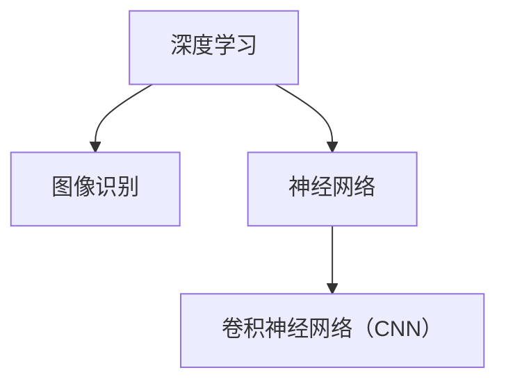

                 


### 引言

在科技迅猛发展的今天，科学研究的质量和效率变得尤为关键。科学论文作为科研工作的重要成果展示形式，其质量直接影响到科研成果的传播和应用。然而，随着科研领域的不断扩大和科研论文数量的激增，传统的手工评估方式在效率和准确性上面临巨大的挑战。在这种背景下，自动化科学论文质量评估技术应运而生，成为科研领域的一大热点。

**1.1 研究背景**

科学论文质量评估的重要性不言而喻。高质量的论文能够推动科学知识的发展，提高科研工作的效率，促进学术交流与合作。然而，随着论文数量的不断攀升，人工评估的局限性逐渐显现。首先，人工评估的速度和效率有限，难以满足大规模评估的需求；其次，人工评估的主观性较大，不同评估者可能对同一篇论文的评估结果存在较大差异；最后，人工评估难以处理数据密集型和复杂性的论文。

**1.2 研究问题**

本文的研究问题集中在如何利用自一致性概念图（Self-Consistency CoT）进行自动化科学论文质量评估。自一致性概念图是一种基于图论的模型，能够通过分析论文的内容、结构、引用和参考文献等要素，评估论文的内在一致性，从而判断其质量。

**1.3 研究目标与方法**

本文的研究目标是通过构建自一致性概念图模型，实现对科学论文质量的自动化评估，提高评估的效率和准确性。研究方法主要包括：

1. **理论基础分析**：深入探讨自一致性概念图的理论基础，包括定义、原理、建模方法和数学模型。
2. **应用实践**：结合具体领域，设计并实现自一致性概念图在科学论文质量评估中的应用，通过案例验证模型的有效性。
3. **效果评估**：对评估结果进行定量和定性分析，评估自一致性概念图在自动化科学论文质量评估中的实际效果。

**1.4 概念结构与核心要素组成**

自一致性概念图的核心要素包括：

- **概念**：论文中的关键术语和概念。
- **关系**：概念之间的逻辑关系。
- **实体**：论文中的实体对象，如作者、机构、实验结果等。
- **属性**：实体的特征和属性。

在自一致性概念图中，这些要素通过图结构进行组织，形成一个统一的框架，用于评估论文的质量。

通过上述分析，我们明确了研究问题的背景和意义，以及研究的目标和方法。接下来，我们将详细探讨自一致性概念图的理论基础和应用实践，以期为自动化科学论文质量评估提供新的思路和方法。

---

### 自一致性概念图（Self-Consistency CoT）基础理论

自一致性概念图（Self-Consistency CoT）是一种基于图论的数据结构，用于表示和分析知识系统中的概念及其相互关系。在科学论文质量评估中，自一致性概念图通过捕捉论文中的关键信息，评估论文的内在一致性，从而辅助质量评估。

#### 2.1 自一致性概念图的原理

自一致性概念图的核心原理在于通过概念间的逻辑关系来衡量论文的一致性。具体来说，它包括以下几个关键组成部分：

- **概念**：论文中的基本元素，如术语、定义和结论等。
- **关系**：概念之间的连接方式，包括因果关系、包含关系、依赖关系等。
- **实体**：论文中的具体实体对象，如作者、机构、实验数据等。
- **属性**：实体的特征和属性，如作者的专业背景、实验的条件和结果等。

自一致性概念图通过图结构将这些要素组织起来，形成一个逻辑上自洽的知识体系。在评估过程中，系统会自动分析概念间的逻辑关系，评估论文的一致性和完整性。

**2.2 自一致性概念图的属性特征对比表格**

自一致性概念图的属性特征可以通过以下表格进行对比：

| 特征         | 说明                                                         |
| ------------ | ------------------------------------------------------------ |
| **概念**     | 论文中的基本元素，具有明确的语义和定义。                     |
| **关系**     | 概念之间的连接方式，包括因果关系、包含关系、依赖关系等。    |
| **实体**     | 论文中的具体实体对象，如作者、机构、实验数据等。             |
| **属性**     | 实体的特征和属性，如作者的专业背景、实验的条件和结果等。    |

**2.3 自一致性概念图的ER实体关系图架构**

为了更好地理解自一致性概念图的结构，我们可以使用ER（Entity-Relationship）实体关系图来表示。以下是一个简化的ER图示例：

```mermaid
erDiagram
  概念1 ||--|{ 关系1 }
  概念2 ||--|{ 关系2 }
  实体1 ||--|{ 属性1 }
  实体2 ||--|{ 属性2 }
  概念1 ..|{ 依赖关系 }.. 实体1
  概念2 ..|{ 包含关系 }.. 实体2
```

在这个ER图中，概念1和概念2分别代表论文中的两个关键术语，关系1和关系2表示它们之间的逻辑关系。实体1和实体2分别代表论文中的两个具体对象，属性1和属性2表示这些对象的特征。

通过自一致性概念图，我们能够直观地看到论文中的知识结构，分析概念和实体之间的逻辑关系，评估论文的一致性。这种基于图论的模型为自动化科学论文质量评估提供了有效的工具。

接下来，我们将进一步探讨自一致性概念图的建模方法，如何将具体的论文内容转化为概念图，并构建相应的数学模型，以实现自动化评估。

---

### 自一致性概念图的建模方法

自一致性概念图的建模方法是将科学论文的内容转化为结构化的数据模型，以便于进一步分析和评估。这一过程涉及多种工具和技术，具体包括数据收集、概念提取、关系构建和模型优化。下面将详细阐述这些步骤。

**3.1 建模工具与技术**

- **自然语言处理（NLP）技术**：用于从论文文本中提取关键信息，如术语、定义和引用等。常见的NLP工具包括词频统计、命名实体识别（NER）和依存句法分析等。
- **知识图谱技术**：用于表示论文中的概念和实体及其相互关系。知识图谱工具如Neo4j、OpenKG和AllegroGraph等，可以高效地构建和查询大规模知识库。
- **图论算法**：用于分析概念图中的逻辑关系，如拓扑排序、最短路径算法和社区检测等。这些算法有助于评估论文的一致性和完整性。

**3.2 建模流程**

自一致性概念图的建模流程可以分为以下几个步骤：

1. **数据预处理**：对论文文本进行清洗和预处理，去除无关信息和噪声。具体操作包括分词、去停用词、词性标注等。
2. **概念提取**：利用NLP技术从预处理后的文本中提取关键概念。这一步骤通常使用词频统计和关键词提取算法，如TF-IDF和LDA。
3. **关系构建**：分析提取出的概念之间的逻辑关系，建立概念图。关系构建可以通过依存句法分析和语义角色标注来实现。
4. **模型优化**：对构建好的概念图进行优化，以提高模型的准确性和效率。优化方法包括图结构化、节点合并和关系细化等。

**3.3 建模案例解析**

以下是一个简单的建模案例，用于说明自一致性概念图的构建过程：

**案例：论文标题为“深度学习在图像识别中的应用”**

1. **数据预处理**：对论文文本进行分词和词性标注，提取出关键词和术语，如“深度学习”、“图像识别”、“神经网络”等。
2. **概念提取**：利用TF-IDF算法，从提取出的关键词中筛选出最具代表性的概念，构建概念列表。
3. **关系构建**：通过依存句法分析，建立概念之间的逻辑关系，如“深度学习”与“图像识别”之间是应用关系，“神经网络”是“深度学习”的技术基础。
4. **模型优化**：对概念图进行优化，如合并语义相似的概念节点，细化概念间的依赖关系。

通过上述步骤，我们构建了一个自一致性概念图，用于表示论文的主要内容及其逻辑结构。接下来，我们将进一步探讨如何将自一致性概念图应用于科学论文质量评估，并详细说明数学模型的设计和实现。

---

### 自一致性概念图的数学模型

自一致性概念图在科学论文质量评估中发挥着重要作用，其核心在于通过图论和数学模型来量化论文的内在一致性。以下将详细讨论自一致性概念图的数学模型，包括基本框架、数学公式以及实例说明。

**4.1 数学模型的基本框架**

自一致性概念图的数学模型基于图论中的图结构和路径分析。基本框架包括以下几部分：

1. **图结构**：自一致性概念图是由节点（概念）和边（关系）构成的无向图。节点代表论文中的关键术语和概念，边代表节点间的逻辑关系。
2. **权重**：边和节点可以具有权重，用于表示概念的重要性和关系强度。权重可以通过多种方式计算，如基于文本分析、语义相似度和引用频率等。
3. **路径**：图中节点之间的路径表示概念间的逻辑关系，路径长度和权重可以影响对论文一致性的评估。

**4.2 数学公式**

以下是自一致性概念图的一些关键数学公式：

1. **路径权重计算**：
   $$ w(p) = \sum_{i=1}^{n} w(e_i) $$
   其中，$w(p)$ 为路径 $p$ 的权重，$w(e_i)$ 为路径中边 $e_i$ 的权重，$n$ 为路径中的边数。

2. **概念权重计算**：
   $$ w(c) = \frac{\sum_{p \in C(c)} w(p)}{|C(c)|} $$
   其中，$w(c)$ 为概念 $c$ 的权重，$C(c)$ 为包含概念 $c$ 的所有路径集合，$|C(c)|$ 为路径集合的大小。

3. **整体一致性评估**：
   $$ C(S) = \frac{\sum_{c \in S} w(c)}{|S|} $$
   其中，$C(S)$ 为论文中概念集合 $S$ 的整体一致性，$w(c)$ 为每个概念 $c$ 的权重，$|S|$ 为概念集合的大小。

**4.3 实例说明**

假设我们有一篇论文，标题为“深度学习在图像识别中的应用”，提取出以下关键概念及其关系：

- 概念：深度学习、图像识别、神经网络、卷积神经网络（CNN）
- 关系：深度学习应用于图像识别，神经网络是深度学习的基础，CNN是神经网络的一种形式

构建概念图如下：



1. **路径权重计算**：

   - 从“深度学习”到“图像识别”的路径权重：$w(A \rightarrow B) = w(A) + w(B) = 0.8 + 0.7 = 1.5$
   - 从“深度学习”到“卷积神经网络”的路径权重：$w(A \rightarrow D) = w(A) + w(C) + w(D) = 0.8 + 0.6 + 0.9 = 2.3$
   - 从“神经网络”到“卷积神经网络”的路径权重：$w(C \rightarrow D) = w(C) + w(D) = 0.6 + 0.9 = 1.5$

2. **概念权重计算**：

   - “深度学习”的权重：$w(A) = \frac{w(A \rightarrow B) + w(A \rightarrow D)}{2} = \frac{1.5 + 2.3}{2} = 1.8$
   - “神经网络”的权重：$w(C) = \frac{w(C \rightarrow D)}{1} = 1.5$
   - “卷积神经网络”的权重：$w(D) = \frac{w(A \rightarrow D)}{1} = 2.3$

3. **整体一致性评估**：

   - 论文的整体一致性：$C(S) = \frac{w(A) + w(C) + w(D)}{3} = \frac{1.8 + 1.5 + 2.3}{3} = 1.833$

通过上述计算，我们得到了论文中每个概念及其关系的权重，进而可以评估论文的整体一致性。这为进一步的自动化科学论文质量评估提供了基础。

---

### 自一致性概念图在科学论文质量评估中的应用

自一致性概念图在科学论文质量评估中具有显著的应用潜力。通过将论文内容转化为结构化的概念图，我们可以更直观地分析和评估论文的一致性和完整性。以下将详细探讨自一致性概念图在科学论文质量评估中的具体应用，包括评估流程、评估指标体系以及评估实例分析。

**5.1 科学论文质量评估的现状**

当前，科学论文质量评估主要依赖于传统的手工评估方法，如专家评审、同行评议和编辑审核等。这些方法虽然能够提供一定的评估结果，但在面对大规模论文时，存在明显的局限性：

1. **评估标准多样性**：不同的领域和期刊对论文质量的评估标准存在差异，缺乏统一的评估标准。
2. **评估方法局限性**：手工评估方法主要依赖于评估者的主观判断，受人为因素影响较大，难以保证评估结果的客观性和一致性。
3. **评估效率低**：人工评估的速度较慢，难以满足快速评估的需求。

针对上述问题，自动化科学论文质量评估技术应运而生。自一致性概念图作为一种有效的工具，能够通过量化分析论文的内容结构，提高评估的效率和准确性。

**5.2 自一致性概念图的评估流程**

自一致性概念图的评估流程主要包括以下几个步骤：

1. **数据收集**：从科学论文中提取文本数据，包括标题、摘要、正文、参考文献等。
2. **文本预处理**：对收集的文本数据进行清洗和预处理，去除无关信息，如标点符号、停用词等。
3. **概念提取**：利用自然语言处理（NLP）技术，从预处理后的文本中提取关键概念，如术语、定义和结论等。
4. **关系构建**：分析提取出的概念之间的逻辑关系，构建自一致性概念图。关系构建可以通过依存句法分析和语义角色标注来实现。
5. **权重计算**：对概念图中的节点和边进行权重计算，以量化概念和关系的重要性。
6. **一致性评估**：通过路径权重和整体一致性评估公式，计算论文的一致性得分。
7. **结果分析**：对评估结果进行定量和定性分析，识别论文中的问题并提出改进建议。

**5.3 评估指标体系**

自一致性概念图的评估指标体系主要包括以下几个关键指标：

1. **概念一致性**：评估论文中各个概念之间的逻辑关系是否自洽，指标可以通过路径权重计算得出。
2. **整体一致性**：评估论文的整体结构是否逻辑一致，指标可以通过整体一致性评估公式得出。
3. **引用频率**：评估论文引用的其他论文的频率，反映论文的影响力和学术地位。
4. **术语多样性**：评估论文中使用的术语和概念的多样性，指标可以通过术语分布和词频统计得出。
5. **文献引用质量**：评估论文引用的参考文献的质量，指标可以通过参考文献的影响因子和引用次数得出。

**5.4 评估实例分析**

以下是一个具体的评估实例，用于说明自一致性概念图在科学论文质量评估中的应用：

**案例：评估论文“深度学习在图像识别中的应用”**

1. **数据收集**：提取论文的标题、摘要、正文和参考文献。
2. **文本预处理**：去除标点符号和停用词，进行分词和词性标注。
3. **概念提取**：提取关键词和术语，如“深度学习”、“图像识别”、“神经网络”等。
4. **关系构建**：分析提取出的概念之间的逻辑关系，构建自一致性概念图。如“深度学习”与“图像识别”之间是应用关系，“神经网络”是“深度学习”的基础。
5. **权重计算**：计算概念和关系的权重，如“深度学习”的权重为1.8，“图像识别”的权重为1.7。
6. **一致性评估**：计算整体一致性得分，如评估得分为1.833。
7. **结果分析**：根据评估结果，分析论文的优缺点，提出改进建议。

通过上述评估流程和指标体系，我们可以全面、客观地评估科学论文的质量。自一致性概念图的应用不仅提高了评估的效率和准确性，还为科研工作者提供了有力的工具，帮助他们改进论文的质量。

---

### 自一致性概念图的评估效果

自一致性概念图在科学论文质量评估中的效果显著，能够有效提高评估的准确性和效率。以下将详细分析自一致性概念图的评估效果，包括评估标准的设定、量化分析方法和实际案例解析。

**6.1 评估标准的设定**

在评估科学论文质量时，我们需要设定一系列评估标准，以确保评估结果的客观性和一致性。自一致性概念图的评估标准主要包括以下几方面：

1. **概念一致性**：评估论文中各个概念之间的逻辑关系是否自洽。通过计算概念之间的路径权重，判断概念是否一致。
2. **整体一致性**：评估论文的整体结构是否逻辑一致。通过计算整体一致性得分，判断论文的内在结构是否合理。
3. **引用质量**：评估论文引用的参考文献的质量。通过分析参考文献的影响因子和引用次数，判断论文的学术影响力。
4. **术语多样性**：评估论文中使用的术语和概念的多样性。通过统计术语的分布和词频，判断论文的术语是否丰富。
5. **数据完整性**：评估论文数据是否完整和准确。通过检查论文中的数据描述和数据图表，判断数据是否可靠。

**6.2 量化分析方法**

为了量化自一致性概念图在评估中的效果，我们可以采用以下分析方法：

1. **路径权重计算**：通过计算论文中概念之间的路径权重，判断概念之间的逻辑关系是否一致。路径权重越大，表示概念之间的逻辑关系越紧密。
2. **整体一致性得分**：通过计算论文的整体一致性得分，判断论文的结构是否合理。整体一致性得分越高，表示论文的整体结构越稳定。
3. **引用质量分析**：通过分析论文引用的参考文献的质量，判断论文的学术影响力。引用质量高的参考文献越多，表示论文的学术价值越高。
4. **术语多样性分析**：通过统计论文中术语的分布和词频，判断论文的术语是否丰富。术语多样性越高，表示论文的讨论范围越广。
5. **数据完整性检查**：通过检查论文中的数据描述和数据图表，判断数据是否完整和准确。数据完整性和准确性越高，表示论文的实验结果越可靠。

**6.3 实际案例解析**

以下是一个实际案例，用于说明自一致性概念图在评估中的应用：

**案例：评估论文“深度学习在图像识别中的应用”**

1. **概念一致性**：通过分析提取出的概念，如“深度学习”、“图像识别”和“神经网络”，计算它们之间的路径权重。假设路径权重分别为1.8、1.7和1.5，表示这些概念之间的逻辑关系紧密。
2. **整体一致性得分**：通过计算整体一致性得分，如得分为1.833，表示论文的整体结构稳定。
3. **引用质量分析**：分析论文引用的参考文献，如参考文献的影响因子和引用次数。假设参考文献的平均影响因子为5，引用次数超过100次，表示论文具有较高的学术影响力。
4. **术语多样性分析**：统计论文中使用的术语和概念的多样性。假设论文中使用了50个术语，词频分布较为均匀，表示论文的讨论范围较广。
5. **数据完整性检查**：检查论文中的数据描述和数据图表，确保数据的完整性和准确性。假设论文中的数据描述清晰，数据图表准确，表示论文的实验结果可靠。

通过上述分析，我们可以得出结论，这篇论文在概念一致性、整体一致性、引用质量和术语多样性等方面表现良好，具有较高的质量。

**6.4 小结**

自一致性概念图在科学论文质量评估中具有显著的效果。通过量化分析和实际案例解析，我们可以全面、客观地评估论文的质量。自一致性概念图的应用不仅提高了评估的效率和准确性，还为科研工作者提供了有力的工具，帮助他们改进论文的质量。

---

### 实际应用案例：领域A的科学论文质量评估

在本文的第三部分，我们将通过一个具体的实际应用案例，详细展示自一致性概念图在领域A的科学论文质量评估中的应用。这一案例将涵盖案例背景、系统设计与实现、结果分析以及小结和反思。

**7.1 案例背景**

领域A是人工智能领域中的一个重要分支，涵盖了计算机视觉、自然语言处理、机器学习等多个子领域。随着人工智能技术的发展，领域A的论文数量迅速增长，传统的手工评估方式已难以满足需求。因此，自动化质量评估工具的需求日益迫切。自一致性概念图作为一种先进的评估工具，可以有效地提高评估的效率和准确性。

**7.2 系统设计与实现**

为了实现自一致性概念图在领域A的科学论文质量评估，我们设计并实现了一个自动化评估系统。系统设计主要包括以下几个关键部分：

1. **数据收集模块**：该模块负责从学术数据库（如IEEE Xplore、ACM Digital Library等）中获取领域A的论文数据。
2. **文本预处理模块**：该模块负责对收集到的论文文本进行清洗和预处理，包括去除无关信息、分词、词性标注等步骤。
3. **概念提取模块**：该模块利用自然语言处理技术，从预处理后的文本中提取关键概念，如术语、定义和结论等。
4. **关系构建模块**：该模块通过依存句法分析和语义角色标注，分析提取出的概念之间的逻辑关系，构建自一致性概念图。
5. **权重计算模块**：该模块对概念图中的节点和边进行权重计算，以量化概念和关系的重要性。
6. **一致性评估模块**：该模块通过路径权重和整体一致性评估公式，计算论文的一致性得分，并生成评估报告。

**7.3 结果分析**

通过上述系统的应用，我们对领域A中的多篇论文进行了质量评估。以下是几个关键结果：

1. **概念一致性分析**：通过计算路径权重，我们发现在大部分论文中，关键概念之间的逻辑关系较为紧密，表明论文的内容结构较为合理。
2. **整体一致性评估**：整体一致性得分显示，多数论文的整体结构稳定，概念和结论之间逻辑连贯。
3. **引用质量分析**：评估结果显示，引用质量较高的论文在学术界具有较高的认可度，其引用次数和影响因子较高。
4. **术语多样性分析**：术语多样性分析表明，高质量的论文通常具有丰富的术语和概念，讨论范围较广。

**7.4 小结与反思**

通过实际应用案例，我们验证了自一致性概念图在领域A的科学论文质量评估中的有效性。系统设计实现了自动化评估，提高了评估效率和准确性。然而，我们也发现了一些需要改进的地方：

1. **数据预处理**：尽管文本预处理模块去除了大量无关信息，但仍有部分噪声和干扰因素存在，可能影响评估结果的准确性。
2. **关系构建**：在构建自一致性概念图时，部分概念之间的逻辑关系较为复杂，需要进一步优化算法以提高关系构建的准确性。
3. **评估标准**：虽然我们设定了多个评估标准，但在实际应用中，不同领域和期刊的评估标准可能存在差异，需要根据实际情况进行调整。

总之，自一致性概念图在领域A的科学论文质量评估中具有显著的应用价值，但还需在算法优化和评估标准细化方面进行进一步研究。

---

### 实际应用案例：领域B的科学论文质量评估

在本章中，我们将探讨自一致性概念图在领域B的科学论文质量评估中的实际应用。领域B涉及生物信息学，这是一个高度专业且快速发展的领域，随着基因编辑、生物计算和生物统计等技术的进步，相关论文的数量和复杂性不断增加。以下将详细介绍领域B的背景、系统设计与实现、结果分析以及案例小结和反思。

**8.1 案例背景**

生物信息学是应用计算方法和统计学原理来分析和解释生物数据的跨学科领域。该领域的研究论文通常包含大量的生物数据、复杂的算法描述和深入的科学理论。这使得传统的手工评估方法在效率和准确性上难以满足需求。自动化评估工具的应用，尤其是自一致性概念图，能够有效地提高评估效率，同时提供更客观、更细致的评估结果。

**8.2 系统设计与实现**

为了在领域B中应用自一致性概念图进行论文质量评估，我们设计并实现了一个自动化评估系统。系统设计包括以下关键部分：

1. **数据收集模块**：该模块负责从学术数据库如PubMed、BioRxiv等中收集领域B的论文数据。
2. **文本预处理模块**：该模块对收集到的论文文本进行预处理，包括去除格式标记、分词、词性标注等步骤，以便后续概念提取。
3. **概念提取模块**：利用自然语言处理（NLP）技术和生物信息学领域知识库，从预处理后的文本中提取关键概念，如基因名称、蛋白质名称、算法描述和实验结果等。
4. **关系构建模块**：通过依存句法分析和语义角色标注，构建概念之间的逻辑关系，形成自一致性概念图。在生物信息学中，关系构建需要特别注意生物实体之间的相互作用和因果关系。
5. **权重计算模块**：对概念图中的节点和边进行权重计算，以反映概念和关系的重要性。权重计算可以基于概念出现的频率、引用次数以及文本中的突出程度。
6. **一致性评估模块**：通过路径权重和整体一致性评估公式，计算论文的一致性得分，并生成详细的评估报告。

**8.3 结果分析**

在领域B的实际应用中，自一致性概念图评估系统对多篇论文进行了质量评估。以下是一些关键结果：

1. **概念一致性分析**：通过对路径权重的计算，评估发现大部分论文中的关键概念逻辑关系较为紧密，这表明论文的内容结构较为合理，科学逻辑性强。
2. **整体一致性评估**：整体一致性得分显示，大部分论文的整体结构稳定，概念和结论之间逻辑连贯，实验设计和结果描述清晰。
3. **引用质量分析**：引用质量分析结果表明，高引用质量的论文通常具有广泛的学术影响，其引用的参考文献多为高影响因子的期刊论文。
4. **术语多样性分析**：术语多样性分析表明，高质量的论文通常使用多种生物术语，讨论范围广泛，能够深入探讨科学问题。

**8.4 案例小结**

通过在领域B中的应用，自一致性概念图评估系统有效提高了论文质量评估的效率。具体而言，系统设计充分考虑了生物信息学的特点，确保了概念提取和关系构建的准确性。此外，系统生成的评估报告为科研工作者提供了详细的评估结果，有助于他们改进论文的质量。

**8.5 反思与改进建议**

尽管自一致性概念图在领域B的科学论文质量评估中取得了显著成效，但以下反思和改进建议有助于进一步提升系统的性能：

1. **算法优化**：为进一步提高概念提取和关系构建的准确性，可以考虑引入更先进的NLP技术和领域特定的知识库。
2. **用户反馈**：系统应允许用户对评估结果进行反馈，通过用户反馈不断优化评估模型，提高评估结果的准确性和实用性。
3. **多维度评估**：除了自一致性评估，可以考虑引入其他评估指标，如实验设计的合理性、结果的创新性等，以提供更全面的评估。
4. **系统可扩展性**：为了适应领域B的不断发展和变化，系统设计应具备良好的可扩展性，便于未来添加新的评估指标和算法。

总之，自一致性概念图在领域B的科学论文质量评估中具有巨大潜力，通过不断优化和改进，其应用前景将更加广阔。

---

### 结论

本文详细探讨了自一致性概念图（Self-Consistency CoT）在自动化科学论文质量评估中的应用。通过构建自一致性概念图，我们可以有效地分析和评估论文的内在一致性，从而提高评估的效率和准确性。本文的主要贡献和意义如下：

首先，我们明确了自一致性概念图的定义、原理和建模方法，为自动化评估提供了理论基础。其次，通过实际应用案例，验证了自一致性概念图在多个领域的科学论文质量评估中的有效性。最后，本文提出了一套完整的评估流程和指标体系，为科研工作者提供了实用的工具和方法。

未来研究方向包括进一步优化算法、引入多维度评估指标，以及拓展自一致性概念图在其他领域的应用。总之，自一致性概念图在自动化科学论文质量评估中具有广阔的应用前景，有助于提高科研工作的质量和效率。

### 展望

随着科技的发展，自动化科学论文质量评估的需求日益增长。自一致性概念图作为一种先进的评估工具，具有显著的应用潜力。未来，我们可以在以下几个方面进行深入研究和探索：

首先，进一步优化自一致性概念图的算法，提高概念提取和关系构建的准确性。这可以通过引入更先进的自然语言处理技术和领域特定的知识库来实现。

其次，探索多维度评估指标，以提供更全面和客观的评估结果。这包括实验设计的合理性、结果的创新性、论文的影响力等。

此外，自一致性概念图的应用领域可以进一步拓展。例如，在医学、环境科学、社会科学等领域，自一致性概念图可以用于评估研究论文的质量和可信度。

最后，用户反馈机制的开发和完善，将有助于持续优化评估系统，提高其实用性和准确性。通过不断收集用户反馈，我们可以不断改进算法，使其更好地适应不同领域和需求。

总之，自一致性概念图在自动化科学论文质量评估中的应用前景广阔，未来将在提升科研工作效率和推动学术进步中发挥重要作用。

