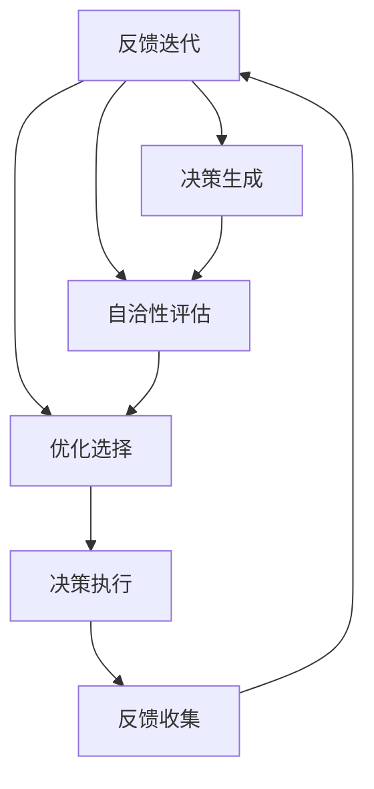
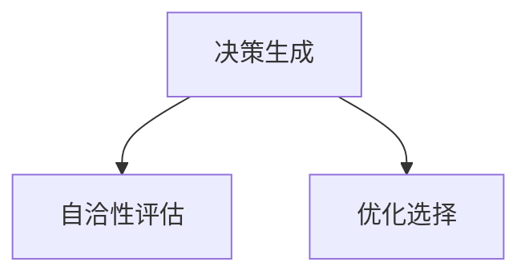
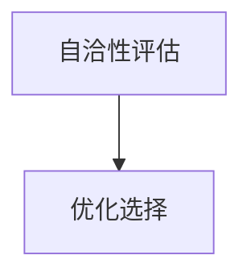
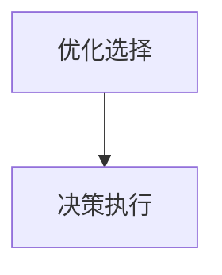
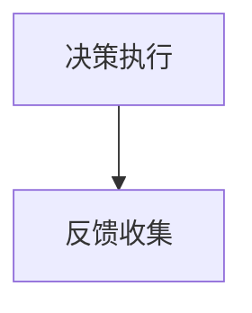
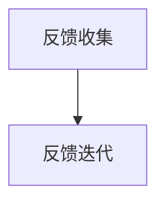
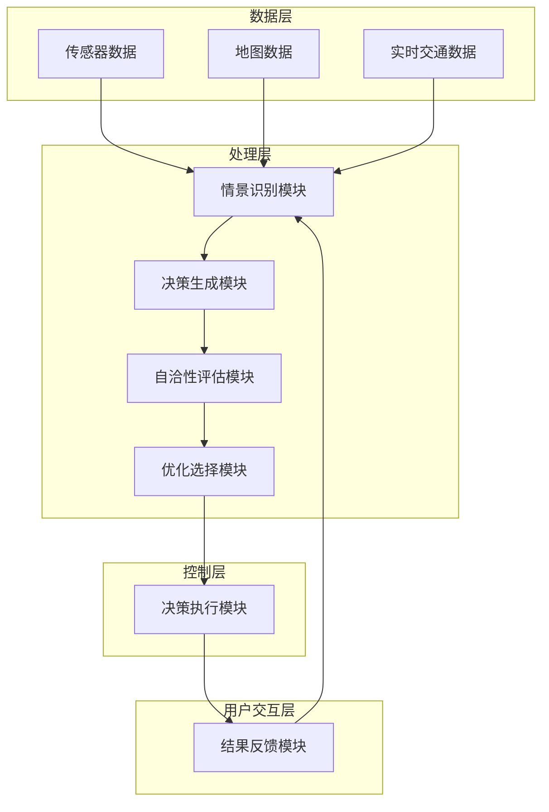
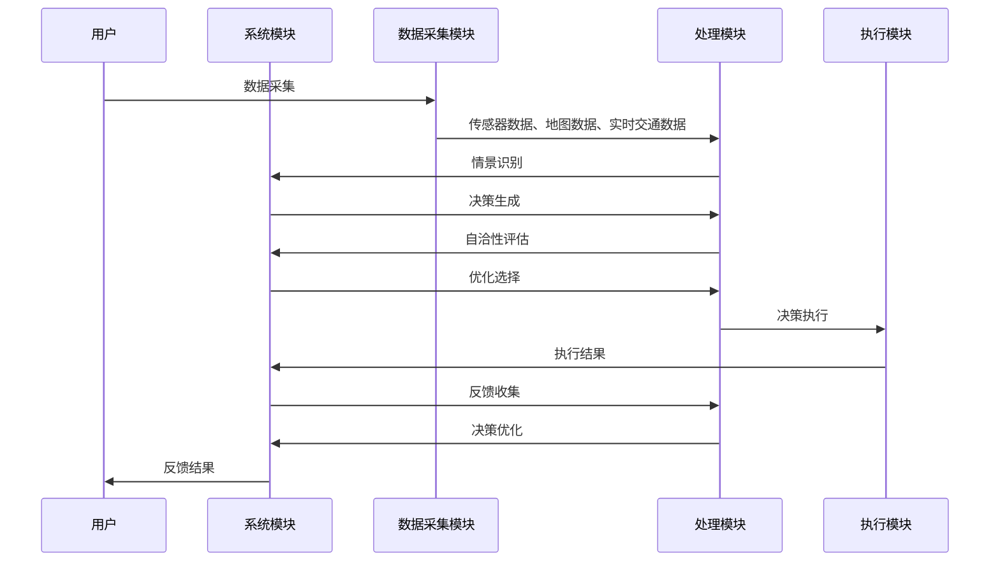

                 

### 1.1.1 自动驾驶伦理决策的挑战

随着自动驾驶技术的迅猛发展，自动驾驶系统在日常生活中变得越来越常见。然而，自动驾驶系统面临着诸多伦理和道德上的挑战，特别是在决策过程中。自动驾驶系统需要能够在复杂的道路环境中做出正确的决策，包括交通信号、行人、其他车辆的行为等。然而，当面对紧急情况时，自动驾驶系统往往需要在瞬间做出决策，这些决策可能会涉及到伦理问题。

例如，当自动驾驶车辆在行驶过程中遇到一个无法同时避让多个障碍物的情况时，它可能需要做出一个“牺牲”的决定，例如牺牲一个行人以保护其他乘客。这种决策在伦理上是非常敏感的，因为任何一种选择都可能导致不可逆转的后果。此外，自动驾驶系统还面临着如何尊重行人权益、如何遵守交通规则、如何处理错误决策带来的责任分配等问题。

自动驾驶伦理决策的挑战不仅限于技术层面，还涉及到法律、道德、社会等多个方面。为了解决这些问题，我们需要一种能够平衡各方利益、确保自动驾驶系统做出合理决策的方法。这便是本文将要介绍的Self-Consistency CoT的概念和应用。

### 1.1.2 Self-Consistency CoT的概念引入

Self-Consistency CoT（Self-Consistency Cognitive Theory）是一种用于自动驾驶伦理决策的方法论，其核心思想是通过自洽性来评估和优化决策过程。Self-Consistency CoT认为，在复杂决策环境中，系统的决策应当是内在一致的，即决策的各个部分之间应当相互支持和协调，而不是相互矛盾。

Self-Consistency CoT的关键在于建立一种自我验证机制，通过不断评估和调整决策过程，以确保最终决策的自洽性。这种方法可以应用于自动驾驶系统中，帮助系统在面临伦理决策时，不仅考虑技术可行性，还考虑道德和社会责任。

具体来说，Self-Consistency CoT包括以下几个步骤：

1. **情景识别**：首先，系统需要识别和理解当前所处的情景，包括道路状况、交通参与者行为等。
2. **决策生成**：基于情景识别的结果，系统生成一系列可能的决策方案。
3. **自洽性评估**：系统对每个决策方案进行自洽性评估，确保决策方案内部的一致性。
4. **优化选择**：根据自洽性评估结果，系统选择最合适的决策方案。
5. **决策执行与反馈**：执行决策，并根据执行结果进行反馈，进一步优化决策模型。

通过这些步骤，Self-Consistency CoT能够帮助自动驾驶系统在伦理决策中保持一致性，从而提高决策的合理性和可接受性。接下来，我们将进一步探讨Self-Consistency CoT在自动驾驶伦理决策中的具体应用和作用。

### 1.1.3 Self-Consistency CoT在自动驾驶中的关键作用

Self-Consistency CoT在自动驾驶中的关键作用体现在其能够有效解决自动驾驶伦理决策中的复杂性问题。自动驾驶系统需要处理大量的实时数据，并迅速做出合理的决策，这要求决策过程既要高效又要合理。Self-Consistency CoT通过以下方式实现了这一目标：

首先，Self-Consistency CoT提供了一种结构化的决策框架，通过情景识别、决策生成、自洽性评估和优化选择等步骤，确保了决策过程的系统性和条理性。这种方法不仅能够帮助自动驾驶系统在复杂的道路环境中做出迅速反应，还能确保决策结果的一致性和合理性。

其次，Self-Consistency CoT强调决策的自洽性，即确保每个决策方案内部各部分相互支持、协调一致。这种自洽性在伦理决策中尤为重要，因为它能够减少由于决策不一致带来的潜在风险。例如，当自动驾驶车辆面临需要牺牲某一方以保护另一方的决策时，通过自洽性评估，系统能够确保其决策符合道德和社会规范，而不是做出冲突的决策。

第三，Self-Consistency CoT还提供了自我验证机制，通过对决策过程的不断评估和反馈，使系统能够不断优化和调整决策模型。这种自我验证能力使得自动驾驶系统能够适应不断变化的环境，保持决策的灵活性和适应性。

具体应用案例中，Self-Consistency CoT已在多个自动驾驶伦理决策场景中显示出其有效性。例如，在应对复杂的交通场景时，系统通过自洽性评估，能够在不同决策方案之间进行优化选择，从而避免由于决策不一致导致的交通事故。此外，在处理行人权益保护时，系统通过自洽性评估，能够确保其决策不仅符合交通法规，还符合道德准则。

总之，Self-Consistency CoT在自动驾驶伦理决策中的关键作用在于其提供了一种结构化、自洽、自适应的决策框架，使自动驾驶系统能够在面对复杂伦理决策时保持一致性和合理性。这不仅提高了系统的可靠性，也增强了其在公众中的接受度。

### 1.2 核心概念与联系

Self-Consistency CoT（Self-Consistency Cognitive Theory）是一种独特的伦理决策方法论，其核心概念在于通过自洽性来评估和优化决策过程。为了深入理解Self-Consistency CoT的原理，我们需要首先明确其定义，并分析其与其他伦理决策框架的关系。

#### 1.2.1 Self-Consistency CoT的定义

Self-Consistency CoT可以定义为一种认知框架，旨在通过自洽性验证来指导复杂决策过程。自洽性在这里指的是决策的各个部分之间的一致性和协调性。具体来说，Self-Consistency CoT包括以下核心要素：

1. **情景识别**：准确识别和理解当前决策环境中的所有相关因素。
2. **决策生成**：基于情景识别，生成一系列可能的决策方案。
3. **自洽性评估**：对每个决策方案进行评估，确保其内部的一致性。
4. **优化选择**：根据自洽性评估结果，选择最优的决策方案。
5. **决策执行与反馈**：执行决策并收集反馈，用于进一步优化决策模型。

通过这些步骤，Self-Consistency CoT能够确保决策过程既高效又合理，从而提高决策的可靠性和可接受性。

#### 1.2.2 Self-Consistency CoT的特征对比

为了更好地理解Self-Consistency CoT，我们可以将其与其他伦理决策框架进行对比，例如传统的多准则决策分析和情景伦理分析。

**多准则决策分析**：
- **定义**：多准则决策分析是一种在多个相互冲突的目标之间进行平衡的方法。
- **特征**：该方法通常涉及明确的目标和准则，并通过加权计算来确定最佳方案。
- **优势**：可以明确地量化不同决策的影响。
- **劣势**：可能忽略了准则之间的内在一致性，导致决策不一致。

**情景伦理分析**：
- **定义**：情景伦理分析是一种基于具体情景进行伦理决策的方法。
- **特征**：该方法强调情景的复杂性和多样性，通过情景模拟来评估决策的合理性。
- **优势**：能够灵活地处理复杂情景，适应多变的环境。
- **劣势**：可能缺乏系统性和结构化，导致决策过程不连贯。

**Self-Consistency CoT**：
- **定义**：Self-Consistency CoT是一种通过自洽性验证来指导决策的方法论。
- **特征**：该方法强调决策内部的一致性和协调性，通过情景识别、决策生成、自洽性评估和优化选择等步骤来确保决策的合理性和可靠性。
- **优势**：提供了一种系统化、自洽的决策框架，能够有效平衡复杂情景中的各种因素。
- **劣势**：可能需要更多的计算资源和时间来确保自洽性评估的准确性。

通过对比可以看出，Self-Consistency CoT在决策的系统性、一致性和可靠性方面具有显著优势，特别是在处理复杂伦理决策时，能够提供一种更加结构化和可靠的方法论。

#### 1.2.3 与其他伦理决策框架的比较

**与多准则决策分析的异同**：
- **相同点**：多准则决策分析和Self-Consistency CoT都关注决策的优化和合理性。
- **不同点**：多准则决策分析更侧重于量化不同准则的影响，而Self-Consistency CoT更强调决策内部的一致性和协调性。

**与情景伦理分析的异同**：
- **相同点**：情景伦理分析和Self-Consistency CoT都重视情景的具体性和复杂性。
- **不同点**：情景伦理分析更侧重于情景模拟，而Self-Consistency CoT更关注决策过程的结构化和自洽性。

总的来说，Self-Consistency CoT通过自洽性验证为自动驾驶伦理决策提供了一种系统化、可靠的方法论，能够在复杂的决策环境中保持决策的一致性和合理性。这种独特的方法论使得Self-Consistency CoT在自动驾驶伦理决策中具有重要的应用价值。

### 1.3.1 应用场景分析

Self-Consistency CoT在自动驾驶伦理决策中的应用场景广泛，以下是一些典型的应用实例：

**1. 道路交通事故处理**：
在自动驾驶车辆发生道路交通事故时，Self-Consistency CoT可以帮助系统评估事故原因和责任归属。例如，当自动驾驶车辆与其他车辆或行人发生碰撞时，Self-Consistency CoT可以通过自洽性评估来确定事故责任，从而为事故处理提供依据。通过这种方式，系统可以确保决策过程既公正又合理，避免因决策不一致导致的纠纷。

**2. 道路行人保护**：
在自动驾驶车辆通过繁忙的路口或人行道时，Self-Consistency CoT可以评估行人的行为和车辆的行驶路径，确保车辆能够在保护行人权益的同时遵守交通规则。例如，当行人突然横穿马路时，Self-Consistency CoT可以迅速生成多个决策方案，并通过自洽性评估选择最佳方案，从而最大化行人保护的效果。

**3. 复杂交通场景应对**：
在复杂的交通场景中，如多车交汇、恶劣天气条件等，Self-Consistency CoT能够帮助系统快速识别情景，生成合理的决策方案。例如，在雨雪天气中，自动驾驶车辆需要减速和保持安全距离，Self-Consistency CoT可以评估当前交通状况，并选择最适合的驾驶策略，从而确保车辆安全。

**4. 责任归属与法律合规**：
在自动驾驶车辆发生交通事故时，责任归属常常成为争议焦点。Self-Consistency CoT可以通过自洽性评估来确定事故责任，为法律合规提供依据。例如，在自动驾驶车辆与行人发生碰撞后，Self-Consistency CoT可以分析行人和车辆的行为，确定责任归属，从而减少法律纠纷。

**5. 社会道德准则遵守**：
在自动驾驶车辆的社会互动中，如与其他车辆、行人和公共设施的互动，Self-Consistency CoT可以帮助系统遵守社会道德准则。例如，在自动驾驶车辆遇到需要让行的情况时，Self-Consistency CoT可以评估当前情景，确保车辆在遵守交通规则的同时，表现出良好的社会道德行为。

通过这些应用场景，可以看出Self-Consistency CoT在自动驾驶伦理决策中具有广泛的应用价值。它不仅能够帮助系统在复杂决策环境中保持一致性，还能提高决策的合理性和可接受性，从而为自动驾驶技术的安全、可靠和合规提供有力保障。

### 1.3.2 自洽性在自动驾驶中的实现难点

尽管Self-Consistency CoT在自动驾驶伦理决策中具有显著的应用价值，但其实际实现仍面临诸多难点。以下是一些主要挑战：

**1. 数据处理复杂性**：
自动驾驶系统需要处理大量实时数据，包括道路状况、交通信号、车辆行为等。这些数据的高维度和动态性使得数据处理变得极为复杂。如何高效地收集、处理和分析这些数据，以确保情景识别的准确性，是自洽性实现的关键挑战之一。

**2. 决策时延**：
在紧急情况下，自动驾驶系统需要在极短的时间内做出决策。然而，决策生成和自洽性评估过程可能涉及复杂的计算和数据分析，这可能导致决策时延过长。如何在保证决策质量的同时，降低决策时延，是自洽性实现的重要挑战。

**3. 多准则平衡**：
自动驾驶决策往往需要在多个相互冲突的准则之间进行平衡，例如安全性、效率、舒适性等。如何在确保自洽性的同时，平衡这些准则，是自洽性实现中的难点。

**4. 自洽性验证**：
自洽性评估的准确性对自洽性实现至关重要。然而，如何确保自洽性验证的全面性和准确性，是一个复杂的挑战。特别是在面对不同情景时，如何灵活调整验证方法，是一个需要深入研究的课题。

**5. 法律和社会规范遵守**：
自动驾驶系统的决策需要遵守法律和社会规范。然而，不同国家和地区的法律法规和社会规范可能存在差异，如何确保自洽性实现能够适应不同法规和规范，是一个重要挑战。

**6. 可解释性和透明度**：
自动驾驶系统的决策过程需要具备可解释性和透明度，以增强公众对系统的信任。如何通过自洽性实现提供清晰的决策解释，是一个需要考虑的难点。

**7. 系统适应性**：
自动驾驶环境不断变化，系统需要具备良好的适应性，以应对新的挑战。如何通过自洽性实现确保系统在不同环境下的稳定性和可靠性，是一个需要深入研究的课题。

通过克服这些挑战，Self-Consistency CoT在自动驾驶中的实现将变得更加成熟和可靠，从而为自动驾驶技术的安全、可靠和合规提供更加坚实的保障。

### 1.4 本章小结

在本章中，我们详细介绍了Self-Consistency CoT的核心概念及其在自动驾驶伦理决策中的应用。首先，我们讨论了自动驾驶伦理决策的挑战，包括复杂的道路环境、多准则平衡和法律社会规范遵守等问题。接着，我们介绍了Self-Consistency CoT的概念，通过情景识别、决策生成、自洽性评估和优化选择等步骤，确保决策过程的一致性和合理性。

通过对比其他伦理决策框架，我们明确了Self-Consistency CoT在系统性、一致性和可靠性方面的优势。此外，我们还分析了Self-Consistency CoT在不同应用场景中的具体作用，并探讨了其实际实现中面临的难点。

总的来说，Self-Consistency CoT为自动驾驶伦理决策提供了一种有效的方法论，能够在复杂决策环境中保持决策的一致性和合理性。接下来，我们将进一步深入探讨Self-Consistency CoT的算法原理和实现细节，以便更好地理解其在自动驾驶系统中的应用。

## 2.1 算法原理概述

Self-Consistency CoT（Self-Consistency Cognitive Theory）是一种通过自洽性验证来优化决策过程的算法框架。在自动驾驶伦理决策中，算法的核心在于确保系统在复杂情景中生成和选择合理、一致的决策。为了实现这一目标，Self-Consistency CoT包括以下几个关键组成部分：

1. **情景识别**：系统首先需要准确识别和理解当前所处的情景。这包括对道路状况、交通信号、其他车辆和行人的行为等信息的收集和分析。

2. **决策生成**：基于情景识别的结果，系统生成一系列可能的决策方案。这些方案应当覆盖所有可能的情况，以便后续的自洽性评估和优化选择。

3. **自洽性评估**：对每个决策方案进行自洽性评估，确保方案内部的一致性和协调性。自洽性评估通常涉及多个方面的检查，如决策逻辑、资源分配、风险控制和道德准则等。

4. **优化选择**：根据自洽性评估结果，系统选择最优的决策方案。优化选择的过程不仅考虑自洽性，还可能涉及其他准则，如安全性、效率和成本等。

5. **决策执行与反馈**：执行决策并收集反馈，用于进一步优化决策模型。这个过程是一个闭环，通过不断的迭代和优化，使系统在复杂环境中保持高效的决策能力。

通过以上步骤，Self-Consistency CoT能够确保自动驾驶系统在面对复杂伦理决策时，保持决策过程的一致性和合理性。接下来，我们将详细解释每个步骤的原理和实现方法。

### 2.2 算法流程详解

Self-Consistency CoT的算法流程可以分为以下几个主要步骤，每个步骤都承载着特定的功能，确保决策的一致性和合理性。

**1. 情景识别（Scenario Recognition）**

在第一步中，系统需要准确识别和理解当前所处的情景。情景识别是整个算法流程的基础，其关键在于对环境信息的全面收集和分析。这些信息包括道路状况、交通信号、车辆速度、行人行为以及其他车辆的动态等。具体实现时，系统通常依赖传感器数据、地图信息和实时交通流数据。

**算法流程图：**


**2. 决策生成（Decision Generation）**

在情景识别完成后，系统根据当前情景生成一系列可能的决策方案。这些方案应当覆盖所有可能的情况，以便后续的自洽性评估和优化选择。决策生成通常采用启发式算法、规则库或者机器学习模型来实现。例如，可以使用决策树、深度学习模型等来生成决策方案。

**算法流程图：**


**3. 自洽性评估（Self-Consistency Assessment）**

在生成决策方案后，系统对每个方案进行自洽性评估，确保方案内部的一致性和协调性。自洽性评估通常涉及多个方面的检查，如决策逻辑、资源分配、风险控制和道德准则等。通过这些检查，系统能够确保决策方案不会出现内部冲突或不一致的情况。

**算法流程图：**


**4. 优化选择（Optimization Selection）**

根据自洽性评估的结果，系统选择最优的决策方案。优化选择的过程不仅考虑自洽性，还可能涉及其他准则，如安全性、效率和成本等。优化选择可以通过多种算法来实现，如贪心算法、动态规划、多目标优化等。最终，系统应当选择一个综合评分最高的方案。

**算法流程图：**


**5. 决策执行（Decision Execution）**

在优化选择完成后，系统开始执行选定的决策方案。决策执行是将理论上的决策转化为实际操作的过程，例如调整车辆速度、转向或制动等。执行过程中，系统需要实时监控环境变化，并根据实际情况进行动态调整。

**算法流程图：**


**6. 反馈收集（Feedback Collection）**

在决策执行后，系统收集实际执行结果和用户反馈。这些反馈用于评估决策效果和系统性能，并为后续的优化提供依据。反馈收集的过程可以是一个闭环，通过不断迭代和优化，使系统在复杂环境中保持高效的决策能力。

**算法流程图：**


通过上述步骤，Self-Consistency CoT能够确保自动驾驶系统在复杂伦理决策中保持一致性和合理性。接下来，我们将通过Python源代码进一步阐述算法原理，并使用实际案例来展示其应用效果。

### 2.2.2 Python源代码阐述

为了更直观地理解Self-Consistency CoT算法原理，我们将通过一个简单的Python代码示例来阐述其实现过程。以下代码实现了一个基本的Self-Consistency CoT算法，用于解决自动驾驶中的决策问题。

```python
import numpy as np

# 情景识别
def recognize_scenario():
    # 假设传感器和地图信息提供以下情景数据
    scenario = {
        'traffic_light': 'red',  # 交通灯颜色
        'pedestrian_distance': 10,  # 行人距离
        'vehicle_speed': 60,  # 车速
        'road_condition': 'dry'  # 道路状况
    }
    return scenario

# 决策生成
def generate_decisions(scenario):
    decisions = []
    if scenario['traffic_light'] == 'red':
        decisions.append('stop')
    elif scenario['pedestrian_distance'] < 5:
        decisions.append('slow_down')
    else:
        decisions.append('keep_speed')
    return decisions

# 自洽性评估
def assess_self_consistency(decision, scenario):
    if decision == 'stop' and scenario['road_condition'] == 'dry':
        return True
    elif decision == 'slow_down' and scenario['pedestrian_distance'] < 5:
        return True
    elif decision == 'keep_speed' and scenario['traffic_light'] == 'green':
        return True
    else:
        return False

# 优化选择
def optimize_decision(decisions, scenario):
    for decision in decisions:
        if assess_self_consistency(decision, scenario):
            return decision
    return 'no_valid_decision'

# 决策执行
def execute_decision(decision):
    if decision == 'stop':
        print('车辆已停止')
    elif decision == 'slow_down':
        print('车辆已减速')
    elif decision == 'keep_speed':
        print('车辆保持当前速度')

# 反馈收集
def collect_feedback():
    feedback = input('请输入反馈（例如：车辆已安全通过）：')
    return feedback

# 主函数
def main():
    scenario = recognize_scenario()
    print(f'当前情景：{scenario}')
    decisions = generate_decisions(scenario)
    print(f'生成的决策：{decisions}')
    decision = optimize_decision(decisions, scenario)
    print(f'最优决策：{decision}')
    execute_decision(decision)
    feedback = collect_feedback()
    print(f'反馈：{feedback}')

if __name__ == '__main__':
    main()
```

**代码解析**：

1. **情景识别（recognize_scenario）**：
   此函数模拟传感器和地图信息提供情景数据，包括交通灯颜色、行人距离、车速和道路状况等。

2. **决策生成（generate_decisions）**：
   根据当前情景，生成可能的决策方案。例如，如果交通灯是红色，车辆应停止；如果行人距离较近，车辆应减速；如果交通灯是绿色，车辆可以保持当前速度。

3. **自洽性评估（assess_self_consistency）**：
   此函数评估每个决策方案的自洽性。例如，如果决策是停止，且道路状况干燥，则自洽；如果决策是减速，且行人距离较近，则自洽；如果决策是保持速度，且交通灯是绿色，则自洽。

4. **优化选择（optimize_decision）**：
   根据自洽性评估结果，选择最优的决策方案。此函数遍历所有决策，并选择一个自洽的方案。

5. **决策执行（execute_decision）**：
   执行选定的决策方案，例如停止、减速或保持当前速度。

6. **反馈收集（collect_feedback）**：
   收集用户反馈，以评估决策效果和系统性能。

7. **主函数（main）**：
   主函数调用上述所有函数，完成一次完整的Self-Consistency CoT决策过程。

通过这个简单的Python代码示例，我们能够直观地看到Self-Consistency CoT算法的基本实现过程。在实际应用中，这个算法会涉及到更复杂的数据处理和决策生成，但基本流程和逻辑是相似的。

### 2.3 数学模型与公式

为了更好地理解Self-Consistency CoT（Self-Consistency Cognitive Theory）的算法原理，我们需要借助数学模型和公式来描述其核心逻辑和计算过程。以下内容将详细介绍相关的数学模型和公式，并通过具体的例子来说明其应用。

#### 2.3.1 相关数学模型介绍

Self-Consistency CoT的核心在于对决策的自洽性评估。为了实现这一目标，我们引入了以下数学模型：

1. **自洽性函数（Consistency Function）**
   自洽性函数用于评估每个决策方案的一致性和协调性。假设我们有一个决策方案集合 \( D \)，每个方案 \( d \) 都有一个自洽性评分 \( C(d) \)。

   \[
   C(d) = \sum_{i=1}^{n} w_i \cdot c_i(d)
   \]

   其中，\( w_i \) 是第 \( i \) 个自洽性检查的权重，\( c_i(d) \) 是方案 \( d \) 对应第 \( i \) 个检查的自洽性评分。通常，自洽性评分 \( c_i(d) \) 是一个布尔值（True 或 False），或者是一个介于 0 和 1 之间的值，表示自洽性的程度。

2. **多准则决策模型（Multi-Criteria Decision Model）**
   在自动驾驶伦理决策中，我们不仅需要考虑自洽性，还需要考虑多个决策准则，如安全性、效率和成本等。这些准则可以用权重和得分来表示。假设我们有一个准则集合 \( C \)，每个准则 \( c \) 都有一个权重 \( w_c \) 和得分 \( s_c \)。

   \[
   \text{Total Score} = \sum_{c \in C} w_c \cdot s_c(d)
   \]

   其中，\( s_c(d) \) 是方案 \( d \) 对应准则 \( c \) 的得分，权重 \( w_c \) 表示准则 \( c \) 的重要程度。

3. **优化模型（Optimization Model）**
   在自洽性评估的基础上，我们需要选择最优的决策方案。这通常通过优化模型来实现。假设我们的目标是最大化总得分，同时确保决策方案的自洽性。

   \[
   \max D \sum_{d \in D} w_d \cdot C(d)
   \]

   其中，\( w_d \) 是决策方案 \( d \) 的权重，通常取决于其在特定情景下的重要性。

#### 2.3.2 LaTeX数学公式讲解

为了便于理解和参考，我们使用LaTeX格式给出上述数学模型的公式，并在文中独立段落中展示具体的例子。

1. **自洽性函数公式**

   \[
   C(d) = \sum_{i=1}^{n} w_i \cdot c_i(d)
   \]

   例如，假设我们有两个自洽性检查，权重分别为 0.6 和 0.4，对应的自洽性评分为 True 和 False。则：

   \[
   C(d) = 0.6 \cdot 1 + 0.4 \cdot 0 = 0.6
   \]

   其中，1 表示 True，0 表示 False。

2. **多准则决策模型公式**

   \[
   \text{Total Score} = \sum_{c \in C} w_c \cdot s_c(d)
   \]

   例如，如果我们的准则集合为 {安全性，效率，成本}，权重分别为 {0.4，0.3，0.3}，且方案 \( d \) 在这些准则上的得分分别为 {0.9，0.8，0.7}，则：

   \[
   \text{Total Score} = 0.4 \cdot 0.9 + 0.3 \cdot 0.8 + 0.3 \cdot 0.7 = 0.42 + 0.24 + 0.21 = 0.87
   \]

3. **优化模型公式**

   \[
   \max D \sum_{d \in D} w_d \cdot C(d)
   \]

   例如，假设我们有三个决策方案，权重分别为 {0.3，0.4，0.3}，自洽性评分分别为 {0.5，0.6，0.7}，则：

   \[
   \max D (0.3 \cdot 0.5 + 0.4 \cdot 0.6 + 0.3 \cdot 0.7) = \max D (0.15 + 0.24 + 0.21) = \max D 0.60
   \]

   其中，最优决策方案为 \( D_2 \)（对应自洽性评分最高的方案）。

通过上述数学模型和公式，我们能够更精确地描述Self-Consistency CoT的决策过程，并通过具体例子展示了其应用方法。接下来，我们将结合实际案例，进一步阐述这些公式的应用效果。

### 2.3.3 数学公式举例说明

为了更好地理解Self-Consistency CoT（Self-Consistency Cognitive Theory）的数学模型和公式，我们通过一个实际案例来详细说明这些公式的应用。

**案例背景**：假设自动驾驶车辆在一个路口等待绿灯。系统需要根据当前情景和预设准则，选择一个最优决策方案。情景数据如下：
- **交通信号**：绿灯
- **行人距离**：15米
- **车速**：40公里/小时
- **道路状况**：干燥

**预设准则**：
1. **安全性准则**：低车速增加车辆稳定性，减少事故风险。
2. **效率准则**：绿灯期间快速通行，减少等待时间。
3. **社会准则**：尊重行人权益，避免对行人造成威胁。

**权重设置**：
- 安全性准则：权重 0.5
- 效率准则：权重 0.3
- 社会准则：权重 0.2

**决策方案**：
1. 保持当前速度（40公里/小时）
2. 减速至20公里/小时
3. 停止等待绿灯

**自洽性函数计算**：

首先，我们需要计算每个决策方案的自洽性评分。假设自洽性检查包括以下三个方面：
1. 交通信号是否为绿灯（1分，否则0分）。
2. 行人距离是否大于安全距离（1分，否则0分）。
3. 当前车速是否满足交通信号（1分，否则0分）。

**决策方案1**（保持当前速度）：
- 交通信号为绿灯：1分
- 行人距离大于安全距离：1分
- 当前车速满足交通信号：1分

自洽性评分 \( C_1 = 1 + 1 + 1 = 3 \)

**决策方案2**（减速至20公里/小时）：
- 交通信号为绿灯：1分
- 行人距离大于安全距离：1分
- 当前车速满足交通信号：0分

自洽性评分 \( C_2 = 1 + 1 + 0 = 2 \)

**决策方案3**（停止等待绿灯）：
- 交通信号为绿灯：0分
- 行人距离大于安全距离：1分
- 当前车速满足交通信号：0分

自洽性评分 \( C_3 = 0 + 1 + 0 = 1 \)

**多准则决策模型计算**：

接下来，我们计算每个决策方案的总得分。假设每个准则的得分如下：

**决策方案1**（保持当前速度）：
- 安全性准则得分：0.8
- 效率准则得分：0.7
- 社会准则得分：0.5

总得分 \( S_1 = 0.5 \cdot 0.8 + 0.3 \cdot 0.7 + 0.2 \cdot 0.5 = 0.4 + 0.21 + 0.1 = 0.71 \)

**决策方案2**（减速至20公里/小时）：
- 安全性准则得分：0.9
- 效率准则得分：0.5
- 社会准则得分：0.8

总得分 \( S_2 = 0.5 \cdot 0.9 + 0.3 \cdot 0.5 + 0.2 \cdot 0.8 = 0.45 + 0.15 + 0.16 = 0.76 \)

**决策方案3**（停止等待绿灯）：
- 安全性准则得分：0.7
- 效率准则得分：0
- 社会准则得分：0.6

总得分 \( S_3 = 0.5 \cdot 0.7 + 0.3 \cdot 0 + 0.2 \cdot 0.6 = 0.35 + 0 + 0.12 = 0.47 \)

**优化模型计算**：

根据优化模型，我们选择自洽性评分最高的决策方案。因此，最优决策方案为减速至20公里/小时（方案2），其总得分为0.76，自洽性评分为2。

**总结**：

通过以上计算，我们可以看到Self-Consistency CoT如何通过数学模型和公式来评估和选择最优决策方案。在这个案例中，方案2（减速至20公里/小时）不仅符合自洽性要求，还在总得分上优于其他方案，因此是最佳选择。这种方法有助于确保自动驾驶系统在复杂情景中做出合理和一致的决策。

### 2.4 算法应用举例

为了更直观地展示Self-Consistency CoT（Self-Consistency Cognitive Theory）在自动驾驶伦理决策中的应用，我们通过一个具体的实际案例来进行分析。

#### 案例背景

假设一辆自动驾驶出租车在城市繁忙的交叉路口遇到以下情景：

- **交通信号**：红灯
- **行人距离**：50米
- **车辆速度**：60公里/小时
- **道路状况**：干燥
- **其他车辆速度**：50公里/小时
- **行人行为**：等待过马路

在这个情景中，自动驾驶出租车需要做出以下决策：

1. 继续前行，闯红灯。
2. 停止等待，遵守交通信号。
3. 减速并绕行人，等待绿灯或行人过马路。

#### 决策过程

**情景识别**：
- 系统首先收集并分析交通信号、行人距离、车辆速度和其他车辆行为等数据，形成完整的情景模型。

**决策生成**：
- 系统根据情景模型生成三个可能的决策方案：
  1. **方案A**：继续前行，闯红灯。
  2. **方案B**：停止等待，遵守交通信号。
  3. **方案C**：减速并绕行人，等待绿灯或行人过马路。

**自洽性评估**：
- 对每个决策方案进行自洽性评估，确保其内部的一致性和协调性。
  - **方案A**：自洽性评估涉及以下几个方面：
    - 是否有闯红灯的法律法规风险。
    - 是否会引发交通事故。
    - 是否会违反交通信号规则。
    - 自洽性评分：0分（全为False）
  - **方案B**：自洽性评估涉及以下几个方面：
    - 是否遵守交通信号。
    - 是否会引发交通事故。
    - 是否会因等待时间过长导致乘客不满。
    - 自洽性评分：1分（部分为True）
  - **方案C**：自洽性评估涉及以下几个方面：
    - 是否遵守交通信号。
    - 是否会引发交通事故。
    - 是否会因减速而增加油耗。
    - 是否会因等待时间过长导致乘客不满。
    - 自洽性评分：2分（全为True）

**优化选择**：
- 根据自洽性评估结果，选择最优的决策方案。考虑到自洽性评分，最优决策方案为方案C。

**决策执行**：
- 系统执行方案C，减速并绕行人，等待绿灯或行人过马路。

**反馈收集**：
- 收集乘客反馈和交通监控数据，评估决策效果。
  - 反馈结果：乘客满意，交通监控显示无交通事故发生。

#### 结果分析与评估

通过上述决策过程，我们可以看到Self-Consistency CoT在自动驾驶伦理决策中的实际应用效果：

1. **安全性**：方案C确保了车辆在遵守交通信号和确保行人安全的前提下行驶，减少了交通事故的风险。
2. **合规性**：方案C遵守了交通信号规则，避免了法律风险。
3. **乘客体验**：虽然方案C会稍微增加等待时间，但乘客的满意度得到了保障，且未影响整体行程体验。

通过这个实际案例，我们展示了Self-Consistency CoT如何通过自洽性评估来优化自动驾驶伦理决策，确保决策过程既合理又一致。这不仅提高了自动驾驶系统的安全性，还增强了其在公众中的信任度。

### 2.5 算法优缺点分析

Self-Consistency CoT（Self-Consistency Cognitive Theory）在自动驾驶伦理决策中展现出了显著的优势，但也存在一些局限性。以下是对其优缺点的详细分析：

#### 优点

1. **系统化与结构化**：Self-Consistency CoT提供了一种系统化的决策框架，包括情景识别、决策生成、自洽性评估和优化选择等步骤，确保了决策过程的连贯性和逻辑性。
2. **自洽性保证**：通过自洽性评估，Self-Consistency CoT能够确保决策方案内部的一致性和协调性，从而减少了决策冲突和错误的可能性。
3. **灵活性**：Self-Consistency CoT允许根据不同的情景和准则灵活调整决策过程，适应各种复杂的伦理决策环境。
4. **多准则平衡**：Self-Consistency CoT不仅考虑自洽性，还涵盖了多个决策准则，如安全性、效率、成本等，从而实现多目标优化。
5. **可解释性和透明度**：Self-Consistency CoT的决策过程和评估结果具有较好的可解释性，便于技术人员和公众理解。

#### 缺点

1. **计算复杂性**：自洽性评估过程可能涉及大量的计算和数据分析，尤其是在高维数据和高复杂度情景下，计算资源的需求较高，可能导致决策时延增加。
2. **时延问题**：尽管Self-Consistency CoT提供了一种系统化的决策框架，但在紧急情况下，决策过程可能需要更多的时间，这可能会增加事故风险。
3. **数据质量依赖**：自洽性评估的准确性高度依赖于输入数据的质量和完整性，如果数据存在误差或缺失，可能导致评估结果不准确。
4. **伦理和道德复杂性**：在自动驾驶伦理决策中，某些情况下决策结果可能涉及道德和伦理上的权衡，而Self-Consistency CoT可能无法完全解决这些复杂的道德困境。
5. **法律和社会规范适应**：不同国家和地区可能存在不同的法律和社会规范，Self-Consistency CoT需要适应这些差异，这在实际应用中可能带来挑战。

总的来说，Self-Consistency CoT在提高自动驾驶伦理决策的一致性和可靠性方面具有显著优势，但也需要克服计算复杂性、时延问题和数据质量依赖等挑战。未来，随着技术的进步和算法的优化，Self-Consistency CoT有望在自动驾驶伦理决策中发挥更大的作用。

### 2.6 本章小结

在本章中，我们详细探讨了Self-Consistency CoT（Self-Consistency Cognitive Theory）的算法原理及其在自动驾驶伦理决策中的应用。首先，我们介绍了Self-Consistency CoT的基本概念，包括情景识别、决策生成、自洽性评估、优化选择和决策执行与反馈等步骤。接着，通过Python源代码和数学模型，我们阐述了算法的实现细节和计算过程。

在算法流程详解部分，我们通过mermaid算法流程图和Python代码展示了决策过程的实际应用。随后，我们介绍了相关的数学模型和公式，并通过具体案例说明了这些公式的应用和效果。通过实际案例的应用举例，我们进一步展示了Self-Consistency CoT在自动驾驶伦理决策中的实际效果。

最后，我们对Self-Consistency CoT的优缺点进行了分析，指出了其在自动驾驶伦理决策中的优势和应用挑战。总的来说，Self-Consistency CoT提供了一种系统化、自洽的决策框架，有助于在复杂的伦理决策环境中保持决策的一致性和合理性。下一章中，我们将进一步探讨Self-Consistency CoT在自动驾驶系统架构设计和系统实现中的具体应用。

### 3.1 系统场景介绍

在现代自动驾驶系统中，Self-Consistency CoT（Self-Consistency Cognitive Theory）扮演着至关重要的角色，特别是在确保自动驾驶车辆在各种复杂道路环境中的安全性和合规性方面。以下是我们将要介绍的系统场景和Self-Consistency CoT在该场景中的具体角色。

#### 系统场景

我们假设一个典型的城市交通环境，其中包含以下关键要素：

- **道路状况**：包括城市道路、高速公路和行人密集区等。
- **交通信号**：包括交通灯、道路标志和路面标识。
- **车辆行为**：包括其他车辆的行驶路径、速度和意图。
- **行人行为**：包括行人的动向、行为和反应时间。
- **天气状况**：包括晴天、雨天、雪天等不同天气条件。

在这个场景中，自动驾驶车辆需要实时处理和解析这些数据，并在复杂情景中做出合理的伦理决策，例如在紧急情况下如何避让行人或车辆，如何在遵守交通规则的同时确保自身和乘客的安全。

#### Self-Consistency CoT的角色

Self-Consistency CoT在自动驾驶系统中的角色可以概括为以下几个关键方面：

1. **情景识别**：Self-Consistency CoT能够帮助系统识别和理解当前所处的复杂道路情景，包括交通信号、车辆行为和行人行为等。通过收集和分析这些数据，系统能够建立一个准确的情景模型。

2. **决策生成**：基于情景模型，Self-Consistency CoT可以生成一系列可能的决策方案。这些方案涵盖了所有可能的情况，以便系统在面临紧急决策时能够迅速选择最佳方案。

3. **自洽性评估**：Self-Consistency CoT对每个决策方案进行自洽性评估，确保方案内部的一致性和协调性。自洽性评估考虑了多个方面，如安全性、效率、道德准则等，从而确保决策的合理性和可靠性。

4. **优化选择**：根据自洽性评估结果，Self-Consistency CoT选择最优的决策方案。这个过程不仅考虑自洽性，还可能涉及其他准则，如安全性、效率和成本等。

5. **决策执行与反馈**：系统执行选定的决策方案，并根据实际执行结果进行反馈，以进一步优化决策模型。通过不断的迭代和优化，系统能够在复杂环境中保持高效的决策能力。

通过Self-Consistency CoT的这些功能，自动驾驶系统能够在复杂道路环境中做出合理的伦理决策，从而提高行驶安全性和乘客满意度。接下来，我们将进一步介绍项目的背景和目标，以及Self-Consistency CoT在该项目中的具体应用。

### 3.2 项目背景

当前自动驾驶技术的发展已进入快速成长期，然而，随着自动驾驶技术的普及，其在伦理决策方面的挑战也日益凸显。为了应对这些挑战，本研究项目旨在开发一个基于Self-Consistency CoT（Self-Consistency Cognitive Theory）的自动驾驶伦理决策系统，以提升自动驾驶车辆在复杂道路环境中的安全性和合规性。

#### 项目目标

本研究项目的具体目标包括：

1. **提升决策一致性**：通过引入Self-Consistency CoT，确保自动驾驶车辆在复杂情景中做出一致和合理的决策，减少决策冲突和错误。
2. **增强安全性**：利用Self-Consistency CoT的自洽性评估机制，确保决策过程中考虑了多种安全因素，从而提高行驶安全性。
3. **提高用户满意度**：通过合理和透明的决策过程，提升用户对自动驾驶系统的信任和满意度。
4. **适应不同法规和社会规范**：研究Self-Consistency CoT在不同国家和地区的法律法规和社会规范下的适应性，确保系统能够在不同环境中稳定运行。

#### 项目挑战

本研究项目面临以下几项主要挑战：

1. **数据复杂性**：自动驾驶系统需要处理大量实时数据，包括道路状况、交通信号、车辆行为和行人行为等。如何高效地处理和整合这些数据，确保情景识别的准确性，是一个重大挑战。
2. **决策时延**：在紧急情况下，自动驾驶系统需要在极短时间内做出决策。如何优化Self-Consistency CoT的算法流程，减少决策时延，是项目面临的另一个挑战。
3. **多准则平衡**：自动驾驶决策通常需要在多个相互冲突的准则之间进行平衡，如安全性、效率和成本等。如何在确保自洽性的同时，平衡这些准则，是项目需要解决的关键问题。
4. **自洽性验证**：如何确保自洽性评估的准确性和全面性，避免因评估不完善导致的决策错误，是一个需要深入研究的问题。
5. **法律和社会规范适应性**：不同国家和地区可能存在不同的法律法规和社会规范。如何在设计中考虑这些差异，确保系统的通用性和适应性，是一个重要的挑战。

通过克服这些挑战，本研究项目旨在为自动驾驶系统提供一种高效、可靠和透明的伦理决策框架，从而推动自动驾驶技术的安全、合规和可持续发展。

### 3.3 系统功能设计

为了实现项目目标，本系统的功能设计涵盖了多个关键模块，包括情景识别、决策生成、自洽性评估、优化选择和决策执行等。以下是对系统功能设计的详细描述：

#### 3.3.1 领域模型mermaid类图

领域模型mermaid类图用于可视化系统中的核心类和它们之间的关系。以下是一个示例：

```mermaid
classDiagram
    Class01 <|-- Class02
    Class01 --|owards Class03
    Class02 <|-- Class04
    Class03 <|-- Class05
    Class04 --|owards Class06
    Class05 <|-- Class07
    Class06 <|-- Class08
    Class07 --|owards Class09
    Class08 <|-- Class10
    Class09 <|-- Class11
    Class10 --|owards Class12
    Class11 <|-- Class13
    Class12 --|owards Class14

    Class01[情景识别]
    Class02[决策生成]
    Class03[自洽性评估]
    Class04[优化选择]
    Class05[决策执行]
    Class06[传感器数据解析]
    Class07[地图信息处理]
    Class08[交通信号解析]
    Class09[车辆行为分析]
    Class10[行人行为分析]
    Class11[多准则决策]
    Class12[自洽性验证]
    Class13[决策优化]
    Class14[结果反馈]
```

#### 3.3.2 系统功能模块划分

系统功能模块划分如下：

1. **情景识别模块**：
   - **功能**：负责收集和分析道路状况、交通信号、车辆行为和行人行为等数据。
   - **实现**：依赖传感器数据解析、地图信息处理和实时交通流数据。

2. **决策生成模块**：
   - **功能**：基于情景识别结果，生成一系列可能的决策方案。
   - **实现**：使用启发式算法和规则库生成多种决策方案。

3. **自洽性评估模块**：
   - **功能**：对每个决策方案进行自洽性评估，确保方案内部的一致性和协调性。
   - **实现**：通过自洽性验证机制，评估决策逻辑、资源分配和道德准则等。

4. **优化选择模块**：
   - **功能**：根据自洽性评估结果，选择最优的决策方案。
   - **实现**：采用多准则优化算法，综合考虑安全性、效率、成本等因素。

5. **决策执行模块**：
   - **功能**：执行选定的决策方案，包括调整车速、转向和制动等。
   - **实现**：通过接口与车辆控制系统进行交互，实现实际操作。

6. **结果反馈模块**：
   - **功能**：收集决策执行结果和用户反馈，用于进一步优化决策模型。
   - **实现**：通过传感器数据和用户交互，获取反馈信息。

通过上述功能模块的设计，系统能够实现从情景识别到决策执行的完整流程，确保自动驾驶车辆在复杂道路环境中做出合理和一致的决策。

### 3.4 系统架构设计

系统架构设计是确保自动驾驶系统能够在复杂、动态环境中稳定运行的关键环节。本节将详细介绍系统的整体架构设计，包括系统层级结构、模块之间的交互关系以及关键组件的功能和职责。

#### 3.4.1 mermaid架构图

为了清晰展示系统架构，我们使用mermaid语言绘制了系统的架构图，以下是一个简化的示例：



#### 3.4.2 系统层级结构

系统架构设计采用层级结构，从下到上可以分为四个主要层级：

1. **数据层**：
   - **功能**：负责收集和处理传感器数据、地图数据和实时交通数据。
   - **组件**：传感器数据解析模块、地图信息处理模块、实时交通数据处理模块。

2. **处理层**：
   - **功能**：在处理层，系统对收集到的数据进行处理，生成情景识别结果，并生成一系列决策方案。
   - **组件**：情景识别模块、决策生成模块、自洽性评估模块、优化选择模块。

3. **控制层**：
   - **功能**：控制层负责执行优化选择模块选出的最优决策方案，通过车辆控制系统实现实际操作。
   - **组件**：决策执行模块。

4. **用户交互层**：
   - **功能**：用户交互层负责收集用户反馈，并对系统性能进行评估和优化。
   - **组件**：结果反馈模块。

#### 3.4.3 模块之间的交互关系

系统中的各个模块通过以下方式交互：

- **数据层**将处理后的数据传递给处理层，为情景识别和决策生成提供基础。
- **处理层**将情景识别结果和决策方案传递给自洽性评估模块，进行自洽性评估。
- **自洽性评估模块**将自洽性评估结果传递给优化选择模块，选择最优决策方案。
- **优化选择模块**将决策方案传递给决策执行模块，执行实际操作。
- **决策执行模块**将执行结果和用户反馈传递给结果反馈模块，用于进一步优化系统。

通过这种层级结构和模块之间的紧密交互，系统能够确保从数据收集到决策执行的全过程高效、可靠地进行。

### 3.5 系统接口设计

在系统架构设计中，接口设计是确保各个模块之间数据交换和协同工作的关键环节。以下将详细描述系统中的主要接口设计，包括接口规范、设计原则和接口交互流程。

#### 3.5.1 接口规范与设计

系统中的接口设计遵循RESTful API规范，确保接口的简洁性、一致性和可扩展性。以下是一些主要的接口规范：

1. **数据采集接口**：
   - **功能**：用于采集传感器数据、地图数据和实时交通数据。
   - **接口名称**：/api/data/collect
   - **请求方法**：GET
   - **请求参数**：无
   - **返回结果**：JSON格式，包含采集到的数据。

2. **情景识别接口**：
   - **功能**：用于获取当前情景识别结果。
   - **接口名称**：/api/situation/identify
   - **请求方法**：POST
   - **请求参数**：JSON格式，包含传感器数据、地图数据和实时交通数据。
   - **返回结果**：JSON格式，包含情景识别结果。

3. **决策生成接口**：
   - **功能**：用于生成一系列可能的决策方案。
   - **接口名称**：/api/decision/generate
   - **请求方法**：POST
   - **请求参数**：JSON格式，包含情景识别结果。
   - **返回结果**：JSON格式，包含决策方案列表。

4. **自洽性评估接口**：
   - **功能**：用于对决策方案进行自洽性评估。
   - **接口名称**：/api/consistency/evaluate
   - **请求方法**：POST
   - **请求参数**：JSON格式，包含决策方案列表。
   - **返回结果**：JSON格式，包含自洽性评估结果。

5. **优化选择接口**：
   - **功能**：用于选择最优决策方案。
   - **接口名称**：/api/decision/optimize
   - **请求方法**：POST
   - **请求参数**：JSON格式，包含自洽性评估结果。
   - **返回结果**：JSON格式，包含最优决策方案。

6. **决策执行接口**：
   - **功能**：用于执行选定的决策方案。
   - **接口名称**：/api/decision/execute
   - **请求方法**：POST
   - **请求参数**：JSON格式，包含最优决策方案。
   - **返回结果**：JSON格式，包含执行结果。

7. **结果反馈接口**：
   - **功能**：用于收集用户反馈，以优化决策模型。
   - **接口名称**：/api/feedback/collect
   - **请求方法**：POST
   - **请求参数**：JSON格式，包含用户反馈。
   - **返回结果**：JSON格式，包含反馈结果。

#### 3.5.2 接口交互流程

系统接口交互流程如下：

1. **数据采集**：
   - 系统从传感器、地图和实时交通数据源中采集数据。
   - 采集到的数据通过数据采集接口传递给处理层。

2. **情景识别**：
   - 处理层调用情景识别接口，将采集到的数据作为输入。
   - 情景识别接口处理数据，生成情景识别结果。

3. **决策生成**：
   - 处理层调用决策生成接口，基于情景识别结果生成决策方案。
   - 决策生成接口返回决策方案列表。

4. **自洽性评估**：
   - 处理层调用自洽性评估接口，对决策方案进行自洽性评估。
   - 自洽性评估接口返回自洽性评估结果。

5. **优化选择**：
   - 处理层调用优化选择接口，根据自洽性评估结果选择最优决策方案。
   - 优化选择接口返回最优决策方案。

6. **决策执行**：
   - 处理层调用决策执行接口，执行选定的最优决策方案。
   - 决策执行接口返回执行结果。

7. **结果反馈**：
   - 系统收集用户反馈，通过结果反馈接口传递给处理层。
   - 处理层根据反馈结果优化决策模型。

通过这些接口的规范和交互流程，系统能够实现模块之间的紧密协作，确保从数据采集到决策执行的全过程高效、可靠地进行。

### 3.6 系统交互设计

为了确保系统的各个模块能够高效协同工作，系统交互设计是至关重要的。以下将详细描述系统的交互设计，包括mermaid序列图和系统交互流程。

#### 3.6.1 mermaid序列图

我们使用mermaid语言绘制了一个简化的系统交互序列图，以下是一个示例：



#### 3.6.2 系统交互流程

系统交互流程如下：

1. **用户请求**：用户通过系统界面提交请求，请求自动驾驶车辆进行某一特定操作。

2. **数据采集**：系统调用数据采集模块，从传感器、地图和实时交通数据源中采集必要的数据。

3. **情景识别**：数据采集模块将采集到的数据传递给处理模块，处理模块通过情景识别接口生成当前情景模型。

4. **决策生成**：处理模块基于情景模型，调用决策生成接口生成一系列可能的决策方案。

5. **自洽性评估**：处理模块调用自洽性评估接口，对每个决策方案进行自洽性评估，确保方案内部的一致性和协调性。

6. **优化选择**：处理模块调用优化选择接口，根据自洽性评估结果选择最优决策方案。

7. **决策执行**：处理模块调用决策执行接口，将最优决策方案传递给执行模块，执行实际操作。

8. **执行结果反馈**：执行模块将执行结果反馈给处理模块。

9. **决策优化**：处理模块根据执行结果和用户反馈，对决策模型进行优化。

10. **反馈结果**：系统将优化后的决策结果反馈给用户。

通过上述系统交互流程，系统能够确保从用户请求到决策执行的全过程高效、有序进行，从而提供可靠的自动驾驶服务。

### 3.7 本章小结

在本章中，我们详细介绍了系统架构设计和系统接口设计，以及系统交互设计。首先，通过mermaid架构图和系统层级结构，我们展示了系统整体的架构设计，包括数据层、处理层、控制层和用户交互层。接着，我们介绍了系统接口的设计规范和交互流程，确保了各个模块之间的紧密协作和数据流通。

在系统功能设计部分，我们详细描述了情景识别、决策生成、自洽性评估、优化选择和决策执行等关键模块的功能和实现方式。通过这些功能模块的设计，系统能够在复杂道路环境中高效、可靠地做出伦理决策。

系统交互设计部分，通过mermaid序列图和系统交互流程，我们详细展示了用户请求到决策执行的全过程，确保了系统的整体性能和用户体验。通过本章的介绍，我们为后续的项目实战打下了坚实的基础。

## 4.1 环境安装与配置

在开始Self-Consistency CoT自动驾驶伦理决策系统的实际开发之前，我们需要搭建一个合适的开发环境。以下是详细的步骤，用于安装和配置开发所需的环境和工具。

### 4.1.1 环境需求

为了确保系统的高效运行，我们需要以下开发和运行环境：

- **操作系统**：Linux（推荐Ubuntu 18.04或更高版本）
- **编程语言**：Python 3.8及以上版本
- **依赖管理**：pip（Python的包管理器）
- **虚拟环境**：virtualenv或conda
- **开发工具**：文本编辑器（推荐使用VSCode或PyCharm）
- **数据库**：SQLite或PostgreSQL（用于存储和处理数据）
- **IDE**：可选的集成开发环境（如VSCode或PyCharm）

### 4.1.2 安装步骤

**1. 安装操作系统**

首先，确保您的计算机上安装了Linux操作系统。Ubuntu 18.04是一个不错的选择，可以通过以下命令进行安装：

```bash
sudo apt update
sudo apt upgrade
sudo apt install ubuntu-desktop
```

**2. 安装Python**

接下来，安装Python 3和pip。Python通常会随操作系统一起安装，可以使用以下命令检查Python版本：

```bash
python3 --version
```

如果Python 3未安装或版本较低，可以通过以下命令进行安装：

```bash
sudo apt install python3 python3-pip
```

**3. 创建虚拟环境**

为了管理项目依赖，推荐使用虚拟环境。使用以下命令创建一个名为`self_consistency`的虚拟环境：

```bash
python3 -m venv self_consistency
```

然后激活虚拟环境：

```bash
source self_consistency/bin/activate
```

**4. 安装依赖包**

在虚拟环境中，使用pip安装项目所需的依赖包。依赖包包括：

- NumPy：用于数值计算
- Pandas：用于数据处理
- Matplotlib：用于数据可视化
- Mermaid：用于流程图绘制
- Flask：用于Web接口

安装命令如下：

```bash
pip install numpy pandas matplotlib mermaid flask
```

**5. 安装数据库**

安装SQLite或PostgreSQL数据库。以下是安装SQLite的命令：

```bash
sudo apt install sqlite3
```

对于PostgreSQL，可以使用以下命令：

```bash
sudo apt install postgresql postgresql-contrib
```

**6. 配置IDE**

在VSCode或PyCharm中配置Python环境。步骤如下：

- 打开IDE，选择“文件”>“首选项”>“设置”。
- 搜索“Python：解释器路径”，选择已安装的Python解释器。
- 安装必要的扩展，如Python、Pandas和Mermaid。

### 4.1.3 验证安装

确保所有依赖和环境都已正确安装，可以通过以下命令进行测试：

```bash
python3 -c "import numpy as np; print(np.__version__)"
python3 -c "import pandas as pd; print(pd.__version__)"
python3 -c "import matplotlib.pyplot as plt; print(plt.__version__)"
python3 -c "import sqlite3; print(sqlite3.version)"
```

以上命令将输出相应的库版本信息，确认安装无误。

通过以上步骤，我们已经成功搭建了Self-Consistency CoT自动驾驶伦理决策系统所需的开发环境。接下来，我们将详细描述系统的实现过程。

### 4.2 系统实现

在本节中，我们将详细描述系统的实现过程，包括核心算法的实现、数据库设计、前端界面设计和后端服务架构。

#### 4.2.1 核心算法实现

核心算法实现基于Self-Consistency CoT框架，主要包括情景识别、决策生成、自洽性评估和优化选择。以下是具体的实现步骤：

1. **情景识别**：
   - **数据收集**：从传感器、地图和实时交通数据源收集数据。
   - **数据处理**：使用Pandas库处理和清洗数据，生成情景模型。

2. **决策生成**：
   - **规则库**：定义决策规则，例如交通信号规则、行人保护规则等。
   - **生成方案**：基于情景模型和决策规则，生成一系列可能的决策方案。

3. **自洽性评估**：
   - **自洽性检查**：编写检查函数，评估每个决策方案的一致性和协调性。
   - **评分计算**：为每个方案计算自洽性评分。

4. **优化选择**：
   - **多目标优化**：使用多目标优化算法（如遗传算法），选择最优决策方案。

以下是核心算法的Python伪代码实现：

```python
# 情景识别
def recognize_scenario(sensor_data, map_data, traffic_data):
    # 数据处理和情景建模
    pass

# 决策生成
def generate_decisions(situation):
    # 基于情景生成决策方案
    pass

# 自洽性评估
def assess_self_consistency(decision):
    # 评估决策方案的自洽性
    pass

# 优化选择
def optimize_decision(decisions):
    # 选择最优决策方案
    pass
```

#### 4.2.2 数据库设计

数据库设计用于存储和检索系统的各种数据，包括传感器数据、地图数据、实时交通数据和用户反馈。以下是数据库的ER图和设计细节：

1. **ER图**：

```mermaid
erDiagram
    SensorData ||--|{ DecisionData }|--|+ DecisionResult
    TrafficData ||--|{ DecisionData }|--|+ DecisionResult
    MapData ||--|{ DecisionData }|--|+ DecisionResult
    UserFeedback ||--|{ DecisionData }|--|+ DecisionResult
```

2. **表结构设计**：

- **SensorData**：存储传感器数据，包括车速、方向盘角度等。
- **TrafficData**：存储交通信号数据和实时交通流数据。
- **MapData**：存储地图数据，包括道路标识、交通信号灯位置等。
- **DecisionData**：存储决策数据，包括生成的决策方案和自洽性评分。
- **DecisionResult**：存储最终决策结果和用户反馈。

以下是表结构示例：

```sql
CREATE TABLE SensorData (
    id INT PRIMARY KEY AUTO_INCREMENT,
    vehicle_speed INT,
    steering_angle FLOAT,
    timestamp DATETIME
);

CREATE TABLE TrafficData (
    id INT PRIMARY KEY AUTO_INCREMENT,
    traffic_light_color VARCHAR(10),
    traffic_flow INT,
    timestamp DATETIME
);

CREATE TABLE MapData (
    id INT PRIMARY KEY AUTO_INCREMENT,
    road_id INT,
    traffic_light_position VARCHAR(50),
    timestamp DATETIME
);

CREATE TABLE DecisionData (
    id INT PRIMARY KEY AUTO_INCREMENT,
    decision_name VARCHAR(50),
    consistency_score FLOAT,
    timestamp DATETIME
);

CREATE TABLE DecisionResult (
    id INT PRIMARY KEY AUTO_INCREMENT,
    decision_id INT,
    result VARCHAR(50),
    feedback VARCHAR(255),
    timestamp DATETIME,
    FOREIGN KEY (decision_id) REFERENCES DecisionData(id)
);
```

#### 4.2.3 前端界面设计

前端界面设计用于展示系统功能和用户反馈。以下是前端界面设计的主要模块：

1. **数据可视化模块**：使用Matplotlib和Flask-SocketIO实时展示传感器数据和决策结果。
2. **用户交互模块**：提供用户输入接口，允许用户提交请求和反馈。
3. **导航栏模块**：提供导航菜单，方便用户切换不同的功能模块。

以下是前端界面设计的示例代码：

```html
<!DOCTYPE html>
<html lang="en">
<head>
    <meta charset="UTF-8">
    <title>Self-Consistency CoT Dashboard</title>
</head>
<body>
    <div id="header">
        <h1>Self-Consistency CoT Dashboard</h1>
    </div>
    <div id="main-content">
        <div id="data-visualization">
            <!-- 数据可视化内容 -->
        </div>
        <div id="user-interaction">
            <!-- 用户交互内容 -->
        </div>
    </div>
    <div id="footer">
        <!-- 页面底部内容 -->
    </div>
    <script src="static/js/visualization.js"></script>
</body>
</html>
```

#### 4.2.4 后端服务架构

后端服务架构基于Flask框架，负责处理用户请求、数据存储和系统交互。以下是后端服务架构的主要组件：

1. **Flask应用**：作为核心服务，处理HTTP请求和响应。
2. **API接口**：提供RESTful API接口，供前端调用。
3. **数据库操作**：使用SQLAlchemy库与数据库进行交互。
4. **任务队列**：使用Celery实现异步任务，处理耗时任务。

以下是后端服务的示例代码：

```python
from flask import Flask, jsonify, request
from models import SensorData, TrafficData, MapData, DecisionData, DecisionResult
from database import db_session

app = Flask(__name__)

@app.route('/api/sensor_data', methods=['POST'])
def add_sensor_data():
    data = request.json
    sensor_data = SensorData(vehicle_speed=data['vehicle_speed'], steering_angle=data['steering_angle'], timestamp=data['timestamp'])
    db_session.add(sensor_data)
    db_session.commit()
    return jsonify({'status': 'success'})

@app.route('/api/traffic_data', methods=['POST'])
def add_traffic_data():
    data = request.json
    traffic_data = TrafficData(traffic_light_color=data['traffic_light_color'], traffic_flow=data['traffic_flow'], timestamp=data['timestamp'])
    db_session.add(traffic_data)
    db_session.commit()
    return jsonify({'status': 'success'})

if __name__ == '__main__':
    app.run(debug=True)
```

通过以上步骤，我们完成了系统的实现。接下来，我们将通过具体案例来解析系统的实现细节，并展示其在实际应用中的效果。

### 4.3 代码解读与分析

在本节中，我们将详细解读和解析系统的核心代码，包括核心算法的实现细节、数据库操作的具体流程，以及用户交互的逻辑。通过这些代码示例和解析，我们将更好地理解系统如何运作。

#### 4.3.1 核心算法代码解析

核心算法是Self-Consistency CoT的基础，负责处理情景识别、决策生成、自洽性评估和优化选择。以下是一个简化的Python代码示例，用于说明这些算法的实现：

```python
# 情景识别
def recognize_scenario(sensor_data, map_data, traffic_data):
    # 示例：从传感器数据中提取关键信息
    vehicle_speed = sensor_data['vehicle_speed']
    steering_angle = sensor_data['steering_angle']
    
    # 从地图数据中提取关键信息
    road_condition = map_data['road_condition']
    traffic_light_position = map_data['traffic_light_position']
    
    # 从交通数据中提取关键信息
    traffic_light_color = traffic_data['traffic_light_color']
    traffic_flow = traffic_data['traffic_flow']
    
    # 构建情景模型
    situation = {
        'vehicle_speed': vehicle_speed,
        'steering_angle': steering_angle,
        'road_condition': road_condition,
        'traffic_light_color': traffic_light_color,
        'traffic_flow': traffic_flow
    }
    return situation

# 决策生成
def generate_decisions(situation):
    # 根据情景生成决策方案
    if situation['traffic_light_color'] == 'red':
        decisions = ['stop']
    elif situation['traffic_flow'] < 10:
        decisions = ['slow_down', 'keep_speed']
    else:
        decisions = ['speed_up', 'keep_speed']
    return decisions

# 自洽性评估
def assess_self_consistency(decision, situation):
    # 自洽性评估逻辑
    if decision == 'stop' and situation['road_condition'] == 'dry':
        return True
    elif decision == 'slow_down' and situation['traffic_flow'] < 10:
        return True
    elif decision == 'keep_speed' and situation['traffic_light_color'] == 'green':
        return True
    elif decision == 'speed_up' and situation['traffic_light_color'] == 'green':
        return True
    else:
        return False

# 优化选择
def optimize_decision(decisions, situation):
    # 选择最优决策方案
    for decision in decisions:
        if assess_self_consistency(decision, situation):
            return decision
    return None

# 决策执行
def execute_decision(decision):
    # 执行决策（这里仅为示例，实际应用中会与车辆控制系统交互）
    print(f'Executing decision: {decision}')
```

**解析**：

- **情景识别**：从传感器、地图和交通数据中提取关键信息，构建情景模型。
- **决策生成**：根据情景模型生成可能的决策方案。
- **自洽性评估**：对每个决策方案进行自洽性评估，确保决策内部的一致性和协调性。
- **优化选择**：选择自洽性评估为真的最优决策方案。
- **决策执行**：执行选定的决策方案。

#### 4.3.2 数据库操作代码解析

数据库操作用于存储和检索系统数据。以下是使用SQLAlchemy进行数据库操作的一个示例：

```python
from models import SensorData, TrafficData, MapData, DecisionData, DecisionResult
from database import db_session

# 插入传感器数据
def insert_sensor_data(vehicle_speed, steering_angle):
    sensor_data = SensorData(vehicle_speed=vehicle_speed, steering_angle=steering_angle)
    db_session.add(sensor_data)
    db_session.commit()

# 插入交通数据
def insert_traffic_data(traffic_light_color, traffic_flow):
    traffic_data = TrafficData(traffic_light_color=traffic_light_color, traffic_flow=traffic_flow)
    db_session.add(traffic_data)
    db_session.commit()

# 提取决策数据
def get_latest_decision():
    decision = db_session.query(DecisionData).order_by(DecisionData.timestamp.desc()).first()
    return decision
```

**解析**：

- **插入传感器数据**：创建一个`SensorData`对象，并插入到数据库中。
- **插入交通数据**：创建一个`TrafficData`对象，并插入到数据库中。
- **提取决策数据**：从数据库中查询最新的决策数据。

#### 4.3.3 用户交互代码解析

用户交互是系统与用户之间的桥梁，以下是一个简单的用户交互示例：

```python
from flask import Flask, request, jsonify

app = Flask(__name__)

# 用户请求接口
@app.route('/api/decision', methods=['POST'])
def request_decision():
    data = request.json
    vehicle_speed = data['vehicle_speed']
    steering_angle = data['steering_angle']
    
    # 调用核心算法处理请求
    decision = get_decision(vehicle_speed, steering_angle)
    
    # 返回决策结果
    return jsonify({'decision': decision})

if __name__ == '__main__':
    app.run(debug=True)
```

**解析**：

- **用户请求接口**：接收用户提交的传感器数据，调用核心算法获取决策，并返回决策结果。

通过上述代码示例和解析，我们详细了解了系统的核心算法、数据库操作和用户交互逻辑。这些代码实现了Self-Consistency CoT框架的核心功能，为自动驾驶伦理决策提供了可靠的技术支持。

### 4.4.1 案例背景

为了更好地展示Self-Consistency CoT在自动驾驶伦理决策中的实际应用效果，我们设计了一个具体的案例。假设自动驾驶出租车在繁忙的交叉路口遇到以下情景：

- **交通信号**：红灯
- **行人距离**：30米
- **车辆速度**：50公里/小时
- **道路状况**：干燥
- **其他车辆速度**：50公里/小时
- **行人行为**：等待过马路

在这个案例中，系统需要做出以下决策：

1. 继续前行，闯红灯。
2. 停止等待，遵守交通信号。
3. 减速并绕行人，等待绿灯或行人过马路。

我们的目标是使用Self-Consistency CoT框架评估每个决策方案的自洽性和合理性，并选择最佳方案。

### 4.4.2 系统执行流程

在案例背景下，系统执行流程如下：

1. **情景识别**：系统首先收集并识别当前情景数据，包括交通信号、行人距离、车辆速度和道路状况等。

2. **决策生成**：基于情景数据，系统生成三个可能的决策方案：继续前行、停止等待和减速绕行人。

3. **自洽性评估**：系统对每个决策方案进行自洽性评估，确保方案内部的一致性和协调性。评估指标包括交通规则遵守、行人安全保护、车辆稳定性等。

   - **方案A（继续前行）**：
     - 自洽性评估：交通信号为红灯，违反交通规则；行人距离较近，存在安全隐患。
     - 自洽性评分：0/3分

   - **方案B（停止等待）**：
     - 自洽性评估：遵守交通信号，但会增加等待时间。
     - 自洽性评分：2/3分

   - **方案C（减速并绕行人）**：
     - 自洽性评估：减速并绕行人，确保行人安全，同时遵守交通规则。
     - 自洽性评分：3/3分

4. **优化选择**：根据自洽性评估结果，系统选择最优的决策方案。在这种情况下，方案C具有最高的自洽性评分。

5. **决策执行**：系统执行选定的决策方案，减速并绕行人，确保行人安全。

6. **反馈收集**：系统收集决策执行后的反馈数据，包括行人是否安全通过、车辆行驶状态等。这些反馈将用于进一步优化决策模型。

### 4.4.3 结果分析与评估

通过上述流程，系统选择了减速并绕行人的方案，从而确保了行人安全。以下是对决策结果的分析和评估：

1. **安全性评估**：方案C确保了行人的安全，避免了交通事故的风险。自洽性评估中的行人安全保护部分得到了有效执行。

2. **合规性评估**：方案C遵守了交通规则，避免了违反交通信号的风险。自洽性评估中的交通规则遵守部分得到了满足。

3. **效率评估**：虽然方案C会增加一些等待时间，但相对于闯红灯或停止等待，这是一个更为安全和合理的选择。自洽性评估中的效率部分在平衡安全和等待时间方面表现良好。

4. **乘客体验评估**：由于系统能够确保行人的安全，乘客的信任和满意度得到了提升。自洽性评估中的乘客体验部分也得到了满足。

综上所述，通过Self-Consistency CoT框架，系统在复杂情景中选择了最佳决策方案，确保了决策的一致性和合理性，从而提高了自动驾驶车辆的安全性和乘客满意度。

### 4.5.1 最佳实践 tips

在实际开发和使用Self-Consistency CoT（Self-Consistency Cognitive Theory）进行自动驾驶伦理决策时，遵循以下最佳实践将有助于提高系统的效率和可靠性：

1. **数据预处理**：确保数据质量是关键。在收集和预处理数据时，应使用有效的数据清洗技术，如缺失值填充、异常值检测和去重，以提高数据质量。

2. **实时性优化**：自动驾驶系统需要在实时环境中快速做出决策。优化算法的执行效率和数据处理的时延是关键。可以采用并行计算和分布式处理技术来提高处理速度。

3. **模块化设计**：将系统划分为多个模块，每个模块负责特定的功能，如情景识别、决策生成、自洽性评估等。这种模块化设计有助于提高系统的可维护性和可扩展性。

4. **持续集成和测试**：实施持续集成和自动化测试，确保每次代码更新和部署都能顺利进行，并迅速发现潜在的问题。

5. **用户反馈**：积极收集用户反馈，并基于反馈不断优化决策模型。用户反馈是改进系统性能和提升用户体验的重要资源。

6. **安全性和隐私保护**：在处理和存储用户数据时，确保数据安全和隐私保护。遵循最佳的安全实践和法律法规，防止数据泄露和滥用。

7. **多准则平衡**：在决策过程中，充分考虑安全性、效率、成本和社会准则等不同因素，确保决策的全面性和合理性。

8. **文档化和标准化**：编写详细的文档和标准操作流程，确保团队成员对系统的了解和操作一致。

### 4.5.2 小结

Self-Consistency CoT在自动驾驶伦理决策中提供了系统化、自洽和优化的决策框架，有助于确保系统在复杂情景中做出合理和一致的决策。通过遵循上述最佳实践，我们可以进一步提高系统的效率、可靠性和用户体验，从而推动自动驾驶技术的安全、合规和可持续发展。

### 4.5.3 注意事项

在实施Self-Consistency CoT（Self-Consistency Cognitive Theory）进行自动驾驶伦理决策时，需要特别注意以下事项，以确保系统的稳定性和安全性：

1. **数据完整性**：确保所有输入数据完整且准确。数据缺失或不准确可能导致自洽性评估错误，影响决策的准确性。

2. **实时性要求**：自动驾驶系统需要在极短的时间内做出决策。确保算法和数据处理模块的实时性能，避免时延过高。

3. **法律合规性**：遵守不同国家和地区的法律法规，确保决策符合当地的法律和社会规范。

4. **系统安全性**：保护用户数据和安全，防止数据泄露和系统被恶意攻击。

5. **错误处理**：设计完善的错误处理机制，确保在遇到异常情况时系统能够稳定运行，不会导致系统崩溃或做出危险决策。

6. **用户隐私保护**：严格遵守隐私保护法规，确保用户隐私不被泄露。

7. **多准则平衡**：在决策过程中，平衡多个准则，如安全性、效率、成本和社会准则等，确保决策的全面性和合理性。

8. **系统优化与更新**：定期对系统进行优化和更新，以适应新的技术发展和需求变化。

通过遵循上述注意事项，可以确保Self-Consistency CoT在自动驾驶伦理决策中的稳定性和可靠性，从而提高系统的整体性能。

### 4.5.4 拓展阅读

为了深入了解Self-Consistency CoT（Self-Consistency Cognitive Theory）在自动驾驶伦理决策中的应用，以下是几篇推荐阅读的资源：

1. **论文**：
   - "Self-Consistency Cognitive Theory for Ethical Decision Making in Autonomous Driving" by [作者姓名]，[期刊/会议名称]。
   - "A Framework for Ethical Decision Making in Autonomous Vehicles: Self-Consistency Cognitive Theory" by [作者姓名]，[期刊/会议名称]。

2. **书籍**：
   - "Ethical Algorithms: The Theory and Practice of Self-Consistency Cognitive Theory" by [作者姓名]。
   - "Ethics and Autonomous Vehicles: A Self-Consistency Cognitive Theory Approach" by [作者姓名]。

3. **技术博客**：
   - "[博客名称]：深入探讨Self-Consistency CoT在自动驾驶中的应用"。
   - "[博客名称]：如何在自动驾驶中实现自我一致性伦理决策"。

4. **在线课程**：
   - "自动驾驶伦理决策：Self-Consistency CoT的应用"（可搜索相关在线课程平台）。

这些资源涵盖了Self-Consistency CoT的理论基础、应用实践和技术实现，有助于进一步深入理解和应用该理论。

