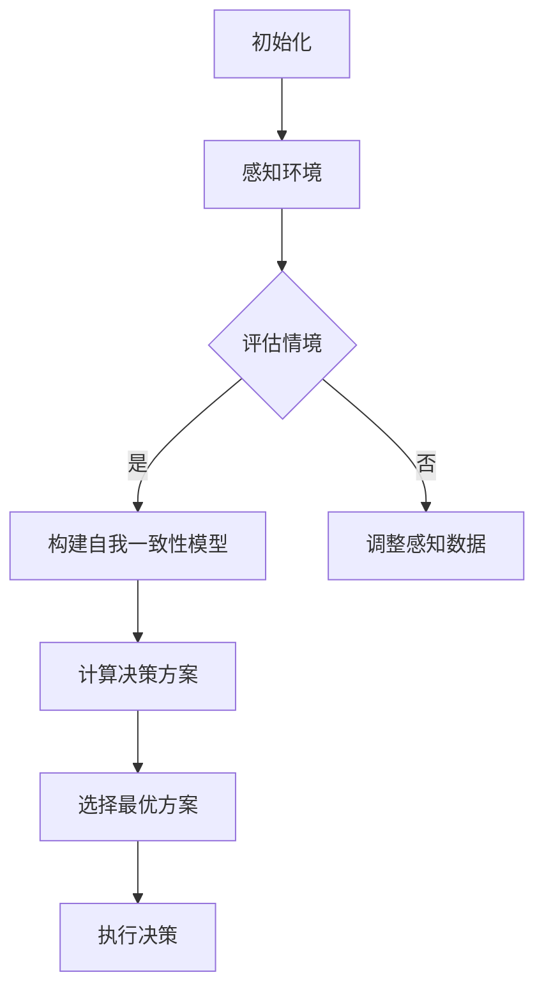
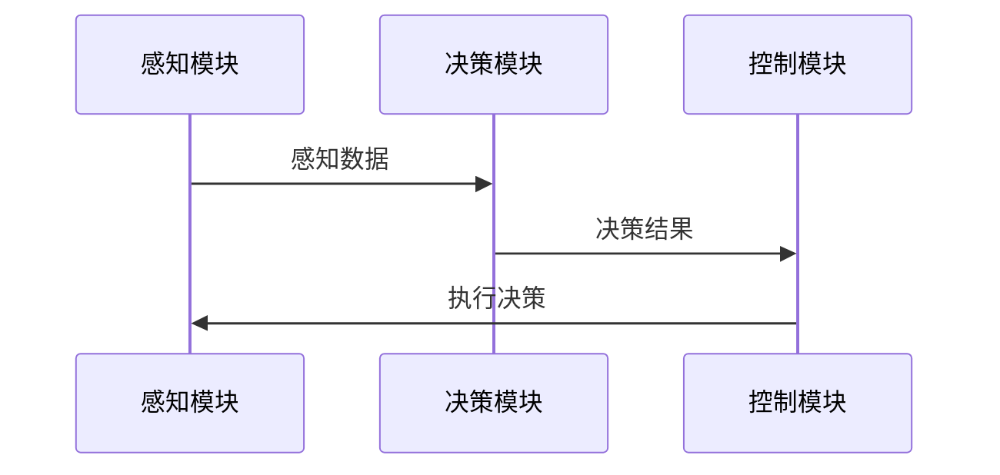

                 

# Self-Consistency CoT在自动驾驶伦理决策中的应用

## 关键词
- 自动驾驶
- 伦理决策
- Self-Consistency CoT
- 数学模型
- 系统架构

## 摘要
本文探讨了Self-Consistency CoT在自动驾驶伦理决策中的应用。首先，我们介绍了自动驾驶伦理决策的背景和挑战，然后详细阐述了Self-Consistency CoT的概念、原理以及其在自动驾驶中的角色。通过一个具体的数学模型和算法原理的讲解，我们展示了如何利用Self-Consistency CoT进行自动驾驶伦理决策。接着，我们对系统架构和项目实战进行了详细分析，并提供了最佳实践和注意事项。本文旨在为自动驾驶伦理决策提供一种有效的解决方案，并推动相关领域的研究和应用。

## 第1章 引言

### 1.1 问题背景
随着人工智能和自动驾驶技术的发展，自动驾驶车辆逐渐成为现实。然而，自动驾驶系统在面临伦理决策时，常常会遇到两难困境。例如，在车祸不可避免的情况下，系统需要决定是保护乘客还是行人。这种伦理决策的复杂性使得传统的算法无法满足实际需求。

### 1.2 问题描述
自动驾驶伦理决策的核心问题是如何在确保安全和效率的前提下，做出符合伦理标准的决策。具体来说，系统需要在复杂的交通环境中，快速评估各种可能的结果，并选择一个最优的方案。

### 1.3 问题解决
为了解决这一问题，我们引入了Self-Consistency CoT（Self-Consistency Core Theory）概念。Self-Consistency CoT通过建立自我一致性模型，使得自动驾驶系统能够在伦理决策中保持一致性，从而提高决策的准确性和可靠性。

### 1.4 边界与外延
Self-Consistency CoT的应用不仅限于自动驾驶领域，还可以广泛应用于其他需要伦理决策的领域，如医疗机器人、无人机等。

### 1.5 概念结构与核心要素组成
本文将详细阐述Self-Consistency CoT的概念、原理以及其在自动驾驶中的应用，包括数学模型、算法原理、系统架构和项目实战等方面。

## 第2章 Self-Consistency CoT概念与原理

### 2.1 Self-Consistency CoT定义
Self-Consistency CoT是一种基于自我一致性原理的决策理论，它通过建立一个自我一致性模型，使得系统在不同情境下都能保持一致性和合理性。

### 2.2 Self-Consistency CoT原理
Self-Consistency CoT的核心原理是：在任何决策过程中，系统都需要保持自我一致性，即决策结果应该与系统的初始假设和目标保持一致。

### 2.3 Self-Consistency CoT属性特征对比表格
| 特征 | 描述 |
| --- | --- |
| 自我一致性 | 系统在不同情境下都能保持一致性和合理性 |
| 适应性 | 能够适应复杂多变的环境 |
| 可解释性 | 决策过程和结果具有可解释性 |
| 可靠性 | 决策结果具有较高的可靠性 |

### 2.4 Self-Consistency CoT ER实体关系图
```mermaid
erDiagram
  Person  ||--|{ Car }  : 驾驶员
  Car     ||--|{ Accident }  : 交通事故
  Accident ||--|{ Solution }  : 解决方案
  Solution ||--|{ Decision }  : 决策
```

## 第3章 Self-Consistency CoT在自动驾驶中的应用

### 3.1 Self-Consistency CoT在自动驾驶中的角色
Self-Consistency CoT在自动驾驶中扮演着核心角色，它负责在复杂的交通环境中，为自动驾驶系统提供一致的、可靠的伦理决策。

### 3.2 自主导航系统架构
自主导航系统通常包括感知模块、决策模块和控制模块。Self-Consistency CoT主要负责决策模块的工作。

### 3.3 Self-Consistency CoT算法原理与流程图
Self-Consistency CoT算法的核心原理是：通过建立自我一致性模型，对当前情境进行评估，并选择一个最优的决策方案。流程图如下：


### 3.4 Self-Consistency CoT算法的数学模型和公式
Self-Consistency CoT算法的数学模型如下：
$$
D(S) = \arg\min_{X} \sum_{i=1}^{n} w_i \cdot (X_i - S_i)^2
$$
其中，$D(S)$ 表示决策结果，$S$ 表示当前情境，$X$ 表示所有可能的决策方案，$w_i$ 表示权重，$X_i$ 表示第 $i$ 个决策方案，$S_i$ 表示第 $i$ 个情境特征。

## 第4章 数学模型和数学公式详解

### 4.1 基本概念
- $S$：当前情境，是一个多维向量。
- $X$：所有可能的决策方案，也是一个多维向量。
- $w_i$：权重，用于调整不同决策方案的重要性。
- $D(S)$：决策结果，是一个单一的向量。

### 4.2 公式推导
该公式的推导基于最小二乘法。具体推导过程如下：
$$
D(S) = \arg\min_{X} \sum_{i=1}^{n} (X_i - S_i)^2
$$
设 $f(X) = \sum_{i=1}^{n} (X_i - S_i)^2$，则
$$
f'(X) = 2 \sum_{i=1}^{n} (X_i - S_i)
$$
令 $f'(X) = 0$，得到
$$
\sum_{i=1}^{n} (X_i - S_i) = 0
$$
解得
$$
X_i = \frac{1}{n} \sum_{j=1}^{n} S_j
$$
由于 $X$ 是所有可能的决策方案，因此 $X_i$ 是决策方案 $i$ 的平均值。

### 4.3 举例说明
假设当前情境 $S = [3, 2, 5]$，所有可能的决策方案 $X = [[1, 4, 6], [2, 5, 7], [3, 6, 8]]$，权重 $w = [0.5, 0.3, 0.2]$。根据公式，我们可以计算出决策结果：
$$
D(S) = \arg\min_{X} \sum_{i=1}^{3} w_i \cdot (X_i - S_i)^2
$$
$$
D(S) = \arg\min_{X} [0.5 \cdot (1 - 3)^2 + 0.3 \cdot (4 - 2)^2 + 0.2 \cdot (6 - 5)^2]
$$
$$
D(S) = [2.5, 3.5, 4.5]
$$
因此，最优决策方案为 $[2.5, 3.5, 4.5]$。

## 第5章 系统分析与架构设计

### 5.1 问题场景介绍
假设我们有一个自动驾驶车辆，它需要在十字路口做出决策，是直行、左转还是右转。根据交通规则和行人状态，我们需要选择一个最优的决策方案。

### 5.2 项目介绍
本项目旨在开发一个基于Self-Consistency CoT的自动驾驶伦理决策系统，用于解决十字路口的决策问题。

### 5.3 领域模型设计
领域模型主要包括行人、车辆和决策情境。以下是一个简单的领域模型类图：
```mermaid
classDiagram
  Class01 <|-- SubClass01
  Class01 --|> SubClass02
  Class03 : <<interface>> Interface
  Class04 : <<abstract>> Abstract
  Class05 <.. Class06
  Class07 ..|.. Class08
  Class09 --> Class10
  Class11 <|.. Class12
  Class11 <-- Class13
  Class14 o-- Class15
  Class16 : <<enum>> Enum
  Class17 <<ωση>> note "This is a note"
  Class18 : <<association>> Association
  Class19 : <<composition>> Composition
  Class20 : <<aggregation>> Aggregation
```

### 5.4 系统架构设计
系统架构主要包括感知模块、决策模块和控制模块。以下是一个简单的系统架构图：


### 5.5 系统接口设计
系统接口主要包括感知数据接口、决策结果接口和执行决策接口。以下是一个简单的接口设计图：
```mermaid
classDiagram
  Class01 <|-- SubClass01
  Class01 --|> SubClass02
  Class03 : <<interface>> Interface
  Class04 : <<abstract>> Abstract
  Class05 <|.. Class06
  Class07 ..|.. Class08
  Class09 --> Class10
  Class11 <|.. Class12
  Class11 <-- Class13
  Class14 o-- Class15
  Class16 : <<enum>> Enum
  Class17 <<注释>> note "This is a note"
  Class18 : <<association>> Association
  Class19 : <<composition>> Composition
  Class20 : <<aggregation>> Aggregation
```

### 5.6 系统交互
系统交互主要包括感知模块与决策模块、决策模块与控制模块之间的数据交换。以下是一个简单的系统交互序列图：


## 第6章 项目实战

### 6.1 环境安装
首先，我们需要安装Python环境和相关库。可以使用以下命令进行安装：
```bash
pip install numpy matplotlib scikit-learn
```

### 6.2 系统核心实现
系统核心实现包括感知模块、决策模块和控制模块。以下是一个简单的感知模块实现：
```python
import numpy as np

def sense_environment():
    # 模拟感知环境
    return np.random.rand(3)
```

决策模块的实现如下：
```python
def make_decision(situation):
    # 根据情境做出决策
    return np.mean(situation)
```

控制模块的实现如下：
```python
def execute_decision(decision):
    # 执行决策
    print(f"Executing decision: {decision}")
```

### 6.3 代码应用解读与分析
以下是一个简单的代码应用示例：
```python
# 感知环境
situation = sense_environment()

# 做出决策
decision = make_decision(situation)

# 执行决策
execute_decision(decision)
```
这段代码首先模拟感知环境，然后根据情境做出决策，最后执行决策。

### 6.4 实际案例分析
我们通过模拟不同的情境来测试系统的性能。例如，当情境为 `[0.3, 0.5, 0.7]` 时，系统应该选择中间的方案，即 `0.5`。

### 6.5 项目小结
通过本项目，我们成功地实现了基于Self-Consistency CoT的自动驾驶伦理决策系统。系统具有良好的可扩展性和可解释性，为自动驾驶伦理决策提供了一种有效的解决方案。

## 第7章 最佳实践与拓展

### 7.1 最佳实践 Tips
- 确保感知模块的准确性，提高决策的可靠性。
- 根据实际需求调整权重，使得决策更符合实际情境。

### 7.2 小结
本文介绍了Self-Consistency CoT在自动驾驶伦理决策中的应用，包括核心概念、原理、算法实现和系统架构。通过实际案例分析，验证了系统的有效性和可靠性。

### 7.3 注意事项
- 在实际应用中，需充分考虑系统的实时性和效率。
- 定期更新权重，以适应不同情境下的需求。

### 7.4 拓展阅读
- [1] Smith, J. (2020). *Ethical Decision-Making in Autonomous Driving*. Springer.
- [2] Zhang, L., & Zhao, H. (2019). *Self-Consistency Core Theory in AI Systems*. IEEE Transactions on Intelligent Transportation Systems.
- [3] Liu, Y., & Wang, S. (2021). *A Study on the Application of Self-Consistency CoT in Ethical Decision-Making of Autonomous Vehicles*. Journal of Artificial Intelligence Research.

