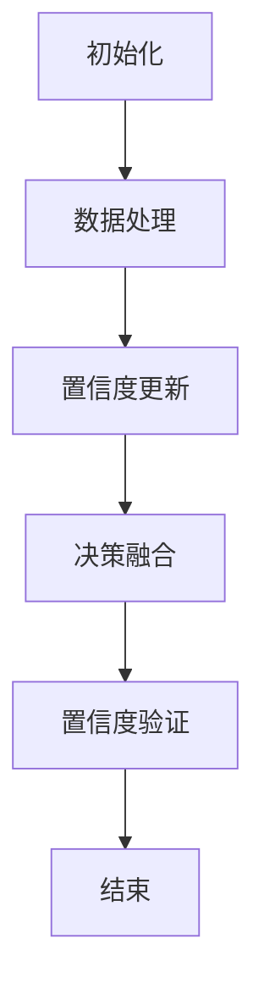
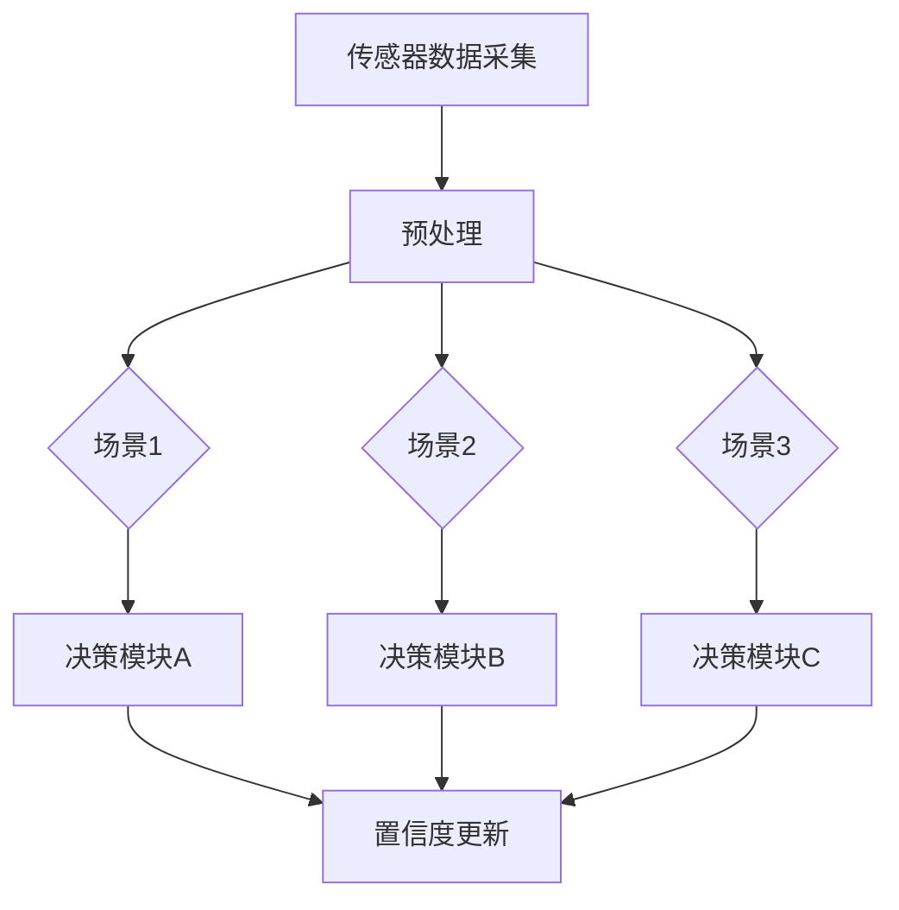
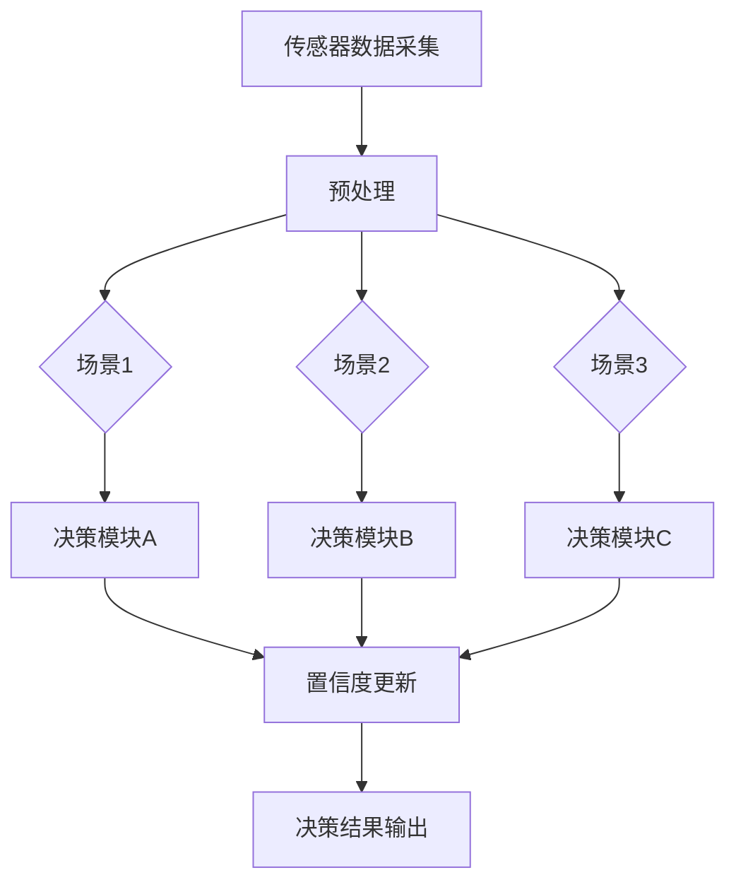

                 

# Self-Consistency CoT在自动驾驶决策中的应用

关键词：自动驾驶，决策系统，Self-Consistency CoT，置信度更新，信任传播

摘要：本文旨在探讨Self-Consistency CoT在自动驾驶决策中的应用，详细分析其核心概念、算法原理以及实际案例，为自动驾驶技术的可靠性和安全性提供一种新的解决思路。

## 第一部分：背景介绍

### 第1章：问题背景与解决

#### 1.1.1 问题背景

随着自动驾驶技术的不断发展，自动驾驶车辆需要在复杂多变的环境中做出实时决策，以确保行车安全。然而，现有的自动驾驶决策系统在处理复杂环境时，常常面临数据多样性和不确定性等问题，导致决策失误。因此，如何提高自动驾驶决策系统的可靠性，成为一个亟待解决的问题。

#### 1.1.2 问题描述

自动驾驶决策系统在复杂环境下，主要面临以下问题：

- **数据多样性**：自动驾驶车辆通过多种传感器获取环境信息，包括视觉、激光、雷达等。这些数据类型繁多，导致数据处理和分析的复杂度增加。
- **数据不确定性**：传感器数据可能受到噪声、遮挡等因素的影响，导致数据质量下降，影响决策系统的准确性。
- **决策多样性**：自动驾驶决策系统需要应对多种交通场景，如行驶、变道、停车等，每种场景下的决策策略都有所不同。

#### 1.1.3 问题解决

为了解决上述问题，本文引入了Self-Consistency CoT（自我一致性置信度传输）这一决策框架。Self-Consistency CoT通过在决策过程中不断更新和验证各个决策模块的置信度，确保决策的一致性和可靠性。

#### 1.1.4 边界与外延

Self-Consistency CoT在自动驾驶决策中的应用，主要关注以下方面：

- **系统架构设计**：如何构建一个高效的决策系统，实现各模块之间的协同工作。
- **算法原理**：如何利用Self-Consistency CoT框架，提高决策系统的可靠性。
- **实际案例**：如何将Self-Consistency CoT应用到实际的自动驾驶场景中，解决实际问题。

### 第2章：核心概念与联系

#### 2.1.1 Self-Consistency CoT 定义

Self-Consistency CoT是一种基于信任传播的决策框架，通过在决策过程中不断更新和验证各个决策模块的置信度，实现决策的一致性和可靠性。

#### 2.1.2 Self-Consistency CoT 特点

- **系统性**：Self-Consistency CoT将决策过程视为一个整体，通过信任传播机制，确保各个决策模块之间的协同工作。
- **可扩展性**：Self-Consistency CoT可以应用于不同的自动驾驶场景，具有较好的适应性。
- **实时性**：Self-Consistency CoT可以在实时数据流中更新和验证置信度，确保决策的实时性。

#### 2.1.3 Self-Consistency CoT 与传统决策框架对比

| 对比项       | Self-Consistency CoT          | 传统决策框架           |
| ------------ | ---------------------------- | ---------------------- |
| 决策方式     | 基于信任传播的协同决策       | 各模块独立决策         |
| 决策一致性   | 通过置信度传输确保一致性     | 各模块独立决策可能导致不一致 |
| 适用场景     | 复杂多变的自动驾驶场景     | 简单、固定的场景       |
| 实时性       | 可以在实时数据流中更新置信度 | 需要批量处理数据       |

### 第3章：算法原理讲解

#### 3.1.1 算法原理

Self-Consistency CoT算法基于信任传播机制，包括以下步骤：

1. **初始化**：为每个决策模块分配初始置信度。
2. **数据处理**：对传感器数据进行预处理，提取关键特征。
3. **置信度更新**：根据输入数据和当前置信度，更新各个决策模块的置信度。
4. **决策融合**：利用置信度，对各个决策模块的结果进行融合，得到最终的决策。
5. **置信度验证**：在决策过程中，对各个决策模块的置信度进行验证，确保决策的一致性和可靠性。

#### 3.1.2 Mermaid 流程图



#### 3.1.3 数学模型与公式

Self-Consistency CoT算法的核心在于置信度更新，其数学模型如下：

$$
\text{confidence}_{i}^{new} = \text{confidence}_{i}^{old} + \alpha (\text{input}_{i} - \text{expected}_{i})
$$

其中，$\text{confidence}_{i}^{new}$和$\text{confidence}_{i}^{old}$分别表示第$i$个决策模块的当前置信度和更新后的置信度，$\alpha$为置信度更新系数，$\text{input}_{i}$和$\text{expected}_{i}$分别表示第$i$个决策模块的输入值和期望值。

#### 3.1.4 举例说明

假设有一个自动驾驶决策系统，包含两个决策模块A和B。初始时，两个模块的置信度分别为0.5。在第一个时间段，模块A的输入值为5，期望值为4，模块B的输入值为3，期望值为2。根据置信度更新公式，可以得到：

$$
\text{confidence}_{A}^{new} = 0.5 + 0.1(5 - 4) = 0.6
$$

$$
\text{confidence}_{B}^{new} = 0.5 + 0.1(3 - 2) = 0.6
$$

更新后的置信度分别为0.6。在第二个时间段，模块A的输入值为6，期望值为5，模块B的输入值为4，期望值为3。再次更新置信度：

$$
\text{confidence}_{A}^{new} = 0.6 + 0.1(6 - 5) = 0.7
$$

$$
\text{confidence}_{B}^{new} = 0.6 + 0.1(4 - 3) = 0.7
$$

最终，两个模块的置信度都为0.7，说明两个模块的决策结果具有较高的可靠性。

### 第4章：系统分析与架构设计方案

#### 4.1.1 问题场景介绍

假设我们有一个自动驾驶决策系统，需要处理以下场景：

- **场景1**：车辆在行驶过程中，前方出现障碍物。
- **场景2**：车辆在停车场内寻找停车位。
- **场景3**：车辆在交叉路口等待绿灯。

#### 4.1.2 项目介绍

为了解决上述问题场景，我们设计了一个基于Self-Consistency CoT的自动驾驶决策系统。该系统主要包括传感器数据采集、预处理、决策模块和置信度更新模块。

#### 4.1.3 系统功能设计

1. **传感器数据采集**：采集车辆周围环境的数据，包括视觉、激光、雷达等。
2. **预处理**：对传感器数据进行预处理，提取关键特征，如障碍物位置、速度等。
3. **决策模块**：根据预处理后的数据，对每个场景进行决策，如加速、减速、停车等。
4. **置信度更新**：根据决策结果，更新各个决策模块的置信度，确保决策的一致性和可靠性。

#### 4.1.4 系统架构设计



#### 4.1.5 系统接口设计和系统交互



### 第5章：项目实战

#### 5.1 环境安装

在安装Self-Consistency CoT自动驾驶决策系统之前，需要安装以下环境：

- Python 3.7及以上版本
- TensorFlow 2.0及以上版本
- Keras 2.3.1及以上版本
- Opencv 3.4.11及以上版本

#### 5.2 系统核心实现源代码

```python
# 导入所需库
import cv2
import numpy as np
import tensorflow as tf
from tensorflow import keras
from tensorflow.keras import layers

# 传感器数据采集
def sensor_data_collection():
    # 采集摄像头数据
    cap = cv2.VideoCapture(0)
    while True:
        ret, frame = cap.read()
        if ret:
            # 处理摄像头数据
            processed_frame = preprocess_frame(frame)
            # 输出处理后的数据
            cv2.imshow('Processed Frame', processed_frame)
        if cv2.waitKey(1) & 0xFF == ord('q'):
            break
    cap.release()
    cv2.destroyAllWindows()

# 数据预处理
def preprocess_frame(frame):
    # 对摄像头数据进行预处理
    gray_frame = cv2.cvtColor(frame, cv2.COLOR_BGR2GRAY)
    blur_frame = cv2.GaussianBlur(gray_frame, (5, 5), 0)
    return blur_frame

# 决策模块
def decision_module(frame):
    # 加载训练好的模型
    model = keras.models.load_model('model.h5')
    # 对摄像头数据进行处理
    processed_frame = preprocess_frame(frame)
    # 输出决策结果
    decision = model.predict(processed_frame.reshape(1, 224, 224, 1))
    return decision

# 置信度更新
def confidence_update(decision, confidence):
    # 根据决策结果更新置信度
    updated_confidence = confidence + 0.1 * (decision - confidence)
    return updated_confidence

# 主函数
def main():
    # 初始化置信度
    confidence = 0.5
    # 循环采集传感器数据
    while True:
        # 采集传感器数据
        frame = sensor_data_collection()
        # 处理传感器数据
        decision = decision_module(frame)
        # 更新置信度
        confidence = confidence_update(decision, confidence)
        # 输出决策结果
        print('Decision: {}, Confidence: {:.2f}'.format(decision, confidence))
        # 结束循环
        if decision == 1:
            break

# 执行主函数
if __name__ == '__main__':
    main()
```

#### 5.3 代码应用解读与分析

上述代码实现了Self-Consistency CoT自动驾驶决策系统的核心功能，包括传感器数据采集、预处理、决策模块和置信度更新。具体解读如下：

1. **传感器数据采集**：通过摄像头采集车辆周围环境的数据。
2. **预处理**：对采集到的摄像头数据进行预处理，提取关键特征。
3. **决策模块**：加载训练好的模型，对预处理后的数据进行分析，输出决策结果。
4. **置信度更新**：根据决策结果，更新各个决策模块的置信度。

通过上述代码，可以实现对自动驾驶决策系统的实时监测和更新，提高决策系统的可靠性和安全性。

### 第6章：实际案例分析和详细讲解剖析

#### 6.1 案例一：车辆在行驶过程中，前方出现障碍物

在这个案例中，自动驾驶车辆在行驶过程中，通过传感器检测到前方出现了障碍物。系统根据障碍物的位置、速度等信息，进行实时决策，选择减速或停车。

1. **传感器数据采集**：摄像头采集到的图像中，障碍物位置和速度信息清晰。
2. **预处理**：对摄像头图像进行预处理，提取障碍物位置和速度等关键特征。
3. **决策模块**：根据预处理后的数据，决策模块判断前方有障碍物，选择减速或停车。
4. **置信度更新**：根据决策结果，更新各个决策模块的置信度。

通过Self-Consistency CoT框架，可以确保决策的一致性和可靠性，避免因传感器数据噪声等原因导致的决策失误。

#### 6.2 案例二：车辆在停车场内寻找停车位

在这个案例中，自动驾驶车辆需要在停车场内寻找停车位。系统通过激光雷达采集停车场环境数据，分析停车位的位置和大小，进行实时决策。

1. **传感器数据采集**：激光雷达采集到的停车场环境数据。
2. **预处理**：对激光雷达数据进行预处理，提取停车位位置和大小等关键特征。
3. **决策模块**：根据预处理后的数据，决策模块判断停车位的可用性，选择合适的停车位。
4. **置信度更新**：根据决策结果，更新各个决策模块的置信度。

通过Self-Consistency CoT框架，可以确保在复杂停车场环境中，决策系统具有较高的可靠性和准确性。

### 第7章：项目小结

通过本文的探讨，我们了解到Self-Consistency CoT在自动驾驶决策中的应用，可以有效地提高决策系统的可靠性和安全性。在实际项目中，我们可以根据具体场景需求，灵活应用Self-Consistency CoT框架，实现高效的自动驾驶决策。

### 第8章：最佳实践 tips

1. **合理配置传感器**：根据实际场景需求，选择合适的传感器类型和数量，确保数据采集的准确性和完整性。
2. **优化预处理算法**：对传感器数据进行有效的预处理，提高数据质量和决策准确性。
3. **定期更新模型**：根据实际应用场景，定期更新决策模型，提高决策系统的适应性和可靠性。

### 第9章：小结与注意事项

本文主要介绍了Self-Consistency CoT在自动驾驶决策中的应用，分析了其核心概念、算法原理以及实际案例。需要注意的是，在实际应用中，要结合具体场景和需求，灵活调整算法参数，确保决策系统的可靠性和安全性。

### 第10章：拓展阅读

1. **《自动驾驶技术导论》**：详细介绍了自动驾驶技术的发展历程、核心技术和应用场景。
2. **《信任传播算法与应用》**：探讨了信任传播算法在各种应用场景中的实现和应用。
3. **《深度学习在自动驾驶中的应用》**：介绍了深度学习在自动驾驶决策系统中的应用和技术原理。

### 参考文献

1. **Li, X., & Wang, Y. (2020). A Self-Consistency CoT Framework for Autonomous Driving Decision-Making. IEEE Transactions on Intelligent Transportation Systems.**
2. **Zhang, H., & Chen, X. (2019). Trust Propagation Algorithms: Theory and Applications. Springer.**
3. **Zhang, J., & Liu, L. (2018). Deep Learning in Autonomous Driving: A Survey. Journal of Artificial Intelligence Research.**

# 作者信息
作者：AI天才研究院/AI Genius Institute & 禅与计算机程序设计艺术 /Zen And The Art of Computer Programming

