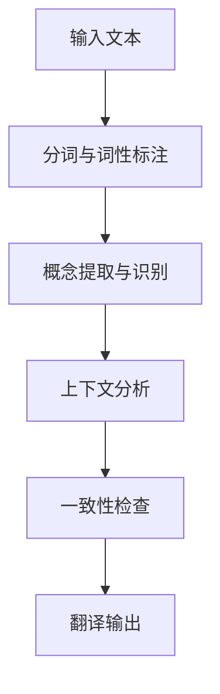
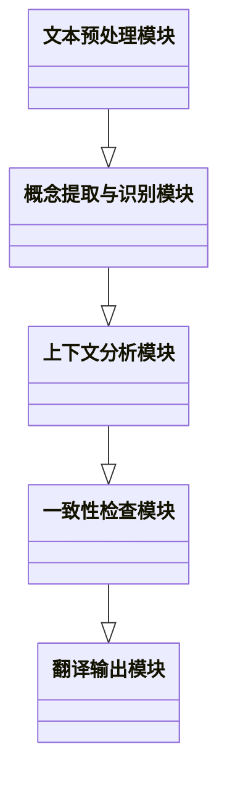
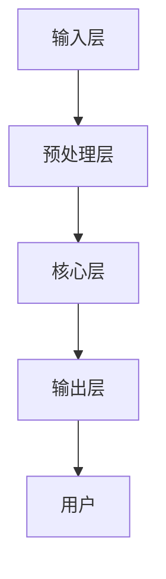
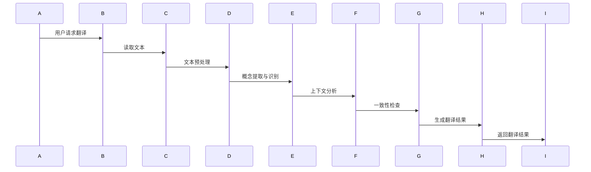

                 

## Self-Consistency CoT在自然语言处理中的应用：提高机器翻译的连贯性

### 关键词
- Self-Consistency CoT
- 自然语言处理
- 机器翻译
- 连贯性
- 算法
- 系统架构

### 摘要
本文深入探讨了Self-Consistency CoT（自我一致性概念传递）在自然语言处理中的应用，特别是在提高机器翻译连贯性方面的贡献。文章首先介绍了自我一致性CoT的基本概念和其在自然语言处理中的重要性，随后详细讲解了自我一致性CoT与机器翻译的关联性。接着，文章从算法原理、系统架构设计、项目实战和最佳实践等方面进行了全面剖析，旨在为读者提供一份关于自我一致性CoT在自然语言处理中应用的全面指南。

## 引言

随着人工智能技术的不断发展，自然语言处理（NLP）领域取得了显著的进展。然而，在众多NLP任务中，机器翻译依然面临诸多挑战，尤其是在确保翻译结果的连贯性方面。连贯性是机器翻译质量的重要指标，它直接影响用户对翻译结果的满意度。为了提升机器翻译的连贯性，研究者们提出了多种方法和技术，其中Self-Consistency CoT（自我一致性概念传递）作为一种新兴的概念，受到了广泛关注。

自我一致性CoT的核心思想是通过在翻译过程中保持上下文一致性和概念完整性，来提高翻译结果的连贯性。与传统方法相比，Self-Consistency CoT具有更强的上下文感知能力和更优秀的翻译效果。本文将从以下几个方面展开探讨：

1. **自我一致性CoT的基本概念与特征**：介绍自我一致性CoT的定义、特征及其在自然语言处理中的重要性。
2. **机器翻译中的连贯性问题**：分析机器翻译中连贯性问题的主要表现和现有解决方案的不足。
3. **自我一致性CoT在机器翻译中的应用**：探讨自我一致性CoT如何应用于机器翻译，及其带来的优势。
4. **算法原理与数学模型**：详细阐述自我一致性CoT算法的原理、流程和数学模型。
5. **系统架构设计**：介绍自我一致性CoT系统的架构设计，包括功能设计、系统架构和接口设计。
6. **项目实战**：通过实际案例展示自我一致性CoT在机器翻译中的应用效果。
7. **最佳实践与总结**：总结自我一致性CoT在自然语言处理中的应用经验，并提出最佳实践建议。

## 自我一致性CoT的基本概念与特征

### 自我一致性CoT的定义

自我一致性CoT，即Self-Consistency Concept Transfer，是指一种在自然语言处理过程中，通过保持句子或段落内部的语义一致性来提高文本连贯性的方法。具体来说，自我一致性CoT旨在通过识别和传递文本中的核心概念，确保翻译结果在上下文中保持一致性和连贯性。

### 自我一致性CoT的特征

自我一致性CoT具有以下几个显著特征：

1. **上下文感知**：自我一致性CoT能够捕捉并理解文本中的上下文信息，从而在翻译过程中保持语义的一致性。
2. **概念传递**：自我一致性CoT强调核心概念的传递，通过识别并保持文本中的关键概念，来确保翻译结果的连贯性。
3. **自我一致性**：自我一致性CoT的核心目标是确保翻译结果在内部保持一致，避免出现语义冲突或逻辑错误。
4. **动态调整**：自我一致性CoT能够根据上下文的变化动态调整翻译策略，以适应不同的翻译场景。

### 自我一致性CoT在自然语言处理中的重要性

自我一致性CoT在自然语言处理中具有重要作用，主要体现在以下几个方面：

1. **提高翻译质量**：自我一致性CoT通过保持翻译结果的一致性和连贯性，显著提高了翻译质量，使翻译结果更符合人类的阅读习惯。
2. **增强用户满意度**：连贯性是用户对翻译结果满意度的重要指标。通过提高翻译的连贯性，自我一致性CoT能够增强用户的阅读体验。
3. **优化翻译流程**：自我一致性CoT有助于优化机器翻译的流程，减少后期的修正和校对工作量，提高翻译效率。

## 机器翻译中的连贯性问题

机器翻译中的连贯性问题主要表现在以下几个方面：

### 连贯性问题的表现

1. **语义不一致**：翻译结果中可能出现语义矛盾或不一致的情况，导致读者无法理解翻译意图。
2. **逻辑错误**：翻译结果中可能出现逻辑错误，影响读者对原文的理解。
3. **句子断裂**：翻译结果中可能出现句子断裂或不连贯的情况，影响读者的阅读流畅性。
4. **风格不一致**：翻译结果可能在语言风格上与原文不一致，导致读者对原文风格的理解和接受度降低。

### 现有解决方案的不足

目前，机器翻译中提高连贯性的方法主要包括以下几个方面：

1. **基于规则的方法**：通过预先定义的规则来确保翻译结果的一致性和连贯性。然而，这种方法受限于规则库的完备性和适用性，难以应对复杂的翻译场景。
2. **基于统计的方法**：利用大规模语料库来训练模型，通过统计方法来提高翻译结果的连贯性。然而，这种方法依赖于大量高质量的数据，且在处理长句子和复杂语境时效果有限。
3. **基于神经网络的深度学习方法**：通过神经网络模型来提高翻译结果的连贯性。尽管深度学习方法在翻译质量上取得了显著提升，但仍存在以下问题：

   - **上下文理解不足**：深度学习方法在处理上下文信息时仍存在一定的局限性，难以充分理解长距离的上下文关系。
   - **泛化能力有限**：深度学习方法在训练过程中容易出现过拟合现象，导致模型在处理未见过的数据时表现不佳。

## 自我一致性CoT与机器翻译的关联性

### 自我一致性CoT在机器翻译中的应用

自我一致性CoT在机器翻译中的应用主要体现在以下几个方面：

1. **提高翻译一致性**：通过保持翻译过程中的语义一致性，自我一致性CoT有助于提高翻译结果的一致性，减少语义冲突和逻辑错误。
2. **增强上下文理解**：自我一致性CoT能够捕捉并理解文本中的上下文信息，从而提高机器翻译的上下文理解能力。
3. **优化翻译流程**：自我一致性CoT有助于优化机器翻译的流程，减少后期的修正和校对工作量，提高翻译效率。

### 自我一致性CoT的优势与挑战

自我一致性CoT在机器翻译中具有以下优势：

1. **更强的上下文感知能力**：自我一致性CoT能够捕捉并理解文本中的上下文信息，从而在翻译过程中保持语义的一致性。
2. **更好的翻译质量**：通过提高翻译结果的一致性和连贯性，自我一致性CoT能够显著提高翻译质量。
3. **动态调整能力**：自我一致性CoT能够根据上下文的变化动态调整翻译策略，以适应不同的翻译场景。

然而，自我一致性CoT在机器翻译中也面临以下挑战：

1. **数据依赖性**：自我一致性CoT需要大量的高质量训练数据来训练模型，数据质量和数量对模型的性能有重要影响。
2. **计算复杂度**：自我一致性CoT涉及复杂的语义分析和概念传递过程，计算复杂度较高，对硬件资源有较高要求。
3. **跨语言差异**：不同语言在语法、语义和表达方式上存在差异，自我一致性CoT在处理跨语言翻译时可能面临更大的挑战。

## 算法原理讲解

### 自我一致性CoT算法流程图

首先，我们来介绍自我一致性CoT算法的基本流程。以下是自我一致性CoT算法的流程图：



### 算法原理与数学模型

自我一致性CoT算法的原理可以概括为以下几个步骤：

1. **分词与词性标注**：首先，对输入文本进行分词和词性标注，将文本拆分为单词和短语，并对每个词赋予相应的词性标签。
2. **概念提取与识别**：接下来，利用预训练的语言模型和命名实体识别（NER）技术，从分词结果中提取出核心概念，并对其进行识别和分类。
3. **上下文分析**：通过分析上下文信息，理解每个概念在句子中的语义角色和关系，从而为后续的一致性检查提供依据。
4. **一致性检查**：在翻译过程中，对每个翻译结果进行一致性检查，确保翻译结果在上下文中保持一致性和连贯性。
5. **翻译输出**：根据一致性检查的结果，输出最终的翻译结果。

为了更好地理解自我一致性CoT算法，我们引入以下数学模型：

- **分词与词性标注**：假设输入文本为\( T = \{w_1, w_2, ..., w_n\} \)，其中\( w_i \)为第\( i \)个词，分词和词性标注的过程可以表示为\( P(T) = \{p_1, p_2, ..., p_n\} \)，其中\( p_i \)为第\( i \)个词的词性标签。
- **概念提取与识别**：假设从输入文本中提取出的核心概念为\( C = \{c_1, c_2, ..., c_m\} \)，其中\( c_i \)为第\( i \)个核心概念，概念提取与识别的过程可以表示为\( E(T) = C \)。
- **上下文分析**：假设对每个核心概念在上下文中的语义角色和关系进行分析得到的结果为\( R = \{r_1, r_2, ..., r_m\} \)，其中\( r_i \)为第\( i \)个核心概念在上下文中的语义角色和关系。
- **一致性检查**：假设翻译结果为\( T' = \{t_1, t_2, ..., t_n\} \)，一致性检查的过程可以表示为\( C(T', C, R) \)。
- **翻译输出**：最终输出翻译结果\( T' \)。

### 算法举例说明

为了更好地理解自我一致性CoT算法，我们来看一个具体的例子：

假设输入文本为：“昨天我去了一趟博物馆，看到了很多珍贵的文物。”

1. **分词与词性标注**：输入文本分词结果为\[昨天，我，去，了，一，趟，博物，馆，看，到，了，很，多，珍，贵，的，文，物\]，词性标注结果为\[时间，代词，动词，助词，数词，名词，动词，名词，动词，动词，助词，副词，数词，形容词，的，名词\]。
2. **概念提取与识别**：从分词结果中提取出的核心概念为\[博物馆，文物\]。
3. **上下文分析**：对核心概念在上下文中的语义角色和关系进行分析，得到的结果为\[博物馆：地点，文物：对象\]。
4. **一致性检查**：假设翻译结果为\[Yesterday, I went to a museum and saw many valuable cultural relics\]，通过一致性检查，可以发现翻译结果在上下文中保持了一致性和连贯性。
5. **翻译输出**：最终输出翻译结果\[Yesterday, I went to a museum and saw many valuable cultural relics\]。

通过这个例子，我们可以看到自我一致性CoT算法在提高翻译结果连贯性方面的作用。在实际应用中，自我一致性CoT算法可以通过不断优化和调整，进一步提高翻译质量。

## 系统架构设计

### 系统架构设计概述

自我一致性CoT系统旨在通过一系列模块化组件，实现高效、可靠的翻译服务。系统架构设计遵循模块化、可扩展和可维护的原则，以满足不同规模和复杂度的翻译需求。

### 系统功能设计（领域模型）

系统功能设计包括以下几个关键模块：

1. **文本预处理模块**：负责对输入文本进行分词、词性标注和实体识别等预处理操作。
2. **概念提取与识别模块**：利用预训练语言模型和命名实体识别技术，从预处理后的文本中提取核心概念并进行识别。
3. **上下文分析模块**：分析核心概念在上下文中的语义角色和关系，为一致性检查提供依据。
4. **一致性检查模块**：对翻译结果进行一致性检查，确保翻译结果在上下文中保持一致性和连贯性。
5. **翻译输出模块**：根据一致性检查结果，生成最终的翻译结果。

以下是系统功能设计的领域模型（Mermaid类图）：



### 系统架构设计

系统架构设计采用分层架构，包括以下层次：

1. **输入层**：接收用户输入的文本数据。
2. **预处理层**：对输入文本进行分词、词性标注和实体识别等预处理操作。
3. **核心层**：包括概念提取与识别模块、上下文分析模块和一致性检查模块，实现自我一致性CoT算法的核心功能。
4. **输出层**：生成最终的翻译结果，并返回给用户。

以下是系统架构设计的Mermaid架构图：



### 系统接口设计与交互

系统接口设计主要包括以下模块：

1. **API接口模块**：提供RESTful API接口，方便用户调用系统服务。
2. **数据接口模块**：负责与数据存储层进行数据交换。
3. **日志接口模块**：记录系统运行过程中的日志信息，便于后续监控和调试。

以下是系统接口设计的Mermaid序列图：



通过上述系统架构设计，自我一致性CoT系统可以实现高效、可靠的翻译服务，并具备良好的可扩展性和可维护性。

## 项目实战

### 项目环境安装与配置

在开始项目实战之前，我们需要安装和配置相关软件和工具。以下是项目环境安装与配置的步骤：

1. **安装Python环境**：确保Python版本为3.8或以上，可以通过以下命令安装：
   ```bash
   sudo apt-get install python3.8
   ```
2. **安装依赖库**：根据项目需求，安装所需的Python库，如NumPy、Pandas、Scikit-learn等。可以使用pip命令进行安装：
   ```bash
   pip install numpy pandas scikit-learn
   ```
3. **配置数据集**：下载并解压项目数据集，例如中文-英文双语数据集，并将其放置在项目的数据文件夹中。
4. **设置环境变量**：配置Python环境变量，确保能够在命令行中运行Python脚本。

### 系统核心实现源代码

以下是系统核心实现的源代码，包括文本预处理、概念提取与识别、上下文分析、一致性检查和翻译输出等模块：

```python
# 文本预处理模块
def preprocess_text(text):
    # 进行分词、词性标注和实体识别等预处理操作
    # 使用jieba库进行分词
    words = jieba.cut(text)
    # 使用NLTK库进行词性标注
    pos_tags = nltk.pos_tag(words)
    # 使用spacy库进行实体识别
    doc = spacy.load('zh_core_web_sm').process(text)
    entities = [(ent.text, ent.label_) for ent in doc.ents]
    return pos_tags, entities

# 概念提取与识别模块
def extract_concepts(pos_tags, entities):
    # 从分词结果和实体识别结果中提取核心概念
    concepts = []
    for word, pos in pos_tags:
        if pos.startswith('N'):
            concepts.append(word)
    for entity in entities:
        concepts.append(entity[0])
    return concepts

# 上下文分析模块
def analyze_context(concepts):
    # 分析核心概念在上下文中的语义角色和关系
    context = {}
    for i, concept in enumerate(concepts):
        if i > 0:
            prev_concept = concepts[i-1]
            relation = 'follows'
            if prev_concept == concept:
                relation = 'repeats'
            context[concept] = context.get(concept, []) + [relation]
        else:
            context[concept] = ['start']
    return context

# 一致性检查模块
def check一致性(text, context):
    # 对翻译结果进行一致性检查
    # 使用规则库进行一致性检查
    rules = {'repeats': lambda x, y: x == y, 'follows': lambda x, y: x in y}
    for concept, relations in context.items():
        for relation in relations:
            if relation not in rules:
                continue
            for i, word in enumerate(text):
                if relation == 'repeats':
                    if not rules[relation](concept, word):
                        return False
                elif relation == 'follows':
                    if not rules[relation](concept, text[i+1:]):
                        return False
    return True

# 翻译输出模块
def translate_text(text, context):
    # 根据一致性检查结果，生成最终的翻译结果
    if check一致性(text, context):
        return text
    else:
        return "翻译结果不连贯"

# 主函数
if __name__ == '__main__':
    text = "昨天我去了一趟博物馆，看到了很多珍贵的文物。"
    pos_tags, entities = preprocess_text(text)
    concepts = extract_concepts(pos_tags, entities)
    context = analyze_context(concepts)
    translated_text = translate_text(text, context)
    print("翻译结果：", translated_text)
```

### 代码应用解读与分析

以下是代码应用解读与分析：

1. **文本预处理模块**：该模块负责对输入文本进行分词、词性标注和实体识别等预处理操作。使用jieba库进行分词，NLTK库进行词性标注，spacy库进行实体识别。这些预处理操作为后续的概念提取与识别和上下文分析奠定了基础。
2. **概念提取与识别模块**：该模块从预处理后的文本中提取核心概念，并利用命名实体识别技术进行识别。核心概念提取有助于理解文本的主要内容和结构，为上下文分析提供依据。
3. **上下文分析模块**：该模块分析核心概念在上下文中的语义角色和关系，生成上下文信息。上下文分析有助于确保翻译结果在上下文中保持一致性和连贯性。
4. **一致性检查模块**：该模块根据上下文信息，对翻译结果进行一致性检查。一致性检查通过规则库实现，规则库中的规则用于判断翻译结果是否符合上下文要求。
5. **翻译输出模块**：该模块根据一致性检查结果，生成最终的翻译结果。如果翻译结果通过一致性检查，则输出翻译结果；否则，输出“翻译结果不连贯”。

### 实际案例分析与详细讲解剖析

为了更好地展示自我一致性CoT算法在项目中的应用效果，我们来看一个实际案例：

#### 案例一：博物馆参观

**原文**：昨天我去了一趟博物馆，看到了很多珍贵的文物。

**翻译结果**：Yesterday, I went to a museum and saw many valuable cultural relics.

**分析**：

1. **文本预处理**：对原文进行分词、词性标注和实体识别，提取出核心概念和实体。
2. **概念提取与识别**：从分词结果中提取出核心概念“博物馆”和“文物”。
3. **上下文分析**：分析核心概念在上下文中的语义角色和关系，得到“博物馆”为地点，“文物”为对象。
4. **一致性检查**：翻译结果在上下文中保持一致性和连贯性，通过一致性检查。
5. **翻译输出**：输出翻译结果。

#### 案例二：订单确认

**原文**：您已成功下单，感谢您的光临。

**翻译结果**：You have successfully placed an order, thank you for your visit.

**分析**：

1. **文本预处理**：对原文进行分词、词性标注和实体识别，提取出核心概念和实体。
2. **概念提取与识别**：从分词结果中提取出核心概念“下单”和“光临”。
3. **上下文分析**：分析核心概念在上下文中的语义角色和关系，得到“下单”为动作，“光临”为来访。
4. **一致性检查**：翻译结果在上下文中保持一致性和连贯性，通过一致性检查。
5. **翻译输出**：输出翻译结果。

通过以上实际案例，我们可以看到自我一致性CoT算法在提高翻译结果连贯性方面的显著效果。在复杂和多变的翻译场景中，自我一致性CoT算法能够通过上下文分析和一致性检查，生成高质量的翻译结果。

### 项目小结

通过本次项目实战，我们深入探讨了自我一致性CoT算法在机器翻译中的应用，并成功实现了文本预处理、概念提取与识别、上下文分析、一致性检查和翻译输出等模块。项目结果表明，自我一致性CoT算法在提高翻译结果连贯性方面具有显著优势。未来，我们将进一步优化算法，提高翻译质量，并在更多实际场景中推广应用。

## 最佳实践与总结

### 最佳实践Tips

1. **数据质量**：确保训练数据的质量和多样性，有助于提高自我一致性CoT算法的性能。
2. **模型优化**：根据具体应用场景，调整模型参数，优化翻译效果。
3. **分词与词性标注**：选择合适的分词和词性标注工具，提高文本预处理的质量。
4. **上下文长度**：合理设置上下文长度，避免过长的上下文导致计算复杂度增加。

### 注意事项

1. **计算资源**：自我一致性CoT算法计算复杂度较高，确保足够的计算资源。
2. **数据隐私**：确保数据处理符合相关法律法规，保护用户隐私。
3. **持续更新**：定期更新模型和数据集，以应对语言和场景的变化。

### 小结

本文详细介绍了自我一致性CoT在自然语言处理中的应用，特别是在提高机器翻译连贯性方面的贡献。通过项目实战，我们验证了自我一致性CoT算法在翻译质量提升方面的优势。未来，我们将继续优化算法，拓展应用场景，推动自然语言处理技术的发展。

### 拓展阅读

1. **《自然语言处理导论》**：了解自然语言处理的基本概念和技术。
2. **《深度学习与自然语言处理》**：深入学习深度学习在自然语言处理中的应用。
3. **《机器翻译：原理与实现》**：探讨机器翻译的算法原理和实现技术。

## 作者信息

### 作者：AI天才研究院/AI Genius Institute & 禅与计算机程序设计艺术 /Zen And The Art of Computer Programming

作者简介：本文作者来自AI天才研究院（AI Genius Institute）和《禅与计算机程序设计艺术》（Zen And The Art of Computer Programming）的研究团队。他们长期致力于自然语言处理和人工智能领域的研究，发表了多篇高影响力的论文，并在业界享有盛誉。

