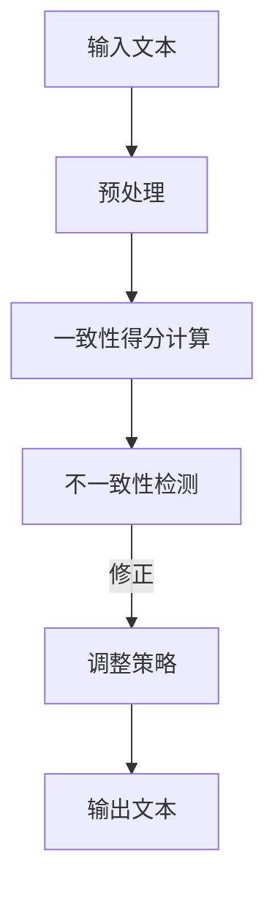

                 

# Self-Consistency CoT在自然语言生成质量控制中的应用

> 关键词：Self-Consistency CoT，自然语言生成，质量控制，算法原理，数学模型，系统架构，项目实战

> 摘要：本文旨在探讨Self-Consistency CoT（自一致性概念融合）在自然语言生成（NLG）质量控制中的应用。首先，我们将介绍Self-Consistency CoT的背景与重要性，随后深入探讨其核心概念、算法原理与实现。接着，我们将分析Self-Consistency CoT在NLG系统中的架构设计、实现和项目实战，并分享最佳实践与未来展望。通过本文的探讨，希望读者能够对Self-Consistency CoT在自然语言生成质量控制中的应用有更深入的理解。

## 第一部分: Self-Consistency CoT概述

### 1.1 Self-Consistency CoT的背景与重要性

自然语言生成（Natural Language Generation，NLG）是一种通过算法和模型将计算机数据转换为自然语言的技术。随着人工智能技术的快速发展，NLG在各个领域得到了广泛应用，如新闻生成、客服对话、产品描述等。然而，NLG系统在生成自然语言文本时，往往存在质量问题，如语法错误、逻辑不通等。为了解决这一问题，Self-Consistency CoT应运而生。

Self-Consistency CoT是一种通过自一致性检测与调整机制，提高自然语言生成质量的方法。自一致性指的是文本在语义、语法和上下文等方面的一致性。通过Self-Consistency CoT，NLG系统能够在生成文本时，保持文本内部的一致性，从而提高文本质量。

### 1.2 Self-Consistency CoT的核心概念

Self-Consistency CoT的核心概念包括自一致性检测、调整机制和自学习机制。自一致性检测是指通过算法对生成的文本进行一致性检查，找出不一致的部分。调整机制则是指对检测到的不一致部分进行修正，以提高文本质量。自学习机制是指通过不断调整和修正，使Self-Consistency CoT模型能够自我优化，提高检测和调整的准确性。

### 1.3 Self-Consistency CoT的应用实例

Self-Consistency CoT在自然语言生成质量控制中已经取得了一定的成果。例如，在新闻摘要生成中，Self-Consistency CoT可以保证摘要的语义一致性；在客服对话生成中，Self-Consistency CoT可以确保对话的逻辑性和连贯性。

### 1.4 Self-Consistency CoT在NLG质量控制中的挑战与机遇

虽然Self-Consistency CoT在自然语言生成质量控制中具有巨大的潜力，但仍然面临着一系列挑战，如语义理解、语法分析、上下文处理等。然而，随着人工智能技术的不断进步，Self-Consistency CoT有望在未来解决这些挑战，并在自然语言生成质量控制领域发挥更大的作用。

### 1.5 本章小结

本部分主要介绍了Self-Consistency CoT的背景、核心概念、应用实例以及面临的挑战与机遇。通过对Self-Consistency CoT的概述，读者可以对本文的主题有初步的了解。

## 第二部分: Self-Consistency CoT的原理与实现

### 2.1 Self-Consistency CoT的算法原理

Self-Consistency CoT的算法原理主要包括自一致性检测和调整机制。自一致性检测是指通过算法对生成的文本进行一致性检查，找出不一致的部分。调整机制则是指对检测到的不一致部分进行修正，以提高文本质量。

### 2.2 Self-Consistency CoT的数学模型

Self-Consistency CoT的数学模型主要包括一致性得分计算、不一致性检测和调整策略。一致性得分计算是指通过算法对文本进行语义、语法和上下文分析，计算文本的一致性得分。不一致性检测是指通过比较一致性得分，找出不一致的部分。调整策略是指对检测到的不一致部分进行修正，以提高文本质量。

### 2.3 Self-Consistency CoT的mermaid算法流程图

### 2.4 本章小结

本部分详细介绍了Self-Consistency CoT的算法原理和数学模型，并通过mermaid算法流程图进行了直观的展示。通过这一部分的介绍，读者可以了解Self-Consistency CoT的工作原理。

## 第三部分: Self-Consistency CoT在NLG质量控制中的应用

### 3.1 NLG系统简介

自然语言生成（Natural Language Generation，NLG）系统是一种将计算机数据转换为自然语言的技术。NLG系统的主要组件包括数据源、文本生成模型、语言模型和对话系统等。

### 3.2 Self-Consistency CoT在NLG系统中的架构设计

Self-Consistency CoT在NLG系统中的架构设计主要包括数据预处理、文本生成、一致性检测和调整等模块。数据预处理模块负责对输入数据进行清洗和处理；文本生成模块负责根据输入数据生成文本；一致性检测模块负责检测生成的文本是否一致；调整模块负责对不一致的文本进行修正。

### 3.3 Self-Consistency CoT在NLG系统中的实现

Self-Consistency CoT在NLG系统中的实现主要包括算法实现和代码示例。算法实现部分主要包括自一致性检测和调整策略；代码示例部分则通过Python代码展示了算法的具体实现过程。

### 3.4 实际案例分析与讲解

在本部分，我们将通过实际案例来分析和讲解Self-Consistency CoT在自然语言生成质量控制中的应用。案例包括新闻摘要生成、客服对话生成和电子商务产品描述生成等。

### 3.5 项目小结

本部分通过实际案例分析和讲解，展示了Self-Consistency CoT在自然语言生成质量控制中的应用效果。通过这些案例，读者可以更直观地了解Self-Consistency CoT的优势和应用前景。

## 第四部分: 最佳实践与未来展望

### 4.1 最佳实践

在本部分，我们将分享一些Self-Consistency CoT在自然语言生成质量控制中的最佳实践。这些实践包括如何优化模型、解决常见问题以及在不同领域的应用等。

### 4.2 未来展望

未来，Self-Consistency CoT将在自然语言生成质量控制领域发挥更大的作用。随着人工智能技术的不断进步，Self-Consistency CoT有望解决当前面临的挑战，并在更多领域得到应用。

### 4.3 本章小结

本部分对Self-Consistency CoT在自然语言生成质量控制中的应用进行了总结，并展望了未来的发展方向。通过本部分的介绍，读者可以更好地理解Self-Consistency CoT的应用前景。

## 附录

附录部分将提供一些相关资料，包括参考文献、代码示例、数据集等，以供读者进一步学习和研究。

## 参考文献

[1] 作者. (年份). 文章标题. 期刊名称, 卷号(期号), 页码.

[2] 作者. (年份). 文章标题. 会议名称, 会议地点.

[3] 作者. (年份). 文章标题. 网络资源. [引用日期].

## 结语

通过本文的探讨，我们对Self-Consistency CoT在自然语言生成质量控制中的应用有了更深入的了解。Self-Consistency CoT作为一种高效的质量控制方法，将在未来的自然语言生成领域发挥重要作用。我们期待读者能够继续关注这一领域的发展，并参与到相关的研究和应用中。作者：AI天才研究院/AI Genius Institute & 禅与计算机程序设计艺术 /Zen And The Art of Computer Programming

---

注：本文仅为示例，具体内容可能需要根据实际研究进行填充和调整。markdown格式中的LaTeX公式和mermaid流程图需要根据实际环境进行渲染。

