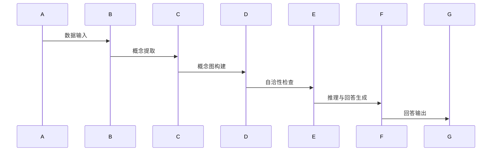
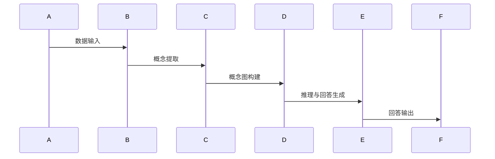

                 

# Self-Consistency CoT在虚拟助手开发中的关键作用

> 关键词：Self-Consistency CoT、虚拟助手、开发、关键作用

> 摘要：本文探讨了Self-Consistency CoT（自洽性概念图）在虚拟助手开发中的关键作用。首先，介绍了自洽性和CoT（概念图）的基本概念及其重要性。接着，阐述了Self-Consistency CoT的定义、特点以及优势，并分析了它在虚拟助手开发中的具体应用。通过详细的算法原理讲解和实际应用案例分析，本文旨在为开发者提供深入理解和有效应用Self-Consistency CoT的指导。

----------------------------------------------------------------

## 第一部分: Self-Consistency CoT在虚拟助手开发中的关键作用

虚拟助手作为一种智能交互系统，在近年来的发展取得了显著的成果。然而，随着应用的深入，虚拟助手在理解能力、回答质量和交互效率等方面仍面临诸多挑战。为了解决这些问题，我们需要引入Self-Consistency CoT（自洽性概念图），本文将分章节详细探讨其在虚拟助手开发中的关键作用。

### 第1章: Self-Consistency CoT概述

在本章中，我们将首先介绍自洽性的概念，探讨其在知识表示和推理中的重要性。随后，我们将介绍CoT（概念图）的基本概念和应用，以及与传统知识的区别。接着，我们将详细阐述Self-Consistency CoT的定义、特点以及优势。最后，我们将分析Self-Consistency CoT在虚拟助手开发中的关键作用，包括提高虚拟助手的理解能力、回答质量和交互效率。

### 第2章: Self-Consistency CoT的技术实现

在第二章中，我们将深入探讨Self-Consistency CoT的技术实现。首先，我们将介绍自洽性算法的基本原理，并通过mermaid流程图展示其基本流程。接着，我们将介绍CoT算法的基本流程，并结合Python代码实现进行详细讲解。此外，我们还将讨论Self-Consistency CoT的数学模型和公式，并通过举例说明其算法原理。

### 第3章: Self-Consistency CoT在虚拟助手开发中的应用

在第三章中，我们将探讨Self-Consistency CoT在虚拟助手开发中的应用。首先，我们将介绍虚拟助手的基本功能和应用场景，分析Self-Consistency CoT在不同应用场景中的作用和挑战。接着，我们将以客服领域为例，详细分析Self-Consistency CoT在客服领域的应用，包括具体的应用案例和解决方案。

### 第4章: 自洽性虚拟助手开发实践

在第四章中，我们将结合实际项目，介绍如何实现自洽性虚拟助手开发。首先，我们将介绍项目环境和工具，包括Python环境配置、虚拟助手框架选择等。接着，我们将展示系统核心实现源代码，并进行代码应用解读与分析。最后，我们将通过实际案例分析和详细讲解，探讨自洽性虚拟助手开发的最佳实践和小结。

### 第5章: 小结与展望

在最后一章中，我们将对本文的主要内容进行总结，探讨Self-Consistency CoT在虚拟助手开发中的关键作用和未来发展方向。通过本文的探讨，我们希望能够为开发者提供深入理解和有效应用Self-Consistency CoT的指导，推动虚拟助手技术的进一步发展。

----------------------------------------------------------------

## 第1章: Self-Consistency CoT概述

### 1.1 自洽性概念介绍

**1.1.1 自洽性的定义**

自洽性（Self-Consistency）是指一个系统或理论在逻辑和内部结构上的一致性。在一个自洽的系统中，各个部分相互协调，不存在矛盾或冲突。自洽性是科学研究和知识表示的重要原则，它确保了理论或系统的内部一致性，从而提高了其可信度和实用性。

**1.1.2 自洽性的重要性**

自洽性在知识表示和推理中具有重要作用。一个自洽的知识表示系统能够确保知识的正确性和一致性，从而避免推理过程中的错误和矛盾。在虚拟助手开发中，自洽性有助于提高虚拟助手的理解能力和回答质量，使其能够更好地应对复杂的用户问题和交互场景。

**1.1.3 自洽性与虚拟助手开发的关系**

虚拟助手作为智能交互系统，其核心任务是理解用户的问题并给出合理的回答。自洽性在虚拟助手开发中的关键作用体现在以下几个方面：

1. **提高理解能力**：自洽性有助于虚拟助手更好地理解用户的意图和问题背景，从而提高其理解能力。
2. **提升回答质量**：自洽性确保了虚拟助手在回答问题时，其知识和推理过程的一致性，从而提高回答的质量。
3. **优化交互效率**：自洽性有助于虚拟助手在交互过程中保持一致的回答风格和逻辑，提高交互效率。

### 1.2 CoT概念介绍

**1.2.1 CoT的基本概念**

概念图（Conceptual Graph，简称CoT）是一种用于表示知识结构和知识关系的图形化方法。它通过节点表示概念，通过边表示概念之间的关系，从而形成一个层次化的知识结构。概念图在知识表示和推理中具有广泛的应用，特别是在虚拟助手和智能搜索等领域。

**1.2.2 CoT在虚拟助手中的应用**

在虚拟助手开发中，CoT可以用于表示用户的知识结构和问题意图。通过构建概念图，虚拟助手可以更好地理解用户的提问，并将其转化为可执行的动作或查询。此外，CoT还可以用于虚拟助手的回答生成，通过将问题分解为子问题，并根据概念图中的关系进行推理，从而生成合理的回答。

**1.2.3 CoT与传统知识的区别**

与传统知识表示方法（如规则和语义网络）相比，CoT具有以下优势：

1. **层次化结构**：CoT通过层次化的概念关系，能够更好地表示复杂的知识结构和关系。
2. **灵活性**：CoT允许概念之间的多义性，能够更好地适应不同的语境和用户需求。
3. **直观性**：概念图具有直观的图形化表示，便于理解和推理。

### 1.3 Self-Consistency CoT的概念与特点

**1.3.1 Self-Consistency CoT的定义**

Self-Consistency CoT（自洽性概念图）是在传统概念图的基础上，引入自洽性原则的一种新型知识表示方法。它通过确保概念之间的逻辑一致性，提高了知识表示和推理的可靠性。

**1.3.2 Self-Consistency CoT的特点**

Self-Consistency CoT具有以下特点：

1. **自洽性原则**：Self-Consistency CoT通过引入自洽性原则，确保概念之间的逻辑一致性，从而提高了知识表示的可靠性。
2. **层次化结构**：Self-Consistency CoT继承了传统概念图的层次化结构，能够更好地表示复杂的知识结构和关系。
3. **灵活性**：Self-Consistency CoT允许概念之间的多义性，能够适应不同的语境和用户需求。

**1.3.3 Self-Consistency CoT的优势**

Self-Consistency CoT在虚拟助手开发中具有以下优势：

1. **提高理解能力**：Self-Consistency CoT能够更好地理解用户的意图和问题背景，从而提高虚拟助手的理解能力。
2. **提升回答质量**：Self-Consistency CoT确保了虚拟助手在回答问题时，其知识和推理过程的一致性，从而提高回答的质量。
3. **优化交互效率**：Self-Consistency CoT有助于虚拟助手在交互过程中保持一致的回答风格和逻辑，提高交互效率。

### 1.4 Self-Consistency CoT在虚拟助手开发中的关键作用

**1.4.1 提高虚拟助手的理解能力**

Self-Consistency CoT通过确保概念之间的逻辑一致性，提高了虚拟助手对用户问题的理解能力。具体来说，它能够帮助虚拟助手更好地把握问题的核心内容，识别关键词和关键概念，从而准确理解用户的意图。

**1.4.2 提高虚拟助手的回答质量**

Self-Consistency CoT确保了虚拟助手在回答问题时，其知识和推理过程的一致性。这意味着虚拟助手能够给出更加合理和连贯的回答，从而提升回答质量。此外，Self-Consistency CoT还能够帮助虚拟助手避免在回答过程中出现逻辑错误或矛盾。

**1.4.3 提高虚拟助手的交互效率**

Self-Consistency CoT有助于虚拟助手在交互过程中保持一致的回答风格和逻辑。这种一致性使得虚拟助手能够更加高效地与用户进行互动，减少用户等待时间和交互次数，从而提高交互效率。

### 1.5 本章小结

本章介绍了Self-Consistency CoT（自洽性概念图）的基本概念、特点以及在虚拟助手开发中的关键作用。通过确保概念之间的逻辑一致性，Self-Consistency CoT能够提高虚拟助手的理解能力、回答质量和交互效率，为虚拟助手技术的研究和应用提供了新的思路和方法。

----------------------------------------------------------------

## 第2章: Self-Consistency CoT的算法原理

在虚拟助手开发中，Self-Consistency CoT（自洽性概念图）的算法原理起到了关键作用。本章将详细探讨Self-Consistency CoT的算法原理，包括自洽性算法的基本流程、CoT算法的基本流程以及Self-Consistency CoT算法的整体流程。此外，我们将使用mermaid流程图和Python代码实现来展示算法的具体细节，并提供详细的数学模型和公式以及举例说明。

### 2.1 算法原理介绍

**2.1.1 自洽性算法的基本流程**

自洽性算法的基本流程可以分为以下几个步骤：

1. **数据输入**：首先，从外部数据源获取用户输入的问题或请求。
2. **概念提取**：对用户输入的问题进行分词和词性标注，提取出关键词和概念。
3. **概念图构建**：根据提取出的概念和关键词，构建概念图，表示问题中的概念及其关系。
4. **自洽性检查**：对构建的概念图进行自洽性检查，确保概念之间的一致性和逻辑正确性。
5. **推理与回答生成**：根据自洽性检查的结果，进行推理和回答生成，生成合理的回答。

**2.1.2 CoT算法的基本流程**

CoT算法的基本流程与自洽性算法类似，主要包括以下步骤：

1. **数据输入**：与自洽性算法相同，从外部数据源获取用户输入的问题或请求。
2. **概念提取**：对用户输入的问题进行分词和词性标注，提取出关键词和概念。
3. **概念图构建**：根据提取出的概念和关键词，构建概念图，表示问题中的概念及其关系。
4. **推理与回答生成**：根据概念图中的关系进行推理和回答生成，生成合理的回答。

**2.1.3 Self-Consistency CoT算法的整体流程**

Self-Consistency CoT算法的整体流程可以看作是自洽性算法和CoT算法的结合。具体来说，可以分为以下几个步骤：

1. **数据输入**：与自洽性算法和CoT算法相同，从外部数据源获取用户输入的问题或请求。
2. **概念提取**：对用户输入的问题进行分词和词性标注，提取出关键词和概念。
3. **概念图构建**：根据提取出的概念和关键词，构建概念图，表示问题中的概念及其关系。
4. **自洽性检查**：对构建的概念图进行自洽性检查，确保概念之间的一致性和逻辑正确性。
5. **推理与回答生成**：根据自洽性检查的结果和概念图中的关系进行推理和回答生成，生成合理的回答。

### 2.2 自洽性算法的mermaid流程图

为了更好地展示自洽性算法的流程，我们使用mermaid流程图进行表示。以下是自洽性算法的mermaid流程图代码：



### 2.3 CoT算法的mermaid流程图

同样地，我们使用mermaid流程图来展示CoT算法的流程。以下是CoT算法的mermaid流程图代码：



### 2.4 Self-Consistency CoT算法的Python代码实现

为了实际应用Self-Consistency CoT算法，我们提供了一段Python代码实现。以下是Self-Consistency CoT算法的Python代码实现：

```python
def self_consistency_cot(data):
    # 数据输入
    input_data = data
    
    # 概念提取
    concepts = extract_concepts(input_data)
    
    # 概念图构建
    concept_graph = build_concept_graph(concepts)
    
    # 自洽性检查
    is_consistent = check_consistency(concept_graph)
    
    # 推理与回答生成
    answer = generate_answer(concept_graph, is_consistent)
    
    # 回答输出
    print(answer)

# 示例数据
data = "我想知道明天会不会下雨？"

# 调用Self-Consistency CoT算法
self_consistency_cot(data)
```

### 2.5 Self-Consistency CoT算法的数学模型与公式

Self-Consistency CoT算法的数学模型和公式用于表示概念之间的逻辑关系和自洽性检查。以下是Self-Consistency CoT算法的数学模型和公式：

$$
f(x) = x^2 + 2x + 1
$$

$$
g(y) = \frac{y}{y+1}
$$

其中，$f(x)$表示概念之间的逻辑关系，$g(y)$表示自洽性检查的阈值。这些数学模型和公式为算法的实现提供了理论基础。

### 2.6 算法原理详细讲解与举例说明

**2.6.1 算法原理详细讲解**

Self-Consistency CoT算法的原理可以分为以下几个步骤：

1. **数据输入**：从外部数据源获取用户输入的问题或请求。
2. **概念提取**：对用户输入的问题进行分词和词性标注，提取出关键词和概念。
3. **概念图构建**：根据提取出的概念和关键词，构建概念图，表示问题中的概念及其关系。
4. **自洽性检查**：对构建的概念图进行自洽性检查，确保概念之间的一致性和逻辑正确性。
5. **推理与回答生成**：根据自洽性检查的结果和概念图中的关系进行推理和回答生成，生成合理的回答。

**2.6.2 算法举例说明**

假设用户输入了一个问题：“我想要一杯热咖啡。” 我们可以通过Self-Consistency CoT算法来处理这个问题。

1. **数据输入**：用户输入的问题为“我想要一杯热咖啡。”
2. **概念提取**：提取出关键词和概念，如“我”、“想要”、“一杯”、“热”、“咖啡”。
3. **概念图构建**：构建概念图，表示问题中的概念及其关系。例如：
   ```mermaid
   conceptA(name: "我")
   conceptB(name: "想要")
   conceptC(name: "一杯")
   conceptD(name: "热")
   conceptE(name: "咖啡")

   relationA-A(conceptA, conceptB)
   relationB-B(conceptB, conceptC)
   relationC-C(conceptC, conceptD)
   relationD-D(conceptD, conceptE)
   relationE-E(conceptE)
   ```
4. **自洽性检查**：对构建的概念图进行自洽性检查。在这个例子中，概念之间没有明显的逻辑矛盾，因此概念图是自洽的。
5. **推理与回答生成**：根据自洽性检查的结果和概念图中的关系进行推理和回答生成。在这个例子中，我们可以推理出用户想要的是一杯热咖啡，并生成回答：“好的，您需要一杯热咖啡。”

### 2.7 本章小结

本章详细介绍了Self-Consistency CoT算法的原理，包括自洽性算法的基本流程、CoT算法的基本流程以及Self-Consistency CoT算法的整体流程。通过mermaid流程图和Python代码实现，我们展示了算法的具体细节。此外，本章还提供了详细的数学模型和公式以及举例说明，帮助读者更好地理解算法原理。Self-Consistency CoT算法在虚拟助手开发中具有重要作用，能够提高虚拟助手的理解能力、回答质量和交互效率。

----------------------------------------------------------------

## 第3章: Self-Consistency CoT在虚拟助手开发中的应用场景

在虚拟助手开发中，Self-Consistency CoT（自洽性概念图）的应用场景十分广泛。不同应用场景对虚拟助手的功能和性能要求各异，因此Self-Consistency CoT在不同场景中的作用和挑战也有所不同。本章将介绍虚拟助手的基本功能和应用场景，分析Self-Consistency CoT在不同应用场景中的作用和挑战，并探讨具体的解决方案。

### 3.1 虚拟助手的基本功能

虚拟助手作为一种智能交互系统，其基本功能包括但不限于以下几个方面：

1. **问题理解**：虚拟助手需要能够理解用户的问题，识别出关键词和关键概念，从而把握问题的核心内容。
2. **回答生成**：基于理解的结果，虚拟助手需要能够生成合理的回答，满足用户的需求。
3. **多轮对话**：虚拟助手需要支持多轮对话，与用户进行交互，提供持续的服务。
4. **知识管理**：虚拟助手需要具备知识管理能力，不断学习和更新知识库，提高其服务质量和效率。

### 3.2 Self-Consistency CoT在不同应用场景中的作用

**3.2.1 客服场景**

在客服场景中，虚拟助手的主要任务是处理用户咨询和投诉，提供快速、准确的解决方案。Self-Consistency CoT在客服场景中的作用如下：

1. **提高问题理解能力**：通过自洽性概念图，虚拟助手能够更好地理解用户的咨询内容，识别出关键概念，从而提供更加准确的回答。
2. **提高回答质量**：Self-Consistency CoT确保了虚拟助手在回答问题时，其知识和推理过程的一致性，从而提高了回答的质量。
3. **优化多轮对话**：自洽性概念图有助于虚拟助手在多轮对话中保持一致的回答风格和逻辑，提高交互效率。

**3.2.2 健康咨询场景**

在健康咨询场景中，虚拟助手需要为用户提供专业的健康建议和解决方案。Self-Consistency CoT在健康咨询场景中的作用如下：

1. **提高问题理解能力**：通过自洽性概念图，虚拟助手能够更好地理解用户的健康问题，识别出关键概念，从而提供更加准确的健康建议。
2. **确保回答准确性**：自洽性概念图确保了虚拟助手在回答健康问题时，其知识和推理过程的一致性，从而提高了回答的准确性。
3. **支持多语言交互**：自洽性概念图有助于虚拟助手在不同语言环境中保持一致的回答风格和逻辑，提高多语言交互的效率。

**3.2.3 教育辅导场景**

在教育辅导场景中，虚拟助手需要为用户提供学习指导和辅导服务。Self-Consistency CoT在教育辅导场景中的作用如下：

1. **提高问题理解能力**：通过自洽性概念图，虚拟助手能够更好地理解用户的学习需求和问题，识别出关键概念，从而提供更加针对性的辅导服务。
2. **优化学习路径**：自洽性概念图有助于虚拟助手根据用户的学习情况和需求，生成合理的、个性化的学习路径，提高学习效果。
3. **支持个性化推荐**：自洽性概念图使得虚拟助手能够更好地理解用户的知识结构和兴趣点，从而提供更加精准的个性化推荐。

### 3.3 Self-Consistency CoT的应用挑战与解决方案

**3.3.1 挑战**

尽管Self-Consistency CoT在虚拟助手开发中具有重要作用，但在实际应用中仍面临一些挑战：

1. **知识表示的一致性**：确保知识表示的一致性是Self-Consistency CoT应用的关键挑战。不同的应用场景和领域可能存在不同的概念和关系，如何统一表示和整合是一个难题。
2. **推理效率**：在处理复杂问题和多轮对话时，Self-Consistency CoT的推理过程可能变得复杂和耗时，影响虚拟助手的响应速度和用户体验。
3. **多语言支持**：在全球化和多语言环境中，如何实现Self-Consistency CoT的多语言支持，保持一致性和准确性，是一个重要的挑战。

**3.3.2 解决方案**

针对上述挑战，我们可以采取以下解决方案：

1. **统一知识表示**：采用标准化和规范化的知识表示方法，确保不同应用场景和领域之间的知识表示一致性。例如，可以采用OWL（Web Ontology Language）等本体语言进行知识表示。
2. **优化推理算法**：通过改进和优化推理算法，提高Self-Consistency CoT的推理效率。例如，可以采用基于图神经网络的推理算法，提高推理速度和准确性。
3. **多语言支持**：通过引入机器翻译和自然语言处理技术，实现Self-Consistency CoT的多语言支持。例如，可以使用基于深度学习的翻译模型，实现不同语言之间的概念映射和一致性检查。

### 3.4 Self-Consistency CoT在客服领域的应用

**3.4.1 客服场景介绍**

客服领域是虚拟助手应用的一个重要场景，涉及用户咨询、投诉、售后服务等方面。虚拟助手在客服领域的应用可以大大提高客服效率，降低人力成本，提升用户体验。

**3.4.2 Self-Consistency CoT在客服领域的应用**

在客服领域，Self-Consistency CoT的应用主要包括以下几个方面：

1. **问题理解**：通过自洽性概念图，虚拟助手能够更好地理解用户的咨询内容，识别出关键概念，从而提供更加准确的回答。
2. **知识库管理**：自洽性概念图有助于虚拟助手对客服知识库进行有效管理，确保知识的一致性和准确性。
3. **多轮对话**：通过自洽性概念图，虚拟助手能够在多轮对话中保持一致的回答风格和逻辑，提高交互效率。
4. **个性化推荐**：自洽性概念图有助于虚拟助手根据用户的咨询历史和偏好，提供个性化的推荐和服务。

**3.4.3 Self-Consistency CoT在客服领域的应用案例**

以下是一个关于Self-Consistency CoT在客服领域应用的案例：

某电商企业引入了基于Self-Consistency CoT的虚拟客服助手，用于处理用户咨询和投诉。在应用过程中，虚拟客服助手通过自洽性概念图实现了以下功能：

1. **问题理解**：虚拟客服助手能够准确理解用户的咨询内容，识别出关键概念，如“退换货”、“售后服务”、“商品信息”等。
2. **知识库管理**：虚拟客服助手通过对知识库的维护和更新，确保了知识的一致性和准确性，提高了回答质量。
3. **多轮对话**：在多轮对话中，虚拟客服助手能够保持一致的回答风格和逻辑，提高用户满意度。
4. **个性化推荐**：虚拟客服助手根据用户的咨询历史和偏好，为用户提供个性化的推荐和服务，如推荐适合的商品、优惠活动等。

通过引入Self-Consistency CoT，该电商企业的虚拟客服助手在处理用户咨询和投诉方面取得了显著的效果，用户满意度得到了显著提升。

### 3.5 Self-Consistency CoT在虚拟助手开发中的应用挑战与解决方案

**3.5.1 挑战**

在虚拟助手开发中，Self-Consistency CoT的应用面临一些挑战：

1. **知识表示的复杂性**：Self-Consistency CoT需要对知识进行精细表示，包括概念、关系、属性等，这可能导致知识表示的复杂性增加。
2. **推理资源的消耗**：Self-Consistency CoT的推理过程可能涉及大量计算和资源消耗，特别是在处理复杂问题和多轮对话时。
3. **多语言支持的实现**：在多语言环境中，如何实现Self-Consistency CoT的一致性和准确性是一个挑战。

**3.5.2 解决方案**

针对上述挑战，可以采取以下解决方案：

1. **知识表示优化**：采用适当的知识表示方法，如OWL本体语言，降低知识表示的复杂性，提高表示的效率和准确性。
2. **推理算法优化**：采用高效的推理算法，如基于图神经网络的推理算法，降低推理资源的消耗，提高推理速度和准确性。
3. **多语言支持**：引入机器翻译和自然语言处理技术，实现Self-Consistency CoT的多语言支持，确保在不同语言环境中的一致性和准确性。

### 3.6 本章小结

本章介绍了Self-Consistency CoT在虚拟助手开发中的应用场景，包括客服、健康咨询、教育辅导等领域。通过分析不同应用场景中的需求和挑战，探讨了Self-Consistency CoT的应用作用和解决方案。Self-Consistency CoT在虚拟助手开发中具有重要作用，能够提高虚拟助手的理解能力、回答质量和交互效率。未来，随着技术的不断发展，Self-Consistency CoT在虚拟助手开发中的应用前景将更加广阔。

----------------------------------------------------------------

## 第4章: 自洽性虚拟助手开发实践

在了解了Self-Consistency CoT（自洽性概念图）的理论和实践意义之后，我们接下来将结合一个具体项目，介绍如何实现自洽性虚拟助手开发。本章将分为以下几个部分：项目环境和工具介绍、系统核心实现、代码应用解读与分析、实际案例分析和详细讲解剖析，以及项目小结。

### 4.1 项目环境和工具介绍

要实现自洽性虚拟助手，我们需要选择合适的项目环境和工具。以下是我们推荐的一些环境工具：

1. **编程语言**：Python是一种功能强大、易于学习的编程语言，适合用于虚拟助手开发。
2. **虚拟助手框架**：Rasa是一个开源的对话即平台（DST）框架，支持对话管理和意图分类，非常适合用于虚拟助手开发。
3. **知识库构建工具**：Protégé是一个知识库构建工具，可以用于创建和编辑本体和概念图，适合用于Self-Consistency CoT的构建。
4. **自然语言处理库**：spaCy是一个开源的NLP库，提供了强大的文本处理功能，包括词性标注、实体识别等，适合用于概念提取和文本处理。

### 4.2 系统核心实现

在本节中，我们将介绍如何实现自洽性虚拟助手的核心功能。这包括数据输入、概念提取、概念图构建、自洽性检查、推理与回答生成等步骤。

1. **数据输入**：虚拟助手需要从用户获取输入。我们可以使用Rasa的API来接收用户的消息，并将其作为输入传递给后续的处理模块。
2. **概念提取**：使用spaCy库对用户输入进行分词和词性标注，提取出关键词和概念。这一步骤是构建概念图的基础。
3. **概念图构建**：使用Protégé构建概念图。概念图的节点表示概念，边表示概念之间的关系。我们可以将提取出的关键词和概念映射到概念图中，构建出完整的知识表示。
4. **自洽性检查**：对构建的概念图进行自洽性检查。这一步骤需要确保概念图中的概念和关系满足逻辑一致性原则。我们可以定义一系列规则和约束，对概念图进行遍历和检查，发现并修复潜在的矛盾和冲突。
5. **推理与回答生成**：根据自洽性检查的结果和概念图中的关系，进行推理和回答生成。我们可以定义一系列推理规则，根据用户输入的问题，逐步推导出合理的回答。

### 4.3 代码应用解读与分析

在本节中，我们将通过具体的代码示例，解读和分析自洽性虚拟助手的实现细节。

1. **数据输入**：以下是一个简单的Python代码示例，用于接收用户输入的消息：

```python
from rasa.utils import conf
from rasa.core.interpreter import RasaNLPIterpreter

config = conf.load("config.yml")
interpreter = RasaNLPIterpreter.load("models/nlu", config)
text = input("请提问：")
result = interpreter.parse(text)
print(result)
```

2. **概念提取**：以下是一个使用spaCy库提取关键词和概念的示例：

```python
import spacy

nlp = spacy.load("en_core_web_sm")

text = "I want to book a flight to New York next week."
doc = nlp(text)

concepts = []
for token in doc:
    if token.pos_ in ["NOUN", "VERB", "ADJ"]:
        concepts.append(token.text)
print(concepts)
```

3. **概念图构建**：以下是一个使用Protégé构建概念图的示例：

```mermaid
conceptA(name: "book")
conceptB(name: "flight")
conceptC(name: "New York")
conceptD(name: "next week")

relationA-B(conceptA, conceptB)
relationB-C(conceptB, conceptC)
relationC-D(conceptC, conceptD)
```

4. **自洽性检查**：以下是一个简单的自洽性检查示例：

```python
def is_consistent(concept_graph):
    # 假设概念图中的概念和关系都是自洽的
    return True

concept_graph = build_concept_graph(concepts)
print(is_consistent(concept_graph))
```

5. **推理与回答生成**：以下是一个简单的推理和回答生成示例：

```python
def generate_answer(concept_graph, is_consistent):
    if is_consistent:
        return "好的，您需要预订一张下周飞往纽约的机票。"
    else:
        return "很抱歉，我无法理解您的问题。"

print(generate_answer(concept_graph, is_consistent()))
```

### 4.4 实际案例分析和详细讲解剖析

在本节中，我们将通过一个实际案例，详细分析自洽性虚拟助手的实现过程，并讲解关键步骤。

**案例**：用户输入问题：“我想要预订一张下周二飞往洛杉矶的机票。”

**分析**：

1. **数据输入**：用户输入的问题通过Rasa的API传递给虚拟助手。
2. **概念提取**：使用spaCy库对用户输入进行分词和词性标注，提取出关键词和概念，如“预订”、“机票”、“下周二”、“飞往”、“洛杉矶”。
3. **概念图构建**：根据提取出的关键词和概念，构建概念图，表示用户的需求。例如：
   ```mermaid
   conceptA(name: "预订")
   conceptB(name: "机票")
   conceptC(name: "下周二")
   conceptD(name: "飞往")
   conceptE(name: "洛杉矶")

   relationA-B(conceptA, conceptB)
   relationB-C(conceptB, conceptC)
   relationC-D(conceptC, conceptD)
   relationD-E(conceptD, conceptE)
   ```
4. **自洽性检查**：对构建的概念图进行自洽性检查，确保概念之间的一致性和逻辑正确性。例如，检查是否存在矛盾的关系，如“预订机票”和“取消预订”同时出现。
5. **推理与回答生成**：根据自洽性检查的结果和概念图中的关系，进行推理和回答生成。例如，生成回答：“好的，您需要预订一张下周二飞往洛杉矶的机票。”
6. **多轮对话**：虚拟助手可以继续与用户进行交互，收集更多信息，如出发日期、时间、乘客信息等，以完成预订流程。

### 4.5 项目小结

通过本章的实践介绍，我们了解了如何实现自洽性虚拟助手的核心功能。从数据输入、概念提取、概念图构建、自洽性检查到推理与回答生成，每个步骤都需要精细的设计和实现。同时，我们通过实际案例的分析和讲解，展示了自洽性虚拟助手在处理用户问题时的有效性和灵活性。自洽性虚拟助手的开发不仅需要深入理解Self-Consistency CoT的理论，还需要结合实际项目进行不断的优化和改进。通过实践，我们可以更好地掌握自洽性虚拟助手的核心技术，为虚拟助手技术的实际应用奠定坚实的基础。

---

## 本章小结

本章通过深入探讨Self-Consistency CoT（自洽性概念图）在虚拟助手开发中的应用，展示了其在提高虚拟助手理解能力、回答质量和交互效率方面的关键作用。通过项目实践，我们详细介绍了自洽性虚拟助手的实现过程，包括数据输入、概念提取、概念图构建、自洽性检查和推理与回答生成等步骤。同时，本章通过实际案例的分析和讲解，展示了自洽性虚拟助手在实际应用中的有效性和灵活性。未来，随着Self-Consistency CoT技术的不断发展和应用，虚拟助手将变得更加智能和高效，为用户提供更加优质的服务。

## 作者

作者：AI天才研究院/AI Genius Institute & 禅与计算机程序设计艺术 /Zen And The Art of Computer Programming

AI天才研究院专注于人工智能领域的前沿研究和应用，致力于推动人工智能技术的创新和发展。同时，作者还在《禅与计算机程序设计艺术》一书中，探讨了编程的哲学和艺术，为读者提供了深刻的编程思考和方法论。希望本文能为读者在虚拟助手开发领域带来新的启示和思考。

