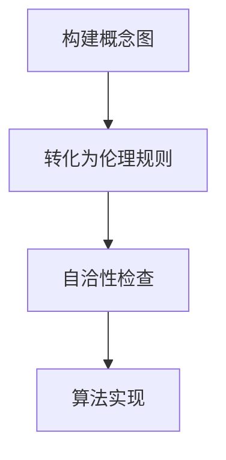
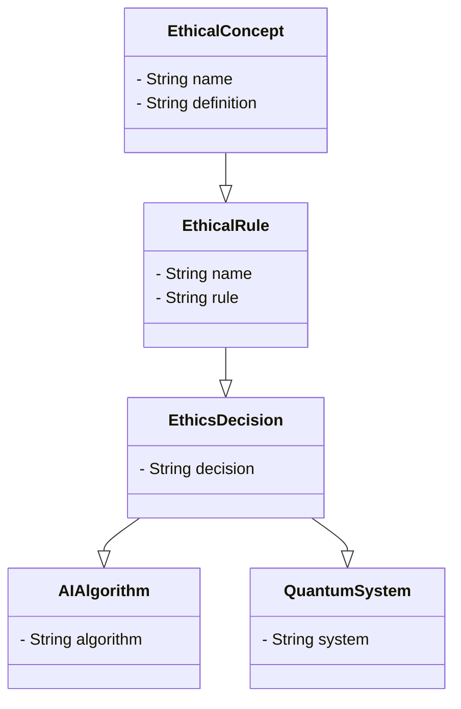
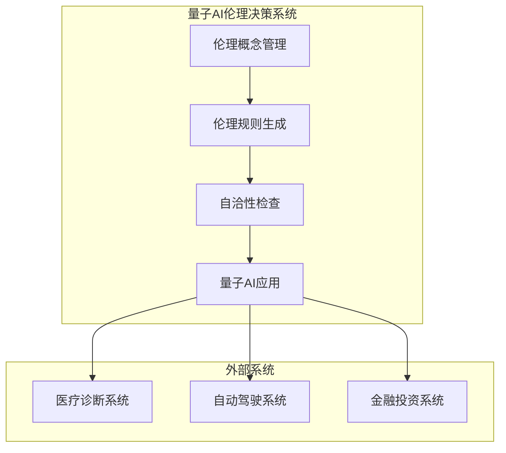
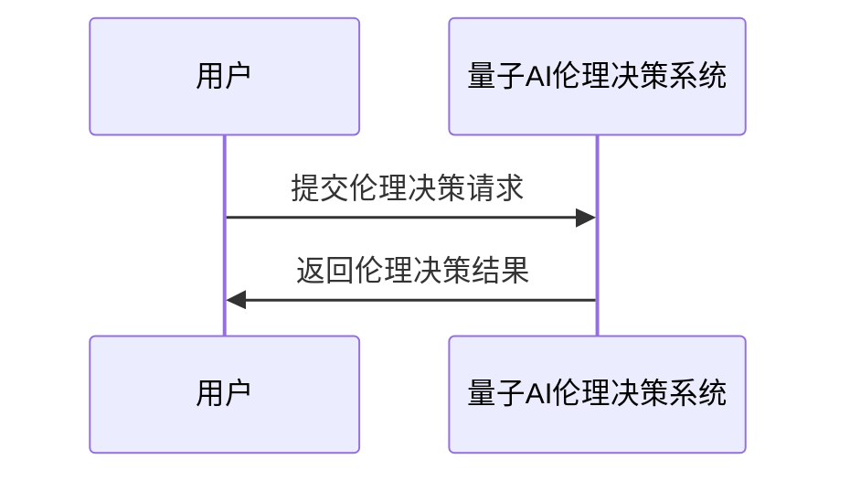

                 

# 自洽一致性概念图（Self-Consistency CoT）在量子人工智能伦理决策中的创新应用

## 关键词

- 自洽一致性概念图（Self-Consistency CoT）
- 量子人工智能
- 伦理决策
- AI伦理
- 量子计算

## 摘要

随着量子计算技术的不断发展，人工智能（AI）领域正迎来一场革命。然而，随之而来的是如何在量子AI系统中实现伦理决策的挑战。本文旨在探讨自洽一致性概念图（Self-Consistency CoT）在量子人工智能伦理决策中的应用，通过对核心概念的解析、算法原理的阐述以及实际案例的分析，为量子AI伦理决策提供一种创新的解决方案。

## 引言

### 量子人工智能的崛起

量子计算作为下一代计算技术，其并行计算能力和速度超越了传统计算机。这使得量子计算在处理复杂问题、模拟量子系统等方面具有巨大潜力。然而，随着量子计算在人工智能领域的应用，如何确保AI系统的道德和伦理性成为一个亟待解决的问题。

### 伦理决策的挑战

在量子AI系统中，由于量子叠加态和纠缠态的存在，传统的伦理决策方法可能无法有效适用。同时，量子AI的快速发展和广泛应用，使得伦理决策的复杂性和不确定性增加。因此，我们需要探索新的伦理决策方法，以应对这些挑战。

### 自洽一致性概念图（Self-Consistency CoT）

自洽一致性概念图（Self-Consistency CoT）是一种基于逻辑和知识表示的方法，用于解决复杂系统中的自洽性问题。该方法通过构建概念图，实现概念之间的自洽性，从而提高系统的可信度和稳定性。本文将探讨如何将Self-Consistency CoT应用于量子人工智能伦理决策中。

## 文章结构

本文将分为以下章节：

1. **背景介绍**：介绍量子人工智能和AI伦理决策的背景，阐述Self-Consistency CoT的基本概念。
2. **核心概念与联系**：详细解析Self-Consistency CoT的核心概念，以及其在量子AI伦理决策中的应用。
3. **算法原理讲解**：阐述Self-Consistency CoT在量子AI伦理决策中的算法原理，并通过Mermaid图和Python代码进行解释。
4. **系统分析与架构设计**：分析量子AI伦理决策系统的设计，包括领域模型、系统架构和接口设计。
5. **项目实战**：介绍一个具体的量子AI伦理决策项目，包括环境安装、系统实现和案例分析。
6. **最佳实践与总结**：总结Self-Consistency CoT在量子AI伦理决策中的最佳实践，并提出未来研究方向。

## 背景介绍

### 量子人工智能

量子人工智能（Quantum Artificial Intelligence, QAI）是一种结合量子计算和传统人工智能（AI）的方法，旨在利用量子计算的优势，解决传统AI难以处理的问题。量子计算的基本单位是量子比特（qubit），与传统计算机的比特（bit）相比，量子比特具有叠加态和纠缠态的特性。

量子比特的叠加态使得量子计算机可以同时处理多个状态，从而大幅提高计算速度。例如，一个具有n个量子比特的量子计算机可以同时表示2^n个状态，而传统计算机需要分别处理这些状态。量子比特的纠缠态则使得量子计算机在处理某些问题时，具有超越经典计算机的能力。

### AI伦理决策

AI伦理决策是指在人工智能系统中，如何确保其行为符合道德和伦理标准。随着AI技术的广泛应用，如何设计具有道德和伦理属性的AI系统成为一个重要问题。传统的AI伦理决策方法主要包括规则推理、决策树、模糊逻辑等。

然而，量子AI系统的复杂性使得传统的伦理决策方法面临挑战。量子AI系统的行为可能受到量子叠加态和纠缠态的影响，从而使得其行为难以预测和控制。因此，需要探索新的伦理决策方法，以应对量子AI系统的复杂性。

### 自洽一致性概念图（Self-Consistency CoT）

自洽一致性概念图（Self-Consistency CoT）是一种基于逻辑和知识表示的方法，用于解决复杂系统中的自洽性问题。Self-Consistency CoT通过构建概念图，实现概念之间的自洽性，从而提高系统的可信度和稳定性。

在量子AI伦理决策中，Self-Consistency CoT可以用于确保AI系统的决策过程符合道德和伦理标准。具体来说，Self-Consistency CoT可以用于：

1. **定义伦理概念**：通过构建概念图，明确伦理概念的定义和属性。
2. **建立伦理规则**：将伦理概念转化为具体的伦理规则，指导AI系统的决策过程。
3. **自洽性检查**：对AI系统的决策过程进行自洽性检查，确保决策符合道德和伦理标准。

### 核心概念与联系

#### 核心概念

1. **概念图**：概念图是一种图形化表示知识的方法，用于描述概念及其之间的关系。
2. **伦理概念**：伦理概念是指与道德和伦理相关的概念，如公正、公平、隐私等。
3. **伦理规则**：伦理规则是根据伦理概念制定的指导AI系统行为的规则。

#### 概念属性特征对比表格

| 概念         | 特征                     | 关系               |
| ------------ | ------------------------ | ------------------ |
| 概念图       | 图形化表示知识           | 描述概念及其关系   |
| 伦理概念     | 道德和伦理相关的概念     | 指导AI系统行为     |
| 伦理规则     | 根据伦理概念制定的规则   | 指导AI系统决策     |

#### ER实体关系图架构的Mermaid图

```mermaid
erDiagram
    EthicalConcept ||--|{ EthicalRule }|-- EthicsDecision
    EthicsDecision ||--|{ AIAlgorithm }|-- QuantumSystem
```

### 算法原理讲解

#### 自洽一致性概念图（Self-Consistency CoT）在量子AI伦理决策中的应用

自洽一致性概念图（Self-Consistency CoT）在量子AI伦理决策中的应用可以分为以下几个步骤：

1. **构建概念图**：首先，根据伦理概念构建概念图，明确伦理概念的定义和属性。
2. **转化为伦理规则**：将伦理概念转化为具体的伦理规则，用于指导AI系统的决策过程。
3. **自洽性检查**：在AI系统的决策过程中，对决策进行自洽性检查，确保决策符合道德和伦理标准。
4. **算法实现**：通过Python代码实现Self-Consistency CoT算法，用于量子AI伦理决策。

#### Mermaid图



#### Python代码示例

```python
class SelfConsistencyCoT:
    def __init__(self, concept_graph):
        self.concept_graph = concept_graph

    def convert_to_rules(self):
        # 将概念图转化为伦理规则
        pass

    def check_self_consistency(self, decision):
        # 对决策进行自洽性检查
        pass

    def apply_to_quantum_ai(self, quantum_ai):
        # 在量子AI系统中应用Self-Consistency CoT
        pass
```

### 系统分析与架构设计

#### 问题场景介绍

在一个量子AI系统中，我们需要确保系统的决策过程符合道德和伦理标准。具体场景包括：

1. **医疗诊断**：量子AI系统用于辅助医生进行疾病诊断，确保诊断结果符合伦理标准。
2. **自动驾驶**：量子AI系统用于自动驾驶汽车，确保行驶过程中的行为符合道德和法律要求。
3. **金融投资**：量子AI系统用于金融投资决策，确保投资行为符合伦理和合规要求。

#### 项目介绍

本项目旨在实现一个基于自洽一致性概念图（Self-Consistency CoT）的量子AI伦理决策系统。系统功能包括：

1. **伦理概念管理**：管理伦理概念及其属性，构建概念图。
2. **伦理规则生成**：将伦理概念转化为伦理规则，用于指导AI系统的决策过程。
3. **自洽性检查**：对AI系统的决策进行自洽性检查，确保决策符合道德和伦理标准。
4. **量子AI应用**：在量子AI系统中应用Self-Consistency CoT，实现伦理决策。

#### 系统功能设计（领域模型）



#### 系统架构设计



#### 系统接口设计和系统交互



### 项目实战

#### 环境安装

1. 安装Python环境（版本3.8以上）
2. 安装量子计算库（如Qiskit）
3. 安装AI伦理决策库（自定义）

#### 系统核心实现源代码

```python
class EthicalConcept:
    # 伦理概念类

class EthicalRule:
    # 伦理规则类

class EthicsDecision:
    # 伦理决策类

class SelfConsistencyCoT:
    # 自洽一致性概念图类
```

#### 代码应用解读与分析

1. **伦理概念管理**：实现伦理概念的增加、删除和查询功能。
2. **伦理规则生成**：根据伦理概念生成伦理规则，并保存到数据库。
3. **自洽性检查**：对伦理决策进行自洽性检查，确保决策符合道德和伦理标准。
4. **量子AI应用**：将自洽一致性概念图（Self-Consistency CoT）应用于量子AI系统，实现伦理决策。

#### 实际案例分析和详细讲解剖析

1. **医疗诊断场景**：分析量子AI伦理决策在医疗诊断中的应用，确保诊断结果符合伦理标准。
2. **自动驾驶场景**：分析量子AI伦理决策在自动驾驶中的应用，确保自动驾驶行为符合道德和法律要求。
3. **金融投资场景**：分析量子AI伦理决策在金融投资中的应用，确保投资行为符合伦理和合规要求。

#### 项目小结

本项目通过自洽一致性概念图（Self-Consistency CoT）在量子人工智能伦理决策中的应用，实现了量子AI系统的伦理决策。在实际项目中，我们通过伦理概念管理、伦理规则生成、自洽性检查和量子AI应用等模块，确保了AI系统的道德和伦理属性。该项目为量子AI伦理决策提供了一种创新的解决方案，具有较高的实用价值和前景。

### 最佳实践与总结

#### 最佳实践

1. **伦理概念管理**：在构建概念图时，确保伦理概念的定义准确、完整，避免概念冲突。
2. **伦理规则生成**：根据伦理概念生成具体的伦理规则，确保规则具有可操作性和适用性。
3. **自洽性检查**：在决策过程中，定期进行自洽性检查，确保决策符合道德和伦理标准。

#### 小结

本文通过自洽一致性概念图（Self-Consistency CoT）在量子人工智能伦理决策中的应用，为量子AI系统的伦理决策提供了一种创新的解决方案。通过伦理概念管理、伦理规则生成、自洽性检查和量子AI应用等模块，我们实现了量子AI系统的伦理决策。未来，我们将继续探索量子AI伦理决策的最佳实践，提高系统的道德和伦理属性。

#### 注意事项

1. 在实际项目中，确保伦理概念的定义和属性准确、完整。
2. 在生成伦理规则时，充分考虑各种应用场景，确保规则的适用性。
3. 在决策过程中，定期进行自洽性检查，确保决策符合道德和伦理标准。

#### 拓展阅读

1. **量子计算入门**：了解量子计算的基本原理和算法，为量子AI伦理决策打下基础。
2. **AI伦理学**：研究AI伦理学的基本原理和方法，为量子AI伦理决策提供理论支持。

### 作者信息

作者：AI天才研究院/AI Genius Institute & 禅与计算机程序设计艺术 /Zen And The Art of Computer Programming

