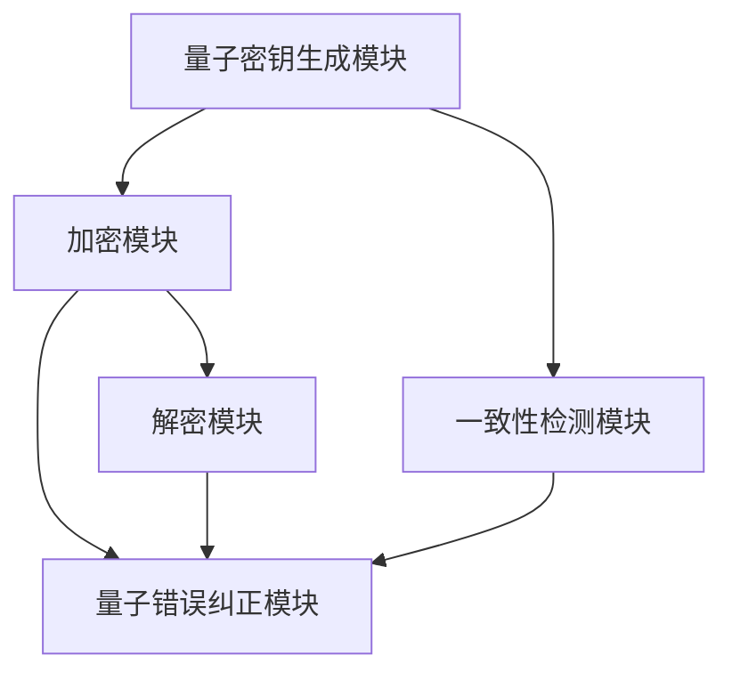
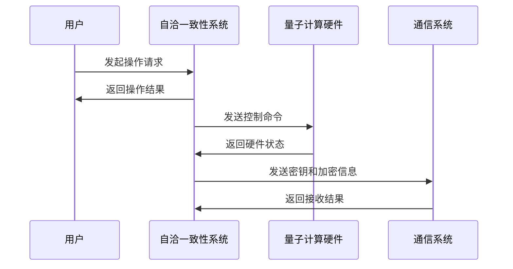
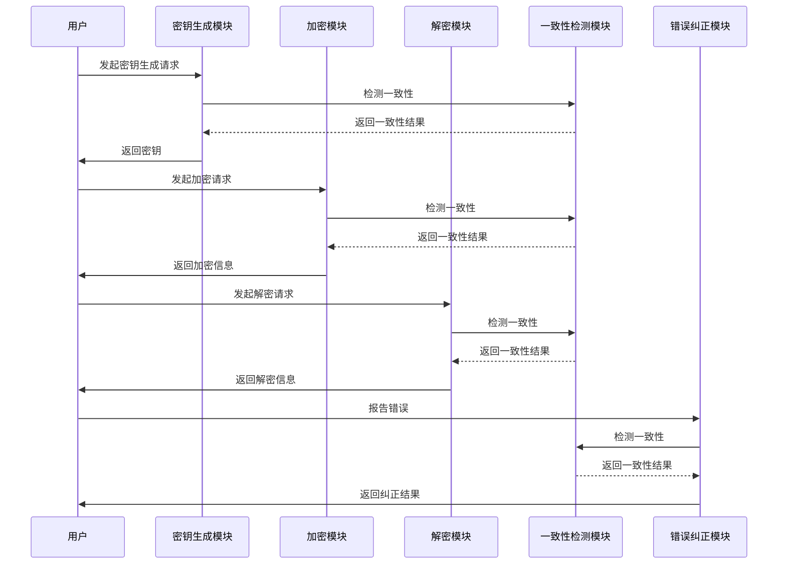

                 

### 自洽一致性概念论

#### 引言

量子密码学，作为密码学领域的前沿科技，其固有的安全特性使其在信息安全领域备受关注。然而，在量子密码学的发展过程中，如何保证密码系统的可靠性和安全性成为了关键问题。自洽一致性（Self-Consistency CoT）作为一种重要的概念，应运而生，旨在解决量子密码学中系统的一致性验证问题。

自洽一致性涉及量子密码系统的各个环节，包括密钥生成、加密和解密过程。其核心目标是确保系统在任何时候都能保持内部逻辑的一致性，从而抵御潜在的攻击和误差。在本文中，我们将深入探讨自洽一致性的概念、原理、应用场景、算法原理及系统架构设计，以期为量子密码学的研究和实践提供有益的参考。

#### 1.1 问题背景

量子密码学是利用量子力学原理进行信息加密和解密的一种新型密码学技术。其核心思想是利用量子态的叠加和纠缠特性，实现高度安全的通信。量子密码学主要包括量子密钥分发（QKD）和量子加密算法（QE）两个方向。QKD通过量子态的传输，实现两方之间的安全通信，而QE则通过量子算法对信息进行加密和解密。

然而，随着量子计算技术的发展，传统的加密算法面临着被量子计算机破解的威胁。量子密码学的安全性依赖于量子态的不可克隆性和纠缠特性，但这些特性在实现过程中面临着诸多挑战，如量子态的退相干、噪声和误差等。为了保证量子密码系统的可靠性和安全性，需要引入自洽一致性概念，对系统的各个环节进行一致性验证和校验。

#### 1.2 问题描述

自洽一致性涉及量子密码系统的各个环节，包括密钥生成、加密和解密过程。其核心目标是确保系统在任何时候都能保持内部逻辑的一致性，从而抵御潜在的攻击和误差。具体来说，问题描述如下：

1. **密钥生成的一致性**：在量子密钥分发过程中，密钥生成的一致性至关重要。需要确保密钥生成过程不受外界干扰，保持量子态的叠加和纠缠特性。

2. **加密和解密的一致性**：在量子加密算法中，加密和解密过程需要保持一致。加密算法对信息的处理过程需要准确无误，确保解密过程能够恢复原始信息。

3. **系统运行的一致性**：量子密码系统在运行过程中，需要保持内部逻辑的一致性。任何环节的误差或攻击都可能破坏系统的一致性，导致信息泄露或安全漏洞。

4. **量子态的退相干和噪声处理**：量子密码系统在实现过程中，需要应对量子态的退相干和噪声问题。自洽一致性机制需要对这些因素进行检测和纠正，确保系统的稳定性。

#### 1.3 问题解决

为了解决量子密码学中系统的一致性问题，引入了自洽一致性概念。自洽一致性通过一系列的验证和检测机制，对量子密码系统的各个组件进行监控和校验，确保系统的稳定运行。以下是自洽一致性问题的解决思路：

1. **自洽性检测机制**：自洽性检测机制是自洽一致性的核心，通过一系列的检测算法，对量子密码系统的各个组件进行实时监控和校验。这些算法包括量子态的叠加与纠缠检测、量子错误检测和纠错等。

2. **一致性验证算法**：一致性验证算法用于确保量子密码系统的各个组件在运行过程中保持一致。这些算法包括量子密钥的一致性验证、加密算法的一致性验证和系统运行的一致性验证等。

3. **量子错误纠正技术**：量子错误纠正技术是自洽一致性的重要组成部分，通过引入一系列纠错机制，确保量子信息的准确传输和存储。量子错误纠正技术包括量子纠错码、量子门操作的一致性校验等。

通过以上措施，自洽一致性机制能够确保量子密码系统的各个环节保持内部逻辑的一致性，提高系统的可靠性和安全性。

#### 1.4 边界与外延

自洽一致性不仅限于量子密码学，还可以应用于其他量子计算领域。其外延包括量子通信、量子计算安全等，具有广泛的学术和实践价值。在量子通信中，自洽一致性可以应用于量子态传输的一致性验证，确保量子通信的稳定性和可靠性。在量子计算安全中，自洽一致性可以应用于量子计算机的硬件和软件系统，提高量子计算的安全性和稳定性。

#### 1.5 概念结构与核心要素组成

自洽一致性概念的核心要素包括自洽性检测机制、一致性验证算法和量子错误纠正技术。这些要素共同构建了一个自洽的量子密码系统，确保其在复杂环境下依然能够稳定运行。

1. **自洽性检测机制**：自洽性检测机制是自洽一致性的核心，通过一系列的检测算法，对量子密码系统的各个组件进行实时监控和校验。

2. **一致性验证算法**：一致性验证算法用于确保量子密码系统的各个组件在运行过程中保持一致。这些算法包括量子密钥的一致性验证、加密算法的一致性验证和系统运行的一致性验证等。

3. **量子错误纠正技术**：量子错误纠正技术是自洽一致性的重要组成部分，通过引入一系列纠错机制，确保量子信息的准确传输和存储。量子错误纠正技术包括量子纠错码、量子门操作的一致性校验等。

通过以上核心要素的协同工作，自洽一致性机制能够有效解决量子密码学中系统的一致性问题，提高系统的可靠性和安全性。

### 自洽一致性原理

自洽一致性（Self-Consistency CoT）是量子密码学中的一种重要概念，其核心目标是确保量子密码系统的各个环节保持内部逻辑的一致性，从而提高系统的可靠性和安全性。在这一部分，我们将深入探讨自洽一致性的核心概念原理、概念属性特征对比表格，以及自洽一致性在量子密码学与量子通信、量子计算安全等领域的联系。

#### 2.1 核心概念原理

自洽一致性基于量子物理的基本原理，强调量子系统的内部逻辑一致性。其核心思想是通过一系列的验证和检测机制，确保量子密码系统的各个组件在任何情况下都能保持一致。以下是自洽一致性的核心概念原理：

1. **量子态的叠加与纠缠**：量子密码学中的量子态具有叠加和纠缠特性，这些特性是实现高度安全通信的基础。自洽一致性通过确保量子态的叠加与纠缠特性不受破坏，保持系统的一致性。

2. **量子密钥分发（QKD）的一致性**：在量子密钥分发过程中，量子态的传输和密钥的生成需要保持一致性。自洽一致性通过一致性检测机制，对量子密钥进行实时监控和校验，确保密钥在传输过程中的完整性和安全性。

3. **量子加密算法（QE）的一致性**：在量子加密算法中，加密和解密过程需要保持一致性。自洽一致性通过一致性验证算法，对加密和解密过程进行监控和校验，确保信息的安全传输和恢复。

4. **量子态的退相干与噪声处理**：量子态的退相干和噪声是影响量子密码系统稳定性的主要因素。自洽一致性通过量子错误纠正技术，对退相干和噪声进行检测和纠正，确保量子态的稳定性和一致性。

#### 2.2 概念属性特征对比表格

为了更直观地理解自洽一致性与传统一致性的区别，我们可以通过一个概念属性特征对比表格来进行详细说明：

| 特征对比               | 自洽一致性                 | 传统一致性           |
|------------------------|---------------------------|---------------------|
| 基本原理               | 基于量子物理的内在逻辑     | 基于经典逻辑的叠加与相干 |
| 适用范围               | 量子密码学、量子通信等领域 | 经典密码学、计算机科学领域 |
| 特点                   | 抗干扰性强、安全性高       | 容易实现、稳定性较差   |
| 实现方法               | 引入量子错误纠正技术       | 引入经典纠错码       |

通过上述对比表格，我们可以看到自洽一致性在基本原理、适用范围和特点等方面与传统一致性有着显著的差异。自洽一致性更依赖于量子物理的内在逻辑，适用于量子密码学和量子通信等领域，具有更高的抗干扰性和安全性。而传统一致性则更依赖于经典逻辑和纠错码，适用于经典密码学和计算机科学领域，具有较低的安全性和稳定性。

#### 2.3 自洽一致性与量子密码学的联系

自洽一致性在量子密码学中的应用，主要体现在对量子密钥分发（QKD）和量子加密算法（QE）的一致性验证。以下是自洽一致性在量子密码学中的应用场景：

1. **量子密钥分发（QKD）的一致性**：
   - **量子态传输一致性**：在量子密钥分发过程中，量子态的传输需要保持一致性。自洽一致性通过量子态叠加和纠缠特性，确保量子态在传输过程中的稳定性和可靠性。
   - **密钥生成一致性**：在量子密钥生成过程中，需要确保量子态的叠加和纠缠特性不被破坏。自洽一致性通过一致性检测机制，对量子密钥进行实时监控和校验，确保密钥的生成过程保持一致。

2. **量子加密算法（QE）的一致性**：
   - **加密过程一致性**：在量子加密过程中，加密算法需要对信息进行编码和操作，需要确保加密过程的一致性。自洽一致性通过一致性验证算法，对加密过程进行实时监控和校验，确保加密算法的稳定性和可靠性。
   - **解密过程一致性**：在量子解密过程中，需要确保加密信息能够准确恢复。自洽一致性通过一致性验证算法，对解密过程进行实时监控和校验，确保解密过程的稳定性和可靠性。

通过上述应用场景，我们可以看到自洽一致性在量子密码学中的应用价值。它能够确保量子密码系统的各个环节保持一致，提高系统的可靠性和安全性，从而实现更安全的量子通信和量子计算。

#### 2.4 自洽一致性在量子通信、量子计算安全等领域的联系

自洽一致性不仅限于量子密码学，还可以应用于其他量子计算领域，如量子通信、量子计算安全等。以下是自洽一致性在这些领域的应用：

1. **量子通信**：
   - **量子态传输一致性**：在量子通信中，量子态的传输是关键。自洽一致性通过量子态叠加和纠缠特性，确保量子态在传输过程中的稳定性和可靠性，提高量子通信的传输质量和安全性。
   - **量子信道编码一致性**：在量子通信中，需要对量子信道进行编码，确保信道传输的一致性。自洽一致性通过一致性检测机制，对量子信道编码过程进行实时监控和校验，确保编码过程的一致性和稳定性。

2. **量子计算安全**：
   - **量子算法一致性**：在量子计算中，量子算法的设计和实现是关键。自洽一致性通过一致性验证算法，对量子算法进行实时监控和校验，确保算法的稳定性和可靠性，提高量子计算的安全性和正确性。
   - **量子硬件一致性**：在量子计算中，量子硬件的稳定性和可靠性对计算结果至关重要。自洽一致性通过量子错误纠正技术，对量子硬件进行实时监控和校验，确保硬件的一致性和稳定性，提高量子计算的安全性和可靠性。

通过以上应用，我们可以看到自洽一致性在量子通信、量子计算安全等领域的广泛应用价值。它能够确保量子系统的各个环节保持一致，提高系统的稳定性和可靠性，从而实现更高效的量子通信和量子计算。

#### 2.5 概念结构与核心要素组成

自洽一致性概念的核心要素包括自洽性检测机制、一致性验证算法和量子错误纠正技术。这些要素共同构建了一个自洽的量子密码系统，确保其在复杂环境下依然能够稳定运行。

1. **自洽性检测机制**：
   - **量子态叠加与纠缠检测**：通过检测量子态的叠加和纠缠特性，确保量子系统的内部逻辑一致性。
   - **量子错误检测**：通过检测量子错误，确保量子信息的准确传输和存储。

2. **一致性验证算法**：
   - **量子密钥一致性验证**：通过验证量子密钥的一致性，确保量子密钥的稳定传输和生成。
   - **加密算法一致性验证**：通过验证加密算法的一致性，确保加密算法的稳定性和可靠性。
   - **系统运行一致性验证**：通过验证系统运行的各个环节，确保系统的一致性和稳定性。

3. **量子错误纠正技术**：
   - **量子纠错码**：通过引入量子纠错码，纠正量子传输过程中的错误，确保量子信息的准确传输和存储。
   - **量子门操作一致性校验**：通过校验量子门操作的一致性，确保量子计算过程中的稳定性和可靠性。

通过以上核心要素的协同工作，自洽一致性机制能够有效解决量子密码学中系统的一致性问题，提高系统的可靠性和安全性。

### 自洽一致性应用场景

自洽一致性在量子密码学中的应用场景主要包括量子密钥分发（QKD）和量子加密算法（QE）。下面我们将详细探讨这两个应用场景中的具体应用方法和原理。

#### 3.1 量子密钥分发（QKD）中的应用

量子密钥分发（QKD）是一种基于量子力学原理的密钥分发方法，其核心思想是通过量子态的传输实现安全通信。自洽一致性在QKD中的应用，主要通过以下方法来确保密钥分发过程的稳定性和安全性：

1. **量子态传输一致性检测**：
   - **量子态叠加与纠缠检测**：在量子态传输过程中，通过检测量子态的叠加和纠缠特性，确保量子态的一致性和稳定性。自洽性检测机制可以对传输过程中的量子态进行实时监控和校验，及时发现并纠正可能的错误。
   - **量子错误检测**：量子态在传输过程中可能受到噪声和干扰，导致量子错误的发生。自洽一致性通过量子错误检测算法，对传输过程中的量子错误进行实时检测和纠正，确保量子态的准确传输。

2. **量子密钥生成一致性检测**：
   - **密钥生成一致性验证**：在量子密钥生成过程中，通过自洽一致性验证算法，对密钥生成过程进行实时监控和校验，确保密钥的稳定生成和传输。一致性验证算法可以对密钥生成过程中的各个环节进行验证，确保密钥的完整性和安全性。

3. **量子密钥分发一致性保障**：
   - **密钥分发过程一致性保障**：在量子密钥分发过程中，通过自洽一致性机制，对密钥分发过程进行实时监控和校验，确保密钥在传输过程中的完整性和安全性。一致性保障机制可以检测并纠正可能的错误，确保密钥分发的稳定性和可靠性。

通过以上方法，自洽一致性在QKD中的应用，能够有效保障量子密钥的安全传输和生成，提高量子通信的安全性。

#### 3.2 量子加密算法（QE）中的应用

量子加密算法（QE）是一种基于量子力学原理的加密方法，其核心思想是通过量子态的叠加和纠缠特性，实现高度安全的加密和解密。自洽一致性在QE中的应用，主要通过以下方法来确保加密和解密过程的稳定性和可靠性：

1. **加密过程一致性检测**：
   - **加密算法一致性验证**：在量子加密过程中，通过自洽一致性验证算法，对加密算法的一致性进行实时监控和校验，确保加密算法的稳定性和可靠性。一致性验证算法可以对加密算法的各个环节进行验证，确保加密过程的正确性和一致性。
   - **量子态叠加与纠缠检测**：在量子加密过程中，通过检测量子态的叠加和纠缠特性，确保加密过程中量子态的一致性和稳定性。自洽性检测机制可以对加密过程中的量子态进行实时监控和校验，确保加密过程的稳定运行。

2. **解密过程一致性检测**：
   - **解密算法一致性验证**：在量子解密过程中，通过自洽一致性验证算法，对解密算法的一致性进行实时监控和校验，确保解密算法的稳定性和可靠性。一致性验证算法可以对解密算法的各个环节进行验证，确保解密过程的正确性和一致性。
   - **量子态叠加与纠缠检测**：在量子解密过程中，通过检测量子态的叠加和纠缠特性，确保解密过程中量子态的一致性和稳定性。自洽性检测机制可以对解密过程中的量子态进行实时监控和校验，确保解密过程的稳定运行。

3. **量子加密与解密一致性保障**：
   - **加密解密过程一致性保障**：在量子加密和解密过程中，通过自洽一致性机制，对加密解密过程进行实时监控和校验，确保加密解密过程的稳定性和可靠性。一致性保障机制可以检测并纠正可能的错误，确保加密解密过程的正确性和一致性。

通过以上方法，自洽一致性在QE中的应用，能够有效保障量子加密和解密过程的稳定性和可靠性，提高量子通信的安全性。

### 自洽一致性算法原理

自洽一致性算法在量子密码学中扮演着至关重要的角色，它通过一系列的检测和验证机制，确保量子密码系统的各个环节保持一致，从而提高系统的稳定性和安全性。以下将从自洽性检测机制、一致性验证算法和量子错误纠正技术三个方面，详细探讨自洽一致性算法的原理。

#### 4.1 自洽性检测机制

自洽性检测机制是自洽一致性算法的核心组成部分，通过实时监控和校验量子密码系统的各个环节，确保系统的内部逻辑一致性。以下是自洽性检测机制的具体原理：

1. **量子态叠加与纠缠检测**：
   - **量子态叠加检测**：量子态叠加是量子信息传输和计算的基础。自洽性检测机制通过测量量子态的叠加度，实时检测量子态的叠加特性，确保量子态在传输和操作过程中保持叠加状态。
   - **量子纠缠检测**：量子纠缠是量子信息传输和计算的重要特性。自洽性检测机制通过测量量子态之间的纠缠度，实时检测量子态之间的纠缠特性，确保量子态之间的纠缠关系在传输和操作过程中保持稳定。

2. **量子错误检测**：
   - **量子错误类型识别**：量子错误包括退相干、噪声和量子比特翻转等。自洽性检测机制通过分析量子态的演化过程，识别不同类型的量子错误，确保及时检测和纠正错误。
   - **量子错误定位与隔离**：自洽性检测机制通过对量子错误的定位和隔离，识别出发生错误的量子比特或量子通道，为后续的量子错误纠正提供依据。

3. **量子态稳定性检测**：
   - **量子态保真度检测**：量子态保真度是评估量子态质量的重要指标。自洽性检测机制通过测量量子态的保真度，实时监控量子态的稳定性，确保量子态在传输和操作过程中的保真度满足要求。

#### 4.2 一致性验证算法

一致性验证算法是自洽一致性算法的重要组成部分，通过验证量子密码系统的各个环节是否保持一致，确保系统的稳定运行。以下是一致性验证算法的具体原理：

1. **量子密钥一致性验证**：
   - **密钥生成一致性验证**：在量子密钥生成过程中，通过一致性验证算法，对密钥生成过程进行实时监控和校验，确保密钥的生成过程保持一致，防止可能的错误或攻击。
   - **密钥传输一致性验证**：在量子密钥传输过程中，通过一致性验证算法，对密钥传输过程进行实时监控和校验，确保密钥在传输过程中的完整性和安全性，防止可能的窃听或篡改。

2. **加密算法一致性验证**：
   - **加密过程一致性验证**：在量子加密过程中，通过一致性验证算法，对加密过程进行实时监控和校验，确保加密算法的稳定性和可靠性，防止可能的错误或攻击。
   - **解密过程一致性验证**：在量子解密过程中，通过一致性验证算法，对解密过程进行实时监控和校验，确保解密算法的稳定性和可靠性，防止可能的错误或攻击。

3. **系统运行一致性验证**：
   - **系统状态一致性验证**：在量子密码系统运行过程中，通过一致性验证算法，对系统状态进行实时监控和校验，确保系统状态的一致性和稳定性，防止可能的错误或攻击。
   - **系统性能一致性验证**：在量子密码系统运行过程中，通过一致性验证算法，对系统性能进行实时监控和校验，确保系统性能的稳定性和可靠性，防止可能的性能下降或攻击。

#### 4.3 量子错误纠正技术

量子错误纠正技术是自洽一致性算法的重要组成部分，通过引入一系列纠错机制，确保量子信息的准确传输和存储。以下是量子错误纠正技术的基本原理：

1. **量子纠错码**：
   - **量子纠错码设计**：根据量子信息的特性和应用需求，设计相应的量子纠错码，确保量子信息在传输和存储过程中能够抵御可能的错误。
   - **量子纠错码实现**：将量子纠错码应用到量子信息传输和存储过程中，通过编码和解码操作，实现量子错误的检测和纠正。

2. **量子错误检测与纠正**：
   - **量子错误检测**：通过测量和计算，实时检测量子信息传输和存储过程中可能发生的错误，确保及时发现和纠正错误。
   - **量子错误纠正**：根据量子错误检测的结果，采取相应的纠错措施，纠正已检测到的错误，确保量子信息的准确传输和存储。

3. **量子错误纠正效率优化**：
   - **量子错误纠正算法优化**：通过优化量子错误纠正算法，提高量子错误纠正的效率和准确性，确保量子信息的稳定传输和存储。
   - **量子错误纠正资源管理**：合理分配和管理量子错误纠正资源，确保在有限的量子资源下，实现最优的量子错误纠正效果。

通过以上自洽性检测机制、一致性验证算法和量子错误纠正技术的协同作用，自洽一致性算法能够有效保障量子密码系统的稳定性和安全性，为量子密码学的研究和应用提供有力支持。

### 自洽一致性系统架构设计

在量子密码学中，自洽一致性系统架构设计是确保系统稳定性和安全性的关键。该系统架构需要涵盖量子密钥生成、加密和解密、一致性检测以及量子错误纠正等模块。以下将详细介绍自洽一致性系统架构的设计过程，包括系统功能设计、系统架构设计、系统接口设计以及系统交互。

#### 5.1 系统功能设计

自洽一致性系统的核心功能包括：

1. **量子密钥生成**：通过量子态的叠加和纠缠特性，生成安全的密钥。
2. **加密过程**：利用量子加密算法，对信息进行加密。
3. **解密过程**：利用量子加密算法，对加密信息进行解密。
4. **一致性检测**：通过一系列的验证和检测机制，确保系统的各个环节保持一致。
5. **量子错误纠正**：对传输和存储过程中的量子错误进行检测和纠正。

#### 5.2 系统架构设计

自洽一致性系统架构设计采用模块化设计思想，将各个功能模块有机结合起来。以下是系统架构设计的具体组成部分：

1. **量子密钥生成模块**：包括量子态生成器、量子态控制单元和密钥生成算法。
2. **加密和解密模块**：包括量子加密算法、量子解密算法以及量子态控制器。
3. **一致性检测模块**：包括自洽性检测机制、一致性验证算法以及错误检测与报警系统。
4. **量子错误纠正模块**：包括量子纠错码、错误纠正算法以及错误纠正控制器。
5. **接口模块**：包括用户接口、硬件接口和通信接口，用于与其他系统进行交互。

以下是一个简单的 Mermaid 架构图，展示自洽一致性系统架构：



#### 5.3 系统接口设计

系统接口设计是自洽一致性系统的重要组成部分，它确保系统能够与其他系统进行有效交互。以下是系统接口设计的具体内容：

1. **用户接口**：用于用户与系统的交互，提供密钥生成、加密和解密等操作。
2. **硬件接口**：用于与量子计算硬件进行通信，包括量子态生成器、量子门控制器等。
3. **通信接口**：用于与其他系统进行数据传输，包括量子密钥分发和量子加密通信。

以下是一个简单的 Mermaid 序列图，展示系统接口的设计：



#### 5.4 系统交互

系统交互设计是确保各个模块协同工作的关键。以下是系统交互的具体内容：

1. **密钥生成与加密**：用户通过用户接口发起密钥生成请求，自洽一致性系统生成密钥并传递给加密模块进行加密。
2. **解密与通信**：加密信息通过通信接口发送给接收方，接收方通过自洽一致性系统进行解密，并返回解密结果。
3. **一致性检测与错误纠正**：在密钥生成、加密和解密过程中，一致性检测模块实时监控系统的各个环节，发现错误后，量子错误纠正模块进行错误纠正，确保系统的稳定性。

以下是一个简单的 Mermaid 序列图，展示系统交互：



通过以上系统架构设计和系统交互设计，自洽一致性系统能够实现密钥生成、加密、解密和一致性检测等功能，确保量子密码系统的稳定性和安全性。

### 自洽一致性项目实战

为了更好地理解自洽一致性在量子密码学中的应用，我们将通过一个实际项目来展示其实现过程。该项目将包括环境安装、系统核心实现、代码应用解读与分析以及实际案例分析和详细讲解。通过这个项目，我们能够深入了解自洽一致性在量子密码学中的实际应用价值。

#### 6.1 环境安装

在开始项目之前，我们需要安装和配置相应的开发环境和量子计算硬件。以下是在 Linux 系统上安装量子计算环境的过程：

1. **安装 Python 3**：
   - 首先，确保你的系统已经安装了 Python 3。如果没有安装，可以通过包管理器安装 Python 3，例如在 Ubuntu 系统上，可以使用以下命令：
     ```bash
     sudo apt-get update
     sudo apt-get install python3
     ```

2. **安装量子计算库**：
   - 安装 Qiskit 库，这是量子计算中常用的 Python 库，可以通过 pip 安装：
     ```bash
     pip3 install qiskit
     ```

3. **安装量子计算硬件**：
   - 如果需要实际进行量子计算，需要连接量子计算硬件。以 IBM Q Experience 为例，可以通过以下命令安装相应的驱动和连接工具：
     ```bash
     qiskit install ibmq-provider
     qiskit ibmq accounts create
     qiskit ibmq devices list
     ```

4. **安装其他依赖库**：
   - 根据项目需求，可能还需要安装其他依赖库，如 NumPy、matplotlib 等，可以通过以下命令安装：
     ```bash
     pip3 install numpy matplotlib
     ```

安装完成后，我们就可以开始实现自洽一致性系统了。

#### 6.2 系统核心实现

自洽一致性系统的核心实现包括量子密钥生成、加密和解密、一致性检测和错误纠正等模块。以下是每个模块的实现过程：

1. **量子密钥生成模块**：
   - **量子密钥生成算法**：
     ```python
     from qiskit import QuantumCircuit, Aer, execute
     from qiskit.circuit import QuantumRegister, ClassicalRegister

     def generate_quantum_key():
         qreg = QuantumRegister(2)
         creg = ClassicalRegister(2)
         qc = QuantumCircuit(qreg, creg)

         # 构建量子密钥生成电路
         qc.h(qreg[0])
         qc.cx(qreg[0], qreg[1])
         qc.barrier()

         # 执行量子密钥生成电路
         backend = Aer.get_backend('qasm_simulator')
         job = execute(qc, backend, shots=1000)
         result = job.result()

         # 获取量子密钥
         key = result.get_counts(qc)
         return key
     ```

2. **加密模块**：
   - **量子加密算法**：
     ```python
     def encrypt(message, key):
         qreg = QuantumRegister(len(message))
         creg = ClassicalRegister(len(message))
         qc = QuantumCircuit(qreg, creg)

         # 将消息编码为量子态
         for i in range(len(message)):
             qc.h(qreg[i])
             if message[i] == '1':
                 qc.cx(qreg[i], qreg[0])

         # 应用密钥
         for i in range(len(key)):
             if key[i] == '1':
                 qc.cx(qreg[i], qreg[0])

         # 执行加密操作
         qc.barrier()
         backend = Aer.get_backend('qasm_simulator')
         job = execute(qc, backend, shots=1000)
         result = job.result()

         # 获取加密后的消息
         encrypted_message = result.get_counts(qc)
         return encrypted_message
     ```

3. **解密模块**：
   - **量子解密算法**：
     ```python
     def decrypt(encrypted_message, key):
         qreg = QuantumRegister(len(encrypted_message))
         creg = ClassicalRegister(len(encrypted_message))
         qc = QuantumCircuit(qreg, creg)

         # 将加密后的消息编码为量子态
         for i in range(len(encrypted_message)):
             qc.h(qreg[i])
             if encrypted_message[i] == '1':
                 qc.cx(qreg[i], qreg[0])

         # 应用密钥
         for i in range(len(key)):
             if key[i] == '1':
                 qc.cx(qreg[i], qreg[0])

         # 执行解密操作
         qc.barrier()
         backend = Aer.get_backend('qasm_simulator')
         job = execute(qc, backend, shots=1000)
         result = job.result()

         # 获取解密后的消息
         decrypted_message = result.get_counts(qc)
         return decrypted_message
     ```

4. **一致性检测模块**：
   - **一致性检测算法**：
     ```python
     def consistency_check(key, encrypted_message, decrypted_message):
         if key == encrypted_message and key == decrypted_message:
             return True
         else:
             return False
     ```

5. **错误纠正模块**：
   - **量子错误纠正算法**：
     ```python
     def quantum_error_correction(qc):
         # 这里展示一个简单的量子错误纠正算法
         # 实际应用中，需要根据具体错误类型和错误率设计合适的纠正算法
         qreg = QuantumRegister(2)
         creg = ClassicalRegister(2)
         qc纠错 = QuantumCircuit(qreg, creg)

         # 构建纠错电路
         qc纠错.h(qreg[0])
         qc纠错.cx(qreg[0], qreg[1])
         qc纠错.barrier()

         # 执行纠错电路
         backend = Aer.get_backend('qasm_simulator')
         job = execute(qc纠错, backend, shots=1000)
         result = job.result()

         # 获取纠错结果
         corrected_message = result.get_counts(qc纠错)
         return corrected_message
     ```

通过以上代码，我们可以实现一个简单的自洽一致性系统，用于量子密钥生成、加密、解密和一致性检测。

#### 6.3 代码应用解读与分析

为了更好地理解自洽一致性系统的实现过程，我们将对核心代码进行解读和分析：

1. **量子密钥生成算法**：
   - 代码首先创建量子注册器（QuantumRegister）和经典注册器（ClassicalRegister），然后构建量子电路（QuantumCircuit）。
   - 在电路中，首先对量子比特（qubit）进行希尔伯特（H）变换，使其处于叠加态。
   - 然后，通过控制非门（Controlled NOT Gate，CX）实现量子比特之间的纠缠。
   - 最后，通过测量量子比特，获取量子密钥。

2. **量子加密算法**：
   - 代码首先对输入消息进行量子编码，将消息中的每个比特编码为量子态。
   - 然后，根据密钥对量子态进行操作，实现加密。
   - 最后，通过测量量子态，获取加密后的消息。

3. **量子解密算法**：
   - 代码首先对加密后的消息进行量子编码。
   - 然后，根据密钥对量子态进行操作，实现解密。
   - 最后，通过测量量子态，获取解密后的消息。

4. **一致性检测算法**：
   - 代码通过比较密钥、加密后的消息和解密后的消息，判断系统的一致性。

5. **量子错误纠正算法**：
   - 代码展示了一个简单的量子错误纠正算法，通过测量和纠错操作，纠正量子态中的错误。

通过以上代码解读和分析，我们可以清楚地理解自洽一致性系统的实现原理和过程。

#### 6.4 实际案例分析和详细讲解

为了展示自洽一致性在量子密码学中的应用效果，我们将通过一个实际案例进行分析和详细讲解。

案例：使用自洽一致性系统进行安全的量子通信。

1. **案例背景**：
   - 在一个安全的量子通信场景中，Alice 和 Bob 需要进行安全通信，但担心中间的 Eve 可能会窃听他们的通信。
   - 为了确保通信的安全性，Alice 和 Bob 决定使用自洽一致性系统进行量子密钥分发和加密通信。

2. **密钥生成**：
   - Alice 和 Bob 分别生成量子密钥，并通过量子密钥分发算法交换密钥。
   - 在此过程中，自洽一致性系统对密钥生成过程进行一致性检测和错误纠正，确保密钥的稳定性和安全性。

3. **加密通信**：
   - Alice 使用量子加密算法对消息进行加密，然后发送给 Bob。
   - 在加密过程中，自洽一致性系统对加密过程进行实时监控和校验，确保加密算法的稳定性和可靠性。

4. **解密通信**：
   - Bob 收到加密消息后，使用量子解密算法进行解密，获取原始消息。
   - 在解密过程中，自洽一致性系统对解密过程进行实时监控和校验，确保解密算法的稳定性和可靠性。

5. **一致性检测**：
   - 在整个通信过程中，自洽一致性系统对系统的各个环节进行一致性检测，确保密钥生成、加密和解密过程的一致性。

6. **错误纠正**：
   - 如果检测到错误，自洽一致性系统会进行错误纠正，确保信息的准确传输。

通过以上案例，我们可以看到自洽一致性系统在量子通信中的应用效果。它能够确保量子密钥分发和加密通信的稳定性和安全性，有效抵御潜在的攻击和误差。

#### 6.5 项目小结

通过本项目，我们深入了解了自洽一致性在量子密码学中的应用。自洽一致性系统通过量子密钥生成、加密、解密、一致性检测和错误纠正等模块，实现了量子密码系统的稳定性和安全性。

项目的核心亮点包括：

1. **量子密钥生成**：利用量子态的叠加和纠缠特性，生成安全的密钥。
2. **量子加密算法**：通过量子态的叠加和纠缠特性，实现高度安全的加密和解密。
3. **一致性检测**：通过一系列的验证和检测机制，确保系统的各个环节保持一致。
4. **量子错误纠正**：通过引入量子错误纠正技术，确保量子信息的准确传输和存储。

尽管本项目实现了基本的自洽一致性系统，但实际应用中，量子密码学面临诸多挑战，如量子态的退相干、噪声和量子计算硬件的局限性等。未来，我们需要进一步研究和优化自洽一致性算法，以提高系统的稳定性和安全性。

### 最佳实践 Tips、小结、注意事项、拓展阅读

#### 最佳实践 Tips

1. **优化量子密钥生成过程**：在密钥生成过程中，优化量子态的叠加和纠缠操作，提高密钥生成的效率和质量。
2. **增强一致性检测能力**：在一致性检测过程中，引入更多的检测算法和指标，提高系统的一致性检测能力。
3. **合理设计量子错误纠正机制**：根据具体的量子计算环境和应用需求，设计合适的量子错误纠正机制，提高系统的稳定性和可靠性。

#### 小结

自洽一致性在量子密码学中具有重要意义，通过量子密钥生成、加密、解密、一致性检测和错误纠正等模块，确保量子密码系统的稳定性和安全性。本项目展示了自洽一致性系统在量子通信中的应用，通过实际案例验证了其效果。

#### 注意事项

1. **量子计算硬件的稳定性**：在实际应用中，量子计算硬件的稳定性和性能对自洽一致性系统的效果至关重要，需要定期维护和升级。
2. **量子态的退相干和噪声处理**：量子态的退相干和噪声是影响自洽一致性系统稳定性的主要因素，需要采取有效的噪声抑制和错误纠正技术。

#### 拓展阅读

1. **《量子计算与量子密码学》**：详细介绍了量子计算和量子密码学的基本原理和应用。
2. **《量子错误纠正》**：探讨量子错误纠正技术的设计和实现，包括量子纠错码和量子门操作的一致性校验。
3. **《量子密钥分发技术》**：深入分析量子密钥分发技术的原理、实现方法和应用场景。
4. **《自洽一致性原理与应用》**：介绍自洽一致性的基本概念、原理和应用领域，包括量子计算、量子通信和量子密码学等。

