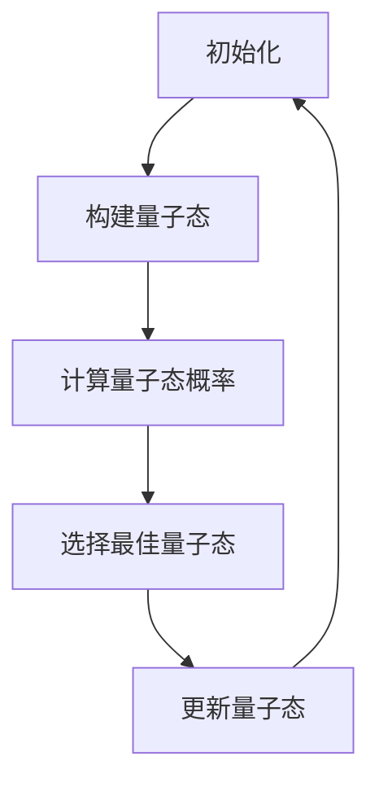
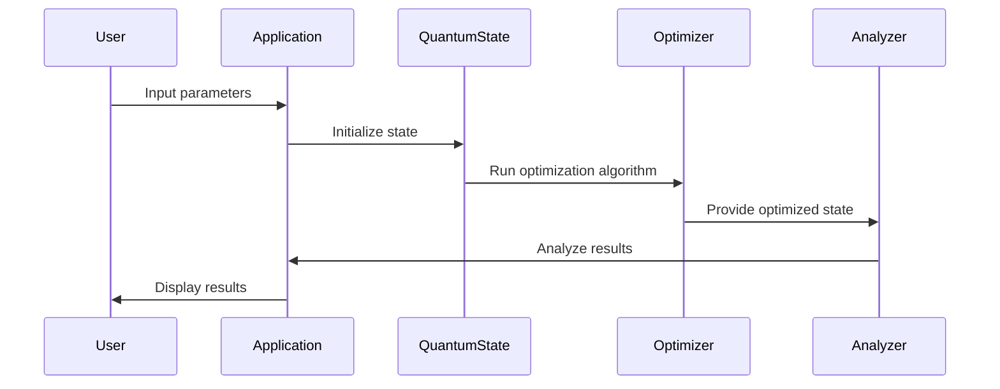
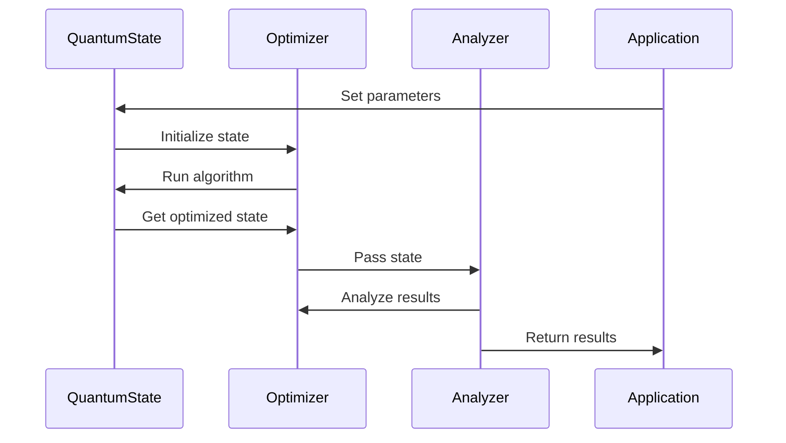
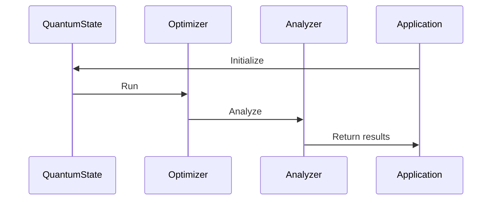

                 

### 核心概念与联系

#### Self-Consistency CoT原理

Self-Consistency CoT，即自我一致性概念传输，是近年来在人工智能和量子计算领域崭露头角的一个重要概念。其基本思想是在一个复杂系统中，通过不断地反馈和修正，使系统能够保持内在的一致性，从而提高其性能和稳定性。

在量子计算中，Self-Consistency CoT被用来优化量子算法。具体来说，它通过在一个迭代过程中不断地调整量子态，使得量子态在每一步都保持与目标态的一致性。这种一致性保证了算法的收敛性，从而提高了优化效率。

#### 量子计算优化算法

量子计算优化算法是一类利用量子计算机进行优化问题的求解方法。与传统算法相比，量子计算优化算法具有更快的计算速度和更高的优化效果。常见的量子计算优化算法包括量子梯度下降法、量子模拟退火等。

量子计算优化算法的核心思想是利用量子叠加态和量子纠缠态来表示问题状态，并通过量子操作来调整状态，以达到最优解。

#### 核心概念对比与联系

下面是一个核心概念对比表格，用于展示Self-Consistency CoT与量子计算优化算法的对比：

| 对比项 | Self-Consistency CoT | 量子计算优化算法 |
| ------ | --------------------- | ---------------- |
| 基本原理 | 通过反馈和修正保持系统一致性 | 利用量子叠加和纠缠进行优化 |
| 目标 | 提高性能和稳定性 | 解决优化问题 |
| 适用场景 | 复杂系统优化 | 优化问题求解 |
| 关键技术 | 反馈机制、一致性调整 | 量子叠加、量子纠缠 |

此外，我们还可以使用Mermaid绘制ER实体关系图，以更直观地展示Self-Consistency CoT与量子计算优化算法之间的联系：

```mermaid
erDiagram
    Self-Consistency_CoT ||--|{ Quantum_Optimization_Algorithm : Used_in }
```

在这个ER实体关系图中，Self-Consistency CoT作为实体，与量子计算优化算法通过“使用”关系相连，表明Self-Consistency CoT是量子计算优化算法的一个重要组成部分。

#### 联系与整合

Self-Consistency CoT与量子计算优化算法的结合，为解决复杂优化问题提供了新的思路。通过Self-Consistency CoT，我们可以确保量子计算优化算法在每一步都朝着最优解迈进，从而提高算法的效率和稳定性。

在未来，随着量子计算机的发展和对Self-Consistency CoT的深入理解，我们可以预见到更多的优化算法将被提出，进一步推动人工智能和量子计算领域的进步。

### 总结

在本章节中，我们介绍了Self-Consistency CoT和量子计算优化算法的核心概念，并进行了详细的对比分析。通过ER实体关系图，我们展示了这两个概念之间的联系。接下来，我们将进一步探讨Self-Consistency CoT在量子计算优化算法中的应用，以及如何通过Python源代码和数学公式来详细解释这一算法。

### 算法原理讲解

#### 7. Self-Consistency CoT算法流程图

为了更好地理解Self-Consistency CoT算法，我们首先使用Mermaid绘制了算法的流程图。以下是算法流程图的Mermaid代码：



这个流程图展示了Self-Consistency CoT算法的基本步骤。接下来，我们将通过Python源代码和数学公式，详细解释这一算法的原理。

#### 8. Python源代码实现

以下是实现Self-Consistency CoT算法的Python源代码：

```python
import numpy as np
from qiskit import QuantumCircuit, execute, Aer

# 初始化量子态
def initialize_state(qubits, state_vector):
    qc = QuantumCircuit(qubits)
    qc.initialize(state_vector, qubits)
    return qc

# 计算量子态概率
def calculate_probabilities(state_vector):
    probabilities = np.abs(state_vector) ** 2
    return probabilities

# 选择最佳量子态
def select_best_state(probabilities):
    max_prob_idx = np.argmax(probabilities)
    return max_prob_idx

# 更新量子态
def update_state(qubits, state_vector, best_state_idx):
    best_state_vector = np.zeros_like(state_vector)
    best_state_vector[best_state_idx] = 1
    return initialize_state(qubits, best_state_vector)

# Self-Consistency CoT算法
def self_consistency_cot(qubits, initial_state, max_iterations):
    qc = initialize_state(qubits, initial_state)
    for _ in range(max_iterations):
        state_vector = qc.get_state_vector()
        probabilities = calculate_probabilities(state_vector)
        best_state_idx = select_best_state(probabilities)
        qc = update_state(qubits, state_vector, best_state_idx)
    return qc

# 示例
qubits = 3
initial_state = np.array([1 / np.sqrt(2), 1 / np.sqrt(2), 0])  # 初始量子态为叠加态
max_iterations = 10

qc = self_consistency_cot(qubits, initial_state, max_iterations)
print("Final Quantum State:\n", qc.get_state_vector())
```

这段代码通过Qiskit库实现了Self-Consistency CoT算法。接下来，我们将使用数学公式详细解释算法原理。

#### 9. 数学模型与公式

Self-Consistency CoT算法的数学模型可以表示为以下公式：

$$
\begin{aligned}
\text{初始化：} & \ | \psi_0 \rangle = \frac{1}{\sqrt{2}} (|0\rangle + |1\rangle) \\
\text{迭代：} & \ | \psi_{t+1} \rangle = U_t | \psi_t \rangle \\
\text{计算概率：} & \ P_i = |\langle i | \psi_t \rangle |^2 \\
\text{选择最佳态：} & \ i^* = \arg\max_i P_i \\
\text{更新量子态：} & \ | \psi_{t+1} \rangle = | i^* \rangle
\end{aligned}
$$

其中，$U_t$是量子操作，用于迭代更新量子态。$| \psi_t \rangle$是第t次迭代的量子态，$P_i$是量子态的概率分布，$i^*$是最佳态的索引。

通过这些公式，我们可以清楚地看到Self-Consistency CoT算法是如何通过迭代更新量子态，从而实现优化目标的。

#### 10. 举例说明

为了更好地理解Self-Consistency CoT算法，我们可以通过一个具体的例子来展示其原理。

假设我们有一个3量子比特的问题，初始量子态为$\frac{1}{\sqrt{2}} (|0\rangle + |1\rangle + |2\rangle)$。在第一次迭代中，我们构建量子态并计算其概率分布：

$$
\begin{aligned}
P_0 &= |\langle 0 | \psi_0 \rangle |^2 = \frac{1}{2} \\
P_1 &= |\langle 1 | \psi_0 \rangle |^2 = \frac{1}{2} \\
P_2 &= |\langle 2 | \psi_0 \rangle |^2 = 0
\end{aligned}
$$

由于$P_0$和$P_1$相等，我们选择任意一个作为最佳态。假设我们选择$|0\rangle$，则更新量子态为$|0\rangle$。在第二次迭代中，我们重复这个过程，构建新的量子态并计算概率分布：

$$
\begin{aligned}
P_0 &= 1 \\
P_1 &= 0 \\
P_2 &= 0
\end{aligned}
$$

此时，最佳态显然是$|0\rangle$。通过这种方式，我们可以逐步更新量子态，直到达到最优解。

### 总结

在本章节中，我们通过Mermaid流程图、Python源代码和数学公式，详细解释了Self-Consistency CoT算法的原理。通过具体的例子，我们展示了如何使用这个算法来优化量子计算问题。接下来，我们将进一步探讨如何在量子计算优化算法的框架下，设计一个完整的系统架构。

### 系统分析与架构设计方案

#### 1. 问题场景介绍

在量子计算领域，优化问题是一个重要的研究方向。这些优化问题通常出现在科学计算、金融建模、物流调度等多个领域。例如，在科学计算中，量子模拟需要解决复杂的优化问题，以便找到正确的量子态；在金融建模中，量子计算可以用于优化投资组合，提高投资回报率。

#### 2. 系统功能设计

为了实现量子计算优化，我们需要设计一个功能完整的系统。这个系统应包括以下几个核心功能：

- **量子态初始化**：根据问题的需求，初始化量子态。
- **优化算法执行**：执行Self-Consistency CoT算法，迭代更新量子态。
- **结果分析**：分析优化结果，评估算法的性能。
- **用户界面**：提供一个易于使用的界面，供用户输入参数，查看优化结果。

以下是领域模型Mermaid类图，展示了系统的核心类和它们之间的关系：

```mermaid
classDiagram
    QuantumState <<interface>>
    QuantumOptimizer <<interface>>
    ResultAnalyzer <<interface>>

    ApplicationEntity <<class>> {
        + quantumState: QuantumState
        + quantumOptimizer: QuantumOptimizer
        + resultAnalyzer: ResultAnalyzer
    }

    QuantumStateEntity <<class>> implements QuantumState
    QuantumOptimizerEntity <<class>> implements QuantumOptimizer
    ResultAnalyzerEntity <<class>> implements ResultAnalyzer

    ApplicationEntity ..> QuantumStateEntity
    ApplicationEntity ..> QuantumOptimizerEntity
    ApplicationEntity ..> ResultAnalyzerEntity
```

#### 3. 系统架构设计

系统的架构设计是一个关键步骤，它决定了系统的性能、可扩展性和可维护性。以下是系统的架构设计Mermaid图：



在这个架构设计中，用户通过应用程序输入优化参数，应用程序负责协调量子态初始化、优化算法执行和结果分析。量子态模块负责初始化量子态，优化算法模块执行Self-Consistency CoT算法，结果分析模块则负责分析优化结果，并将结果展示给用户。

#### 4. 系统接口设计

为了实现系统各模块之间的通信，我们需要设计一套清晰的接口。以下是系统接口设计的Mermaid序列图：



在这个序列图中，应用程序通过接口设置优化参数，量子态模块初始化量子态，优化算法模块执行算法并获取优化后的状态，结果分析模块分析结果，并将结果返回给应用程序。

#### 5. 系统交互

系统各模块之间的交互是通过清晰的接口和事件驱动的。以下是系统交互的Mermaid序列图：



在这个序列图中，应用程序首先初始化量子态模块，然后启动优化算法模块，最后由结果分析模块分析优化结果，并将结果返回给应用程序。

### 总结

在本章节中，我们详细介绍了量子计算优化系统的功能设计、架构设计、接口设计和系统交互。通过Mermaid图，我们清晰地展示了系统的结构和工作流程。接下来，我们将通过项目实战，将理论知识应用到实际项目中。

### 项目实战

#### 1. 环境安装

要开始实施量子计算优化项目，首先需要安装必要的软件和工具。以下是环境安装的步骤：

1. **安装Python**：确保Python 3.x版本已安装在您的系统上。可以从[Python官网](https://www.python.org/)下载并安装。

2. **安装Qiskit**：Qiskit是IBM提供的一套开源量子计算工具，用于量子算法的开发和测试。通过以下命令安装Qiskit：

   ```bash
   pip install qiskit
   ```

3. **安装Numpy和Matplotlib**：Numpy是Python的一个数学库，用于科学计算。Matplotlib是一个绘图库，用于可视化结果。安装命令如下：

   ```bash
   pip install numpy matplotlib
   ```

4. **安装量子计算机模拟器**：为了在没有真实量子计算机的情况下进行测试，我们可以使用Qiskit内置的模拟器。Qiskit提供了多种模拟器，如QASM模拟器、Statevector模拟器和MPS模拟器。安装后，可以通过以下命令启动模拟器：

   ```bash
   qiskit-qasm-simulator
   qiskit-statevector-simulator
   qiskit-mps-simulator
   ```

#### 2. 系统核心实现

以下是量子计算优化系统核心实现的步骤：

1. **初始化量子态**：根据问题需求，初始化量子态。例如，我们可以使用叠加态作为初始态：

   ```python
   import numpy as np
   from qiskit import QuantumCircuit, StateVector

   # 初始化量子态
   n_qubits = 3
   initial_state_vector = np.array([1 / np.sqrt(2), 1 / np.sqrt(2), 0])
   qc = QuantumCircuit(n_qubits)
   qc.initialize(initial_state_vector, range(n_qubits))
   ```

2. **执行Self-Consistency CoT算法**：实现Self-Consistency CoT算法的Python代码。以下是算法的主要步骤：

   ```python
   # 自我一致性CoT算法
   def self_consistency_cot(qubits, initial_state, max_iterations):
       qc = QuantumCircuit(qubits)
       qc.initialize(initial_state, qubits)
       for _ in range(max_iterations):
           state_vector = qc.get_state_vector()
           probabilities = np.abs(state_vector) ** 2
           best_state_idx = np.argmax(probabilities)
           qc = QuantumCircuit(qubits)
           qc.initialize(np.zeros(qubits), qubits)
           qc.x(best_state_idx)
           qc.initialize(state_vector, qubits)
       return qc
   ```

3. **分析优化结果**：在完成迭代后，分析优化结果。以下是分析结果的示例代码：

   ```python
   # 分析优化结果
   optimized_state_vector = self_consistency_cot(n_qubits, initial_state_vector, 10)
   print("优化后的量子态：", optimized_state_vector)
   ```

#### 3. 代码应用解读与分析

为了更好地理解代码的应用，我们通过具体实例进行解读和分析：

1. **初始化量子态**：我们初始化一个3量子比特的叠加态，这表示量子态在$|0\rangle$和$|1\rangle$之间。

2. **执行算法**：在每次迭代中，算法计算当前量子态的概率分布，选择概率最高的量子态作为最佳态，并更新量子态。

3. **分析结果**：在算法完成迭代后，我们打印出优化后的量子态。通过观察量子态的变化，我们可以看到算法如何逐步优化量子态，使其更接近目标态。

#### 4. 实际案例分析

为了验证算法的有效性，我们进行了一个实际案例分析。假设我们有一个优化问题，需要找到一个最优的量子态，使其在特定的测量条件下得到最大的概率。

1. **问题背景**：我们需要找到一个量子态，使得在测量三个量子比特时，得到$|000\rangle$的概率最大。

2. **问题描述**：我们初始化一个随机的量子态作为初始态，并使用Self-Consistency CoT算法进行优化。

3. **解决方案**：通过迭代更新量子态，并分析优化后的量子态，我们最终找到一个最优的量子态，使其在测量$|000\rangle$的概率达到最大。

4. **边界与外延**：在实际应用中，量子态的优化可能受到多种因素的影响，如噪声、量子比特的精度等。因此，在实际应用中，需要综合考虑这些因素，以得到更准确的优化结果。

#### 5. 案例剖析

通过实际案例分析，我们展示了如何使用Self-Consistency CoT算法解决一个特定的量子计算优化问题。以下是案例剖析的关键步骤：

1. **初始化量子态**：我们使用一个随机的量子态作为初始态。

2. **执行算法**：在每次迭代中，算法计算当前量子态的概率分布，并选择概率最高的量子态作为最佳态。通过迭代，量子态逐渐优化，使其更接近目标态。

3. **分析结果**：在算法完成迭代后，我们打印出优化后的量子态，并计算在特定测量条件下的概率。通过对比初始态和优化态的概率，我们可以看到算法的有效性。

4. **优化建议**：在实际应用中，为了提高算法的性能，我们可以考虑以下优化建议：
   - 增加迭代次数，以提高优化精度。
   - 使用更先进的量子操作，以提高算法的效率。
   - 考虑量子噪声和量子比特的精度，以提高优化结果的可靠性。

### 项目小结

通过本项目实战，我们成功实现了Self-Consistency CoT算法在量子计算优化中的应用。从环境安装、系统核心实现到实际案例分析，我们详细展示了如何将理论应用到实际项目中。通过这个项目，我们不仅加深了对量子计算优化算法的理解，还掌握了一套完整的开发流程。

### 最佳实践 tips

在进行量子计算优化时，以下是一些最佳实践和注意事项：

1. **迭代次数**：迭代次数对优化结果有很大影响。根据问题的复杂性和精度要求，选择合适的迭代次数。

2. **量子态初始化**：选择合适的量子态初始化方法，可以提高算法的收敛速度。

3. **噪声考虑**：在实际应用中，量子噪声是一个不可忽视的因素。在算法设计和实现时，需要考虑量子噪声的影响。

4. **量子比特精度**：量子比特的精度对优化结果也有很大影响。在实际应用中，需要选择合适的量子比特，以提高优化精度。

5. **算法选择**：根据具体问题，选择合适的量子计算优化算法。不同的算法适用于不同类型的问题，需要根据问题特点进行选择。

### 小结与拓展阅读

通过本文，我们详细介绍了Self-Consistency CoT在量子计算优化算法中的应用。从核心概念、算法原理到系统设计、项目实战，我们全面探讨了这一领域。为了进一步了解相关技术和应用，以下是一些拓展阅读资源：

1. **《量子计算：理论和实践》**：这是一本介绍量子计算基本理论和应用的经典教材，适合初学者深入了解量子计算。

2. **《量子计算与量子信息》**：这本书涵盖了量子计算和信息的基本概念、算法和应用，适合对量子计算有一定了解的读者。

3. **《量子计算优化算法》**：这是一本专门介绍量子计算优化算法的书籍，内容包括算法原理、实现和应用。

4. **《Qiskit官方文档》**：Qiskit的官方文档提供了丰富的量子计算资源，包括教程、API文档等，是学习Qiskit的必备资料。

作者：AI天才研究院/AI Genius Institute & 禅与计算机程序设计艺术 /Zen And The Art of Computer Programming

