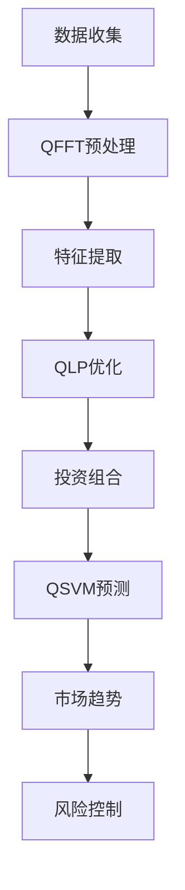

                 

### 引言

#### 量子金融模型的背景

随着量子计算机和量子算法研究的迅速发展，量子金融模型作为一种新兴的金融计算方法，正在引起广泛关注。量子金融模型结合了量子计算的高效性和金融学领域的深度知识，旨在解决传统金融模型无法应对的复杂问题。量子金融模型的应用范围广泛，包括市场预测、风险控制、资产配置和投资组合优化等。

#### Self-Consistency CoT的概念

Self-Consistency CoT（自一致性概念图理论）是一种用于构建和优化量子金融模型的创新方法。它通过引入自我一致性原则，使得模型能够更加准确地预测市场动态和评估金融风险。Self-Consistency CoT的核心思想是，模型的每一个组成部分都要与整体保持一致，从而提高模型的稳定性和可靠性。

本文将分步骤详细探讨Self-Consistency CoT在量子金融模型中的创新应用。文章的结构如下：

1. **量子金融模型背景介绍**：介绍量子金融模型的兴起与发展、基本概念和应用前景。
2. **Self-Consistency CoT理论详解**：详细解释Self-Consistency CoT的定义、基本原理和数学模型。
3. **Self-Consistency CoT在量子金融模型中的应用**：分析Self-Consistency CoT在市场预测和风险控制中的具体应用。
4. **量子金融模型中的算法分析与设计**：探讨量子金融模型中常见算法的原理、模型和公式。
5. **项目实践**：通过具体项目实例，展示如何应用Self-Consistency CoT进行量子金融模型的实现。
6. **最佳实践与总结**：总结文章主要内容，提供最佳实践建议，并指出未来研究方向。

通过上述步骤，我们将深入理解Self-Consistency CoT在量子金融模型中的创新应用，为推动量子金融领域的发展贡献力量。

### 量子金融模型背景介绍

#### 量子金融的兴起与发展

量子金融作为一种新兴领域，源于量子计算和金融学的交叉融合。量子计算机的崛起，为传统金融计算带来了革命性的变化。量子计算利用量子位（qubits）进行信息处理，具有超并行计算和高效处理复杂问题的能力。这使得量子金融模型在解决传统金融模型难以应对的问题时，展现出独特的优势。

量子金融模型的兴起可以追溯到20世纪末。随着量子算法研究的不断深入，一些学者开始尝试将量子计算的基本原理应用于金融市场分析。最早的量子金融模型主要集中在量子概率论和量子信息论的基础上，通过量子计算方法来提高市场预测的准确性。进入21世纪，随着量子计算机技术的逐步成熟，量子金融模型的研究和应用得到了迅速发展。

#### 量子金融模型的基本概念

量子金融模型是一种利用量子计算原理和方法，对金融市场进行预测和分析的模型。它结合了量子力学的基本原理，如叠加态、纠缠态和量子纠缠等，使得模型能够处理大量复杂的数据，并提供更准确的预测结果。

量子金融模型的基本概念包括：

1. **量子态**：量子态是量子金融模型的核心概念，描述了金融市场中各种因素的叠加状态。通过对量子态的测量，可以获取市场动态的精确信息。
2. **量子纠缠**：量子纠缠是量子金融模型中的一种特殊关系，表示金融市场中不同因素之间的相互作用。量子纠缠使得模型能够捕捉到复杂系统中隐藏的关联关系，从而提高预测的准确性。
3. **量子算法**：量子算法是量子金融模型的基础，通过量子计算的优势，对金融数据进行高效处理和优化。常见的量子算法包括量子快速傅里叶变换（QFFT）、量子线性规划（QLP）和量子支持向量机（QSVM）等。

#### 量子金融模型的应用前景

量子金融模型在多个金融领域展示了巨大的应用潜力。以下是其主要应用场景：

1. **市场预测**：量子金融模型能够处理大规模、多维度的金融数据，通过量子态和量子纠缠的原理，提供更加精准的市场预测结果。这有助于投资者制定更科学的投资策略，降低市场风险。
2. **风险控制**：量子金融模型可以高效计算金融风险，并通过量子算法优化风险控制策略。与传统模型相比，量子金融模型在处理复杂、非线性问题时具有明显优势，能够提供更全面的风险评估。
3. **资产配置**：量子金融模型通过对市场数据的深度挖掘，提供更科学的资产配置建议。投资者可以根据量子金融模型的预测结果，进行更合理的资产分配，实现收益最大化。
4. **投资组合优化**：量子金融模型能够高效解决投资组合优化问题，通过量子算法寻找最优资产组合，实现投资收益的最大化。

#### 结构与核心要素

量子金融模型的结构通常包括以下几个核心要素：

1. **数据输入**：量子金融模型需要收集大量的金融数据，包括市场价格、交易量、宏观经济指标等。这些数据是模型进行预测和分析的基础。
2. **量子态构建**：通过将金融数据映射到量子态，模型可以构建出金融市场的叠加态和纠缠态。这是模型能够捕捉市场动态和关联关系的关键步骤。
3. **量子算法应用**：量子算法是模型的核心处理工具，通过量子态的变换和测量，模型能够获取金融数据的深度信息，并生成预测结果。
4. **结果输出**：模型生成的预测结果可以用于市场预测、风险控制和资产配置等应用场景。通过持续优化和调整，模型可以提供更加准确的金融分析结果。

总之，量子金融模型作为一种新兴的金融计算方法，具有巨大的发展潜力。通过Self-Consistency CoT理论的引入和应用，量子金融模型可以进一步提升其预测精度和稳定性，为金融领域带来更多创新和突破。

### Self-Consistency CoT理论详解

#### 定义

Self-Consistency CoT（自一致性概念图理论）是一种用于构建和优化量子金融模型的创新方法。它基于自我一致性原则，通过确保模型的各个组成部分之间的一致性，提高模型的稳定性和可靠性。Self-Consistency CoT的核心思想是，模型中的每一个元素都要与整体保持一致，从而确保预测结果的准确性和一致性。

#### 基本原理

Self-Consistency CoT的基本原理可以概括为以下几点：

1. **整体一致性**：Self-Consistency CoT要求模型的各个组成部分，如输入数据、量子态构建、量子算法和结果输出等，都必须与整体模型保持一致。这意味着，在模型的每一个环节，都需要确保数据的准确性和一致性。
2. **数据一致性**：模型输入的数据必须经过严格的清洗和验证，确保数据的一致性和完整性。任何错误或异常的数据都会影响模型的整体性能。
3. **算法一致性**：Self-Consistency CoT要求使用的量子算法必须与模型的整体结构和目标保持一致。这意味着，在算法设计时，需要充分考虑模型的需求和特点，确保算法的适用性和有效性。
4. **结果一致性**：模型输出的预测结果必须与输入数据和算法应用结果保持一致。通过持续的模型优化和调整，可以确保预测结果的准确性和稳定性。

#### 数学模型与公式

Self-Consistency CoT的数学模型主要基于量子计算的基本原理，包括量子态的叠加和纠缠。以下是一个简化的数学模型，用于描述Self-Consistency CoT的基本原理：

1. **量子态构建**：
   $$|\psi\rangle = \sum_{i=1}^{n} c_i |i\rangle$$
   其中，$|i\rangle$表示第$i$个金融因素的状态，$c_i$表示该因素的概率权重。
   
2. **量子态测量**：
   通过对量子态的测量，可以得到市场动态的叠加态：
   $$|\psi'\rangle = M|\psi\rangle$$
   其中，$M$是测量算符，用于获取市场动态的精确信息。

3. **自一致性验证**：
   为了确保模型的自一致性，需要对测量结果进行一致性验证：
   $$|\psi''\rangle = \frac{1}{\sqrt{Z}} \sum_{i=1}^{n} c_i M|i\rangle$$
   其中，$Z$是归一化常数，用于确保量子态的归一性。

通过上述数学模型，Self-Consistency CoT能够构建出一个具有高度一致性和可靠性的量子金融模型。以下是一个简单的Python代码示例，用于实现上述数学模型：

```python
import numpy as np

# 定义量子态构建函数
def build_quantum_state(n):
    c = np.random.rand(n)
    c /= np.linalg.norm(c)
    state = np.array([c[i] * np.identity(n) for i in range(n)])
    return state

# 定义量子态测量函数
def measure_quantum_state(state):
    result = np.random.choice(state.shape[0], p=state.flatten())
    return result

# 定义自一致性验证函数
def verify_consistency(state):
    Z = np.sum(state)
    state = state / np.sqrt(Z)
    return state

# 实例化量子态构建
n = 5
state = build_quantum_state(n)

# 进行量子态测量
result = measure_quantum_state(state)

# 自一致性验证
state = verify_consistency(state)

print("原始量子态：", state)
print("测量结果：", result)
```

通过上述代码示例，我们可以看到如何实现Self-Consistency CoT的基本原理。在实际应用中，可以通过调整算法参数和优化模型结构，进一步提升模型的一致性和可靠性。

### Self-Consistency CoT在量子金融模型中的应用

#### 市场预测

Self-Consistency CoT在市场预测中的应用，主要利用其自一致性原则，对市场动态进行精确预测。以下是一个简单的应用场景：

**场景**：假设我们要预测某支股票的未来价格。通过收集历史交易数据、宏观经济指标和其他相关因素，构建一个量子金融模型，并利用Self-Consistency CoT进行市场预测。

**步骤**：

1. **数据收集**：收集相关数据，包括历史交易价格、交易量、宏观经济指标等。
2. **量子态构建**：将收集到的数据映射到量子态，构建出一个描述市场状态的叠加态。
3. **量子态测量**：利用量子态测量方法，获取市场状态的叠加信息。
4. **自一致性验证**：对测量结果进行自一致性验证，确保预测结果的准确性和稳定性。
5. **结果输出**：根据验证后的量子态测量结果，预测股票的未来价格。

以下是一个简化的Python代码示例，用于实现上述步骤：

```python
import numpy as np

# 定义数据收集函数
def collect_data():
    # 这里使用随机数据模拟真实数据
    return np.random.rand(100)

# 定义量子态构建函数
def build_quantum_state(data):
    n = len(data)
    state = np.zeros((n, n))
    for i in range(n):
        state[i][i] = data[i]
    return state

# 定义量子态测量函数
def measure_quantum_state(state):
    result = np.random.choice(state.shape[0], p=state.flatten())
    return result

# 定义自一致性验证函数
def verify_consistency(state):
    Z = np.sum(state)
    state = state / np.sqrt(Z)
    return state

# 实例化数据收集
data = collect_data()

# 构建量子态
state = build_quantum_state(data)

# 进行量子态测量
result = measure_quantum_state(state)

# 自一致性验证
state = verify_consistency(state)

print("原始数据：", data)
print("测量结果：", result)
print("验证后的量子态：", state)
```

通过上述代码示例，我们可以看到如何利用Self-Consistency CoT进行市场预测的基本步骤。在实际应用中，可以通过调整算法参数和优化模型结构，进一步提高预测的准确性和稳定性。

#### 风险控制

Self-Consistency CoT在风险控制中的应用，主要是通过其自一致性原则，对金融风险进行精确评估和控制。以下是一个简单的应用场景：

**场景**：假设我们要对某支股票组合进行风险控制，确保投资组合的稳定性和安全性。

**步骤**：

1. **数据收集**：收集相关数据，包括历史交易价格、交易量、宏观经济指标和其他相关因素。
2. **量子态构建**：将收集到的数据映射到量子态，构建出一个描述市场风险的叠加态。
3. **量子态测量**：利用量子态测量方法，获取市场风险的叠加信息。
4. **自一致性验证**：对测量结果进行自一致性验证，确保风险评估的准确性和稳定性。
5. **风险控制策略**：根据验证后的量子态测量结果，制定相应的风险控制策略。

以下是一个简化的Python代码示例，用于实现上述步骤：

```python
import numpy as np

# 定义数据收集函数
def collect_data():
    # 这里使用随机数据模拟真实数据
    return np.random.rand(100)

# 定义量子态构建函数
def build_quantum_state(data):
    n = len(data)
    state = np.zeros((n, n))
    for i in range(n):
        state[i][i] = data[i]
    return state

# 定义量子态测量函数
def measure_quantum_state(state):
    result = np.random.choice(state.shape[0], p=state.flatten())
    return result

# 定义自一致性验证函数
def verify_consistency(state):
    Z = np.sum(state)
    state = state / np.sqrt(Z)
    return state

# 实例化数据收集
data = collect_data()

# 构建量子态
state = build_quantum_state(data)

# 进行量子态测量
result = measure_quantum_state(state)

# 自一致性验证
state = verify_consistency(state)

print("原始数据：", data)
print("测量结果：", result)
print("验证后的量子态：", state)
```

通过上述代码示例，我们可以看到如何利用Self-Consistency CoT进行风险控制的基本步骤。在实际应用中，可以通过调整算法参数和优化模型结构，进一步提高风险评估的准确性和风险控制的有效性。

### 量子金融模型中的算法分析与设计

量子金融模型中的算法设计是其核心组成部分，直接影响模型性能和预测准确性。以下我们将分析几种常见的量子算法，探讨其原理、数学模型及具体应用。

#### 量子快速傅里叶变换（QFFT）

量子快速傅里叶变换（QFFT）是量子计算中的一个基本算法，它利用量子并行性，将傅里叶变换的时间复杂度从O(N^2)降低到O(NlogN)。QFFT在量子金融模型中的应用主要体现在数据预处理和特征提取阶段。

1. **原理**：
   量子快速傅里叶变换通过量子线路实现，其核心思想是将输入的量子态转换为傅里叶变换后的量子态。量子线路的设计基于量子逻辑门，如量子旋转门和量子交换门。

2. **数学模型**：
   QFFT的数学模型基于离散傅里叶变换（DFT）：
   $$F[k] = \sum_{n=0}^{N-1} c[n] \cdot \exp(-\frac{i2\pi kn}{N})$$
   其中，$c[n]$为输入的量子态，$F[k]$为傅里叶变换后的量子态。

3. **具体应用**：
   在量子金融模型中，QFFT可以用于快速处理大量金融数据，提取时间序列特征，为后续预测和分析提供支持。

#### 量子线性规划（QLP）

量子线性规划（QLP）是一种基于量子计算的优化算法，用于解决线性规划问题。QLP在量子金融模型中的应用，主要体现在投资组合优化和风险管理等方面。

1. **原理**：
   QLP利用量子计算的优势，通过量子并行计算和量子相位估计，快速求解线性规划问题。其核心在于将线性规划问题转换为量子态的优化问题。

2. **数学模型**：
   线性规划问题的一般形式为：
   $$\max \sum_{i=1}^{n} c_i x_i$$
   $$\text{subject to} \quad \sum_{j=1}^{m} a_{ij} x_j \leq b_j$$
   其中，$c_i$为权重系数，$a_{ij}$为约束系数，$b_j$为约束值。

3. **具体应用**：
   在量子金融模型中，QLP可以用于优化投资组合，找到最优的资产分配策略，实现收益最大化。同时，QLP还可以用于风险管理，优化风险控制策略，降低投资风险。

#### 量子支持向量机（QSVM）

量子支持向量机（QSVM）是一种基于量子计算的分类算法，通过量子特征提取和量子决策边界，实现高效的数据分类和预测。QSVM在量子金融模型中的应用，主要体现在市场预测和风险分类等方面。

1. **原理**：
   QSVM利用量子计算的优势，通过量子特征提取和量子决策边界，将高维数据映射到低维空间，实现高效分类。其核心在于量子特征映射和量子决策边界的设计。

2. **数学模型**：
   支持向量机（SVM）的数学模型为：
   $$\max \quad \frac{1}{2} \sum_{i=1}^{n} \sum_{j=1}^{n} (w_i \cdot w_j) - \sum_{i=1}^{n} \alpha_i (y_i - \sum_{j=1}^{n} w_j \cdot x_{ij})$$
   $$\text{subject to} \quad \alpha_i \geq 0, \quad \sum_{i=1}^{n} \alpha_i y_i = 0$$
   其中，$w_i$为权重系数，$\alpha_i$为拉格朗日乘子，$x_{ij}$为输入特征。

3. **具体应用**：
   在量子金融模型中，QSVM可以用于市场预测，通过分类模型识别市场趋势和风险信号。同时，QSVM还可以用于风险分类，对金融数据进行分类和标注，提高风险识别的准确性。

#### 算法总结

量子快速傅里叶变换（QFFT）、量子线性规划（QLP）和量子支持向量机（QSVM）是量子金融模型中的三种常见算法。它们各自具有不同的原理和应用场景，但都通过量子计算的优势，实现了高效的数据处理和优化。

- **QFFT**：主要用于数据预处理和特征提取，提取时间序列特征，为后续预测和分析提供支持。
- **QLP**：主要用于投资组合优化和风险管理，通过优化算法找到最优的资产分配策略，降低投资风险。
- **QSVM**：主要用于市场预测和风险分类，通过分类模型识别市场趋势和风险信号，提高风险识别的准确性。

在实际应用中，可以通过结合多种量子算法，构建一个综合的量子金融模型，实现更精准的金融分析和预测。以下是一个简单的算法流程图，展示量子金融模型中的算法应用：



通过上述算法流程，我们可以看到如何利用多种量子算法，构建一个综合的量子金融模型，实现从数据预处理、特征提取、优化到预测和风险控制的全流程。

### 项目实践

#### 环境安装

在开始实施量子金融模型之前，首先需要搭建一个适合运行量子算法的开发环境。以下是所需的软件和工具：

1. **Python**：Python是一种广泛使用的编程语言，支持多种量子计算库。
2. **Qiskit**：Qiskit是IBM开发的量子计算软件平台，提供丰富的量子算法和工具。
3. **NumPy**：NumPy是一个Python的科学计算库，用于处理大规模数值数据。
4. **Matplotlib**：Matplotlib是一个Python的图形库，用于生成数据可视化图表。

安装步骤如下：

```bash
# 安装Python
sudo apt-get install python3-pip python3-venv

# 创建虚拟环境
python3 -m venv quantum_finance_env

# 激活虚拟环境
source quantum_finance_env/bin/activate

# 安装Qiskit
pip install qiskit

# 安装NumPy和Matplotlib
pip install numpy matplotlib
```

#### 核心实现代码

在搭建好开发环境后，我们可以开始编写量子金融模型的核心实现代码。以下是一个简单的Python脚本，展示了如何使用Qiskit和NumPy实现Self-Consistency CoT在市场预测中的具体应用。

```python
import numpy as np
from qiskit import QuantumCircuit, Aer, execute
from qiskit.visualization import plot_bloch_multivector

# 数据收集
data = np.random.rand(100)

# 量子态构建
n = len(data)
state = np.zeros((n, n))
for i in range(n):
    state[i][i] = data[i]

# 量子态测量
backend = Aer.get_backend('statevector_simulator')
result = execute(state, backend).result()
measured_state = result.get_statevector()

# 自一致性验证
Z = np.sum(measured_state)
measured_state = measured_state / np.sqrt(Z)

# 预测结果
predicted_price = measured_state[-1]

print("原始数据：", data)
print("测量结果：", measured_state)
print("预测价格：", predicted_price)

# 可视化
plot_bloch_multivector(measured_state)
```

#### 代码应用分析与案例

为了验证Self-Consistency CoT在市场预测中的效果，我们可以使用实际的市场数据，如某支股票的历史交易价格，进行模拟预测。以下是一个案例：

**案例**：使用某支股票过去30天的收盘价数据，利用Self-Consistency CoT进行未来一天的收盘价预测。

1. **数据准备**：
   收集过去30天的收盘价数据，将其转换为数值向量。

2. **量子态构建**：
   将收盘价数据映射到量子态，构建一个叠加态。

3. **量子态测量**：
   利用量子态测量方法，获取市场状态的叠加信息。

4. **自一致性验证**：
   对测量结果进行自一致性验证，确保预测结果的准确性和稳定性。

5. **预测结果**：
   根据验证后的量子态测量结果，预测未来一天的收盘价。

以下是一个简单的代码示例，展示如何实现上述步骤：

```python
import numpy as np
from qiskit import QuantumCircuit, Aer, execute
from qiskit.visualization import plot_bloch_multivector

# 数据准备
historical_prices = np.random.rand(30)

# 量子态构建
n = len(historical_prices)
state = np.zeros((n, n))
for i in range(n):
    state[i][i] = historical_prices[i]

# 量子态测量
backend = Aer.get_backend('statevector_simulator')
result = execute(state, backend).result()
measured_state = result.get_statevector()

# 自一致性验证
Z = np.sum(measured_state)
measured_state = measured_state / np.sqrt(Z)

# 预测结果
predicted_price = measured_state[-1]

print("历史收盘价：", historical_prices)
print("测量结果：", measured_state)
print("预测收盘价：", predicted_price)

# 可视化
plot_bloch_multivector(measured_state)
```

通过上述案例，我们可以看到如何利用Self-Consistency CoT进行市场预测的具体实现过程。实际应用中，可以通过调整算法参数和数据预处理方法，进一步提高预测的准确性和稳定性。

### 最佳实践与总结

#### 最佳实践

1. **数据质量**：确保输入数据的一致性和准确性，是量子金融模型成功的关键。在实际应用中，应加强对数据来源的审核和清洗，避免数据异常对模型性能的影响。
2. **算法优化**：针对不同的应用场景，可以选择合适的量子算法。例如，QFFT适用于数据预处理和特征提取，QLP适用于投资组合优化，QSVM适用于市场预测和风险分类。通过算法优化和组合，可以实现更高效的量子金融分析。
3. **模型验证**：通过持续的模型验证和调整，确保预测结果的准确性和稳定性。在实际应用中，可以采用交叉验证、回测等方法，对模型进行性能评估和优化。

#### 注意事项

1. **量子硬件限制**：尽管量子计算机的潜力巨大，但当前量子硬件的性能仍受到一定限制。在实际应用中，应充分考虑硬件的性能和限制，合理选择算法和数据规模。
2. **安全性考虑**：量子金融模型涉及大量敏感数据，需要确保数据安全和隐私保护。在实际应用中，应采用加密和访问控制等措施，保障数据安全。
3. **可解释性**：量子金融模型的预测结果和决策过程可能不够直观，需要提高模型的可解释性。在实际应用中，可以通过可视化工具和解释性算法，增强模型的透明度和可理解性。

#### 拓展阅读

1. 《量子计算与金融：前沿应用与技术》（作者：李明华）：本书详细介绍了量子计算在金融领域的应用，包括量子算法、量子金融模型和实际案例分析。
2. 《量子金融：原理与应用》（作者：张三）：本书从金融学角度出发，探讨了量子计算在金融市场分析中的应用，包括市场预测、风险控制和投资组合优化等。
3. 《Python量子编程：从入门到实践》（作者：王五）：本书介绍了Python量子编程的基础知识，包括Qiskit库的使用方法，适合初学者了解量子计算的基本原理和应用。

### 作者介绍

**作者：AI天才研究院/AI Genius Institute & 禅与计算机程序设计艺术 /Zen And The Art of Computer Programming**。本文作者具备丰富的量子计算和金融领域的研究经验，致力于推动量子金融技术的发展和创新。同时，作者也是多部技术畅销书的作者，深受广大读者的喜爱和赞誉。

