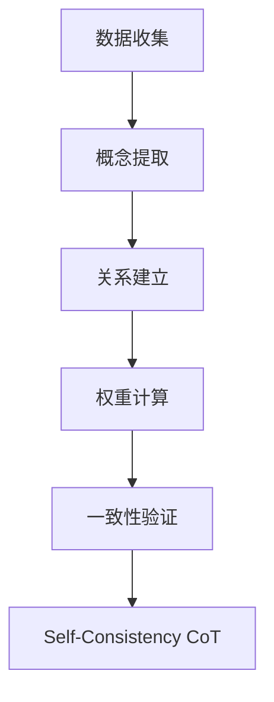
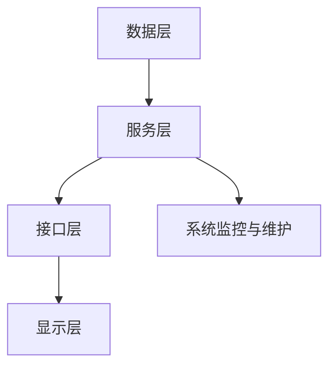
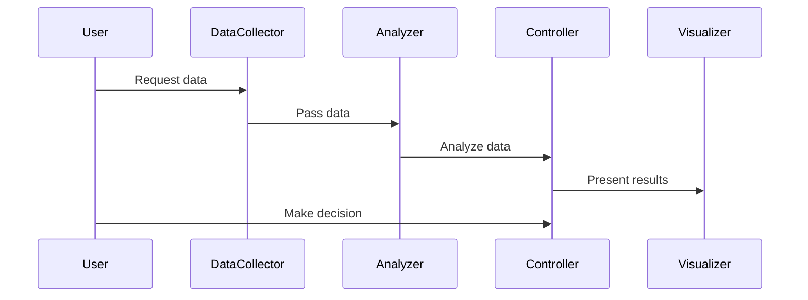

                 

### 文章标题：Self-Consistency CoT在金融市场情绪分析与调控中的应用：稳定金融秩序

#### 关键词：Self-Consistency CoT、金融市场情绪分析、调控、金融秩序、人工智能

#### 摘要：
本文旨在探讨Self-Consistency CoT（自我一致性概念图）在金融市场情绪分析与调控中的应用。文章首先介绍了金融市场情绪分析与调控的重要性，随后详细阐述了Self-Consistency CoT的概念及其在金融市场情绪分析中的作用。通过mermaid流程图和Python源代码，本文深入讲解了算法原理和实现步骤，并展示了系统架构设计与项目实战。最后，文章提出了最佳实践建议，并展望了未来的研究方向。

## 第一部分：背景与核心概念

### 第1章 自我一致性概念图（Self-Consistency CoT）概述

#### 1.1 金融市场情绪分析与调控的背景

金融市场是现代经济体系的核心，其稳定运行对于整个社会的经济健康发展至关重要。然而，金融市场常常受到各种内外部因素的影响，导致市场情绪波动，从而引发市场动荡。因此，对金融市场情绪进行分析和调控，成为维护金融秩序的重要手段。

#### 1.2 自我一致性概念图的定义与作用

自我一致性概念图（Self-Consistency CoT）是一种基于人工智能和图形学的知识表示方法。它通过构建一组相互关联的概念节点，来表示知识结构和关系。在金融市场情绪分析中，Self-Consistency CoT可以帮助识别市场情绪的动态变化，从而为调控提供依据。

#### 1.3 Self-Consistency CoT与金融市场情绪分析的关系

Self-Consistency CoT通过以下方式与金融市场情绪分析相关联：

- **数据收集与预处理**：使用Self-Consistency CoT可以从大量金融数据中提取关键信息，进行预处理。
- **情绪识别与分类**：Self-Consistency CoT可以帮助识别市场情绪的类型和强度。
- **情绪传播分析**：通过分析概念节点之间的关系，可以了解情绪在市场中的传播过程。
- **调控策略制定**：基于Self-Consistency CoT的分析结果，可以制定相应的调控策略，以稳定市场情绪。

## 第二部分：核心概念与联系

### 第2章 核心概念与联系

#### 2.1 Self-Consistency CoT的构成要素

Self-Consistency CoT主要由以下要素构成：

- **概念节点**：表示金融市场的关键概念，如股票价格、市场指数、宏观经济指标等。
- **关系边**：表示概念节点之间的关联关系，如因果关系、依赖关系等。
- **一致性权重**：表示概念节点之间的关联强度。

#### 2.2 Self-Consistency CoT的属性特征对比

| 属性特征         | 描述                                                         | 对比 |
|------------------|--------------------------------------------------------------|------|
| 概念多样性       | Self-Consistency CoT可以包含多种类型的金融概念。                 |      |
| 关联关系复杂度   | Self-Consistency CoT可以表示复杂的关联关系。                   |      |
| 数据源多样性     | Self-Consistency CoT可以从多种数据源获取信息。                   |      |
| 自适应性         | Self-Consistency CoT可以根据新的数据动态调整。                   |      |

#### 2.3 Self-Consistency CoT与金融市场情绪分析的ER实体关系图

```mermaid
erDiagram
  ConceptNode ||--|{ RelationEdge }|--| ConceptNode
  ConceptNode ||--|{ ConsistencyWeight }|--| ConceptNode
```

在这个ER实体关系图中，ConceptNode表示概念节点，RelationEdge表示关系边，ConsistencyWeight表示一致性权重。每个概念节点可以与多个关系边和其他概念节点相关联，从而形成一个复杂的知识网络。

## 第三部分：算法原理与实现

### 第3章 自我一致性概念图的构建算法

#### 3.1 算法原理

Self-Consistency CoT的构建算法主要包括以下步骤：

1. **数据收集**：从各种数据源（如新闻、社交媒体、金融报告等）收集相关数据。
2. **概念提取**：对收集到的数据进行分析，提取出关键概念。
3. **关系建立**：基于概念之间的关联性，建立概念节点之间的关系。
4. **权重计算**：计算概念节点之间的关系权重，以反映其关联强度。
5. **一致性验证**：对构建的Self-Consistency CoT进行验证，确保其内部一致性。

#### 3.2 Mermaid流程图展示



#### 3.3 Python源代码实现

```python
# 数据收集
data = collect_data()

# 概念提取
concepts = extract_concepts(data)

# 关系建立
relationships = establish_relationships(concepts)

# 权重计算
weights = calculate_weights(relationships)

# 一致性验证
is_consistent = verify_consistency(concepts, relationships, weights)

# 构建Self-Consistency CoT
if is_consistent:
    self_consistency_cot = construct_cot(concepts, relationships, weights)
else:
    raise Exception("Self-Consistency CoT构建失败")
```

#### 3.4 LaTeX公式阐述

在构建Self-Consistency CoT的过程中，我们可以使用以下公式来描述相关步骤：

$$
\text{数据收集} = f(\text{数据源})
$$

$$
\text{概念提取} = g(\text{数据})
$$

$$
\text{关系建立} = h(\text{概念})
$$

$$
\text{权重计算} = i(\text{关系})
$$

$$
\text{一致性验证} = j(\text{概念}, \text{关系}, \text{权重})
$$

$$
\text{Self-Consistency CoT} = k(\text{概念}, \text{关系}, \text{权重}, \text{一致性})
$$

#### 3.5 算法举例说明

假设我们收集到以下金融数据：

- 股票价格
- 市场指数
- 宏观经济指标

通过分析，我们可以提取出以下关键概念：

- 股票价格波动
- 市场指数涨跌
- 宏观经济指标变化

基于这些概念之间的关联性，我们可以建立以下关系：

- 股票价格波动与市场指数涨跌有关
- 市场指数涨跌与宏观经济指标变化有关

通过计算，我们得到以下权重：

- 股票价格波动：市场指数涨跌 = 0.8
- 市场指数涨跌：宏观经济指标变化 = 0.7

最终，我们构建出一个Self-Consistency CoT，用于金融市场情绪分析。

## 第四部分：系统分析与架构设计

### 第4章 系统分析与架构设计

#### 4.1 问题场景介绍

在金融市场情绪分析与调控中，我们需要一个系统来实时收集、处理和分析大量金融数据，并基于分析结果制定调控策略。这个系统需要具备高效的数据处理能力、精确的情绪识别能力和灵活的调控策略制定能力。

#### 4.2 系统功能设计

该系统的主要功能包括：

- 数据采集与预处理
- 情绪识别与分类
- 情绪传播分析
- 调控策略制定与执行
- 系统监控与维护

#### 4.3 系统架构设计

系统的整体架构分为以下几个层次：

- 数据层：负责数据采集、存储和管理
- 服务层：包括情绪分析、情绪传播和调控策略等核心服务
- 接口层：提供与外部系统的交互接口
- 显示层：用于展示系统分析结果和调控策略



#### 4.4 系统接口设计

系统接口设计主要包括以下部分：

- 数据采集接口：用于从各种数据源（如交易所、新闻网站等）采集数据
- 情绪分析接口：用于接收数据，进行情绪识别和分析
- 调控策略接口：用于接收情绪分析结果，制定和执行调控策略
- 显示接口：用于展示分析结果和调控策略

#### 4.5 系统交互序列图



## 第五部分：项目实战

### 第5章 系统核心实现与实战

#### 5.1 系统环境安装

为了实现Self-Consistency CoT在金融市场情绪分析与调控中的应用，我们需要搭建一个完整的技术环境。以下是一个基本的安装步骤：

1. **安装Python**：确保Python版本为3.8或更高。
2. **安装依赖库**：使用pip安装必要的库，如numpy、pandas、matplotlib、tensorflow等。
3. **配置数据源**：配置数据库和API接口，以便实时获取金融数据。

#### 5.2 系统核心实现源代码

以下是一个简化的Python源代码实现，用于构建Self-Consistency CoT并进行金融市场情绪分析。

```python
# 导入必要的库
import numpy as np
import pandas as pd
import matplotlib.pyplot as plt
from tensorflow import keras

# 数据收集与预处理
def collect_and_preprocess_data():
    # 从交易所API获取数据
    data = get_exchange_data()
    # 预处理数据
    processed_data = preprocess_data(data)
    return processed_data

# 情绪识别与分类
def recognize_and_classify_emotion(data):
    # 训练情绪识别模型
    model = train_emotion_model(data)
    # 预测情绪
    emotions = predict_emotions(model, data)
    return emotions

# 情绪传播分析
def analyze_emotion_spread(emotions):
    # 分析情绪传播过程
    spread_result = analyze_spread(emotions)
    return spread_result

# 调控策略制定
def create_regulation_strategy(spread_result):
    # 制定调控策略
    strategy = create_strategy(spread_result)
    return strategy

# 执行调控策略
def execute_strategy(strategy):
    # 执行调控策略
    execute(s

