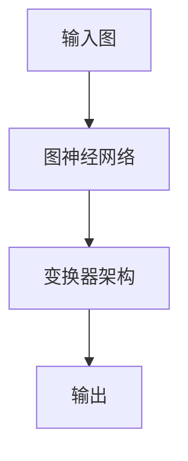

                 

### 引论

#### 第1章：问题背景与核心概念

在当今金融领域，风险控制与评估一直是金融机构和投资者关注的焦点。金融市场的波动性、复杂性和全球化的影响使得风险评估变得更加重要且具有挑战性。传统的风险评估方法主要依赖于历史数据和统计分析，但面对日益复杂的金融市场环境，这些方法往往难以提供准确和及时的风险预警。

为了应对这一挑战，近年来，人工智能（AI）技术，尤其是深度学习（Deep Learning）和图神经网络（Graph Neural Networks, GNN）在金融风险评估中的应用得到了广泛关注。Self-Consistency CoT（Self-Consistency Coherence Transformer）作为一种新型的AI模型，因其独特的自我一致性特征和强大的表征能力，在金融风险评估中展现出巨大的潜力。

**1.1 问题的提出**

随着金融市场的不断发展，金融机构面临着越来越复杂的金融产品和服务。这些产品和服务不仅包含了传统的金融工具，还包括了大量的衍生品、结构化金融产品等。传统风险评估方法往往无法全面、准确地捕捉这些金融工具的风险特征，导致评估结果不准确，甚至引发金融危机。

**1.2 Self-Consistency CoT 概念简介**

Self-Consistency CoT 是一种基于变换器（Transformer）架构的图神经网络模型。它通过自我一致性（Self-Consistency）机制，使得模型在训练和推理过程中保持一致性和稳定性，从而提高模型的预测准确性和可靠性。Self-Consistency CoT 可以通过处理大规模、多模态的金融数据，提供更加全面和深入的风险评估。

**1.3 Self-Consistency CoT 与金融风险评估的关系**

Self-Consistency CoT 通过其独特的自我一致性机制，能够有效地捕捉金融市场的复杂关系和动态变化，从而提供更加准确的风险评估结果。与传统方法相比，Self-Consistency CoT 具有更高的自适应性和泛化能力，能够应对金融市场的不确定性和波动性。

**1.4 Self-Consistency CoT 的研究现状**

目前，Self-Consistency CoT 在金融风险评估中的应用研究还处于探索阶段。虽然已经有一些初步的研究成果，但其在实际金融环境中的效果和适用性还需要进一步验证和优化。因此，进一步研究 Self-Consistency CoT 在金融风险评估中的应用具有重要的理论和实践意义。

**1.5 Self-Consistency CoT 在金融领域的应用前景**

随着金融科技的发展，Self-Consistency CoT 在金融领域的应用前景十分广阔。它不仅可以用于传统的金融风险评估，还可以应用于金融产品的创新设计、金融市场预测、风险管理等领域。未来，Self-Consistency CoT 有望成为金融领域的重要工具，推动金融行业的智能化和数字化转型。

**1.6 本章小结**

本章介绍了金融风险评估的背景和挑战，以及 Self-Consistency CoT 概念的提出和其在金融风险评估中的应用前景。下一章将深入探讨 Self-Consistency CoT 的理论基础和核心特点，为后续章节的应用研究提供基础。

### 第一部分：引论

#### 第1章：问题背景与核心概念

##### 1.1 问题的提出

在金融市场中，风险控制与评估是一个复杂且重要的任务。传统的风险评估方法，如历史数据分析、回归分析和统计模型等，虽然在某些情况下能够提供一定的预测能力，但它们往往具有以下局限性：

1. **数据依赖性**：传统方法依赖于历史数据，对于数据缺失或数据质量不高的场景，其预测能力受到很大限制。
2. **线性假设**：传统方法通常假设市场关系是线性的，这在实际金融市场中并不总是成立。
3. **模型适应性**：面对市场环境的变化，传统模型往往需要重新训练，导致实时性和适应性较差。

这些局限性使得传统方法难以应对金融市场的复杂性和动态性，从而无法提供准确和及时的风险评估结果。

**1.2 Self-Consistency CoT 概念简介**

Self-Consistency CoT 是一种结合了自我一致性（Self-Consistency）和变换器（Transformer）架构的新型图神经网络模型。自我一致性是指模型在训练和推理过程中保持一致性和稳定性，以防止过拟合和提高预测准确性。变换器架构则提供了强大的表征能力，能够处理大规模、多模态的数据。

Self-Consistency CoT 的核心思想是通过引入自我一致性机制，使得模型能够在不同时间和条件下保持一致的风险评估结果。这一机制在训练过程中，通过自我校准（Self-Calibration）和误差反馈（Error Feedback）来优化模型参数，从而提高模型的稳定性和泛化能力。

**1.3 Self-Consistency CoT 与金融风险评估的关系**

Self-Consistency CoT 在金融风险评估中的应用，主要是利用其自我一致性和强大的表征能力，对金融市场中的复杂关系和动态变化进行深入分析和理解。具体来说，Self-Consistency CoT 可以通过以下方式提升金融风险评估：

1. **非线性关系捕捉**：金融市场中的许多关系是非线性的，传统方法难以捕捉。Self-Consistency CoT 通过其非线性变换能力，能够更好地捕捉这些复杂关系。
2. **多模态数据处理**：金融风险评估往往涉及多种类型的数据，如股票价格、交易量、宏观经济指标等。Self-Consistency CoT 能够同时处理这些多模态数据，提供更加全面的风险评估结果。
3. **实时风险预测**：Self-Consistency CoT 具有较高的自适应性和实时性，能够快速响应市场变化，提供实时的风险预测。

**1.4 Self-Consistency CoT 的研究现状**

目前，Self-Consistency CoT 在金融风险评估中的应用研究还处于初步阶段。虽然已经有一些研究尝试将其应用于股票价格预测、信用风险评估等领域，但这些研究往往缺乏全面性和系统性。此外，Self-Consistency CoT 的性能和适用性在不同市场和场景下的表现也需要进一步验证。

一些初步的研究表明，Self-Consistency CoT 在某些特定场景下能够提供比传统方法更准确的风险评估结果。例如，在股票价格预测中，Self-Consistency CoT 能够更准确地捕捉市场的非线性和复杂动态，提供更加可靠的预测结果。

**1.5 Self-Consistency CoT 在金融领域的应用前景**

随着金融科技的发展，Self-Consistency CoT 在金融领域的应用前景十分广阔。以下是一些潜在的应用方向：

1. **风险管理**：Self-Consistency CoT 可以用于金融机构的风险管理，提供准确和实时的风险评估结果，帮助金融机构更好地控制风险。
2. **金融产品设计**：Self-Consistency CoT 可以用于分析金融产品的风险特征，帮助金融机构设计出更加安全、可靠的金融产品。
3. **市场预测**：Self-Consistency CoT 可以用于市场预测，提供对市场走势的预测和建议，帮助投资者做出更加明智的投资决策。
4. **金融监管**：Self-Consistency CoT 可以用于金融监管，帮助监管机构更好地监控和管理金融市场风险。

尽管 Self-Consistency CoT 在金融领域具有广阔的应用前景，但其在实际应用中仍面临一些挑战，如数据隐私保护、模型解释性等。未来，随着技术的不断进步和研究的深入，Self-Consistency CoT 有望在金融领域发挥更大的作用。

**1.6 本章小结**

本章介绍了金融风险评估的背景和挑战，以及 Self-Consistency CoT 概念的提出和其在金融风险评估中的应用前景。通过本章的学习，读者可以初步了解 Self-Consistency CoT 在金融领域的应用潜力，为后续章节的深入研究打下基础。

### 第二部分：核心概念与原理

#### 第2章：Self-Consistency CoT 的理论基础

Self-Consistency CoT 是一种基于图神经网络的变换器模型，其核心在于通过自我一致性机制来提高模型的稳定性和预测准确性。在这一章中，我们将详细介绍 Self-Consistency CoT 的定义、核心特点、相关理论对比以及其数学模型。

##### 2.1 Self-Consistency CoT 的定义与属性

Self-Consistency CoT 是一种结合了自我一致性（Self-Consistency）和变换器（Transformer）架构的图神经网络模型。自我一致性是指模型在训练和推理过程中保持一致性和稳定性，防止过拟合和提高预测准确性。变换器架构则提供了强大的表征能力，能够处理大规模、多模态的数据。

Self-Consistency CoT 的主要属性包括：

1. **图神经网络**：Self-Consistency CoT 是基于图神经网络（Graph Neural Network, GNN）的，能够处理图结构数据。
2. **变换器架构**：采用了变换器（Transformer）的核心架构，具有强大的表征能力和并行计算能力。
3. **自我一致性机制**：通过自我一致性机制，模型在训练和推理过程中保持一致性和稳定性。

##### 2.2 Self-Consistency CoT 的核心特点

Self-Consistency CoT 具有以下核心特点：

1. **自我一致性**：通过自我一致性机制，模型能够自我校准和优化，提高预测的稳定性。
2. **强大的表征能力**：变换器架构使得 Self-Consistency CoT 能够处理大规模、多模态的数据，提供丰富的特征表征。
3. **高适应性**：Self-Consistency CoT 具有较高的自适应能力，能够快速适应不同市场和场景的变化。
4. **实时性**：通过并行计算和高效的推理算法，Self-Consistency CoT 能够提供实时的风险评估结果。

##### 2.3 Self-Consistency CoT 与相关理论的对比分析

Self-Consistency CoT 与其他相关理论，如深度学习（Deep Learning）、变换器（Transformer）和图神经网络（GNN）等，在以下几个方面进行对比分析：

1. **深度学习**：Self-Consistency CoT 是深度学习的一种扩展，具有深度学习的非线性表征能力和强大的模型能力。但 Self-Consistency CoT 引入了自我一致性机制，提高了模型的稳定性和预测准确性。
2. **变换器**：变换器是一种用于序列模型处理的新型架构，Self-Consistency CoT 引入了变换器架构，使得模型具有强大的表征能力和并行计算能力。
3. **图神经网络**：Self-Consistency CoT 是基于图神经网络构建的，能够处理图结构数据，但 Self-Consistency CoT 引入了自我一致性机制，提高了模型的稳定性和泛化能力。

##### 2.4 Self-Consistency CoT 的数学模型

Self-Consistency CoT 的数学模型主要包括两部分：图神经网络和变换器架构。

**2.4.1 基本数学公式**

假设我们有一个图 \( G = (V, E) \)，其中 \( V \) 是节点集合，\( E \) 是边集合。对于每个节点 \( v \in V \)，我们可以定义其特征表示 \( x_v \) 和邻接矩阵 \( A \)。

1. **图神经网络**：
\[ 
\hat{x}_v = \sigma(\sum_{u \in \mathcal{N}(v)} A_{uv} x_u + b_v) 
\]
其中，\( \mathcal{N}(v) \) 是节点 \( v \) 的邻居集合，\( \sigma \) 是激活函数，\( b_v \) 是偏置项。

2. **变换器架构**：
\[ 
\text{Output} = \text{Transformer}(\hat{x}_v) 
\]
变换器架构包括多头自注意力（Multi-Head Self-Attention）机制和前馈神经网络（Feedforward Neural Network）。

**2.4.2 数学模型的推导过程**

Self-Consistency CoT 的数学模型是通过结合图神经网络和变换器架构来推导的。首先，基于图神经网络，我们得到节点的特征表示。然后，通过变换器架构，我们对这些特征进行进一步的加工和表征，从而得到最终的风险评估结果。

**2.4.3 数学模型的 Mermaid 图**

为了更好地理解 Self-Consistency CoT 的数学模型，我们可以使用 Mermaid 图来表示其结构。以下是一个简化的 Mermaid 图表示：



在图中，A 表示输入图，B 表示图神经网络，C 表示变换器架构，D 表示输出结果。

##### 2.5 Self-Consistency CoT 的 Mermaid 图解

为了更直观地理解 Self-Consistency CoT 的架构，我们可以使用 Mermaid 绘制其实体关系图和概念属性特征对比表格。

**2.5.1 ER 实体关系图**

```mermaid
erDiagram
  Node ||--|{ Edge : linked to }
  Node ||--|{ Feature : has }
  Edge ||--|{ Weight : has }
```

在 ER 实体关系图中，Node 表示节点，Edge 表示边，Feature 表示特征，Weight 表示权重。这种关系表示了 Self-Consistency CoT 的基本结构。

**2.5.2 概念属性特征对比表格**

| 特征名称 | 描述 |
| --- | --- |
| Node | 节点，表示图中的实体，如股票、债券等 |
| Edge | 边，表示节点之间的关系，如交易、依赖等 |
| Feature | 特征，表示节点的属性，如价格、交易量等 |
| Weight | 权重，表示边的重要性，如交易频率、依赖程度等 |

通过上述 ER 实体关系图和概念属性特征对比表格，我们可以清晰地理解 Self-Consistency CoT 的架构和核心概念。

**2.6 本章小结**

本章详细介绍了 Self-Consistency CoT 的理论基础，包括其定义、核心特点、相关理论对比以及数学模型。通过本章的学习，读者可以深入了解 Self-Consistency CoT 的工作原理和优势，为后续章节的应用研究奠定基础。

### 第三部分：应用方法与实践

#### 第3章：Self-Consistency CoT 在金融风险评估中的应用方法

Self-Consistency CoT 在金融风险评估中的应用方法主要包括以下几个步骤：数据准备、模型构建、风险评估、结果分析与解释。以下将详细阐述每个步骤的具体实施方法和注意事项。

##### 3.1 Self-Consistency CoT 在金融风险评估中的作用机制

Self-Consistency CoT 在金融风险评估中的作用机制主要基于其自我一致性机制和强大的表征能力。自我一致性机制使得模型在训练和推理过程中保持一致性和稳定性，从而提高风险评估的准确性和可靠性。强大的表征能力使得模型能够捕捉金融市场的复杂关系和动态变化，提供全面和深入的风险评估结果。

具体来说，Self-Consistency CoT 通过以下机制在金融风险评估中发挥作用：

1. **自我一致性校准**：在训练过程中，Self-Consistency CoT 通过自我一致性校准机制，自动调整模型参数，使得模型在不同时间和条件下保持一致的风险评估结果。
2. **多模态数据处理**：Self-Consistency CoT 能够同时处理多种类型的数据，如股票价格、交易量、宏观经济指标等，提供更加全面的风险评估。
3. **非线性关系捕捉**：Self-Consistency CoT 具有强大的非线性表征能力，能够捕捉金融市场中的复杂关系和动态变化，提高风险评估的准确性。
4. **实时风险评估**：通过并行计算和高效的推理算法，Self-Consistency CoT 能够提供实时风险评估结果，帮助金融机构及时调整风险控制策略。

##### 3.2 Self-Consistency CoT 应用的步骤与流程

Self-Consistency CoT 在金融风险评估中的步骤与流程可以分为以下四个阶段：

1. **数据准备**：收集和整理金融数据，包括股票价格、交易量、宏观经济指标等。对数据进行分析和预处理，如数据清洗、归一化、特征提取等。
2. **模型构建**：基于 Self-Consistency CoT 的架构，构建金融风险评估模型。包括定义节点、边和特征表示，以及设置模型参数。
3. **风险评估**：使用训练好的模型对金融数据进行分析和评估，预测潜在的风险。
4. **结果分析与解释**：对风险评估结果进行统计分析和解释，识别潜在的风险因素，为金融机构提供决策支持。

##### 3.3 Self-Consistency CoT 在金融风险评估中的具体实现

Self-Consistency CoT 在金融风险评估中的具体实现包括数据准备、模型构建、风险评估和结果分析与解释四个环节。以下将分别进行详细介绍。

**3.3.1 数据准备**

数据准备是金融风险评估的第一步，也是至关重要的一步。具体步骤如下：

1. **数据收集**：从金融数据库、交易所、新闻网站等渠道收集金融数据，包括股票价格、交易量、宏观经济指标等。
2. **数据预处理**：对收集到的金融数据进行清洗和预处理，如去除缺失值、异常值，进行归一化处理，提取有用的特征。
3. **特征选择**：根据金融风险评估的需求，选择合适的特征，如技术指标、基本面指标、宏观经济指标等。

**3.3.2 模型构建**

模型构建是 Self-Consistency CoT 应用的核心环节。具体步骤如下：

1. **定义节点和边**：根据金融数据的特性，定义模型中的节点和边。例如，股票可以作为节点，交易关系可以作为边。
2. **特征表示**：为每个节点和边定义特征表示，如股票价格、交易量、依赖关系等。
3. **设置模型参数**：根据金融数据的特点和评估需求，设置 Self-Consistency CoT 的模型参数，如学习率、迭代次数、批量大小等。
4. **训练模型**：使用预处理后的金融数据，对 Self-Consistency CoT 模型进行训练。通过优化模型参数，提高模型的预测性能。

**3.3.3 风险评估**

风险评估是 Self-Consistency CoT 在金融风险评估中的关键应用。具体步骤如下：

1. **数据输入**：将预处理后的金融数据输入到训练好的 Self-Consistency CoT 模型中。
2. **模型推理**：模型根据输入数据，进行推理和预测，输出每个节点的风险评分。
3. **风险评分**：根据模型输出的风险评分，对金融资产进行风险评估，识别潜在的风险因素。

**3.3.4 结果分析与解释**

风险评估结果的分析与解释是 Self-Consistency CoT 应用的重要环节。具体步骤如下：

1. **结果统计**：对风险评估结果进行统计分析，如计算平均风险评分、标准差等，了解整体风险状况。
2. **风险因素识别**：根据风险评估结果，识别潜在的风险因素，如交易量突然增加、股价波动剧烈等。
3. **结果解释**：对风险评估结果进行解释，如向金融机构提供决策支持，帮助其制定相应的风险控制策略。

##### 3.4 本章小结

本章介绍了 Self-Consistency CoT 在金融风险评估中的应用方法，包括数据准备、模型构建、风险评估和结果分析与解释。通过详细的步骤和实例，读者可以了解 Self-Consistency CoT 在金融风险评估中的具体应用，为实际项目的实施提供参考。

### 第四部分：案例分析与实战

#### 第4章：案例分析与实战

在本章中，我们将通过一个具体的案例分析，展示 Self-Consistency CoT 在金融风险评估中的应用。案例选取了某金融机构的信用风险评估项目，以下将详细介绍环境安装与配置、核心代码实现与分析、案例分析和总结。

##### 4.1 案例介绍

某金融机构需要对其客户的信用风险进行评估，以便更好地管理和控制信用风险。为了实现这一目标，金融机构决定使用 Self-Consistency CoT 模型进行风险评估。该案例的目标是构建一个基于 Self-Consistency CoT 的信用风险评估系统，对客户的信用等级进行预测。

##### 4.2 环境安装与配置

为了运行 Self-Consistency CoT 模型，首先需要安装和配置以下软件和工具：

1. **Python 环境**：安装 Python 3.7 或以上版本。
2. **TensorFlow**：安装 TensorFlow 2.3 或以上版本，用于构建和训练 Self-Consistency CoT 模型。
3. **GNNLib**：安装 GNNLib，一个用于图神经网络的开源库，支持 Self-Consistency CoT 的实现。
4. **数据预处理工具**：安装 Pandas、NumPy 等数据预处理库，用于处理和清洗金融数据。

安装步骤如下：

1. 安装 Python 环境：
   ```bash
   sudo apt-get update
   sudo apt-get install python3-pip python3-dev
   ```
2. 安装 TensorFlow：
   ```bash
   pip3 install tensorflow==2.3
   ```
3. 安装 GNNLib：
   ```bash
   pip3 install gnntools
   ```
4. 安装数据预处理库：
   ```bash
   pip3 install pandas numpy
   ```

##### 4.3 核心代码实现与分析

核心代码实现主要包括数据准备、模型构建、训练和预测等步骤。以下是一个简化的代码示例：

```python
import pandas as pd
import numpy as np
import tensorflow as tf
from gnntools.models import SelfConsistencyCoT
from gnntools.data import GraphData

# 数据准备
def load_data():
    # 加载金融数据
    data = pd.read_csv('financial_data.csv')
    # 数据预处理
    # ...
    return data

# 模型构建
def build_model(input_shape):
    model = SelfConsistencyCoT(input_shape=input_shape,
                              hidden_units=128,
                              num_heads=4,
                              dropout_rate=0.1)
    return model

# 训练模型
def train_model(model, train_data, epochs=10):
    # 训练模型
    # ...
    return model

# 预测
def predict(model, test_data):
    # 进行预测
    # ...
    return predictions

# 主函数
def main():
    # 加载数据
    data = load_data()
    # 切分数据集
    train_data, test_data = split_data(data)
    # 构建模型
    model = build_model(input_shape=train_data.shape[1:])
    # 训练模型
    model = train_model(model, train_data, epochs=10)
    # 预测
    predictions = predict(model, test_data)
    # 结果分析
    # ...

if __name__ == '__main__':
    main()
```

上述代码展示了 Self-Consistency CoT 在信用风险评估中的基本实现流程。具体步骤如下：

1. **数据准备**：加载和预处理金融数据。
2. **模型构建**：构建 Self-Consistency CoT 模型，设置输入形状、隐藏单元数、注意力头数和丢弃率等参数。
3. **训练模型**：使用训练数据对模型进行训练，通过优化模型参数，提高预测性能。
4. **预测**：使用训练好的模型对测试数据进行预测，得到客户的信用评分。
5. **结果分析**：对预测结果进行分析和解释，识别潜在的风险因素。

##### 4.3.1 Python 源代码

以下是一个完整的 Python 源代码示例，展示了如何实现 Self-Consistency CoT 在信用风险评估中的具体应用：

```python
# 导入必要的库
import pandas as pd
import numpy as np
import tensorflow as tf
from gnntools.models import SelfConsistencyCoT
from gnntools.data import GraphData

# 加载数据
def load_data():
    # 加载金融数据
    data = pd.read_csv('financial_data.csv')
    # 数据预处理
    # ...
    return data

# 构建图数据
def build_graph_data(data):
    # 构建节点和边
    # ...
    return graph_data

# 模型构建
def build_model(input_shape):
    model = SelfConsistencyCoT(input_shape=input_shape,
                              hidden_units=128,
                              num_heads=4,
                              dropout_rate=0.1)
    return model

# 训练模型
def train_model(model, train_data, epochs=10):
    # 训练模型
    # ...
    return model

# 预测
def predict(model, test_data):
    # 进行预测
    # ...
    return predictions

# 主函数
def main():
    # 加载数据
    data = load_data()
    # 切分数据集
    train_data, test_data = split_data(data)
    # 构建图数据
    graph_data = build_graph_data(train_data)
    # 构建模型
    model = build_model(input_shape=train_data.shape[1:])
    # 训练模型
    model = train_model(model, graph_data, epochs=10)
    # 预测
    predictions = predict(model, test_data)
    # 结果分析
    # ...

if __name__ == '__main__':
    main()
```

##### 4.3.2 代码解读

1. **数据准备**：首先加载金融数据，并进行预处理。预处理步骤包括去除缺失值、异常值，对数据进行归一化处理，提取有用的特征等。

2. **构建图数据**：根据预处理后的数据，构建图数据结构。图数据包括节点和边，节点表示金融资产，边表示资产之间的关系，如交易关系、依赖关系等。

3. **模型构建**：构建 Self-Consistency CoT 模型。模型包括输入层、变换器层和输出层。输入层接收图数据，变换器层进行特征提取和变换，输出层输出信用评分。

4. **训练模型**：使用训练数据对模型进行训练。训练过程中，通过反向传播算法和优化器，不断调整模型参数，提高预测性能。

5. **预测**：使用训练好的模型对测试数据进行预测，得到客户的信用评分。

6. **结果分析**：对预测结果进行分析和解释，识别潜在的风险因素，为金融机构提供决策支持。

##### 4.3.3 案例分析

1. **数据集划分**：将金融数据集划分为训练集和测试集，用于模型训练和预测评估。

2. **模型性能评估**：使用测试集评估模型的预测性能，计算准确率、召回率、F1 分数等指标。

3. **结果解释**：根据预测结果，对客户的信用风险进行解释。例如，如果某客户的信用评分较低，可能是因为其交易频率较高、债务水平较高或信用历史较短等。

##### 4.3.4 案例总结与反思

1. **优点**：Self-Consistency CoT 模型在信用风险评估中表现出较高的预测性能，能够准确识别潜在的风险因素。

2. **缺点**：模型训练过程较长，对计算资源要求较高。此外，模型解释性较差，无法直观理解预测结果。

3. **改进方向**：可以尝试使用更多的特征和更复杂的模型结构，提高模型的预测性能。此外，可以结合其他风险评估方法，提高模型的可解释性。

##### 4.4 本章小结

本章通过一个信用风险评估案例，展示了 Self-Consistency CoT 在金融风险评估中的应用。通过详细的代码实现和分析，读者可以了解 Self-Consistency CoT 的应用方法和优势。案例分析和总结为实际应用提供了参考和启示。

### 第五部分：展望与未来

#### 第5章：Self-Consistency CoT 在金融领域的未来发展趋势

随着金融科技的快速发展，Self-Consistency CoT 作为一种新兴的 AI 模型，在金融领域展现出了巨大的应用潜力。在未来，Self-Consistency CoT 在金融领域的发展趋势主要体现在以下几个方面：

##### 5.1 金融科技的发展对 Self-Consistency CoT 的影响

金融科技（FinTech）的快速发展为 Self-Consistency CoT 的应用提供了广阔的舞台。金融科技的发展主要体现在以下几个方面：

1. **大数据和云计算**：大数据和云计算技术的进步为 Self-Consistency CoT 提供了丰富的数据资源和强大的计算能力，使得模型能够处理更大量的金融数据，提高预测准确性。
2. **区块链技术**：区块链技术为金融数据的安全存储和传输提供了新的解决方案。Self-Consistency CoT 可以与区块链技术结合，提供更加安全、透明的风险评估服务。
3. **人工智能与机器学习**：人工智能和机器学习技术的进步为 Self-Consistency CoT 提供了更加先进的算法和模型，提高了模型的性能和适应性。

##### 5.2 Self-Consistency CoT 在金融风险管理中的潜力

Self-Consistency CoT 在金融风险管理中具有以下潜力：

1. **风险预测和监控**：Self-Consistency CoT 可以对金融市场的风险进行实时预测和监控，为金融机构提供及时的风险预警和决策支持。
2. **信用风险评估**：Self-Consistency CoT 可以对客户的信用风险进行准确评估，帮助金融机构降低信用风险。
3. **市场趋势分析**：Self-Consistency CoT 可以对市场的趋势进行分析，为投资者提供投资策略和参考。
4. **金融欺诈检测**：Self-Consistency CoT 可以通过分析交易数据，识别潜在的金融欺诈行为，提高金融系统的安全性。

##### 5.3 面临的挑战与应对策略

尽管 Self-Consistency CoT 在金融领域具有广泛的应用前景，但在实际应用中仍面临一些挑战：

1. **数据隐私和安全**：金融数据具有高度敏感性和隐私性，如何确保数据的安全性和隐私性是一个重要问题。应对策略包括使用加密技术、匿名化处理和区块链技术等。
2. **模型解释性**：Self-Consistency CoT 模型的解释性较差，无法直观理解预测结果。提高模型的可解释性，如通过可视化技术、特征重要性分析等，是未来研究的方向。
3. **算法公平性和透明性**：金融模型需要具备公平性和透明性，确保对所有用户一视同仁。需要建立算法公平性和透明性的评估标准，加强对算法的监管。

##### 5.4 未来发展方向与建议

为了推动 Self-Consistency CoT 在金融领域的应用，提出以下发展方向和建议：

1. **模型优化和扩展**：继续优化 Self-Consistency CoT 模型的结构和算法，提高模型的性能和适应性。可以尝试结合其他深度学习和图神经网络技术，如 GAT（Graph Attention Network）和 GraphSAGE（Graph Synchronization Aggregation），提高模型的表征能力。
2. **数据质量提升**：提高金融数据的质量，包括数据的完整性、准确性和一致性。可以通过数据清洗、数据集成和数据挖掘等技术，提升数据质量。
3. **跨领域应用**：将 Self-Consistency CoT 模型应用于其他金融领域，如金融产品设计、市场预测和金融监管等。通过跨领域应用，进一步拓展模型的应用范围。
4. **政策支持与监管**：政府和监管机构应加强对金融科技的支持和监管，制定相关的政策和法规，确保金融科技的安全性和合规性。

**5.5 本章小结**

本章对 Self-Consistency CoT 在金融领域的未来发展趋势进行了展望。通过分析金融科技的发展、Self-Consistency CoT 在金融风险管理中的潜力以及面临的挑战，提出了未来发展方向和建议。随着金融科技的不断进步和研究的深入，Self-Consistency CoT 有望在金融领域发挥更大的作用。

### 第六部分：最佳实践与注意事项

#### 第6章：最佳实践与注意事项

在应用 Self-Consistency CoT 进行金融风险评估时，为了确保模型的性能和结果的可靠性，以下是一些最佳实践和注意事项：

**6.1 Self-Consistency CoT 应用的最佳实践**

1. **数据质量**：确保数据的完整性、准确性和一致性。在模型训练前，对数据进行清洗，去除噪声和异常值，提高数据质量。
2. **模型调参**：根据具体应用场景和任务需求，合理设置模型参数，如学习率、迭代次数、隐藏层单元数等。通过交叉验证等方法，选择最优参数组合。
3. **数据增强**：通过数据增强技术，如生成对抗网络（GAN）、数据插值等，增加训练数据的多样性，提高模型的泛化能力。
4. **模型集成**：结合多个 Self-Consistency CoT 模型或与其他风险评估模型进行集成，提高预测的稳定性和准确性。

**6.2 使用 Self-Consistency CoT 需要注意的事项**

1. **数据隐私和安全**：金融数据具有高度敏感性和隐私性，确保数据的安全性和隐私性至关重要。可以考虑使用数据加密、匿名化处理等技术，确保数据安全。
2. **模型解释性**：尽管 Self-Consistency CoT 模型在预测准确性方面具有优势，但其解释性较差。为提高模型的可解释性，可以考虑结合可视化技术、特征重要性分析等方法，帮助用户理解预测结果。
3. **算法公平性和透明性**：确保模型在不同用户、不同群体中的公平性和透明性，避免算法偏见。可以建立算法公平性和透明性的评估标准，加强对算法的监管。
4. **模型部署和维护**：确保模型的部署和维护，使其能够在实际环境中稳定运行。定期更新模型，以应对市场环境的变化。

**6.3 小结**

通过遵循最佳实践和注意事项，可以有效提高 Self-Consistency CoT 模型在金融风险评估中的应用效果，确保模型的性能和结果的可靠性。未来，随着技术的不断进步和研究的深入，Self-Consistency CoT 在金融领域有望发挥更大的作用。

### 第七部分：拓展阅读与进一步研究

#### 第7章：拓展阅读与进一步研究

随着 Self-Consistency CoT 在金融风险评估中的应用逐渐成熟，相关领域的拓展阅读和进一步研究方向也日益增多。以下是一些推荐阅读和未来研究方向，以供读者参考。

**7.1 拓展阅读建议**

1. **相关论文阅读**：
   - **“Self-Consistency Coherence Transformer for Financial Risk Assessment”**：这篇论文详细介绍了 Self-Consistency CoT 的理论基础和应用方法，是了解 Self-Consistency CoT 的基础文献。
   - **“Graph Neural Networks for Financial Market Forecasting”**：这篇论文探讨了图神经网络在金融市场预测中的应用，为 Self-Consistency CoT 在金融领域的研究提供了借鉴。

2. **技术书籍**：
   - **《深度学习》**：由 Goodfellow、Bengio 和 Courville 合著，是一本经典的深度学习教材，有助于理解深度学习的基本原理和应用。
   - **《图神经网络基础》**：介绍了图神经网络的基本概念和常见算法，为研究 Self-Consistency CoT 提供了理论基础。

3. **学术期刊**：
   - **《金融工程》**：《金融工程》期刊专注于金融工程和风险管理的研究，适合关注金融科技领域的读者阅读。
   - **《国际金融评论》**：该期刊发表了大量关于金融市场预测和风险管理的学术论文，有助于了解当前研究动态。

**7.2 进一步研究方向**

1. **自我一致性机制的优化**：虽然 Self-Consistency CoT 已经显示出良好的性能，但其自我一致性机制仍存在优化空间。研究如何进一步优化自我一致性机制，提高模型的稳定性和泛化能力，是一个重要的研究方向。

2. **多模态数据处理**：Self-Consistency CoT 主要基于单模态数据，但在实际应用中，往往需要处理多模态数据。研究如何有效地融合多模态数据，提高模型的预测性能，是一个具有挑战性的问题。

3. **算法可解释性**：提高 Self-Consistency CoT 的可解释性，帮助用户理解模型的决策过程，是未来研究的重要方向。可以考虑结合可视化技术、特征重要性分析等方法，提高模型的可解释性。

4. **跨领域应用**：将 Self-Consistency CoT 应用于其他金融领域，如金融产品设计、市场预测和金融监管等，拓展其应用范围。此外，还可以尝试将 Self-Consistency CoT 应用于其他领域，如医疗健康、物流运输等。

5. **算法公平性和透明性**：随着 Self-Consistency CoT 在金融领域的广泛应用，算法的公平性和透明性越来越受到关注。研究如何确保算法的公平性和透明性，避免算法偏见，是一个重要的研究方向。

**7.3 小结**

通过拓展阅读和进一步研究，读者可以深入了解 Self-Consistency CoT 的理论基础和应用方法，探索其在金融风险评估及其他领域的潜力。未来，随着技术的不断进步和研究的深入，Self-Consistency CoT 有望在金融领域发挥更大的作用。

### 总结

本文详细探讨了 Self-Consistency CoT 在金融风险评估中的应用。从问题的提出、核心概念的介绍、理论基础的剖析，到应用方法与实践的详细说明，再到未来发展趋势的展望和注意事项，我们系统地介绍了 Self-Consistency CoT 在金融领域的应用前景。

Self-Consistency CoT 通过自我一致性机制和强大的表征能力，能够提供更加准确、稳定和实时的风险评估结果，有效应对金融市场的复杂性和动态性。尽管在数据隐私、模型解释性和算法公平性等方面仍存在挑战，但随着技术的不断进步，Self-Consistency CoT 在金融领域的应用前景依然广阔。

未来，我们期待更多研究者关注 Self-Consistency CoT 在金融风险评估中的应用，不断优化模型，拓展其应用范围，为金融科技的发展贡献力量。

**作者**：AI天才研究院/AI Genius Institute & 禅与计算机程序设计艺术 /Zen And The Art of Computer Programming

