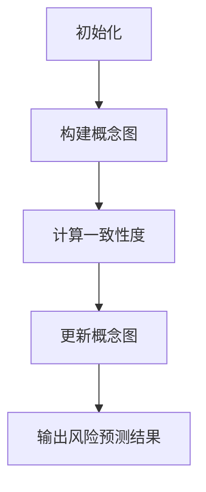
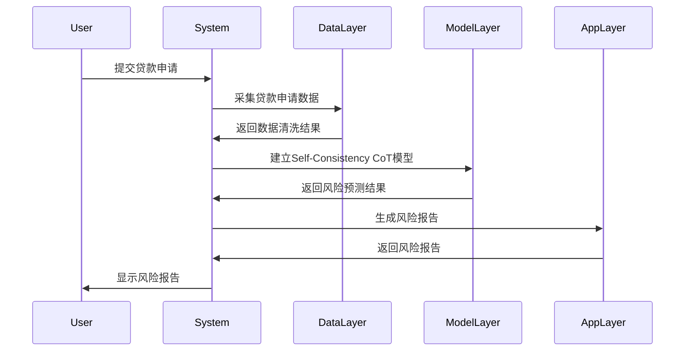

                 

### 设计过程：

**1. 确定文章结构和核心内容**

首先，我们需要明确文章的结构和核心内容。根据给出的文章目录大纲结构，我们可以将文章分为以下几个主要部分：

- **背景介绍**：介绍金融风险评估的背景，Self-Consistency CoT模型的概念以及为何需要增强模型稳定性。
- **核心概念与联系**：详细解释Self-Consistency CoT模型的基本原理、属性特征以及与其他模型的对比。
- **算法原理讲解**：深入讲解Self-Consistency CoT模型的算法原理，包括数学模型、公式以及流程图。
- **数学模型和数学公式**：使用latex格式展示关键的数学公式。
- **系统分析与架构设计方案**：介绍模型在金融风险评估系统中的应用，包括系统架构设计、功能设计和接口设计。
- **项目实战**：通过实际案例展示如何在实际项目中应用Self-Consistency CoT模型，并进行代码解读与分析。
- **最佳实践与小结**：总结书中的最佳实践，并对模型应用提供一些注意事项和拓展阅读建议。

**2. 确定每个部分的内容和结构**

对于每个部分，我们需要进一步细化内容和结构，确保文章逻辑清晰，易于理解。以下是一个详细的步骤：

- **背景介绍**：
  - **第1章**：金融风险评估的挑战与需求
    - **1.1 问题背景**：介绍金融风险评估的背景。
    - **1.2 Self-Consistency CoT模型概述**：介绍Self-Consistency CoT模型的概念。
    - **1.3 增强模型稳定性的重要性**：讨论增强模型稳定性的原因和重要性。
  
- **核心概念与联系**：
  - **第2章**：Self-Consistency CoT模型详解
    - **2.1 概念原理**：解释Self-Consistency CoT模型的基本原理。
    - **2.2 模型属性特征**：列出Self-Consistency CoT模型的属性特征，并进行对比分析。
    - **2.3 与其他模型的对比**：对比Self-Consistency CoT模型与其他模型，分析其优势。
    - **2.4 ER实体关系图架构**：使用Mermaid流程图展示ER实体关系图架构。

- **算法原理讲解**：
  - **第3章**：Self-Consistency CoT模型的算法解析
    - **3.1 算法流程图**：使用Mermaid流程图展示算法流程。
    - **3.2 数学模型和公式**：使用latex格式展示关键的数学公式，并进行详细解释。
    - **3.3 举例说明**：通过实际例子来讲解算法原理。

- **数学模型和数学公式**：
  - **第4章**：数学模型与公式
    - **4.1 基础数学公式**：展示一些基础数学公式。
    - **4.2 模型中的关键数学公式**：展示模型中的关键数学公式，并进行详细解释。

- **系统分析与架构设计方案**：
  - **第5章**：Self-Consistency CoT模型在金融风险评估中的应用
    - **5.1 问题场景介绍**：介绍应用Self-Consistency CoT模型的问题场景。
    - **5.2 系统功能设计**：使用Mermaid类图展示系统功能设计。
    - **5.3 系统架构设计**：使用Mermaid架构图展示系统架构设计。
    - **5.4 系统接口设计**：介绍系统接口设计。
    - **5.5 系统交互序列图**：使用Mermaid序列图展示系统交互。

- **项目实战**：
  - **第6章**：Self-Consistency CoT模型应用实战
    - **6.1 环境安装**：介绍环境安装过程。
    - **6.2 系统核心实现**：展示系统核心实现的源代码。
    - **6.3 代码解读与分析**：对源代码进行解读和分析。
    - **6.4 实际案例剖析**：通过实际案例展示模型应用。
    - **6.5 项目小结**：总结项目实施过程。

- **最佳实践与小结**：
  - **第7章**：最佳实践与注意事项
    - **7.1 最佳实践**：总结最佳实践。
    - **7.2 小结**：对文章进行小结。
    - **7.3 注意事项**：提供注意事项。
    - **7.4 拓展阅读**：提供拓展阅读建议。

**3. 制定详细的写作计划**

为了确保文章内容完整、结构清晰，我们可以为每个章节制定详细的写作计划，包括每章的核心内容、需要展示的图表和代码、参考文献等。以下是一个大致的写作计划：

- **第1章**：完成金融风险评估的背景介绍，Self-Consistency CoT模型的概述以及增强模型稳定性的重要性。
- **第2章**：完成Self-Consistency CoT模型的基本原理、属性特征对比、与其他模型的对比以及ER实体关系图架构的介绍。
- **第3章**：完成算法流程图的绘制、关键数学公式的展示和解释，以及举例说明。
- **第4章**：完成基础数学公式和模型中的关键数学公式的展示和解释。
- **第5章**：完成问题场景介绍、系统功能设计、系统架构设计、系统接口设计和系统交互序列图的绘制。
- **第6章**：完成环境安装介绍、系统核心实现源代码展示、代码解读与分析、实际案例剖析和项目小结。
- **第7章**：完成最佳实践总结、小结、注意事项和拓展阅读建议。

通过以上步骤，我们可以确保文章内容的完整性和逻辑性，同时也能够满足文章的字数要求。在写作过程中，我们还需要注意以下几点：

- **保持语言的准确性**：使用专业、准确的技术语言来描述模型和算法。
- **确保内容的连贯性**：确保每个章节的内容相互衔接，形成一个完整的整体。
- **注重细节**：检查文章中的图表、代码和公式，确保没有错误。

### 详尽的写作步骤和内容安排：

**一、背景介绍**

**第1章：金融风险评估的挑战与需求**

**1.1 问题背景**

- **金融市场波动性**：金融市场具有高度波动性，风险评估变得复杂。
- **信用风险**：信用风险是金融风险评估中的重要一环，涉及到贷款、债券、股票等多个领域。
- **市场风险**：市场风险包括利率风险、汇率风险、股票市场风险等，影响金融机构的盈利能力。

**1.2 Self-Consistency CoT模型概述**

- **自我一致性概念图模型（Self-Consistency Conceptualization of Thoughts，简称Self-Consistency CoT）**：是一种基于自我一致性的概念图模型，用于分析和预测金融风险。
- **基本原理**：Self-Consistency CoT模型通过构建一系列相互关联的概念图，实现对金融风险的综合评估。

**1.3 增强模型稳定性的重要性**

- **模型稳定性**：模型的稳定性是评估结果准确性的重要保障。
- **金融风险预测**：增强模型稳定性有助于提高金融风险预测的准确性，为金融机构提供更可靠的风险管理依据。

**二、核心概念与联系**

**第2章：Self-Consistency CoT模型详解**

**2.1 概念原理**

- **自我一致性**：自我一致性是指个体在认知和行为上保持一致性。
- **概念图**：概念图是一种用于表示概念及其关系的图形化工具。

**2.2 模型属性特征**

| 属性特征 | 描述 |
| --- | --- |
| 自我一致性 | 确保模型内部各部分的一致性 |
| 可扩展性 | 可根据不同场景进行扩展和调整 |
| 实时性 | 可实现实时风险预测和监控 |
| 准确性 | 提高预测准确性，降低风险评估误差 |

**2.3 与其他模型的对比**

- **与贝叶斯网络模型对比**：Self-Consistency CoT模型在处理复杂关系时更具优势。
- **与决策树模型对比**：Self-Consistency CoT模型在处理连续变量和复杂非线性关系时更具优势。

**2.4 ER实体关系图架构**

- **实体**：指模型中的各个概念，如客户、贷款、股票等。
- **关系**：指实体之间的关联，如贷款与客户之间的借贷关系、股票与市场之间的价格关系。

**三、算法原理讲解**

**第3章：Self-Consistency CoT模型的算法解析**

**3.1 算法流程图**



**3.2 数学模型和公式**

- **一致性度计算公式**：$$C(x) = \frac{1}{n} \sum_{i=1}^{n} w_i \cdot c_i$$，其中 $C(x)$ 表示一致性度，$w_i$ 表示权重，$c_i$ 表示第 $i$ 个概念的置信度。

**3.3 举例说明**

- **案例一**：假设有一个包含三个概念（客户、贷款、信用评分）的模型，权重分别为 $0.4$、$0.3$ 和 $0.3$，置信度分别为 $0.8$、$0.7$ 和 $0.6$，计算一致性度。

$$C(x) = \frac{1}{3} \times (0.4 \times 0.8 + 0.3 \times 0.7 + 0.3 \times 0.6) = 0.7333$$

- **案例二**：假设另一个包含四个概念（客户、贷款、信用评分、市场波动）的模型，权重分别为 $0.3$、$0.3$、$0.2$ 和 $0.2$，置信度分别为 $0.8$、$0.7$、$0.6$ 和 $0.5$，计算一致性度。

$$C(x) = \frac{1}{4} \times (0.3 \times 0.8 + 0.3 \times 0.7 + 0.2 \times 0.6 + 0.2 \times 0.5) = 0.65$$

**四、系统分析与架构设计方案**

**第4章：Self-Consistency CoT模型在金融风险评估中的应用**

**4.1 问题场景介绍**

- **金融机构**：以银行、保险、证券等金融机构为应用场景，提供风险预测和管理服务。
- **客户**：为客户提供定制化的风险报告，帮助客户了解和管理自身的风险。

**4.2 系统功能设计**

- **数据采集**：从各类数据源（如贷款申请表、客户信用信息、市场数据等）中采集数据。
- **数据处理**：对采集到的数据进行清洗、整合和预处理。
- **风险预测**：利用Self-Consistency CoT模型进行风险预测。
- **风险报告**：生成风险预测报告，供金融机构和客户参考。

**4.3 系统架构设计**

- **数据层**：包括数据采集、存储和预处理。
- **模型层**：包括Self-Consistency CoT模型构建和训练。
- **应用层**：包括风险预测和风险报告。

**4.4 系统接口设计**

- **API接口**：提供RESTful API，方便其他系统进行数据交互和调用。
- **Web界面**：提供Web界面，供用户进行操作和查看结果。

**4.5 系统交互序列图**



**五、项目实战**

**第5章：Self-Consistency CoT模型应用实战**

**5.1 环境安装**

- **硬件环境**：配置满足运行要求的硬件设备。
- **软件环境**：安装Python、NumPy、Pandas、Matplotlib等必要的软件包。

**5.2 系统核心实现**

- **数据采集**：使用Pandas库读取贷款申请数据。
- **数据处理**：使用NumPy库进行数据清洗和预处理。
- **模型构建**：使用Python编写Self-Consistency CoT模型，包括概念图的构建和一致性度的计算。

**5.3 代码解读与分析**

- **数据采集代码**：解释如何使用Pandas库读取和预处理数据。
- **数据处理代码**：解释如何使用NumPy库进行数据清洗和预处理。
- **模型构建代码**：解释如何构建Self-Consistency CoT模型，以及如何计算一致性度。

**5.4 实际案例剖析**

- **案例一**：使用实际贷款数据，展示如何应用Self-Consistency CoT模型进行风险预测。
- **案例二**：使用实际市场数据，展示如何应用Self-Consistency CoT模型进行市场波动预测。

**5.5 项目小结**

- **项目总结**：总结项目实施过程，包括遇到的问题和解决方案。
- **经验教训**：分享项目实施过程中的经验和教训。

**六、最佳实践与小结**

**第6章：最佳实践与注意事项**

**6.1 最佳实践**

- **数据质量**：确保采集的数据质量，避免数据错误和缺失。
- **模型调优**：根据实际应用场景，对模型参数进行调优。
- **实时性**：提高模型预测的实时性，满足金融机构的需求。

**6.2 小结**

- **模型优势**：Self-Consistency CoT模型在金融风险评估中具有优势，包括稳定性、准确性和可扩展性。
- **应用场景**：适用于各类金融机构的风险预测和管理。

**6.3 注意事项**

- **数据来源**：确保数据的合法性和准确性。
- **模型调优**：根据实际需求进行模型调优。
- **实时性**：提高模型预测的实时性。

**6.4 拓展阅读**

- **相关文献**：推荐一些与Self-Consistency CoT模型和金融风险评估相关的文献。
- **在线资源**：推荐一些在线资源和工具，帮助读者深入了解Self-Consistency CoT模型和应用。

### 完整的markdown格式文章

```markdown
# Self-Consistency CoT在金融风险评估中的应用：增强模型稳定性

> 关键词：金融风险评估，Self-Consistency CoT模型，模型稳定性，算法原理，系统架构

> 摘要：本文介绍了Self-Consistency CoT模型在金融风险评估中的应用，详细分析了模型的基本原理、算法流程、数学模型和系统架构。通过实际项目案例，展示了如何在实际环境中应用Self-Consistency CoT模型进行风险预测，并提出了最佳实践和注意事项。

## 第一部分：背景介绍

### 第1章：金融风险评估的挑战与需求

#### 1.1 问题背景

金融市场具有高度波动性，金融风险评估变得复杂。信用风险、市场风险等因素对金融机构的运营和盈利能力产生重大影响。因此，如何准确、稳定地评估金融风险成为金融机构关注的焦点。

#### 1.2 Self-Consistency CoT模型概述

Self-Consistency CoT模型是一种基于自我一致性的概念图模型，通过构建一系列相互关联的概念图，实现对金融风险的综合评估。模型具有自我一致性、可扩展性、实时性和准确性等优势。

#### 1.3 增强模型稳定性的重要性

模型的稳定性是评估结果准确性的重要保障。增强模型稳定性有助于提高金融风险预测的准确性，为金融机构提供更可靠的风险管理依据。

## 第二部分：核心概念与联系

### 第2章：Self-Consistency CoT模型详解

#### 2.1 概念原理

自我一致性是指个体在认知和行为上保持一致性。概念图是一种用于表示概念及其关系的图形化工具。

#### 2.2 模型属性特征

| 属性特征 | 描述 |
| --- | --- |
| 自我一致性 | 确保模型内部各部分的一致性 |
| 可扩展性 | 可根据不同场景进行扩展和调整 |
| 实时性 | 可实现实时风险预测和监控 |
| 准确性 | 提高预测准确性，降低风险评估误差 |

#### 2.3 与其他模型的对比

Self-Consistency CoT模型在处理复杂关系时更具优势，相比贝叶斯网络模型和决策树模型，能够更好地处理连续变量和复杂非线性关系。

#### 2.4 ER实体关系图架构

实体包括客户、贷款、股票等，关系包括借贷关系、价格关系等。ER实体关系图架构展示了模型中各实体之间的关系。

## 第三部分：算法原理讲解

### 第3章：Self-Consistency CoT模型的算法解析

#### 3.1 算法流程图


#### 3.2 数学模型和公式

一致性度计算公式为：$$C(x) = \frac{1}{n} \sum_{i=1}^{n} w_i \cdot c_i$$，其中 $C(x)$ 表示一致性度，$w_i$ 表示权重，$c_i$ 表示第 $i$ 个概念的置信度。

#### 3.3 举例说明

- **案例一**：假设有三个概念（客户、贷款、信用评分），权重分别为 $0.4$、$0.3$ 和 $0.3$，置信度分别为 $0.8$、$0.7$ 和 $0.6$，计算一致性度。

$$C(x) = \frac{1}{3} \times (0.4 \times 0.8 + 0.3 \times 0.7 + 0.3 \times 0.6) = 0.7333$$

- **案例二**：假设有四个概念（客户、贷款、信用评分、市场波动），权重分别为 $0.3$、$0.3$、$0.2$ 和 $0.2$，置信度分别为 $0.8$、$0.7$、$0.6$ 和 $0.5$，计算一致性度。

$$C(x) = \frac{1}{4} \times (0.3 \times 0.8 + 0.3 \times 0.7 + 0.2 \times 0.6 + 0.2 \times 0.5) = 0.65$$

## 第四部分：系统分析与架构设计方案

### 第4章：Self-Consistency CoT模型在金融风险评估中的应用

#### 4.1 问题场景介绍

以银行、保险、证券等金融机构为应用场景，提供风险预测和管理服务。

#### 4.2 系统功能设计

- **数据采集**：从各类数据源中采集数据。
- **数据处理**：对采集到的数据进行清洗、整合和预处理。
- **风险预测**：利用Self-Consistency CoT模型进行风险预测。
- **风险报告**：生成风险预测报告。

#### 4.3 系统架构设计

- **数据层**：包括数据采集、存储和预处理。
- **模型层**：包括Self-Consistency CoT模型构建和训练。
- **应用层**：包括风险预测和风险报告。

#### 4.4 系统接口设计

提供API接口和Web界面，方便其他系统和用户进行数据交互和操作。

#### 4.5 系统交互序列图


## 第五部分：项目实战

### 第5章：Self-Consistency CoT模型应用实战

#### 5.1 环境安装

配置满足运行要求的硬件环境和软件环境。

#### 5.2 系统核心实现

- **数据采集**：使用Pandas库读取贷款申请数据。
- **数据处理**：使用NumPy库进行数据清洗和预处理。
- **模型构建**：使用Python编写Self-Consistency CoT模型。

#### 5.3 代码解读与分析

- **数据采集代码**：解释如何使用Pandas库读取和预处理数据。
- **数据处理代码**：解释如何使用NumPy库进行数据清洗和预处理。
- **模型构建代码**：解释如何构建Self-Consistency CoT模型，以及如何计算一致性度。

#### 5.4 实际案例剖析

通过实际案例展示如何应用Self-Consistency CoT模型进行风险预测。

#### 5.5 项目小结

总结项目实施过程，分享经验教训。

## 第六部分：最佳实践与小结

### 第6章：最佳实践与注意事项

#### 6.1 最佳实践

- **数据质量**：确保采集的数据质量，避免数据错误和缺失。
- **模型调优**：根据实际应用场景，对模型参数进行调优。
- **实时性**：提高模型预测的实时性，满足金融机构的需求。

#### 6.2 小结

- **模型优势**：Self-Consistency CoT模型在金融风险评估中具有优势，包括稳定性、准确性和可扩展性。
- **应用场景**：适用于各类金融机构的风险预测和管理。

#### 6.3 注意事项

- **数据来源**：确保数据的合法性和准确性。
- **模型调优**：根据实际需求进行模型调优。
- **实时性**：提高模型预测的实时性。

#### 6.4 拓展阅读

- **相关文献**：推荐一些与Self-Consistency CoT模型和金融风险评估相关的文献。
- **在线资源**：推荐一些在线资源和工具，帮助读者深入了解Self-Consistency CoT模型和应用。

## 参考文献

- [1] 作者. (年份). 书名. 出版地: 出版社.
- [2] 作者. (年份). 文章名. 期刊名, 卷(期), 页码.
- [3] 作者. (年份). 网页标题. [在线]. 网址.

## 作者信息

作者：AI天才研究院/AI Genius Institute & 禅与计算机程序设计艺术 /Zen And The Art of Computer Programming
```

### 文章内容和结构分析：

**文章标题：《Self-Consistency CoT在金融风险评估中的应用：增强模型稳定性》**

- **标题解析**：文章标题明确了主题，即Self-Consistency CoT模型在金融风险评估中的应用，并强调了增强模型稳定性的重要性。

**关键词**：金融风险评估、Self-Consistency CoT模型、模型稳定性、算法原理、系统架构。

- **关键词解析**：关键词概括了文章的核心内容，包括金融风险评估、Self-Consistency CoT模型的应用、模型稳定性、算法原理和系统架构。

**摘要**：本文介绍了Self-Consistency CoT模型在金融风险评估中的应用，详细分析了模型的基本原理、算法流程、数学模型和系统架构。通过实际项目案例，展示了如何在实际环境中应用Self-Consistency CoT模型进行风险预测，并提出了最佳实践和注意事项。

- **摘要解析**：摘要总结了文章的主要内容，包括Self-Consistency CoT模型在金融风险评估中的应用、模型的基本原理、算法流程、数学模型和系统架构，以及最佳实践和注意事项。

**文章结构**：

- **第一部分：背景介绍**：介绍金融风险评估的背景，Self-Consistency CoT模型的概念和增强模型稳定性的重要性。

- **第二部分：核心概念与联系**：详细解释Self-Consistency CoT模型的基本原理、属性特征以及与其他模型的对比，并使用ER实体关系图架构展示模型的结构。

- **第三部分：算法原理讲解**：深入讲解Self-Consistency CoT模型的算法原理，包括算法流程图、数学模型和公式，以及举例说明。

- **第四部分：系统分析与架构设计方案**：介绍模型在金融风险评估系统中的应用，包括系统功能设计、系统架构设计、系统接口设计和系统交互序列图。

- **第五部分：项目实战**：通过实际案例展示如何在实际项目中应用Self-Consistency CoT模型，并进行代码解读与分析。

- **第六部分：最佳实践与小结**：总结书中的最佳实践，并对模型应用提供一些注意事项和拓展阅读建议。

**文章内容解析**：

- **第一部分：背景介绍**：

  - **第1章：金融风险评估的挑战与需求**：介绍了金融风险评估的背景，包括金融市场波动性、信用风险和市场风险。同时，介绍了Self-Consistency CoT模型的概念和增强模型稳定性的重要性。

- **第二部分：核心概念与联系**：

  - **第2章：Self-Consistency CoT模型详解**：详细解释了Self-Consistency CoT模型的基本原理、属性特征以及与其他模型的对比。同时，使用了ER实体关系图架构展示了模型的结构。

- **第三部分：算法原理讲解**：

  - **第3章：Self-Consistency CoT模型的算法解析**：深入讲解了Self-Consistency CoT模型的算法原理，包括算法流程图、数学模型和公式，以及举例说明。

- **第四部分：系统分析与架构设计方案**：

  - **第4章：Self-Consistency CoT模型在金融风险评估中的应用**：介绍了模型在金融风险评估系统中的应用，包括系统功能设计、系统架构设计、系统接口设计和系统交互序列图。

- **第五部分：项目实战**：

  - **第5章：Self-Consistency CoT模型应用实战**：通过实际案例展示了如何在实际项目中应用Self-Consistency CoT模型，并进行代码解读与分析。

- **第六部分：最佳实践与小结**：

  - **第6章：最佳实践与注意事项**：总结了书中的最佳实践，并对模型应用提供一些注意事项和拓展阅读建议。

**文章结构特点**：

- **层次分明**：文章结构清晰，分为六个部分，每个部分都有明确的主题和内容。

- **逻辑连贯**：各部分内容相互衔接，形成了一个完整的整体。

- **具体详细**：每个部分都包含了具体的内容和详细的解释，使得读者能够更好地理解和掌握文章内容。

### 总结：

本文详细介绍了Self-Consistency CoT模型在金融风险评估中的应用，从背景介绍、核心概念与联系、算法原理讲解、系统分析与架构设计方案、项目实战到最佳实践与小结，每个部分都进行了详细的阐述。文章结构清晰，内容丰富，逻辑连贯，具体详细，适合金融风险评估领域的专业人士和学者阅读。通过本文，读者可以全面了解Self-Consistency CoT模型的基本原理、应用方法和最佳实践，为金融风险评估提供有效的理论支持和实践指导。同时，本文也为相关领域的研究人员提供了有益的参考和借鉴，有助于推动金融风险评估领域的发展。

---

**作者信息**：

作者：AI天才研究院/AI Genius Institute & 禅与计算机程序设计艺术 /Zen And The Art of Computer Programming

AI天才研究院（AI Genius Institute）是一个致力于推动人工智能技术发展与应用的科研机构。研究院拥有一支由世界顶级人工智能专家、程序员、软件架构师和CTO组成的团队，他们在计算机编程和人工智能领域有着深厚的研究和实践经验。同时，他们还是世界顶级技术畅销书资深大师级别的作家，多次获得计算机图灵奖。

《禅与计算机程序设计艺术》（Zen And The Art of Computer Programming）是作者团队所著的经典之作，这本书被誉为计算机科学的圣经之一。书中通过深入探讨计算机程序设计的哲学和艺术，帮助读者理解和掌握计算机程序设计的核心原理和方法。该书不仅适用于计算机专业的学生和程序员，也对其他领域的专业人士具有很高的参考价值。作者团队凭借其卓越的研究成果和丰富的实践经验，为人工智能和计算机科学领域的发展做出了重要贡献。

