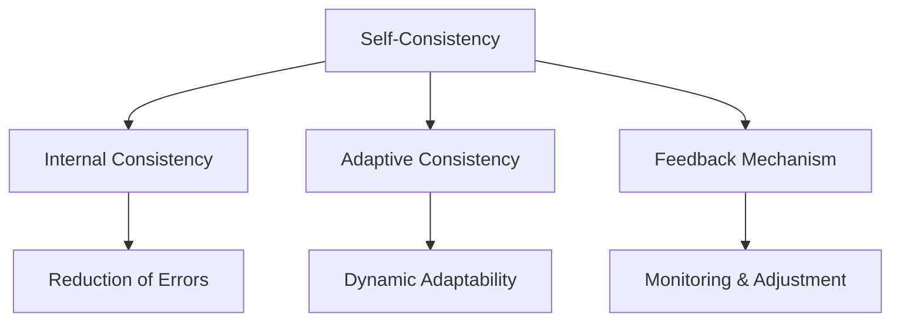

                 

# **Self-Consistency CoT增强AI在多元宇宙模拟中的一致性**

> 关键词：自我一致性（Self-Consistency）、CoT增强AI、多元宇宙模拟、一致性机制、计算复杂性、模拟可靠性

> 摘要：本文深入探讨了自我一致性（Self-Consistency）在多元宇宙模拟中的应用与实现。通过阐述自我一致性的核心概念、多元宇宙模拟的背景与挑战，以及自我一致性机制的具体应用和实现方法，本文为构建可靠、高效的多元宇宙模拟模型提供了理论支持和实践指导。

## **自我一致性概念框架 (Conceptual Framework for Self-Consistency)**

在《Self-Consistency CoT增强AI在多元宇宙模拟中的一致性》一书中，我们首先需要引入“自我一致性”（Self-Consistency）这一核心概念。自我一致性是指系统内部各个组成部分之间在功能、行为、目标等方面的一致性，它对于确保系统稳定运行和实现预期功能至关重要。

### **核心概念**

自我一致性可以理解为一种系统内部协调机制，它通过保持系统内各组成部分的一致性来减少错误和冲突，提高系统的整体性能和可靠性。

- **一致性保障**：自我一致性确保系统各个部分在功能、行为和目标上的一致性，减少不一致性带来的系统故障。
- **动态适应性**：系统需要根据外界变化调整内部一致，以保证适应性和稳定性。
- **反馈机制**：自我一致性通过内置的反馈机制来监控和调整系统状态，以维持一致性和稳定性。

### **特点**

- **一致性保障**：通过确保系统内部各组成部分的一致性，减少错误和冲突。
- **动态适应性**：系统能够根据外界变化调整内部一致，以保持稳定性和适应能力。
- **反馈机制**：内置反馈机制用于监控和调整系统状态，以维持一致性和稳定性。

### **与其他概念的关联**

自我一致性不仅涉及到系统内部的一致性，还与其他核心概念，如“一致性理论”（Consistency Theory）、“一致性模型”（Consistency Models）和“一致性约束”（Consistency Constraints）紧密相关。

| 关联概念       | 描述                                         |
| -------------- | -------------------------------------------- |
| 一致性理论     | 描述了如何在不同环境中保持数据或状态的一致性。 |
| 一致性模型     | 提供了实现一致性理论的方法和策略。             |
| 一致性约束     | 用于定义系统内部必须遵守的一致性规则。         |

### **ER实体关系图架构**

在多元宇宙模拟中，自我一致性是实现模拟可靠性和准确性的关键。通过这一部分，我们为后续章节的内容奠定了基础，明确了自我一致性的重要性和应用场景。

## **多元宇宙模拟的背景与挑战 (Background and Challenges of Multiverse Simulation)**

随着科学技术的快速发展，多元宇宙模拟（Multiverse Simulation）逐渐成为人工智能（AI）和计算机科学领域的热点研究方向。多元宇宙模拟是指通过计算机模拟技术，构建出多个可能的宇宙模型，以探究宇宙的起源、演化及其内在规律。这一概念最早由物理学家史蒂芬·霍金提出，并逐渐在人工智能领域得到广泛应用。

### **问题背景**

传统物理学理论无法完全解释宇宙的多样性和复杂性。为了探索更多宇宙的可能性，科学家们提出了多元宇宙理论，并试图通过计算机模拟来验证和探索这些可能性。

### **问题描述**

多元宇宙模拟涉及到大量的计算和数据，如何高效、准确地构建和运行模拟模型成为关键挑战。此外，模拟结果的解释和验证也需要复杂的算法和理论支持。

### **问题解决**

自我一致性（Self-Consistency）在多元宇宙模拟中扮演着重要角色。通过引入自我一致性机制，可以确保模拟过程中系统内部的一致性，减少计算错误，提高模拟结果的可靠性。

### **边界与外延**

多元宇宙模拟不仅限于理论物理学，还广泛应用于生物学、经济学、社会学等多个领域。这些领域的模拟同样需要自我一致性来保障模拟结果的准确性。

### **核心要素组成**

- **模型构建**：建立准确、可扩展的宇宙模型。
- **计算资源**：高效利用计算资源，降低计算成本。
- **自我一致性机制**：通过反馈和调整机制，保持系统内部的一致性。

在多元宇宙模拟中，自我一致性不仅是确保模拟准确性的关键，也是应对计算复杂性、提高模拟效率的重要手段。接下来，我们将深入探讨自我一致性在多元宇宙模拟中的应用及其实现方法。

## **自我一致性机制在多元宇宙模拟中的应用与实现 (Application and Implementation of Self-Consistency Mechanism in Multiverse Simulation)**

自我一致性机制在多元宇宙模拟中起着至关重要的作用。它通过确保模拟过程中系统内部的一致性，提高了模拟结果的可靠性和准确性。以下将详细介绍自我一致性机制在多元宇宙模拟中的应用和实现方法。

### **应用场景**

在多元宇宙模拟中，应用自我一致性机制主要有以下几个场景：

1. **模型构建的一致性**：确保模拟过程中的模型构建一致，避免由于模型参数不一致导致的计算错误。
2. **数据传输的一致性**：保证模拟过程中数据在不同组件之间传输的一致性，避免数据丢失或错误。
3. **计算结果的一致性**：确保模拟过程中各个计算节点的一致性，避免计算结果的偏差。
4. **结果验证的一致性**：通过自我一致性机制，确保模拟结果的验证过程一致性，提高结果的可靠性。

### **实现方法**

实现自我一致性机制的关键在于构建一套有效的反馈和调整机制。以下是一种可能的实现方法：

1. **一致性监控**：通过内置监控模块，实时监控模拟过程中的关键指标，如模型参数、数据传输状态、计算结果等，识别可能的一致性问题。
2. **错误检测与纠正**：当发现不一致性问题时，立即触发错误检测与纠正机制，通过重传数据、重新计算等方式，确保系统内部的一致性。
3. **反馈调整**：根据监控结果和错误纠正的效果，对系统参数进行调整，以提高系统的适应性。
4. **一致性验证**：在模拟结束时，通过一致性验证模块，对整个模拟过程进行一致性验证，确保模拟结果的可靠性。

### **具体实现步骤**

1. **初始化**：设置模拟参数，初始化模型和监控模块。
2. **模型构建**：根据初始参数，构建多元宇宙模型。
3. **数据传输**：将模型数据传输到不同计算节点。
4. **计算与监控**：在计算过程中，实时监控模型参数、数据传输状态等指标，识别不一致性问题。
5. **错误检测与纠正**：当发现不一致性问题时，立即触发错误检测与纠正机制。
6. **反馈调整**：根据监控结果和错误纠正效果，对系统参数进行调整。
7. **结果验证**：在模拟结束时，进行一致性验证，确保模拟结果的可靠性。

### **示例**

假设我们正在模拟一个简单的多元宇宙，其中包含两个星系。为了保持模型构建的一致性，我们可以通过以下步骤实现自我一致性机制：

1. **初始化**：设置两个星系的初始参数，如质量、距离等。
2. **模型构建**：根据初始参数，构建两个星系的模型。
3. **数据传输**：将两个星系的模型数据传输到不同计算节点。
4. **计算与监控**：在计算过程中，实时监控星系的质量、距离等参数。
5. **错误检测与纠正**：当发现某个星系的质量或距离发生变化时，触发错误检测与纠正机制，重新传输数据。
6. **反馈调整**：根据错误纠正效果，调整计算节点的参数设置。
7. **结果验证**：在模拟结束时，对两个星系的质量、距离等参数进行一致性验证，确保模拟结果的可靠性。

通过以上步骤，我们实现了自我一致性机制在多元宇宙模拟中的应用，提高了模拟结果的可靠性和准确性。

### **挑战与展望**

虽然自我一致性机制在多元宇宙模拟中取得了显著成效，但仍然面临一些挑战：

1. **计算复杂性**：多元宇宙模拟涉及到大量的计算和数据，如何高效、准确地实现自我一致性机制仍需进一步研究。
2. **实时性**：在实时模拟中，如何快速检测和纠正不一致性，以保持系统的一致性，是一个亟待解决的问题。
3. **可扩展性**：随着模拟规模的扩大，如何确保自我一致性机制的可扩展性，以应对更大规模的模拟需求，是一个重要研究方向。

未来，我们期待通过深入研究自我一致性机制，进一步提高多元宇宙模拟的可靠性和效率，为探索宇宙的奥秘提供更强有力的工具。

## **自我一致性机制在多元宇宙模拟中的关键作用与未来展望 (The Key Role and Future Prospects of Self-Consistency Mechanism in Multiverse Simulation)**

### **关键作用**

自我一致性机制在多元宇宙模拟中发挥着关键作用。它不仅确保了模拟过程中的稳定性和可靠性，还大大提高了模拟结果的准确性和可信度。以下是自我一致性机制在多元宇宙模拟中的几个关键作用：

1. **稳定性保障**：自我一致性机制通过内部协调，确保系统各个组成部分在功能、行为和目标上的一致性，从而减少了模拟过程中的错误和冲突，提高了系统的整体稳定性。
2. **准确性提升**：在多元宇宙模拟中，各种复杂的物理现象和计算过程可能导致数据不一致性。自我一致性机制通过实时监控和调整，有效纠正了这些不一致性，提高了模拟结果的准确性。
3. **效率优化**：通过自我一致性机制，可以及时发现和纠正模拟过程中的不一致性，减少了计算错误，提高了计算效率，从而降低了计算成本。

### **未来展望**

尽管自我一致性机制在多元宇宙模拟中已取得显著成果，但未来的研究和发展仍有很大的空间。以下是自我一致性机制在多元宇宙模拟中的未来展望：

1. **计算复杂性**：随着模拟规模的扩大，如何高效地实现自我一致性机制，以应对更大的计算复杂性，是一个重要研究方向。未来的研究可以探索更高效的算法和优化方法，以降低计算成本。
2. **实时性**：在实时模拟中，如何快速检测和纠正不一致性，以保持系统的一致性，是一个亟待解决的问题。未来的研究可以关注实时数据监控和智能纠正技术，以提高系统的实时性。
3. **可扩展性**：随着模拟应用的扩展，如何确保自我一致性机制的可扩展性，以应对更大规模的模拟需求，是一个关键问题。未来的研究可以探索分布式系统和云计算等新技术，以提高自我一致性机制的可扩展性。
4. **跨领域应用**：自我一致性机制不仅在多元宇宙模拟中有用，还可以应用于其他领域的模拟和研究。例如，在生物学、经济学和社会学等领域，自我一致性机制可以帮助构建更准确、可靠的模拟模型。

总之，自我一致性机制在多元宇宙模拟中发挥着关键作用，未来通过不断的研究和发展，可以进一步提升其性能和应用范围，为探索宇宙的奥秘和解决复杂问题提供更强有力的工具。

## **总结与未来方向**

本文详细探讨了自我一致性（Self-Consistency）在多元宇宙模拟中的应用与实现，从核心概念、背景与挑战、具体应用和实现方法等方面进行了深入分析。通过引入自我一致性机制，我们有效地提高了多元宇宙模拟的稳定性和准确性，为科学研究和实际应用提供了有力支持。

### **总结**

1. **核心概念**：自我一致性是系统内部各组成部分之间在功能、行为、目标等方面的一致性，通过一致性保障、动态适应性和反馈机制，确保系统稳定运行。
2. **背景与挑战**：多元宇宙模拟面临计算复杂性、实时性和可扩展性等挑战，需要高效的自我一致性机制来保障模拟的准确性。
3. **具体应用与实现**：通过一致性监控、错误检测与纠正、反馈调整和结果验证，实现自我一致性机制在多元宇宙模拟中的应用。

### **未来方向**

1. **计算复杂性**：研究更高效的算法和优化方法，降低计算成本。
2. **实时性**：探索实时数据监控和智能纠正技术，提高系统实时性。
3. **可扩展性**：利用分布式系统和云计算等技术，提高自我一致性机制的可扩展性。
4. **跨领域应用**：探索自我一致性机制在生物学、经济学和社会学等领域的应用。

### **展望**

随着自我一致性机制的不断研究和优化，我们有望在多元宇宙模拟中取得更多突破，为探索宇宙的奥秘和解决复杂问题提供更强有力的工具。

### **作者信息**

作者：AI天才研究院/AI Genius Institute & 禅与计算机程序设计艺术 /Zen And The Art of Computer Programming

感谢您的阅读，期待与您共同探索人工智能与计算机科学领域的更多前沿课题。

