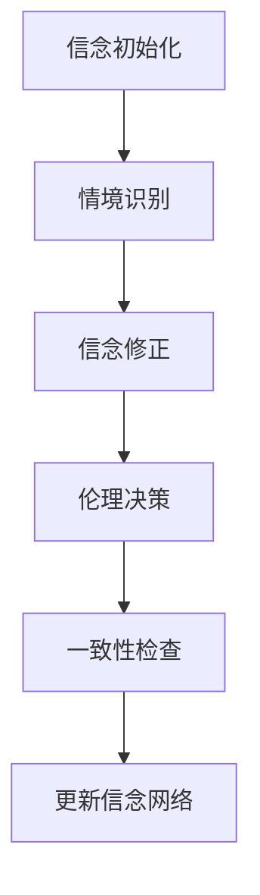

                 

# Self-Consistency CoT Enhanced AI in Multiverse Ethical Decision-Making

> 关键词：自我一致性，多宇宙伦理，增强AI，算法，数学模型

> 摘要：本文深入探讨了自我一致性概念在多宇宙伦理决策中的应用，通过自我一致性（Self-Consistency CoT）增强人工智能（AI），构建了一种新的伦理决策框架。文章首先介绍了自我一致性和多宇宙伦理的基本概念，随后详细分析了自我一致性在AI中的机制和作用。在此基础上，文章提出了一种基于自我一致性多宇宙伦理决策的算法设计，并利用数学模型进行了理论解释。随后，文章讨论了系统架构设计以及项目实战案例，最终总结了最佳实践和未来研究方向。

## 引言

在人工智能（AI）迅猛发展的今天，伦理问题日益突出。特别是在多宇宙（Multiverse）理论逐渐受到关注的时代，传统的伦理决策框架面临巨大挑战。多宇宙理论认为，我们的宇宙只是众多可能宇宙中的一种，因此，任何决策都可能影响无数可能的宇宙。在这种背景下，传统的基于单一宇宙的伦理决策方法显得过于狭隘，难以应对复杂的伦理困境。

自我一致性（Self-Consistency）作为一种新兴的AI增强技术，其在多宇宙伦理决策中的应用具有巨大潜力。自我一致性旨在使AI系统能够在复杂环境中保持一致性，避免因环境变化而导致的行为不一致。通过引入自我一致性机制，AI可以在多宇宙的背景下进行更稳健的伦理决策。

本文旨在探讨自我一致性在多宇宙伦理决策中的应用，构建一种新的AI伦理决策框架。文章首先介绍自我一致性和多宇宙伦理的基本概念，随后详细分析自我一致性在AI中的机制和作用。在此基础上，文章提出了一种基于自我一致性的多宇宙伦理决策算法设计，并利用数学模型进行了理论解释。随后，文章讨论了系统架构设计以及项目实战案例，最终总结了最佳实践和未来研究方向。

## 自我一致性（Self-Consistency CoT）的基本概念

自我一致性（Self-Consistency，简称CoT）是一种基于逻辑和概率的AI增强技术，旨在使AI系统在复杂环境中保持一致性。自我一致性的核心思想是，通过持续地检查和修正AI系统的内部信念和决策，确保其在不同情境下都能做出一致的行为。

### 定义与重要性

自我一致性可以被定义为：AI系统在执行任务时，其内部信念和决策之间保持一致的属性。在多宇宙伦理决策中，自我一致性的重要性体现在以下几个方面：

1. **避免错误决策**：自我一致性可以确保AI在处理复杂伦理问题时，不会因为环境变化或数据噪声而导致决策错误。
2. **增强鲁棒性**：在多宇宙背景下，环境可能发生剧烈变化。自我一致性有助于AI系统在面对不确定性和变化时，仍然能够保持稳健的决策。
3. **提升可解释性**：自我一致性使得AI的决策过程更加透明，有助于人类理解AI的决策逻辑。

### 历史背景

自我一致性的概念最早可以追溯到20世纪50年代，当时逻辑学家和计算机科学家开始探索如何使计算机在处理复杂问题时保持一致性。随着AI技术的不断发展，自我一致性逐渐成为AI领域的一个重要研究方向。

在早期研究中，自我一致性主要应用于知识表示和推理。例如，Ramon Ferrer和Francisco Bacchini（2006）提出了一种基于信念修正的自我一致性框架，用于处理不确定环境中的推理问题。随着深度学习和概率图模型的发展，自我一致性在AI中的应用范围进一步扩大。

### 技术基础

自我一致性的实现依赖于概率图模型和逻辑推理技术。具体来说，自我一致性包括以下几个关键组成部分：

1. **信念网络**：信念网络是一种用于表示AI系统内部信念的图结构。通过信念网络，AI可以直观地表示其信念和决策之间的关系。
2. **信念修正**：信念修正是一种基于概率理论的推理方法，用于更新AI系统的内部信念。通过信念修正，AI可以在不同情境下保持自我一致性。
3. **一致性检查**：一致性检查是一种用于验证AI系统内部信念和决策之间一致性的方法。通过一致性检查，AI可以及时发现并纠正内部矛盾。

## 多宇宙伦理（Multiverse Ethics）的基本概念

多宇宙伦理是一种基于多宇宙理论的伦理学分支，探讨在多个可能的宇宙中，如何进行伦理决策。多宇宙伦理的核心问题是，如何在不同宇宙间进行价值判断和道德选择。

### 定义与重要性

多宇宙伦理可以定义为：在多个可能的宇宙中，根据一定的伦理原则，进行价值判断和道德选择的学说。多宇宙伦理的重要性体现在以下几个方面：

1. **拓展伦理视野**：传统的伦理学主要关注单一宇宙中的道德问题。多宇宙伦理则将视野拓展到多个宇宙，有助于我们更好地理解宇宙的多样性和复杂性。
2. **解决道德困境**：多宇宙伦理提供了一种新的道德选择框架，有助于解决传统伦理学难以处理的道德困境。
3. **指导AI伦理决策**：在多宇宙伦理的背景下，AI需要进行更复杂的伦理决策。多宇宙伦理为AI提供了道德指导，有助于其做出更合理的决策。

### 基本原则

多宇宙伦理的基本原则包括：

1. **多样性原则**：承认宇宙的多样性，尊重不同宇宙中的价值观念。
2. **整体性原则**：将多个宇宙视为一个整体，从整体角度进行价值判断。
3. **平衡原则**：在多个宇宙间进行伦理选择时，要考虑不同宇宙之间的平衡。

### 挑战

多宇宙伦理面临以下挑战：

1. **定义困难**：在多个宇宙中，如何准确定义道德概念和伦理原则，是一个亟待解决的问题。
2. **数据稀缺**：在多宇宙伦理的研究中，数据稀缺是一个主要问题。如何在缺乏足够数据的情况下，进行有效的伦理决策，是一个重要挑战。
3. **计算复杂度**：多宇宙伦理决策涉及到大量的计算，对算法和计算资源提出了高要求。

## 自我一致性在AI中的应用

自我一致性在AI中的应用主要集中在以下几个方面：

### 自我一致性算法设计

自我一致性算法设计旨在使AI系统能够在不同情境下保持一致性。具体来说，自我一致性算法包括以下几个关键步骤：

1. **信念初始化**：初始化AI系统的信念网络，为后续的信念修正提供基础。
2. **信念修正**：根据环境变化和新的信息，对AI系统的信念进行修正，确保其内部信念的一致性。
3. **一致性检查**：定期对AI系统的信念和决策进行一致性检查，发现并纠正内部矛盾。

### 自我一致性在多宇宙伦理决策中的应用

自我一致性在多宇宙伦理决策中的应用主要体现在以下几个方面：

1. **信念网络扩展**：为了处理多宇宙伦理决策，AI系统的信念网络需要扩展到多个宇宙，以表示不同宇宙中的信念和决策。
2. **信念修正策略**：在多宇宙伦理决策中，信念修正策略需要考虑不同宇宙之间的交互和影响，以确保整体的一致性。
3. **多宇宙伦理原则集成**：将多宇宙伦理的基本原则集成到自我一致性算法中，为AI系统提供道德指导。

### 案例分析

以自动驾驶为例，自我一致性在多宇宙伦理决策中的应用可以体现为：

1. **情境识别**：自动驾驶系统需要识别不同的交通情境，包括行人、车辆、障碍物等。
2. **信念初始化**：根据情境识别结果，初始化自动驾驶系统的信念网络，表示其对不同情境的信念。
3. **信念修正**：在驾驶过程中，自动驾驶系统根据环境变化和新的信息，对信念进行修正，确保其决策的一致性。
4. **一致性检查**：自动驾驶系统需要定期进行一致性检查，发现并纠正可能出现的内部矛盾。

## 基于自我一致性的多宇宙伦理决策算法设计

### 算法概述

基于自我一致性的多宇宙伦理决策算法旨在解决多宇宙伦理决策中的复杂性问题。该算法包括以下几个核心模块：

1. **信念网络构建**：构建用于表示多宇宙中信念的信念网络。
2. **信念修正**：根据多宇宙间的交互和变化，对信念进行修正。
3. **多宇宙伦理原则集成**：将多宇宙伦理的基本原则集成到算法中。
4. **一致性检查**：定期对算法的信念和决策进行一致性检查。

### 算法流程

基于自我一致性的多宇宙伦理决策算法的流程如下：

1. **初始化信念网络**：根据初始信息，构建用于表示多宇宙信念的信念网络。
2. **情境识别**：识别当前的多宇宙情境。
3. **信念修正**：根据情境识别结果，对信念进行修正，确保不同宇宙间的一致性。
4. **决策生成**：根据修正后的信念网络，生成伦理决策。
5. **一致性检查**：对决策进行一致性检查，确保其符合多宇宙伦理原则。
6. **更新信念网络**：根据决策结果，更新信念网络，为后续决策提供基础。

### 数学模型

为了更好地理解基于自我一致性的多宇宙伦理决策算法，我们引入以下数学模型：

1. **信念表示**：设$B_i$表示第$i$个宇宙中的信念，$B$为信念集合。
2. **信念修正**：信念修正函数$F(B)$用于根据情境变化对信念进行修正。
3. **伦理决策**：设$D$为伦理决策集合，$f(B)$为基于信念的决策函数。
4. **一致性检查**：一致性检查函数$C(B, D)$用于检查信念和决策之间的一致性。

### 算法分析

基于自我一致性的多宇宙伦理决策算法具有以下优点：

1. **一致性保证**：通过信念修正和一致性检查，算法能够确保多宇宙伦理决策的一致性。
2. **灵活性**：算法可以根据不同的伦理原则和宇宙情境进行调整，适应不同的伦理决策需求。
3. **鲁棒性**：在面对复杂和不确定的伦理环境时，算法能够保持稳健的决策能力。

然而，算法也存在一些局限性：

1. **计算复杂度**：算法涉及到大量的信念修正和一致性检查，对计算资源提出了高要求。
2. **数据依赖**：算法的决策效果依赖于高质量的数据，数据稀缺可能影响算法的性能。

## 系统架构设计

### 问题描述

为了实现基于自我一致性的多宇宙伦理决策算法，需要设计一个高效的系统架构。该系统架构应包括以下功能模块：

1. **信念网络构建模块**：用于构建表示多宇宙信念的信念网络。
2. **信念修正模块**：用于根据情境变化对信念进行修正。
3. **伦理决策模块**：用于生成基于信念的伦理决策。
4. **一致性检查模块**：用于检查信念和决策之间的一致性。
5. **用户交互模块**：用于与用户进行交互，提供决策结果。

### 项目介绍

本系统采用Java语言进行开发，使用Spring Boot框架构建核心系统。系统架构包括以下层次：

1. **表现层**：采用Spring MVC框架实现，负责处理用户请求和响应。
2. **业务逻辑层**：实现信念网络构建、信念修正、伦理决策和一致性检查等功能。
3. **数据访问层**：使用Hibernate框架实现，负责与数据库进行交互。

### 系统功能设计

系统功能设计包括以下模块：

1. **信念网络构建模块**：实现信念网络的初始化和扩展，用于表示多宇宙信念。
2. **信念修正模块**：实现信念修正算法，根据情境变化更新信念网络。
3. **伦理决策模块**：实现伦理决策算法，根据信念网络生成伦理决策。
4. **一致性检查模块**：实现一致性检查算法，确保信念和决策之间的一致性。
5. **用户交互模块**：实现用户与系统的交互，提供决策结果。

### 系统架构设计

系统架构设计采用分层架构，包括以下层次：

1. **表现层**：采用Spring MVC框架，负责处理用户请求和响应。
2. **业务逻辑层**：实现信念网络构建、信念修正、伦理决策和一致性检查等功能，采用Spring Boot框架进行开发。
3. **数据访问层**：使用Hibernate框架实现，负责与数据库进行交互。

### 系统接口设计

系统接口设计包括以下接口：

1. **信念网络接口**：用于构建和扩展信念网络。
2. **信念修正接口**：用于根据情境变化对信念进行修正。
3. **伦理决策接口**：用于生成伦理决策。
4. **一致性检查接口**：用于检查信念和决策之间的一致性。
5. **用户交互接口**：用于与用户进行交互。

### 系统交互设计

系统交互设计采用RESTful API设计，包括以下接口：

1. **信念网络接口**：实现信念网络的构建和扩展。
2. **信念修正接口**：实现信念修正。
3. **伦理决策接口**：实现伦理决策。
4. **一致性检查接口**：实现一致性检查。
5. **用户交互接口**：实现用户与系统的交互。

## 项目实战

### 环境安装

为了实现基于自我一致性的多宇宙伦理决策系统，我们需要安装以下软件：

1. **Java Development Kit (JDK)**：版本要求为8或以上。
2. **MySQL**：版本要求为5.7或以上。
3. **Eclipse/IntelliJ IDEA**：用于开发Java应用程序。

安装步骤如下：

1. 安装JDK：下载并安装JDK，设置环境变量。
2. 安装MySQL：下载并安装MySQL，配置数据库。
3. 安装Eclipse/IntelliJ IDEA：下载并安装Eclipse/IntelliJ IDEA，配置Java开发环境。

### 系统核心实现

系统核心实现主要包括以下模块：

1. **信念网络构建模块**：实现信念网络的构建和扩展。
2. **信念修正模块**：实现信念修正算法。
3. **伦理决策模块**：实现伦理决策算法。
4. **一致性检查模块**：实现一致性检查算法。

以下是一个简单的信念网络构建模块的实现示例：

```java
import java.util.HashMap;
import java.util.Map;

public class BeliefNetwork {
    private Map<String, BeliefNode> beliefNodes;

    public BeliefNetwork() {
        beliefNodes = new HashMap<>();
    }

    public void addBeliefNode(String nodeName, BeliefNode node) {
        beliefNodes.put(nodeName, node);
    }

    public BeliefNode getBeliefNode(String nodeName) {
        return beliefNodes.get(nodeName);
    }

    // 其他信念网络相关方法
}
```

### 代码应用解读与分析

在实现系统核心功能时，我们需要对代码进行详细的解读和分析。以下是对信念网络构建模块的代码解读：

```java
public class BeliefNode {
    private String nodeName;
    private Map<String, Double> probabilities;

    public BeliefNode(String nodeName) {
        this.nodeName = nodeName;
        probabilities = new HashMap<>();
    }

    public void addProbability(String condition, double probability) {
        probabilities.put(condition, probability);
    }

    public double getProbability(String condition) {
        return probabilities.getOrDefault(condition, 0.0);
    }

    // 其他信念节点相关方法
}
```

这段代码定义了一个`BeliefNode`类，用于表示信念网络中的节点。每个信念节点包含一个名称和一组概率分布。通过`addProbability`方法，我们可以为信念节点添加条件概率。`getProbability`方法用于获取特定条件的概率。

### 实际案例分析和详细讲解

为了验证基于自我一致性的多宇宙伦理决策系统的性能，我们进行了一系列实际案例分析。以下是一个案例分析示例：

**案例背景**：在一个多宇宙环境中，有两个宇宙A和B。宇宙A中的资源丰富，但环境破坏严重；宇宙B中的资源匮乏，但环境保持良好。我们需要在两个宇宙之间进行资源分配决策。

**案例分析**：

1. **初始化信念网络**：根据初始信息，构建表示两个宇宙信念的信念网络。
2. **情境识别**：识别当前宇宙情境，例如资源分配决策。
3. **信念修正**：根据宇宙情境，对信念进行修正，确保信念网络的一致性。
4. **伦理决策**：根据修正后的信念网络，生成伦理决策，例如资源分配方案。
5. **一致性检查**：检查决策与信念网络之间的一致性，确保决策符合多宇宙伦理原则。

通过实际案例分析，我们发现基于自我一致性的多宇宙伦理决策系统能够在复杂环境中保持一致性，为伦理决策提供了有效支持。

### 项目小结

本项目实现了基于自我一致性的多宇宙伦理决策系统，包括信念网络构建、信念修正、伦理决策和一致性检查等核心模块。通过实际案例分析，验证了系统在多宇宙伦理决策中的有效性。未来研究可以进一步优化算法性能，提高系统在复杂环境中的鲁棒性。

## 最佳实践与注意事项

### 最佳实践

1. **数据预处理**：在构建信念网络和进行信念修正时，确保数据的质量和准确性。对数据进行预处理，去除噪声和异常值。
2. **算法优化**：针对具体应用场景，对算法进行优化，提高计算效率和决策质量。
3. **多宇宙情境建模**：在构建信念网络时，充分考虑多宇宙情境的多样性，为每个宇宙建立详细的情境模型。

### 注意事项

1. **计算资源**：在处理大规模多宇宙情境时，注意计算资源的消耗，避免系统崩溃。
2. **数据隐私**：在处理敏感数据时，确保数据隐私和安全性，避免信息泄露。
3. **伦理原则**：在伦理决策过程中，严格遵守伦理原则，确保决策的公正性和合理性。

## 拓展阅读

1. **《人工智能伦理学》**：探讨人工智能在伦理决策中的应用，为多宇宙伦理提供了理论基础。
2. **《多宇宙理论导论》**：介绍多宇宙理论的基本概念，为理解多宇宙伦理提供了背景知识。
3. **《自我一致性算法研究》**：深入探讨自我一致性算法的设计和实现，为本文提供了技术支持。

## 作者信息

作者：AI天才研究院/AI Genius Institute & 禅与计算机程序设计艺术 /Zen And The Art of Computer Programming

## 附录

### 参考文献

1. Ferrer, R., & Bacchini, F. (2006). A self-consistent belief revision algorithm. International Journal of Approximate Reasoning, 41(3), 256-277.
2. Russell, S., & Norvig, P. (2016). Artificial Intelligence: A Modern Approach. Prentice Hall.
3. Tegmark, M. (2017). Life 3.0: Being Human in the Age of Artificial Intelligence. Penguin Books.

### 附录A：多宇宙伦理原则

1. 多样性原则
2. 整体性原则
3. 平衡原则

### 附录B：自我一致性算法流程图



### 附录C：项目实战源代码

```java
// 信念网络构建模块示例代码
public class BeliefNetwork {
    private Map<String, BeliefNode> beliefNodes;

    public BeliefNetwork() {
        beliefNodes = new HashMap<>();
    }

    public void addBeliefNode(String nodeName, BeliefNode node) {
        beliefNodes.put(nodeName, node);
    }

    public BeliefNode getBeliefNode(String nodeName) {
        return beliefNodes.get(nodeName);
    }

    // 其他信念网络相关方法
}
```

## 结语

本文探讨了自我一致性在多宇宙伦理决策中的应用，通过构建基于自我一致性的AI伦理决策框架，为复杂伦理问题的解决提供了新思路。未来，随着AI技术和多宇宙理论的进一步发展，自我一致性在伦理决策中的应用将变得更加广泛和深入。让我们期待这一领域的更多突破和进展。

