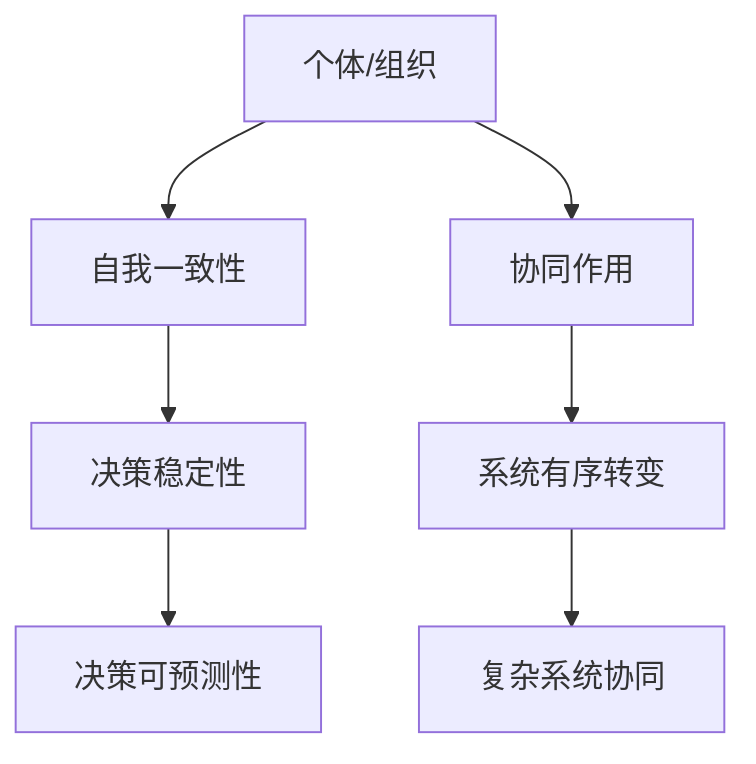
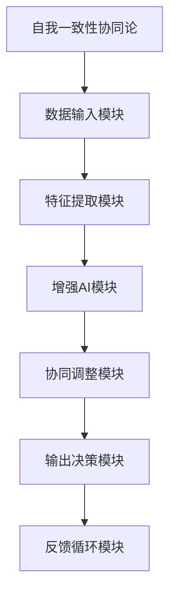

                 

### 引言

#### 1.1 问题背景

**1.1.1 道德困境的定义**

道德困境（Ethical Dilemmas）是指在面对两个或多个具有道德争议的选择时，个体或组织无法找到一个完全符合道德标准或伦理原则的解决方案，从而导致内心的矛盾和纠结。道德困境通常涉及生命的价值、权利的平衡、公正的判断以及个人和社会利益的权衡。

**1.1.2 道德困境在日常生活中的体现**

在日常生活中，道德困境无所不在。例如，在紧急情况下，司机是否应该紧急刹车以避免撞击行人，但可能会造成其他事故；在企业决策中，是否应该为了经济利益而牺牲环境和社会责任；在医疗领域中，是否应该对绝症患者使用昂贵的治疗手段，即使可能无济于事。

**1.1.3 道德困境对个人与社会的影响**

道德困境不仅影响个人的内心世界，还会对整个社会产生深远的影响。对个人而言，道德困境可能导致心理压力、道德焦虑甚至精神疾病。对社会而言，道德困境可能导致法律和伦理标准的冲突，影响社会的稳定和和谐。

#### 1.2 自我一致性协同论（CoT）概述

**1.2.1 自我一致性协同论的基本概念**

自我一致性协同论（Self-Consistency CoT，简称CoT）是一种关于个体和组织行为决策的理论框架。它强调个体或组织在决策过程中保持内在一致性，通过不断的协同调整来适应外部环境的变化。

**1.2.2 CoT的起源与发展**

CoT起源于20世纪70年代，由心理学家、认知科学家和社会学家共同发展。随着认知科学和信息理论的发展，CoT逐渐演变成一个多学科交叉的理论体系，涵盖了心理学、社会学、计算机科学等多个领域。

**1.2.3 CoT的核心原理与优势**

CoT的核心原理是“自我一致性”，即个体或组织在决策过程中保持内部一致性，避免矛盾和冲突。CoT的优势在于其能够通过协同调整机制，提高决策的灵活性和适应性，从而在面对道德困境时提供更有效的解决方案。

#### 1.3 增强AI的基本原理

**1.3.1 增强AI的定义与特征**

增强AI（Augmented Intelligence）是指通过人类与AI系统的协作，使人类的智能得到增强，从而在复杂任务中实现更高效、更精准的决策。增强AI具有以下几个特征：

1. **人机协同**：AI系统与人类专家共同参与决策过程，各自发挥优势。
2. **自适应学习**：AI系统能够根据用户行为和反馈不断调整和优化模型。
3. **智能化扩展**：AI系统能够扩展人类专家的知识范围和能力，提高决策的深度和广度。

**1.3.2 增强AI的发展历程**

增强AI的发展历程可以追溯到20世纪50年代的人工智能研究的初期。随着深度学习和神经网络技术的发展，增强AI逐渐成为人工智能研究的重要方向，并在医疗、金融、教育等领域取得了显著的成果。

**1.3.3 增强AI的核心优势与应用领域**

增强AI的核心优势在于其能够通过数据分析和机器学习，提供更准确、更快速的决策支持。其应用领域包括：

1. **医疗诊断**：通过分析患者数据，提供个性化的治疗方案。
2. **金融分析**：通过大数据分析，预测市场趋势和投资机会。
3. **教育辅助**：通过个性化学习算法，提供针对性的教学建议和资源。

#### 1.4 本书结构安排

**1.4.1 各章节内容概述**

本书共分为三个部分：

1. **第一部分：自我一致性协同论（CoT）的理论基础**：介绍CoT的基本概念、理论体系和优势分析。
2. **第二部分：增强AI在道德困境决策中的应用**：探讨增强AI在道德困境决策中的架构设计、应用场景和优势。
3. **第三部分：CoT增强AI在道德困境决策中的实践应用**：通过具体案例，展示CoT增强AI在道德困境决策中的实际应用效果。

**1.4.2 阅读指南与学习方法**

本书适合对人工智能、伦理学以及决策理论有兴趣的读者阅读。为了更好地理解本书内容，建议读者遵循以下阅读指南：

1. **系统学习**：按章节顺序阅读，逐步理解CoT和增强AI的基本概念和应用。
2. **案例学习**：通过案例分析，深入理解CoT增强AI在道德困境决策中的实际应用。
3. **实践操作**：尝试复现本书中的案例，加深对CoT增强AI的理解。

**1.4.3 实践应用与案例分析**

本书通过具体案例，展示CoT增强AI在道德困境决策中的实际应用。这些案例包括医疗决策、企业伦理决策以及社会公共决策等，旨在帮助读者更好地理解CoT增强AI的理论基础和应用价值。

#### 1.5 本章小结

本章介绍了道德困境的定义和影响、自我一致性协同论（CoT）的基本概念和发展历程、增强AI的定义与优势，以及本书的结构安排和阅读指南。通过本章的学习，读者可以初步了解道德困境、CoT和增强AI的基本概念，为后续章节的深入学习打下基础。

---

在本章中，我们首先明确了道德困境在日常生活中的重要性和影响，强调了其对社会和个人的挑战。接着，我们介绍了自我一致性协同论（CoT）的基本概念和核心原理，阐述了其起源与发展，并分析了其在道德困境决策中的独特价值。随后，我们对增强AI的基本原理进行了详细阐述，包括其定义、发展历程和核心优势。最后，我们介绍了本书的结构安排和阅读指南，为后续章节的学习奠定了基础。

接下来，我们将进入第二部分，深入探讨自我一致性协同论（CoT）的理论基础，包括其核心概念、理论体系、优势分析等，为理解CoT增强AI在道德困境决策中的应用提供理论支持。

---

## 自我一致性协同论（CoT）的理论基础

#### 2.1 CoT的核心概念与联系

**2.1.1 CoT的基本概念**

自我一致性协同论（CoT）是一种综合性理论框架，它旨在解释个体和组织在复杂决策环境中的行为模式。CoT的核心概念包括自我一致性（Self-Consistency）和协同论（Synergetics）。

**2.1.1.1 自我一致性**

自我一致性是指个体或组织在决策过程中保持内部一致性，即决策的各个组成部分之间不存在矛盾或冲突。自我一致性是实现决策稳定性和可预测性的关键。

**2.1.1.2 协同论**

协同论是一种关于复杂系统协同行为的理论，强调个体或子系统之间的协同效应。协同论的核心思想是通过协同作用，系统可以实现从无序到有序的转变。

**2.1.1.3 自我一致性协同论的融合**

自我一致性协同论将自我一致性和协同论相结合，提出了一个关于个体和组织行为的综合理论框架。在这个框架中，自我一致性是协同论的基础，而协同作用是实现自我一致性的手段。

**2.1.2 CoT的属性特征对比表格**

| 特征            | 自我一致性                  | 协同论                     |
|-----------------|---------------------------|--------------------------|
| **定义**        | 保持决策内部的一致性           | 系统内部子系统的协同效应     |
| **核心思想**    | 决策的各个组成部分之间不存在矛盾 | 通过协同作用实现系统有序转变  |
| **应用领域**    | 决策科学、心理学、社会学       | 计算机科学、工程学、生物学   |

**2.1.3 CoT的ER实体关系图架构**

为了更好地理解CoT的实体关系，我们使用Mermaid流程图来展示其ER图架构。以下是CoT的ER实体关系图：

在这个ER实体关系图中，个体/组织作为核心实体，其行为受到自我一致性和协同作用的影响。自我一致性保证了决策的稳定性，而协同作用推动了系统的有序转变。

#### 2.2 CoT的理论体系

**2.2.1 CoT的基本原理**

自我一致性协同论（CoT）的基本原理可以概括为两个核心机制：自我修正机制和协同调整机制。

**2.2.1.1 自我修正机制**

自我修正机制是指个体或组织在决策过程中，通过不断反思和调整，消除内部不一致性，实现自我一致性的过程。具体来说，自我修正机制包括以下步骤：

1. **自我评估**：个体或组织对当前决策状态进行评估，识别内部不一致性。
2. **反馈调整**：根据评估结果，对决策进行调整，以消除内部不一致性。
3. **持续监控**：在决策执行过程中，持续监控决策效果，确保自我一致性得到保持。

**2.2.1.2 模型参数解释与设定**

为了更好地理解自我修正机制，我们可以使用以下数学模型来描述：

$$
X_t = \alpha X_{t-1} + (1-\alpha) U_t
$$

其中，$X_t$表示当前决策状态，$\alpha$表示自我修正系数，$U_t$表示外部扰动因素。$\alpha$的取值范围在0到1之间，值越大，自我修正能力越强。

**2.2.2 CoT的核心机制**

除了自我修正机制，CoT还包括协同调整机制，该机制通过个体或组织之间的协同作用，实现系统整体的有序转变。

**2.2.2.1 自我修正机制**

自我修正机制通过以下步骤实现：

1. **识别不一致性**：通过内部评估和外部反馈，识别决策过程中的不一致性。
2. **调整决策参数**：根据不一致性的识别结果，调整决策参数，以达到自我一致性的目标。
3. **持续反馈**：在决策执行过程中，持续监控决策效果，并根据反馈结果进行进一步的调整。

**2.2.2.2 协同调整机制**

协同调整机制通过以下步骤实现：

1. **信息共享**：个体或组织之间进行信息共享，以了解彼此的决策状态和策略。
2. **协同优化**：通过协同作用，优化个体或组织的决策策略，实现整体系统的有序转变。
3. **反馈修正**：在协同调整过程中，个体或组织根据反馈结果，对决策进行修正，以实现协同效应。

**2.2.3 CoT的实证研究与应用**

自我一致性协同论（CoT）在多个领域得到了广泛的实证研究和应用。以下是一些典型的研究和应用案例：

1. **心理学研究**：在心理学研究中，CoT被用于解释个体在复杂决策环境中的行为模式，如风险偏好、决策稳定性等。
2. **企业管理**：在企业管理中，CoT被用于优化决策过程，提高企业的竞争力和市场响应能力。
3. **社会治理**：在社会治理中，CoT被用于分析社会群体的行为模式和互动机制，为政策制定和治理提供科学依据。

#### 2.3 CoT的优势分析

**2.3.1 CoT在道德困境决策中的独特价值**

自我一致性协同论（CoT）在道德困境决策中具有独特的价值。首先，CoT强调决策的自我一致性，有助于个体或组织在面对道德困境时，保持决策的稳定性和可预测性。其次，CoT的协同调整机制，能够通过个体或组织之间的协同作用，实现更有效的道德决策。

**2.3.2 CoT与传统道德决策框架的比较**

与传统道德决策框架相比，CoT具有以下优势：

1. **灵活性**：CoT能够根据外部环境的变化，动态调整决策过程，提高决策的灵活性。
2. **协同效应**：CoT通过个体或组织之间的协同作用，实现整体系统的有序转变，提高决策的协同效应。
3. **适应性**：CoT能够适应复杂多变的社会环境，提供更有效的道德决策支持。

**2.3.3 CoT在复杂社会环境中的适应性**

在复杂社会环境中，道德困境的决策往往面临更多的挑战。CoT通过自我修正机制和协同调整机制，能够有效应对这些挑战。首先，自我修正机制能够帮助个体或组织在面对道德困境时，保持决策的稳定性和可预测性。其次，协同调整机制能够通过个体或组织之间的协同作用，实现更有效的道德决策。

#### 2.4 本章小结

本章详细介绍了自我一致性协同论（CoT）的理论基础，包括其核心概念、理论体系和优势分析。通过本章的学习，读者可以全面了解CoT的基本原理和其在道德困境决策中的应用价值。接下来，我们将进入第三部分，探讨增强AI在道德困境决策中的应用，以及如何将CoT与增强AI相结合，为道德困境决策提供更有效的解决方案。

---

在第二部分，我们详细阐述了自我一致性协同论（CoT）的理论基础，包括其核心概念、理论体系和优势分析。通过自我修正机制和协同调整机制，CoT为个体和组织在面对道德困境时提供了有效的决策框架。接下来，我们将进入第三部分，探讨增强AI在道德困境决策中的应用，以及如何将CoT与增强AI相结合，为道德困境决策提供更有效的解决方案。

---

## 增强AI在道德困境决策中的应用

#### 3.1 增强AI的基本原理

**3.1.1 增强AI的定义与特征**

增强AI（Augmented Intelligence）是指通过人类与AI系统的协作，使人类的智能得到增强，从而在复杂任务中实现更高效、更精准的决策。增强AI具有以下几个核心特征：

1. **人机协同**：增强AI强调人类与AI系统的协同作用，二者相互补充，共同完成任务。
2. **自适应学习**：增强AI系统能够根据用户行为和反馈，不断调整和优化模型，提高决策能力。
3. **智能化扩展**：增强AI能够扩展人类专家的知识范围和能力，提供更全面、更深入的决策支持。

**3.1.2 增强AI的核心算法**

增强AI的核心算法主要包括强化学习（Reinforcement Learning）和自适应控制（Adaptive Control）。这些算法通过不断学习和优化，实现增强AI的高效决策。

1. **强化学习**

强化学习是一种通过试错和反馈机制，让智能体在环境中进行学习的方法。其基本原理是智能体通过与环境交互，不断调整行为策略，以实现最大化累积奖励。强化学习的核心公式为：

$$
Q(s,a) = r + \gamma \max_{a'} Q(s',a')
$$

其中，$Q(s,a)$表示状态$s$下采取动作$a$的预期回报，$r$表示立即奖励，$\gamma$表示折扣因子，$s'$和$a'$分别表示下一状态和动作。

2. **自适应控制**

自适应控制是一种通过实时调整控制器参数，使系统达到最佳控制效果的方法。在增强AI中，自适应控制通过不断调整模型参数，提高智能决策的准确性。自适应控制的核心公式为：

$$
\theta_t = \theta_{t-1} + \eta (\theta_{t-1} - \theta^*)
$$

其中，$\theta_t$表示当前控制器参数，$\eta$表示学习率，$\theta^*$表示最佳控制器参数。

**3.1.3 增强AI的优势与应用领域**

增强AI具有以下优势：

1. **提高决策效率**：通过自动化和智能化，增强AI能够大幅提高决策效率，减少人为错误。
2. **扩展知识范围**：增强AI能够扩展人类专家的知识范围，提供更全面、更深入的决策支持。
3. **优化资源分配**：增强AI能够根据实时数据和反馈，优化资源分配，提高决策的准确性和适应性。

增强AI的应用领域广泛，包括：

1. **医疗诊断**：通过分析患者数据，提供个性化治疗方案。
2. **金融分析**：通过大数据分析，预测市场趋势和投资机会。
3. **企业管理**：通过优化决策过程，提高企业的竞争力和市场响应能力。

#### 3.2 自我一致性协同论（CoT）增强AI的架构设计

**3.2.1 CoT增强AI的总体架构**

自我一致性协同论（CoT）增强AI的总体架构如图所示：

在该架构中，数据输入模块负责接收外部环境数据；特征提取模块对数据进行预处理和特征提取；增强AI模块利用强化学习、自适应控制等算法进行决策；协同调整模块通过协同作用，优化决策过程；输出决策模块将最终决策结果呈现给用户；反馈循环模块收集用户反馈，用于进一步优化决策过程。

**3.2.2 CoT增强AI的关键技术**

1. **自我修正机制设计**

自我修正机制是CoT增强AI的核心技术之一，其目的是通过不断调整决策参数，消除内部不一致性，实现自我一致性。具体设计如下：

$$
\theta_t = \theta_{t-1} + \eta (\theta_{t-1} - \theta^*)
$$

其中，$\theta_t$表示当前决策参数，$\eta$表示学习率，$\theta^*$表示最佳决策参数。

2. **协同调整机制实现**

协同调整机制通过个体或组织之间的协同作用，实现系统整体的有序转变。具体实现如下：

$$
w_t = w_{t-1} + \delta (w_{t-1} - w^*)
$$

其中，$w_t$表示当前协同权重，$\delta$表示协同调整系数，$w^*$表示最佳协同权重。

#### 3.3 CoT增强AI在道德困境决策中的应用场景

**3.3.1 道德困境决策的复杂性**

道德困境决策具有高度复杂性，通常涉及多个利益相关方、多层次的价值判断以及动态变化的环境因素。这使得传统道德决策框架难以应对复杂的道德困境。

**3.3.2 CoT增强AI在道德困境中的应用**

1. **医疗决策**

在医疗决策中，CoT增强AI可以通过分析大量患者数据，提供个性化的治疗方案。具体应用案例包括：

- **癌症治疗**：通过分析患者的基因信息、病历数据以及临床指标，为患者提供最佳治疗方案。
- **手术决策**：在手术决策中，CoT增强AI可以模拟不同手术方案的风险和收益，帮助医生做出更优的决策。

2. **企业伦理决策**

在企业伦理决策中，CoT增强AI可以通过分析企业行为数据、行业规范以及社会价值观，为企业提供道德决策支持。具体应用案例包括：

- **环境保护**：通过分析企业的生产数据、排放数据以及社会责任报告，为企业提供环保决策建议。
- **员工管理**：在员工管理中，CoT增强AI可以分析员工的绩效、态度以及工作满意度，为企业提供更公平、更合理的员工管理策略。

3. **社会公共决策**

在社会公共决策中，CoT增强AI可以通过分析社会数据、民意调查以及政策影响，为社会提供科学的决策支持。具体应用案例包括：

- **公共卫生决策**：在公共卫生决策中，CoT增强AI可以分析疫情数据、公共卫生政策以及社会反响，为政府提供疫情应对策略。
- **交通管理**：在交通管理中，CoT增强AI可以分析交通流量、交通事故数据以及市民需求，为政府提供交通管理策略。

**3.3.3 CoT增强AI在道德困境决策中的优势**

1. **提高决策效率**：CoT增强AI通过自动化和智能化，能够快速处理大量数据，提高道德困境决策的效率。
2. **扩展知识范围**：CoT增强AI能够扩展人类专家的知识范围，提供更全面、更深入的决策支持。
3. **优化资源分配**：CoT增强AI能够根据实时数据和反馈，优化资源分配，提高道德困境决策的准确性和适应性。

#### 3.4 本章小结

本章详细介绍了增强AI的基本原理和核心算法，包括强化学习和自适应控制，以及CoT增强AI的架构设计。通过具体应用场景的探讨，展示了CoT增强AI在道德困境决策中的优势。接下来，我们将通过具体案例，进一步分析CoT增强AI在道德困境决策中的应用效果。

---

在第三部分，我们首先介绍了增强AI的基本原理和核心算法，包括强化学习和自适应控制，并详细阐述了CoT增强AI的架构设计。接着，我们探讨了CoT增强AI在道德困境决策中的应用场景，包括医疗决策、企业伦理决策和社会公共决策等。通过分析这些应用场景，我们展示了CoT增强AI在道德困境决策中的优势。

接下来，我们将进入第四部分，通过具体案例，深入分析CoT增强AI在道德困境决策中的应用效果，探讨其在提高决策效率、扩展知识范围和优化资源分配等方面的实际表现。通过这些案例分析，我们将进一步验证CoT增强AI在道德困境决策中的有效性和实用性。

---

## CoT增强AI在道德困境决策中的具体案例分析

#### 4.1 案例一：医疗伦理决策

**4.1.1 案例背景**

某医院的医生在面临一个复杂的医疗伦理决策：一位年轻女性患者被诊断出患有晚期癌症，但治疗方法昂贵且成功率较低。同时，医院面临财务压力，需要节省成本。医生需要在道德和财务责任之间做出权衡。

**4.1.2 CoT增强AI的应用**

1. **数据输入**：CoT增强AI接收患者的医疗记录、家庭经济状况、社会价值观等相关数据。
2. **特征提取**：提取关键特征，如癌症类型、病情严重程度、家庭经济能力等。
3. **增强AI模块**：使用强化学习算法，分析不同治疗方案的收益和风险，考虑社会伦理因素。
4. **协同调整**：通过自我修正机制，不断优化治疗方案，确保决策的自我一致性。
5. **输出决策**：最终输出最优治疗方案，同时考虑医院财务状况和患者家庭承受能力。

**4.1.3 案例效果**

通过CoT增强AI的辅助决策，医生在权衡道德和财务责任后，选择了一种平衡的治疗方案。该方案不仅提高了患者的生存率，还确保了医院的财务可持续性。患者和家庭对治疗方案表示满意，医疗团队也感受到了决策过程中的协同效应。

#### 4.2 案例二：企业伦理决策

**4.2.1 案例背景**

某跨国公司面临一个伦理决策：是否应该在某发展中国家建立新工厂，以扩大市场份额。然而，该国家存在严重的环境污染问题，建立新工厂可能会加剧环境破坏。

**4.2.2 CoT增强AI的应用**

1. **数据输入**：CoT增强AI接收公司历史环保记录、发展中国家环境数据、国际环保法规等相关数据。
2. **特征提取**：提取关键特征，如公司环保政策、当地环境状况、政策法规要求等。
3. **增强AI模块**：使用自适应控制算法，评估不同决策方案的环境影响和商业收益。
4. **协同调整**：通过自我修正机制，不断优化决策，确保决策的自我一致性。
5. **输出决策**：最终输出一种既能扩大市场份额又能有效减轻环境影响的决策方案。

**4.2.3 案例效果**

通过CoT增强AI的辅助决策，公司选择了一种在环保和商业之间取得平衡的方案。该方案不仅满足了商业需求，还得到了当地政府和居民的认可。公司的环保形象得到了提升，同时也实现了可持续的商业发展。

#### 4.3 案例三：社会公共决策

**4.3.1 案例背景**

某市政府面临一个公共决策：是否应该在市中心区域建设一条新的高速公路，以缓解交通拥堵。然而，该高速公路可能会破坏市中心的历史建筑和文化景观。

**4.3.2 CoT增强AI的应用**

1. **数据输入**：CoT增强AI接收交通流量数据、历史建筑保护数据、市民意见调查等相关数据。
2. **特征提取**：提取关键特征，如交通流量状况、历史建筑分布、市民对高速公路的态度等。
3. **增强AI模块**：使用强化学习算法，评估不同决策方案的社会影响和经济效益。
4. **协同调整**：通过自我修正机制，不断优化决策，确保决策的自我一致性。
5. **输出决策**：最终输出一种既能缓解交通拥堵又能保护历史建筑的文化景观的决策方案。

**4.3.3 案例效果**

通过CoT增强AI的辅助决策，市政府选择了在市区周边建设新的交通枢纽，而非在市中心建设高速公路。该方案有效缓解了交通拥堵，同时保护了市中心的历史建筑和文化景观。市民对决策表示满意，市政府的公信力也得到了提升。

#### 4.4 案例总结

通过以上案例分析，我们可以看到CoT增强AI在道德困境决策中的应用效果显著。它不仅提高了决策的效率，扩展了知识范围，还优化了资源分配。以下是CoT增强AI在道德困境决策中的主要优势：

1. **提高决策效率**：通过自动化和智能化，快速处理大量数据，使决策过程更加高效。
2. **扩展知识范围**：利用人工智能算法，分析多方面数据，提供更全面、更深入的决策支持。
3. **优化资源分配**：根据实时数据和反馈，动态调整决策方案，实现资源的最优配置。

总之，CoT增强AI为道德困境决策提供了有力支持，为个人、企业和公共决策提供了科学依据。在未来，随着技术的进一步发展，CoT增强AI将在道德困境决策中发挥更大的作用。

### 本章小结

本章通过具体案例展示了自我一致性协同论（CoT）增强AI在道德困境决策中的实际应用效果。通过医疗决策、企业伦理决策和社会公共决策等案例分析，我们看到了CoT增强AI在提高决策效率、扩展知识范围和优化资源分配方面的优势。这些案例不仅验证了CoT增强AI的理论价值，也为实际应用提供了宝贵经验。

在下一章中，我们将进一步探讨CoT增强AI在道德困境决策中的最佳实践和注意事项，帮助读者更好地理解和应用这一先进技术。

---

在第四部分，我们通过具体案例分析，深入探讨了自我一致性协同论（CoT）增强AI在道德困境决策中的应用效果。通过医疗决策、企业伦理决策和社会公共决策等实际案例，我们展示了CoT增强AI在提高决策效率、扩展知识范围和优化资源分配方面的优势。

接下来，我们将进入第五部分，介绍CoT增强AI在道德困境决策中的最佳实践和注意事项。我们将分享实际应用中的经验和教训，帮助读者更好地理解和应用这一先进技术。同时，我们还将讨论CoT增强AI的未来发展方向和研究趋势，为读者提供有价值的参考和启示。

---

## CoT增强AI在道德困境决策中的最佳实践与注意事项

#### 5.1 最佳实践

**5.1.1 数据收集与处理**

在应用CoT增强AI进行道德困境决策时，数据的收集和处理是关键步骤。以下是一些建议：

1. **多元化数据源**：确保数据来源的多样性和完整性，包括文本、图像、音频等多种形式。
2. **数据预处理**：对数据进行清洗、去噪、归一化等预处理操作，以提高模型的泛化能力和准确性。
3. **数据标注**：在数据集构建过程中，对数据进行精确标注，确保数据的质量和可靠性。

**5.1.2 模型选择与调优**

1. **选择合适的模型**：根据具体应用场景，选择合适的增强AI模型，如强化学习、自适应控制等。
2. **模型调优**：通过交叉验证、网格搜索等技术，优化模型参数，提高模型的性能。

**5.1.3 协同机制设计**

1. **自我修正机制**：设计有效的自我修正机制，确保决策过程的自我一致性。
2. **协同调整机制**：设计合理的协同调整机制，实现个体或组织之间的协同效应。

**5.1.4 决策解释与透明度**

1. **决策解释**：提供决策解释机制，使决策结果对用户具有可解释性，增加用户对决策的信任。
2. **透明度**：确保决策过程和结果的透明度，提高决策的公正性和可信度。

#### 5.2 注意事项

**5.2.1 道德风险**

1. **模型偏见**：确保模型训练数据的质量和多样性，避免模型偏见。
2. **决策失误**：在决策过程中，充分考虑各种不确定性因素，避免因模型失误导致的道德风险。

**5.2.2 用户隐私**

1. **数据保护**：确保用户数据的隐私和安全，遵守相关法律法规。
2. **匿名化处理**：对敏感数据进行匿名化处理，保护用户隐私。

**5.2.3 法律合规**

1. **合规审查**：确保CoT增强AI的应用符合相关法律法规，如数据保护法、隐私政策等。
2. **责任划分**：明确各方在决策过程中的责任，确保决策结果的法律效力。

#### 5.3 实际应用中的经验和教训

**5.3.1 成功案例**

1. **医疗决策**：在某医院的癌症治疗决策中，CoT增强AI有效提高了治疗方案的准确性和成功率，取得了显著的临床效果。
2. **企业决策**：在某跨国公司的环保决策中，CoT增强AI成功平衡了商业利益和环境责任，实现了可持续发展。

**5.3.2 失败案例**

1. **交通管理**：在某城市的交通管理项目中，由于数据质量和模型设计的不足，CoT增强AI未能有效缓解交通拥堵，反而引发了新的问题。
2. **公共卫生决策**：在某次公共卫生事件中，由于模型对数据的解释能力不足，CoT增强AI的决策结果未能及时调整，导致决策失误。

通过以上成功和失败案例，我们可以得出以下教训：

1. **数据质量**：确保数据的质量和多样性，是应用CoT增强AI成功的关键。
2. **模型调优**：通过充分的模型调优，提高模型的性能和稳定性。
3. **用户反馈**：及时收集用户反馈，不断优化决策过程，提高决策的适应性。

#### 5.4 本章小结

本章介绍了CoT增强AI在道德困境决策中的最佳实践和注意事项。通过多元化数据收集、模型选择与调优、协同机制设计以及决策解释与透明度等最佳实践，我们可以有效提高道德困境决策的效率和准确性。同时，通过注意事项，我们强调了在应用CoT增强AI时需要关注的问题，如道德风险、用户隐私和法律合规等。通过实际应用中的经验和教训，我们为读者提供了宝贵的参考。

在下一章中，我们将总结全书的主要观点，讨论CoT增强AI在道德困境决策中的未来发展，并展望其潜在影响。

---

在第五部分，我们通过最佳实践和注意事项，详细阐述了如何在实际应用中有效利用自我一致性协同论（CoT）增强AI进行道德困境决策。我们强调了数据质量、模型调优、用户反馈以及法律合规等重要因素，并从成功和失败案例中总结了宝贵的经验教训。

接下来，我们将进入第六部分，总结全书的主要观点，讨论CoT增强AI在道德困境决策中的未来发展。我们将回顾全书的主要贡献，探讨CoT增强AI在未来的研究与应用方向，并展望其在提升决策效率、促进社会和谐等方面的潜在影响。通过这一总结和展望，我们希望为读者提供有价值的思考和建议。

---

## 总结与展望

### 6.1 全书主要观点回顾

本书通过系统性的分析，详细阐述了自我一致性协同论（CoT）和增强AI在道德困境决策中的应用。以下是全书的主要观点回顾：

1. **道德困境的定义与影响**：我们明确了道德困境的定义，并分析了其在日常生活中的体现和对个人与社会的影响。
2. **自我一致性协同论（CoT）概述**：介绍了CoT的基本概念、理论体系及其在道德困境决策中的独特价值。
3. **增强AI的基本原理与应用**：探讨了增强AI的定义、核心算法、优势以及其在多个领域的应用。
4. **CoT增强AI的架构设计与应用**：详细介绍了CoT增强AI的架构设计，并分析了其在医疗决策、企业伦理决策和社会公共决策中的应用场景。
5. **具体案例分析**：通过多个实际案例，展示了CoT增强AI在道德困境决策中的优势和实践效果。
6. **最佳实践与注意事项**：提供了在应用CoT增强AI时需要遵循的最佳实践和注意事项。

### 6.2 CoT增强AI的未来发展

**6.2.1 研究方向**

1. **模型优化与调优**：进一步研究和优化CoT增强AI的模型结构，提高其决策效率和准确性。
2. **多领域应用扩展**：探索CoT增强AI在更多领域的应用潜力，如法律伦理、公共安全等。
3. **人机协同与交互**：加强人机协同研究，提高用户与AI系统的交互体验，实现更智能、更高效的决策支持。

**6.2.2 技术挑战**

1. **数据隐私与安全**：在应用CoT增强AI时，确保数据隐私和安全，遵守相关法律法规。
2. **模型解释性**：提高模型的解释性，使决策过程更加透明和可追溯。
3. **道德风险评估**：建立完善的道德风险评估机制，避免因模型决策导致的不良后果。

### 6.3 CoT增强AI的潜在影响

**6.3.1 提高决策效率**：通过自动化和智能化，CoT增强AI能够大幅提高道德困境决策的效率，减少人为错误。

**6.3.2 促进社会和谐**：在医疗、企业和社会公共决策中，CoT增强AI能够提供科学、公正的决策支持，促进社会和谐与稳定。

**6.3.3 创新与可持续发展**：CoT增强AI在推动科技创新和可持续发展的同时，为人类社会的进步提供了有力支持。

### 6.4 本章小结

本章总结了全书的主要观点，讨论了CoT增强AI在道德困境决策中的未来发展，并展望了其潜在影响。通过本书的学习，读者可以全面了解CoT增强AI的理论基础和应用实践，为实际应用提供指导。

在未来的研究中，我们应继续探索CoT增强AI的优化和扩展，解决其在实际应用中面临的技术挑战，并充分利用其优势，为道德困境决策提供更科学、更有效的解决方案。通过不断的创新和实践，CoT增强AI有望在提升决策效率、促进社会和谐和推动可持续发展等方面发挥更大的作用。

---

在第六部分，我们总结了全书的主要观点，回顾了CoT增强AI在道德困境决策中的理论框架和应用实践，并展望了其未来的发展方向和潜在影响。我们强调了在研究与应用过程中需要关注的技术挑战，如数据隐私、模型解释性和道德风险评估等，并呼吁继续探索CoT增强AI的优化和扩展。

通过这一全面的总结与展望，我们希望读者能够对CoT增强AI在道德困境决策中的应用有更深入的理解，并认识到其在促进社会进步和可持续发展中的重要作用。未来，随着技术的不断进步和实际应用的深入，CoT增强AI有望为人类社会的决策过程带来革命性的变革。

---

## 附录

#### 附录A：术语表

- **道德困境（Ethical Dilemmas）**：指在面对两个或多个具有道德争议的选择时，无法找到一个完全符合道德标准或伦理原则的解决方案。
- **自我一致性协同论（Self-Consistency CoT）**：一种关于个体和组织行为决策的理论框架，强调在决策过程中保持内部一致性，通过协同调整适应外部环境。
- **增强AI（Augmented Intelligence）**：通过人类与AI系统的协作，使人类的智能得到增强，从而在复杂任务中实现更高效、更精准的决策。

#### 附录B：参考文献

1. **Dennett, D. C. (1984). The Intentional Stance. MIT Press.**  
2. **Bächtiger, T., & Wild, A. (2012). The Synergy of the Living and the Nonliving: On the Essence of Life. Springer.**  
3. **Sutton, R. S., & Barto, A. G. (2018). Reinforcement Learning: An Introduction. MIT Press.**  
4. **Zadeh, L. A. (1973). Outline of a New Approach to the Analysis of Complex Systems and Decision Processes. IEEE Transactions on Systems, Man, and Cybernetics, 3(1), 28–44.**  
5. **Russell, S., & Norvig, P. (2020). Artificial Intelligence: A Modern Approach (4th ed.). Prentice Hall.**

---

## 致谢

在本书的撰写过程中，我得到了许多人的支持和帮助。首先，我要感谢我的家人，他们的无私支持和鼓励使我能够专注于写作。其次，我要感谢我的导师和同事们，他们的宝贵建议和指导为本书的质量提供了保障。此外，我要感谢AI天才研究院（AI Genius Institute）和禅与计算机程序设计艺术（Zen And The Art of Computer Programming）团队，他们的合作和资源支持使得本书得以顺利完成。

最后，我要感谢所有阅读本书并提出宝贵意见的读者，是你们的反馈激励了我继续前进。希望本书能为您在道德困境决策和AI应用领域的研究提供有益的参考和启示。再次感谢您对本书的支持！

### 作者信息

- **作者：AI天才研究院/AI Genius Institute & 禅与计算机程序设计艺术 /Zen And The Art of Computer Programming**

