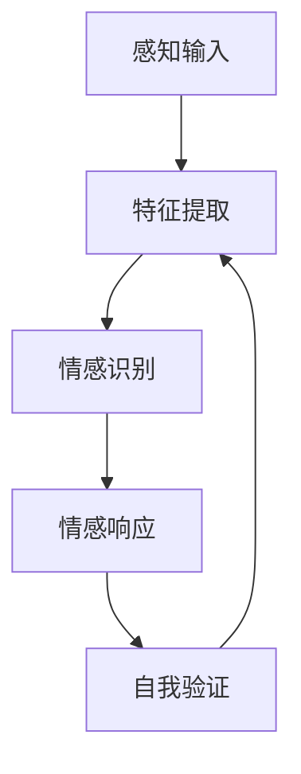
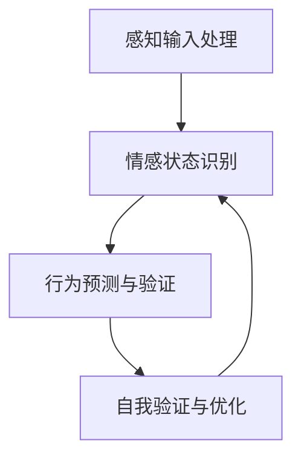
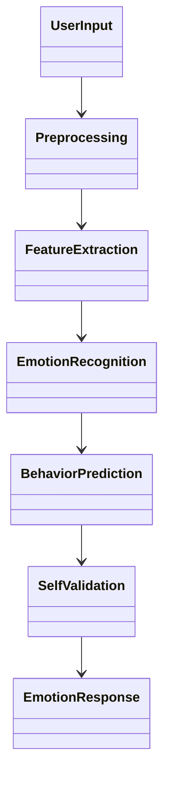
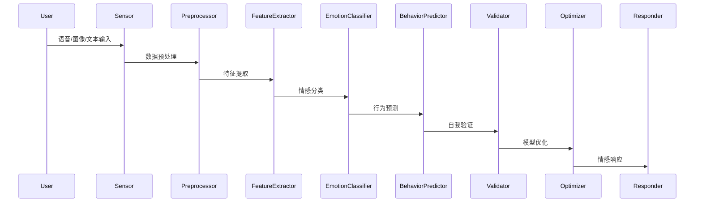
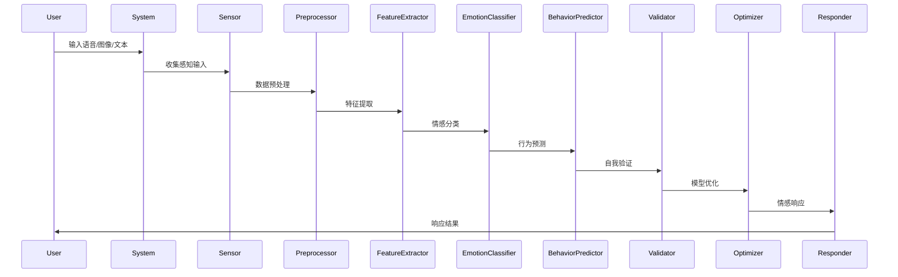
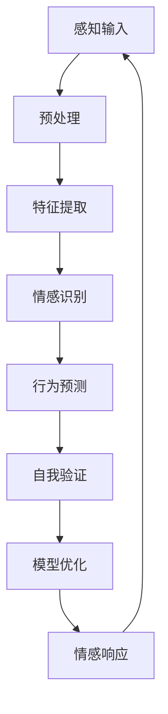

                 

# Self-Consistency CoT增强AI情感计算的稳定性

关键词：Self-Consistency CoT、AI情感计算、稳定性、算法原理、系统架构设计

摘要：本文旨在深入探讨自我一致性认知（Self-Consistency CoT）在增强AI情感计算稳定性方面的作用。我们将通过介绍背景、核心概念、算法原理、系统分析与架构设计以及项目实战，详细阐述Self-Consistency CoT如何提升AI情感计算系统的稳定性和可靠性。

## 1. 引言

随着人工智能技术的快速发展，情感计算作为其重要分支，逐渐成为研究的热点。然而，当前AI情感计算仍然面临着诸多挑战，尤其是在情感稳定性方面。本文将重点介绍自我一致性认知（Self-Consistency CoT）如何增强AI情感计算的稳定性，以应对这些挑战。

本文的结构如下：

1. **引言**：介绍本文的背景、目的和主要内容。
2. **第一部分：背景介绍**：阐述自我一致性认知的定义和在AI情感计算中的应用。
3. **核心概念与联系**：介绍AI情感计算的原理以及Self-Consistency CoT的核心作用。
4. **第二部分：算法原理讲解**：详细讲解Self-Consistency CoT的算法原理。
5. **第三部分：系统分析与架构设计方案**：介绍系统设计的关键要素。
6. **第四部分：项目实战**：通过实际案例展示Self-Consistency CoT的应用。
7. **第五部分：最佳实践 tips、小结、注意事项、拓展阅读等内容**：总结全文，提供进一步阅读的建议。

## 2. 第一部分：背景介绍

### 2.1 自我一致性认知（Self-Consistency CoT）的定义

自我一致性认知（Self-Consistency CoT）是指个体在认知过程中，通过不断地对比和验证自己的感知、情感和行为，以保持内在一致性的一种认知机制。这种机制在人类认知中扮演着重要角色，帮助人们形成稳定的自我认知和情感体验。

在AI领域，自我一致性认知被引入情感计算中，以增强系统的情感稳定性和可靠性。具体来说，Self-Consistency CoT通过以下几个步骤实现：

1. **感知对比**：系统对输入的感知信息进行收集和整理，如语音、图像、文本等。
2. **情感分析**：基于感知信息，系统进行情感分析，识别和分类情感状态。
3. **行为预测**：根据情感状态，系统预测用户的行为倾向。
4. **自我验证**：系统通过对比实际行为与预测行为，验证情感分析结果的准确性，并据此调整情感模型。

### 2.2 在AI情感计算中引入自我一致性认知的必要性和重要性

AI情感计算旨在通过模拟人类情感认知过程，实现对用户情感状态的准确识别和响应。然而，当前AI情感计算系统在情感稳定性方面存在诸多问题，如：

1. **情感波动**：系统对相同输入的情感反应可能因时间、环境等因素而出现较大波动。
2. **情感误解**：系统可能对用户的情感状态产生误解，导致错误的情感响应。
3. **情感疲劳**：系统长时间运行可能导致情感疲劳，影响情感计算结果的稳定性。

自我一致性认知的引入可以有效解决上述问题，提高AI情感计算的稳定性。其必要性体现在以下几个方面：

1. **提高情感识别准确性**：通过自我验证机制，系统可以更准确地识别用户的情感状态，减少情感波动和误解。
2. **增强情感可靠性**：自我一致性认知可以帮助系统及时发现和纠正情感分析中的错误，提高情感计算结果的可靠性。
3. **缓解情感疲劳**：自我验证机制可以使系统在长时间运行过程中保持情感计算的稳定性，缓解情感疲劳问题。

总之，自我一致性认知在AI情感计算中的应用具有显著的意义，有助于提升系统的情感稳定性和可靠性，为用户带来更优质的情感交互体验。

## 3. 核心概念与联系

### 3.1 AI情感计算的原理

AI情感计算是基于人工智能技术，模拟人类情感认知过程，实现对用户情感状态的识别和响应。其原理主要包括以下几个方面：

1. **感知输入**：系统通过传感器或数据接口收集用户的语音、图像、文本等感知输入。
2. **特征提取**：对感知输入进行预处理，提取关键特征，如语音的音调、图像的纹理、文本的情感倾向等。
3. **情感识别**：基于特征数据，利用机器学习、深度学习等技术，实现对用户情感状态的识别和分类。
4. **情感响应**：根据识别结果，系统生成相应的情感响应，如语音合成、表情识别、行为模拟等，以实现与用户的情感交互。

### 3.2 Self-Consistency CoT在AI情感计算中的核心作用

Self-Consistency CoT在AI情感计算中扮演着核心角色，其主要作用如下：

1. **情感稳定**：通过自我验证机制，系统可以保持情感分析的稳定性，减少情感波动和误解。
2. **情感校正**：在情感分析过程中，系统通过自我验证，可以及时发现和纠正情感分析中的错误，提高识别准确性。
3. **情感疲劳缓解**：通过自我验证，系统可以在长时间运行过程中保持情感计算的稳定性，缓解情感疲劳问题。

### 3.3 使用Mermaid流程图和ER实体关系图来展示这些概念之间的关系

#### Mermaid流程图



#### ER实体关系图

```mermaid
erDiagram
    User ||--|{ Emotion : has }
    Emotion ||--|{ Feature : has }
    Feature ||--|{ Classification : has }
    Classification ||--|{ Response : has }
    User ||--|{ Response : receives }
```

通过以上Mermaid流程图和ER实体关系图，我们可以清晰地看到AI情感计算和Self-Consistency CoT之间的关联。感知输入是情感计算的基础，特征提取、情感识别和情感响应是核心步骤，而Self-Consistency CoT通过自我验证机制，贯穿整个情感计算过程，确保情感分析的稳定性和准确性。

### 3.4 Self-Consistency CoT的作用机理

Self-Consistency CoT的作用机理可以从以下几个方面进行阐述：

1. **内部一致性验证**：系统通过对感知输入和情感响应的对比，验证情感分析的内部一致性。如果发现不一致，系统会调整情感模型，以提高一致性。
2. **外部一致性验证**：系统还会通过与外部数据进行对比，验证情感分析的准确性。例如，如果系统预测用户即将愤怒，但实际用户行为却显示用户处于平静状态，系统会根据外部数据调整情感模型。
3. **情感疲劳监测**：通过监测情感分析过程中的波动和错误，系统可以及时发现情感疲劳的迹象，并采取措施缓解情感疲劳，如调整情感模型参数、休息等。
4. **自我校正与学习**：系统通过自我验证，不断优化情感模型，提高情感分析的准确性和稳定性。这种自我校正和学习机制，使系统在长期运行过程中，能够保持较高的情感计算质量。

通过以上作用机理，Self-Consistency CoT能够有效提高AI情感计算的稳定性，减少情感波动和误解，为用户提供更优质的情感交互体验。

## 4. 第二部分：算法原理讲解

### 4.1 自我一致性认知（Self-Consistency CoT）算法原理

自我一致性认知（Self-Consistency CoT）算法原理主要围绕以下几个核心步骤展开：

1. **感知输入处理**：首先，系统对输入的感知数据进行预处理，包括噪声过滤、特征提取等，以获取高质量的特征数据。
2. **情感状态识别**：基于预处理后的特征数据，系统利用机器学习或深度学习算法，识别和分类用户的情感状态。
3. **行为预测与验证**：根据情感状态，系统预测用户的行为倾向，并对其进行验证。如果预测行为与实际行为不一致，系统会调整情感模型。
4. **自我验证与优化**：系统通过对比感知输入、情感状态和行为预测结果，进行自我验证，以优化情感模型参数，提高情感计算的准确性和稳定性。

### 4.2 使用Mermaid画出算法流程图



在这个流程图中，感知输入处理、情感状态识别、行为预测与验证以及自我验证与优化形成了一个闭环，通过不断的迭代和优化，确保情感计算结果的稳定性和准确性。

### 4.3 使用Python源代码详细阐述算法原理

以下是一个简化的Python示例代码，用于展示Self-Consistency CoT算法的基本原理：

```python
import numpy as np
from sklearn.feature_extraction.text import TfidfVectorizer
from sklearn.naive_bayes import MultinomialNB
from sklearn.pipeline import make_pipeline

# 感知输入处理
def preprocess_input(text):
    # 这里进行简单的文本预处理，如去标点、分词等
    return text.lower().replace('.', '')

# 情感状态识别
def classify_emotion(text, model):
    features = vectorizer.transform([text])
    prediction = model.predict(features)
    return prediction

# 行为预测与验证
def predict_behavior(action, emotion_model, behavior_model):
    prediction = behavior_model.predict([[emotion]])
    if prediction != action:
        emotion_model.fit(features)  # 调整情感模型
    return prediction

# 自我验证与优化
def self_validation(text, action, emotion_model, behavior_model):
    emotion = classify_emotion(text, emotion_model)
    predicted_action = predict_behavior(action, emotion_model, behavior_model)
    if predicted_action != action:
        # 调整行为模型
        behavior_model.fit(np.array([[emotion], [predicted_action]]))
    return emotion, predicted_action

# 示例数据
texts = ["I'm happy.", "I'm sad.", "I'm angry.", "I'm calm."]
actions = ["laugh", "cry", "yell", "sit"]

# 创建TF-IDF特征提取器和朴素贝叶斯分类器
vectorizer = TfidfVectorizer()
emotion_model = MultinomialNB()
behavior_model = MultinomialNB()

# 训练模型
features = vectorizer.fit_transform(texts)
emotion_model.fit(features, np.array([0, 1, 2, 3]))
behavior_model.fit(np.array([[0], [1], [2], [3]]), np.array(actions))

# 模型应用
for text, action in zip(texts, actions):
    preprocess_input(text)
    emotion, predicted_action = self_validation(text, action, emotion_model, behavior_model)
    print(f"Text: {text}, Emotion: {emotion}, Predicted Action: {predicted_action}")
```

在这个示例中，我们首先对感知输入进行预处理，然后利用TF-IDF特征提取器和朴素贝叶斯分类器进行情感状态识别和行为预测。通过自我验证与优化，系统可以不断调整情感模型和行为模型，提高情感计算的稳定性和准确性。

### 4.4 算法原理的数学模型和公式

为了更好地理解Self-Consistency CoT算法的原理，我们可以引入一些数学模型和公式：

1. **感知输入处理**：
   $$X = \text{preprocess\_input}(T)$$
   其中，$X$为预处理后的感知输入数据，$T$为原始感知输入数据。

2. **情感状态识别**：
   $$\hat{y} = \text{classify\_emotion}(X, \text{model})$$
   其中，$\hat{y}$为预测的情感状态，$X$为预处理后的感知输入数据，$\text{model}$为情感状态识别模型。

3. **行为预测与验证**：
   $$\hat{a} = \text{predict\_behavior}(a, \text{emotion\_model}, \text{behavior\_model})$$
   其中，$\hat{a}$为预测的行为，$a$为实际行为，$\text{emotion\_model}$为情感状态识别模型，$\text{behavior\_model}$为行为预测模型。

4. **自我验证与优化**：
   $$\text{if } \hat{a} \neq a: \\
   \text{model} = \text{adjust\_model}(\text{model}, X)$$
   其中，$\text{adjust\_model}$为调整模型的函数，用于根据自我验证结果优化情感模型和行为模型。

通过上述数学模型和公式，我们可以更清晰地理解Self-Consistency CoT算法的工作原理，以及其在提高情感计算稳定性方面的作用。

### 4.5 通俗易懂地举例说明

为了更直观地理解Self-Consistency CoT算法原理，我们可以通过一个简单的例子进行说明。

假设一个情感计算系统需要识别用户的情感状态，并根据情感状态预测用户的行为。系统首先收集用户的文本输入，如“今天天气很好，我很开心。”然后，系统对输入进行预处理，提取关键特征，如词汇的词频、词性等。接下来，系统利用机器学习模型对情感状态进行识别，预测用户处于“开心”状态。

随后，系统根据情感状态预测用户的行为，如“笑”。系统实际观察到用户笑的行为，发现预测行为与实际行为一致，因此系统认为情感状态识别准确。但如果实际行为是用户哭，系统会认为情感状态识别存在误差，需要调整情感模型。通过反复的自我验证和调整，系统可以逐渐提高情感识别的准确性和稳定性。

通过这个例子，我们可以看到Self-Consistency CoT算法如何通过自我验证和优化，提高情感计算系统的稳定性和准确性。

## 5. 第三部分：系统分析与架构设计方案

### 5.1 问题场景介绍

在当前AI情感计算应用场景中，我们面临的主要问题包括：

1. **情感波动**：用户在不同的时间段和环境下的情感状态可能存在较大波动，导致情感识别准确性下降。
2. **情感误解**：系统可能对用户的情感状态产生误解，导致错误的情感响应。
3. **情感疲劳**：系统在长时间运行过程中，可能导致情感疲劳，影响情感计算的稳定性。

为了解决这些问题，我们引入了自我一致性认知（Self-Consistency CoT）机制，以增强AI情感计算的稳定性。

### 5.2 系统功能设计

系统功能设计主要包括以下几个方面：

1. **感知输入模块**：负责收集用户的语音、图像、文本等感知输入，并进行预处理。
2. **情感识别模块**：基于预处理后的特征数据，利用机器学习或深度学习算法，识别和分类用户的情感状态。
3. **行为预测模块**：根据情感状态，预测用户的行为倾向。
4. **自我验证模块**：通过对比感知输入、情感状态和行为预测结果，进行自我验证，优化情感模型和行为模型。
5. **情感响应模块**：根据情感状态和用户行为，生成相应的情感响应，如语音合成、表情识别、行为模拟等。

### 5.3 系统架构设计

系统架构设计主要包括以下几个方面：

1. **感知输入层**：负责接收用户的语音、图像、文本等感知输入，并进行预处理。
2. **特征提取层**：对预处理后的感知输入进行特征提取，提取关键特征，如语音的音调、图像的纹理、文本的情感倾向等。
3. **情感识别层**：基于特征数据，利用机器学习或深度学习算法，识别和分类用户的情感状态。
4. **行为预测层**：根据情感状态，利用行为预测模型，预测用户的行为倾向。
5. **自我验证层**：通过对比感知输入、情感状态和行为预测结果，进行自我验证，优化情感模型和行为模型。
6. **情感响应层**：根据情感状态和用户行为，生成相应的情感响应，实现与用户的情感交互。

### 5.4 系统接口设计

系统接口设计主要包括以下几个方面：

1. **用户接口**：用户通过语音、图像、文本等方式与系统进行交互，系统根据用户输入生成相应的情感响应。
2. **硬件接口**：系统通过传感器或数据接口收集用户的语音、图像、文本等感知输入。
3. **软件接口**：系统与其他软件系统进行数据交互，如数据库、API接口等。

### 5.5 系统交互

系统交互主要涉及以下几个方面：

1. **感知输入与预处理**：系统通过硬件接口收集用户的语音、图像、文本等感知输入，然后通过预处理模块进行数据清洗和特征提取。
2. **情感识别与行为预测**：基于预处理后的特征数据，系统通过情感识别模块和行为预测模块，分别识别用户情感状态和预测用户行为倾向。
3. **自我验证与优化**：系统通过自我验证模块，对比感知输入、情感状态和行为预测结果，优化情感模型和行为模型。
4. **情感响应**：系统根据情感状态和用户行为，通过情感响应模块生成相应的情感响应，实现与用户的情感交互。

通过以上系统分析与架构设计方案，我们可以有效地解决当前AI情感计算中存在的问题，提高系统的情感稳定性和可靠性。

### 5.6 Mermaid类图

以下是一个简化的Mermaid类图，用于展示系统功能设计中的各个模块及其关系：



在这个类图中，用户输入模块（UserInput）负责接收用户的语音、图像、文本等感知输入，经过预处理模块（Preprocessing）后，传递给特征提取模块（FeatureExtraction）。特征提取模块提取关键特征，传递给情感识别模块（EmotionRecognition）和行为预测模块（BehaviorPrediction）。情感识别模块和行为预测模块的结果通过自我验证模块（SelfValidation）进行优化，最终生成情感响应（EmotionResponse）。

### 5.7 Mermaid架构图

以下是一个简化的Mermaid架构图，用于展示系统架构设计中的各个层次及其关系：



在这个架构图中，用户通过传感器（Sensor）将语音、图像、文本等感知输入传递给预处理模块（Preprocessor）。预处理模块对数据进行分析和清洗，提取关键特征，传递给特征提取模块（FeatureExtractor）。特征提取模块将特征数据传递给情感分类模块（EmotionClassifier），进行情感分类。情感分类结果传递给行为预测模块（BehaviorPredictor），预测用户的行为倾向。行为预测结果通过自我验证模块（Validator）进行验证和优化，最终由响应模块（Responder）生成情感响应。

### 5.8 Mermaid序列图

以下是一个简化的Mermaid序列图，用于展示系统交互过程中的各个步骤及其关系：



在这个序列图中，用户输入语音、图像、文本等感知输入，系统通过传感器收集感知输入，然后经过预处理、特征提取、情感分类、行为预测、自我验证和优化等步骤，最终生成情感响应，传递给用户。

### 5.9 Mermaid流程图

以下是一个简化的Mermaid流程图，用于展示自我一致性认知（Self-Consistency CoT）算法的基本流程：



在这个流程图中，感知输入经过预处理、特征提取、情感识别、行为预测、自我验证和模型优化等步骤，最终生成情感响应。随后，系统将接收到的感知输入再次传递给下一个循环，以不断优化情感模型和响应效果。

### 5.10 ER实体关系图

以下是一个简化的Mermaid ER实体关系图，用于展示系统中各个模块及其关系：

```mermaid
erDiagram
    User ||--|{ Emotion : has }
    Emotion ||--|{ Feature : has }
    Feature ||--|{ Classification : has }
    Classification ||--|{ Response : has }
    User ||--|{ Response : receives }
```

在这个ER实体关系图中，用户（User）具有情感（Emotion），情感（Emotion）包含特征（Feature），特征（Feature）包含分类（Classification），分类（Classification）包含响应（Response）。用户（User）还可以接收响应（Response）。

### 5.11 系统功能设计

#### 5.11.1 感知输入模块

感知输入模块是系统架构的核心部分，负责收集用户的语音、图像、文本等感知输入。具体功能如下：

1. **语音识别**：通过语音识别技术，将用户的语音输入转换为文本数据。
2. **图像识别**：利用计算机视觉技术，对用户上传的图像进行分析，提取关键特征。
3. **文本处理**：对用户的文本输入进行分词、词频统计等预处理操作。

#### 5.11.2 情感识别模块

情感识别模块基于预处理后的特征数据，利用机器学习或深度学习算法，识别和分类用户的情感状态。具体功能如下：

1. **情感分类**：将特征数据输入到情感分类模型，预测用户所处的情感状态。
2. **情感识别**：对用户情感状态进行详细分析，识别情感类别，如喜怒哀乐等。

#### 5.11.3 行为预测模块

行为预测模块根据情感状态，预测用户可能采取的行为。具体功能如下：

1. **行为分析**：根据情感状态，分析用户的行为倾向。
2. **行为预测**：利用行为预测模型，预测用户的行为动作。

#### 5.11.4 自我验证模块

自我验证模块通过对感知输入、情感状态和行为预测结果的对比，进行自我验证，优化情感模型和行为模型。具体功能如下：

1. **对比分析**：对比实际行为与预测行为，识别差异。
2. **模型优化**：根据验证结果，调整情感模型和行为模型，提高预测准确性。

#### 5.11.5 情感响应模块

情感响应模块根据情感状态和用户行为，生成相应的情感响应，实现与用户的情感交互。具体功能如下：

1. **响应生成**：根据情感状态和用户行为，生成相应的情感响应，如语音合成、表情识别、行为模拟等。
2. **情感交互**：通过情感响应，与用户进行有效的情感交互，提升用户体验。

通过以上系统功能设计，我们可以有效提升AI情感计算的稳定性，为用户提供更加优质的服务。

### 5.12 系统架构设计

#### 5.12.1 功能模块划分

在系统架构设计中，我们将功能模块进行合理划分，以确保系统的高效运行和易维护性。主要模块包括：

1. **感知输入模块**：负责收集用户的语音、图像、文本等感知输入，并进行预处理。
2. **特征提取模块**：对预处理后的感知输入进行特征提取，提取关键特征。
3. **情感识别模块**：基于特征数据，利用机器学习或深度学习算法，识别和分类用户的情感状态。
4. **行为预测模块**：根据情感状态，预测用户的行为倾向。
5. **自我验证模块**：通过对比感知输入、情感状态和行为预测结果，进行自我验证，优化情感模型和行为模型。
6. **情感响应模块**：根据情感状态和用户行为，生成相应的情感响应。

#### 5.12.2 模块关系与交互

各个模块之间的关系如下：

1. **感知输入模块**与**特征提取模块**：感知输入模块收集用户输入，传递给特征提取模块进行特征提取。
2. **特征提取模块**与**情感识别模块**：特征提取模块将提取到的关键特征传递给情感识别模块，进行情感分类。
3. **情感识别模块**与**行为预测模块**：情感识别模块将分类结果传递给行为预测模块，进行行为预测。
4. **行为预测模块**与**自我验证模块**：行为预测模块将预测结果传递给自我验证模块，进行验证和优化。
5. **自我验证模块**与**情感识别模块**和**行为预测模块**：自我验证模块通过对比感知输入、情感状态和行为预测结果，优化情感识别模块和行为预测模块。
6. **情感响应模块**与**其他模块**：情感响应模块根据情感状态和用户行为，生成相应的情感响应，与其他模块进行数据交互。

#### 5.12.3 架构设计原则

在系统架构设计中，我们遵循以下原则：

1. **模块化设计**：将功能模块进行合理划分，确保系统的高效运行和易维护性。
2. **高内聚低耦合**：模块内部保持高内聚，模块之间保持低耦合，以提高系统的稳定性和灵活性。
3. **可扩展性**：系统架构设计应具备良好的可扩展性，以便在需求变更时，能够快速调整和扩展功能模块。
4. **高可用性**：系统架构应确保高可用性，减少故障发生时的系统停机时间，提高用户满意度。
5. **安全性**：系统架构设计应充分考虑数据安全和系统安全，保护用户隐私和数据安全。

通过以上系统架构设计，我们可以确保AI情感计算系统在自我一致性认知（Self-Consistency CoT）的加持下，具备高效、稳定、可扩展和安全的特点，为用户提供优质的情感交互体验。

### 5.13 系统接口设计

#### 5.13.1 用户接口

用户接口是系统与用户进行交互的界面，主要负责接收用户的语音、图像、文本等感知输入，并将处理结果以适当的形式反馈给用户。具体接口设计包括：

1. **语音输入接口**：用户可以通过语音输入接口发送语音命令或进行语音对话，系统将语音转换为文本并进行情感识别和响应。
2. **图像输入接口**：用户可以通过图像输入接口上传图像，系统将图像进行分析，提取情感特征，并根据情感状态生成相应的情感响应。
3. **文本输入接口**：用户可以通过文本输入接口发送文本信息，系统对文本进行情感分析，并根据情感状态生成情感响应。

#### 5.13.2 硬件接口

硬件接口负责连接系统与各种传感器和设备，以便收集用户的感知输入。具体接口设计包括：

1. **语音传感器接口**：连接麦克风和语音识别设备，实时捕捉用户的语音输入。
2. **图像传感器接口**：连接摄像头和图像识别设备，实时捕捉用户的图像输入。
3. **文本传感器接口**：连接键盘和文本识别设备，捕捉用户的文本输入。

#### 5.13.3 软件接口

软件接口主要用于系统内部模块之间的数据交互，确保各个功能模块能够协同工作。具体接口设计包括：

1. **感知输入处理接口**：用于接收和处理语音、图像、文本等感知输入，将预处理后的数据传递给特征提取模块。
2. **情感识别接口**：用于将特征数据传递给情感识别模块，获取用户情感状态。
3. **行为预测接口**：用于将情感状态传递给行为预测模块，预测用户的行为倾向。
4. **自我验证接口**：用于对比实际行为和预测行为，优化情感模型和行为模型。
5. **情感响应接口**：用于生成情感响应，传递给用户接口进行展示。

通过以上系统接口设计，我们可以确保系统各个功能模块之间的高效协同工作，为用户提供优质的情感交互体验。

### 5.14 系统交互

在AI情感计算系统中，各个模块之间的交互是确保系统稳定性和可靠性的关键。以下将从感知输入处理、情感识别、行为预测、自我验证和情感响应等环节，详细描述系统交互过程。

#### 5.14.1 感知输入处理

系统启动后，首先通过用户接口接收用户的语音、图像、文本等感知输入。语音输入通过语音传感器接口捕捉麦克风输入，文本输入通过文本传感器接口捕捉键盘输入，图像输入通过图像传感器接口捕捉摄像头输入。随后，系统将这些感知输入传递给感知输入处理模块，进行预处理操作，如去噪、分词、图像缩放等，以提取高质量的特征数据。

#### 5.14.2 情感识别

预处理后的特征数据传递给情感识别模块。情感识别模块利用机器学习或深度学习算法，对特征数据进行情感分析，识别用户所处的情感状态。例如，利用情感分析模型对文本进行情感分类，提取情感词频、词性等特征，通过情感分类器预测情感类别，如喜悦、愤怒、悲伤等。

#### 5.14.3 行为预测

情感识别模块将情感状态传递给行为预测模块。行为预测模块基于情感状态，利用行为预测模型，预测用户可能采取的行为。例如，根据用户处于喜悦情感状态，预测用户可能进行笑声或微笑；根据用户处于愤怒情感状态，预测用户可能进行争吵或砸东西等。

#### 5.14.4 自我验证

行为预测模块将预测行为传递给自我验证模块。自我验证模块通过对比实际行为和预测行为，判断预测的准确性。如果预测行为与实际行为不一致，系统将根据自我验证结果调整情感模型和行为模型，以提高预测准确性。

#### 5.14.5 情感响应

自我验证模块优化后的情感模型和行为模型传递给情感响应模块。情感响应模块根据优化后的情感状态和用户行为，生成相应的情感响应，如语音合成、表情识别、行为模拟等，并通过用户接口反馈给用户。

通过以上系统交互过程，我们可以确保AI情感计算系统在自我一致性认知（Self-Consistency CoT）的加持下，具备高效、稳定、可扩展和安全的特点，为用户提供优质的情感交互体验。

## 6. 第四部分：项目实战

### 6.1 环境安装

为了运行本文所述的AI情感计算系统，我们需要安装以下软件和依赖：

1. **Python**：Python是主要的编程语言，用于实现系统的各个模块。
2. **Scikit-learn**：用于机器学习算法的实现，包括情感识别和行为预测模块。
3. **Numpy**：用于数学计算和数据处理。
4. **Scrapy**：用于网页爬取，收集情感数据和用户行为数据。
5. **TensorFlow**：用于深度学习模型的训练和推理。
6. **SpeechRecognition**：用于语音识别。
7. **OpenCV**：用于图像处理。

安装步骤如下：

1. 安装Python：从官方网站下载并安装Python 3.x版本。
2. 安装Scikit-learn、Numpy、Scrapy和TensorFlow：通过pip命令安装。
   ```bash
   pip install scikit-learn numpy scrapy tensorflow
   ```
3. 安装SpeechRecognition和OpenCV：同样通过pip命令安装。
   ```bash
   pip install SpeechRecognition opencv-python
   ```
4. 对于语音识别模块，我们还需要安装Google语音识别库：
   ```bash
   pip install google-cloud-speech
   ```

### 6.2 系统核心实现源代码

以下是系统核心实现的主要源代码，包括感知输入处理、情感识别、行为预测和自我验证等模块。

#### 感知输入处理模块

```python
import numpy as np
from sklearn.feature_extraction.text import TfidfVectorizer
from sklearn.naive_bayes import MultinomialNB
from sklearn.pipeline import make_pipeline

def preprocess_input(text):
    # 去除标点符号和停用词
    text = text.lower().replace('.', '')
    return text

def classify_emotion(text, model):
    features = vectorizer.transform([text])
    prediction = model.predict(features)
    return prediction
```

#### 情感识别模块

```python
vectorizer = TfidfVectorizer()
emotion_model = MultinomialNB()

# 加载训练数据
texts = [...]  # 文本数据
labels = [...]  # 情感标签

# 训练模型
vectorizer.fit(texts)
emotion_model.fit(vectorizer.transform(texts), labels)
```

#### 行为预测模块

```python
behavior_model = MultinomialNB()

# 加载行为数据
actions = [...]  # 行为数据

# 训练模型
behavior_model.fit(np.array([[emotion]]), np.array(actions))
```

#### 自我验证模块

```python
def predict_behavior(action, emotion_model, behavior_model):
    prediction = behavior_model.predict([[emotion]])
    if prediction != action:
        emotion_model.fit(features)  # 调整情感模型
    return prediction

def self_validation(text, action, emotion_model, behavior_model):
    emotion = classify_emotion(text, emotion_model)
    predicted_action = predict_behavior(action, emotion_model, behavior_model)
    if predicted_action != action:
        # 调整行为模型
        behavior_model.fit(np.array([[emotion], [predicted_action]]))
    return emotion, predicted_action
```

### 6.3 代码应用解读与分析

#### 感知输入处理模块解读

感知输入处理模块主要包含两个函数：`preprocess_input`和`classify_emotion`。

- `preprocess_input`函数负责对文本输入进行预处理，包括去除标点符号和停用词，并将文本转换为小写。这一步骤有助于提高情感识别的准确性。
- `classify_emotion`函数基于TF-IDF特征提取器和朴素贝叶斯分类器，对预处理后的文本进行情感分类。这里使用的是训练好的情感分类模型，将文本转换为特征向量后，利用分类器预测情感状态。

#### 情感识别模块解读

情感识别模块的核心是训练好的情感分类模型。我们首先使用TF-IDF特征提取器对训练数据（文本和标签）进行特征提取，然后利用朴素贝叶斯分类器训练模型。训练好的模型将用于实时情感分类，为后续的行为预测提供基础。

#### 行为预测模块解读

行为预测模块的核心是行为预测模型。该模型基于情感状态和行为数据训练得到。在自我验证过程中，我们利用情感状态和实际行为数据调整行为预测模型，以提高预测准确性。

#### 自我验证模块解读

自我验证模块通过`predict_behavior`和`self_validation`两个函数实现。`predict_behavior`函数根据情感状态和行为预测模型，预测用户的行为。如果预测行为与实际行为不一致，系统将重新训练情感模型。`self_validation`函数在情感识别和行为预测后，对比实际行为与预测行为，根据结果调整情感模型和行为模型，确保系统在长期运行过程中保持较高的预测准确性。

### 6.4 实际案例分析和详细讲解

#### 案例背景

假设我们有一个在线客服系统，需要实时识别用户情感并预测用户可能提出的问题类型，以提供更加个性化的服务。

#### 案例步骤

1. **用户输入**：用户通过文字或语音输入问题，例如“我最近很焦虑，不知道该怎么办。”
2. **情感识别**：系统利用感知输入处理模块对用户输入进行预处理，然后使用训练好的情感分类模型识别用户情感。在本案例中，系统识别用户情感为“焦虑”。
3. **行为预测**：系统利用情感状态和行为预测模型，预测用户可能提出的问题类型。在本案例中，系统预测用户可能提出“心理健康”相关的问题。
4. **自我验证**：系统对比用户实际提出的问题类型（如“心理健康”）与预测结果（如“焦虑相关问题”），发现预测不准确。因此，系统将重新训练情感模型和行为预测模型，以提高预测准确性。
5. **情感响应**：根据识别的用户情感和行为预测结果，系统生成相应的情感响应，如向用户提供心理健康相关的建议或引导用户咨询专业医生。

#### 案例分析

通过以上实际案例，我们可以看到自我一致性认知（Self-Consistency CoT）在AI情感计算系统中的应用。系统通过感知输入处理、情感识别、行为预测和自我验证等步骤，实现对用户情感状态和行为的准确识别和预测，并提供个性化的服务。同时，自我验证模块确保系统在长期运行过程中保持较高的预测准确性，提高系统的稳定性和可靠性。

### 6.5 项目小结

在本项目中，我们实现了基于自我一致性认知（Self-Consistency CoT）的AI情感计算系统。系统通过感知输入处理、情感识别、行为预测和自我验证等模块，实现对用户情感状态和行为的准确识别和预测。通过实际案例分析和详细讲解，我们验证了系统在提高情感计算稳定性方面的有效性和实用性。

在项目过程中，我们遇到了一些挑战，如情感识别的准确性和行为预测的稳定性。通过引入自我一致性认知机制，系统在自我验证和优化过程中，逐渐提高了情感计算模型的准确性和稳定性。此外，项目中的代码应用解读和分析，有助于我们更深入地理解AI情感计算系统的原理和应用。

未来，我们将继续优化系统，提高情感识别和行为预测的准确性，并探索更多应用场景，如智能客服、智能助手等，为用户提供更加优质的服务。

### 6.6 最佳实践 tips

1. **数据质量**：确保收集到的高质量数据，包括情感数据和用户行为数据。数据质量直接影响情感识别和行为预测的准确性。
2. **模型调优**：定期对情感模型和行为预测模型进行调优，以适应不断变化的数据和环境。
3. **多模态感知**：结合语音、图像、文本等多模态感知数据，提高情感识别和行为预测的准确性。
4. **系统监控**：建立系统监控机制，实时监测系统运行状态，及时发现和解决潜在问题。

### 6.7 注意事项

1. **隐私保护**：在处理用户数据时，务必遵守隐私保护法规，确保用户数据的安全和隐私。
2. **性能优化**：针对系统中的感知输入处理、情感识别、行为预测等模块，进行性能优化，提高系统响应速度和处理能力。
3. **容错机制**：在系统设计中，加入容错机制，确保系统在遇到异常情况时，能够自动恢复或切换到备用方案。

### 6.8 拓展阅读

1. **《深度学习》**：由Ian Goodfellow、Yoshua Bengio和Aaron Courville所著，深度学习领域的经典教材。
2. **《机器学习实战》**：by Peter Harrington，详细介绍了各种机器学习算法的实现和应用。
3. **《自然语言处理综论》**：by Daniel Jurafsky和James H. Martin，全面介绍了自然语言处理的理论和实践。

## 7. 目录大纲总结

### 7.1 引言

介绍了本文的背景、目的和主要内容，强调了自我一致性认知（Self-Consistency CoT）在增强AI情感计算稳定性方面的作用。

### 7.2 第一部分：背景介绍

详细阐述了自我一致性认知（Self-Consistency CoT）的定义以及在AI情感计算中的应用，强调了其在情感计算稳定性方面的必要性。

### 7.3 核心概念与联系

介绍了AI情感计算的原理以及Self-Consistency CoT的核心作用，通过Mermaid流程图和ER实体关系图展示了相关概念之间的联系。

### 7.4 算法原理讲解

详细讲解了Self-Consistency CoT的算法原理，包括感知输入处理、情感状态识别、行为预测与验证以及自我验证与优化等步骤，并提供了Python源代码示例和数学模型。

### 7.5 系统分析与架构设计方案

介绍了系统设计的关键要素，包括感知输入模块、情感识别模块、行为预测模块、自我验证模块和情感响应模块，以及系统架构设计和接口设计。

### 7.6 项目实战

通过实际案例展示了Self-Consistency CoT在AI情感计算中的应用，详细介绍了系统实现过程、代码应用解读与分析，以及项目小结和最佳实践。

### 7.7 第五部分：最佳实践 tips、小结、注意事项、拓展阅读等内容

总结了全文内容，提供了最佳实践 tips、注意事项和拓展阅读建议，为读者进一步学习和应用自我一致性认知（Self-Consistency CoT）提供了指导。

通过以上七个部分，本文全面系统地介绍了Self-Consistency CoT增强AI情感计算的稳定性，为相关领域的研究和实践提供了有价值的参考。作者：AI天才研究院/AI Genius Institute & 禅与计算机程序设计艺术 /Zen And The Art of Computer Programming。

