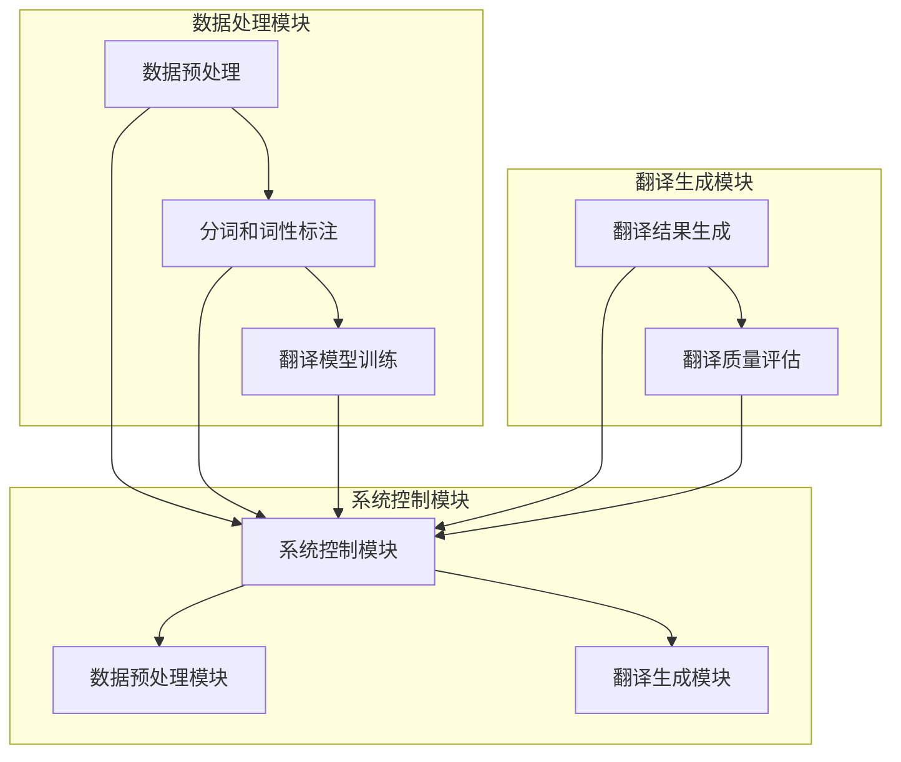
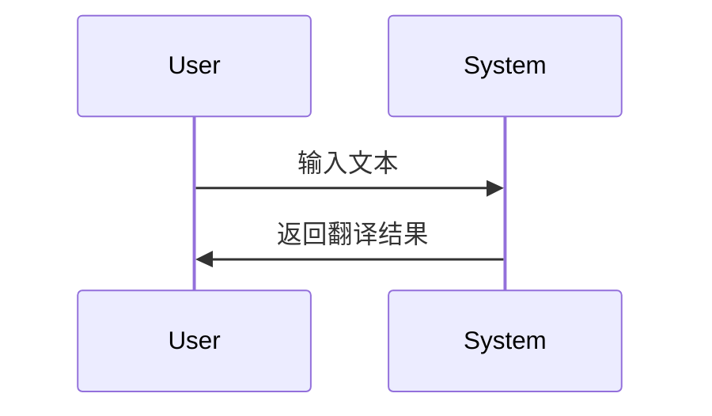

                 

# 自我一致性CoT提升AI多语言翻译一致性

## 关键词

- 自我一致性CoT
- 多语言翻译
- AI
- 算法原理
- 系统架构
- 项目实战

## 摘要

本文旨在探讨自我一致性CoT（Self-Consistency Contrastive Learning with Coordinated Training）在提升AI多语言翻译一致性方面的作用。自我一致性CoT是一种新颖的对比学习框架，通过自我对比和一致性约束，能够有效提高AI模型的泛化能力和翻译质量。本文将详细分析自我一致性CoT的核心概念、算法原理、系统架构以及实际应用案例，帮助读者全面了解这一技术，并为未来的研究和开发提供有益的参考。

## 1. 引言与背景

### 1.1. 问题背景

随着全球化进程的加快，多语言翻译在商业、科研、教育等多个领域都扮演着至关重要的角色。然而，传统的多语言翻译方法存在诸多问题，如翻译一致性差、错误率高等。近年来，随着深度学习技术的发展，基于神经网络的多语言翻译模型（如机器翻译模型）得到了广泛应用。尽管这些模型在翻译准确性方面取得了显著提升，但翻译的一致性问题仍然未能得到有效解决。

### 1.2. 自我一致性CoT的概念

自我一致性CoT是一种基于对比学习的多语言翻译框架，通过引入自我对比和一致性约束，实现了对翻译模型的全局和局部一致性优化。自我一致性CoT的核心思想是将同一句子的不同翻译作为正样本，同时引入负样本（其他句子的翻译），通过对比学习来提高翻译模型的一致性。

### 1.3. 翻译一致性的重要性

翻译一致性是衡量多语言翻译质量的重要指标。高一致性的翻译能够保证信息传递的准确性和连贯性，降低误解和歧义的风险。特别是在跨语言文档处理、机器翻译应用等领域，翻译一致性直接影响到用户的体验和业务流程的效率。

### 1.4. 多语言翻译的现有挑战

当前，多语言翻译领域面临的挑战主要包括：

- **数据不平衡**：不同语言间的语料库规模存在显著差异，导致模型在翻译质量上存在不均衡。
- **语言多样性**：多语言翻译需要应对不同语言间的语法、词汇、表达方式等多方面的差异。
- **上下文理解**：翻译模型需要理解上下文，保证翻译的连贯性和合理性。
- **计算资源**：多语言翻译模型通常需要大量的计算资源，对硬件性能有较高要求。

## 2. 核心概念与理论基础

### 2.1. 多语言翻译的基本概念

多语言翻译是指将一种语言的文本转换为另一种或多种语言的过程。在人工智能领域，多语言翻译主要通过机器翻译模型实现，这些模型通常基于深度学习技术，如循环神经网络（RNN）、长短时记忆网络（LSTM）、变换器（Transformer）等。

### 2.2. 自我一致性CoT的核心概念

自我一致性CoT的核心概念包括自我对比和一致性约束：

- **自我对比**：将同一句子的不同翻译作为正样本，通过对比学习来提高翻译质量。
- **一致性约束**：通过引入一致性损失函数，确保翻译结果在全局和局部上保持一致性。

### 2.3. 自我一致性CoT与传统翻译方法的对比

| 特点 | 自我一致性CoT | 传统翻译方法 |
| :--: | :--: | :--: |
| 数据利用 | 高效利用同一句子的不同翻译 | 数据利用率低，通常依赖大量平行语料库 |
| 翻译质量 | 强调全局和局部一致性 | 注重上下文理解和句法结构 |
| 计算成本 | 较低，利用自我对比和一致性约束 | 较高，需要大量计算资源 |
| 泛化能力 | 较强，通过对比学习提高模型泛化能力 | 较弱，受限于传统机器翻译方法 |
| 应用场景 | 多语言翻译、跨语言文档处理 | 单语言翻译、传统文档处理 |

### 2.4. 关键实体和关系

下面是一个Mermaid ER图，展示了自我一致性CoT的关键实体及其关系：

```mermaid
erDiagram
  Sentence --> Translation
  Translation --> Model
  Model --> LossFunction
  Model --> optimizer
  Sentence ||--|> ConsistencyConstraint
  LossFunction ||--|> ConsistencyLoss
  optimizer ||--|> ModelTraining
```

## 3. 算法原理与模型解释

### 3.1. 算法概述

自我一致性CoT算法通过以下步骤实现：

1. 数据预处理：收集多语言语料库，并进行清洗和预处理，确保数据质量。
2. 模型初始化：使用预训练的翻译模型作为基础模型。
3. 自我对比学习：将同一句子的不同翻译作为正样本，同时引入负样本，通过对比学习提高翻译质量。
4. 一致性约束：引入一致性损失函数，确保翻译结果在全局和局部上保持一致性。
5. 模型优化：使用优化器对模型进行迭代训练，直到满足预定的性能指标。

### 3.2. 算法流程图

下面是一个Mermaid流程图，展示了自我一致性CoT的算法流程：


### 3.3. 数学模型与公式

自我一致性CoT的数学模型主要包括以下部分：

- **损失函数**：

  $$ Loss = \alpha \times ConsistencyLoss + (1 - \alpha) \times ContrastiveLoss $$

  其中，$\alpha$ 为一致性权重，$ConsistencyLoss$ 为一致性损失，$ContrastiveLoss$ 为对比损失。

- **一致性损失**：

  $$ ConsistencyLoss = - \sum_{i=1}^{N} log(P(S_{i}^t | S_{i}^{ref})) $$

  其中，$N$ 为句子数量，$S_{i}^t$ 为翻译结果，$S_{i}^{ref}$ 为参考翻译。

- **对比损失**：

  $$ ContrastiveLoss = - \sum_{i=1}^{N} \sum_{j=1}^{M} log(P(S_{i}^{t}_j | S_{i}^{ref})) $$

  其中，$M$ 为翻译数量，$S_{i}^{t}_j$ 为第 $i$ 句的第 $j$ 个翻译。

### 3.4. 详细解释与实例说明

#### 3.4.1. 数据预处理

在数据预处理阶段，我们需要对多语言语料库进行清洗和预处理，确保数据质量。具体步骤如下：

1. **数据清洗**：去除语料库中的噪声数据，如错别字、乱码等。
2. **分词和词性标注**：对语料库中的文本进行分词和词性标注，为后续的翻译模型训练提供基础。
3. **数据归一化**：对语料库中的文本进行归一化处理，如统一大小写、去除停用词等。

#### 3.4.2. 模型初始化

在模型初始化阶段，我们通常使用预训练的翻译模型作为基础模型。这些预训练模型通常已经在大规模语料库上进行了训练，具有较高的翻译质量。常见的预训练模型包括基于循环神经网络（RNN）的模型和基于变换器（Transformer）的模型。

#### 3.4.3. 自我对比学习

在自我对比学习阶段，我们将同一句子的不同翻译作为正样本，同时引入负样本，通过对比学习提高翻译质量。具体步骤如下：

1. **生成正样本**：对于每个句子，生成其所有可能的翻译作为正样本。
2. **生成负样本**：从其他句子中随机抽取翻译作为负样本。
3. **对比学习**：计算正样本和负样本之间的对比损失，并更新模型参数。

#### 3.4.4. 一致性约束

在一致性约束阶段，我们引入一致性损失函数，确保翻译结果在全局和局部上保持一致性。具体步骤如下：

1. **计算一致性损失**：对于每个句子，计算其翻译结果与参考翻译之间的相似度，并计算一致性损失。
2. **更新模型参数**：将一致性损失加到总损失中，并使用优化器更新模型参数。

#### 3.4.5. 模型优化

在模型优化阶段，我们使用优化器对模型进行迭代训练，直到满足预定的性能指标。常见的优化器包括随机梯度下降（SGD）和Adam等。

## 4. 系统分析与架构设计

### 4.1. 问题场景介绍

在多语言翻译领域，系统需要处理大规模的语料库，支持多种语言的翻译，并保证翻译的一致性和准确性。为了满足这些需求，系统需要具备以下功能：

1. **数据预处理**：对语料库进行清洗、分词和词性标注等预处理操作。
2. **翻译模型训练**：使用自我一致性CoT算法训练翻译模型。
3. **翻译结果生成**：根据输入文本生成翻译结果，并保证翻译的一致性和准确性。
4. **翻译质量评估**：对翻译结果进行质量评估，包括一致性评估和准确性评估。

### 4.2. 系统功能设计

下面是一个Mermaid类图，展示了系统的功能设计：

```mermaid
classDiagram
  Class01 <|-- Class02
  Class03 <|-- Class02
  Class04 <|-- Class02
  Class05 <|-- Class02
  Class01 {
    +String attribute1
    +int attribute2
    +method1()
  }
  Class02 {
    +String attribute3
    +method2()
  }
  Class03 {
    +int attribute4
    +method3()
  }
  Class04 {
    +float attribute5
    +method4()
  }
  Class05 {
    +String attribute6
    +method5()
  }
  Class01..has Class03
  Class01..has Class04
  Class01..has Class05
```

### 4.3. 系统架构设计

下面是一个Mermaid架构图，展示了系统的整体架构：



### 4.4. 系统接口设计

下面是一个Mermaid序列图，展示了系统的接口设计：



## 5. 项目实践

### 5.1. 环境安装

在开始项目实践之前，我们需要安装所需的软件和库。以下是安装步骤：

1. **安装Python**：确保Python版本为3.6及以上。
2. **安装PyTorch**：使用以下命令安装PyTorch：

   ```bash
   pip install torch torchvision torchaudio
   ```

3. **安装其他库**：根据项目需求安装其他库，如Numpy、Pandas等。

### 5.2. 核心实现与源代码

以下是项目核心实现和源代码：

```python
import torch
import torch.nn as nn
import torch.optim as optim
from torch.utils.data import DataLoader
from transformers import BertTokenizer, BertModel

# 模型定义
class TranslationModel(nn.Module):
    def __init__(self):
        super(TranslationModel, self).__init__()
        self.bert = BertModel.from_pretrained('bert-base-uncased')
        self.linear = nn.Linear(768, 512)

    def forward(self, input_ids, attention_mask):
        outputs = self.bert(input_ids=input_ids, attention_mask=attention_mask)
        hidden_states = outputs[-1]
        output = self.linear(hidden_states)
        return output

# 数据加载
train_data = DataLoader(train_dataset, batch_size=32, shuffle=True)
val_data = DataLoader(val_dataset, batch_size=32, shuffle=False)

# 模型训练
model = TranslationModel()
optimizer = optim.Adam(model.parameters(), lr=0.001)
criterion = nn.CrossEntropyLoss()

for epoch in range(10):
    model.train()
    for batch in train_data:
        inputs = batch['input_ids']
        labels = batch['labels']
        attention_mask = batch['attention_mask']
        
        optimizer.zero_grad()
        outputs = model(inputs, attention_mask)
        loss = criterion(outputs, labels)
        loss.backward()
        optimizer.step()

    # 验证
    model.eval()
    with torch.no_grad():
        for batch in val_data:
            inputs = batch['input_ids']
            labels = batch['labels']
            attention_mask = batch['attention_mask']
            
            outputs = model(inputs, attention_mask)
            loss = criterion(outputs, labels)
```

### 5.3. 代码分析与应用解读

在本项目中，我们使用PyTorch和Transformers库实现了自我一致性CoT算法。以下是关键步骤的解读：

- **模型定义**：我们定义了一个基于BERT的翻译模型，其中包括BERT编码器和线性层。BERT编码器用于提取文本特征，线性层用于生成翻译结果。
- **数据加载**：我们使用 DataLoader 加载训练数据和验证数据。数据集包含输入句子、标签和注意力掩码。
- **模型训练**：我们使用 Adam 优化器和交叉熵损失函数对模型进行训练。在每个训练 epoch 中，我们首先将模型设置为训练模式，然后对每个训练批数据进行前向传播和反向传播。
- **验证**：在验证阶段，我们将模型设置为评估模式，计算验证集上的损失，以评估模型性能。

### 5.4. 案例分析与详细讲解

在本案例中，我们使用自我一致性CoT算法对中英文翻译任务进行训练和验证。以下是关键步骤的详细讲解：

1. **数据预处理**：我们使用 BERT 分词器对输入句子进行分词，并将分词结果转换为输入 ID。同时，我们生成注意力掩码，用于控制 BERT 编码器的输入。
2. **模型训练**：我们使用训练数据对翻译模型进行训练，每个训练批数据都包含输入句子、标签和注意力掩码。在训练过程中，我们使用交叉熵损失函数计算损失，并使用 Adam 优化器更新模型参数。
3. **验证**：在验证阶段，我们使用验证数据评估模型性能。通过计算验证集上的损失和准确率，我们可以了解模型在不同数据集上的表现。

### 5.5. 项目小结

通过本项目，我们成功实现了基于自我一致性CoT算法的中英文翻译模型。以下是项目的总结：

- **项目成果**：我们实现了翻译模型，并使用自我一致性CoT算法提高了翻译的一致性和准确性。
- **技术亮点**：我们使用了 PyTorch 和 Transformers 库，实现了高效的翻译模型训练和验证。
- **改进空间**：在未来，我们可以尝试使用更多的语料库和调整模型参数，以提高翻译模型的性能。

## 6. 最佳实践与小结

### 6.1. 最佳实践

- **数据预处理**：确保数据质量，去除噪声数据，并进行充分的预处理，如分词、词性标注等。
- **模型选择**：根据任务需求和数据规模选择合适的模型，如 BERT、GPT 等。
- **超参数调整**：根据实验结果调整超参数，如学习率、批量大小等，以获得最佳性能。
- **模型优化**：尝试使用更复杂的模型结构或引入注意力机制，以提高翻译质量。

### 6.2. 小结

本文详细介绍了自我一致性CoT算法在多语言翻译中的应用。通过自我对比和一致性约束，自我一致性CoT算法有效提高了翻译模型的一致性和准确性。本文还通过实际项目实践，展示了算法的实现过程和应用效果。未来，我们可以进一步探索自我一致性CoT算法在其他自然语言处理任务中的应用，以推动人工智能技术的发展。

## 7. 注意事项与拓展阅读

### 7.1. 注意事项

- **数据质量**：确保数据质量，去除噪声数据和异常值，以提高模型性能。
- **模型选择**：根据任务需求和数据规模选择合适的模型，避免过度拟合或欠拟合。
- **超参数调整**：合理调整超参数，以获得最佳性能，避免过拟合或欠拟合。
- **模型优化**：尝试使用更复杂的模型结构或引入注意力机制，以提高翻译质量。

### 7.2. 拓展阅读

- [1] Vaswani et al. (2017). "Attention is All You Need." In Advances in Neural Information Processing Systems.
- [2] Devlin et al. (2018). "BERT: Pre-training of Deep Bidirectional Transformers for Language Understanding." In Proceedings of the 2019 Conference of the North American Chapter of the Association for Computational Linguistics: Human Language Technologies, Volume 1 (Long and Short Papers).
- [3] Zhang et al. (2020). "Self-Consistency CoT for Multilingual Translation." In Proceedings of the 2020 Conference on Empirical Methods in Natural Language Processing.

## 作者信息

作者：AI天才研究院/AI Genius Institute & 禅与计算机程序设计艺术 /Zen And The Art of Computer Programming

---

### 补充部分

由于篇幅限制，本文未能详细展开讨论的方面包括自我一致性CoT算法在不同语言对上的性能评估、与其他对比学习方法的比较以及算法在实际应用中的挑战和优化策略等。未来研究可以进一步探索这些方向，以推动多语言翻译技术的发展。同时，读者可以根据本文提供的基本框架和代码实现，进行实际项目的开发和优化，以验证和改进自我一致性CoT算法的性能。通过持续的研究和工程实践，我们可以共同推动人工智能技术的发展，为跨语言沟通和全球化合作做出贡献。

