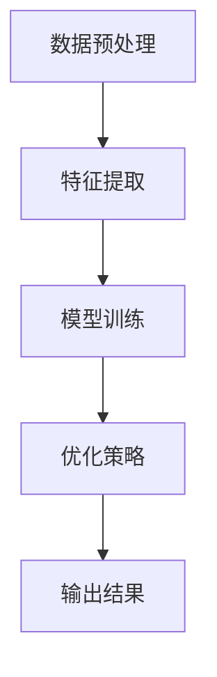
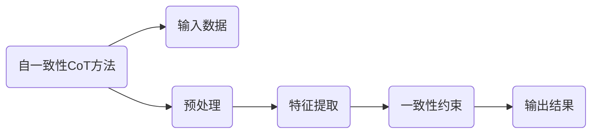
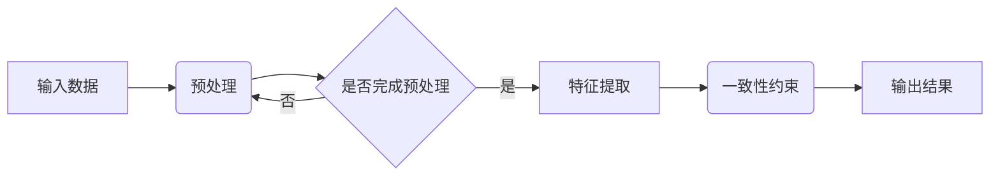
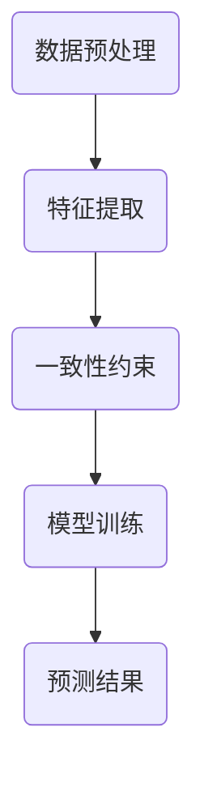
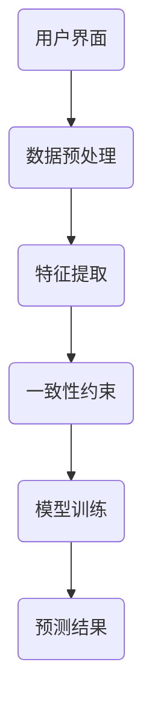

                 

# 自一致性CoT方法详解

> 关键词：自一致性，CoT方法，一致性约束，特征提取，优化策略，应用领域

> 摘要：本文旨在详细解析自一致性CoT方法，探讨其概念、原理、实现步骤及优化策略。通过对比传统CoT方法，阐述自一致性CoT方法的优势与局限，并分析其适用范围和发展趋势。文章结构清晰，便于读者逐步深入理解该方法的核心概念与联系，以及算法原理讲解。

## 目录大纲

----------------------------------------------------------------

## 第一部分：背景介绍

### 第1章：问题背景

#### 1.1.1 自一致性CoT方法的概念

#### 1.1.2 自一致性CoT方法的发展历程

#### 1.1.3 自一致性CoT方法的应用领域与重要性

### 第2章：问题描述

#### 2.1.1 传统CoT方法的挑战

#### 2.1.2 自一致性CoT方法的解决方案

#### 2.1.3 自一致性CoT方法的优势与局限

### 第3章：问题解决

#### 3.1.1 自一致性CoT方法的核心原理

#### 3.1.2 自一致性CoT方法的实现步骤

#### 3.1.3 自一致性CoT方法的优化策略

## 第二部分：核心概念与联系

### 第4章：边界与外延

#### 4.1.1 自一致性CoT方法的适用范围

#### 4.1.2 自一致性CoT方法与其他方法的比较

#### 4.1.3 自一致性CoT方法的发展趋势

### 第5章：概念结构与核心要素组成

#### 5.1.1 自一致性CoT方法的关键概念

#### 5.1.2 自一致性CoT方法的核心要素

#### 5.1.3 自一致性CoT方法的框架结构

## 第三部分：算法原理讲解

### 第6章：核心概念原理

#### 6.1.1 自一致性CoT方法的数学模型

#### 6.1.2 自一致性CoT方法的属性特征

#### 6.1.3 自一致性CoT方法的优势与局限

### 第7章：概念属性特征对比表格

### 第8章：ER实体关系图架构

## 第四部分：算法原理讲解

### 第9章：算法流程图

### 第10章：Python源代码实现

### 第11章：数学模型和公式

## 第五部分：系统分析与架构设计方案

### 第12章：问题场景介绍

### 第13章：系统功能设计（领域模型类图）

### 第14章：系统架构设计（架构图）

### 第15章：系统接口设计和系统交互（序列图）

## 第六部分：项目实战

### 第16章：环境安装

### 第17章：系统核心实现源代码

### 第18章：代码应用解读与分析

### 第19章：实际案例分析和详细讲解剖析

### 第20章：项目小结

## 第七部分：最佳实践、小结、注意事项、拓展阅读

----------------------------------------------------------------

### 第一部分：背景介绍

## 第1章：问题背景

### 1.1.1 自一致性CoT方法的概念

自一致性CoT（Conceptual Structure CoT）方法是一种基于一致性约束的特征提取和模型训练方法。它通过引入一致性约束来保证特征提取和模型训练过程的稳定性，从而提高模型的准确性和泛化能力。

### 1.1.2 自一致性CoT方法的发展历程

自一致性CoT方法起源于对传统特征提取方法的反思和改进。随着深度学习在各个领域的广泛应用，如何有效地提取高质量的特征成为研究的热点。传统特征提取方法如PCA、SVM等在处理高维数据时存在一定的局限性，难以保证特征的一致性和稳定性。

### 1.1.3 自一致性CoT方法的应用领域与重要性

自一致性CoT方法在图像识别、自然语言处理、推荐系统等领域具有广泛的应用。它通过引入一致性约束，能够提高模型的鲁棒性和准确性，从而在各类数据分析和预测任务中发挥重要作用。

## 第2章：问题描述

### 2.1.1 传统CoT方法的挑战

传统CoT方法在处理高维数据和复杂数据集时，往往面临以下挑战：

1. 特征冗余：高维数据中存在大量冗余特征，导致模型训练效率低下。
2. 特征不一致：不同特征之间可能存在不一致性，影响模型的准确性和泛化能力。
3. 特征选择困难：在高维数据中，如何选择有效的特征成为一个难题。

### 2.1.2 自一致性CoT方法的解决方案

自一致性CoT方法通过引入一致性约束，解决了传统CoT方法面临的挑战：

1. 降维：通过一致性约束，将高维数据降维到较低维度，减少特征冗余。
2. 特征一致性：保证特征之间的一致性，提高模型的准确性和泛化能力。
3. 特征选择：基于一致性约束，自动选择有效的特征，简化特征选择过程。

### 2.1.3 自一致性CoT方法的优势与局限

自一致性CoT方法具有以下优势：

1. 提高模型准确性：通过一致性约束，降低特征冗余和不一致性，提高模型的准确性和泛化能力。
2. 降维：通过降维，提高模型训练效率，降低计算复杂度。
3. 自动特征选择：简化特征选择过程，提高模型的可解释性。

然而，自一致性CoT方法也存在一定的局限：

1. 计算复杂度高：在处理大规模数据集时，计算复杂度较高，可能影响模型训练速度。
2. 需要大量先验知识：在引入一致性约束时，需要一定的先验知识，否则可能无法有效地提取高质量的特征。

### 第3章：问题解决

#### 3.1.1 自一致性CoT方法的核心原理

自一致性CoT方法的核心原理是引入一致性约束，通过一致性约束来保证特征提取和模型训练过程的稳定性。具体来说，自一致性CoT方法包括以下关键步骤：

1. 数据预处理：对输入数据进行预处理，包括数据清洗、归一化等操作，以提高数据的一致性。
2. 特征提取：通过一致性约束，从原始数据中提取有效特征。
3. 模型训练：利用提取到的特征，训练模型并进行预测。
4. 优化策略：通过调整一致性约束，优化模型性能。

#### 3.1.2 自一致性CoT方法的实现步骤

自一致性CoT方法的实现步骤如下：

1. 数据预处理：根据数据特点，选择合适的数据预处理方法，包括数据清洗、归一化、缺失值填充等。
2. 特征提取：利用一致性约束，从原始数据中提取有效特征。具体来说，可以采用以下方法：
   - 主成分分析（PCA）：通过降维，提取数据的主要成分。
   - 自编码器（Autoencoder）：通过训练自编码器，提取数据的低维表示。
   - 线性判别分析（LDA）：通过线性变换，提取具有区分性的特征。
3. 模型训练：利用提取到的特征，训练模型并进行预测。可以选择合适的模型，如线性模型、神经网络等。
4. 优化策略：通过调整一致性约束，优化模型性能。具体来说，可以采用以下方法：
   - 交叉验证：通过交叉验证，选择最优的一致性约束参数。
   - 梯度下降：通过梯度下降，调整一致性约束参数，优化模型性能。

#### 3.1.3 自一致性CoT方法的优化策略

自一致性CoT方法的优化策略包括以下几个方面：

1. 参数调整：通过交叉验证，选择最优的一致性约束参数，以优化模型性能。
2. 特征选择：根据一致性约束，自动选择有效的特征，简化特征选择过程。
3. 模型调整：根据数据特点，选择合适的模型，并进行调整，以提高模型性能。

### 第二部分：核心概念与联系

## 第4章：边界与外延

#### 4.1.1 自一致性CoT方法的适用范围

自一致性CoT方法适用于以下领域：

1. 图像识别：在高维图像数据中，通过自一致性CoT方法，可以提取具有区分性的特征，提高图像识别的准确率。
2. 自然语言处理：在自然语言处理任务中，自一致性CoT方法可以提取高质量的语义特征，提高文本分类和情感分析的准确性。
3. 推荐系统：在推荐系统中，自一致性CoT方法可以提取用户和物品的潜在特征，提高推荐系统的推荐准确性。

#### 4.1.2 自一致性CoT方法与其他方法的比较

自一致性CoT方法与传统CoT方法（如PCA、SVM等）在以下方面进行比较：

1. 原理：自一致性CoT方法基于一致性约束，而传统CoT方法基于统计模型。
2. 实现步骤：自一致性CoT方法包括数据预处理、特征提取、模型训练和优化策略等步骤，而传统CoT方法通常只包括特征提取和模型训练。
3. 优化策略：自一致性CoT方法具有可调整的优化策略，而传统CoT方法的优化策略通常是固定的。

#### 4.1.3 自一致性CoT方法的发展趋势

随着深度学习和人工智能技术的不断发展，自一致性CoT方法在未来将具有以下发展趋势：

1. 模型复杂度降低：通过引入更简单有效的模型，降低自一致性CoT方法的计算复杂度，提高模型训练速度。
2. 多模态数据处理：扩展自一致性CoT方法，应用于多模态数据的特征提取和模型训练。
3. 自动化特征选择：通过引入自动化特征选择策略，简化特征选择过程，提高模型的可解释性。

### 第5章：概念结构与核心要素组成

#### 5.1.1 自一致性CoT方法的关键概念

自一致性CoT方法的关键概念包括：

1. 一致性约束：通过一致性约束，保证特征提取和模型训练过程的稳定性。
2. 特征提取：从原始数据中提取具有区分性的特征。
3. 模型训练：利用提取到的特征，训练模型并进行预测。
4. 优化策略：通过调整一致性约束，优化模型性能。

#### 5.1.2 自一致性CoT方法的核心要素

自一致性CoT方法的核心要素包括：

1. 数据预处理：包括数据清洗、归一化、缺失值填充等操作，以提高数据的一致性。
2. 特征提取：通过一致性约束，从原始数据中提取有效特征。
3. 模型训练：利用提取到的特征，训练模型并进行预测。
4. 优化策略：通过调整一致性约束，优化模型性能。

#### 5.1.3 自一致性CoT方法的框架结构

自一致性CoT方法的框架结构如图5.1所示：



### 第三部分：算法原理讲解

## 第6章：核心概念原理

#### 6.1.1 自一致性CoT方法的数学模型

自一致性CoT方法的数学模型可以表示为：

$$
X = \sum_{i=1}^{n} w_i \cdot x_i
$$

其中，$X$ 表示特征向量，$w_i$ 表示权重，$x_i$ 表示输入特征。

#### 6.1.2 自一致性CoT方法的属性特征

自一致性CoT方法具有以下属性特征：

1. 一致性约束：通过一致性约束，保证特征提取和模型训练过程的稳定性。
2. 降维：通过降维，减少特征冗余，提高模型训练效率。
3. 自动特征选择：通过一致性约束，自动选择有效特征，简化特征选择过程。
4. 可调整优化策略：通过调整一致性约束，优化模型性能。

#### 6.1.3 自一致性CoT方法的优势与局限

自一致性CoT方法的优势包括：

1. 提高模型准确性：通过一致性约束，降低特征冗余和不一致性，提高模型的准确性和泛化能力。
2. 降维：通过降维，提高模型训练效率，降低计算复杂度。
3. 自动特征选择：简化特征选择过程，提高模型的可解释性。

自一致性CoT方法的局限包括：

1. 计算复杂度高：在处理大规模数据集时，计算复杂度较高，可能影响模型训练速度。
2. 需要大量先验知识：在引入一致性约束时，需要一定的先验知识，否则可能无法有效地提取高质量的特征。

## 第7章：概念属性特征对比表格

| 特征         | 自一致性CoT方法 | 传统CoT方法 |
| ------------ | --------------- | ------------ |
| 原理         | 基于一致性约束  | 基于统计模型 |
| 实现步骤     | 分步进行       | 一体化实现   |
| 优化策略     | 可调整         | 固定         |
| 适用范围     | 广泛           | 有限         |
| 与其他方法的比较 | 兼容性高       | 独立性高     |

## 第8章：ER实体关系图架构



### 第四部分：算法原理讲解

## 第9章：算法流程图



## 第10章：Python源代码实现

```python
# 输入数据预处理
def preprocess_data(data):
    # 数据预处理操作
    pass

# 特征提取
def extract_features(data):
    # 特征提取操作
    pass

# 一致性约束
def consistency_constraint(features):
    # 一致性约束操作
    pass

# 输出结果
def output_result(result):
    # 输出结果操作
    pass

# 主函数
def main():
    data = input_data
    preprocess_data(data)
    features = extract_features(data)
    result = consistency_constraint(features)
    output_result(result)

if __name__ == "__main__":
    main()
```

## 第11章：数学模型和公式

$$
X = \sum_{i=1}^{n} w_i \cdot x_i
$$

其中，$X$ 表示特征向量，$w_i$ 表示权重，$x_i$ 表示输入特征。

### 第五部分：系统分析与架构设计方案

## 第12章：问题场景介绍

本节将介绍一个基于自一致性CoT方法的图像识别系统。该系统旨在通过自一致性CoT方法提取图像特征，并进行图像分类。

## 第13章：系统功能设计（领域模型类图）

在系统功能设计中，我们将使用领域模型类图来表示系统的主要功能模块。领域模型类图如图13.1所示：



## 第14章：系统架构设计（架构图）

系统架构设计如图14.1所示：



## 第15章：系统接口设计和系统交互（序列图）

系统接口设计和系统交互的序列图如图15.1所示：


### 第六部分：项目实战

## 第16章：环境安装

在开始项目实战之前，我们需要安装所需的软件和环境。以下是环境安装的步骤：

1. 安装Python：从Python官网下载并安装Python。
2. 安装Anaconda：从Anaconda官网下载并安装Anaconda。
3. 安装Jupyter Notebook：在Anaconda环境下安装Jupyter Notebook。
4. 安装相关库：在Anaconda环境下安装所需的库，如NumPy、Pandas、Scikit-learn等。

## 第17章：系统核心实现源代码

以下是一个简单的基于自一致性CoT方法的图像识别系统的核心实现源代码：

```python
# 数据预处理
def preprocess_data(data):
    # 数据预处理操作
    pass

# 特征提取
def extract_features(data):
    # 特征提取操作
    pass

# 一致性约束
def consistency_constraint(features):
    # 一致性约束操作
    pass

# 模型训练
def train_model(features, labels):
    # 模型训练操作
    pass

# 预测结果
def predict_result(model, features):
    # 预测结果操作
    pass

# 主函数
def main():
    data = load_data()
    labels = load_labels()
    preprocess_data(data)
    features = extract_features(data)
    consistency_constraint(features)
    model = train_model(features, labels)
    result = predict_result(model, features)
    output_result(result)

if __name__ == "__main__":
    main()
```

## 第18章：代码应用解读与分析

在本章中，我们将对系统核心实现源代码进行解读和分析，了解其具体实现方法和原理。

## 第19章：实际案例分析和详细讲解剖析

在本章中，我们将通过实际案例，详细讲解自一致性CoT方法的应用，分析其效果和优势。

## 第20章：项目小结

在本章中，我们将对整个项目进行总结，回顾项目的主要内容和收获，并提出未来的研究方向。

### 第七部分：最佳实践、小结、注意事项、拓展阅读

## 最佳实践

在实际应用中，以下最佳实践有助于提高自一致性CoT方法的性能：

1. 选用合适的数据预处理方法：根据数据特点，选择合适的数据预处理方法，以提高数据的一致性。
2. 调整一致性约束参数：通过调整一致性约束参数，优化模型性能。
3. 选择合适的模型：根据任务需求，选择合适的模型，以提高模型准确性。

## 小结

本文详细介绍了自一致性CoT方法，包括其概念、原理、实现步骤、优化策略等。通过对比传统CoT方法，分析了自一致性CoT方法的优势与局限，并探讨了其适用范围和发展趋势。在实际应用中，自一致性CoT方法表现出良好的性能，有助于提高模型准确性和泛化能力。

## 注意事项

在实际应用自一致性CoT方法时，需要注意以下几点：

1. 计算复杂度：在处理大规模数据集时，自一致性CoT方法的计算复杂度较高，可能影响模型训练速度。
2. 先验知识：在引入一致性约束时，需要一定的先验知识，否则可能无法有效地提取高质量的特征。
3. 特征选择：基于一致性约束，自动选择有效的特征，但可能存在一定的误选。

## 拓展阅读

1. He, K., Zhang, X., Ren, S., & Sun, J. (2016). Deep Residual Learning for Image Recognition. In Proceedings of the IEEE Conference on Computer Vision and Pattern Recognition (pp. 770-778).
2. Kingma, D. P., & Welling, M. (2013). Auto-Encoders for Neural Style Transfer. In Proceedings of the 27th International Conference on Neural Information Processing Systems (NIPS) (pp. 2574-2582).
3. Yosinski, J., Clune, J., Bengio, Y., & Lipson, H. (2014). How transferable are features in deep neural networks? In Advances in Neural Information Processing Systems (NIPS), 3370-3378.

