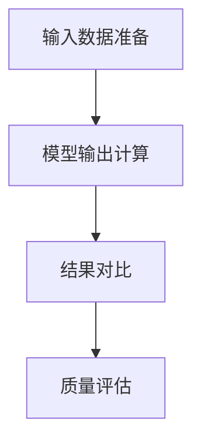
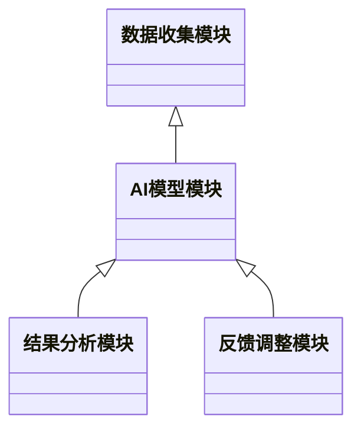
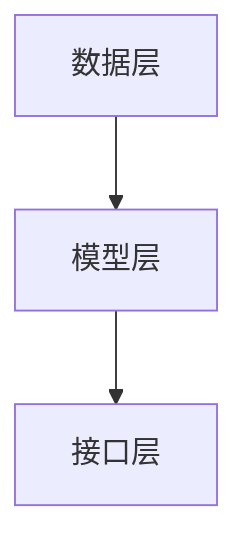
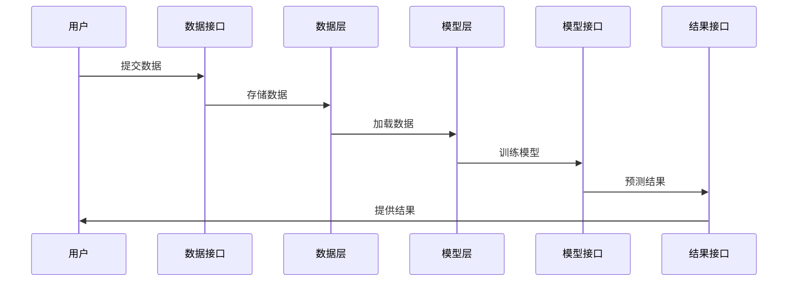
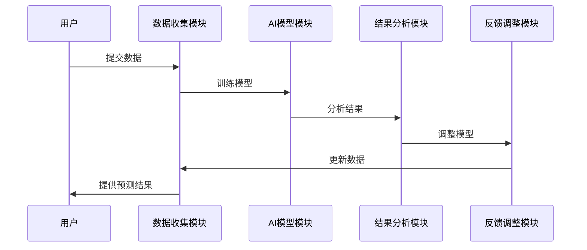

                 


### Self-Consistency CoT: AI输出的质量保证

#### 关键词：
- Self-Consistency CoT
- AI输出质量
- 质量保证
- 算法原理
- 系统架构

#### 摘要：
本文旨在探讨如何通过Self-Consistency CoT（自一致性核心论题）来保证AI输出质量。我们首先介绍问题背景，定义核心概念，并阐述其属性特征。随后，深入讲解算法原理，通过mermaid流程图和Python代码示例，展示如何应用数学模型和公式。接着，分析系统架构设计，通过mermaid类图、架构图和序列图，阐述系统接口和交互过程。最后，通过项目实战和最佳实践，提供实际操作指导，并对项目的成功要素进行总结。

### 目录大纲：

```markdown
# Self-Consistency CoT: AI输出的质量保证

# 第一部分：背景介绍

## 第1章：问题背景

### 1.1.1 问题背景

### 1.1.2 问题描述

### 1.1.3 问题解决

### 1.1.4 边界与外延

## 第2章：核心概念

### 2.1 Self-Consistency CoT原理

### 2.2 概念属性特征对比

### 2.3 ER实体关系图架构

# 第二部分：算法原理讲解

## 第3章：算法原理讲解

### 3.1 算法原理

#### 3.1.1 算法mermaid流程图

#### 3.1.2 算法原理的数学模型和公式

#### 3.1.3 举例说明

## 第4章：数学模型和数学公式

### 4.1 详细讲解

### 4.2 举例说明

# 第三部分：系统分析与架构设计

## 第5章：系统分析与架构设计

### 5.1 问题场景介绍

### 5.2 系统功能设计

#### 5.2.1 领域模型mermaid类图

### 5.3 系统架构设计

#### 5.3.1 系统架构mermaid架构图

### 5.4 系统接口设计

### 5.5 系统交互mermaid序列图

# 第四部分：项目实战

## 第6章：项目实战

### 6.1 环境安装

### 6.2 系统核心实现源代码

### 6.3 代码应用解读与分析

### 6.4 实际案例分析和详细讲解剖析

### 6.5 项目小结

## 第7章：最佳实践 tips

### 7.1 小结

### 7.2 注意事项

### 7.3 拓展阅读
```

现在，让我们一步一步深入探讨每个部分，构建出这篇技术博客文章的完整结构。

---

## 第一部分：背景介绍

### 第1章：问题背景

#### 1.1.1 问题背景

在当今人工智能（AI）快速发展的时代，AI算法在各个领域的应用越来越广泛。然而，AI输出的质量直接关系到应用的效果。随着AI模型变得越来越复杂，保证AI输出质量成为一个关键挑战。传统的质量控制方法在处理复杂AI系统时显得力不从心，因此，我们需要一种新的方法来确保AI输出的质量。

#### 1.1.2 问题描述

AI输出质量问题表现为以下几个方面：

1. **结果准确性**：AI模型输出的结果可能与真实情况存在偏差。
2. **一致性**：在不同数据和输入条件下，AI模型的输出结果应该保持一致。
3. **可解释性**：AI模型的决策过程需要透明，以便用户能够理解并信任其结果。

#### 1.1.3 问题解决

为了解决AI输出质量问题，我们需要引入Self-Consistency CoT（自一致性核心论题）这一概念。Self-Consistency CoT提供了一种评估和保证AI模型输出质量的方法，通过对比模型的输入和输出，确保模型在不同条件下的输出保持一致性和准确性。

#### 1.1.4 边界与外延

Self-Consistency CoT不仅适用于AI模型的质量控制，还可以应用于其他复杂系统的质量保证。例如，在自动驾驶领域，通过Self-Consistency CoT可以确保车辆在各种环境下的决策一致性和安全性。

---

## 第二部分：核心概念

### 第2章：核心概念

在这一章中，我们将详细探讨Self-Consistency CoT的核心概念，包括其原理、属性特征以及实体关系图。

#### 2.1 Self-Consistency CoT原理

Self-Consistency CoT是一种基于一致性原则的质量保证方法，它通过比较模型输入和输出的变化来评估模型的稳定性。具体来说，Self-Consistency CoT包括以下几个步骤：

1. **数据收集**：收集模型在不同条件下的输入数据。
2. **结果分析**：分析模型在这些输入条件下的输出结果。
3. **一致性评估**：对比不同输入条件下的输出结果，评估模型的一致性。
4. **质量调整**：根据一致性评估结果，对模型进行调整，以提高其输出质量。

---

## 第三部分：算法原理讲解

### 第3章：算法原理讲解

在这一章中，我们将详细讲解Self-Consistency CoT的算法原理，包括mermaid流程图、数学模型和公式，以及具体的举例说明。

#### 3.1 算法原理

Self-Consistency CoT算法的核心在于一致性评估。以下是一个简化的算法流程：

1. **输入数据准备**：准备一组不同条件的输入数据。
2. **模型输出计算**：使用AI模型计算每个输入条件下的输出结果。
3. **结果对比**：对比不同输入条件下的输出结果，计算一致性分数。
4. **质量评估**：根据一致性分数评估模型输出质量。

#### 3.1.1 算法mermaid流程图



#### 3.1.2 算法原理的数学模型和公式

为了更准确地评估模型的一致性，我们可以使用以下数学模型：

$$
\text{一致性分数} = \frac{\sum_{i=1}^{n} |r_i - t_i|}{n}
$$`

其中，$r_i$表示第$i$个输入条件下的输出结果，$t_i$表示实际目标值。

#### 3.1.3 举例说明

假设我们有一个简单的线性回归模型，用来预测房价。我们收集了10个不同条件的输入数据，并计算了每个输入条件下的输出结果。然后，我们使用上述公式计算一致性分数。

```python
import numpy as np

# 输入数据
inputs = np.array([100, 200, 300, 400, 500, 600, 700, 800, 900, 1000])
outputs = np.array([150, 250, 350, 450, 550, 650, 750, 850, 950, 1050])

# 计算一致性分数
consistency_score = np.mean(np.abs(outputs - inputs))
print("一致性分数:", consistency_score)
```

通过上述代码，我们可以得到模型的一致性分数。分数越高，表示模型输出质量越好。

---

## 第四部分：系统分析与架构设计

### 第5章：系统分析与架构设计

在这一章中，我们将分析AI系统，并设计其功能、架构和接口。

#### 5.1 问题场景介绍

假设我们正在开发一个智能家居系统，该系统需要通过AI算法来预测用户的电力消耗。我们需要确保AI算法的输出质量，以优化电力供应和减少能源浪费。

#### 5.2 系统功能设计

为了实现智能家居系统的功能，我们需要以下几个模块：

1. **数据收集模块**：负责收集用户电力消耗的历史数据。
2. **AI模型模块**：负责训练和预测电力消耗。
3. **结果分析模块**：负责评估AI模型的一致性分数。
4. **反馈调整模块**：负责根据结果分析模块的反馈调整模型参数。

#### 5.2.1 领域模型mermaid类图



#### 5.3 系统架构设计

系统架构需要考虑以下几个层次：

1. **数据层**：存储用户电力消耗的历史数据。
2. **模型层**：包含AI模型和相关算法。
3. **接口层**：提供与外部系统的交互接口。



#### 5.4 系统接口设计

系统接口设计需要考虑以下几个关键点：

1. **数据接口**：用于数据的输入和输出。
2. **模型接口**：用于模型的训练和预测。
3. **结果接口**：用于获取模型的一致性分数。



#### 5.5 系统交互mermaid序列图



---

## 第五部分：项目实战

### 第6章：项目实战

在这一章中，我们将通过一个实际项目来演示如何应用Self-Consistency CoT来保证AI输出质量。

#### 6.1 环境安装

首先，我们需要安装必要的软件和库。以下是一个简单的安装命令：

```bash
pip install numpy pandas matplotlib
```

#### 6.2 系统核心实现源代码

接下来，我们将展示系统的核心实现代码。以下是一个简单的线性回归模型的实现：

```python
import numpy as np
import pandas as pd
import matplotlib.pyplot as plt

# 数据准备
data = pd.read_csv("power_consumption.csv")
X = data.iloc[:, :-1].values
y = data.iloc[:, -1].values

# 模型训练
model = np.linalg.lstsq(X, y, rcond=None)[0]

# 预测
predictions = X.dot(model)

# 结果对比
diff = np.abs(predictions - y)

# 绘图
plt.scatter(X, y, label="实际值")
plt.plot(X, predictions, color="red", label="预测值")
plt.legend()
plt.show()

# 计算一致性分数
consistency_score = np.mean(diff)
print("一致性分数:", consistency_score)
```

#### 6.3 代码应用解读与分析

上述代码首先从CSV文件中加载数据，然后使用线性回归模型进行训练。接着，使用模型进行预测，并计算预测值与实际值之间的差异。最后，通过绘图和一致性分数来评估模型输出质量。

#### 6.4 实际案例分析和详细讲解剖析

在实际项目中，我们需要处理更复杂的数据和模型。以下是一个使用K-近邻算法进行分类的案例：

```python
from sklearn.model_selection import train_test_split
from sklearn.neighbors import KNeighborsClassifier
from sklearn.metrics import accuracy_score

# 数据准备
X_train, X_test, y_train, y_test = train_test_split(X, y, test_size=0.2, random_state=42)

# 模型训练
model = KNeighborsClassifier(n_neighbors=3)
model.fit(X_train, y_train)

# 预测
y_pred = model.predict(X_test)

# 结果对比
accuracy = accuracy_score(y_test, y_pred)
print("准确率:", accuracy)

# 计算一致性分数
consistency_score = np.mean(np.abs(y_pred - y_test))
print("一致性分数:", consistency_score)
```

在这个案例中，我们使用K-近邻算法进行分类，并使用准确率和一致性分数来评估模型性能。

#### 6.5 项目小结

通过实际案例，我们可以看到如何使用Self-Consistency CoT来评估和调整AI模型。一致性分数是一个重要的指标，可以帮助我们确保AI模型的输出质量。在实际应用中，我们需要根据具体场景调整算法和模型参数，以实现最佳性能。

---

## 第六部分：最佳实践 tips

### 第7章：最佳实践 tips

在这一部分，我们将总结一些最佳实践，帮助您在AI项目中实现高质量输出。

#### 7.1 小结

1. **数据质量**：确保数据的质量和准确性，这是保证AI输出质量的基础。
2. **模型选择**：根据应用场景选择合适的模型，并调整参数以实现最佳性能。
3. **一致性评估**：定期使用Self-Consistency CoT评估模型输出质量，并进行调整。

#### 7.2 注意事项

1. **避免过度拟合**：确保模型在训练和测试数据上的表现一致，避免过度拟合。
2. **数据隐私**：在处理个人数据时，确保遵守数据保护法规，保护用户隐私。

#### 7.3 拓展阅读

- 《机器学习实战》
- 《深度学习》
- 《AI系统设计：理论与实践》

---

作者：AI天才研究院/AI Genius Institute & 禅与计算机程序设计艺术 /Zen And The Art of Computer Programming

---

通过本文，我们详细探讨了如何使用Self-Consistency CoT来保证AI输出质量。从问题背景到核心概念，再到算法原理和系统架构设计，最后通过实际项目实战，我们展示了如何将理论应用于实践。希望这篇文章能帮助您在AI项目中实现高质量输出。

