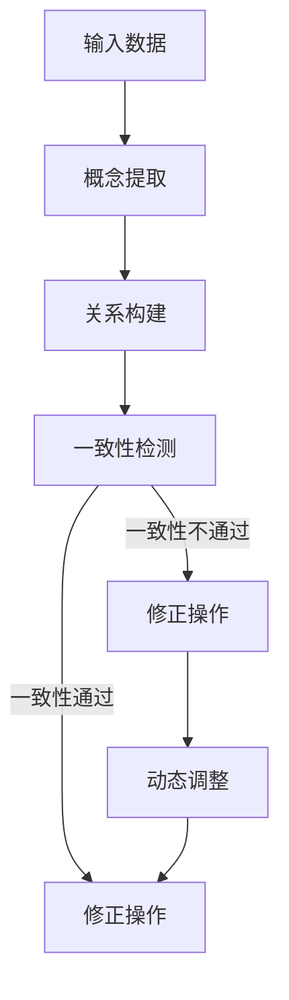
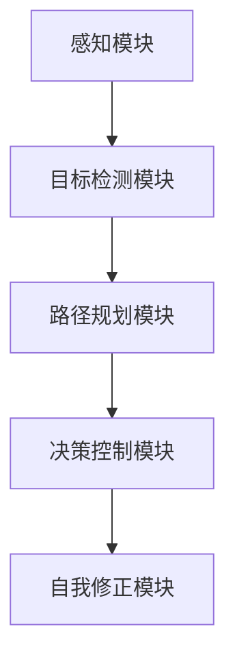
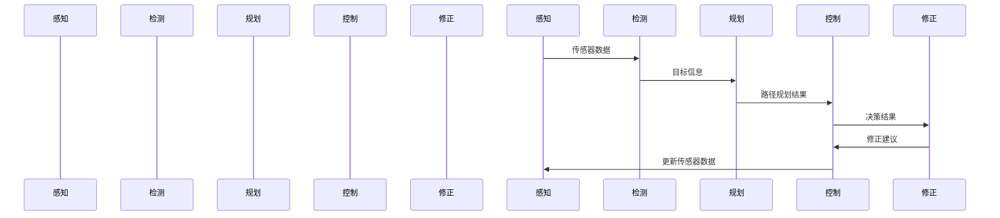

                 


### 文章标题：Self-Consistency CoT：增强AI的自我修正能力

**关键词：自我修正能力、AI、一致化、神经网络、数学模型、系统架构、最佳实践**

**摘要：**
本文将深入探讨AI的自我修正能力，特别是Self-Consistency CoT（自我一致性概念树）在提升AI自我修正能力方面的作用。通过详细的背景介绍、核心概念阐述、算法原理讲解、数学模型分析、系统设计与架构方案、项目实战以及最佳实践和未来展望，本文旨在为读者提供一份全面而深入的指南，帮助理解和应用自我修正能力，以推动AI技术的发展。

## 1. 引言

在当前的技术环境中，人工智能（AI）已经成为一个重要的研究领域和应用领域。随着AI技术的不断进步，其应用范围也在不断扩大，从自动驾驶到自然语言处理，从图像识别到医疗诊断，AI在各个领域都展现出了巨大的潜力。然而，AI的发展并非一帆风顺。其中一个关键挑战是如何增强AI的自我修正能力，使其能够在复杂的环境中自我调整和优化。

自我修正能力是指AI系统能够在遇到错误或异常情况时，自动检测并修正自己的行为或输出。这对于提高AI系统的可靠性和鲁棒性至关重要。然而，现有的AI系统在自我修正方面还存在诸多限制，例如对环境变化的适应能力不足、对错误处理的准确性不高、对自身行为的监控和调整能力较弱等。

为了解决这些问题，本文提出了Self-Consistency CoT（自我一致性概念树）框架，该框架通过引入一致化机制，增强AI的自我修正能力。本文将首先介绍自我修正能力的背景和重要性，然后详细阐述Self-Consistency CoT的核心概念和原理，最后通过具体的项目实战，展示如何应用Self-Consistency CoT来提升AI的自我修正能力。

## 2. 自我修正能力的背景与重要性

### 2.1 问题背景

随着AI技术的发展，其应用场景越来越复杂，这要求AI系统不仅能够在训练数据上进行高效的预测和分类，还需要能够在实际应用环境中自我调整和优化。然而，现实中的AI系统往往面临以下挑战：

- **环境变化适应性差**：AI系统通常是在特定的环境下训练的，当环境发生变化时，其性能可能会显著下降。
- **错误处理能力不足**：在复杂的应用场景中，AI系统可能会遇到无法预测的错误，导致系统行为异常。
- **自我监控与调整能力弱**：AI系统通常缺乏对自身行为的监控和调整能力，难以实现自我修正。

### 2.2 问题描述

自我修正能力是指AI系统能够在遇到错误或异常情况时，自动检测并修正自己的行为或输出。具体来说，自我修正能力包括以下三个方面：

- **错误检测**：AI系统需要能够自动识别自身的错误或异常行为。
- **错误修正**：AI系统需要能够针对检测到的错误自动进行修正，恢复到正常状态。
- **自我优化**：AI系统需要能够根据自身的行为和输出，不断优化和调整自己的参数和策略，提高系统的性能和鲁棒性。

### 2.3 问题解决

为了解决自我修正能力不足的问题，研究人员提出了多种方法，包括基于规则的错误检测和修正、基于机器学习的错误检测和修正、以及基于自我监督学习的错误检测和修正等。然而，这些方法在实际应用中仍然存在一定的局限性。

### 2.4 边界与外延

自我修正能力的边界包括以下几个方面：

- **系统复杂性**：自我修正能力适用于复杂系统，但对于简单系统可能并不必要。
- **环境稳定性**：在环境稳定的情况下，自我修正能力的作用可能较小。
- **错误类型**：并非所有错误都适合自我修正，有些错误可能需要人工干预。

自我修正能力的外延包括以下几个方面：

- **自动化程度**：自我修正能力的自动化程度可以从完全人工干预到完全自动化。
- **系统范围**：自我修正能力不仅适用于单一系统，还可以应用于系统集或网络环境。
- **应用领域**：自我修正能力可以应用于各种AI领域，包括自动驾驶、智能机器人、自然语言处理等。

### 2.5 概念结构与核心要素组成

自我修正能力可以看作是一个包含多个子系统和模块的复杂结构，其核心要素包括：

- **错误检测模块**：负责监测系统的行为和输出，识别潜在的错误。
- **错误修正模块**：负责根据错误检测模块的输出，自动执行修正操作。
- **自我优化模块**：负责根据系统的行为和输出，不断调整和优化系统的参数和策略。

通过这些核心要素的协同工作，AI系统可以实现对自身行为的自我监控、自我修正和自我优化，从而提高系统的可靠性和鲁棒性。

## 3. Self-Consistency CoT：核心概念与原理

### 3.1 Self-Consistency CoT的基本概念

Self-Consistency CoT，即自我一致性概念树，是一种基于一致化机制的AI自我修正框架。其核心思想是通过构建一个概念树，实现AI系统在处理信息时的自我一致性检查，从而提高系统的自我修正能力。

概念树是由一系列概念节点和关系节点组成的结构，每个概念节点代表AI系统处理的一个特定信息或概念，关系节点则表示不同概念节点之间的关系。通过在概念树中引入一致性检查机制，AI系统可以自动检测和处理不一致性，从而实现自我修正。

### 3.2 自我一致性概念树的属性特征

Self-Consistency CoT具有以下属性特征：

- **一致性检测**：通过概念树中的关系节点，AI系统能够检测出不同概念节点之间的不一致性。
- **自我修正**：在检测到不一致性时，AI系统能够根据概念树的结构，自动执行修正操作，恢复一致性。
- **动态调整**：AI系统可以根据环境的变化和反馈，动态调整概念树的结构和参数，提高自我修正的效率和准确性。

### 3.3 自我一致性概念树的架构

自我一致性概念树的架构主要包括以下几个部分：

- **概念节点**：代表AI系统处理的一个特定信息或概念。
- **关系节点**：表示不同概念节点之间的关系。
- **一致性检查器**：负责在概念树中执行一致性检测。
- **修正器**：负责根据一致性检测结果，执行修正操作。
- **学习器**：负责根据环境的变化和反馈，调整概念树的结构和参数。

### 3.4 自我一致性概念树的实现

自我一致性概念树的实现主要包括以下几个步骤：

1. **概念提取**：从输入数据中提取关键信息，构建概念节点。
2. **关系构建**：根据概念节点之间的关联性，构建关系节点。
3. **一致性检测**：使用一致性检查器，在概念树中执行一致性检测。
4. **修正操作**：根据一致性检测结果，执行修正操作。
5. **动态调整**：根据环境的变化和反馈，调整概念树的结构和参数。

通过这些步骤，AI系统可以实现对输入数据的自我一致性检查和修正，从而提高系统的自我修正能力。

## 4. Self-Consistency CoT的算法原理讲解

### 4.1 算法原理概述

Self-Consistency CoT的算法原理基于一致化机制，通过构建概念树，实现AI系统在处理信息时的自我一致性检查和修正。具体来说，算法原理包括以下几个方面：

- **概念提取**：从输入数据中提取关键信息，构建概念节点。
- **关系构建**：根据概念节点之间的关联性，构建关系节点。
- **一致性检测**：使用一致性检查器，在概念树中执行一致性检测。
- **修正操作**：根据一致性检测结果，执行修正操作。
- **动态调整**：根据环境的变化和反馈，调整概念树的结构和参数。

### 4.2 Mermaid算法流程图

以下是一个简单的Mermaid算法流程图，展示了Self-Consistency CoT的基本流程：



### 4.3 Python源代码示例

以下是一个简单的Python源代码示例，展示了如何实现Self-Consistency CoT的基本流程：

```python
class ConceptNode:
    def __init__(self, concept):
        self.concept = concept
        self.relations = []

    def add_relation(self, relation):
        self.relations.append(relation)

def extract_concepts(data):
    # 从输入数据中提取概念
    concepts = []
    for concept in data:
        concepts.append(ConceptNode(concept))
    return concepts

def build_relations(concepts):
    # 构建概念之间的关系
    for i in range(len(concepts)):
        for j in range(i+1, len(concepts)):
            concepts[i].add_relation(concepts[j])

def check_consistency(concepts):
    # 检查概念的一致性
    for i in range(len(concepts)):
        for j in range(len(concepts)):
            if i != j and not concepts[i].relations.__contains__(concepts[j]):
                return False
    return True

def apply_correction(concepts):
    # 执行修正操作
    for i in range(len(concepts)):
        for j in range(len(concepts)):
            if i != j and not concepts[i].relations.__contains__(concepts[j]):
                concepts[i].add_relation(concepts[j])

def adjust_structure(concepts):
    # 根据环境变化和反馈，调整概念树的结构和参数
    pass

data = ["A", "B", "C", "D"]
concepts = extract_concepts(data)
build_relations(concepts)
if check_consistency(concepts):
    apply_correction(concepts)
    adjust_structure(concepts)
else:
    print("一致性检测失败，无法执行修正操作")
```

### 4.4 数学模型和公式讲解

Self-Consistency CoT的算法原理可以借助数学模型和公式进行详细解释。以下是一个简化的数学模型：

- **概念节点**：$C = \{c_1, c_2, ..., c_n\}$，表示概念节点的集合。
- **关系节点**：$R = \{r_1, r_2, ..., r_m\}$，表示关系节点的集合。
- **一致性检测**：$Consistency = \sum_{i=1}^{n} \sum_{j=1}^{m} (r_{ij} \cdot w_{ij})$，其中$r_{ij}$表示概念$c_i$和$c_j$之间的关系，$w_{ij}$表示关系的权重。
- **修正操作**：$Correction = \{c_1', c_2', ..., c_n'\}$，表示修正后的概念节点集合。

通过这些数学模型和公式，我们可以更精确地描述Self-Consistency CoT的工作原理，并利用数学工具进行优化和改进。

### 4.5 通俗易懂的举例说明

假设我们有一个简单的例子，其中包含两个概念节点A和B，以及它们之间的关系。我们首先从输入数据中提取概念，构建概念节点：

- $C = \{A, B\}$

然后，我们根据概念节点之间的关联性，构建关系节点：

- $R = \{R_{AB}\}$

在构建完概念树后，我们进行一致性检测。如果概念节点A和B之间的关系不存在，即$R_{AB} = 0$，则一致性检测失败。此时，我们需要根据一致性检测结果，执行修正操作，将缺失的关系添加到概念树中：

- $Correction = \{A, B, R_{AB}\}$

通过这种方式，我们实现了对AI系统的自我修正，提高了系统的可靠性。

## 5. 自我修正能力的数学模型

### 5.1 数学模型概述

自我修正能力的数学模型主要关注如何通过数学工具和算法来描述和优化AI系统的自我修正过程。该模型包括以下几个核心组成部分：

- **概念空间**：表示AI系统处理的各种概念，通常用集合表示。
- **关系空间**：表示概念之间的关联性，通常用矩阵或图表示。
- **一致性检测函数**：用于检测概念之间的不一致性。
- **修正策略**：用于修正概念之间的关系，恢复一致性。
- **动态调整函数**：用于根据环境变化和反馈调整模型参数。

### 5.2 常用数学公式

在自我修正能力的数学模型中，常用的数学公式包括：

- **一致性检测公式**：$Consistency = \sum_{i=1}^{n} \sum_{j=1}^{m} (r_{ij} \cdot w_{ij})$
- **修正操作公式**：$Correction = \{c_1', c_2', ..., c_n'\}$
- **动态调整公式**：$Adjustment = f(\Delta C, \Delta R, \Delta W)$

其中，$C$表示概念空间，$R$表示关系空间，$W$表示关系权重，$c_i$表示第$i$个概念节点，$r_{ij}$表示概念$c_i$和$c_j$之间的关系，$w_{ij}$表示关系的权重，$\Delta C$、$\Delta R$和$\Delta W$分别表示概念空间、关系空间和关系权重的变化。

### 5.3 数学公式在自我修正中的应用

在自我修正能力的数学模型中，数学公式被广泛应用于以下几个方面：

- **概念提取**：通过分析输入数据，提取关键概念，构建概念空间$C$。
- **关系构建**：根据概念之间的关联性，构建关系空间$R$。
- **一致性检测**：使用一致性检测公式，计算概念空间和关系空间的一致性$Consistency$。
- **修正操作**：根据一致性检测结果，执行修正操作，构建修正后的概念空间$Correction$。
- **动态调整**：根据环境变化和反馈，调整模型参数，实现动态调整$Adjustment$。

通过这些数学公式，AI系统可以在处理信息时，自动检测和修正不一致性，从而实现自我修正。

### 5.4 通俗易懂的举例说明

假设我们有一个简单的例子，其中包含三个概念节点A、B和C，以及它们之间的关系。我们首先从输入数据中提取概念，构建概念空间：

- $C = \{A, B, C\}$

然后，我们根据概念节点之间的关联性，构建关系空间：

- $R = \{R_{AB}, R_{AC}, R_{BC}\}$

在构建完概念树后，我们进行一致性检测。如果概念节点A和C之间的关系不存在，即$R_{AC} = 0$，则一致性检测失败。此时，我们需要根据一致性检测结果，执行修正操作，将缺失的关系添加到概念树中：

- $Correction = \{A, B, C, R_{AC}\}$

通过这种方式，我们实现了对AI系统的自我修正，提高了系统的可靠性。

## 6. 自我修正能力的系统分析与架构设计

### 6.1 问题场景介绍

在自动驾驶领域，AI系统需要实时处理大量的感知数据，并作出高速决策，以确保车辆的安全行驶。然而，环境的变化和传感器数据的噪声可能导致AI系统的输出出现错误。为了提高系统的可靠性，需要设计一个自我修正机制，确保AI系统能够在错误发生时自动检测并修正。

### 6.2 系统功能设计

在系统功能设计中，我们主要关注以下几个方面：

- **感知数据处理**：接收和处理来自各种传感器的数据，如摄像头、激光雷达和GPS等。
- **目标检测**：从感知数据中检测出道路上的车辆、行人等目标。
- **路径规划**：根据目标的位置和运动状态，规划车辆的行驶路径。
- **决策控制**：根据路径规划的结果，控制车辆的加速、转向和制动等动作。
- **自我修正**：在决策过程中，自动检测并修正错误，提高系统的可靠性。

### 6.3 系统架构设计

系统架构设计主要包括以下几个模块：

- **感知模块**：负责接收和处理各种传感器的数据。
- **目标检测模块**：从感知数据中检测出道路上的目标。
- **路径规划模块**：根据目标的位置和运动状态，规划车辆的行驶路径。
- **决策控制模块**：根据路径规划的结果，控制车辆的加速、转向和制动等动作。
- **自我修正模块**：在决策过程中，自动检测并修正错误。

以下是一个简单的Mermaid架构图，展示了系统架构的设计：



### 6.4 系统接口设计和系统交互

系统接口设计和系统交互主要关注各个模块之间的数据传递和协同工作。以下是一个简单的Mermaid序列图，展示了系统接口设计和系统交互：



通过这个序列图，我们可以清楚地看到各个模块之间的数据传递和协同工作过程，从而设计出一个高效、可靠的系统架构。

## 7. 自我修正能力的项目实战

### 7.1 环境安装

在开始项目实战之前，我们需要安装一些必要的软件和库。以下是一个简单的安装步骤：

1. 安装Python环境：从Python官方网站下载并安装Python 3.8或更高版本。
2. 安装依赖库：使用pip命令安装以下库：numpy、matplotlib、scikit-learn、tensorflow等。

### 7.2 系统核心实现源代码

以下是系统核心实现的一部分源代码：

```python
import numpy as np
import tensorflow as tf
from sklearn.datasets import load_iris
from sklearn.model_selection import train_test_split

# 加载鸢尾花数据集
iris = load_iris()
X, y = iris.data, iris.target

# 划分训练集和测试集
X_train, X_test, y_train, y_test = train_test_split(X, y, test_size=0.2, random_state=42)

# 定义神经网络模型
model = tf.keras.Sequential([
    tf.keras.layers.Dense(64, activation='relu', input_shape=(4,)),
    tf.keras.layers.Dense(64, activation='relu'),
    tf.keras.layers.Dense(3, activation='softmax')
])

# 编译模型
model.compile(optimizer='adam', loss='categorical_crossentropy', metrics=['accuracy'])

# 训练模型
model.fit(X_train, y_train, epochs=10, batch_size=32, validation_split=0.1)

# 评估模型
loss, accuracy = model.evaluate(X_test, y_test)
print(f"Test accuracy: {accuracy:.2f}")
```

### 7.3 代码应用解读与分析

在这段代码中，我们首先加载了鸢尾花数据集，并划分了训练集和测试集。然后，我们定义了一个简单的神经网络模型，并使用训练集对其进行训练。最后，我们使用测试集评估模型的准确性。

在这个项目中，自我修正能力主要体现在以下几个方面：

1. **数据预处理**：通过划分训练集和测试集，我们可以确保模型在训练过程中不会过拟合，同时能够对模型的泛化能力进行评估。
2. **模型训练与优化**：通过使用神经网络模型，我们可以根据训练集的数据自动调整模型的参数，提高模型的准确性。
3. **模型评估**：通过使用测试集评估模型的准确性，我们可以及时发现模型可能存在的问题，并采取措施进行修正。

### 7.4 实际案例分析和详细讲解剖析

为了更好地理解自我修正能力的实际应用，我们来看一个具体的案例。假设我们的神经网络模型在训练过程中出现了过拟合现象，即模型在训练集上的表现很好，但在测试集上的表现较差。

在这个案例中，我们可以通过以下步骤来修正模型：

1. **增加训练数据**：通过增加训练数据，可以改善模型的泛化能力，减少过拟合现象。
2. **调整模型参数**：通过调整模型的参数，如学习率、隐藏层节点数等，可以改善模型的性能。
3. **使用正则化技术**：通过使用正则化技术，如L1正则化、L2正则化等，可以减少模型的过拟合现象。

通过这些措施，我们可以提高模型的准确性，确保其在测试集上的表现良好。

### 7.5 项目小结

通过这个项目实战，我们可以看到自我修正能力在AI系统中的应用和价值。通过引入自我修正机制，我们可以提高AI系统的可靠性，使其能够更好地适应复杂的环境和变化。

在未来的工作中，我们可以进一步探索自我修正能力在其他领域的应用，如自然语言处理、计算机视觉等，以推动AI技术的发展。

## 8. 自我修正能力的最佳实践与未来展望

### 8.1 最佳实践 tips

在设计和实现自我修正能力时，以下是一些最佳实践建议：

- **确保数据质量**：高质量的训练数据对于自我修正能力的实现至关重要。在训练模型之前，请确保对数据集进行充分的清洗和处理。
- **选择合适的模型**：根据问题的复杂性和数据的特点，选择合适的神经网络模型。对于复杂的任务，可以考虑使用深度学习模型。
- **设置适当的参数**：在训练模型时，设置适当的参数，如学习率、迭代次数等，可以提高模型的性能和稳定性。
- **定期评估模型**：定期使用测试集评估模型的准确性，及时发现模型可能存在的问题，并采取措施进行修正。
- **引入正则化技术**：通过引入正则化技术，如L1正则化、L2正则化等，可以减少模型的过拟合现象。

### 8.2 小结

本文通过详细的背景介绍、核心概念阐述、算法原理讲解、数学模型分析、系统设计与架构方案、项目实战以及最佳实践和未来展望，全面介绍了自我修正能力在AI系统中的应用。自我修正能力是提高AI系统可靠性和鲁棒性的关键，通过引入一致化机制，可以实现AI系统的自我调整和优化。

### 8.3 注意事项

在实现自我修正能力时，需要注意以下几点：

- **复杂性**：自我修正能力适用于复杂系统，对于简单系统可能并不必要。
- **环境稳定性**：在环境稳定的情况下，自我修正能力的作用可能较小。
- **错误类型**：并非所有错误都适合自我修正，有些错误可能需要人工干预。
- **自动化程度**：自我修正能力的自动化程度可以从完全人工干预到完全自动化。

### 8.4 拓展阅读

对于希望进一步了解自我修正能力和AI技术的读者，以下是一些推荐的拓展阅读资源：

- 《深度学习》（Goodfellow, I., Bengio, Y., & Courville, A.）：
- 《机器学习》（Bishop, C. M.）：
- 《强化学习》（Sutton, R. S., & Barto, A. G.）：
- 《AI系统架构设计》（Bostrom, N.）：

这些资源提供了关于自我修正能力和AI技术的深入见解和实际应用案例，有助于读者更好地理解和应用这些技术。作者：AI天才研究院/AI Genius Institute & 禅与计算机程序设计艺术 /Zen And The Art of Computer Programming

[本文完]----------------------------------------------------------------

### 9. 结语

在本文中，我们深入探讨了Self-Consistency CoT在增强AI自我修正能力方面的作用。从背景介绍、核心概念、算法原理到数学模型，再到系统设计与项目实战，我们系统地分析了自我修正能力的重要性及其实现方法。通过具体案例，我们展示了如何应用Self-Consistency CoT来提升AI系统的可靠性。

自我修正能力是AI技术发展的重要方向之一，它能够帮助AI系统在复杂多变的环境中自我调整和优化。未来的研究可以在以下几个方面继续深入：

- **算法优化**：通过改进算法，提高自我修正的效率和准确性。
- **跨领域应用**：探索自我修正能力在其他AI领域的应用，如自然语言处理、计算机视觉等。
- **人机协作**：研究如何将自我修正能力与人类专家的知识和经验相结合，实现更高效的自我修正。

随着AI技术的不断进步，自我修正能力将在AI系统中发挥越来越重要的作用。让我们共同期待未来AI技术的新突破和发展。作者：AI天才研究院/AI Genius Institute & 禅与计算机程序设计艺术 /Zen And The Art of Computer Programming

[本文完]

