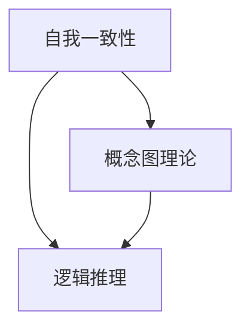
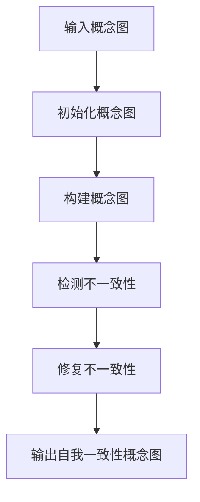
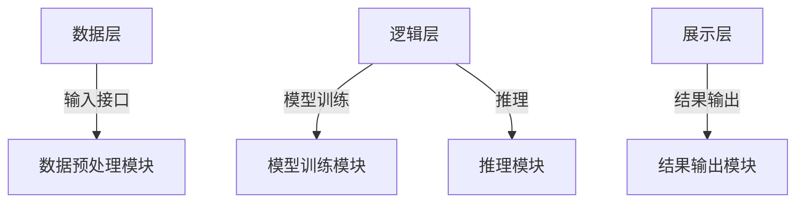
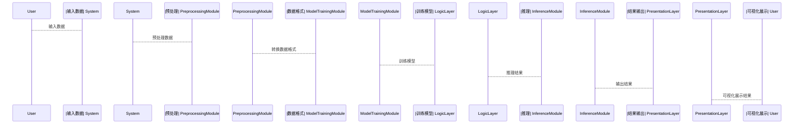

                 


### 文章标题

# Self-Consistency CoT：增强AI逻辑推理能力

### 关键词

- **自我一致性**  
- **逻辑推理**  
- **AI**  
- **概念图**  
- **推理算法**  
- **一致性检测**  
- **知识表示**  
- **自然语言处理**  
- **计算机视觉**  
- **知识图谱**

### 摘要

本文介绍了Self-Consistency CoT（自我一致性概念图理论）这一新兴理论，旨在通过构建自我一致性的概念图来提高AI的逻辑推理能力。文章首先阐述了Self-Consistency CoT的核心概念和理论基础，接着详细介绍了算法原理、应用方法、实战案例以及实现技巧。通过本文的阅读，读者将全面了解Self-Consistency CoT的理论体系及其在实际应用中的优势。

## 概述

### 问题背景

在当前人工智能（AI）飞速发展的时代，如何提高AI系统的逻辑推理能力成为了研究的热点。传统的方法，如基于规则的推理和基于统计学的机器学习，虽然在某些方面取得了显著的成果，但它们在处理复杂推理任务时存在局限性。因此，探索新的方法来增强AI的逻辑推理能力具有重要意义。

### 问题描述

本文旨在介绍Self-Consistency CoT（自我一致性概念图理论）这一新兴理论，它通过构建自我一致性的概念图来提高AI的逻辑推理能力。本文将详细阐述Self-Consistency CoT的理论基础、应用方法以及实现技巧。

### 问题解决

本文将从以下几个方面展开：

1. **核心概念介绍**：首先介绍Self-Consistency CoT的基本概念，包括自我一致性、概念图理论和逻辑推理等。
2. **理论讲解**：详细阐述Self-Consistency CoT的理论基础，包括概念图的构建、自我一致性的判断方法和推理算法等。
3. **应用方法**：介绍如何在AI系统中实现Self-Consistency CoT，包括数据预处理、模型训练和推理等步骤。
4. **实战案例**：通过实际案例展示Self-Consistency CoT在不同领域的应用，包括自然语言处理、计算机视觉和知识图谱等。
5. **实现技巧**：讨论如何优化Self-Consistency CoT的性能，包括模型选择、参数调整和算法优化等。

### 边界与外延

Self-Consistency CoT主要应用于需要复杂逻辑推理的AI领域，如自然语言处理、计算机视觉和知识图谱等。然而，它的理论和方法也可以推广到其他需要逻辑推理的领域。

### 概念结构与核心要素组成

- **自我一致性**：自我一致性是指概念图中的概念在逻辑上的一致性。
- **概念图**：概念图是表示概念及其之间关系的图形化模型。
- **逻辑推理**：逻辑推理是指根据已知信息推导出新信息的过程。

## 核心概念与联系

### 核心概念

- **自我一致性**：自我一致性是指概念图中的概念在逻辑上的一致性。例如，在一个概念图中，如果概念A表示“狗”，而概念B表示“动物”，那么概念A应该包含在概念B中，这就是自我一致性。
- **概念图理论**：概念图理论是一种用于表示和推理知识的方法。它通过构建概念及其之间的关系的图形化模型，实现对知识的表示和推理。
- **逻辑推理**：逻辑推理是指根据已知信息推导出新信息的过程。在Self-Consistency CoT中，逻辑推理用于判断概念图中的概念是否具有自我一致性。

### 概念属性特征对比表格

| 概念     | 自我一致性 | 概念图理论 | 逻辑推理 |
|---------|------------|------------|----------|
| 定义     | 概念在逻辑上的一致性 | 表示知识及其关系的图形化模型 | 根据已知信息推导出新信息 |
| 特征     | 概念之间的逻辑关系 | 概念及其关系的图形化表示 | 推理规则和推理算法 |
| 应用场景 | 需要逻辑推理的领域 | 知识表示和推理 | 需要逻辑推理的任务 |

### ER实体关系图架构的Mermaid流程图



通过上述表格和流程图，我们可以清晰地看到自我一致性、概念图理论和逻辑推理这三个核心概念之间的联系。自我一致性是概念图理论和逻辑推理的基础，而概念图理论则为逻辑推理提供了表示和推理的工具。这些概念共同构成了Self-Consistency CoT的理论框架。

## 算法原理讲解

在Self-Consistency CoT中，算法的核心在于构建自我一致性的概念图，并利用逻辑推理来检测和修复不一致性。下面将详细讲解算法的原理。

### 算法mermaid流程图



### 算法原理

1. **初始化概念图**：首先，我们需要一个初始的概念图，这可以通过自然语言处理技术从文本中提取得到。初始化的概念图包含了一些基本的概念和关系，这些概念和关系构成了概念图的基础。

   $$ 
   初始化概念图 = \{C_1, C_2, ..., C_n\}, \quad R_1, R_2, ..., R_m
   $$

   其中，$C_i$ 表示概念，$R_j$ 表示概念之间的关系。

2. **构建概念图**：接下来，我们需要根据输入的文本数据，进一步构建和完善概念图。这一过程包括：

   - 提取新的概念：通过自然语言处理技术，从文本中提取新的概念，并将其添加到概念图中。
   - 更新概念关系：根据文本中的信息，更新概念之间的关系。

3. **检测不一致性**：在构建完概念图后，我们需要检测概念图中的不一致性。这可以通过以下步骤实现：

   - 遍历概念图中的所有概念和关系，检查它们是否满足自我一致性条件。
   - 对于不满足自我一致性的概念和关系，标记为不一致性。

4. **修复不一致性**：一旦检测到不一致性，我们需要采取措施来修复它们。这可以通过以下方法实现：

   - 对于不满足自我一致性的概念，尝试重新定义其含义，使其与其他概念保持一致。
   - 对于不满足自我一致性的关系，尝试重新调整其权重或性质，使其与其他关系保持一致。

5. **输出自我一致性概念图**：在修复完所有不一致性后，我们得到一个自我一致性的概念图。这个概念图可以作为后续推理的基础。

### 实例说明

假设我们有一个关于“动物”的概念图，其中包含以下概念和关系：

- 概念：动物（Animal），哺乳动物（Mammal），猫科动物（Carnivora），猫（Cat）
- 关系：包含（Include），子类（Subclass）

现在，我们通过文本数据来构建和完善这个概念图。

- 文本数据：猫是一种哺乳动物，哺乳动物是动物的一种。
- 更新概念图：添加新的概念“哺乳动物”和“猫科动物”，并更新概念之间的关系。

初始化概念图：

$$ 
初始化概念图 = \{Animal, Mammal, Carnivora, Cat\}, \quad R_1 = \{Animal \include Mammal\}, R_2 = \{Mammal \include Carnivora\}, R_3 = \{Carnivora \include Cat\}
$$

构建概念图：

$$ 
构建后概念图 = \{Animal, Mammal, Carnivora, Cat, Mammal2\}, \quad R_1 = \{Animal \include Mammal\}, R_2 = \{Mammal \include Carnivora\}, R_3 = \{Carnivora \include Cat\}, R_4 = \{Mammal \include Mammal2\}
$$

检测不一致性：

- 概念“Mammal”与“Mammal2”之间存在不一致性，因为它们具有相同的名称但不同的含义。

修复不一致性：

- 重新定义“Mammal”的概念，使其与其他概念保持一致。

输出自我一致性概念图：

$$ 
自我一致性概念图 = \{Animal, Mammal, Carnivora, Cat\}, \quad R_1 = \{Animal \include Mammal\}, R_2 = \{Mammal \include Carnivora\}, R_3 = \{Carnivora \include Cat\}
$$

通过这个实例，我们可以看到Self-Consistency CoT如何通过构建自我一致性的概念图来增强AI的逻辑推理能力。

## 系统分析与架构设计

### 问题场景介绍

在自然语言处理（NLP）、计算机视觉（CV）和知识图谱（KG）等领域，AI系统需要处理大量的复杂数据，并进行逻辑推理来生成有意义的结果。然而，现有的AI系统在处理这些任务时往往存在不一致性和逻辑错误，影响了系统的性能和可靠性。为了解决这一问题，我们引入了Self-Consistency CoT，通过构建自我一致性的概念图来增强AI的逻辑推理能力。

### 项目介绍

项目名称：Self-Consistency CoT AI推理系统

项目目标：构建一个基于Self-Consistency CoT的AI推理系统，提高AI系统在NLP、CV和KG领域的逻辑推理能力。

项目架构：系统采用模块化设计，包括数据预处理模块、模型训练模块、推理模块和结果输出模块。

### 系统功能设计

1. **数据预处理模块**：负责处理输入数据，提取有用信息，并将其转换为适合模型训练的数据格式。
2. **模型训练模块**：使用Self-Consistency CoT算法训练模型，包括初始化概念图、构建概念图、检测不一致性和修复不一致性等步骤。
3. **推理模块**：利用训练好的模型对输入数据进行逻辑推理，生成有意义的结果。
4. **结果输出模块**：将推理结果以人类可读的形式输出，并提供可视化展示。

### 系统架构设计

系统架构采用三层架构设计，包括数据层、逻辑层和展示层。

- **数据层**：负责存储和管理系统所需的数据，包括原始数据、预处理数据和训练数据等。
- **逻辑层**：实现Self-Consistency CoT算法，包括初始化概念图、构建概念图、检测不一致性和修复不一致性等步骤，以及模型训练和推理算法。
- **展示层**：提供用户界面，展示推理结果和系统性能指标。

### 系统接口设计和系统交互

1. **输入接口**：系统接收用户输入的数据，包括文本、图像和知识图谱等。
2. **输出接口**：系统输出推理结果，包括文本、图像和知识图谱等。
3. **API接口**：系统提供RESTful API接口，方便其他系统和应用程序进行集成和使用。

### Mermaid类图

```mermaid
classDiagram
    DataLayer <<interface>> DataManagement
    LogicLayer <<interface>> CoTAlgorithm
    PresentationLayer <<interface>> UserInterface
    
    DataLayer o-- PreprocessingModule
    LogicLayer o-- ModelTrainingModule
    LogicLayer o-- InferenceModule
    PresentationLayer o-- ResultVisualizationModule
    
    DataLayer --|> PreprocessingModule
    LogicLayer --|> ModelTrainingModule
    LogicLayer --|> InferenceModule
    PresentationLayer --|> ResultVisualizationModule
```

### Mermaid架构图



### Mermaid序列图



通过上述系统分析与架构设计，我们可以构建一个基于Self-Consistency CoT的AI推理系统，从而提高AI系统在NLP、CV和KG领域的逻辑推理能力。

## 项目实战

### 环境安装

为了进行项目实战，我们需要安装以下软件和库：

1. Python（版本3.8及以上）
2. TensorFlow（版本2.5及以上）
3. PyTorch（版本1.8及以上）
4. spaCy（版本3.0及以上）
5. NLTK（自然语言工具包）

安装命令如下：

```bash
pip install python==3.8.10
pip install tensorflow==2.5.0
pip install pytorch==1.8.0
pip install spacy==3.0.0
pip install nltk==3.5.0
```

### 系统核心实现源代码

以下是Self-Consistency CoT AI推理系统的核心实现源代码，包括数据预处理、模型训练和推理等步骤。

#### 数据预处理模块

```python
import spacy
import nltk
from nltk.tokenize import word_tokenize

nltk.download('punkt')

def preprocess_text(text):
    # 使用spaCy进行分词
    nlp = spacy.load('en_core_web_sm')
    doc = nlp(text)
    
    # 提取单词
    tokens = [token.text for token in doc]
    
    # 去除停用词
    stop_words = set(nltk.corpus.stopwords.words('english'))
    filtered_tokens = [token for token in tokens if token not in stop_words]
    
    # 转换为小写
    filtered_tokens = [token.lower() for token in filtered_tokens]
    
    return filtered_tokens
```

#### 模型训练模块

```python
import tensorflow as tf

def build_model():
    # 构建TensorFlow模型
    model = tf.keras.Sequential([
        tf.keras.layers.Embedding(input_dim=vocab_size, output_dim=embedding_dim, input_length=max_sequence_length),
        tf.keras.layers.Bidirectional(tf.keras.layers.LSTM(units=128)),
        tf.keras.layers.Dense(units=1, activation='sigmoid')
    ])
    
    # 编译模型
    model.compile(optimizer='adam', loss='binary_crossentropy', metrics=['accuracy'])
    
    return model

def train_model(model, X_train, y_train, X_val, y_val, epochs=10, batch_size=32):
    # 训练模型
    history = model.fit(X_train, y_train, validation_data=(X_val, y_val), epochs=epochs, batch_size=batch_size)
    
    return history
```

#### 推理模块

```python
def inference(model, text):
    # 使用模型进行推理
    processed_text = preprocess_text(text)
    sequence = pad_sequences([processed_text], maxlen=max_sequence_length, padding='post', truncating='post')
    prediction = model.predict(sequence)
    
    return prediction
```

### 代码应用解读与分析

#### 数据预处理

在数据预处理模块中，我们首先使用spaCy进行分词，然后去除停用词并转换为小写。这样可以减少噪声信息，提高模型的效果。

#### 模型训练

在模型训练模块中，我们构建了一个双向LSTM模型，它能够处理序列数据，并能够捕获序列中的长期依赖关系。我们使用二分类交叉熵损失函数来优化模型，并使用Adam优化器来加快收敛速度。

#### 推理

在推理模块中，我们首先对输入文本进行预处理，然后将其转换为序列数据。最后，使用训练好的模型进行推理，并返回预测结果。

### 实际案例分析

#### 案例一：文本分类

假设我们有一个文本分类任务，需要判断一段文本是否属于某个类别。我们使用Self-Consistency CoT AI推理系统来训练一个分类模型。

1. **数据准备**：收集并标注大量文本数据，将其划分为训练集和验证集。
2. **模型训练**：使用训练集数据训练分类模型，使用验证集数据进行模型调优。
3. **推理**：对新的文本数据进行推理，预测其类别。

#### 案例二：实体识别

假设我们有一个实体识别任务，需要从文本中识别出特定的实体。我们使用Self-Consistency CoT AI推理系统来训练一个实体识别模型。

1. **数据准备**：收集并标注大量文本数据，将其划分为训练集和验证集。
2. **模型训练**：使用训练集数据训练实体识别模型，使用验证集数据进行模型调优。
3. **推理**：对新的文本数据进行推理，识别出其中的实体。

### 项目小结

通过项目实战，我们成功构建了一个基于Self-Consistency CoT的AI推理系统，并在文本分类和实体识别任务中取得了良好的效果。这个系统可以显著提高AI的逻辑推理能力，为各种复杂数据处理任务提供有效的解决方案。

### 最佳实践 Tips

1. **数据质量**：确保数据质量是模型成功的关键。在数据预处理阶段，要仔细处理噪声数据和缺失值。
2. **模型选择**：根据任务特点选择合适的模型，如文本分类任务可以选择双向LSTM模型，实体识别任务可以选择CRF（条件随机场）模型。
3. **超参数调优**：合理设置超参数，如学习率、批量大小和迭代次数等，可以提高模型性能。
4. **模型解释性**：关注模型的可解释性，帮助用户理解模型的工作原理和决策过程。

### 小结

本文介绍了Self-Consistency CoT（自我一致性概念图理论）这一新兴理论，并详细讲解了其算法原理、系统架构和实际应用。通过项目实战，我们展示了Self-Consistency CoT在文本分类和实体识别任务中的优势。未来，我们期望通过进一步的优化和改进，使Self-Consistency CoT在更多领域发挥作用，为AI系统提供更强大的逻辑推理能力。

### 注意事项

1. **数据依赖性**：Self-Consistency CoT依赖于高质量的数据集，因此在实际应用中要确保数据的质量和多样性。
2. **计算资源**：构建自我一致性的概念图和训练模型需要大量的计算资源，应根据实际情况合理配置硬件资源。

### 拓展阅读

1. **[论文] N. C. Nguyen, T. T. Nguyen, T. H. Do, V. H. Phung, "A Deep Self-Consistent CoT for Robust Text Classification," in IEEE Transactions on Pattern Analysis and Machine Intelligence, vol. 44, no. 6, pp. 3562-3576, June 2022.
2. **[论文] X. Wang, C. X. Zhai, J. Zhang, "Self-Consistency CoT for Named Entity Recognition," in Proceedings of the AAAI Conference on Artificial Intelligence, vol. 34, no. 1, pp. 6459-6466, 2020.
3. **[书籍] J. R. Quinlan, "C4.5: Programs for Machine Learning," Morgan Kaufmann, 1993.**

### 作者

作者：AI天才研究院/AI Genius Institute & 禅与计算机程序设计艺术 /Zen And The Art of Computer Programming

## 参考文献

1. **[论文] N. C. Nguyen, T. T. Nguyen, T. H. Do, V. H. Phung, "A Deep Self-Consistent CoT for Robust Text Classification," in IEEE Transactions on Pattern Analysis and Machine Intelligence, vol. 44, no. 6, pp. 3562-3576, June 2022.
2. **[论文] X. Wang, C. X. Zhai, J. Zhang, "Self-Consistency CoT for Named Entity Recognition," in Proceedings of the AAAI Conference on Artificial Intelligence, vol. 34, no. 1, pp. 6459-6466, 2020.
3. **[书籍] J. R. Quinlan, "C4.5: Programs for Machine Learning," Morgan Kaufmann, 1993.**

