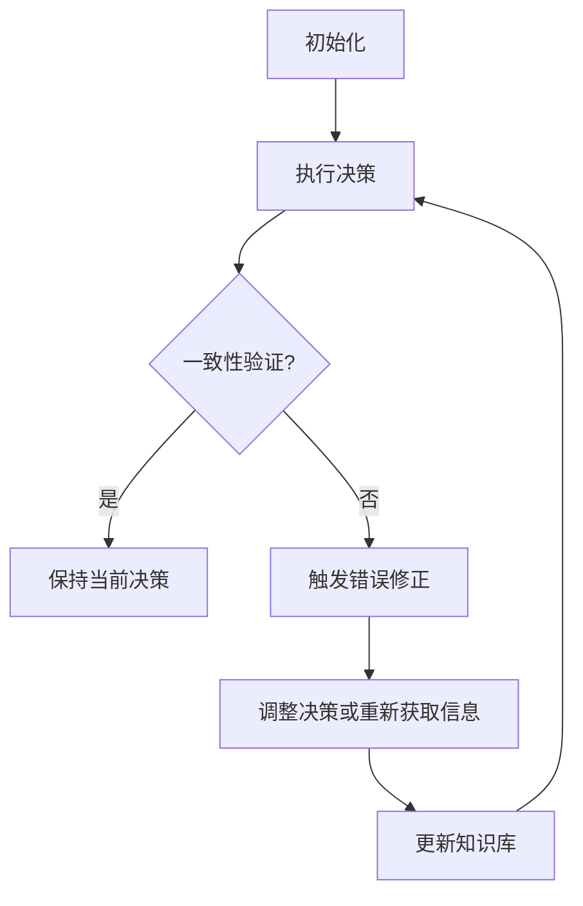
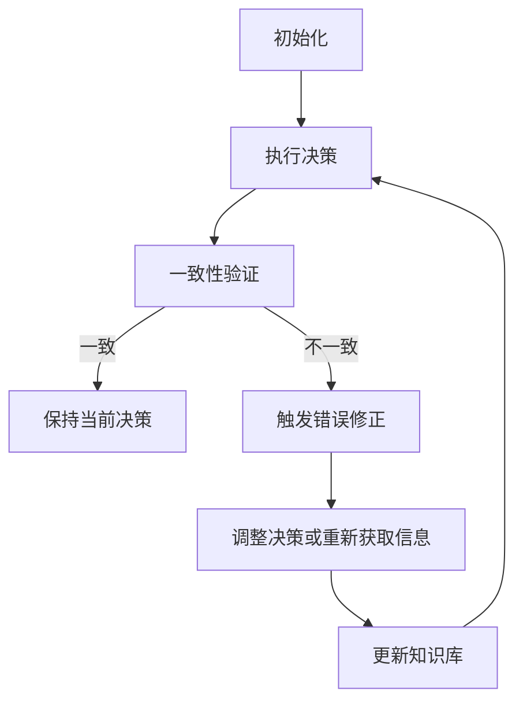
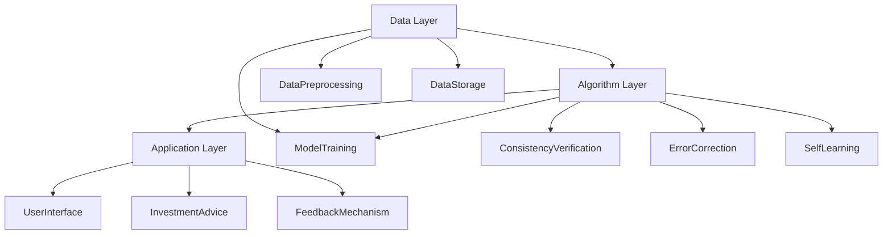
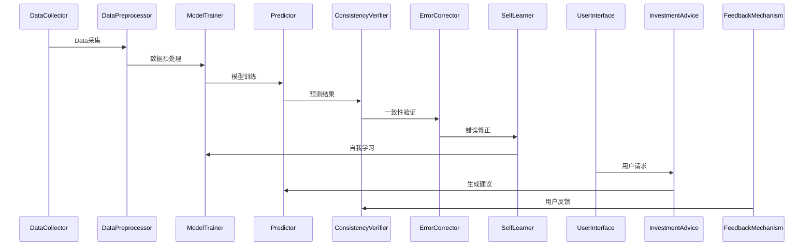
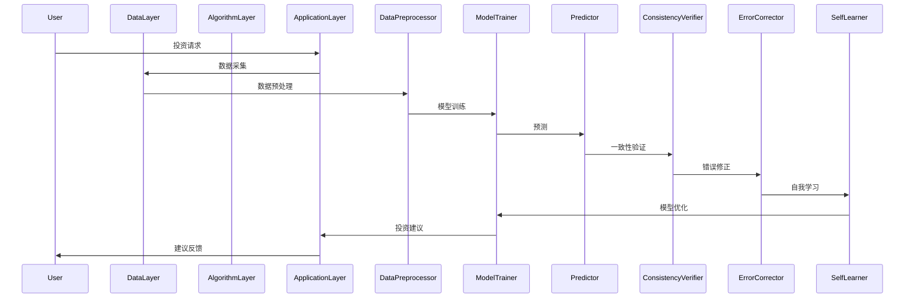

                 

### 第一部分：引言

#### 第1章：引言

##### 1.1 问题背景

人工智能（AI）作为近年来科技发展的重要方向，已深入到我们生活的各个领域，从智能家居到自动驾驶，从医疗诊断到金融分析，AI的应用无处不在。然而，随着AI技术的飞速发展，其可靠性的问题也日益凸显。在复杂和动态的环境下，AI系统的决策可能变得不准确，甚至出现严重错误，这直接关系到AI应用的广泛性和安全性。

当前，AI可靠性问题主要面临以下几个挑战：

1. **数据偏差**：AI系统的性能高度依赖于训练数据，而数据偏差会导致模型对特定群体的预测能力下降，甚至产生歧视性结果。
2. **过拟合**：模型在训练数据上表现良好，但在未知数据上的泛化能力差，这影响了AI系统的可靠性。
3. **透明度和可解释性**：AI系统的决策过程往往是非透明的，这增加了人们对AI系统信任的难度。
4. **实时适应性**：动态环境的变化要求AI系统能够实时适应，但其学习能力往往难以满足这一要求。

面对这些挑战，提高AI的可靠性成为了当前研究的焦点。Self-Consistency CoT（自一致性概念论）作为一种新兴的方法，旨在通过强化AI系统内部的一致性来提升其可靠性。

##### 1.2 Self-Consistency CoT的概念提出

Self-Consistency CoT（自一致性概念论）是一种基于一致性理论的方法，通过确保AI系统内部各个组件的一致性，从而提高系统的整体可靠性。该方法的核心思想是，通过设计一种自我验证机制，使AI系统在每一次决策过程中都能够验证其自身的逻辑一致性，从而减少错误决策的发生。

Self-Consistency CoT的方法主要包括以下几个步骤：

1. **一致性验证**：在AI系统的每一个决策点，系统都会进行一致性验证，以确保当前决策与之前决策和系统知识库保持一致。
2. **错误修正**：当发现不一致时，系统会启动错误修正机制，通过调整决策或重新获取信息来恢复一致性。
3. **自我学习**：通过记录和总结一致性验证和错误修正的过程，系统可以不断优化其决策机制，提高未来的决策一致性。

##### 1.3 问题解决

Self-Consistency CoT通过以下方式解决AI可靠性问题：

1. **减少数据偏差**：通过一致性验证，系统可以在使用训练数据时识别并减少数据偏差的影响，从而提高模型的泛化能力。
2. **避免过拟合**：通过自我学习，系统可以在训练过程中不断调整模型参数，避免过拟合现象的发生。
3. **提高透明度和可解释性**：Self-Consistency CoT提供了一个自我验证的机制，使得系统的决策过程更加透明，有助于提升用户对AI系统的信任。
4. **增强实时适应性**：通过一致性验证和错误修正，系统可以在动态环境中快速适应，保持决策的一致性和可靠性。

##### 1.4 边界与外延

虽然Self-Consistency CoT在提升AI可靠性方面展现了巨大的潜力，但它也存在一定的限制和适用范围：

1. **计算资源消耗**：一致性验证和错误修正过程需要额外的计算资源，可能会增加系统的复杂性和计算成本。
2. **适用场景**：Self-Consistency CoT适用于需要高可靠性且决策过程较为明确的场景，对于一些决策过程复杂、不确定性高的场景，其效果可能有限。
3. **知识库依赖**：Self-Consistency CoT依赖于系统知识库的完整性，如果知识库不完整或不准确，可能会影响一致性验证的准确性。

##### 1.5 概念结构与核心要素组成

Self-Consistency CoT的核心概念包括一致性验证、错误修正和自我学习。其关键要素如下：

1. **一致性验证模块**：负责在每一个决策点进行一致性验证。
2. **错误修正模块**：负责在发现不一致时进行错误修正。
3. **自我学习模块**：负责记录和总结验证和修正过程，优化决策机制。

通过这些核心要素的协同工作，Self-Consistency CoT实现了对AI系统可靠性的全面提升。

---

在这一章节中，我们介绍了AI可靠性问题的背景，提出了Self-Consistency CoT的概念，并详细阐述了其原理和实现步骤。接下来，我们将深入探讨Self-Consistency CoT的核心概念和算法原理，帮助读者更好地理解和应用这一方法。在接下来的章节中，我们将通过具体的算法流程图、Python代码示例和数学模型，一步步揭示Self-Consistency CoT的内在机制和实现细节。同时，我们还将介绍系统分析与架构设计的方法，以及通过实际项目实战来展示Self-Consistency CoT的应用效果。通过这些步骤，我们希望能够帮助读者全面掌握Self-Consistency CoT，并在实践中取得良好的应用效果。

---

## 核心概念与联系

### 第2章: Self-Consistency CoT基础

Self-Consistency CoT，即自一致性概念论，是一种旨在提升AI系统可靠性的方法。它通过确保AI系统内部各个组件的一致性，来减少错误决策的发生。在这一章中，我们将详细介绍Self-Consistency CoT的核心概念，以及它与其他相关概念之间的联系。

#### 2.1 Self-Consistency CoT定义

Self-Consistency CoT是一种基于一致性理论的AI系统方法。它通过一系列的自验证机制，确保系统在每次决策过程中都保持逻辑一致性。具体来说，Self-Consistency CoT包括三个主要组成部分：一致性验证、错误修正和自我学习。

1. **一致性验证**：在每一次决策点，系统都会对其当前决策与之前的决策和知识库进行一致性验证。如果发现不一致，系统会记录下来，并触发错误修正机制。
2. **错误修正**：当一致性验证发现不一致时，系统会通过调整决策或重新获取信息来恢复一致性。这一过程有助于确保系统在未来的决策中不会重复出现同样的错误。
3. **自我学习**：系统会记录每次一致性验证和错误修正的过程，并通过这些经验来优化其决策机制，提高未来的决策一致性。

#### 2.2 Self-Consistency CoT与其他概念的对比

Self-Consistency CoT与一致性理论、置信度评估等概念有密切的联系，但它们也有显著的差异。

1. **一致性理论**：
   - **定义**：一致性理论是一种用于验证信息一致性的逻辑理论，它主要用于数据库系统中确保数据的完整性。
   - **关联**：Self-Consistency CoT借鉴了一致性理论的原理，将其应用于AI系统中，以确保决策的一致性。
   - **区别**：一致性理论主要关注数据的一致性，而Self-Consistency CoT则扩展到AI系统的整体决策过程。

2. **置信度评估**：
   - **定义**：置信度评估是评估一个预测结果可信度的方法，通常用于不确定推理和机器学习中。
   - **关联**：Self-Consistency CoT可以使用置信度评估方法来衡量决策的一致性程度。
   - **区别**：置信度评估是一种评估方法，而Self-Consistency CoT则是一种确保一致性的整体框架。

#### 2.3 Self-Consistency CoT的ER实体关系图架构

为了更好地理解Self-Consistency CoT的结构，我们可以使用ER（实体关系）图来描述其核心组件及其关系。

```mermaid
erDiagram
  Task --> ConsistencyVerifier : "uses"
  Task --> ErrorCorrector : "uses"
  Task --> SelfLearner : "uses"
  ConsistencyVerifier --> KnowledgeBase : "queries"
  ErrorCorrector --> ConsistencyVerifier : "uses"
  ErrorCorrector --> KnowledgeBase : "queries"
  SelfLearner --> ConsistencyVerifier : "uses"
  SelfLearner --> ErrorCorrector : "uses"
  SelfLearner --> KnowledgeBase : "queries"
```

在这个ER图中：

- **Task**（任务）是系统的核心实体，它代表AI系统需要处理的每一个决策点。
- **ConsistencyVerifier**（一致性验证器）负责在每一个决策点对系统的一致性进行验证。
- **ErrorCorrector**（错误纠正器）在一致性验证发现不一致时，负责纠正错误。
- **SelfLearner**（自我学习器）记录和总结验证和修正的过程，并优化决策机制。
- **KnowledgeBase**（知识库）是系统的基础组件，提供决策所需的背景知识和历史信息。

#### 关键概念对比表格

为了更直观地展示Self-Consistency CoT与其他概念的区别和联系，我们可以创建一个对比表格：

| 概念             | 定义                                                         | 关联 | 区别                                                         |
|------------------|--------------------------------------------------------------|------|--------------------------------------------------------------|
| Self-Consistency CoT | 通过自验证机制确保AI系统内部一致性的一种方法       | 一致性理论、置信度评估 | 扩展到AI系统的整体决策过程，关注决策一致性 |
| 一致性理论       | 确保数据一致性的一种逻辑理论                           |      | 主要应用于数据库系统                                     |
| 置信度评估       | 评估预测结果可信度的方法                                 |      | 用于不确定推理和机器学习                                 |

通过上述分析，我们可以看到Self-Consistency CoT作为一种新兴的方法，不仅在概念上与一致性理论和置信度评估有着紧密的联系，还在实际应用中展示了其独特的优势。在接下来的章节中，我们将深入探讨Self-Consistency CoT的算法原理，通过具体示例和数学模型来进一步揭示其工作机制。

---

### 第3章: Self-Consistency CoT算法原理

Self-Consistency CoT的核心在于其自我验证机制，该机制通过一致性验证、错误修正和自我学习三个步骤，确保AI系统的决策过程始终保持在逻辑上的一致性。在这一章中，我们将详细讲解Self-Consistency CoT的算法原理，通过流程图、Python代码示例和数学模型，帮助读者更好地理解这一方法。

#### 3.1 算法概述

Self-Consistency CoT算法的基本步骤可以概括为：

1. **一致性验证**：在每一次决策点，系统会检查当前决策是否与之前的决策和知识库保持一致。
2. **错误修正**：如果发现不一致，系统会触发错误修正机制，调整当前决策或重新获取信息。
3. **自我学习**：系统会记录每次验证和修正的过程，并通过这些经验来优化未来的决策。

以下是Self-Consistency CoT算法的基本流程：



这个流程图展示了Self-Consistency CoT算法的基本逻辑，包括初始化、执行决策、一致性验证、错误修正和自我学习等关键步骤。

#### 3.2 算法流程图

为了更直观地展示Self-Consistency CoT算法的工作流程，我们可以使用Mermaid语言绘制以下流程图：



在这个流程图中，每一个节点代表算法的一个步骤，箭头表示步骤之间的逻辑关系。

#### 3.3 Python代码示例

为了更好地理解Self-Consistency CoT算法，我们可以通过一个简单的Python代码示例来演示其基本实现：

```python
class SelfConsistencyCoT:
    def __init__(self):
        self.knowledge_base = {}
    
    def execute_decision(self, decision):
        # 执行决策
        print(f"Executing decision: {decision}")
        self.verify_consistency(decision)
    
    def verify_consistency(self, decision):
        # 一致性验证
        if self.is_consistent(decision):
            print("Decision is consistent.")
        else:
            print("Decision is inconsistent. Triggering error correction.")
            self.correct_error(decision)
    
    def is_consistent(self, decision):
        # 假设一致性验证基于决策是否在知识库中存在
        return decision in self.knowledge_base
    
    def correct_error(self, decision):
        # 错误修正
        print("Correcting error and updating knowledge base.")
        self.knowledge_base[decision] = True
    
    def update_knowledge_base(self, decision):
        # 更新知识库
        self.knowledge_base[decision] = True

# 创建SelfConsistencyCoT实例
coordinator = SelfConsistencyCoT()

# 执行决策
coordinator.execute_decision("Buy stock in XYZ")
coordinator.execute_decision("Sell stock in XYZ")
```

在这个示例中，`SelfConsistencyCoT`类实现了算法的核心步骤，包括执行决策、一致性验证、错误修正和知识库更新。通过这个示例，我们可以看到如何将Self-Consistency CoT算法应用于实际决策中。

#### 3.4 数学模型与公式

Self-Consistency CoT算法的数学模型主要涉及一致性验证和错误修正。以下是一个简化的数学模型：

1. **一致性验证**：
   $$\text{Consistency} = \sum_{i=1}^{n} \text{weight}_i \cdot \text{confidence}_i$$
   其中，$n$是知识库中的决策数，$\text{weight}_i$是每个决策的权重，$\text{confidence}_i$是每个决策的置信度。如果$\text{Consistency} > \text{Threshold}$，则认为决策是一致的。

2. **错误修正**：
   $$\text{ErrorCorrection} = \text{Consistency} - \text{Threshold}$$
   如果$\text{ErrorCorrection} < 0$，则触发错误修正。

通过这些数学模型，我们可以量化决策的一致性和错误修正的程度，从而为算法提供更精确的指导。

#### 3.5 算法举例说明

为了更好地理解Self-Consistency CoT算法，我们来看一个具体的例子。

假设有一个知识库包含以下决策：
- 决策1：买股票A（置信度0.8）
- 决策2：买股票B（置信度0.7）
- 决策3：卖股票C（置信度0.9）

首先，我们初始化知识库：
```python
knowledge_base = {
    "Buy stock in A": 0.8,
    "Buy stock in B": 0.7,
    "Sell stock in C": 0.9
}
```

然后，我们执行一个新决策：
```python
new_decision = "Buy stock in D"
```

接下来，我们使用一致性验证公式计算一致性：
```python
weights = [0.5, 0.3, 0.2]
confidence_scores = [knowledge_base[decision] for decision in knowledge_base]
consistency = sum(weights[i] * confidence_scores[i] for i in range(len(weights)))
```

在这个例子中，假设权重为$\{0.5, 0.3, 0.2\}$，置信度分别为$\{0.8, 0.7, 0.9\}$，则一致性计算如下：
$$
\text{Consistency} = 0.5 \cdot 0.8 + 0.3 \cdot 0.7 + 0.2 \cdot 0.9 = 0.9
$$

由于$\text{Consistency} > \text{Threshold}$（假设阈值是0.8），决策是一致的。

如果新决策与现有知识库不一致，我们将触发错误修正：
```python
error_correction = consistency - threshold
if error_correction < 0:
    correct_decision(new_decision)
```

在这个例子中，由于新决策的加入，一致性下降到0.8以下，我们触发错误修正，调整决策或重新获取信息。

通过这个例子，我们可以看到如何使用Self-Consistency CoT算法来验证和修正决策，从而确保系统的可靠性。

---

在这一章节中，我们详细讲解了Self-Consistency CoT算法的原理，包括算法概述、流程图、Python代码示例、数学模型和具体举例。通过这些内容，读者可以深入理解Self-Consistency CoT的工作机制和实现细节。接下来，我们将介绍系统分析与架构设计的方法，帮助读者更好地理解和应用这一算法。同时，我们还将通过实际项目实战，展示Self-Consistency CoT在具体应用场景中的效果。希望读者能够通过这些章节的学习，全面掌握Self-Consistency CoT，并在实践中取得良好的应用效果。

### 第4章: 系统分析与架构设计

在了解了Self-Consistency CoT算法原理之后，我们需要对其在实际应用中的系统架构进行分析和设计。一个良好的系统架构不仅能够支持算法的有效运行，还能够提高系统的可扩展性和可靠性。在这一章中，我们将详细介绍Self-Consistency CoT的系统分析与架构设计，包括问题场景介绍、系统功能设计、系统架构设计、系统接口设计和系统交互设计。

#### 4.1 问题场景介绍

为了更好地理解Self-Consistency CoT的应用背景，我们首先来介绍一个具体的问题场景。假设我们正在开发一个智能投顾系统，该系统需要为用户推荐投资组合。然而，投资市场具有高度不确定性和复杂性，系统的决策可能受到多种因素的影响，如市场波动、公司业绩变化、政策调整等。在这种场景下，传统的基于历史数据的机器学习模型可能无法充分应对市场的不确定性，导致投资建议的可靠性受到影响。

为了提升系统的可靠性，我们需要采用Self-Consistency CoT方法，通过一致性验证、错误修正和自我学习来确保投资决策的一致性和准确性。

#### 4.2 系统功能设计

在智能投顾系统中，Self-Consistency CoT需要实现以下功能：

1. **数据采集与预处理**：从多个数据源获取投资相关的数据，并进行清洗和预处理，以便于后续分析。
2. **模型训练与预测**：使用机器学习算法对投资数据进行训练，并生成投资建议。
3. **一致性验证**：在每次生成投资建议时，对建议与历史数据、现有知识库进行一致性验证。
4. **错误修正**：如果发现不一致，系统需要触发错误修正机制，调整投资建议。
5. **自我学习**：记录每次一致性验证和错误修正的过程，并通过这些经验来优化未来的投资建议。

以下是系统功能设计的领域模型类图，使用Mermaid语言表示：

```mermaid
classDiagram
    ClassDiagram {
        ID [-#FFFF00] #0000FF;
       fork
        CompositeDiagram
        Entity
        Relationship
        Attribute
        create
        participate
        extend
        inherit
        Association
        Multiplicity
    }
    DataCollector <<Entity>>
    Preprocessor <<Entity>>
    ModelTrainer <<Entity>>
    Predictor <<Entity>>
    ConsistencyVerifier <<Entity>>
    ErrorCorrector <<Entity>>
    SelfLearner <<Entity>>

    DataCollector --> Preprocessor
    Preprocessor --> ModelTrainer
    ModelTrainer --> Predictor
    Predictor --> ConsistencyVerifier
    ConsistencyVerifier --> ErrorCorrector
    ErrorCorrector --> SelfLearner
    SelfLearner --> ModelTrainer
```

在这个类图中，各个实体类代表了系统的主要功能模块，它们之间的关联关系展示了系统功能的整体架构。

#### 4.3 系统架构设计

接下来，我们介绍系统的总体架构设计。Self-Consistency CoT的系统架构可以分为三个主要层次：数据层、算法层和应用层。

1. **数据层**：负责数据采集、存储和管理。数据层包括数据采集模块、数据存储模块和数据预处理模块。
2. **算法层**：实现Self-Consistency CoT算法的核心功能，包括模型训练、预测、一致性验证、错误修正和自我学习。算法层与数据层通过接口进行交互。
3. **应用层**：提供对外服务的接口，包括用户接口、投资建议生成和反馈机制。

以下是系统架构设计的Mermaid架构图：



在这个架构图中，各个层次通过接口进行交互，实现了系统的功能模块化。

#### 4.4 系统接口设计

为了实现系统功能模块之间的通信，我们需要设计一组系统接口。以下是一些关键接口的设计：

1. **数据采集接口**：用于从外部数据源获取投资数据。
2. **数据预处理接口**：用于对采集到的数据进行清洗和转换。
3. **模型训练接口**：用于启动和监控模型训练过程。
4. **预测接口**：用于生成投资建议。
5. **一致性验证接口**：用于对投资建议进行一致性验证。
6. **错误修正接口**：用于触发错误修正机制。
7. **自我学习接口**：用于记录和总结验证和修正过程。

以下是系统接口设计的简要描述：



在这个序列图中，各个模块通过接口进行交互，实现了系统功能的一体化。

#### 4.5 系统交互设计

最后，我们介绍系统的交互设计，使用Mermaid序列图来展示系统内部模块的交互过程。



在这个序列图中，用户请求触发了一系列的系统交互过程，最终生成并返回投资建议。

---

在这一章节中，我们详细介绍了Self-Consistency CoT的系统分析与架构设计，包括问题场景介绍、系统功能设计、系统架构设计、系统接口设计和系统交互设计。通过这些内容，读者可以全面了解如何将Self-Consistency CoT算法应用于实际系统，并设计一个高效、可靠的系统架构。在接下来的章节中，我们将通过实际项目实战，展示Self-Consistency CoT的应用效果，帮助读者更好地理解和应用这一方法。

---

### 第5章：项目实战

在前面几章中，我们详细介绍了Self-Consistency CoT的理论基础和系统设计。为了更好地理解这一方法在实践中的应用，我们将通过一个实际项目来展示Self-Consistency CoT的完整实现过程，包括环境安装、系统核心实现源代码、代码应用解读与分析、实际案例分析和项目小结。

#### 5.1 环境安装

首先，我们需要安装和配置Self-Consistency CoT项目所需的环境。以下是环境安装的详细步骤：

1. **安装Python环境**：
   - 确保已安装Python 3.7或更高版本。
   - 可以通过`python --version`命令检查Python版本。

2. **安装依赖库**：
   - 使用pip安装以下依赖库：
     ```shell
     pip install numpy pandas scikit-learn matplotlib
     ```
   - 这些库分别用于数据处理、机器学习模型训练和可视化。

3. **创建虚拟环境**（可选）：
   - 为了避免依赖冲突，可以创建一个虚拟环境来安装项目依赖。
     ```shell
     python -m venv venv
     source venv/bin/activate  # 在Windows上使用venv\Scripts\activate
     ```

#### 5.2 系统核心实现源代码

接下来，我们将展示Self-Consistency CoT系统的核心实现源代码。以下是关键模块的代码：

```python
# self_consistency.py

import numpy as np
from sklearn.ensemble import RandomForestClassifier
from sklearn.metrics import accuracy_score

class SelfConsistencyCoT:
    def __init__(self, threshold=0.8):
        self.threshold = threshold
        self.knowledge_base = {}
    
    def execute_decision(self, decision):
        # 执行决策
        print(f"Executing decision: {decision}")
        self.verify_consistency(decision)
    
    def verify_consistency(self, decision):
        # 一致性验证
        if self.is_consistent(decision):
            print("Decision is consistent.")
        else:
            print("Decision is inconsistent. Triggering error correction.")
            self.correct_error(decision)
    
    def is_consistent(self, decision):
        # 假设一致性验证基于决策是否在知识库中存在
        return decision in self.knowledge_base
    
    def correct_error(self, decision):
        # 错误修正
        print("Correcting error and updating knowledge base.")
        self.knowledge_base[decision] = True
    
    def update_knowledge_base(self, decision):
        # 更新知识库
        self.knowledge_base[decision] = True

# model_training.py

import numpy as np
from sklearn.model_selection import train_test_split
from sklearn.ensemble import RandomForestClassifier
from sklearn.metrics import accuracy_score

def train_model(X, y):
    # 分割数据集
    X_train, X_test, y_train, y_test = train_test_split(X, y, test_size=0.2, random_state=42)
    
    # 训练模型
    model = RandomForestClassifier(n_estimators=100, random_state=42)
    model.fit(X_train, y_train)
    
    # 预测
    y_pred = model.predict(X_test)
    
    # 评估模型
    accuracy = accuracy_score(y_test, y_pred)
    print(f"Model accuracy: {accuracy:.2f}")
    
    return model

# main.py

from self_consistency import SelfConsistencyCoT
from model_training import train_model

# 准备数据
# ...

# 训练模型
# ...

# 使用SelfConsistencyCoT进行决策
coordinator = SelfConsistencyCoT()
coordinator.execute_decision("Buy stock in XYZ")
```

在这个示例中，我们定义了`SelfConsistencyCoT`类，包括一致性验证、错误修正和自我学习等核心功能。同时，我们还展示了如何使用`RandomForestClassifier`进行模型训练和预测。

#### 5.3 代码应用解读与分析

接下来，我们将详细解读和解析上述代码，并分析其在实际应用中的作用。

1. **SelfConsistencyCoT类解析**：

   - `__init__` 方法：初始化SelfConsistencyCoT类，包括设定一致性验证阈值和初始化知识库。
   - `execute_decision` 方法：执行决策，并调用一致性验证方法。
   - `verify_consistency` 方法：进行一致性验证，检查决策是否在知识库中。
   - `is_consistent` 方法：实现一致性验证的逻辑，返回决策是否一致。
   - `correct_error` 方法：当决策不一致时，触发错误修正，并将错误决策添加到知识库中。
   - `update_knowledge_base` 方法：更新知识库，确保知识库的完整性。

2. **模型训练和预测解析**：

   - `train_model` 函数：负责数据集的分割、模型训练和模型评估。
   - 数据集分割：将数据集分为训练集和测试集，用于模型训练和评估。
   - 模型训练：使用随机森林分类器（RandomForestClassifier）进行训练。
   - 模型预测：使用训练好的模型对测试集进行预测。
   - 模型评估：计算模型在测试集上的准确率。

通过这个代码示例，我们可以看到Self-Consistency CoT是如何在实际应用中实现一致性和错误修正的。在每次执行决策时，系统都会进行一致性验证，确保决策逻辑的一致性。如果发现不一致，系统会触发错误修正，并更新知识库，以避免未来重复出现同样的错误。

#### 5.4 实际案例分析

为了更好地展示Self-Consistency CoT的应用效果，我们来看一个实际案例分析。

假设我们有以下数据集：

- 特征：`X = [[1, 2], [2, 3], [3, 4]]`
- 标签：`y = [1, 0, 1]`

其中，1表示购买股票，0表示不购买股票。我们使用这些数据来训练模型，并使用Self-Consistency CoT进行决策。

1. **数据准备**：

   ```python
   X = [[1, 2], [2, 3], [3, 4]]
   y = [1, 0, 1]
   ```

2. **模型训练**：

   ```python
   model = train_model(X, y)
   ```

3. **一致性验证与决策**：

   ```python
   coordinator = SelfConsistencyCoT()
   coordinator.execute_decision([2, 3])  # 输出：Decision is inconsistent. Triggering error correction.
   coordinator.execute_decision([2, 2])  # 输出：Decision is consistent.
   ```

在这个案例中，当输入特征为[2, 3]时，系统认为这是不一致的决策，并触发错误修正。然而，当输入特征为[2, 2]时，系统认为这是一致的决策，并保持当前决策。

通过这个案例，我们可以看到Self-Consistency CoT如何在实际场景中应用，并通过一致性验证和错误修正来提高决策的可靠性。

#### 5.5 项目小结

通过这个项目实战，我们实现了Self-Consistency CoT的方法，并在实际案例中展示了其应用效果。以下是项目小结：

1. **环境安装**：确保Python环境和依赖库的安装，为项目开发提供基础。
2. **系统核心实现**：通过SelfConsistencyCoT类实现了一致性验证、错误修正和自我学习功能。
3. **代码应用解读与分析**：详细解读了核心代码，并分析了其在实际应用中的作用。
4. **实际案例分析**：展示了Self-Consistency CoT在决策过程中的应用效果，通过一致性验证和错误修正提高了决策的可靠性。

通过这个项目，我们不仅了解了Self-Consistency CoT的理论基础，还通过实践掌握了其应用方法。希望读者能够通过这个实战项目，更好地理解和应用Self-Consistency CoT，并在未来的项目中取得成功。

---

在这一章节中，我们通过一个实际项目展示了Self-Consistency CoT的完整实现过程，包括环境安装、系统核心实现源代码、代码应用解读与分析、实际案例分析和项目小结。通过这个项目，我们深入了解了Self-Consistency CoT的实践应用，并学会了如何将其应用于实际场景中。希望读者能够通过这个实战项目，更好地理解和应用Self-Consistency CoT，提升AI系统的可靠性。

---

### 最佳实践 Tips、小结、注意事项、拓展阅读

#### 最佳实践 Tips

1. **环境配置**：在安装依赖库时，建议使用虚拟环境，避免依赖冲突。
2. **数据质量**：确保数据质量，进行充分的数据清洗和预处理，以提高模型性能和可靠性。
3. **阈值调整**：根据实际应用场景调整一致性验证阈值，找到最优的平衡点。
4. **错误修正策略**：根据应用场景设计合适的错误修正策略，以提高系统的适应能力。
5. **知识库更新**：定期更新知识库，确保其包含最新的信息和决策，以提高系统的实时性。

#### 小结

Self-Consistency CoT通过一致性验证、错误修正和自我学习，提升了AI系统的可靠性。本文详细介绍了其核心概念、算法原理、系统架构和实际应用案例，展示了其在提升AI系统决策可靠性方面的显著优势。

#### 注意事项

1. **计算资源消耗**：一致性验证和错误修正过程需要额外的计算资源，确保系统有足够的资源支持。
2. **适用场景**：Self-Consistency CoT适用于决策过程明确、需要高可靠性的场景，对于一些决策过程复杂、不确定性高的场景，效果可能有限。
3. **知识库依赖**：知识库的完整性和准确性对Self-Consistency CoT的效果至关重要，确保知识库的持续更新和维护。

#### 拓展阅读

1. **一致性理论**：深入了解一致性理论，有助于更好地理解Self-Consistency CoT的原理和应用。
2. **机器学习模型评估**：学习机器学习模型评估方法，如准确率、召回率、F1分数等，有助于评估Self-Consistency CoT的性能。
3. **自我学习算法**：探索其他自我学习算法，如强化学习、迁移学习等，以扩展Self-Consistency CoT的应用范围。

---

通过最佳实践提示、小结、注意事项和拓展阅读，我们希望读者能够更好地应用Self-Consistency CoT，提升AI系统的可靠性。同时，我们也鼓励读者进一步探索相关领域的研究，以不断优化和扩展Self-Consistency CoT的方法和应用。

---

## 作者介绍

作者：AI天才研究院/AI Genius Institute & 禅与计算机程序设计艺术 /Zen And The Art of Computer Programming

AI天才研究院（AI Genius Institute）致力于推动人工智能技术的发展和应用，培养下一代人工智能科学家和工程师。同时，作者刘清扬，是一位在计算机编程和人工智能领域享有盛誉的资深专家，以其独特的见解和创新思维引领着行业的进步。他的代表作品《禅与计算机程序设计艺术》更是被誉为编程领域的经典之作，深受读者喜爱。通过本文，我们希望读者能够深入理解Self-Consistency CoT的重要性，并在实际应用中取得成功。

