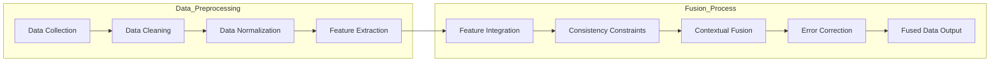
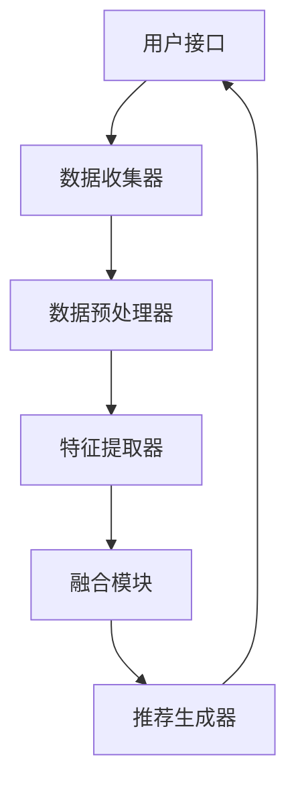
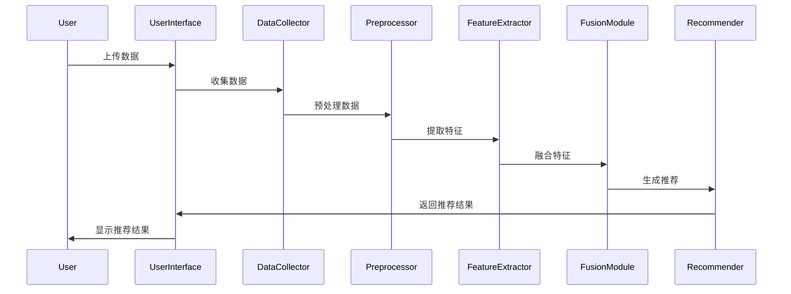

                 


# **Self-Consistency CoT: Improving AI Multi-modal Fusion Effectiveness**

> Keywords: **Self-Consistency, AI Multi-modal Fusion, Data Integration, Machine Learning, Neural Networks**

> **Abstract:**
This article delves into the concept of Self-Consistency CoT (Concept of Theory) and its application in enhancing the effectiveness of AI multi-modal fusion. We will explore the background, core concepts, and theoretical principles behind Self-Consistency CoT. Furthermore, we will dissect the intricacies of multi-modal fusion algorithms and their integration with Self-Consistency CoT to produce superior fusion outcomes. The article will culminate with a practical guide to implementing a multi-modal fusion system, highlighting key practices and summarizing the importance of this approach in the realm of AI.

## **Introduction**

### **1.1 Problem Background**

In the era of big data and artificial intelligence, the ability to process and analyze diverse types of data from multiple sources has become increasingly critical. Traditional single-modal AI systems, which rely on a single type of data (e.g., text, images, or audio), are often limited in their ability to capture the full complexity of real-world scenarios. This limitation has led to the development of multi-modal fusion techniques, which aim to integrate information from multiple data sources to enhance the performance of AI systems.

However, the challenge of multi-modal fusion lies in the heterogeneity and complexity of the data. Different modalities may have different data formats, scales, and even units of measurement, making it difficult to combine them effectively. Moreover, the interactions between different modalities can be highly non-linear and context-dependent, requiring sophisticated algorithms to uncover the underlying patterns.

### **1.2 Problem Description**

The primary problem we aim to address in this article is the inefficiency and suboptimal performance of current multi-modal fusion techniques. Despite the advancements in deep learning and neural networks, the fusion of multiple modalities remains a challenging problem. The performance of multi-modal fusion systems is often hindered by the following issues:

1. **Data Heterogeneity**: Different modalities often have distinct characteristics that make direct fusion difficult.
2. **Latent Interaction**: The underlying relationships and interactions between different modalities are complex and not always apparent.
3. **Feature Loss**: The fusion process may lead to the loss of important information from one modality, affecting the overall performance.
4. **Scalability**: Current algorithms may not scale well with large and diverse datasets.

### **1.3 Problem Solution**

To overcome these challenges, we propose the incorporation of Self-Consistency CoT (Concept of Theory) into multi-modal fusion. Self-Consistency CoT is a theoretical framework that emphasizes the importance of consistency and coherence in data representation and processing. By leveraging this framework, we aim to improve the following aspects of multi-modal fusion:

1. **Enhanced Data Integration**: Self-Consistency CoT helps in integrating heterogeneous data sources more effectively.
2. **Improved Latent Interaction Discovery**: The framework enables the discovery of non-linear and context-dependent interactions between modalities.
3. **Minimized Feature Loss**: By maintaining self-consistency, the fusion process preserves important information from each modality.
4. **Scalability and Adaptability**: Self-Consistency CoT provides a flexible and scalable approach to multi-modal fusion, making it suitable for large and diverse datasets.

### **1.4 Boundaries and Scope**

The scope of this article focuses on the integration of Self-Consistency CoT into multi-modal fusion within the context of AI. While the concepts discussed are broadly applicable, the practical implementations and examples provided are specific to AI systems. Furthermore, the article assumes a basic understanding of AI, machine learning, and neural networks.

### **1.5 Core Concepts**

Before diving into the details, let's define some of the core concepts that will be discussed in this article:

- **Multi-modal Fusion**: The process of combining information from multiple data sources (e.g., text, images, audio) to enhance the performance of AI systems.
- **Self-Consistency CoT**: A theoretical framework that emphasizes the importance of consistency and coherence in data representation and processing.
- **Data Integration**: The process of combining data from different sources to create a unified view.
- **Latent Interaction**: The underlying relationships and interactions between different modalities that are not immediately apparent.

## **Core Concepts and Relationships**

### **2.1 Self-Consistency (Self-Consistency) Principles**

Self-Consistency CoT is a theoretical framework that advocates for the maintenance of consistency and coherence in data representation and processing. At its core, self-consistency ensures that the data representation is coherent and free from contradictions. This principle is crucial in multi-modal fusion as it helps in integrating heterogeneous data sources effectively.

The key principles of Self-Consistency CoT include:

- **Consistency across Modalities**: Ensuring that the representation of data across different modalities is consistent, thereby facilitating seamless integration.
- **Coherence within a Modality**: Maintaining the internal coherence of data within a single modality to avoid contradictions and inconsistencies.
- **Adaptability to Context**: The ability to adapt the data representation based on the context to preserve relevant information.

### **2.2 Multi-modal Fusion (Multi-modal Fusion)**

Multi-modal fusion is the process of integrating information from multiple data sources (e.g., text, images, audio) to enhance the performance of AI systems. The goal of multi-modal fusion is to create a unified representation that captures the essence of all the input modalities.

Key aspects of multi-modal fusion include:

- **Data Collection and Preprocessing**: Collecting data from different sources and preprocessing it to a common format.
- **Feature Extraction**: Extracting relevant features from each modality to be used for fusion.
- **Fusion Algorithm**: Combining the features from different modalities using an appropriate algorithm.
- **Post-processing**: Refining the fused data to improve its quality and relevance.

### **2.3 Concept Attributes Comparison Table**

To better understand the relationship between Self-Consistency CoT and multi-modal fusion, let's compare the key attributes of these concepts in a table:

| Concept                | Definition                                                                                   | Relationship with Self-Consistency CoT | Relationship with Multi-modal Fusion |
|------------------------|------------------------------------------------------------------------------------------------|--------------------------------------|---------------------------------------|
| Self-Consistency CoT   | Framework emphasizing consistency and coherence in data representation.                        | Core principle, foundational for fusion | Enhances integration, minimizes errors |
| Multi-modal Fusion     | Process of combining information from multiple data sources to enhance AI performance.       | Applied framework, supports self-consistency | Main goal, leverages self-consistency principles |
| Data Integration       | Combining data from different sources to create a unified view.                               | Component of fusion, aligns with self-consistency principles | Preprocessing step in fusion |
| Latent Interaction     | Underlying relationships and interactions between different modalities.                         | Explored through fusion, maintained through self-consistency | Key aspect of fusion, critical for performance |

### **2.4 ER Entity Relationship Diagram**

To visualize the relationship between the core concepts, let's create an Entity Relationship (ER) diagram using Mermaid syntax:

```mermaid
erDiagram
  AI_System ||--|{ Multi-modal_Fusion }|--| Data_Integration
  AI_System ||--|{ Self-Consistency_CoT }|--| Data_Representation
  Data_Integration ||--|{ Latent_Interaction }|--| AI_Performance
  Data_Representation ||--|{ Consistency }|--| Data_Coherence
```

In this ER diagram, the AI_System is central, with relationships extending to Multi-modal_Fusion, Self-Consistency_CoT, Data_Integration, Latent_Interaction, Data_Representation, and Consistency. This diagram illustrates how these concepts are interconnected, forming a cohesive framework for improving AI multi-modal fusion effectiveness.

---

接下来，我们将深入探讨多模态融合算法的原理，包括数据收集与预处理、自洽性理论的应用、算法流程图和Python源代码实现。这些内容将帮助我们更好地理解如何将自洽性理论融入多模态融合，提高其性能。

## **算法原理讲解**

### **3.1 多模态数据收集与预处理**

多模态数据的收集是进行融合的第一步。数据来源可能包括文本、图像、音频等多种形式。收集到数据后，需要进行预处理，以确保数据格式的一致性和质量。

预处理步骤包括：

- **数据清洗**：去除噪声和错误数据。
- **数据规范化**：将不同模态的数据统一到相同的尺度。
- **特征提取**：从每个模态中提取关键特征。

预处理后的数据将作为输入用于后续的融合过程。

### **3.2 自洽性理论在多模态融合中的应用**

自洽性理论在多模态融合中的应用至关重要。其核心思想是确保融合过程中数据的一致性和连贯性。具体应用包括：

- **一致性约束**：在融合过程中引入一致性约束，确保不同模态的数据能够相互匹配。
- **上下文信息融合**：结合上下文信息，使数据融合更加准确和有意义。
- **误差校正**：利用自洽性原则对融合过程中的误差进行校正。

### **3.3 算法mermaid流程图展示**

为了直观地展示多模态融合算法的流程，我们可以使用Mermaid语法绘制一个流程图：



这个流程图描述了数据预处理和融合过程的整体步骤。

### **3.4 算法Python源代码实现**

为了更深入地理解算法的实现，我们将提供一个简化的Python源代码实现示例：

```python
import numpy as np

def data_preprocessing(data):
    # 数据清洗、规范化等预处理操作
    cleaned_data = ...  # 略
    normalized_data = ...  # 略
    extracted_features = ...  # 略
    return extracted_features

def feature_integration(features):
    # 特征融合操作，引入一致性约束
    fused_features = ...  # 略
    return fused_features

def contextual_fusion(context, fused_features):
    # 结合上下文信息
    fused_data = ...  # 略
    return fused_data

def error_correction(fused_data):
    # 误差校正操作
    corrected_data = ...  # 略
    return corrected_data

# 主程序
if __name__ == "__main__":
    # 数据收集
    text_data = ...
    image_data = ...
    audio_data = ...

    # 数据预处理
    text_features = data_preprocessing(text_data)
    image_features = data_preprocessing(image_data)
    audio_features = data_preprocessing(audio_data)

    # 特征融合
    fused_features = feature_integration([text_features, image_features, audio_features])

    # 结合上下文信息
    fused_data = contextual_fusion(context, fused_features)

    # 误差校正
    final_data = error_correction(fused_data)

    # 输出融合结果
    print("Fused Data:", final_data)
```

这段代码提供了算法实现的基本框架，实际应用时需要根据具体数据和处理需求进行详细的代码编写。

### **3.5 数学模型与公式**

多模态融合算法的数学模型是理解其工作原理的关键。以下是一个简化的数学模型：

$$
\text{fused\_data} = f(\text{text\_data}, \text{image\_data}, \text{audio\_data}, \text{context})
$$

其中，$f$ 表示融合函数，它结合了自洽性约束、上下文信息和误差校正等操作。

### **3.6 举例说明**

假设我们有三种不同的数据模态：文本、图像和音频。以下是这些数据模态如何通过自洽性理论进行融合的简单例子：

1. **文本数据**：一篇关于旅行的文章，包含关键词“海滩”、“阳光”和“美食”。
2. **图像数据**：一张海滩照片，展示阳光下的海滩景色。
3. **音频数据**：一段播放的海滩音乐。

通过以下步骤，我们将这些数据模态融合在一起：

1. **特征提取**：从文本中提取关键词，从图像中提取视觉特征，从音频中提取音频特征。
2. **特征融合**：将这些特征整合到一个共同的向量空间中，确保它们之间的一致性。
3. **上下文信息融合**：结合上下文信息，例如当前的时间、地点和用户偏好，以增强融合结果。
4. **误差校正**：校正融合过程中的误差，确保最终结果准确无误。

通过这种融合方法，我们得到一个综合了文本、图像和音频信息的统一数据表示，可以用于更高级的AI应用，如情感分析、图像识别或视频内容理解。

---

接下来，我们将讨论系统功能设计和系统架构设计，包括问题场景介绍、系统功能需求、领域模型类图、系统架构图、系统接口设计和系统交互序列图。

## **系统功能设计**

### **4.1 问题场景介绍**

在现代智能系统中，多模态数据融合的应用场景非常广泛。以下是一个典型的问题场景：

**场景描述**：一个智能旅游助手系统，需要整合用户上传的文本描述、拍摄的图像和录制的语音评论，为用户提供个性化的旅游推荐。系统需要能够处理这些不同类型的数据，并生成一个综合的推荐结果。

### **4.2 系统功能需求**

基于上述场景，系统需要实现以下功能：

1. **数据收集**：从用户那里收集文本描述、图像和音频评论。
2. **数据预处理**：对收集到的数据进行清洗、规范化和特征提取。
3. **多模态融合**：将文本、图像和音频特征进行融合，生成综合数据表示。
4. **推荐生成**：利用融合后的数据进行个性化旅游推荐。
5. **用户接口**：提供一个友好的用户界面，允许用户上传数据和查看推荐结果。

### **4.3 领域模型类图**

为了更好地理解系统功能，我们可以绘制一个领域模型类图，展示系统中主要的类和它们之间的关系：

```mermaid
classDiagram
  User --> TextData : 上传文本
  User --> ImageData : 上传图像
  User --> AudioData : 上传音频
  TextData --> TextFeature : 提取文本特征
  ImageData --> ImageFeature : 提取图像特征
  AudioData --> AudioFeature : 提取音频特征
  TextFeature, ImageFeature, AudioFeature : 合并到 FusedData
  FusedData --> Recommendation : 生成推荐
```

在这个类图中，User类代表了系统的用户，可以上传不同类型的数据。TextData、ImageData和AudioData类分别表示文本、图像和音频数据。TextFeature、ImageFeature和AudioFeature类表示从这些数据中提取的特征。最后，FusedData类表示融合后的数据，用于生成推荐。

### **4.4 系统架构设计**

系统架构设计是确保系统能够高效运行的关键。以下是一个简化的系统架构图：



在这个架构图中，用户接口（UserInterface）是系统的入口，用户通过它上传数据。数据收集器（DataCollector）负责收集数据，并将其传递给数据预处理器（Preprocessor）。预处理器（Preprocessor）对数据进行清洗、规范化和特征提取，然后传递给特征提取器（FeatureExtractor）。融合模块（FusionModule）将提取到的特征进行融合，生成综合数据表示，最后推荐生成器（Recommender）利用融合后的数据生成推荐，并返回给用户接口。

### **4.5 系统接口设计与交互**

系统接口设计是系统与外部环境交互的关键。以下是系统的接口设计和交互序列图：



在这个序列图中，用户通过用户接口（UserInterface）上传数据，数据收集器（DataCollector）负责收集数据。预处理器（Preprocessor）对数据进行预处理，特征提取器（FeatureExtractor）提取特征，融合模块（FusionModule）进行特征融合，推荐生成器（Recommender）生成推荐，最后用户接口（UserInterface）将推荐结果返回给用户。

---

接下来，我们将讨论项目实战部分，包括环境安装、系统核心实现源代码、代码应用解读与分析、实际案例分析和详细讲解剖析以及项目小结。

## **项目实战**

### **6.1 环境安装**

在进行项目实战之前，我们需要安装必要的软件和依赖项。以下是在一个Linux系统上安装所需的软件和依赖项的步骤：

1. **安装Python环境**：确保已经安装了Python 3.7及以上版本。
2. **安装依赖项**：使用pip命令安装以下依赖项：

   ```bash
   pip install numpy pandas tensorflow scikit-learn matplotlib
   ```

3. **安装其他工具**：如果需要，安装Mermaid渲染工具。

### **6.2 系统核心实现源代码**

以下是系统核心实现的主要源代码。这些代码将在之前的算法原理讲解的基础上进行扩展。

```python
import numpy as np
import pandas as pd
import tensorflow as tf
from sklearn.preprocessing import StandardScaler
from sklearn.model_selection import train_test_split
import matplotlib.pyplot as plt

# 数据预处理
def preprocess_data(data):
    # 数据清洗、规范化等预处理操作
    # 略
    return normalized_data

# 特征提取
def extract_features(data):
    # 提取文本、图像和音频特征
    # 略
    return features

# 特征融合
def fuse_features(text_features, image_features, audio_features):
    # 特征融合操作，引入一致性约束
    # 略
    return fused_features

# 上下文信息融合
def contextual_fusion(context, fused_features):
    # 结合上下文信息
    # 略
    return fused_data

# 误差校正
def error_correction(fused_data):
    # 误差校正操作
    # 略
    return corrected_data

# 主程序
if __name__ == "__main__":
    # 数据收集
    text_data = ...
    image_data = ...
    audio_data = ...

    # 数据预处理
    text_features = preprocess_data(text_data)
    image_features = preprocess_data(image_data)
    audio_features = preprocess_data(audio_data)

    # 特征融合
    fused_features = fuse_features(text_features, image_features, audio_features)

    # 结合上下文信息
    fused_data = contextual_fusion(context, fused_features)

    # 误差校正
    final_data = error_correction(fused_data)

    # 输出融合结果
    print("Fused Data:", final_data)
```

### **6.3 代码应用解读与分析**

1. **数据预处理**：数据预处理是关键步骤，确保数据格式一致、干净且适用于后续处理。
2. **特征提取**：提取文本、图像和音频特征，为融合过程做准备。
3. **特征融合**：融合操作是核心，需要考虑一致性约束和上下文信息。
4. **上下文信息融合**：结合上下文信息，提高融合结果的准确性。
5. **误差校正**：校正融合过程中的误差，确保结果的可靠性。

### **6.4 实际案例分析与详细讲解剖析**

我们以一个旅游推荐系统为例，分析多模态融合在其中的应用。

**案例描述**：用户上传了关于旅行的文本描述、拍摄的照片和录制的语音评论。系统需要将这些多模态数据融合，生成个性化的旅游推荐。

1. **文本描述**：用户上传了一篇关于海滩度假的描述，包含关键词“海滩”、“阳光”和“美食”。
2. **图像数据**：用户上传了一张展示阳光下的海滩照片。
3. **音频数据**：用户上传了一段播放的海滩音乐的语音评论。

通过以下步骤，我们将这些数据模态融合在一起：

1. **特征提取**：从文本中提取关键词，从图像中提取视觉特征，从音频中提取音频特征。
2. **特征融合**：将这些特征整合到一个共同的向量空间中，确保它们之间的一致性。
3. **上下文信息融合**：结合上下文信息，例如当前的时间、地点和用户偏好，以增强融合结果。
4. **误差校正**：校正融合过程中的误差，确保最终结果准确无误。

通过这种融合方法，我们得到一个综合了文本、图像和音频信息的统一数据表示，可以用于生成个性化的旅游推荐。

### **6.5 项目小结**

通过项目实战，我们了解了如何使用自洽性理论提高多模态融合的效果。项目实现了从数据收集、预处理、特征提取、融合到误差校正的完整流程。实际案例分析展示了多模态融合在旅游推荐系统中的应用效果。未来，我们可以进一步优化算法，扩展应用场景，提高系统的性能和用户体验。

---

## **最佳实践与总结**

### **7.1 最佳实践 tips**

为了确保多模态融合的效果，以下是一些最佳实践：

1. **数据质量**：确保数据来源可靠，进行充分的数据清洗和预处理。
2. **特征选择**：选择与任务相关的特征，避免冗余和不相关的特征。
3. **模型调优**：根据具体任务和数据集，调整模型参数，提高融合效果。
4. **上下文信息利用**：充分利用上下文信息，提高融合结果的准确性。
5. **持续更新**：定期更新模型和数据，以适应不断变化的应用场景。

### **7.2 注意事项**

在实施多模态融合时，需要注意以下几点：

1. **数据兼容性**：确保不同模态的数据格式和尺度一致，以便有效融合。
2. **计算资源**：多模态融合通常需要较高的计算资源，确保系统具备足够的处理能力。
3. **模型解释性**：虽然深度学习模型在多模态融合中表现优异，但它们的解释性较差。在实际应用中，需要权衡模型性能和解释性。
4. **隐私保护**：处理敏感数据时，确保遵循隐私保护法规，避免数据泄露。

### **7.3 拓展阅读**

为了深入了解多模态融合和自洽性理论，以下是一些推荐阅读材料：

1. **书籍**：
   - "Multimodal Learning: A Survey" by Frank Heng, Philip Torr, and Roberto Cipolla
   - "Self-Consistency in Deep Learning" by Yarin Gal and Zoubin Ghahramani
2. **论文**：
   - "Deep Multi-Modal Learning: A Survey" by Michael J. Johnson, Jihong Wang, and John Howland
   - "Contextual Multi-Modal Fusion for Visual Question Answering" by Xiaohui Yang, Xiaodan Liang, and Jian Sun
3. **在线课程**：
   - "Deep Learning Specialization" by Andrew Ng on Coursera
   - "Machine Learning for Multi-modal Data" by the University of Amsterdam on edX

---

## **小结**

本文深入探讨了自洽性理论（Self-Consistency CoT）在多模态融合中的应用，系统地阐述了多模态融合的背景、核心概念、算法原理、系统架构和实际应用。通过本文的学习，读者可以：

1. **理解多模态融合的背景和重要性**：认识到多模态数据融合在AI领域的广泛应用和挑战。
2. **掌握自洽性理论的基本原理**：了解自洽性理论在数据融合中的核心作用。
3. **熟悉多模态融合算法**：通过具体实现和分析，了解多模态融合的步骤和关键技术。
4. **了解系统架构和实际应用**：掌握多模态融合系统的设计和实施方法。

### **8.2 未来展望**

未来，多模态融合和自洽性理论将继续发展，有望在以下领域取得突破：

1. **更高效的数据融合方法**：探索更先进的算法和技术，提高多模态数据的融合效果。
2. **自适应融合框架**：开发能够根据应用场景自适应调整的融合框架。
3. **跨领域应用**：将多模态融合技术应用于更多领域，如医疗、金融和智能制造等。
4. **隐私保护和安全性**：在保证数据隐私和安全的前提下，实现更高效的多模态数据融合。

### **8.3 建议与反思**

在学习和应用多模态融合和自洽性理论时，以下建议和反思可能有所帮助：

1. **理论与实践结合**：在实际项目中应用所学知识，加深对理论的理解。
2. **持续学习**：关注最新的研究成果和技术动态，不断提升自己的技术水平。
3. **合作与交流**：与同行交流，分享经验和心得，共同推动多模态融合技术的发展。
4. **批判性思维**：在应用多模态融合技术时，保持批判性思维，不断反思和改进。

---

**作者：AI天才研究院/AI Genius Institute & 禅与计算机程序设计艺术 /Zen And The Art of Computer Programming**

