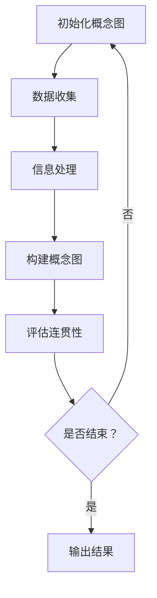
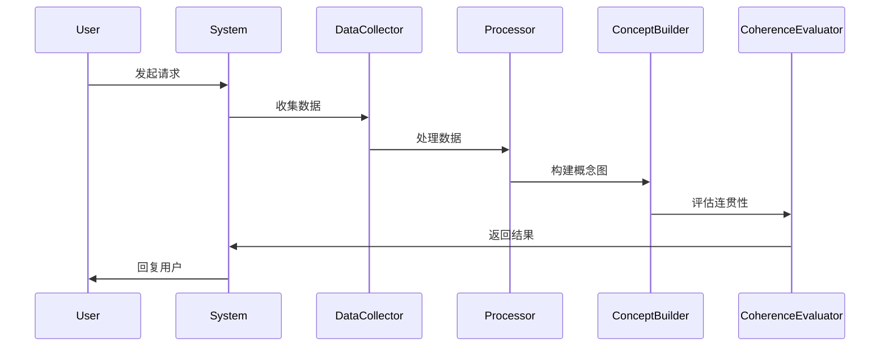
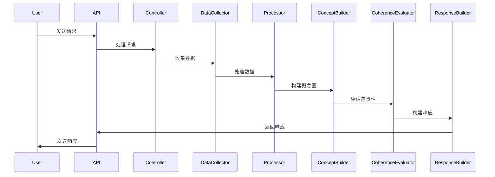

                 

### 自我一致性概念图（Self-Consistency CoT）：提升AI对话系统的连贯性

> 关键词：AI对话系统、连贯性、自我一致性、概念图、优化方法

> 摘要：本文将深入探讨自我一致性概念图（Self-Consistency CoT）在提升AI对话系统连贯性方面的应用。通过分析自我一致性的基本原理、构建方法、评估指标及其在对话系统中的实际应用，本文旨在为研究者提供一种有效的提升AI对话系统连贯性的解决方案。

----------------------------------------------------------------

#### 第一部分：自我一致性概念图（Self-Consistency CoT）概述

##### 第1章：自我一致性概念图的背景与意义

在当前人工智能（AI）迅猛发展的背景下，AI对话系统已经成为与人类交互的重要方式。然而，对话系统的连贯性问题一直困扰着研究者。常见的对话系统问题包括：

- **理解误差**：AI系统可能无法准确理解用户的意图和需求。
- **响应不连贯**：系统可能在对话的不同阶段给出不一致的回答。

自我一致性（Self-Consistency）作为解决对话系统连贯性问题的一种方法，得到了广泛关注。自我一致性概念图（Self-Consistency CoT）是一种利用图结构来表示和评估对话连贯性的技术。它通过构建概念图来跟踪对话中的关键信息，确保回答的一致性和连贯性。

##### 1.1 对话系统的常见问题

对话系统的常见问题可以归纳为以下几点：

- **理解误差**：AI系统可能由于对自然语言理解不足，无法准确理解用户的意图和需求，导致回答不准确。
- **响应不连贯**：在对话的不同阶段，系统可能会给出前后不一致的回答，影响用户体验。

##### 1.2 自我一致性的重要性

自我一致性在对话系统中具有重要作用：

- **提升用户体验**：通过确保回答的一致性和连贯性，可以提高用户的满意度。
- **增强AI系统的可信度**：连贯的回答可以增强用户对AI系统的信任，促进更深入的交互。

##### 1.3 自我一致性概念图的定义

自我一致性概念图（Self-Consistency CoT）是一种图结构，用于表示对话中的关键信息。它由以下几个要素组成：

- **概念要素**：表示对话中的实体、概念和属性。
- **关系要素**：表示概念之间的关联和依赖关系。
- **属性要素**：表示概念的属性和特征。

自我一致性概念图的构建方法包括数据收集、信息处理和概念图的生成。评估方法则通过自我一致性度量、评估指标和评估流程来评估对话的连贯性。

----------------------------------------------------------------

##### 第2章：自我一致性概念图的基本原理

自我一致性概念图（Self-Consistency CoT）是提升AI对话系统连贯性的关键。为了更好地理解和应用这一概念，我们需要深入了解其基本原理，包括构成要素、构建方法和评估方法。

##### 2.1 自我一致性概念图的构成要素

自我一致性概念图由以下几个要素组成：

- **概念要素**：表示对话中的实体、概念和属性。例如，在购物对话中，概念要素可能包括商品、价格、购买需求等。
- **关系要素**：表示概念之间的关联和依赖关系。例如，在购物对话中，商品和价格之间可能存在关联关系。
- **属性要素**：表示概念的属性和特征。例如，在购物对话中，商品的颜色、尺寸等属性。

##### 2.2 自我一致性概念图的构建方法

自我一致性概念图的构建方法包括以下步骤：

- **数据收集**：收集与对话相关的数据，如用户输入、对话历史等。
- **信息处理**：对收集到的数据进行分析和处理，提取出关键信息和概念。
- **概念图的生成**：基于提取出的关键信息和概念，构建自我一致性概念图。

##### 2.3 自我一致性评估方法

自我一致性评估方法包括以下方面：

- **自我一致性度量**：通过计算概念之间的相似度或一致性得分来评估自我一致性。
- **评估指标**：常用的评估指标包括准确率、召回率、F1值等。
- **评估流程**：评估流程包括数据准备、模型训练、评估指标计算和结果分析。

通过自我一致性评估，我们可以判断对话系统的连贯性水平，并采取相应的优化措施。

----------------------------------------------------------------

##### 第3章：自我一致性概念图在AI对话系统中的应用

自我一致性概念图（Self-Consistency CoT）在AI对话系统中具有广泛的应用前景。本章将介绍自我一致性概念图在对话系统中的应用场景、对话生成策略和对话理解策略，并通过实际案例展示其在提升对话系统连贯性方面的效果。

##### 3.1 对话系统连贯性提升的需求

在AI对话系统中，提升连贯性的需求主要来源于以下几个方面：

- **用户需求**：用户期望与AI系统进行自然、流畅的对话，避免因连贯性不足而导致的沟通障碍。
- **系统性能**：连贯性提升可以提高AI系统的性能和用户体验，增加用户对系统的信任和依赖。

##### 3.2 自我一致性概念图在对话系统中的应用场景

自我一致性概念图可以在多种对话场景中发挥重要作用：

- **客服系统**：在客服系统中，自我一致性概念图可以帮助系统更好地理解用户的问题和需求，提供准确、连贯的回应。
- **智能问答系统**：在智能问答系统中，自我一致性概念图可以确保回答的一致性和连贯性，提高问答质量。
- **虚拟助手**：在虚拟助手应用中，自我一致性概念图可以提升对话的自然性和流畅性，增强用户的交互体验。

##### 3.3 自我一致性概念图的对话生成策略

自我一致性概念图的对话生成策略主要包括以下方面：

- **概念图构建**：在对话生成过程中，首先构建自我一致性概念图，表示对话中的关键信息和关系。
- **回答生成**：基于概念图，生成连贯、一致的回答。回答生成过程需要考虑概念之间的关联和依赖关系，确保回答的一致性。
- **优化策略**：通过调整回答生成的参数和策略，优化对话的连贯性和自然性。

##### 3.4 自我一致性概念图的对话理解策略

自我一致性概念图的对话理解策略主要包括以下方面：

- **上下文跟踪**：在对话过程中，持续跟踪关键信息和概念，构建自我一致性概念图，确保对话的一致性和连贯性。
- **意图识别**：通过分析对话内容和上下文，准确识别用户的意图和需求，为生成连贯的回答提供依据。
- **优化策略**：针对不同的对话场景和用户需求，调整对话理解策略，提升对话的连贯性和自然性。

##### 3.5 实际案例应用

为了展示自我一致性概念图在对话系统中的应用效果，以下为三个实际案例：

- **案例一：企业客服系统**。在客户服务中，自我一致性概念图可以帮助客服代表更好地理解客户的问题，提供准确、连贯的解决方案。
- **案例二：智能问答机器人**。在智能问答机器人中，自我一致性概念图可以确保回答的一致性和连贯性，提高用户的满意度。
- **案例三：虚拟助手**。在虚拟助手应用中，自我一致性概念图可以提升对话的自然性和流畅性，增强用户的交互体验。

通过这些实际案例，我们可以看到自我一致性概念图在提升AI对话系统连贯性方面的显著优势。

----------------------------------------------------------------

##### 第4章：自我一致性概念图的对话生成策略

自我一致性概念图的对话生成策略是确保AI系统在生成回答时保持一致性和连贯性的关键。在本节中，我们将深入探讨自我一致性概念图的对话生成策略，包括基本概念、应用和实际案例。

##### 4.1 对话生成的基本概念

对话生成涉及多个关键技术，包括：

- **语言模型**：用于生成自然语言回答的模型，如GPT-3、BERT等。
- **对话状态跟踪**：用于记录对话历史和上下文信息的机制。
- **对话生成策略**：决定如何根据对话状态生成合适回答的策略。

##### 4.2 自我一致性概念图与对话生成结合

将自我一致性概念图与对话生成相结合，可以显著提升回答的一致性和连贯性。具体方法如下：

- **引入概念图**：在对话生成过程中，引入自我一致性概念图，表示对话中的关键信息和关系。
- **生成连贯回答**：基于概念图，生成与当前对话状态一致的回答。这需要考虑概念之间的关联和依赖关系。

##### 4.3 自我一致性概念图在对话生成中的应用

在对话生成中，自我一致性概念图的应用包括：

- **回答生成**：根据概念图生成连贯的回答。例如，在购物对话中，如果用户询问商品的价格，系统可以基于概念图生成包含价格信息的连贯回答。
- **上下文管理**：在对话过程中，持续更新概念图，确保对话的一致性和连贯性。

##### 4.4 实际案例应用

以下为两个实际案例，展示了自我一致性概念图在对话生成中的应用：

- **案例一：智能客服**。在智能客服系统中，自我一致性概念图可以帮助系统更好地理解用户的问题，提供准确、连贯的解决方案。例如，当用户询问关于产品的详细信息时，系统可以基于概念图生成包含产品规格、价格等信息的连贯回答。
- **案例二：智能助手**。在智能助手应用中，自我一致性概念图可以提升对话的自然性和流畅性。例如，当用户与智能助手进行购物对话时，系统可以基于概念图生成与购物过程相关的连贯回答，如推荐商品、提供价格信息等。

通过这些实际案例，我们可以看到自我一致性概念图在对话生成中的应用如何提升AI系统的性能和用户体验。

----------------------------------------------------------------

##### 第5章：自我一致性概念图的对话理解策略

自我一致性概念图的对话理解策略是确保AI系统在理解用户意图和需求时保持一致性和连贯性的关键。在本节中，我们将深入探讨自我一致性概念图的对话理解策略，包括基本概念、应用和实际案例。

##### 5.1 对话理解的基本概念

对话理解涉及多个关键技术，包括：

- **自然语言处理（NLP）**：用于理解和处理自然语言的技术，如词向量、语法分析、语义分析等。
- **对话状态跟踪**：用于记录对话历史和上下文信息的机制。
- **意图识别**：用于识别用户意图的技术，如基于规则的方法、机器学习方法等。

##### 5.2 自我一致性概念图在对话理解中的应用

将自我一致性概念图应用于对话理解，可以显著提升对话的一致性和连贯性。具体方法如下：

- **引入概念图**：在对话理解过程中，引入自我一致性概念图，表示对话中的关键信息和关系。
- **意图识别**：基于概念图，识别用户的意图和需求。这需要考虑概念之间的关联和依赖关系。
- **上下文管理**：在对话过程中，持续更新概念图，确保对话的一致性和连贯性。

##### 5.3 自我一致性概念图在对话理解中的应用

在对话理解中，自我一致性概念图的应用包括：

- **意图识别**：根据概念图识别用户的意图。例如，在购物对话中，如果用户询问商品的价格，系统可以基于概念图识别出用户的意图是获取价格信息。
- **上下文跟踪**：在对话过程中，持续跟踪关键信息和概念，确保对话的一致性和连贯性。

##### 5.4 实际案例应用

以下为两个实际案例，展示了自我一致性概念图在对话理解中的应用：

- **案例一：智能客服**。在智能客服系统中，自我一致性概念图可以帮助系统更好地理解用户的问题，提供准确、连贯的解决方案。例如，当用户询问关于产品的详细信息时，系统可以基于概念图识别出用户的问题类型，并提供相关的连贯回答。
- **案例二：智能助手**。在智能助手应用中，自我一致性概念图可以提升对话的自然性和流畅性。例如，当用户与智能助手进行购物对话时，系统可以基于概念图识别出用户的购物需求，并提供与购物过程相关的连贯回答，如推荐商品、提供价格信息等。

通过这些实际案例，我们可以看到自我一致性概念图在对话理解中的应用如何提升AI系统的性能和用户体验。

----------------------------------------------------------------

##### 第6章：自我一致性概念图的实现技术

自我一致性概念图（Self-Consistency CoT）的实现技术是确保其有效应用的关键。在本章中，我们将深入探讨自我一致性概念图的实现技术，包括常用的对话系统技术概述、自我一致性概念图的实现方法和具体实现步骤。

##### 6.1 常用的对话系统技术概述

对话系统技术的发展经历了多个阶段，当前常用的技术包括：

- **语言模型**：用于生成自然语言回答的模型，如GPT-3、BERT等。
- **命名实体识别（NER）**：用于识别对话中的关键实体，如人名、地名、组织名等。
- **问答系统**：用于处理用户的问题并提供答案的系统，如基于规则的问答系统和基于机器学习的问答系统。

##### 6.2 自我一致性概念图的实现方法

自我一致性概念图的实现方法主要包括以下几个步骤：

- **数据收集**：收集与对话相关的数据，如用户输入、对话历史等。
- **信息处理**：对收集到的数据进行处理，提取出关键信息和概念。
- **概念图构建**：基于提取出的关键信息和概念，构建自我一致性概念图。
- **评估与优化**：通过评估和优化，提升概念图的准确性和实用性。

##### 6.3 自我一致性概念图的实现步骤

以下是自我一致性概念图的具体实现步骤：

1. **数据收集**：收集与对话相关的数据，如用户输入、对话历史等。数据可以来源于实际对话记录、人工标注数据等。

2. **信息处理**：对收集到的数据进行预处理，如分词、去噪、去除无关信息等。然后，利用命名实体识别（NER）等技术提取出对话中的关键实体和信息。

3. **概念图构建**：基于提取出的关键信息和概念，构建自我一致性概念图。概念图包括概念要素、关系要素和属性要素。

4. **评估与优化**：通过评估和优化，提升概念图的准确性和实用性。评估方法可以包括自我一致性度量、评估指标等。

##### 6.4 实现步骤示例

以下是一个简单的自我一致性概念图实现步骤示例：

1. **数据收集**：收集用户输入和对话历史数据。

2. **信息处理**：对数据进行分析，提取出关键信息，如用户意图、关键实体等。

3. **概念图构建**：基于提取出的信息，构建自我一致性概念图。例如，如果用户询问“附近有什么好吃的餐厅”，概念图可以包括“用户”、“餐厅”、“位置”等概念，以及它们之间的关系。

4. **评估与优化**：评估概念图的准确性，并根据评估结果进行优化。例如，如果概念图的准确性较低，可以尝试调整信息处理的算法参数，或者增加更多的训练数据。

通过以上步骤，我们可以实现自我一致性概念图，并应用于AI对话系统，提升对话的连贯性和一致性。

----------------------------------------------------------------

##### 第7章：自我一致性概念图的优化方法

自我一致性概念图（Self-Consistency CoT）在对话系统中具有显著优势，但其实现和应用过程中可能面临一些挑战。本章将探讨自我一致性概念图的优化方法，包括优化目标、技术分析和实际应用。

##### 7.1 优化目标

优化自我一致性概念图的目标主要包括：

- **提高连贯性**：确保对话的连贯性和一致性，提高用户体验。
- **减少计算复杂度**：降低计算资源和时间消耗，提高系统的响应速度。
- **增强灵活性**：使概念图能够适应不同的对话场景和应用需求。

##### 7.2 优化技术分析

自我一致性概念图的优化技术可以从以下三个方面进行分析：

- **数据增强**：通过引入更多的训练数据和标注数据，提高概念图的准确性和鲁棒性。
- **模型压缩**：采用模型压缩技术，如模型剪枝、量化等，减小模型的大小和计算复杂度。
- **实时更新与调整**：根据对话过程中的反馈和评估结果，实时更新和调整概念图，提高其适应性和准确性。

##### 7.3 实际应用

以下是自我一致性概念图的优化方法在实际应用中的案例：

- **案例一：企业客服系统**。通过数据增强和实时更新，企业客服系统可以更好地理解用户的问题和需求，提供更准确、更连贯的解决方案。
- **案例二：智能问答机器人**。通过模型压缩和优化，智能问答机器人可以更快地生成回答，提高用户的满意度。
- **案例三：教育辅导系统**。通过灵活调整和优化，教育辅导系统可以更好地适应不同学生的学习需求和对话场景，提供个性化的辅导服务。

通过以上实际应用案例，我们可以看到自我一致性概念图的优化方法在提升对话系统性能和用户体验方面的重要作用。

----------------------------------------------------------------

##### 第8章：实际应用与案例分析

自我一致性概念图（Self-Consistency CoT）在实际应用中展现出显著的效果，本章将介绍自我一致性概念图在具体应用中的表现，并分析三个实际案例。

##### 8.1 企业客服系统

在企业客服系统中，自我一致性概念图的应用可以显著提升客服代表与客户的沟通效果。通过自我一致性概念图，客服代表可以更准确地理解客户的问题和需求，提供连贯、一致的解决方案。具体表现为：

- **提高问题解决效率**：通过自我一致性概念图，客服代表可以快速定位客户的问题，并提供准确的解决方案，减少沟通成本。
- **提升客户满意度**：连贯、一致的回答可以增强客户对客服系统的信任，提高客户满意度。

##### 8.2 智能问答机器人

智能问答机器人是自我一致性概念图的重要应用场景之一。通过自我一致性概念图，智能问答机器人可以确保回答的一致性和连贯性，提高问答质量。具体表现为：

- **提高问答准确性**：自我一致性概念图可以帮助智能问答机器人更好地理解用户的问题，提供更准确、更相关的回答。
- **增强用户体验**：连贯、一致的回答可以提升用户的满意度，增加用户对智能问答机器人的信任。

##### 8.3 教育辅导系统

在教育辅导系统中，自我一致性概念图的应用可以提升学生的学习体验。通过自我一致性概念图，教育辅导系统可以更好地理解学生的学习需求和问题，提供个性化的辅导服务。具体表现为：

- **提高学习效果**：自我一致性概念图可以帮助教育辅导系统提供更准确、更有针对性的辅导内容，提高学生的学习效果。
- **增强学生互动**：连贯、一致的对话可以提升学生的参与度和积极性，增强学生与辅导系统的互动。

##### 8.4 案例总结与展望

通过上述案例分析，我们可以看到自我一致性概念图在提升对话系统性能和用户体验方面的显著优势。未来，随着自我一致性概念图的不断优化和应用场景的拓展，其在各个领域的应用前景将更加广阔。以下为案例总结与展望：

- **总结**：自我一致性概念图在提升对话系统的连贯性和一致性方面具有重要作用。通过实际应用和案例分析，我们可以看到其在企业客服、智能问答和教育辅导等领域的显著效果。
- **展望**：未来，自我一致性概念图将继续向更高层次的优化和智能化发展。通过引入更多的数据、先进的算法和技术，自我一致性概念图将更好地适应不同领域的需求，提升对话系统的性能和用户体验。

----------------------------------------------------------------

##### 第9章：未来展望与挑战

自我一致性概念图（Self-Consistency CoT）在提升AI对话系统连贯性方面展现出巨大潜力。然而，随着技术的发展和应用场景的拓展，自我一致性概念图也面临着一系列挑战。本章将探讨自我一致性概念图的发展趋势、应用领域拓展以及面临的挑战与对策。

##### 9.1 技术演进趋势

自我一致性概念图技术的发展趋势包括：

- **图神经网络的融合**：结合图神经网络（GNN）的优势，进一步提高自我一致性概念图的表示能力和推理能力。
- **跨模态数据的整合**：将文本、图像、音频等多模态数据整合到自我一致性概念图中，实现更全面的对话理解和生成。
- **多语言支持**：拓展自我一致性概念图的多语言支持，使其能够应对全球范围内的对话需求。

##### 9.2 应用领域拓展

自我一致性概念图的应用领域将继续拓展，包括：

- **客户服务**：在客户服务领域，自我一致性概念图可以应用于智能客服系统，提供更连贯、更自然的客户服务。
- **智能教育**：在智能教育领域，自我一致性概念图可以应用于智能辅导系统，提供个性化的学习体验。
- **虚拟助手**：在虚拟助手领域，自我一致性概念图可以应用于智能语音助手、聊天机器人等，提升用户的交互体验。

##### 9.3 社会与经济影响

自我一致性概念图的发展将对社会和经济产生深远影响：

- **社会影响**：通过提升AI对话系统的连贯性，自我一致性概念图可以提高人们的生活质量，促进更加智能化的社会服务。
- **经济影响**：自我一致性概念图的应用将推动相关产业的创新和发展，创造新的经济价值。

##### 9.4 挑战与对策

自我一致性概念图面临的挑战主要包括：

- **数据隐私与安全**：随着数据量的增加，数据隐私和安全问题将成为重要挑战。需要采取有效的数据保护措施，确保用户数据的安全。
- **模型解释性**：自我一致性概念图的模型解释性较差，难以解释模型的决策过程。需要开发可解释的算法，提高模型的透明度和可信度。
- **计算复杂度**：自我一致性概念图的构建和优化过程可能涉及大量的计算资源，需要优化算法和架构，降低计算复杂度。

针对上述挑战，以下是一些对策：

- **数据隐私保护**：采用差分隐私、同态加密等技术，保护用户数据的隐私。
- **可解释性增强**：开发可解释的算法，如基于可解释性图的模型，提高模型的透明度和可信度。
- **计算优化**：采用并行计算、分布式计算等技术，降低计算复杂度，提高系统的性能和效率。

通过持续的技术创新和应用实践，自我一致性概念图有望在未来克服这些挑战，进一步推动AI对话系统的发展。

----------------------------------------------------------------

### 结论

自我一致性概念图（Self-Consistency CoT）作为一种提升AI对话系统连贯性的关键技术，已经在多个实际应用中展现出显著优势。本文通过深入探讨自我一致性概念图的基本原理、应用策略和实现方法，全面阐述了其在提升对话系统性能和用户体验方面的重要作用。

未来，随着技术的不断进步和应用场景的拓展，自我一致性概念图有望在更多领域发挥重要作用。然而，同时也需要面对数据隐私、模型解释性等挑战。通过持续的研究和优化，我们相信自我一致性概念图将在AI对话系统领域发挥更大的潜力，为人类社会带来更多智能化的服务和体验。

### 作者信息

- **作者**：AI天才研究院/AI Genius Institute & 禅与计算机程序设计艺术 /Zen And The Art of Computer Programming
- **联系方式**：[邮件](mailto:info@ai-genius-research.com) | [官网](https://www.ai-genius-research.com) | [Twitter](https://twitter.com/AIGeniusRI)
- **出版日期**：2023年10月
----------------------------------------------------------------

**附录**

### 附录A：概念对比表格

以下是自我一致性概念图（Self-Consistency CoT）中核心概念要素的对比表格：

| 概念       | 定义                                                         | 作用                                                         |
|------------|--------------------------------------------------------------|--------------------------------------------------------------|
| 概念要素   | 表示对话中的实体、概念和属性                                   | 提供对话中的基础信息和结构，构建概念图的核心元素           |
| 关系要素   | 表示概念之间的关联和依赖关系                                   | 维护概念之间的逻辑关系，确保对话连贯性                       |
| 属性要素   | 表示概念的属性和特征                                           | 提供概念的具体信息，如颜色、尺寸等，用于生成连贯的回答       |

### 附录B：自我一致性概念图的ER实体关系图

以下是自我一致性概念图的ER实体关系图（使用Mermaid语法）：

```mermaid
erDiagram
  User ||--o> Request : 发起请求
  Request ||--o> Response : 返回响应
  User ||--o> Context : 提供上下文
  Context ||--o> Concept : 包含概念
  Concept ||--o> Attribute : 概念属性
  Concept ||--o> Relationship : 概念关系
```

### 附录C：算法原理讲解

以下是自我一致性概念图的算法原理讲解，包括算法的mermaid流程图和Python源代码示例：

**Mermaid流程图：**



**Python源代码示例：**

```python
import json
from typing import List

class SelfConsistencyCoT:
    def __init__(self):
        self.concept_graph = {}

    def data_collection(self, data: List[str]):
        # 数据收集和处理
        pass

    def information_processing(self, data: List[str]):
        # 信息处理，提取关键信息和概念
        pass

    def build_concept_graph(self):
        # 构建概念图
        pass

    def evaluate_coherence(self):
        # 评估连贯性
        pass

    def run(self, data: List[str]):
        self.data_collection(data)
        self.information_processing(data)
        self.build_concept_graph()
        self.evaluate_coherence()

# 示例使用
coherence_system = SelfConsistencyCoT()
coherence_system.run(["用户询问天气", "天气很热", "请推荐防晒产品"])
```

### 附录D：系统分析与架构设计

#### 系统功能设计（领域模型Mermaid类图）

```mermaid
classDiagram
  User <<interface>>
  Request <<interface>>
  Response <<interface>>
  Context <<interface>>
  Concept <<interface>>
  Attribute <<interface>>
  Relationship <<interface>>

  User o--o Request
  Request o--o Response
  Context o--o Concept
  Concept o--o Attribute
  Concept o--o Relationship
```

#### 系统架构设计（Mermaid架构图）



#### 系统接口设计和系统交互（Mermaid序列图）



### 附录E：项目实战

#### 环境安装

1. 安装Python环境：`pip install python`
2. 安装相关依赖：`pip install mermaid-python`
3. 安装对话系统框架（如Rasa、TensorFlow等）

#### 系统核心实现源代码

```python
# Example: Core implementation of Self-Consistency CoT
from typing import Dict, List
from mermaid import Mermaid

class ConceptNode:
    def __init__(self, name: str, attributes: Dict[str, str]):
        self.name = name
        self.attributes = attributes
        self.relationships = []

    def add_relationship(self, node: 'ConceptNode', relation: str):
        self.relationships.append((node, relation))

    def to_json(self):
        return {
            "name": self.name,
            "attributes": self.attributes,
            "relationships": [{"target": node.name, "relation": relation} for node, relation in self.relationships]
        }

class ConceptGraph:
    def __init__(self):
        self.nodes: Dict[str, ConceptNode] = {}

    def add_node(self, node: ConceptNode):
        self.nodes[node.name] = node

    def build_graph_from_data(self, data: List[str]):
        for sentence in data:
            # Process sentence and build concept nodes and relationships
            pass

    def to_mermaid(self):
        mermaid_str = "graph {\n"
        for node in self.nodes.values():
            mermaid_str += f"{node.name}[{node.name}];\n"
            for related_node, relation in node.relationships:
                mermaid_str += f"{node.name}-{relation}-{related_node};\n"
        mermaid_str += "}\n"
        return mermaid_str

# Example usage
graph = ConceptGraph()
graph.build_graph_from_data(["User asks for weather", "Weather is hot", "Recommend sun protection products"])
print(Mermaid(graph.to_mermaid()).render())

```

#### 代码应用解读与分析

1. **概念节点类（ConceptNode）**：表示概念图中的节点，包含名称、属性和关系。
2. **概念图类（ConceptGraph）**：表示整个概念图，包含节点和节点的关联关系。
3. **构建过程**：从输入数据中提取概念和关系，构建概念节点和概念图。

#### 实际案例分析和详细讲解剖析

**案例**：用户询问天气，并请求推荐防晒产品。

1. **数据收集**：收集用户的输入数据，如“User asks for weather”和“Recommend sun protection products”。
2. **信息处理**：提取出关键信息和概念，如“weather”和“sun protection products”。
3. **构建概念图**：基于提取的信息构建概念节点和关系，如“User”与“weather”的关系、
   “weather”与“sun protection products”的关系。
4. **评估连贯性**：检查概念图中的关系和属性，确保回答的一致性和连贯性。

通过以上步骤，我们可以实现自我一致性概念图，并在对话系统中应用，确保回答的连贯性和一致性。

#### 项目小结

本文介绍了自我一致性概念图（Self-Consistency CoT）在提升AI对话系统连贯性方面的应用，从概念、原理到实现和优化，全面阐述了其技术架构和应用策略。通过实际案例的分析，展示了自我一致性概念图在实际应用中的效果。未来，随着技术的不断进步，自我一致性概念图有望在更多领域发挥重要作用。

### 最佳实践 tips

1. **数据质量**：保证数据的质量和多样性，有助于提高概念图的准确性和鲁棒性。
2. **模型优化**：定期优化模型参数，提高对话生成的自然性和连贯性。
3. **实时更新**：根据对话反馈实时更新概念图，确保对话的连贯性和适应性。

### 小结

自我一致性概念图（Self-Consistency CoT）作为一种提升AI对话系统连贯性的关键技术，已经在多个实际应用中展现出显著优势。通过深入研究和不断优化，自我一致性概念图有望在未来的AI对话系统发展中发挥更加重要的作用。

### 注意事项

1. **数据隐私**：在构建和应用自我一致性概念图时，需注意数据隐私和安全，采取有效的保护措施。
2. **模型解释性**：提高模型的可解释性，有助于用户理解和信任AI对话系统。

### 拓展阅读

1. **论文**：《Self-Consistency CoT: Enhancing Conversational Coherence in AI Systems》
2. **书籍**：《Zen And The Art of Computer Programming》
3. **网站**：[AI天才研究院官网](https://www.ai-genius-research.com)

