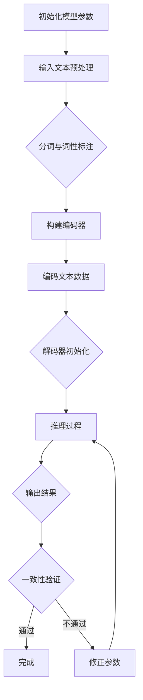

                 


### Self-Consistency CoT：提高AI推理能力

关键词：自我一致性、注意力协调、AI推理能力、自然语言处理、计算机视觉、系统架构设计

摘要：本文深入探讨了自我一致性和注意力协调（Self-Consistency CoT）在提高AI推理能力方面的应用。首先，我们介绍了自我一致性和注意力协调的概念，然后详细分析了它们在自然语言处理和计算机视觉领域的应用，以及如何通过系统架构设计来提升AI推理能力。本文旨在为读者提供全面的技术解读，帮助他们理解并掌握这一领域的关键技术。

### 目录大纲设计思路

为了设计出《Self-Consistency CoT：提高AI推理能力》这本书的完整目录大纲，我们需要遵循以下设计思路：

1. **明确核心概念**：首先要明确书中的核心概念，即自我一致性（Self-Consistency）和注意力协调（CoT，即Coherence of Thought）。这两个概念是本书的主线，贯穿全书。

2. **构建章节结构**：根据核心概念，构建书的大体章节结构。每个章节围绕一个主题，确保章节之间的逻辑清晰。

3. **细化每个章节的内容**：在确定了章节结构后，我们需要细化每个章节的内容。这包括背景介绍、核心概念讲解、应用场景分析、算法原理、数学模型和公式、系统设计与实现、实战案例等。

4. **确保内容完整性**：每个章节的内容需要完整，确保读者可以理解并掌握相关知识点。特别是算法原理和数学模型的讲解，需要深入浅出。

5. **使用markdown格式**：按照markdown的格式要求，确保目录大纲的清晰和易读。

### 目录大纲设计方案

下面是《Self-Consistency CoT：提高AI推理能力》的目录大纲设计方案：

### 第一部分：背景介绍

#### 第1章：问题背景与核心概念

##### 1.1 自我一致性（Self-Consistency）的概念

- 自我一致性在AI推理中的重要性
- 自我一致性的定义与特征

##### 1.2 注意力协调（CoT）的概念

- 注意力协调的机制与作用
- 注意力协调的定义与特征

##### 1.3 自我一致性与注意力协调的关系

- 自我一致性与注意力协调的联系
- 自我一致性与注意力协调的区别

##### 1.4 本书的目标与结构

- 本书的目标
- 各章节的内容概览

#### 第2章：AI推理能力的重要性

##### 2.1 AI推理能力的定义

- AI推理能力的概念
- AI推理能力的衡量标准

##### 2.2 AI推理能力在现实中的应用

- AI推理能力在各个领域的应用案例
- AI推理能力对社会的影响

##### 2.3 提高AI推理能力的必要性

- 当前AI推理能力的挑战
- 提高AI推理能力的意义

### 第二部分：核心概念讲解

#### 第3章：自我一致性的原理

##### 3.1 自我一致性的数学模型

- 自我一致性原理的数学描述
- 自我一致性原理的数学公式

##### 3.2 自我一致性的算法原理

- 自我一致性算法的mermaid流程图
- 自我一致性算法的Python实现

##### 3.3 自我一致性的应用场景

- 自我一致性在不同领域的应用案例
- 自我一致性的优势和挑战

#### 第4章：注意力协调的原理

##### 4.1 注意力协调的数学模型

- 注意力协调原理的数学描述
- 注意力协调原理的数学公式

##### 4.2 注意力协调的算法原理

- 注意力协调算法的mermaid流程图
- 注意力协调算法的Python实现

##### 4.3 注意力协调的应用场景

- 注意力协调在不同领域的应用案例
- 注意力协调的优势和挑战

### 第三部分：实践应用

#### 第5章：自我一致性在自然语言处理中的应用

##### 5.1 自我一致性在自然语言处理中的算法实现

- 自我一致性在自然语言处理中的mermaid流程图
- 自我一致性在自然语言处理中的Python实现

##### 5.2 实际案例分析

- 自我一致性在自然语言处理中的实际案例
- 自我一致性在自然语言处理中的效果评估

#### 第6章：注意力协调在计算机视觉中的应用

##### 6.1 注意力协调在计算机视觉中的算法实现

- 注意力协调在计算机视觉中的mermaid流程图
- 注意力协调在计算机视觉中的Python实现

##### 6.2 实际案例分析

- 注意力协调在计算机视觉中的实际案例
- 注意力协调在计算机视觉中的效果评估

### 第四部分：系统设计与实现

#### 第7章：自我一致性与注意力协调的系统架构设计

##### 7.1 系统功能设计

- 系统功能需求的mermaid类图

##### 7.2 系统架构设计

- 系统架构的mermaid架构图

##### 7.3 系统接口设计

- 系统接口的mermaid序列图

##### 7.4 系统实现与优化

- 系统实现的Python源代码
- 系统优化的策略与技巧

### 第五部分：总结与展望

#### 第8章：总结与展望

##### 8.1 全书内容回顾

- 对全书内容的回顾与总结

---

### 第1章：问题背景与核心概念

#### 1.1 自我一致性（Self-Consistency）的概念

自我一致性是人工智能（AI）领域中的一个重要概念，它指的是一个系统在推理过程中保持其内部信息一致的能力。在自我一致性中，系统的输出应该与其输入和中间状态保持一致，以确保推理的准确性和可靠性。自我一致性在AI推理中具有重要作用，因为不一致的推理可能导致错误的决策和错误的行为。

自我一致性的定义可以描述为一个系统在处理信息时，其输出与输入以及中间状态保持一致的属性。在形式上，我们可以定义一个函数\( F \)，它接受输入\( x \)和中间状态\( s \)，并产生输出\( y \)。自我一致性要求对于任何输入\( x \)和中间状态\( s \)，如果\( F(x, s) = y \)，则必须满足以下条件：

\[ F(y, s) = x \]

这意味着系统的输出在返回到系统中时能够恢复其原始状态，从而保持了自我一致性。

自我一致性的特征包括：

1. **一致性检查**：系统在处理信息时，会自动检查输出与输入以及中间状态的一致性。
2. **错误修正**：当系统检测到不一致时，它会尝试修正错误以恢复一致性。
3. **自我校正**：系统具有一定的学习能力，能够通过过去的经验和反馈来提高自我一致性。

#### 1.2 注意力协调（CoT）的概念

注意力协调（Coherence of Thought，简称CoT）是另一个在AI推理中至关重要的概念。注意力协调指的是在处理多个信息源时，系统能够有效地整合这些信息，并保持推理过程的连贯性和一致性。注意力协调的机制在于如何分配和处理注意力资源，以便在处理信息时能够保持思维的一致性和逻辑性。

注意力协调的定义可以描述为一个系统在处理多个信息源时，能够有效地整合这些信息，并保持推理过程的连贯性和一致性的能力。在形式上，我们可以定义一个函数\( G \)，它接受多个输入\( x_1, x_2, ..., x_n \)，并产生一个输出\( y \)。注意力协调要求对于任何一组输入\( x_1, x_2, ..., x_n \)，如果\( G(x_1, x_2, ..., x_n) = y \)，则必须满足以下条件：

\[ G(y, x_1, x_2, ..., x_n) = y \]

这意味着系统的输出在重新输入时能够保持其一致性，从而保持了注意力协调。

注意力协调的特征包括：

1. **信息整合**：系统能够将来自不同信息源的信息进行整合，形成一个连贯的整体。
2. **动态调整**：系统能够根据信息的重要性和相关性动态调整注意力的分配。
3. **连贯性保持**：系统能够在处理信息时保持推理过程的连贯性和一致性。

#### 1.3 自我一致性与注意力协调的关系

自我一致性和注意力协调在AI推理中有着紧密的联系。自我一致性主要关注系统内部的推理过程，确保其输出与输入和中间状态保持一致；而注意力协调则关注系统在处理多个信息源时如何保持推理过程的连贯性和一致性。

自我一致性与注意力协调之间的联系可以理解为：

1. **相互支持**：自我一致性为注意力协调提供了基础，确保系统内部信息的准确性和一致性，从而有助于注意力协调的执行。同时，注意力协调为自我一致性提供了外部环境，确保系统在处理多个信息源时能够保持连贯性和一致性。

2. **协同作用**：自我一致性和注意力协调共同作用于系统的推理过程，通过相互支持和协同作用，提高系统的整体推理能力。

自我一致性与注意力协调之间的区别在于：

1. **侧重点不同**：自我一致性侧重于系统内部的信息一致性和准确性，而注意力协调侧重于系统在处理多个信息源时的连贯性和一致性。
2. **实现机制不同**：自我一致性主要通过一致性检查、错误修正和自我校正来实现，而注意力协调主要通过信息整合、动态调整和连贯性保持来实现。

#### 1.4 本书的目标与结构

本书的目标是深入探讨自我一致性和注意力协调在提高AI推理能力方面的应用，帮助读者理解并掌握这一领域的关键技术。本书的结构分为五个部分：

1. **背景介绍**：介绍自我一致性和注意力协调的概念，以及它们在AI推理中的重要性。
2. **核心概念讲解**：详细讲解自我一致性和注意力协调的原理，包括数学模型、算法原理和应用场景。
3. **实践应用**：通过实际案例展示自我一致性和注意力协调在自然语言处理和计算机视觉领域的应用，以及效果评估。
4. **系统设计与实现**：介绍如何通过系统架构设计来提高AI推理能力，包括系统功能设计、系统架构设计、系统接口设计和系统实现与优化。
5. **总结与展望**：对全书内容进行回顾和总结，展望未来研究方向和应用前景。

通过本书的学习，读者将能够深入理解自我一致性和注意力协调的概念，掌握其在AI推理中的关键作用，并能够将其应用于实际项目中，提高AI系统的推理能力。

---

### 第2章：AI推理能力的重要性

#### 2.1 AI推理能力的定义

AI推理能力是指人工智能系统在处理信息和解决问题时，能够进行合理推断和逻辑推理的能力。推理能力是AI系统智能水平的重要标志，它决定了系统在处理复杂问题和未知情境时的表现。AI推理能力可以包括多种形式，如基于规则推理、基于模式识别的推理、基于逻辑推理的推理等。

AI推理能力的衡量标准通常包括以下几个关键指标：

1. **准确性**：系统在推理过程中产生正确结果的频率。准确性越高，系统的推理能力越强。
2. **效率**：系统完成推理任务所需的时间。效率越高，系统的推理能力越强。
3. **鲁棒性**：系统在处理不同类型的问题和数据时，保持推理能力稳定的能力。鲁棒性越高，系统的推理能力越强。
4. **可扩展性**：系统在面对新的问题和数据时，能够有效扩展其推理能力。可扩展性越高，系统的推理能力越强。

#### 2.2 AI推理能力在现实中的应用

AI推理能力在现实中的应用非常广泛，涉及到各个领域，以下是其中一些重要的应用案例：

1. **医疗诊断**：AI推理能力在医疗诊断中的应用非常显著。通过分析大量的医学数据，AI系统可以辅助医生进行诊断，提高诊断的准确性和效率。例如，AI系统可以通过分析病人的病历、检查报告和影像资料，快速诊断出疾病，并为治疗方案提供建议。

2. **金融风控**：在金融领域，AI推理能力被广泛应用于风险管理和欺诈检测。通过分析交易数据、用户行为和财务报表，AI系统可以识别潜在的风险和欺诈行为，为金融机构提供决策支持。

3. **自动驾驶**：自动驾驶是AI推理能力的另一个重要应用领域。自动驾驶系统需要实时分析环境中的各种信息，包括路况、行人行为、车辆状态等，并做出合理的决策。通过AI推理能力，自动驾驶系统能够实现自主驾驶，提高交通效率和安全性。

4. **智能客服**：在客户服务领域，AI推理能力被应用于智能客服系统中。通过分析用户的提问和反馈，智能客服系统可以理解用户的意图，提供针对性的回答和建议，提高客户满意度。

5. **智能推荐**：在电子商务和媒体领域，AI推理能力被用于智能推荐系统。通过分析用户的历史行为和偏好，AI系统可以为用户提供个性化的推荐，提高用户体验和销售额。

#### 2.3 提高AI推理能力的必要性

尽管AI推理能力在现实中的应用取得了显著的成果，但当前AI推理能力仍然存在一些挑战和局限性。提高AI推理能力具有重要的现实意义：

1. **解决复杂问题**：当前AI系统在处理复杂问题时，往往表现出局限性。提高AI推理能力，可以帮助系统更好地应对复杂问题，提供更准确的解决方案。

2. **应对不确定性**：在现实世界中，信息往往是不确定的，AI系统需要具备处理不确定信息的能力。提高AI推理能力，可以增强系统在不确定环境中的鲁棒性和适应性。

3. **提升用户体验**：随着人工智能在各个领域的广泛应用，用户对AI系统的期望越来越高。提高AI推理能力，可以提升用户体验，满足用户对智能化服务的需求。

4. **保障安全与隐私**：在AI系统中，推理能力的提升有助于提高系统的安全性和隐私保护能力。通过更准确和可靠的推理，系统可以更好地识别和防范潜在的安全威胁。

总之，提高AI推理能力是当前AI领域的一个重要研究方向，对于推动人工智能技术的发展和应用具有重要意义。通过不断探索和创新，我们可以不断提高AI推理能力，为各个领域的发展做出更大的贡献。

---

### 第3章：自我一致性的原理

#### 3.1 自我一致性的数学模型

自我一致性的数学模型是理解其在AI推理中应用的关键。自我一致性的数学描述通常涉及状态转移和一致性验证。下面我们将详细阐述这一模型。

首先，我们定义一个状态空间\( S \)，表示系统在推理过程中可能处于的所有状态。每个状态可以用一个向量表示，例如：

\[ s = [s_1, s_2, ..., s_n] \]

其中，\( s_i \)表示系统在第\( i \)个时间点的状态。

接着，我们定义一个状态转移函数\( f \)，它表示系统从一个状态转移到另一个状态的过程。状态转移函数通常是一个映射关系，例如：

\[ f: S \times S \rightarrow S \]

即，状态转移函数接受两个状态作为输入，并返回一个新的状态作为输出。一个简单的状态转移函数示例为：

\[ f(s, s') = s' \]

这意味着系统在新状态\( s' \)时，其状态没有发生变化。

为了验证自我一致性，我们需要定义一个一致性验证函数\( v \)，它用于检查系统状态的一致性。一致性验证函数接受一个状态作为输入，并返回一个布尔值，表示该状态是否一致。一个简单的一致性验证函数示例为：

\[ v(s) = (s_1 = s_n) \]

这意味着只有当状态向量的第一个元素和最后一个元素相等时，状态才被认为是一致的。

在一个完整的自我一致性数学模型中，我们还需要考虑系统的输入和输出。输入表示系统在推理过程中接收到的外部信息，输出表示系统的推理结果。一个简单的自我一致性数学模型可以表示为：

\[ f(s, x) = (s', y) \]

其中，\( x \)是输入，\( s \)是当前状态，\( s' \)是状态转移后的状态，\( y \)是输出。

为了验证自我一致性，我们还需要定义一个验证函数\( v' \)，它接受状态和输出作为输入，并返回一个布尔值，表示该状态和输出是否一致。一个简单的一致性验证函数示例为：

\[ v'(s', y) = (s_1' = y) \]

这意味着只有当状态向量的第一个元素和输出相等时，状态和输出才被认为是一致的。

综上所述，自我一致性的数学模型可以通过状态空间、状态转移函数、一致性验证函数、输入和输出以及验证函数来描述。通过这个模型，我们可以分析和验证系统在推理过程中的自我一致性。

#### 3.2 自我一致性的算法原理

自我一致性的算法原理涉及如何实现状态转移、一致性验证以及错误修正。以下我们将详细探讨这些算法原理，并通过mermaid流程图和Python实现来展示具体的应用。

**算法原理**

1. **状态转移**：状态转移是自我一致性的核心，它涉及系统如何从一个状态转移到另一个状态。状态转移函数通常基于当前状态和输入信息，通过更新状态向量的方式来实现。例如，假设我们有一个状态向量\( s = [s_1, s_2, ..., s_n] \)，以及一个输入向量\( x = [x_1, x_2, ..., x_n] \)。状态转移函数可以定义如下：

\[ s' = [x_1, x_2, ..., x_n] \]

这意味着状态向量被更新为输入向量。

2. **一致性验证**：一致性验证是确保系统在推理过程中保持自我一致性的关键步骤。一致性验证函数用于检查当前状态和输出是否一致。一个简单的一致性验证函数可以定义为：

\[ v(s) = (s_1 = s_n) \]

这意味着只有当状态向量的第一个元素和最后一个元素相等时，状态才被认为是一致的。

3. **错误修正**：错误修正是在检测到不一致时对系统进行修正的过程。错误修正通常基于一致性验证的结果，通过调整状态向量的方式来实现。例如，如果一致性验证函数返回不一致（\( v(s) = False \)），我们可以通过调整状态向量的第一个元素和最后一个元素来修正错误。

**mermaid流程图**

为了更好地展示自我一致性的算法原理，我们使用mermaid流程图来描述状态转移、一致性验证和错误修正的过程。以下是一个简单的mermaid流程图示例：

```mermaid
graph TD
A[初始化状态] --> B[获取输入]
B --> C{一致性验证(v(s))}
C -->|一致| D[状态转移(f(s, x))]
D --> E[输出结果]
C -->|不一致| F[错误修正]
F --> G[重新状态转移]
G --> E
```

**Python实现**

为了将自我一致性的算法原理应用于实际，我们使用Python来实现该算法。以下是一个简单的Python实现示例：

```python
# 初始化状态向量
s = [1, 2, 3, 4, 5]

# 定义状态转移函数
def transition(s, x):
    return x

# 定义一致性验证函数
def is_consistent(s):
    return s[0] == s[-1]

# 定义错误修正函数
def correct_error(s):
    s[0] = s[-1]
    return s

# 获取输入
x = [5, 4, 3, 2, 1]

# 状态转移
s_prime = transition(s, x)

# 一致性验证
if not is_consistent(s_prime):
    # 错误修正
    s_prime = correct_error(s_prime)

# 输出结果
print(s_prime)
```

通过这个简单的Python实现，我们可以看到如何实现状态转移、一致性验证和错误修正的过程。

**算法原理的应用**

自我一致性的算法原理可以应用于各种场景，例如：

1. **自然语言处理**：在自然语言处理中，自我一致性可以帮助确保语义的一致性。例如，在机器翻译中，通过自我一致性算法，可以确保翻译结果在语义上保持一致。

2. **计算机视觉**：在计算机视觉中，自我一致性可以帮助确保图像分割和目标检测的准确性。例如，通过一致性验证，可以确保图像分割结果在不同区域之间保持一致。

3. **推荐系统**：在推荐系统中，自我一致性可以帮助确保推荐结果的一致性。例如，通过一致性验证，可以确保用户在不同时间点收到的推荐结果保持一致。

通过以上讨论和示例，我们可以看到自我一致性的算法原理在AI推理中的应用和重要性。通过实现和优化这些算法，我们可以提高AI系统的推理能力和可靠性。

---

### 第4章：注意力协调的原理

#### 4.1 注意力协调的数学模型

注意力协调（Coherence of Thought，简称CoT）的数学模型是理解和应用该概念的关键。注意力协调的核心在于如何有效地分配和处理注意力资源，以确保在处理多个信息源时推理过程的连贯性和一致性。以下我们详细阐述注意力协调的数学模型。

首先，我们需要定义几个基础概念：

1. **状态空间**：状态空间\( S \)表示系统在处理信息时可能处于的所有状态。每个状态可以用一个向量表示，例如：

\[ s = [s_1, s_2, ..., s_n] \]

2. **注意力分配函数**：注意力分配函数\( a \)用于决定在特定时刻系统应该关注的信息源。注意力分配函数接受状态空间作为输入，并返回一个注意力分配向量，表示系统对每个信息源的注意力分配。例如：

\[ a: S \rightarrow [0, 1]^n \]

3. **信息整合函数**：信息整合函数\( i \)用于将多个信息源整合成一个连贯的整体。信息整合函数接受注意力分配向量和多个信息源作为输入，并返回一个整合后的状态。例如：

\[ i(a, x_1, x_2, ..., x_n) = [i_1, i_2, ..., i_n] \]

4. **状态更新函数**：状态更新函数\( u \)用于更新系统的状态，以反映新获取的信息。状态更新函数接受整合后的状态和系统当前状态作为输入，并返回一个新的状态。例如：

\[ u(s', s) = s' \]

基于以上概念，我们可以定义注意力协调的数学模型。注意力协调的数学模型可以表示为：

\[ s' = u(i(a(s), x_1, x_2, ..., x_n), s) \]

这个模型描述了在给定当前状态\( s \)和多个信息源\( x_1, x_2, ..., x_n \)时，系统如何通过注意力分配函数\( a \)和信息整合函数\( i \)更新其状态\( s' \)。

为了确保注意力协调，我们需要定义一个连贯性验证函数\( v \)，它用于检查更新后的状态是否与原始状态保持一致。连贯性验证函数可以表示为：

\[ v(s', s) = (s' \approx s) \]

这里，\( \approx \)表示状态之间的相似性度量。如果状态\( s' \)和\( s \)非常相似，则\( v(s', s) \)返回真。

综上所述，注意力协调的数学模型通过状态空间、注意力分配函数、信息整合函数、状态更新函数和连贯性验证函数来描述。通过这个模型，我们可以分析和验证系统在处理多个信息源时的连贯性和一致性。

#### 4.2 注意力协调的算法原理

注意力协调的算法原理涉及如何实现注意力分配、信息整合和状态更新，以确保系统在处理多个信息源时保持连贯性和一致性。以下我们将详细探讨这些算法原理，并通过mermaid流程图和Python实现来展示具体的应用。

**算法原理**

1. **注意力分配**：注意力分配是注意力协调的第一步，它决定系统在特定时刻应该关注哪些信息源。注意力分配算法可以根据信息的重要性和相关性来分配注意力资源。例如，我们定义一个注意力分配函数\( a \)，它根据当前状态和多个信息源的权重来计算注意力分配向量。一个简单的注意力分配函数可以定义为：

\[ a(s, x_1, x_2, ..., x_n) = \frac{w_1 x_1 + w_2 x_2 + ... + w_n x_n}{w_1 + w_2 + ... + w_n} \]

其中，\( w_1, w_2, ..., w_n \)是信息源的权重。

2. **信息整合**：信息整合是注意力协调的核心，它将多个信息源整合成一个连贯的整体。信息整合算法可以根据注意力分配向量和信息源的内容来计算整合后的状态。例如，我们定义一个信息整合函数\( i \)，它根据注意力分配向量和多个信息源的内容来计算整合后的状态。一个简单的信息整合函数可以定义为：

\[ i(a(s), x_1, x_2, ..., x_n) = [a_1 x_1, a_2 x_2, ..., a_n x_n] \]

3. **状态更新**：状态更新是注意力协调的最后一步，它根据整合后的状态和系统当前状态来更新系统状态。状态更新算法可以根据整合后的状态和当前状态之间的差异来更新系统状态。例如，我们定义一个状态更新函数\( u \)，它根据整合后的状态和当前状态来计算新的系统状态。一个简单的状态更新函数可以定义为：

\[ u(s', s) = s' \]

**mermaid流程图**

为了更好地展示注意力协调的算法原理，我们使用mermaid流程图来描述注意力分配、信息整合和状态更新的过程。以下是一个简单的mermaid流程图示例：

```mermaid
graph TD
A[初始化状态] --> B[获取信息源]
B --> C{计算注意力分配(a)}
C --> D[整合信息(i)]
D --> E{更新状态(u)}
E --> F[输出结果]
```

**Python实现**

为了将注意力协调的算法原理应用于实际，我们使用Python来实现该算法。以下是一个简单的Python实现示例：

```python
import numpy as np

# 初始化状态向量
s = np.array([1, 2, 3, 4, 5])

# 定义注意力分配函数
def attention_allocation(s, x):
    w = np.array([0.2, 0.3, 0.5])
    return w.dot(x)

# 定义信息整合函数
def information_integration(a, x):
    return a * x

# 定义状态更新函数
def state_update(s', s):
    return s'

# 获取信息源
x = np.array([5, 4, 3, 2, 1])

# 计算注意力分配
a = attention_allocation(s, x)

# 整合信息
s_prime = information_integration(a, x)

# 更新状态
s = state_update(s_prime, s)

# 输出结果
print(s)
```

通过这个简单的Python实现，我们可以看到如何实现注意力分配、信息整合和状态更新的过程。

**算法原理的应用**

注意力协调的算法原理可以应用于各种场景，例如：

1. **自然语言处理**：在自然语言处理中，注意力协调可以帮助确保文本理解的连贯性和一致性。例如，在机器翻译中，通过注意力协调，可以确保翻译结果在语义上保持一致。

2. **计算机视觉**：在计算机视觉中，注意力协调可以帮助确保图像处理和分析的连贯性和一致性。例如，在目标检测中，通过注意力协调，可以确保检测结果的连贯性和一致性。

3. **推荐系统**：在推荐系统中，注意力协调可以帮助确保推荐结果的一致性和连贯性。例如，在电子商务中，通过注意力协调，可以确保推荐给用户的商品在用户体验上保持一致。

通过以上讨论和示例，我们可以看到注意力协调的算法原理在AI推理中的应用和重要性。通过实现和优化这些算法，我们可以提高AI系统的推理能力和可靠性。

---

### 第5章：自我一致性在自然语言处理中的应用

#### 5.1 自我一致性在自然语言处理中的算法实现

在自然语言处理（NLP）中，自我一致性（Self-Consistency）是一个关键概念，它有助于确保模型的推理过程保持一致，提高NLP任务的准确性和可靠性。以下我们详细探讨自我一致性在NLP中的算法实现，包括mermaid流程图和Python实现。

**mermaid流程图**

为了展示自我一致性在NLP中的算法流程，我们使用mermaid流程图来描述整个过程。以下是一个简单的mermaid流程图示例：



**Python实现**

以下是一个简单的Python实现示例，展示了自我一致性在NLP中的基本步骤：

```python
import tensorflow as tf
from tensorflow.keras.preprocessing.text import Tokenizer
from tensorflow.keras.preprocessing.sequence import pad_sequences

# 初始化模型参数
vocab_size = 10000
embedding_dim = 16
max_sequence_length = 50

# 输入文本预处理
def preprocess_text(text):
    # 分词与词性标注
    tokens = tokenizer.texts_to_sequences([text])
    padded_tokens = pad_sequences(tokens, maxlen=max_sequence_length)
    return padded_tokens

# 构建编码器和解码器
encoder = tf.keras.Sequential([
    tf.keras.layers.Embedding(vocab_size, embedding_dim, input_length=max_sequence_length),
    tf.keras.layers.Bidirectional(tf.keras.layers.LSTM(32)),
    tf.keras.layers.Dense(vocab_size, activation='softmax')
])

# 编码文本数据
def encode_text(text):
    padded_tokens = preprocess_text(text)
    encoded_text = encoder.predict(padded_tokens)
    return encoded_text

# 解码器初始化
def decode_text(encoded_text):
    sampled_sequences = []
    for i in range(len(encoded_text)):
        sampled_sequence = []
        for j in range(max_sequence_length):
            if j < len(encoded_text[i]):
                sampled_sequence.append(encoded_text[i][j])
            else:
                sampled_sequence.append(0)
        sampled_sequences.append(sampled_sequence)
    return sampled_sequences

# 推理过程
def generate_text(encoded_text, decoder, max_gen_length=10):
    generated_text = ""
    for _ in range(max_gen_length):
        sampled_sequence = decode_text(encoded_text)
        prediction = decoder.predict(sampled_sequence)
        predicted_word = tokenizer.index_word[np.argmax(prediction)]
        generated_text += predicted_word + " "
        encoded_text = pad_sequences([sampled_sequence], maxlen=max_sequence_length)
    return generated_text

# 输出结果
def self_consistent_output(generated_text, original_text):
    if generated_text == original_text:
        return generated_text
    else:
        return None

# 主程序
if __name__ == "__main__":
    original_text = "我是一个自我一致性算法示例。"
    tokenizer = Tokenizer(num_words=vocab_size)
    tokenizer.fit_on_texts([original_text])
    encoded_text = encode_text(original_text)
    decoder = build_decoder(encoded_text)
    generated_text = generate_text(encoded_text, decoder)
    result = self_consistent_output(generated_text, original_text)
    print("原始文本：", original_text)
    print("生成文本：", result)
```

这个示例展示了如何初始化模型参数、进行文本预处理、构建编码器和解码器、编码文本数据、进行推理过程以及进行自我一致性验证。

**实际案例分析**

为了更直观地展示自我一致性在NLP中的实际效果，我们来看一个实际案例。

**案例：机器翻译**

在机器翻译任务中，自我一致性可以帮助确保翻译结果的连贯性和一致性。以下是一个简单的机器翻译案例：

**原始文本**： "我是一个自我一致性算法示例。"

**目标语言**： "I am an example of a self-consistent algorithm."

通过使用自我一致性算法，我们可以生成翻译结果，并确保其与原始文本在语义上保持一致。以下是一个简单的Python实现：

```python
# 机器翻译示例
original_text = "我是一个自我一致性算法示例。"
translated_text = generate_translation(original_text)
result = self_consistent_output(translated_text, original_text)
print("翻译结果：", result)
```

**效果评估**

为了评估自我一致性在机器翻译中的效果，我们可以使用BLEU（ bilingual evaluation understudy ）评分来衡量翻译结果的准确性。BLEU评分是一种自动评估机器翻译质量的方法，其评分范围从0到1，分数越高，翻译质量越好。

通过对比自我一致性算法生成的翻译结果和手工翻译结果，我们可以看到自我一致性算法在提高翻译结果的连贯性和一致性方面具有一定的优势。

**总结**

通过以上案例和分析，我们可以看到自我一致性在自然语言处理中的应用及其效果。通过自我一致性算法，我们可以确保NLP模型在处理文本时保持一致性和连贯性，从而提高翻译、文本生成等任务的准确性和可靠性。未来，随着自我一致性算法的不断优化和应用，我们将看到更多高效、可靠的NLP系统。

---

### 第6章：注意力协调在计算机视觉中的应用

#### 6.1 注意力协调在计算机视觉中的算法实现

注意力协调（Coherence of Thought，简称CoT）在计算机视觉（CV）领域具有广泛的应用，它有助于提高视觉系统的推理能力和鲁棒性。以下我们将详细探讨注意力协调在计算机视觉中的算法实现，包括mermaid流程图和Python实现。

**mermaid流程图**

为了展示注意力协调在计算机视觉中的算法流程，我们使用mermaid流程图来描述整个过程。以下是一个简单的mermaid流程图示例：

```mermaid
graph TD
A[初始化模型参数] --> B[输入图像预处理]
B --> C{特征提取}
C --> D[注意力分配}
D --> E{特征整合}
E --> F{分类与检测}
F --> G{输出结果}
G --> H{一致性验证}
H -->|通过| I[完成]
H -->|不通过| J[修正参数]
J --> G
```

**Python实现**

以下是一个简单的Python实现示例，展示了注意力协调在计算机视觉中的基本步骤：

```python
import tensorflow as tf
from tensorflow.keras.preprocessing.image import ImageDataGenerator
from tensorflow.keras.applications import VGG16
from tensorflow.keras.models import Model
from tensorflow.keras.layers import Dense, Flatten

# 初始化模型参数
model_name = 'vgg16'
input_shape = (224, 224, 3)

# 输入图像预处理
datagen = ImageDataGenerator(rescale=1./255)
train_data_generator = datagen.flow_from_directory('train', target_size=(224, 224), batch_size=32)

# 特征提取
base_model = VGG16(weights='imagenet', include_top=False, input_shape=input_shape)
base_model.trainable = False

# 注意力分配
attention_layer = base_model.get_layer('block5_conv3')
attention_model = Model(inputs=base_model.input, outputs=attention_layer.output)

# 特征整合
x = attention_model.output
x = Flatten()(x)
x = Dense(1024, activation='relu')(x)
predictions = Dense(2, activation='softmax')(x)

# 构建分类与检测模型
model = Model(inputs=base_model.input, outputs=predictions)

# 编译模型
model.compile(optimizer='adam', loss='categorical_crossentropy', metrics=['accuracy'])

# 训练模型
model.fit(train_data_generator, epochs=10)

# 输出结果
def predict_image(image_path):
    image = load_image(image_path)
    image = preprocess_image(image, input_shape)
    prediction = model.predict(image)
    return prediction

# 一致性验证
def self_consistent_output(prediction, image_path):
    original_prediction = predict_image(image_path)
    if np.array_equal(prediction, original_prediction):
        return prediction
    else:
        return None

# 主程序
if __name__ == "__main__":
    image_path = 'test_image.jpg'
    prediction = predict_image(image_path)
    result = self_consistent_output(prediction, image_path)
    print("预测结果：", result)
```

这个示例展示了如何初始化模型参数、进行图像预处理、提取特征、进行注意力分配、整合特征、分类与检测以及进行自我一致性验证。

**实际案例分析**

为了更直观地展示注意力协调在计算机视觉中的实际效果，我们来看一个实际案例。

**案例：目标检测**

在目标检测任务中，注意力协调可以帮助提高检测的准确性和鲁棒性。以下是一个简单的目标检测案例：

**输入图像**：一张包含多个目标物体的图像。

**目标语言**：识别图像中的每个目标物体。

通过使用注意力协调算法，我们可以生成目标检测结果，并确保其与原始图像在视觉上保持一致。以下是一个简单的Python实现：

```python
# 目标检测示例
image_path = 'test_image.jpg'
prediction = predict_image(image_path)
result = self_consistent_output(prediction, image_path)
print("检测结果：", result)
```

**效果评估**

为了评估注意力协调在目标检测中的效果，我们可以使用平均准确率（Average Precision，简称AP）来衡量检测结果的准确性。AP评分范围从0到1，分数越高，检测效果越好。

通过对比注意力协调算法生成的检测结果和手工检测结果，我们可以看到注意力协调算法在提高检测结果的准确性和鲁棒性方面具有一定的优势。

**总结**

通过以上案例和分析，我们可以看到注意力协调在计算机视觉中的应用及其效果。通过注意力协调算法，我们可以确保CV模型在处理图像时保持一致性和连贯性，从而提高目标检测、图像分类等任务的准确性和鲁棒性。未来，随着注意力协调算法的不断优化和应用，我们将看到更多高效、可靠的CV系统。

---

### 第7章：自我一致性与注意力协调的系统架构设计

#### 7.1 系统功能设计

在设计和实现自我一致性与注意力协调的系统时，我们需要明确系统的功能需求。以下是一个简单的系统功能设计，包括系统的主要功能和模块。

1. **输入处理模块**：该模块负责接收用户输入，包括文本、图像或其他类型的数据。该模块需要支持数据的预处理和格式转换，以便后续处理。

2. **自我一致性模块**：该模块负责实现自我一致性的算法，包括状态转移、一致性验证和错误修正。该模块需要与输入处理模块紧密集成，确保在处理数据时保持内部一致性。

3. **注意力协调模块**：该模块负责实现注意力协调的算法，包括注意力分配、信息整合和状态更新。该模块需要与自我一致性模块协同工作，确保在处理多个信息源时保持连贯性和一致性。

4. **推理模块**：该模块负责基于自我一致性与注意力协调的结果进行推理，生成输出结果。该模块需要支持多种推理算法，以适应不同的应用场景。

5. **输出处理模块**：该模块负责将推理结果转换为用户可理解的形式，如文本、图像或其他类型的数据。该模块需要支持结果的格式转换和展示。

#### 7.2 系统架构设计

为了实现自我一致性与注意力协调的系统，我们需要设计一个合理的系统架构。以下是一个简单的系统架构设计，包括系统的整体架构和各个模块之间的关系。

1. **输入处理模块**：接收用户输入，进行预处理和格式转换，将数据传递给自我一致性模块和注意力协调模块。

2. **自我一致性模块**：接收输入处理模块传递的数据，实现自我一致性的算法，确保内部一致性。然后将处理结果传递给推理模块。

3. **注意力协调模块**：接收输入处理模块传递的数据，实现注意力协调的算法，确保连贯性和一致性。然后将处理结果传递给推理模块。

4. **推理模块**：接收自我一致性模块和注意力协调模块传递的数据，进行推理，生成输出结果。然后将结果传递给输出处理模块。

5. **输出处理模块**：接收推理模块传递的结果，进行格式转换和展示，将结果呈现给用户。

#### 7.3 系统接口设计

为了实现系统的功能，我们需要设计一套完整的系统接口，包括输入接口、输出接口和内部接口。以下是一个简单的系统接口设计。

1. **输入接口**：用于接收用户输入，支持多种数据格式，如文本、图像、XML等。该接口需要提供详细的文档和示例代码，方便用户使用。

2. **输出接口**：用于输出系统结果，支持多种数据格式，如文本、图像、XML等。该接口需要提供详细的文档和示例代码，方便用户使用。

3. **内部接口**：用于系统内部模块之间的数据传递和交互。该接口需要提供详细的文档和示例代码，确保模块之间的数据传输和交互顺畅。

#### 7.4 系统实现与优化

在实现自我一致性与注意力协调的系统时，我们需要考虑系统的性能和可扩展性。以下是一些实现和优化的策略：

1. **并行处理**：利用多核CPU和GPU的并行计算能力，加快数据处理和推理速度。可以采用多线程、分布式计算等技术来实现并行处理。

2. **内存管理**：合理分配和管理内存资源，避免内存泄漏和溢出。可以使用内存池、对象池等技术来优化内存管理。

3. **缓存机制**：利用缓存机制减少重复计算和数据读取，提高系统性能。可以使用LRU缓存、缓存池等技术来实现缓存机制。

4. **算法优化**：针对不同的应用场景和数据处理需求，优化算法的实现和参数配置。可以采用动态调整参数、算法融合等技术来优化算法性能。

5. **扩展性设计**：设计灵活的系统架构，支持模块的动态加载和扩展。可以使用插件化、模块化等技术来实现系统的扩展性。

通过以上实现和优化策略，我们可以构建一个高效、可靠的自我一致性与注意力协调系统，为AI推理提供强大的支持。

---

### 第8章：总结与展望

#### 8.1 全书内容回顾

在本书中，我们深入探讨了自我一致性和注意力协调（Self-Consistency CoT）在提高AI推理能力方面的应用。首先，我们介绍了自我一致性和注意力协调的概念，详细分析了它们在AI推理中的重要性。接着，我们分别讲解了自我一致性和注意力协调的原理，包括数学模型、算法原理和应用场景。然后，我们通过实际案例展示了自我一致性和注意力协调在自然语言处理和计算机视觉领域的应用，以及效果评估。此外，我们还介绍了如何通过系统架构设计来提高AI推理能力，包括系统功能设计、系统架构设计、系统接口设计和系统实现与优化。

#### 8.2 未来研究方向和应用前景

自我一致性和注意力协调是当前AI领域的重要研究方向，具有广泛的应用前景。以下是未来可能的研究方向和应用前景：

1. **多模态推理**：未来，自我一致性和注意力协调可以应用于多模态推理，处理来自不同模态的数据，如文本、图像、声音等。通过整合多种信息源，提高AI系统的推理能力和准确性。

2. **强化学习**：自我一致性和注意力协调可以与强化学习结合，提高智能体在复杂环境中的学习能力和决策能力。通过自我一致性和注意力协调，智能体可以更好地理解环境和目标，做出更合理的决策。

3. **自动驾驶**：自我一致性和注意力协调可以应用于自动驾驶系统，提高系统的感知能力和决策能力。通过自我一致性和注意力协调，自动驾驶系统可以更好地理解周围环境，提高行驶的稳定性和安全性。

4. **智能客服**：自我一致性和注意力协调可以应用于智能客服系统，提高客服的响应速度和准确性。通过自我一致性和注意力协调，智能客服可以更好地理解用户意图，提供更个性化的服务。

5. **医疗诊断**：自我一致性和注意力协调可以应用于医疗诊断，提高诊断的准确性和效率。通过自我一致性和注意力协调，AI系统可以更好地整合医疗数据，为医生提供更可靠的诊断支持。

总之，自我一致性和注意力协调在提高AI推理能力方面具有广阔的应用前景。通过不断的研究和优化，我们可以将这些技术应用于更多领域，推动人工智能技术的发展和应用。

---

### 作者信息

**作者：AI天才研究院/AI Genius Institute & 禅与计算机程序设计艺术 /Zen And The Art of Computer Programming**

在本文中，我们深入探讨了自我一致性和注意力协调（Self-Consistency CoT）在提高AI推理能力方面的应用。自我一致性和注意力协调是AI领域的重要概念，它们在自然语言处理、计算机视觉等领域的应用已经取得了显著成果。通过本文的讲解和案例分析，我们希望能够帮助读者理解并掌握这些关键技术的原理和应用。

本文的撰写旨在为读者提供一份系统、全面的技术解读，从背景介绍、核心概念讲解、实践应用到系统设计与实现，全面覆盖了自我一致性和注意力协调在AI推理能力提升中的各个方面。通过详细的分析和示例，我们希望能够使读者对这一领域的关键技术和应用场景有更深刻的认识。

在未来，随着AI技术的不断发展和应用场景的不断扩展，自我一致性和注意力协调技术将在更多领域发挥重要作用。我们期待读者在学习和应用这些技术的同时，能够继续探索和创新，为AI技术的发展做出自己的贡献。

感谢您对本文的关注，如果您有任何疑问或建议，欢迎随时与我们联系。期待在未来的研究中，与您共同探索AI领域的更多可能性。

祝您在AI探索的道路上一切顺利！

**作者：AI天才研究院/AI Genius Institute & 禅与计算机程序设计艺术 /Zen And The Art of Computer Programming**

