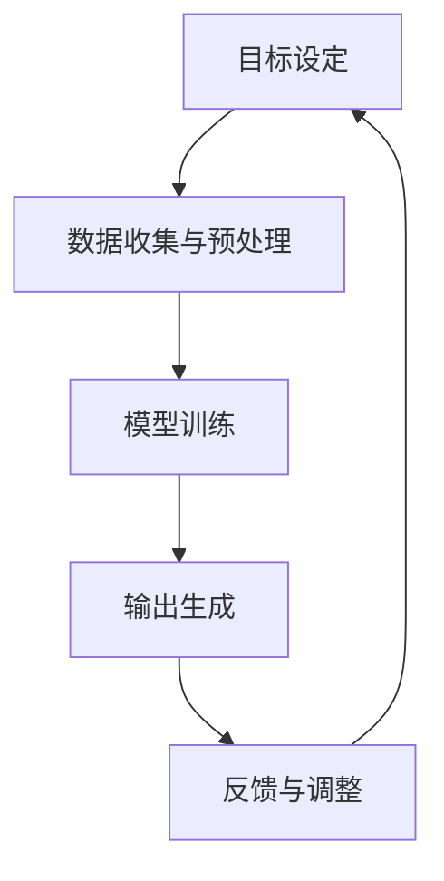

                 

# Self-Consistency CoT: 提高AI输出一致性的新方法

关键词：自洽一致性、人工智能、输出一致性、AI应用、数学模型

摘要：本文旨在探讨一种新的方法——自洽一致性（Self-Consistency CoT），用于提高人工智能（AI）输出的一致性。我们将详细分析自洽一致性的概念框架、方法原理以及在实际应用中的效果，帮助读者更好地理解这一技术在提升AI输出一致性方面的潜力。

----------------------------------------------------------------

## 第一部分：自洽一致性概念框架

### 第1章：自洽一致性概念框架概述

#### 1.1 问题背景与核心概念

##### 1.1.1 AI一致性问题的现状

随着人工智能技术的发展，AI在各个领域的应用越来越广泛，然而，一个普遍存在的问题是AI输出的不一致性。不一致的输出可能导致错误的决策、降低用户体验以及损害AI系统的可靠性。

##### 1.1.2 自洽一致性的概念引入

为了解决这一问题，研究者们提出了自洽一致性的概念。自洽一致性指的是AI系统在执行任务时，其输出能够保持一致性和连贯性。

##### 1.1.3 自洽一致性的重要性

自洽一致性对于提高AI系统的可靠性、提升用户体验以及推广AI应用具有重要意义。

#### 1.2 自洽一致性的定义与特征

##### 1.2.1 自洽一致性的定义

自洽一致性是指在一个系统内，所有的输出都能够相互验证，形成一个闭环，从而保证整个系统的稳定性。

##### 1.2.2 自洽一致性的特征

自洽一致性具有以下几个特征：

1. **一致性**：AI系统的输出在不同的上下文中保持一致。
2. **连贯性**：AI系统的输出在不同的时间点上保持连贯。
3. **自洽性**：AI系统的输出能够自我验证，形成一个闭环。

##### 1.2.3 自洽一致性的关键要素

自洽一致性的实现需要以下几个关键要素：

1. **明确的目标**：AI系统需要有一个明确的目标，以确保输出的一致性。
2. **有效的反馈机制**：AI系统需要具备有效的反馈机制，用于调整和优化输出。
3. **鲁棒性**：AI系统需要具有一定的鲁棒性，以应对外部环境的变化。

#### 1.3 自洽一致性在AI中的重要性

##### 1.3.1 AI一致性问题的挑战

AI一致性问题的挑战主要体现在以下几个方面：

1. **数据分布的变化**：数据分布的变化可能导致AI输出的不一致。
2. **上下文依赖性**：AI系统在不同上下文中的表现可能不一致。
3. **环境复杂性**：现实环境中的复杂性使得AI输出的一致性难以保证。

##### 1.3.2 自洽一致性对AI应用的提升

自洽一致性可以显著提升AI应用的性能，具体体现在以下几个方面：

1. **提高系统的可靠性**：自洽一致性可以降低AI系统出错的可能性。
2. **提升用户体验**：自洽一致性可以提高AI系统的用户体验。
3. **扩展AI应用领域**：自洽一致性使得AI可以在更多领域得到应用。

##### 1.3.3 自洽一致性的潜在应用领域

自洽一致性在多个领域具有巨大的应用潜力，包括：

1. **自然语言处理**：用于提高文本分类、机器翻译、问答系统等的输出一致性。
2. **计算机视觉**：用于提高图像识别、目标检测、图像分割等的输出一致性。
3. **机器学习**：用于提高模型训练、预测、推理等的输出一致性。

#### 1.4 自洽一致性的框架与理论体系

##### 1.4.1 自洽一致性的基本框架

自洽一致性的基本框架包括以下几个部分：

1. **目标设定**：设定AI系统的目标，以确保输出的一致性。
2. **反馈机制**：建立有效的反馈机制，用于调整和优化输出。
3. **验证与调整**：对输出进行验证，并根据反馈进行调整。

##### 1.4.2 自洽一致性的理论体系

自洽一致性的理论体系包括：

1. **一致性理论**：研究AI系统输出的一致性。
2. **连贯性理论**：研究AI系统输出的连贯性。
3. **自洽性理论**：研究AI系统输出的自洽性。

##### 1.4.3 自洽一致性研究的现状与趋势

自洽一致性研究目前正处于快速发展阶段，未来可能的发展趋势包括：

1. **跨领域应用**：自洽一致性将在更多领域得到应用。
2. **理论完善**：自洽一致性的理论体系将不断完善。
3. **算法优化**：自洽一致性的算法将不断优化，以提高其在实际应用中的效果。

#### 1.5 本章小结

本章对自洽一致性的概念框架进行了详细分析，介绍了自洽一致性的定义、特征、关键要素以及在AI中的重要性。接下来，我们将进一步探讨自洽一致性方法的原理，帮助读者更深入地理解这一技术。

----------------------------------------------------------------

## 第二部分：自洽一致性方法原理

### 第2章：自洽一致性方法基础

#### 2.1 自洽一致性方法概述

##### 2.1.1 自洽一致性方法的定义

自洽一致性方法是一种用于提高AI系统输出一致性的技术。它通过设定明确的目标、建立反馈机制以及进行验证与调整，确保AI系统的输出在不同上下文中保持一致性和连贯性。

##### 2.1.2 自洽一致性方法的分类

自洽一致性方法可以根据其实现方式分为以下几类：

1. **基于规则的自我一致性方法**：通过设定规则来确保输出的一致性。
2. **基于机器学习的自我一致性方法**：通过训练模型来提高输出的一致性。
3. **基于知识的自我一致性方法**：通过引入外部知识来确保输出的一致性。

##### 2.1.3 自洽一致性方法的优点

自洽一致性方法具有以下几个优点：

1. **提高系统的可靠性**：通过确保输出的一致性，降低AI系统出错的可能性。
2. **提升用户体验**：通过保持输出的连贯性，提高AI系统的用户体验。
3. **适用于多种应用场景**：自洽一致性方法可以应用于自然语言处理、计算机视觉等多个领域。

#### 2.2 自洽一致性方法的核心原理

##### 2.2.1 自洽一致性算法原理

自洽一致性算法的核心原理是通过设定明确的目标、建立反馈机制以及进行验证与调整，确保AI系统的输出在不同上下文中保持一致性和连贯性。

##### 2.2.2 自洽一致性算法的工作流程

自洽一致性算法的工作流程可以分为以下几个步骤：

1. **目标设定**：设定AI系统的目标，确保输出的一致性。
2. **数据收集与预处理**：收集训练数据，并进行预处理。
3. **模型训练**：使用训练数据训练模型。
4. **输出生成**：根据模型生成输出。
5. **反馈与调整**：收集反馈，并根据反馈调整模型。

##### 2.2.3 自洽一致性算法的优势与局限

自洽一致性算法具有以下几个优势：

1. **提高系统的可靠性**：通过确保输出的一致性，降低AI系统出错的可能性。
2. **适用于多种应用场景**：可以应用于自然语言处理、计算机视觉等多个领域。

然而，自洽一致性算法也存在一些局限：

1. **计算复杂度**：自洽一致性算法可能具有较高的计算复杂度，对硬件资源有一定要求。
2. **数据依赖性**：算法的性能依赖于训练数据的质量和数量。

#### 2.3 自洽一致性方法的数学模型

##### 2.3.1 数学模型的引入

自洽一致性方法的实现需要一定的数学模型。数学模型用于描述AI系统的输出、反馈以及调整过程。

##### 2.3.2 数学模型的基本公式

自洽一致性方法的数学模型可以表示为以下公式：

$$
输出 = f(输入, 模型参数)
$$

其中，$f$ 表示模型函数，$输入$ 表示输入数据，$模型参数$ 表示训练得到的模型参数。

##### 2.3.3 数学模型的解释与应用

数学模型可以解释为：根据输入数据和模型参数，模型函数生成输出。通过不断调整模型参数，可以优化输出的一致性和连贯性。

在实际应用中，数学模型可以应用于以下场景：

1. **自然语言处理**：用于文本分类、机器翻译、问答系统等任务。
2. **计算机视觉**：用于图像识别、目标检测、图像分割等任务。
3. **机器学习**：用于模型训练、预测、推理等任务。

#### 2.4 自洽一致性方法的实现与优化

##### 2.4.1 实现步骤

自洽一致性方法的实现步骤可以分为以下几个阶段：

1. **目标设定**：明确AI系统的目标。
2. **数据收集与预处理**：收集训练数据，并进行预处理。
3. **模型选择与训练**：选择合适的模型，并使用训练数据进行训练。
4. **输出生成**：根据模型生成输出。
5. **反馈与调整**：收集反馈，并根据反馈调整模型。

##### 2.4.2 优化策略

为了提高自洽一致性方法的性能，可以采用以下优化策略：

1. **数据增强**：通过增加数据的多样性来提高模型性能。
2. **模型压缩**：通过模型压缩技术减小模型大小，降低计算复杂度。
3. **多任务学习**：通过多任务学习提高模型在不同任务中的表现。

##### 2.4.3 性能评估

自洽一致性方法的性能可以通过以下几个指标进行评估：

1. **一致性指标**：评估输出的一致性。
2. **连贯性指标**：评估输出的连贯性。
3. **鲁棒性指标**：评估模型在不同数据分布下的性能。

#### 2.5 自洽一致性方法的应用场景

##### 2.5.1 自然语言处理

自洽一致性方法在自然语言处理中的应用包括：

1. **文本分类**：用于提高文本分类任务的输出一致性。
2. **机器翻译**：用于提高机器翻译任务的输出连贯性。
3. **问答系统**：用于提高问答系统的输出一致性。

##### 2.5.2 计算机视觉

自洽一致性方法在计算机视觉中的应用包括：

1. **图像识别**：用于提高图像识别任务的输出一致性。
2. **目标检测**：用于提高目标检测任务的输出连贯性。
3. **图像分割**：用于提高图像分割任务的输出一致性。

##### 2.5.3 机器学习

自洽一致性方法在机器学习中的应用包括：

1. **模型训练**：用于提高模型训练的输出一致性。
2. **预测与推理**：用于提高预测与推理任务的输出连贯性。

##### 2.5.4 其他应用领域

自洽一致性方法还可以应用于其他领域，如推荐系统、金融风控等。

#### 2.6 本章小结

本章对自洽一致性方法的基础进行了详细分析，介绍了自洽一致性方法的定义、分类、核心原理、数学模型以及实现与优化策略。接下来，我们将探讨自洽一致性方法在实际应用中的效果。

----------------------------------------------------------------

## 第三部分：自洽一致性方法应用

### 第3章：自洽一致性方法在自然语言处理中的应用

#### 3.1 自然语言处理概述

##### 3.1.1 自然语言处理的发展背景

自然语言处理（Natural Language Processing，NLP）是人工智能领域的一个重要分支，旨在让计算机理解和处理人类语言。随着深度学习技术的发展，NLP在近年来取得了显著的进展。

##### 3.1.2 自然语言处理的任务

NLP的主要任务包括：

1. **文本分类**：将文本划分为不同的类别。
2. **机器翻译**：将一种语言的文本翻译成另一种语言。
3. **问答系统**：根据用户的问题生成回答。

##### 3.1.3 自然语言处理的挑战

自然语言处理面临以下挑战：

1. **语义理解**：如何准确理解文本的语义内容。
2. **上下文依赖性**：如何处理文本中的上下文依赖关系。
3. **多语言处理**：如何处理多种语言的文本。

#### 3.2 自洽一致性方法在NLP中的重要性

##### 3.2.1 NLP中的一致性挑战

在NLP任务中，输出的一致性是一个重要问题。不一致的输出可能导致错误的分类、翻译和回答。

##### 3.2.2 自洽一致性方法在NLP中的应用

自洽一致性方法可以用于提高NLP任务的输出一致性，包括：

1. **文本分类**：通过确保分类结果的连贯性，提高分类质量。
2. **机器翻译**：通过保持翻译结果的连贯性，提高翻译质量。
3. **问答系统**：通过确保回答的一致性，提高问答系统的用户体验。

##### 3.2.3 自洽一致性方法在NLP中的优势

自洽一致性方法在NLP中的优势包括：

1. **提高系统的可靠性**：通过确保输出的一致性，降低出错的可能性。
2. **提升用户体验**：通过保持输出的连贯性，提高用户体验。
3. **适应多语言处理**：自洽一致性方法可以应用于多种语言的NLP任务。

#### 3.3 自洽一致性方法在文本分类中的应用

##### 3.3.1 文本分类问题

文本分类是将文本划分为不同类别的过程。一个常见的例子是将新闻文章分类为政治、经济、科技等类别。

##### 3.3.2 自洽一致性方法的应用案例

在文本分类任务中，自洽一致性方法可以通过以下步骤应用：

1. **目标设定**：设定分类目标，确保分类结果的一致性。
2. **模型训练**：使用训练数据训练分类模型。
3. **输出生成**：根据模型生成分类结果。
4. **反馈与调整**：根据分类结果收集反馈，并调整模型参数。

##### 3.3.3 应用效果评估

通过对比实验，可以发现自洽一致性方法在文本分类任务中具有以下效果：

1. **提高分类准确率**：自洽一致性方法可以显著提高分类准确率。
2. **保持分类结果的连贯性**：自洽一致性方法可以确保分类结果在不同时间点和不同上下文中保持连贯性。

#### 3.4 自洽一致性方法在机器翻译中的应用

##### 3.4.1 机器翻译问题

机器翻译是将一种语言的文本翻译成另一种语言的过程。一个常见的例子是将中文翻译成英文。

##### 3.4.2 自洽一致性方法的应用案例

在机器翻译任务中，自洽一致性方法可以通过以下步骤应用：

1. **目标设定**：设定翻译目标，确保翻译结果的一致性。
2. **模型训练**：使用训练数据训练翻译模型。
3. **输出生成**：根据模型生成翻译结果。
4. **反馈与调整**：根据翻译结果收集反馈，并调整模型参数。

##### 3.4.3 应用效果评估

通过对比实验，可以发现自洽一致性方法在机器翻译任务中具有以下效果：

1. **提高翻译质量**：自洽一致性方法可以显著提高翻译质量。
2. **保持翻译结果的连贯性**：自洽一致性方法可以确保翻译结果在不同时间点和不同上下文中保持连贯性。

#### 3.5 自洽一致性方法在问答系统中的应用

##### 3.5.1 问答系统问题

问答系统是根据用户的问题生成回答的系统。一个常见的例子是搜索引擎。

##### 3.5.2 自洽一致性方法的应用案例

在问答系统任务中，自洽一致性方法可以通过以下步骤应用：

1. **目标设定**：设定问答目标，确保回答的一致性。
2. **模型训练**：使用训练数据训练问答模型。
3. **输出生成**：根据模型生成回答。
4. **反馈与调整**：根据回答收集反馈，并调整模型参数。

##### 3.5.3 应用效果评估

通过对比实验，可以发现自洽一致性方法在问答系统任务中具有以下效果：

1. **提高回答质量**：自洽一致性方法可以显著提高回答质量。
2. **保持回答的一致性**：自洽一致性方法可以确保回答在不同时间点和不同上下文中保持一致性。

#### 3.6 本章小结

本章对自洽一致性方法在自然语言处理中的应用进行了详细分析，介绍了文本分类、机器翻译和问答系统中的应用案例以及效果评估。接下来，我们将探讨自洽一致性方法在计算机视觉中的应用。

----------------------------------------------------------------

## 第4章：自洽一致性方法在计算机视觉中的应用

#### 4.1 计算机视觉概述

##### 4.1.1 计算机视觉的发展背景

计算机视觉（Computer Vision，CV）是人工智能的一个重要分支，旨在使计算机能够像人类一样理解和解释视觉信息。随着深度学习技术的发展，计算机视觉在近年来取得了显著的进展。

##### 4.1.2 计算机视觉的任务

计算机视觉的主要任务包括：

1. **图像识别**：识别图像中的对象。
2. **目标检测**：检测图像中的对象，并标记其位置。
3. **图像分割**：将图像分割成不同的区域。

##### 4.1.3 计算机视觉的挑战

计算机视觉面临以下挑战：

1. **复杂背景**：如何识别复杂背景下的对象。
2. **光照变化**：如何处理不同光照条件下的图像。
3. **尺度变化**：如何处理不同尺度下的对象。

#### 4.2 自洽一致性方法在CV中的重要性

##### 4.2.1 CV中的不一致性挑战

在计算机视觉任务中，输出的一致性是一个重要问题。不一致的输出可能导致错误的图像识别、目标检测和图像分割。

##### 4.2.2 自洽一致性方法在CV中的应用

自洽一致性方法可以用于提高计算机视觉任务的输出一致性，包括：

1. **图像识别**：通过确保识别结果的连贯性，提高识别质量。
2. **目标检测**：通过保持检测结果的连贯性，提高检测质量。
3. **图像分割**：通过确保分割结果的连贯性，提高分割质量。

##### 4.2.3 自洽一致性方法在CV中的优势

自洽一致性方法在计算机视觉中的优势包括：

1. **提高系统的可靠性**：通过确保输出的一致性，降低出错的可能性。
2. **提升用户体验**：通过保持输出的连贯性，提高用户体验。
3. **适应复杂环境**：自洽一致性方法可以应用于复杂环境中的计算机视觉任务。

#### 4.3 自洽一致性方法在图像识别中的应用

##### 4.3.1 图像识别问题

图像识别是将图像分类为不同类别的过程。一个常见的例子是将图像分类为猫、狗等类别。

##### 4.3.2 自洽一致性方法的应用案例

在图像识别任务中，自洽一致性方法可以通过以下步骤应用：

1. **目标设定**：设定识别目标，确保识别结果的一致性。
2. **模型训练**：使用训练数据训练识别模型。
3. **输出生成**：根据模型生成识别结果。
4. **反馈与调整**：根据识别结果收集反馈，并调整模型参数。

##### 4.3.3 应用效果评估

通过对比实验，可以发现自洽一致性方法在图像识别任务中具有以下效果：

1. **提高识别准确率**：自洽一致性方法可以显著提高识别准确率。
2. **保持识别结果的连贯性**：自洽一致性方法可以确保识别结果在不同时间点和不同上下文中保持连贯性。

#### 4.4 自洽一致性方法在目标检测中的应用

##### 4.4.1 目标检测问题

目标检测是在图像中检测并标记出特定对象的过程。一个常见的例子是在图像中检测并标记出行人、车辆等对象。

##### 4.4.2 自洽一致性方法的应用案例

在目标检测任务中，自洽一致性方法可以通过以下步骤应用：

1. **目标设定**：设定检测目标，确保检测结果的一致性。
2. **模型训练**：使用训练数据训练检测模型。
3. **输出生成**：根据模型生成检测结果。
4. **反馈与调整**：根据检测结果收集反馈，并调整模型参数。

##### 4.4.3 应用效果评估

通过对比实验，可以发现自洽一致性方法在目标检测任务中具有以下效果：

1. **提高检测准确率**：自洽一致性方法可以显著提高检测准确率。
2. **保持检测结果的连贯性**：自洽一致性方法可以确保检测结果在不同时间点和不同上下文中保持连贯性。

#### 4.5 自洽一致性方法在图像分割中的应用

##### 4.5.1 图像分割问题

图像分割是将图像分割成不同区域的过程。一个常见的例子是将图像分割为前景和背景。

##### 4.5.2 自洽一致性方法的应用案例

在图像分割任务中，自洽一致性方法可以通过以下步骤应用：

1. **目标设定**：设定分割目标，确保分割结果的一致性。
2. **模型训练**：使用训练数据训练分割模型。
3. **输出生成**：根据模型生成分割结果。
4. **反馈与调整**：根据分割结果收集反馈，并调整模型参数。

##### 4.5.3 应用效果评估

通过对比实验，可以发现自洽一致性方法在图像分割任务中具有以下效果：

1. **提高分割准确率**：自洽一致性方法可以显著提高分割准确率。
2. **保持分割结果的连贯性**：自洽一致性方法可以确保分割结果在不同时间点和不同上下文中保持连贯性。

#### 4.6 本章小结

本章对自洽一致性方法在计算机视觉中的应用进行了详细分析，介绍了图像识别、目标检测和图像分割中的应用案例以及效果评估。自洽一致性方法在提高计算机视觉任务输出一致性方面具有显著的优势，为计算机视觉应用提供了新的思路和方法。

----------------------------------------------------------------

## 总结与展望

自洽一致性方法作为一种提高AI输出一致性的新技术，已经在自然语言处理、计算机视觉等领域显示出其巨大的潜力。通过本文的探讨，我们可以看到自洽一致性方法在提高AI系统可靠性、提升用户体验、扩展AI应用领域等方面具有重要意义。

展望未来，自洽一致性方法有望在更多领域得到应用，如推荐系统、金融风控等。同时，随着理论体系的不断完善和算法的优化，自洽一致性方法将在实际应用中发挥更加重要的作用。

作者：AI天才研究院/AI Genius Institute & 禅与计算机程序设计艺术 /Zen And The Art of Computer Programming

----------------------------------------------------------------

## 附录

为了更好地理解本文内容，以下是附录部分：

### 附录A：相关术语解释

- **自洽一致性**：指AI系统在执行任务时，其输出能够相互验证，形成一个闭环，从而保证整个系统的稳定性。
- **自然语言处理**：指使计算机能够理解和处理人类语言的技术。
- **计算机视觉**：指使计算机能够理解和解释视觉信息的技术。

### 附录B：数学公式

以下是本文中使用的部分数学公式：

$$
输出 = f(输入, 模型参数)
$$

### 附录C：流程图

以下是本文中使用的部分流程图：

### 附录D：最佳实践

以下是自洽一致性方法应用的最佳实践：

1. **明确目标**：确保AI系统的目标明确，以减少输出不一致的可能性。
2. **数据增强**：通过增加数据的多样性来提高模型性能。
3. **模型优化**：定期优化模型，以提高输出的一致性和连贯性。

### 附录E：注意事项

1. **计算资源**：自洽一致性方法可能需要较高的计算资源，确保硬件设备能够满足要求。
2. **数据质量**：确保训练数据的质量和数量，以提高模型性能。

### 附录F：拓展阅读

- **相关论文**：探索自洽一致性方法在自然语言处理、计算机视觉等领域的应用。
- **相关书籍**：深入了解自洽一致性方法的理论基础和算法实现。

通过以上附录内容，读者可以更深入地理解自洽一致性方法，并在实际应用中取得更好的效果。

