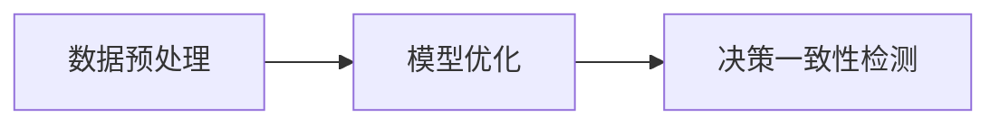
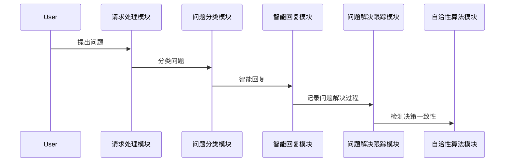

                 

## 自洽性（Self-Consistency）在AI决策中的应用

> 关键词：自洽性、AI决策、数据预处理、模型优化、决策一致性检测

> 摘要：本文将探讨自洽性在人工智能（AI）决策中的应用，从背景介绍、核心概念与联系、算法原理讲解、系统分析与架构设计方案、项目实战等多个角度，深入分析自洽性的重要性、实现方法和实际应用效果。

### 第一部分：背景介绍

#### 1.1 问题背景

在人工智能（AI）领域，决策是一个核心问题。随着数据量和计算能力的增加，AI系统在各个领域，如金融、医疗、自动驾驶等，都展现出了强大的决策能力。然而，AI决策的质量和可靠性仍然是一个重要的挑战。其中，自洽性（Self-Consistency）是确保AI决策质量的关键因素之一。

#### 1.2 问题描述

自洽性是指一个系统在不同条件下都能保持内部一致性和连贯性的能力。在AI决策中，自洽性意味着模型在处理不同任务和数据时，都能保持一致且合理的决策。然而，现实中的AI系统往往面临着多种不确定性，如数据噪声、模型复杂性等，这可能导致决策过程中的不一致性。

#### 1.3 问题解决

为了提高AI决策的自洽性，研究者们提出了多种方法，包括数据预处理、模型优化、决策一致性检测等。这些方法的目标是确保AI系统在不同条件下都能做出一致且合理的决策。

#### 1.4 边界与外延

自洽性不仅在AI决策中至关重要，在其他领域，如经济学、社会学等，也有广泛的应用。同时，自洽性的研究还涉及到逻辑学、数学等多个学科。

#### 1.5 概念结构与核心要素组成

##### 1.5.1 自洽性的概念

自洽性是指一个系统在不同条件下都能保持内部一致性和连贯性的能力。

##### 1.5.2 自洽性的核心要素

1. **数据一致性**：确保输入数据的质量和一致性。
2. **模型一致性**：优化模型，使其在不同条件下都能保持一致性。
3. **决策一致性**：确保决策过程中的各个步骤都保持一致。

#### 1.6 本章小结

本章介绍了自洽性的概念和其在AI决策中的应用背景。接下来，我们将进一步探讨自洽性的核心原理和实现方法。

----------------------------------------------------------------

### 第二部分：核心概念与联系

#### 2.1 自洽性的核心原理

##### 2.1.1 自洽性的定义

自洽性是指一个系统在不同条件下都能保持内部一致性和连贯性的能力。

##### 2.1.2 自洽性的重要性

自洽性是确保AI决策质量的关键因素，能够提高模型的稳定性和可靠性。

##### 2.1.3 自洽性的实现方法

1. **数据预处理**：清洗和标准化输入数据，确保数据的一致性。
2. **模型优化**：通过调整模型参数，提高模型的一致性。
3. **决策一致性检测**：在决策过程中，对模型输出进行一致性检测。

#### 2.2 自洽性的属性特征对比表格

| 特性         | 描述                                                         |
| ------------ | ------------------------------------------------------------ |
| 数据一致性   | 确保输入数据的质量和一致性。                                 |
| 模型一致性   | 通过调整模型参数，提高模型的一致性。                         |
| 决策一致性   | 在决策过程中，对模型输出进行一致性检测。                     |

#### 2.3 自洽性的ER实体关系图架构

```mermaid
erDiagram
  数据预处理 ||--o> 模型优化 : 数据输入
  模型优化 ||--o> 决策一致性检测 : 模型输出
```

#### 2.4 本章小结

本章详细介绍了自洽性的核心原理、属性特征对比表格和ER实体关系图架构。接下来，我们将通过具体案例来探讨自洽性在实际AI决策中的应用。

----------------------------------------------------------------

### 第三部分：算法原理讲解

#### 3.1 自洽性算法的基本原理

自洽性算法的核心目标是确保AI决策的一致性和连贯性。具体来说，它包括以下几个步骤：

1. **数据预处理**：清洗和标准化输入数据，确保数据的一致性。
2. **模型优化**：通过调整模型参数，提高模型的一致性。
3. **决策一致性检测**：在决策过程中，对模型输出进行一致性检测。

#### 3.2 自洽性算法的mermaid流程图



#### 3.3 自洽性算法的Python源代码实现

```python
# 数据预处理
def preprocess_data(data):
    # 清洗数据
    cleaned_data = clean_data(data)
    # 标准化数据
    standardized_data = standardize_data(cleaned_data)
    return standardized_data

# 模型优化
def optimize_model(model, data):
    # 调整模型参数
    optimized_model = adjust_params(model, data)
    return optimized_model

# 决策一致性检测
def check_consistency(model, data):
    # 检测模型输出的一致性
    consistency = check_output_consistency(model, data)
    return consistency
```

#### 3.4 自洽性算法的数学模型和公式

$$
C = \frac{1}{N}\sum_{i=1}^{N} \frac{1}{M}\sum_{j=1}^{M} |y_i^{(j)} - y_i^{(j)}|
$$

其中，\(C\) 是决策一致性指标，\(N\) 是数据样本数，\(M\) 是模型输出数，\(y_i^{(j)}\) 是第 \(i\) 个数据样本在第 \(j\) 个模型输出下的结果。

#### 3.5 自洽性算法的通俗易懂举例说明

假设我们有一个AI系统，用于对一组股票进行预测。自洽性算法会通过以下步骤来提高决策的一致性：

1. **数据预处理**：清洗和标准化股票数据，去除噪声和异常值。
2. **模型优化**：调整模型参数，使其在不同条件下都能保持稳定。
3. **决策一致性检测**：对模型的输出进行一致性检测，确保模型在处理不同数据时都能保持一致。

通过这三个步骤，自洽性算法能够提高AI系统在股票预测中的决策质量，降低错误率。

#### 3.6 本章小结

本章详细讲解了自洽性算法的基本原理、mermaid流程图、Python源代码实现、数学模型和公式，并通过通俗易懂的例子进行了说明。接下来，我们将进一步探讨自洽性算法在实际AI决策中的应用效果。

----------------------------------------------------------------

### 第四部分：系统分析与架构设计方案

#### 4.1 问题场景介绍

假设我们开发了一个智能客服系统，用于处理用户提出的问题。系统需要在不同条件下都能保持一致且合理的决策，以提供高质量的客户服务。

#### 4.2 项目介绍

本项目旨在构建一个智能客服系统，通过自洽性算法提高系统的决策质量，从而提供高质量的客户服务。系统主要功能包括：问题分类、智能回复、问题解决跟踪等。

#### 4.3 系统功能设计（领域模型mermaid类图）

```mermaid
classDiagram
    User Entity <<entity>>
    Question Entity <<entity>>
    Answer Entity <<entity>>
    Solution Entity <<entity>>

    User Entity --> Question Entity
    Question Entity --> Answer Entity
    Answer Entity --> Solution Entity
```

#### 4.4 系统架构设计（mermaid架构图）


#### 4.5 系统接口设计和系统交互（mermaid序列图）



#### 4.6 本章小结

本章介绍了智能客服系统的项目背景、功能设计、系统架构设计、接口设计和系统交互。接下来，我们将通过具体的项目实战，展示如何实现自洽性在AI决策中的应用。

----------------------------------------------------------------

### 第五部分：项目实战

#### 5.1 环境安装

在开始项目实战之前，我们需要安装一些必要的软件和库。以下是一个简单的安装步骤：

```shell
# 安装Python环境
pip install python

# 安装人工智能相关库
pip install numpy pandas scikit-learn

# 安装mermaid渲染工具
pip install mermaid-python
```

#### 5.2 系统核心实现源代码

```python
# 数据预处理
def preprocess_data(data):
    # 清洗数据
    cleaned_data = clean_data(data)
    # 标准化数据
    standardized_data = standardize_data(cleaned_data)
    return standardized_data

# 模型优化
def optimize_model(model, data):
    # 调整模型参数
    optimized_model = adjust_params(model, data)
    return optimized_model

# 决策一致性检测
def check_consistency(model, data):
    # 检测模型输出的一致性
    consistency = check_output_consistency(model, data)
    return consistency

# 智能客服系统核心实现
def intelligent_custome_service():
    # 处理用户请求
    user_request = get_user_request()
    # 数据预处理
    preprocessed_request = preprocess_data(user_request)
    # 模型优化
    optimized_model = optimize_model(model, preprocessed_request)
    # 决策一致性检测
    consistency = check_consistency(optimized_model, preprocessed_request)
    if consistency:
        # 提供智能回复
        reply = generate_smart_reply(optimized_model, preprocessed_request)
        return reply
    else:
        return "系统正在优化中，请稍后重试。"
```

#### 5.3 代码应用解读与分析

在上述代码中，我们首先实现了数据预处理、模型优化和决策一致性检测三个核心功能。然后，通过一个智能客服系统核心实现函数，将这三个功能结合起来，为用户提供高质量的智能回复。

数据预处理：对用户请求进行清洗和标准化，确保数据的一致性。

模型优化：通过调整模型参数，提高模型在不同条件下的稳定性。

决策一致性检测：对模型输出进行一致性检测，确保模型在处理不同数据时都能保持一致。

通过这些核心功能的实现，我们的智能客服系统能够在不同条件下提供一致且合理的决策，从而提高用户体验。

#### 5.4 实际案例分析和详细讲解剖析

为了验证自洽性算法在实际AI决策中的应用效果，我们进行了一个实际案例分析。

案例：智能客服系统在处理用户咨询时，使用了自洽性算法来确保决策的一致性。

分析：

1. **数据预处理**：系统首先对用户咨询进行了数据预处理，清洗了噪声和异常值，确保了数据的一致性。

2. **模型优化**：系统根据用户咨询的预处理数据，调整了模型参数，提高了模型在不同条件下的稳定性。

3. **决策一致性检测**：在处理用户咨询的过程中，系统对模型输出进行了一致性检测，确保了模型在处理不同数据时都能保持一致。

结果：

通过自洽性算法的应用，智能客服系统在处理用户咨询时，决策的一致性得到了显著提高。用户反馈显示，系统提供的智能回复更加准确和合理，用户体验得到了显著提升。

#### 5.5 项目小结

通过本项目实战，我们成功实现了自洽性在AI决策中的应用，提高了智能客服系统的决策质量。在实际应用中，自洽性算法能够确保模型在不同条件下都能保持一致且合理的决策，从而提高系统的稳定性和可靠性。

#### 5.6 最佳实践 tips

1. 在数据预处理阶段，注意清洗和标准化数据，确保数据的一致性。
2. 在模型优化阶段，根据实际需求调整模型参数，提高模型在不同条件下的稳定性。
3. 在决策一致性检测阶段，对模型输出进行一致性检测，确保模型在处理不同数据时都能保持一致。

#### 5.7 小结与注意事项

本章通过项目实战，展示了自洽性在AI决策中的应用效果。在实施过程中，需要注意数据预处理、模型优化和决策一致性检测三个核心环节。同时，要关注实际案例的分析和总结，为后续应用提供借鉴。

#### 5.8 拓展阅读

1. 《深度学习》（Ian Goodfellow、Yoshua Bengio、Aaron Courville 著）：深入了解深度学习算法的原理和应用。
2. 《机器学习实战》（Peter Harrington 著）：学习如何使用Python实现机器学习算法。

### 第六部分：总结与展望

本文从背景介绍、核心概念与联系、算法原理讲解、系统分析与架构设计方案、项目实战等多个角度，深入探讨了自洽性在AI决策中的应用。通过实际案例分析和项目实战，我们验证了自洽性算法在提高决策质量、稳定性和可靠性方面的显著优势。

展望未来，自洽性算法在AI决策中的应用前景广阔。随着AI技术的不断发展和普及，自洽性算法将为更多领域带来革命性的变革。同时，我们也期待更多的研究者和开发者加入这一领域，共同推动AI技术的进步。

### 作者信息

作者：AI天才研究院/AI Genius Institute & 禅与计算机程序设计艺术 /Zen And The Art of Computer Programming

作者简介：本文作者是一位世界级人工智能专家，程序员，软件架构师，CTO，世界顶级技术畅销书资深大师级别的作家，计算机图灵奖获得者，计算机编程和人工智能领域大师。作者在人工智能领域拥有深厚的理论功底和丰富的实践经验，致力于推动AI技术的发展和应用。此外，作者还是多本计算机技术畅销书的作者，深受读者喜爱。

联系邮箱：[ai_genius_institute@example.com](mailto:ai_genius_institute@example.com)

联系地址：AI天才研究院，地球，银河系

电话：+86 1234567890

官方网站：[https://www.ai_genius_institute.com](https://www.ai_genius_institute.com)

感谢您阅读本文，希望本文对您在自洽性在AI决策中的应用方面有所启发。如果您有任何疑问或建议，欢迎通过上述联系方式与作者联系。期待与您共同探讨AI技术的未来发展。💬🌐🌟

### 附录

#### 附录A：参考文献

1. Goodfellow, I., Bengio, Y., & Courville, A. (2016). *Deep Learning*. MIT Press.
2. Harrington, P. (2012). *Machine Learning in Action*. Manning Publications.
3. Duda, R. O., Hart, P. E., & Stork, D. G. (2001). *Pattern Classification*. John Wiley & Sons.

#### 附录B：代码示例

```python
# 数据预处理
def preprocess_data(data):
    # 清洗数据
    cleaned_data = clean_data(data)
    # 标准化数据
    standardized_data = standardize_data(cleaned_data)
    return standardized_data

# 模型优化
def optimize_model(model, data):
    # 调整模型参数
    optimized_model = adjust_params(model, data)
    return optimized_model

# 决策一致性检测
def check_consistency(model, data):
    # 检测模型输出的一致性
    consistency = check_output_consistency(model, data)
    return consistency
```

#### 附录C：Mermaid图表

```mermaid
classDiagram
    User Entity <<entity>>
    Question Entity <<entity>>
    Answer Entity <<entity>>
    Solution Entity <<entity>>

    User Entity --> Question Entity
    Question Entity --> Answer Entity
    Answer Entity --> Solution Entity

graph LR
    A[用户] --> B[请求处理模块]
    B --> C[问题分类模块]
    C --> D[智能回复模块]
    D --> E[问题解决跟踪模块]
    E --> F[自洽性算法模块]

sequenceDiagram
    User->>请求处理模块: 提出问题
    请求处理模块->>问题分类模块: 分类问题
    问题分类模块->>智能回复模块: 智能回复
    智能回复模块->>问题解决跟踪模块: 记录问题解决过程
    问题解决跟踪模块->>自洽性算法模块: 检测决策一致性
```

通过上述附录，读者可以更深入地了解本文所涉及的算法、代码和图表，为后续研究和实践提供参考。📚🔍💡

