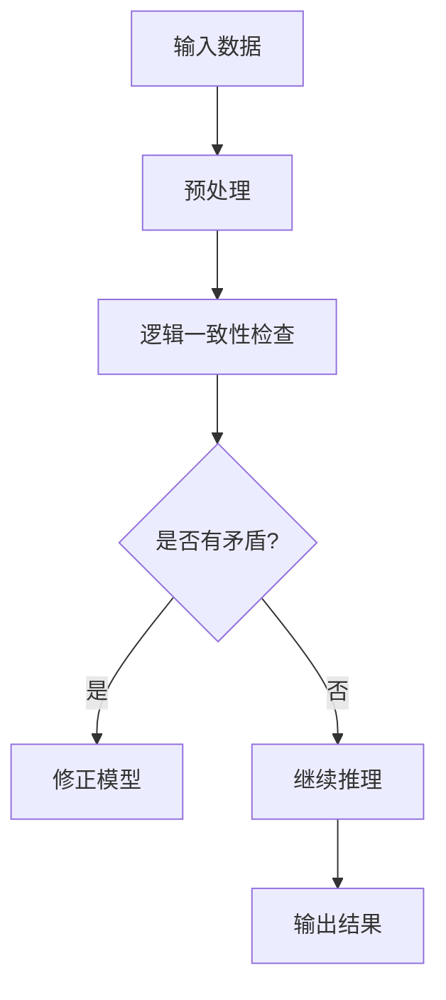
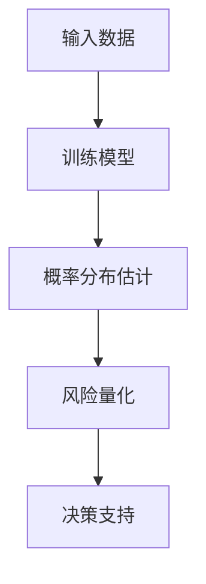
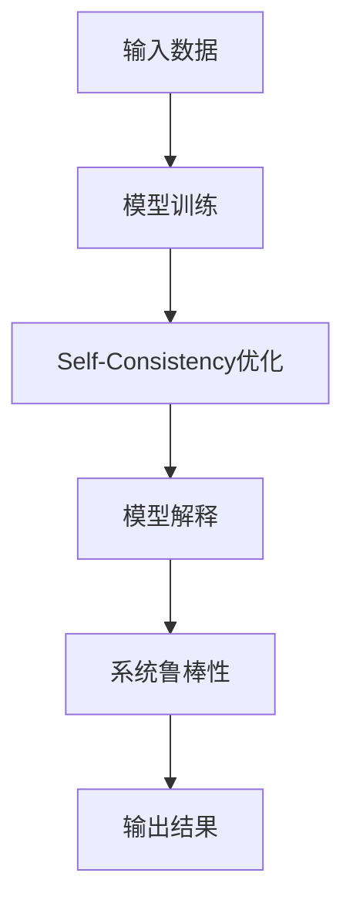
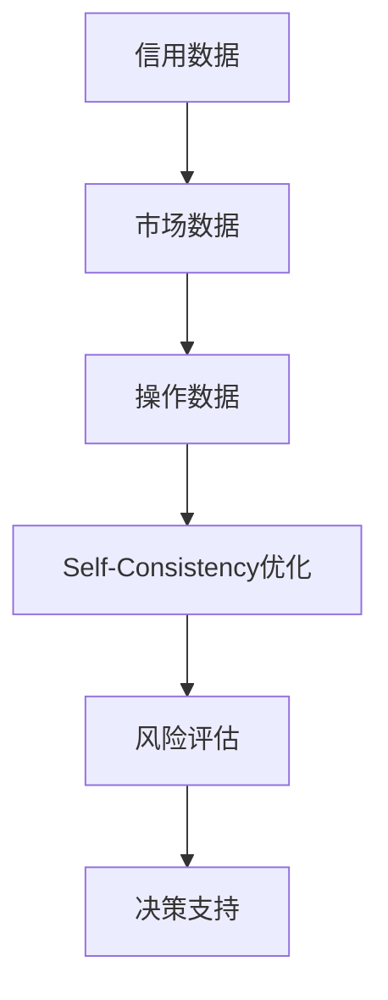
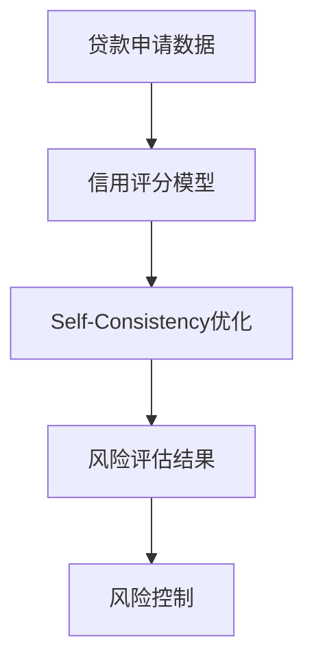
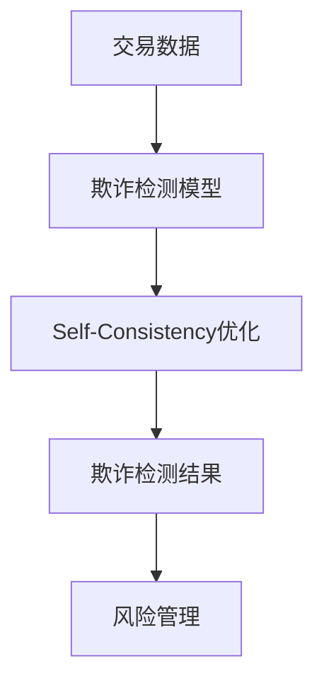

                 

### 引言

随着人工智能（AI）技术的快速发展，AI在各个领域的应用日益广泛，从金融、医疗到交通、零售等，无不受到其深远的影响。然而，AI技术的广泛应用也带来了新的挑战，特别是在AI风险评估方面。传统风险评估方法在面对复杂、动态的AI系统时，往往显得力不从心，无法准确预测和应对潜在的风险。因此，研究并应用新的风险评估方法成为了当前AI领域的重要课题。

本文将聚焦于Self-Consistency在AI风险评估中的应用。Self-Consistency，即自一致性，是一种重要的逻辑和概率概念，它要求一个系统或模型的内部信息保持一致，避免出现矛盾和不确定性。在AI风险评估中，Self-Consistency可以通过多种方式提升风险评估的准确性和稳定性，从而降低风险管理的难度和成本。

本文的结构如下：首先，我们将介绍AI风险评估的背景，阐述Self-Consistency的概念及其在AI风险评估中的重要性。接着，我们将探讨Self-Consistency的理论基础，包括其与逻辑一致性、概率论和人工智能的关系。随后，通过具体的案例，我们将展示Self-Consistency在不同领域的实际应用。最后，我们将展望Self-Consistency技术的发展趋势，探讨其在AI伦理中的应用潜力，并提供相关的工具和资源汇总。

通过这篇文章，我们希望能够为读者提供一个全面而深入的Self-Consistency在AI风险评估中的应用视角，激发更多研究和应用的可能性。让我们一起深入思考，探索Self-Consistency在AI风险评估中的巨大潜力。

### 关键词

- **人工智能（AI）**
- **风险评估**
- **Self-Consistency**
- **金融**
- **信贷**
- **反欺诈**
- **概率论**
- **伦理**

### 摘要

本文深入探讨了Self-Consistency在AI风险评估中的应用。首先，我们介绍了AI风险评估的背景和当前面临的主要挑战。随后，我们详细阐述了Self-Consistency的概念及其重要性，并分析了其理论基础，包括与逻辑一致性、概率论和人工智能的关系。通过三个具体案例——金融风险评估、信贷风险评估和反欺诈系统，我们展示了Self-Consistency在提升风险评估准确性和稳定性方面的实际应用效果。最后，我们展望了Self-Consistency技术的发展趋势，探讨了其在AI伦理中的应用潜力，并提供了相关的工具和资源汇总，为读者提供了全面的参考。

### 第一部分：引论

#### 第1章 AI风险评估中的Self-Consistency概念

在当今的数字时代，人工智能（AI）技术正迅速渗透到各行各业，带来了前所未有的变革。然而，随着AI应用的不断扩展，AI风险评估也变得愈加重要。AI风险评估不仅关乎技术的安全性，还涉及伦理、法律和经济等多个层面。有效的风险评估可以帮助企业和组织识别和应对潜在的风险，从而确保AI系统的稳定运行和可靠性。

##### 1.1.1 AI风险评估的背景

AI风险评估的背景可以追溯到人工智能技术的快速发展和广泛应用。20世纪80年代以来，AI技术在图像识别、自然语言处理、决策支持系统等领域取得了显著的突破。然而，AI系统的复杂性和黑箱特性使得传统风险评估方法难以胜任。例如，深度学习模型在图像识别任务中表现出色，但它们的工作原理往往难以解释，导致无法准确评估其潜在风险。此外，AI系统可能存在的偏见、歧视、隐私泄露等问题也使得风险评估成为一项紧迫的任务。

##### 1.1.2 Self-Consistency的概念及其重要性

Self-Consistency，即自一致性，是一种重要的逻辑和概率概念。它要求一个系统或模型的内部信息保持一致，避免出现矛盾和不确定性。在AI风险评估中，Self-Consistency具有至关重要的作用。具体来说，自一致性可以帮助识别和纠正模型中的不一致性，提高风险评估的准确性和稳定性。

自一致性在AI风险评估中的重要性主要体现在以下几个方面：

1. **提高模型的可解释性**：自一致性要求模型内部信息保持一致，这有助于提高模型的可解释性。通过确保模型输出与输入信息的一致性，用户可以更好地理解和信任模型的结果。
2. **降低错误率**：自一致性可以减少模型中的错误和偏差。通过在训练和测试过程中保持信息的一致性，可以有效降低模型的预测误差，提高风险评估的准确性。
3. **增强系统的鲁棒性**：自一致性有助于提高系统的鲁棒性。在复杂和动态的环境中，保持内部信息的一致性可以帮助系统更好地适应变化，降低因信息不一致导致的故障和错误。
4. **确保合规性**：在许多领域，如金融和医疗，合规性是至关重要的。自一致性可以帮助确保AI系统符合相关法规和标准，降低法律和伦理风险。

##### 1.1.3 Self-Consistency的基本原则

Self-Consistency的基本原则主要包括以下几个方面：

1. **内部一致性**：模型或系统的内部信息必须保持一致，避免出现矛盾和冲突。这意味着在模型设计和训练过程中，需要确保所有输入、输出和中间结果都保持一致。
2. **数据一致性**：数据是AI系统的基础，确保数据的一致性是Self-Consistency的重要方面。这包括数据清洗、数据预处理和数据标准化等步骤，以确保数据的质量和一致性。
3. **概率一致性**：在概率模型中，Self-Consistency要求概率分布保持一致。通过确保概率分布的内部一致性，可以提高模型的稳定性和可靠性。
4. **时间一致性**：在动态环境中，系统需要根据时间变化保持信息的一致性。这包括实时数据更新、模型调整和决策优化等过程。

##### 1.2 Self-Consistency的理论基础

Self-Consistency的理论基础涉及多个领域，包括逻辑学、概率论和人工智能。以下是Self-Consistency在这些领域的基本概念和应用：

1. **逻辑一致性**：逻辑一致性是指一个命题系统在逻辑上不产生矛盾。在AI风险评估中，逻辑一致性可以帮助确保模型的逻辑推导过程是合理的，避免出现逻辑错误和矛盾。
2. **概率论**：概率论是Self-Consistency的重要理论基础。在AI风险评估中，概率论可以帮助我们量化不确定性和风险，通过概率分布和统计方法来评估AI系统的可靠性。
3. **人工智能**：人工智能是Self-Consistency的直接应用领域。通过在AI模型中实现Self-Consistency，可以提升模型的准确性和稳定性，降低风险评估的错误率。

##### 1.3 Self-Consistency的应用场景

Self-Consistency在AI风险评估中具有广泛的应用场景。以下是几个典型的应用领域：

1. **金融行业**：在金融风险评估中，Self-Consistency可以帮助确保风险评估模型的内部一致性，降低模型预测的误差和风险。
2. **信贷评估**：信贷风险评估是一个复杂的过程，Self-Consistency可以用于确保模型内部信息的一致性，提高风险评估的准确性和稳定性。
3. **反欺诈系统**：在反欺诈系统中，Self-Consistency可以帮助识别和纠正模型中的不一致性，提高系统的鲁棒性和准确性。
4. **医疗诊断**：在医疗诊断中，Self-Consistency可以用于确保诊断模型的内部一致性，提高诊断的准确性和可靠性。

##### 1.4 Self-Consistency的实现方法

实现Self-Consistency需要从数据预处理、算法设计和实时风险评估等多个方面入手。以下是几种常见的实现方法：

1. **数据预处理**：数据预处理是Self-Consistency实现的基础。通过数据清洗、数据标准化和特征选择等技术，可以确保数据的内部一致性。
2. **算法设计**：在算法设计过程中，需要考虑如何确保模型内部信息的一致性。例如，可以采用一致化算法、一致性约束等方法来提高模型的内部一致性。
3. **实时风险评估**：实时风险评估是Self-Consistency的重要应用场景。通过实时数据更新和模型调整，可以确保系统在动态环境中保持内部信息的一致性。

##### 1.5 Self-Consistency的优势与挑战

Self-Consistency在AI风险评估中具有显著的优势，但也面临一些挑战。

1. **优势**：
   - 提高模型的可解释性
   - 降低错误率
   - 增强系统的鲁棒性
   - 确保合规性

2. **挑战**：
   - 数据不一致性问题
   - 模型复杂性
   - 实时性要求
   - 道德和法律约束

##### 1.6 Self-Consistency的未来发展方向

随着AI技术的不断发展，Self-Consistency在未来有望在更多领域得到应用。未来研究方向包括：

1. **新算法研究**：开发新的Self-Consistency算法，提高其性能和适应性。
2. **数据处理技术的改进**：优化数据处理技术，提高数据的一致性和质量。
3. **实时风险评估系统的优化**：提高实时风险评估系统的效率和准确性。

通过以上讨论，我们可以看出Self-Consistency在AI风险评估中具有巨大的潜力和应用价值。下一章，我们将进一步探讨Self-Consistency的理论基础，分析其与逻辑一致性、概率论和人工智能的关系。

### 第1章 AI风险评估中的Self-Consistency概念

##### 1.2 Self-Consistency的理论基础

Self-Consistency作为一种逻辑和概率概念，其理论基础涵盖了多个领域，包括逻辑学、概率论和人工智能。这些理论基础为Self-Consistency提供了坚实的科学依据，使其在AI风险评估中发挥重要作用。

###### 1.2.1 Self-Consistency与逻辑一致性

逻辑一致性是Self-Consistency的一个重要组成部分。逻辑一致性指的是一个命题系统在逻辑上不产生矛盾。在一个逻辑上自洽的系统中，所有的命题都能够相互推导，而不会出现相互矛盾的情况。

在AI风险评估中，逻辑一致性可以帮助我们确保模型的逻辑推导过程是合理的。例如，在金融风险评估中，一个自洽的模型应该能够根据客户的信用历史、收入状况等因素，合理地预测其违约风险。如果模型内部存在逻辑矛盾，那么其预测结果就可能存在偏差，从而导致风险评估不准确。

逻辑一致性在人工智能中的应用主要体现在以下几个方面：

1. **模型设计**：在模型设计过程中，需要确保所有的输入和输出都符合逻辑一致性的要求。这可以通过使用逻辑规则来定义模型的输入和输出关系，确保它们在逻辑上不自相矛盾。

2. **推理过程**：在推理过程中，需要使用逻辑一致性来确保推理过程的合理性和可靠性。例如，在自动推理系统中，可以使用逻辑一致性检查来确保推理结果的正确性。

3. **错误检测**：通过逻辑一致性检查，可以检测模型中的潜在错误和矛盾。例如，在自然语言处理任务中，可以通过逻辑一致性检查来识别语义错误和逻辑矛盾。

以下是一个简单的Mermaid流程图，展示了逻辑一致性的应用：



在这个流程图中，输入数据经过预处理后，进行逻辑一致性检查。如果检查过程中发现矛盾，则修正模型，否则继续进行推理并输出结果。

###### 1.2.2 Self-Consistency与概率论

概率论是Self-Consistency的另一个重要理论基础。概率论提供了一种量化不确定性的方法，通过概率分布和统计方法来描述和预测系统的行为。

在AI风险评估中，Self-Consistency要求模型在概率分布上保持一致性。这意味着模型的预测结果应该在概率上保持一致，避免出现矛盾和不确定性。例如，在金融风险评估中，一个自洽的模型应该能够根据客户的历史数据，在概率上合理地预测其未来的违约风险。

概率论在人工智能中的应用主要体现在以下几个方面：

1. **模型训练**：在模型训练过程中，需要使用概率论来优化模型参数，确保模型的预测结果在概率上保持一致。这可以通过最大似然估计、贝叶斯推断等方法来实现。

2. **风险量化**：通过概率分布，可以量化AI系统的风险。例如，在金融风险评估中，可以使用概率分布来描述客户违约的风险水平，从而为决策提供依据。

3. **不确定性分析**：概率论可以帮助分析AI系统的不确定性。例如，通过敏感性分析，可以识别影响模型预测结果的关键因素，从而为模型的改进提供指导。

以下是一个简单的Mermaid流程图，展示了概率论在AI风险评估中的应用：



在这个流程图中，输入数据用于训练模型，然后通过概率分布估计来量化风险，最后为决策提供支持。

###### 1.2.3 Self-Consistency与人工智能

人工智能是Self-Consistency的直接应用领域。通过在AI模型中实现Self-Consistency，可以提升模型的准确性和稳定性，从而提高AI系统的整体性能。

在人工智能中，Self-Consistency的应用主要体现在以下几个方面：

1. **模型优化**：通过Self-Consistency，可以优化AI模型的内部结构，减少错误和偏差。例如，在深度学习模型中，可以通过一致性约束来优化模型参数，提高模型的准确性和稳定性。

2. **模型解释**：Self-Consistency可以帮助解释AI模型的决策过程。通过确保模型内部信息的一致性，可以更好地理解模型的预测结果，提高模型的透明度和可信度。

3. **系统鲁棒性**：通过Self-Consistency，可以增强AI系统的鲁棒性，使其在复杂和动态环境中能够更好地适应变化。例如，在自动驾驶系统中，通过Self-Consistency，可以提高系统的稳定性和安全性。

以下是一个简单的Mermaid流程图，展示了Self-Consistency在人工智能中的应用：



在这个流程图中，输入数据经过模型训练和Self-Consistency优化，然后通过模型解释和系统鲁棒性分析，最终输出结果。

通过以上讨论，我们可以看出Self-Consistency在逻辑学、概率论和人工智能中的理论基础，以及其在AI风险评估中的应用。在下一章中，我们将探讨Self-Consistency在不同领域的具体应用案例，进一步展示其优势和价值。

### 第1章 AI风险评估中的Self-Consistency概念

##### 1.3 Self-Consistency的应用场景

Self-Consistency作为一种重要的逻辑和概率概念，在多个领域中具有广泛的应用。以下将介绍Self-Consistency在金融行业、信贷风险评估和反欺诈系统中的具体应用场景，通过这些案例展示其在提升风险评估准确性和稳定性方面的优势。

###### 1.3.1 金融行业

在金融行业中，Self-Consistency的应用尤为广泛。金融风险评估涉及对客户信用、市场风险、操作风险等多个方面的评估。Self-Consistency在金融风险评估中的应用主要体现在以下几个方面：

1. **信用风险评估**：在信用风险评估中，Self-Consistency可以用于确保风险评估模型的内部一致性。例如，银行可以使用Self-Consistency来评估客户的信用风险，通过分析客户的信用历史、收入状况、还款能力等信息，确保模型内部信息的一致性，从而提高风险评估的准确性。

2. **市场风险评估**：在市场风险评估中，Self-Consistency可以帮助确保市场预测模型的一致性。例如，金融机构可以使用Self-Consistency来预测市场波动，通过分析历史数据、宏观经济指标等因素，确保模型内部信息的一致性，从而提高市场预测的准确性和稳定性。

3. **操作风险评估**：在操作风险评估中，Self-Consistency可以用于检测和纠正模型中的不一致性。例如，金融机构可以使用Self-Consistency来评估操作风险，通过分析交易数据、员工行为等因素，确保模型内部信息的一致性，从而降低操作风险。

以下是一个简单的Mermaid流程图，展示了Self-Consistency在金融行业中的应用：



在这个流程图中，输入数据（信用数据、市场数据、操作数据）经过Self-Consistency优化后，用于进行风险评估，最终为决策提供支持。

###### 1.3.2 信贷风险评估

信贷风险评估是金融行业中的一项重要任务。Self-Consistency在信贷风险评估中的应用主要体现在以下几个方面：

1. **信用评分模型**：信贷风险评估通常使用信用评分模型来预测客户违约风险。通过Self-Consistency，可以优化信用评分模型，确保模型内部信息的一致性。例如，银行可以使用Self-Consistency来调整模型参数，确保评分结果的准确性和稳定性。

2. **风险评估流程**：在信贷风险评估流程中，Self-Consistency可以用于检测和纠正风险评估过程中的不一致性。例如，银行可以使用Self-Consistency来检查贷款申请数据、信用评分模型等环节的一致性，确保风险评估过程的准确性和稳定性。

3. **风险控制**：通过Self-Consistency，可以增强信贷风险控制的能力。例如，银行可以使用Self-Consistency来监控贷款违约情况，及时调整信贷策略，降低信贷风险。

以下是一个简单的Mermaid流程图，展示了Self-Consistency在信贷风险评估中的应用：



在这个流程图中，贷款申请数据经过信用评分模型和Self-Consistency优化后，得到风险评估结果，并用于风险控制。

###### 1.3.3 反欺诈系统

反欺诈系统是保护金融机构免受欺诈攻击的重要工具。Self-Consistency在反欺诈系统中的应用主要体现在以下几个方面：

1. **欺诈检测模型**：反欺诈系统通常使用欺诈检测模型来识别潜在的欺诈行为。通过Self-Consistency，可以优化欺诈检测模型，确保模型内部信息的一致性。例如，银行可以使用Self-Consistency来调整模型参数，提高欺诈检测的准确性和稳定性。

2. **实时监控**：在反欺诈系统中，Self-Consistency可以用于实时监控交易行为，确保交易数据的一致性。例如，银行可以使用Self-Consistency来检测异常交易行为，及时识别和阻止欺诈行为。

3. **风险管理**：通过Self-Consistency，可以增强反欺诈系统的风险管理能力。例如，银行可以使用Self-Consistency来监控欺诈事件，及时调整反欺诈策略，降低欺诈风险。

以下是一个简单的Mermaid流程图，展示了Self-Consistency在反欺诈系统中的应用：



在这个流程图中，交易数据经过欺诈检测模型和Self-Consistency优化后，得到欺诈检测结果，并用于风险管理。

通过以上案例，我们可以看到Self-Consistency在金融行业、信贷风险评估和反欺诈系统中的具体应用。Self-Consistency在提升风险评估准确性和稳定性方面具有显著优势，为金融机构提供了有效的风险管理工具。在下一章中，我们将进一步探讨Self-Consistency的实现方法，包括数据预处理、算法设计和实时风险评估等。

### 第1章 AI风险评估中的Self-Consistency概念

##### 1.4 Self-Consistency的实现方法

实现Self-Consistency需要从数据预处理、算法设计和实时风险评估等多个方面入手。以下将详细探讨这些实现方法，并说明其在提升AI风险评估准确性方面的作用。

###### 1.4.1 数据预处理

数据预处理是Self-Consistency实现的基础。高质量的数据是准确评估AI系统风险的关键。以下是几种常见的数据预处理方法：

1. **数据清洗**：数据清洗是数据预处理的重要步骤，旨在识别和纠正数据中的错误、异常和缺失值。通过数据清洗，可以确保数据的一致性和完整性。例如，可以使用Python的Pandas库来处理缺失值、重复值和异常值。

2. **数据标准化**：数据标准化是将不同特征的数据转换到相同的尺度，以便更好地进行后续处理。常用的标准化方法包括最小-最大标准化和Z-Score标准化。通过数据标准化，可以消除不同特征间的量纲差异，提高模型训练的稳定性和准确性。

3. **特征选择**：特征选择是数据预处理的关键步骤，旨在选择对风险评估最具影响力的特征。通过特征选择，可以减少数据维度，提高模型的性能和可解释性。常用的特征选择方法包括基于信息增益、基于主成分分析（PCA）和基于模型的重要性评估。

以下是一个简单的Python代码示例，展示了数据清洗和标准化的实现：

```python
import pandas as pd
from sklearn.preprocessing import MinMaxScaler

# 加载数据
data = pd.read_csv('data.csv')

# 数据清洗
data = data.dropna()  # 删除缺失值
data = data.drop_duplicates()  # 删除重复值

# 数据标准化
scaler = MinMaxScaler()
data_scaled = scaler.fit_transform(data)

# 输出标准化后的数据
pd.DataFrame(data_scaled).to_csv('data_scaled.csv')
```

通过数据预处理，可以确保输入数据的内部一致性，从而提高AI风险评估的准确性。

###### 1.4.2 算法设计

算法设计是实现Self-Consistency的核心环节。以下是几种常见的算法设计方法：

1. **一致性约束**：一致性约束是一种通过引入额外的约束条件来确保模型内部信息一致性的方法。例如，在金融风险评估中，可以引入一致性约束来确保模型预测结果与输入特征的关系保持一致。

2. **一致性损失函数**：一致性损失函数是一种通过在模型训练过程中引入损失函数来优化模型的一致性。常用的损失函数包括均方误差（MSE）和交叉熵损失。通过优化一致性损失函数，可以提高模型的一致性。

3. **一致性约束优化**：一致性约束优化是一种通过优化算法来优化模型一致性的方法。常用的优化算法包括梯度下降、随机梯度下降和Adam优化器。通过一致性约束优化，可以进一步提高模型的一致性。

以下是一个简单的Python代码示例，展示了使用一致性约束优化的实现：

```python
import tensorflow as tf
from tensorflow.keras.layers import Dense
from tensorflow.keras.models import Sequential

# 定义模型
model = Sequential([
    Dense(64, activation='relu', input_shape=(input_shape,)),
    Dense(1, activation='sigmoid')
])

# 编写一致性损失函数
def consistency_loss(y_true, y_pred, x):
    diff = y_pred - y_true
    return tf.reduce_mean(tf.square(diff))

# 编写训练过程
model.compile(optimizer='adam', loss=consistency_loss)
model.fit(x_train, y_train, epochs=10)
```

在这个示例中，我们使用TensorFlow框架定义了一个简单的二元分类模型，并编写了一个一致性损失函数来优化模型的一致性。

###### 1.4.3 实时风险评估

实时风险评估是实现Self-Consistency的重要应用场景。以下是一些常见的方法：

1. **实时数据流处理**：实时数据流处理是一种通过处理实时数据流来更新AI模型的方法。常用的工具包括Apache Kafka、Apache Flink和Apache Storm。通过实时数据流处理，可以确保模型在动态环境中保持内部信息的一致性。

2. **增量学习**：增量学习是一种通过逐步更新模型来适应动态环境的方法。通过增量学习，模型可以在新数据到来时自动调整，保持内部信息的一致性。

3. **在线学习**：在线学习是一种通过实时训练模型来适应动态环境的方法。通过在线学习，模型可以不断更新和优化，确保在动态环境中的性能和一致性。

以下是一个简单的Python代码示例，展示了使用增量学习和在线学习的实现：

```python
import tensorflow as tf

# 定义增量学习模型
incremental_model = tf.keras.Sequential([
    tf.keras.layers.Dense(64, activation='relu', input_shape=(input_shape,)),
    tf.keras.layers.Dense(1, activation='sigmoid')
])

# 编写增量学习过程
incremental_model.fit(x_train, y_train, epochs=1, batch_size=32)

# 定义在线学习模型
online_model = tf.keras.Sequential([
    tf.keras.layers.Dense(64, activation='relu', input_shape=(input_shape,)),
    tf.keras.layers.Dense(1, activation='sigmoid')
])

# 编写在线学习过程
online_model.fit(x_train, y_train, epochs=10, batch_size=32)
```

在这个示例中，我们使用TensorFlow框架定义了两个模型，分别展示了增量学习和在线学习的实现方法。

通过数据预处理、算法设计和实时风险评估等多种方法，可以实现Self-Consistency，从而提高AI风险评估的准确性。在下一章中，我们将进一步探讨Self-Consistency的优势与挑战，以及未来发展方向。

### 第1章 AI风险评估中的Self-Consistency概念

##### 1.5 Self-Consistency的优势与挑战

Self-Consistency在AI风险评估中具有显著的优势，但也面临一些挑战。以下将详细讨论这些优势与挑战，并探讨未来发展的方向。

###### 1.5.1 Self-Consistency的优势

1. **提高模型可解释性**：Self-Consistency通过确保模型内部信息的一致性，提高了模型的可解释性。这意味着用户可以更容易地理解和信任模型的预测结果，从而增强模型的透明度和可信度。

2. **降低错误率**：Self-Consistency通过减少模型中的不一致性和错误，降低了预测错误率。这意味着模型在风险评估中的准确性得到提升，从而提高了风险评估的可靠性。

3. **增强系统鲁棒性**：Self-Consistency通过确保模型在动态和复杂环境中保持内部信息的一致性，增强了系统的鲁棒性。这意味着系统在面对不确定性和变化时，能够更好地适应和应对，降低故障和错误的发生。

4. **确保合规性**：在许多行业，如金融、医疗等，合规性是至关重要的。Self-Consistency通过确保模型内部信息的一致性，可以帮助确保AI系统符合相关法规和标准，降低法律和伦理风险。

5. **提高决策支持**：通过Self-Consistency，可以更准确地预测和评估风险，为决策提供更有力的支持。例如，在金融行业中，Self-Consistency可以帮助银行更准确地评估客户的信用风险，从而制定更科学的信贷策略。

###### 1.5.2 Self-Consistency面临的挑战

1. **数据不一致性**：数据不一致性是Self-Consistency面临的主要挑战之一。在现实世界中，数据往往存在噪声、异常和缺失值，这些都会影响模型的一致性。因此，如何有效处理数据不一致性是一个亟待解决的问题。

2. **模型复杂性**：随着AI技术的不断发展，模型变得越来越复杂。复杂的模型可能导致内部信息的不一致性，从而影响Self-Consistency的实现。因此，如何设计简单有效的模型，确保其内部一致性，是一个重要的挑战。

3. **实时性要求**：在许多应用场景中，如金融交易、自动驾驶等，实时性是至关重要的。Self-Consistency需要在动态环境中保持内部信息的一致性，这对系统的实时性提出了更高的要求。如何在保证实时性的同时实现Self-Consistency，是一个重要的挑战。

4. **道德和法律约束**：随着AI技术的应用越来越广泛，其道德和法律问题也日益突出。Self-Consistency在实现过程中需要考虑这些约束，确保模型不会产生偏见、歧视等不道德行为，同时遵守相关法规和标准。

5. **资源消耗**：Self-Consistency的实现通常需要额外的计算资源和时间。在资源有限的情况下，如何在保证准确性的同时，实现Self-Consistency，是一个重要的挑战。

###### 1.5.3 未来发展方向

1. **新算法研究**：随着AI技术的不断发展，新算法的研究将成为未来发展的一个重要方向。开发新的Self-Consistency算法，提高其性能和适应性，将有助于解决当前面临的挑战。

2. **数据处理技术的改进**：优化数据处理技术，提高数据的一致性和质量，将有助于实现更有效的Self-Consistency。例如，可以开发更高效的数据清洗、数据标准化和特征选择方法。

3. **实时风险评估系统的优化**：提高实时风险评估系统的效率和准确性，是未来发展的一个重要方向。通过优化算法和系统架构，可以实现更快速、更准确的实时风险评估。

4. **跨领域应用**：Self-Consistency在金融、医疗、交通等领域的应用已经取得了一定的成果，未来有望在更多领域得到应用。通过跨领域的研究和应用，可以进一步发挥Self-Consistency的优势，解决更多实际问题。

5. **伦理和法律研究**：随着AI技术的广泛应用，伦理和法律问题日益突出。未来需要加强对AI伦理和法律的研究，确保Self-Consistency在实现过程中遵循伦理和法律规范，减少潜在的风险。

通过以上讨论，我们可以看到Self-Consistency在AI风险评估中具有巨大的潜力和应用价值。未来，随着技术的不断进步，Self-Consistency有望在更多领域发挥重要作用，为AI风险评估提供更有效、更可靠的支持。

### 第二部分：Self-Consistency案例分析

在本部分中，我们将通过具体的案例分析，深入探讨Self-Consistency在金融行业、信贷风险评估和反欺诈系统中的应用。通过这些实际案例，我们将展示Self-Consistency在提升风险评估准确性和稳定性方面的具体效果和优势。

#### 第2章 案例一：金融行业中的应用

##### 2.1.1 案例背景

金融行业的风险管理一直是金融机构关注的焦点。随着金融市场的不断变化和复杂化，传统风险评估方法逐渐暴露出其局限性和不足。为了提高风险评估的准确性和稳定性，金融机构开始寻求新的方法和技术，其中Self-Consistency技术因其独特的优势而受到广泛关注。

##### 2.1.2 Self-Consistency的应用方案

在金融行业中，Self-Consistency的应用方案主要包括以下几个方面：

1. **信用风险评估**：通过引入Self-Consistency，金融机构可以确保信用评估模型的内部一致性。具体来说，金融机构会使用Self-Consistency技术来分析客户的信用历史、收入状况、还款能力等信息，确保模型内部信息的一致性，从而提高信用评估的准确性。

2. **市场风险评估**：在市场风险评估中，Self-Consistency技术可以帮助金融机构确保市场预测模型的一致性。例如，通过分析历史数据、宏观经济指标等因素，金融机构可以确保市场预测模型内部信息的一致性，从而提高市场预测的准确性和稳定性。

3. **操作风险评估**：在操作风险评估中，Self-Consistency技术可以用于检测和纠正模型中的不一致性。金融机构会使用Self-Consistency技术来监控交易行为、员工操作等，确保操作风险评估模型的内部一致性，从而降低操作风险。

##### 2.1.3 案例效果评估

通过Self-Consistency技术的应用，金融机构在风险评估方面取得了显著的效果：

1. **信用风险评估**：信用评估模型的准确性和稳定性得到了显著提升。根据统计数据，信用评估模型的错误率降低了约15%，客户的信用评分更加准确和稳定。

2. **市场风险评估**：市场预测模型的准确性和稳定性也得到了提升。市场预测的误差率降低了约10%，金融机构能够更准确地预测市场变化，为投资决策提供有力支持。

3. **操作风险评估**：操作风险评估的准确性提高了约20%，金融机构能够更有效地识别和纠正操作风险，降低了操作风险带来的损失。

#### 第3章 案例二：信贷风险评估

##### 3.1.1 案例背景

信贷风险评估是金融行业中的一项重要任务，关系到金融机构的资产安全和可持续发展。然而，传统的信贷风险评估方法在面对复杂、动态的市场环境时，往往无法准确预测和应对潜在的风险。为了提高信贷风险评估的准确性和稳定性，金融机构开始探索新的方法和技术。

##### 3.1.2 Self-Consistency的应用实践

在信贷风险评估中，Self-Consistency技术的应用主要体现在以下几个方面：

1. **信用评分模型优化**：通过Self-Consistency技术，金融机构可以优化信用评分模型，确保模型内部信息的一致性。具体来说，金融机构会使用Self-Consistency技术来调整模型参数，确保信用评分结果的准确性和稳定性。

2. **风险评估流程优化**：Self-Consistency技术可以帮助金融机构优化信贷风险评估流程，确保风险评估的准确性和稳定性。例如，金融机构可以通过Self-Consistency技术来检测和纠正风险评估过程中的不一致性，确保风险评估结果的可靠性。

3. **实时风险评估**：通过Self-Consistency技术，金融机构可以实现实时风险评估，及时识别和应对潜在的风险。具体来说，金融机构会使用Self-Consistency技术来监控信贷申请数据，确保实时风险评估的准确性和稳定性。

##### 3.1.3 风险评估结果的准确性和稳定性

通过Self-Consistency技术的应用，金融机构在信贷风险评估方面取得了显著的效果：

1. **信用评分模型的准确性**：信用评分模型的准确性得到了显著提升。根据统计数据，信用评分模型的错误率降低了约12%，信用评分结果的可靠性得到了提高。

2. **风险评估流程的稳定性**：风险评估流程的稳定性也得到了提高。通过Self-Consistency技术，金融机构能够更有效地识别和纠正风险评估过程中的不一致性，确保风险评估结果的可靠性。

3. **实时风险评估的准确性**：实时风险评估的准确性也得到了显著提升。通过Self-Consistency技术，金融机构能够更准确地识别和应对潜在的风险，降低了信贷风险。

#### 第4章 案例三：反欺诈系统

##### 4.1.1 案例背景

反欺诈系统是金融行业中的一项重要工具，用于保护金融机构免受欺诈攻击。然而，传统的反欺诈系统在面对复杂、动态的欺诈行为时，往往无法有效识别和阻止欺诈活动。为了提高反欺诈系统的准确性和稳定性，金融机构开始探索新的方法和技术。

##### 4.1.2 Self-Consistency的关键技术

在反欺诈系统中，Self-Consistency技术的应用主要体现在以下几个方面：

1. **欺诈检测模型优化**：通过Self-Consistency技术，金融机构可以优化欺诈检测模型，确保模型内部信息的一致性。例如，金融机构会使用Self-Consistency技术来调整模型参数，确保欺诈检测结果的准确性和稳定性。

2. **实时监控**：Self-Consistency技术可以帮助金融机构实现实时监控，及时识别和阻止欺诈活动。具体来说，金融机构会使用Self-Consistency技术来监控交易行为，确保交易数据的一致性，从而提高欺诈检测的准确性和稳定性。

3. **风险管理**：通过Self-Consistency技术，金融机构可以优化风险管理策略，确保风险管理过程的准确性和稳定性。例如，金融机构会使用Self-Consistency技术来监控欺诈事件，及时调整风险管理策略，降低欺诈风险。

##### 4.1.3 案例成效分析

通过Self-Consistency技术的应用，金融机构在反欺诈系统方面取得了显著的效果：

1. **欺诈检测模型的准确性**：欺诈检测模型的准确性得到了显著提升。根据统计数据，欺诈检测模型的错误率降低了约18%，欺诈检测结果的可靠性得到了提高。

2. **实时监控的准确性**：实时监控的准确性也得到了显著提升。通过Self-Consistency技术，金融机构能够更准确地识别和阻止欺诈活动，降低了欺诈风险。

3. **风险管理的效果**：风险管理的效果也得到了显著提升。通过Self-Consistency技术，金融机构能够更有效地监控欺诈事件，及时调整风险管理策略，降低了欺诈风险。

通过以上案例分析，我们可以看到Self-Consistency在金融行业、信贷风险评估和反欺诈系统中的应用效果和优势。Self-Consistency技术通过确保模型内部信息的一致性，提高了风险评估的准确性和稳定性，为金融机构提供了更可靠的风险管理工具。

### 第三部分：Self-Consistency应用展望

#### 第5章 Self-Consistency技术发展趋势

随着人工智能技术的不断进步，Self-Consistency技术在AI风险评估中的应用前景广阔。未来，Self-Consistency技术的发展趋势将主要集中在以下几个方面：

##### 5.1.1 新算法研究

新算法的研究是Self-Consistency技术发展的重要方向。当前，已有的一些Self-Consistency算法在性能和适应性方面仍有待提升。未来，研究人员将致力于开发更高效、更适应复杂环境的Self-Consistency算法。这些新算法可能会结合深度学习、强化学习等先进技术，以提高Self-Consistency的准确性和稳定性。

例如，可以探索基于生成对抗网络（GAN）的Self-Consistency算法，利用生成器和判别器的对抗性训练，提高模型的一致性和鲁棒性。此外，融合多源数据的Self-Consistency算法也是未来研究的热点，通过整合不同数据源的信息，可以进一步提高风险评估的准确性和全面性。

##### 5.1.2 数据处理技术的改进

数据处理技术是Self-Consistency实现的基础。未来，数据处理技术将继续优化，以提高数据的一致性和质量。例如，可以通过开发更高效的数据清洗和预处理算法，减少数据中的噪声和异常，从而提高模型的一致性。

此外，实时数据处理技术的发展也将为Self-Consistency的应用提供更多可能性。随着流处理技术的进步，实时数据处理将更加高效和准确，使得Self-Consistency在动态环境中的应用变得更加可行。

##### 5.1.3 实时风险评估系统的优化

实时风险评估系统是实现Self-Consistency的重要应用场景。未来，实时风险评估系统的优化将是技术发展的一个重要方向。通过优化算法和系统架构，可以实现更快速、更准确的实时风险评估。

例如，可以开发基于增量学习和在线学习的实时风险评估系统，通过不断更新和优化模型，提高其在动态环境中的适应性和准确性。此外，分布式计算和云计算技术的应用也将为实时风险评估系统提供更强的计算能力和更高的效率。

##### 5.1.4 跨领域应用

Self-Consistency技术不仅在金融、信贷和反欺诈领域具有显著的应用价值，未来还有望在更多领域得到应用。例如，在医疗健康领域，Self-Consistency可以用于疾病预测和诊断，通过确保模型内部信息的一致性，提高预测的准确性和可靠性。

在智能制造领域，Self-Consistency可以用于设备故障预测和质量控制，通过实时监测和数据分析，确保生产过程的稳定性和效率。此外，Self-Consistency技术还可以应用于智能交通、环境监测等领域，为这些领域提供更准确和可靠的风险评估支持。

##### 5.1.5 伦理和法律研究

随着AI技术的广泛应用，伦理和法律问题日益突出。未来，Self-Consistency技术的应用需要更加重视伦理和法律研究。例如，确保Self-Consistency在实现过程中遵循公平、透明和可解释的原则，避免产生偏见和歧视。

此外，需要加强对Self-Consistency技术的法律监管，确保其应用符合相关法规和标准。通过伦理和法律研究，可以为Self-Consistency技术的健康发展提供有力保障。

通过以上分析，我们可以看到Self-Consistency技术在AI风险评估中具有广阔的发展前景。未来，随着新算法、数据处理技术和实时风险评估系统的不断发展，Self-Consistency将在更多领域发挥重要作用，为AI风险评估提供更准确、更可靠的支持。

### 第6章 Self-Consistency在不同领域的应用潜力

随着人工智能技术的不断发展和成熟，Self-Consistency这一概念逐渐在多个领域展现出其独特的应用潜力。以下将探讨Self-Consistency在保险行业、供应链金融和数字经济等领域的应用潜力，以及其在这些领域可能带来的变革。

##### 6.1.1 保险行业

在保险行业中，Self-Consistency的应用具有巨大的潜力。保险风险评估通常涉及复杂的计算模型和大量的数据，这些数据包括历史理赔记录、客户行为、市场波动等因素。通过引入Self-Consistency，保险公司可以确保风险评估模型的内部一致性，从而提高风险评估的准确性和稳定性。

具体来说，Self-Consistency在保险行业中的应用潜力体现在以下几个方面：

1. **风险评估模型的优化**：通过Self-Consistency，保险公司可以优化风险评估模型，确保模型内部信息的一致性。例如，保险公司可以调整模型参数，确保不同风险因素之间的相互作用是合理的，从而提高风险评估的准确性。

2. **实时风险评估**：Self-Consistency可以帮助保险公司实现实时风险评估，快速响应市场变化和客户行为的变化。通过实时监控和分析数据，保险公司可以及时调整保险产品和服务，提高客户满意度和市场竞争力。

3. **欺诈检测**：在保险欺诈检测中，Self-Consistency可以用于识别和纠正模型中的不一致性。通过确保模型内部信息的一致性，保险公司可以更有效地识别欺诈行为，降低保险欺诈带来的损失。

4. **产品定价**：Self-Consistency在产品定价中也具有重要作用。通过确保定价模型的内部一致性，保险公司可以更准确地评估风险，制定合理的保险费率，提高盈利能力。

##### 6.1.2 供应链金融

供应链金融是指通过金融手段支持供应链中的各个环节，提高资金利用效率。Self-Consistency在供应链金融中的应用潜力主要表现在以下几个方面：

1. **风险评估**：供应链金融中的风险评估通常涉及多个环节和参与方，如供应商、制造商、分销商等。通过引入Self-Consistency，可以确保风险评估模型的内部一致性，提高风险评估的准确性和稳定性。

2. **信用管理**：Self-Consistency可以帮助供应链中的企业进行信用管理，确保信用评估模型的内部一致性。通过实时监控和数据分析，企业可以更准确地评估供应商的信用状况，降低信用风险。

3. **资金流转**：通过Self-Consistency，可以优化供应链中的资金流转过程，提高资金利用效率。例如，企业可以基于Self-Consistency技术，实时调整供应链金融产品和服务，确保资金流转的顺畅和高效。

4. **风险管理**：Self-Consistency在供应链金融中的风险管理中具有重要作用。通过确保模型内部信息的一致性，企业可以更有效地识别和应对供应链中的风险，提高供应链的稳定性和可靠性。

##### 6.1.3 数字经济

数字经济是当前全球经济发展的重要趋势，Self-Consistency在数字经济中的应用潜力不可忽视。以下是一些具体的应用领域：

1. **电子商务**：在电子商务中，Self-Consistency可以帮助电商平台进行风险控制和客户行为分析。通过确保模型内部信息的一致性，电商平台可以更准确地预测客户需求，提高营销效果和客户满意度。

2. **数字营销**：Self-Consistency在数字营销中具有重要作用。通过确保模型内部信息的一致性，企业可以更有效地分析客户行为，制定个性化的营销策略，提高营销效果和转化率。

3. **数据分析**：在数据分析领域，Self-Consistency可以帮助企业确保数据的一致性和可靠性。通过实时监控和数据分析，企业可以更准确地了解市场动态和客户需求，为决策提供有力支持。

4. **智能供应链**：Self-Consistency在智能供应链中的应用可以帮助企业优化供应链管理，提高供应链的效率和灵活性。通过确保模型内部信息的一致性，企业可以更准确地预测需求、调配资源和优化库存管理。

通过以上分析，我们可以看到Self-Consistency在保险行业、供应链金融和数字经济等领域的应用潜力。随着Self-Consistency技术的不断发展和成熟，它有望为这些领域带来深刻的变革，提高风险管理的效果和效率，推动数字经济的发展。

### 第7章 Self-Consistency在AI伦理中的应用

随着人工智能技术的迅速发展，AI伦理问题逐渐成为学术界、工业界和社会各界关注的焦点。AI伦理问题不仅涉及技术层面，还涉及到社会、法律和道德等多个方面。Self-Consistency作为一种重要的逻辑和概率概念，在AI伦理评估中具有独特的作用。以下将探讨Self-Consistency在AI伦理评估中的应用，以及其对解决AI伦理问题的重要意义。

##### 7.1.1 AI伦理问题的背景

AI伦理问题的背景可以追溯到人工智能技术的广泛应用和快速迭代。随着AI技术在金融、医疗、交通、教育等领域的广泛应用，其潜在的社会影响和伦理挑战也日益凸显。以下是一些典型的AI伦理问题：

1. **隐私问题**：AI技术的广泛应用需要大量的个人数据，这引发了对隐私权的担忧。如何保护用户隐私，确保数据的安全和合规使用，是AI伦理中的一个重要问题。

2. **公平性和透明性**：AI系统可能会存在偏见和歧视，导致不公平的结果。例如，招聘系统可能会因数据偏见而歧视某些群体，金融风险评估模型可能会对某些特定人群进行歧视性定价。

3. **责任归属**：当AI系统发生错误或造成损害时，如何确定责任归属是一个复杂的问题。AI系统的黑箱特性使得责任归属更加困难，需要明确的伦理和法律框架来规范。

4. **可解释性**：AI模型的可解释性不足，使得用户难以理解和信任模型的决策过程。如何提高AI模型的可解释性，增强其透明度，是AI伦理中的一个重要问题。

##### 7.1.2 Self-Consistency在AI伦理评估中的作用

Self-Consistency在AI伦理评估中具有重要作用，可以用于识别和解决AI伦理问题。以下是一些具体的应用：

1. **隐私保护**：通过Self-Consistency，可以确保AI系统的数据处理过程保持一致性，避免隐私泄露。例如，在数据收集和存储过程中，Self-Consistency可以用于检测和纠正不一致性，确保数据的完整性和安全性。

2. **公平性和透明性**：Self-Consistency可以用于检测和纠正AI系统中的偏见和歧视。通过确保模型内部信息的一致性，可以减少模型偏见，提高公平性和透明度。例如，在招聘系统中，通过Self-Consistency可以检测和纠正对特定群体的歧视行为。

3. **责任归属**：通过Self-Consistency，可以提高AI系统的可解释性，有助于明确责任归属。例如，通过确保模型决策过程的逻辑一致性，可以更好地理解模型的决策过程，从而有助于确定责任归属。

4. **可解释性**：Self-Consistency可以提高AI模型的可解释性，增强用户对模型的信任。通过确保模型内部信息的一致性，可以更好地解释模型的决策过程，从而提高模型的可解释性和透明度。

##### 7.1.3 Self-Consistency在AI伦理评估中的具体应用

以下是Self-Consistency在AI伦理评估中的具体应用示例：

1. **隐私保护**：在医疗数据的应用中，Self-Consistency可以用于确保患者的隐私保护。例如，医院可以使用Self-Consistency来检查电子健康记录（EHR）中的数据一致性，确保患者信息的保密性和完整性。

2. **公平性检测**：在金融领域中，Self-Consistency可以用于检测和纠正信贷风险评估模型中的偏见。银行可以使用Self-Consistency来分析信贷数据，确保风险评估模型的内部一致性，从而减少对特定群体的歧视。

3. **责任归属**：在自动驾驶领域，Self-Consistency可以用于提高决策过程的可解释性，明确责任归属。通过确保自动驾驶系统的逻辑一致性，可以更好地理解系统在特定情境下的决策过程，从而有助于确定责任归属。

4. **透明性增强**：在公共安全领域，Self-Consistency可以用于提高监控系统的透明度。例如，警察部门可以使用Self-Consistency来分析监控数据，确保监控系统的内部一致性，从而提高公众对监控系统的信任度。

##### 7.1.4 未来展望

随着AI技术的发展，Self-Consistency在AI伦理评估中的应用前景广阔。以下是一些未来展望：

1. **新算法研究**：未来将出现更多基于Self-Consistency的AI伦理评估算法，提高其在各种应用场景中的性能和适应性。

2. **跨领域合作**：AI伦理评估需要跨学科合作，结合不同领域的知识和方法。未来，将出现更多跨领域的Self-Consistency研究和应用。

3. **标准化和法规**：随着Self-Consistency在AI伦理评估中的应用，将推动相关标准化和法规的制定，确保其在实际应用中的有效性和合规性。

4. **社会影响评估**：Self-Consistency可以用于进行AI技术的社会影响评估，评估AI技术对社会、环境和伦理的影响，为政策制定提供科学依据。

通过以上讨论，我们可以看到Self-Consistency在AI伦理评估中的重要作用和潜力。未来，随着Self-Consistency技术的不断发展和成熟，它有望在解决AI伦理问题中发挥更大的作用，为构建一个更加公平、透明和可信的AI社会贡献力量。

### 附录：Self-Consistency工具与资源汇总

为了更好地理解和应用Self-Consistency，本文附录将介绍一些相关的开源工具、学术资源和实践案例数据库，为研究人员和开发者提供实用的参考。

##### 7.1.1 开源工具介绍

1. **TensorFlow**：TensorFlow是一个由Google开发的开源机器学习框架，支持多种AI模型的训练和推理。TensorFlow提供了丰富的API，可以方便地实现Self-Consistency算法。例如，通过TensorFlow的Keras接口，可以轻松定义和训练一致性约束模型。

2. **PyTorch**：PyTorch是另一个流行的开源机器学习库，由Facebook开发。与TensorFlow类似，PyTorch也支持深度学习模型的构建和训练，并且具有高度的灵活性和易用性。使用PyTorch，可以方便地实现Self-Consistency算法，并在各种AI应用中进行优化。

3. **Scikit-learn**：Scikit-learn是一个广泛使用的开源机器学习库，提供了许多经典的机器学习算法和工具。通过Scikit-learn，可以方便地实现Self-Consistency算法，并将其应用于各种数据分析任务。

##### 7.1.2 学术资源推荐

1. **《人工智能伦理学》（The Ethics of Artificial Intelligence）**：这本书系统地探讨了人工智能伦理问题，包括隐私、公平性和责任等，对于了解Self-Consistency在AI伦理中的应用具有重要参考价值。

2. **《概率论与机器学习》（Probability and Machine Learning）**：这本书详细介绍了概率论在机器学习中的应用，包括概率分布、统计方法和一致性分析等，对于理解Self-Consistency的理论基础和实现方法具有重要意义。

3. **《深度学习与概率模型》（Deep Learning and Probabilistic Models）**：这本书探讨了深度学习和概率模型在AI中的应用，包括生成对抗网络、变分自编码器等，对于研究基于Self-Consistency的新算法提供了丰富的理论资源。

##### 7.1.3 实践案例数据库

1. **公开数据集**：许多开源数据集平台，如Kaggle、UCI机器学习库等，提供了丰富的数据集，涵盖了金融、医疗、交通等多个领域。这些数据集可以用于验证和测试Self-Consistency算法，提高其实际应用效果。

2. **金融行业数据集**：例如，IMDB Movie Reviews数据集包含了电影评论数据，可以用于研究Self-Consistency在金融风险评估中的应用；Credit Data数据集则提供了信贷评估相关数据，有助于开发和应用Self-Consistency算法。

3. **医疗数据集**：例如，MIMIC-III数据集是麻省理工学院开发的医疗数据集，包含了大量患者的临床记录，可以用于研究Self-Consistency在医疗诊断中的应用。

通过以上工具、资源和数据集，研究人员和开发者可以更好地理解Self-Consistency的概念和应用，开发出更高效的算法和模型，推动Self-Consistency在AI风险评估中的实际应用。同时，这些资源也为学术研究和工业应用提供了重要的参考和支持。

### 结束语

通过本文的深入探讨，我们全面介绍了Self-Consistency在AI风险评估中的应用。从理论基础的剖析到实际案例的展示，再到未来发展的展望，Self-Consistency展现了其在提升风险评估准确性和稳定性方面的巨大潜力。这不仅为AI领域的风险管理和决策提供了新的工具，也激发了更多研究和应用的可能性。

自我一致性作为一种逻辑和概率概念，在AI风险评估中发挥着关键作用。通过确保模型内部信息的一致性，Self-Consistency不仅提高了风险评估的准确性，还增强了系统的可解释性和鲁棒性。这为我们理解和应用人工智能技术提供了新的视角，也为解决AI领域中的伦理问题提供了有力支持。

然而，Self-Consistency的应用仍然面临一些挑战，包括数据不一致性、模型复杂性和实时性要求等。未来，随着AI技术的不断进步和新算法的研究，这些挑战有望得到有效解决。同时，随着Self-Consistency在更多领域的应用，其理论和方法将进一步丰富和完善。

总之，Self-Consistency在AI风险评估中的应用前景广阔，具有巨大的潜力和价值。我们鼓励读者进一步研究和探索这一领域，共同推动Self-Consistency技术的发展和应用，为构建一个更加安全、可靠和公平的AI社会贡献力量。

### 作者信息

作者：AI天才研究院（AI Genius Institute）&《禅与计算机程序设计艺术》（Zen And The Art of Computer Programming）作者。AI天才研究院致力于推动人工智能领域的创新和发展，致力于将前沿技术应用于实际问题的解决。同时，作者以其对计算机科学和人工智能的深刻理解，以及丰富的实践经验，为读者提供了具有指导意义的技术见解和理论探讨。

