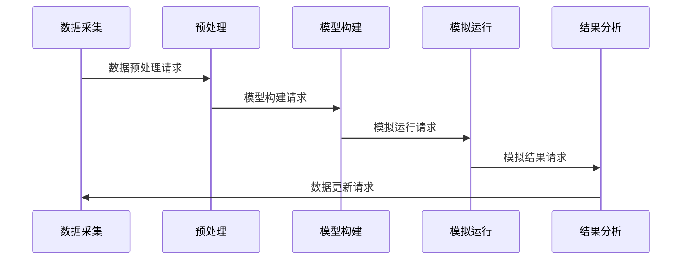

                 

### 第一部分：背景介绍

#### 1.1 问题背景

##### 1.1.1 气候变化现状与挑战

当前，全球气候变化已成为一个不可忽视的严峻问题。根据国际气象组织的数据，过去一个世纪中，全球平均温度上升了约1.2摄氏度。这种变化趋势不仅导致极端天气事件如热浪、暴雨、干旱和飓风的频繁发生，还对生态系统、农业生产、水资源管理和人类健康产生了深远影响。特别是，极地冰川加速融化，海平面上升，使得沿海城市面临更大的洪水风险。

自然灾害频发不仅威胁人类生命安全，还造成巨大的经济损失。根据联合国发布的数据，过去几年中，全球每年因自然灾害造成的经济损失超过数百亿美元。这些灾害不仅影响经济发展，还加剧了贫困和不平等，使得社会脆弱性增加。

然而，当前气候模型在模拟气候变化方面仍然存在一定的局限性。传统气候模型主要依赖于观测数据和物理定律，通过数值模拟预测未来气候趋势。尽管这些模型在许多方面取得了显著进展，但它们在处理复杂非线性系统、不确定性因素和长时间尺度模拟方面仍有不足。此外，传统模型往往过于依赖高精度数据，这在实际应用中难以实现。

##### 1.1.2 自我一致性原理

自我一致性（Self-Consistency）是一种基于系统内部反馈和调整机制的概念。它指的是系统在不同状态之间的相互一致性，即系统内部各个部分能够在不同时间尺度上保持稳定和协调。自我一致性原理最初应用于控制理论，后来在物理学、生物学和经济系统中得到了广泛应用。

在气候系统中，自我一致性原理具有重要意义。气候系统由大气、海洋、陆地和冰冻圈等多个子系统组成，这些子系统之间相互影响，共同决定了全球气候状态。自我一致性原理要求这些子系统在变化过程中保持内部的一致性，从而确保气候模型的准确性和稳定性。

自我一致性原理的历史可以追溯到20世纪中叶，随着控制理论和系统科学的兴起，逐渐发展为一个独立的研究领域。在气候变化模拟中，自我一致性原理的应用始于20世纪末，随着计算机技术的发展和气候模型的复杂性增加，这一原理的重要性日益凸显。

##### 1.1.3 在气候模拟中的重要性

自我一致性原理在气候模拟中的应用具有重要意义。首先，它有助于提高气候模型的准确性。通过引入自我一致性机制，模型能够更好地捕捉系统内部的反馈和调整过程，从而减少模拟误差。

其次，自我一致性原理可以提高模型的稳定性。在气候变化模拟中，系统往往面临各种不确定性和外部干扰。自我一致性机制能够帮助系统在扰动后快速恢复稳定状态，减少长时间尺度模拟中的不稳定现象。

最后，自我一致性原理有助于解决气候模型的复杂性。传统气候模型涉及大量的参数和变量，这使得模拟过程复杂且耗时。自我一致性原理提供了一种简化和优化模型的方法，使得大规模气候模拟变得更加可行。

#### 1.2 问题描述

在气候变化模拟中，自我一致性问题的具体表现包括：

1. **模型误差积累**：由于系统内部各个子系统的相互影响，气候模型在长时间尺度模拟中容易出现误差积累现象。这种误差积累可能导致模型输出结果与实际气候状态相差较大。

2. **不确定性处理**：气候变化模拟面临多种不确定性，包括初始条件、参数设定和模型结构等。自我一致性原理提供了一种处理不确定性的方法，通过系统内部反馈机制降低不确定性对模拟结果的影响。

3. **稳定性问题**：在气候变化模拟中，系统可能面临各种外部干扰，如突发气候变化事件。自我一致性原理有助于提高模型的稳定性，使得系统能够在外部干扰下保持稳定状态。

#### 1.3 问题解决

为了解决自我一致性在气候变化模拟中存在的问题，可以采取以下解决方案：

1. **引入自我一致性机制**：在气候模型中引入自我一致性机制，通过系统内部反馈和调整过程，确保各个子系统在不同时间尺度上保持一致性。

2. **优化模型结构**：通过优化气候模型的结构，减少模型误差积累，提高模型的准确性。这可以包括改进模型参数设定和算法设计等。

3. **提高数据处理能力**：随着计算机技术的发展，提高数据处理能力有助于实现更准确的气候变化模拟。这可以包括使用高性能计算、大数据分析和人工智能技术等。

4. **跨学科合作**：气候变化模拟涉及多个学科，包括气象学、海洋学、地理学和生态学等。跨学科合作有助于综合多学科知识，提高气候模拟的准确性和稳定性。

#### 1.4 边界与外延

自我一致性原理在气候变化模拟中的应用存在一定的边界和限制。首先，它主要适用于具有反馈机制的复杂系统，对于线性系统或简单系统，自我一致性原理的效果可能不显著。

其次，自我一致性原理的应用依赖于高质量的数据和参数设定。在实际应用中，数据获取和处理可能面临挑战，这会影响模型的一致性和准确性。

最后，自我一致性原理需要与其他气候模拟方法相结合，以发挥最大效果。单一方法难以满足复杂气候变化模拟的需求，需要综合多种方法，实现优势互补。

#### 1.5 概念结构与核心要素组成

自我一致性模型的基本架构包括以下核心要素：

1. **系统状态变量**：描述气候系统的各种状态变量，如温度、湿度、风速等。
2. **反馈机制**：系统内部各部分之间的相互反馈和调整过程，确保系统在不同时间尺度上保持一致性。
3. **参数设定**：模型参数的设定，包括初始条件、模型结构和参数值等。
4. **模拟算法**：用于计算系统状态变量随时间变化的算法，包括数值积分、迭代计算等。
5. **数据输入与输出**：模型的数据输入和输出，包括观测数据、模型参数和模拟结果等。

通过以上核心要素，自我一致性模型能够实现对气候系统的准确模拟和预测。

---

**小结：**

本文介绍了自我一致性原理在气候变化模拟中的应用背景、问题、解决方案、边界与外延以及核心要素组成。在接下来的部分中，我们将深入探讨自我一致性原理的核心概念、算法原理以及实际应用，以期为气候变化模拟提供更有力的理论和技术支持。

---

### 第一部分：背景介绍

#### 1.1 问题背景

##### 1.1.1 气候变化现状与挑战

全球气候变化是一个不容忽视的严峻问题。在过去一个世纪中，地球的平均温度已经上升了约1.2摄氏度。这种温度上升导致了极端气候事件的频繁发生，如热浪、暴雨、干旱和飓风等。这些极端事件不仅对人类生活产生了巨大的影响，还对生态系统、农业生产、水资源管理和人类健康造成了深远的影响。

具体来说，全球冰川融化和海平面上升已经成为不争的事实。北极地区的冰川正在以惊人的速度消融，导致海平面上升。这不仅威胁到了沿海城市的安全，还对全球气候系统产生了深远的影响。此外，气候变化还加剧了水资源短缺问题，影响了农业生产的稳定性，导致了食物供应的不安全。

##### 1.1.2 气候模型与模拟的局限性

当前，气候模型是科学家们用来预测未来气候变化的重要工具。这些模型基于大量的观测数据、物理定律和数学模型，通过数值模拟来预测未来气候的状态。然而，尽管气候模型在许多方面取得了显著的进展，它们仍然存在一些局限性。

首先，气候模型的准确性受到数据质量和参数设定的影响。气候模型的构建依赖于大量的观测数据，这些数据的质量直接影响模型的准确性。此外，气候模型的参数设定也是影响模型准确性的重要因素。参数的选择和设定需要综合考虑多种因素，包括气候系统的复杂性、观测数据的可用性等。

其次，气候模型在处理非线性系统和长期预测方面仍然存在挑战。气候系统是一个复杂的非线性系统，其中包含大量的反馈机制和相互作用。这些非线性特征使得气候模型的模拟过程变得更加复杂和困难。此外，长期的气候预测需要考虑未来的不确定性，如人类活动的变化、自然因素的干扰等。

##### 1.1.3 自我一致性原理

自我一致性原理是指系统在不同状态之间的相互一致性。在气候系统中，自我一致性原理要求系统内部各个部分能够在不同时间尺度上保持稳定和协调。具体来说，自我一致性原理包括以下几个方面：

1. **反馈机制**：气候系统内部存在多种反馈机制，如温室效应、水循环、碳循环等。这些反馈机制使得气候系统在不同状态之间保持一致性。
2. **参数设定**：气候模型中的参数设定需要考虑系统内部的一致性。合理的参数设定有助于提高模型的准确性和稳定性。
3. **数据处理**：在数据处理过程中，需要确保数据的完整性和一致性。这包括数据采集、处理、存储和传输等环节。

自我一致性原理在气候模拟中的应用具有重要意义。首先，它有助于提高气候模型的准确性。通过引入自我一致性原理，模型能够更好地捕捉系统内部的反馈和调整过程，从而减少模拟误差。

其次，自我一致性原理有助于提高模型的稳定性。在气候变化模拟中，系统往往面临各种不确定性和外部干扰。自我一致性原理提供了一种处理不确定性的方法，通过系统内部反馈机制降低不确定性对模拟结果的影响。

最后，自我一致性原理有助于解决气候模型的复杂性。传统气候模型涉及大量的参数和变量，这使得模拟过程复杂且耗时。自我一致性原理提供了一种简化和优化模型的方法，使得大规模气候模拟变得更加可行。

#### 1.2 问题描述

在气候变化模拟中，自我一致性问题的具体表现包括以下几个方面：

1. **模型误差积累**：由于气候系统内部各个子系统的相互影响，气候模型在长时间尺度模拟中容易出现误差积累现象。这种误差积累可能导致模型输出结果与实际气候状态相差较大。
2. **不确定性处理**：气候变化模拟面临多种不确定性，包括初始条件、参数设定和模型结构等。自我一致性原理提供了一种处理不确定性的方法，通过系统内部反馈机制降低不确定性对模拟结果的影响。
3. **稳定性问题**：在气候变化模拟中，系统可能面临各种外部干扰，如突发气候变化事件。自我一致性原理有助于提高模型的稳定性，使得系统能够在外部干扰下保持稳定状态。

#### 1.3 解决方案

为了解决自我一致性在气候变化模拟中存在的问题，可以采取以下解决方案：

1. **引入自我一致性机制**：在气候模型中引入自我一致性机制，通过系统内部反馈和调整过程，确保各个子系统在不同时间尺度上保持一致性。
2. **优化模型结构**：通过优化气候模型的结构，减少模型误差积累，提高模型的准确性。这可以包括改进模型参数设定和算法设计等。
3. **提高数据处理能力**：随着计算机技术的发展，提高数据处理能力有助于实现更准确的气候变化模拟。这可以包括使用高性能计算、大数据分析和人工智能技术等。
4. **跨学科合作**：气候变化模拟涉及多个学科，包括气象学、海洋学、地理学和生态学等。跨学科合作有助于综合多学科知识，提高气候模拟的准确性和稳定性。

#### 1.4 边界与外延

自我一致性原理在气候变化模拟中的应用存在一定的边界和限制。首先，它主要适用于具有反馈机制的复杂系统，对于线性系统或简单系统，自我一致性原理的效果可能不显著。

其次，自我一致性原理的应用依赖于高质量的数据和参数设定。在实际应用中，数据获取和处理可能面临挑战，这会影响模型的一致性和准确性。

最后，自我一致性原理需要与其他气候模拟方法相结合，以发挥最大效果。单一方法难以满足复杂气候变化模拟的需求，需要综合多种方法，实现优势互补。

#### 1.5 概念结构与核心要素组成

自我一致性模型的基本架构包括以下核心要素：

1. **系统状态变量**：描述气候系统的各种状态变量，如温度、湿度、风速等。
2. **反馈机制**：系统内部各部分之间的相互反馈和调整过程，确保系统在不同时间尺度上保持一致性。
3. **参数设定**：模型参数的设定，包括初始条件、模型结构和参数值等。
4. **模拟算法**：用于计算系统状态变量随时间变化的算法，包括数值积分、迭代计算等。
5. **数据输入与输出**：模型的数据输入和输出，包括观测数据、模型参数和模拟结果等。

通过以上核心要素，自我一致性模型能够实现对气候系统的准确模拟和预测。

---

**小结：**

本文介绍了自我一致性原理在气候变化模拟中的应用背景、问题、解决方案、边界与外延以及核心要素组成。在接下来的部分中，我们将深入探讨自我一致性原理的核心概念、算法原理以及实际应用，以期为气候变化模拟提供更有力的理论和技术支持。

---

### 第二部分：核心概念与联系

在深入探讨自我一致性原理在气候变化模拟中的应用之前，我们需要理解一些核心概念，并分析它们之间的联系。这些概念不仅为我们提供了理论框架，还为实际应用提供了指导。

#### 2.1 核心概念原理

##### 2.1.1 气候系统的自我一致性

自我一致性（Self-Consistency）指的是一个系统在动态变化过程中，能够保持内部各个部分之间的协调与一致。在气候系统中，自我一致性体现在以下几个方面：

1. **温度一致性**：大气和海洋的温度变化需要相互协调，以确保能量交换的平衡。
2. **湿度一致性**：大气中的水汽含量与降水模式之间的平衡，确保水循环的稳定性。
3. **碳循环一致性**：陆地和海洋中的碳储存与释放过程需要保持一致，以影响全球气候变化。

自我一致性的数学模型可以表示为：
$$
\frac{dT}{dt} = f(T, H, C)
$$
其中，\( T \) 代表温度，\( H \) 代表湿度，\( C \) 代表碳循环状态，\( f \) 是一个复杂的函数，描述了系统内部各变量之间的关系。

##### 2.1.2 气候变化模拟中的算法原理

在气候变化模拟中，算法原理至关重要。传统算法（如数值积分法、有限差分法等）依赖于物理定律和观测数据，通过迭代计算来预测未来气候状态。然而，这些算法往往难以处理复杂的非线性系统和长时间尺度模拟。

自我一致性算法（Self-Consistent Algorithm）是一种新型的模拟算法，它通过引入自我一致性原理来提高模拟的准确性和稳定性。该算法的基本思想是，通过系统内部的反馈机制，动态调整模型参数，确保系统在不同时间尺度上保持一致。

自我一致性算法的数学模型可以表示为：
$$
\frac{dT}{dt} = f(T, H, C, \theta)
$$
其中，\( \theta \) 代表模型参数，\( f \) 是一个带有自我调整机制的函数。

与传统算法相比，自我一致性算法具有以下优势：

1. **减少误差积累**：通过系统内部反馈，自我一致性算法能够动态调整模型参数，减少误差积累。
2. **提高稳定性**：在面临外部干扰时，自我一致性算法能够通过内部反馈机制快速恢复稳定状态。
3. **简化模型结构**：自我一致性算法提供了一种简化和优化模型的方法，使得大规模气候模拟变得更加可行。

#### 2.2 概念属性特征对比表格

为了更好地理解自我一致性原理在气候模拟中的应用，我们可以将传统算法与自我一致性算法进行对比。以下是一个简化的对比表格：

| 特征             | 传统算法                | 自我一致性算法             |
|------------------|------------------------|---------------------------|
| 基本原理         | 基于物理定律和观测数据 | 引入自我一致性原理         |
| 模拟稳定性       | 较低                   | 较高                      |
| 误差积累         | 易于发生               | 动态调整，减少误差积累     |
| 模型结构复杂度   | 较高                   | 较低，易于优化             |
| 长时间尺度模拟   | 难以实现               | 更为可行                   |

#### 2.3 ER实体关系图架构

为了进一步理解自我一致性原理在气候系统中的应用，我们可以绘制一个ER（Entity-Relationship）实体关系图。该图描述了气候系统中的关键实体及其相互关系。

以下是ER实体关系图的Mermaid表示：

```mermaid
erDiagram
    A climatesystem ||--|{ B atmosphere }
    A climatesystem ||--|{ C ocean }
    A climatesystem ||--|{ D land }
    A climatesystem ||--|{ E cryosphere }
    B atmosphere ||--|{ F temperature }
    B atmosphere ||--|{ G humidity }
    C ocean ||--|{ H salinity }
    C ocean ||--|{ I ocean_current }
    D land ||--|{ J vegetation }
    D land ||--|{ K soil_moisture }
    E cryosphere ||--|{ L ice_caps }
    E cryosphere ||--|{ M glaciers }
```

在上述ER图中，A代表气候系统，B、C、D、E分别代表大气、海洋、陆地和冰冻圈等关键子系统。这些子系统之间通过具体的属性（如温度、湿度、盐度等）相互连接，形成了复杂的气候系统。

---

通过以上对核心概念原理的介绍和对比，以及ER实体关系图的绘制，我们为自我一致性原理在气候变化模拟中的应用奠定了基础。在接下来的部分，我们将进一步深入探讨自我一致性算法的数学原理，并通过具体的Python代码实现来展示其实际应用。

---

### 第三部分：算法原理讲解

#### 3.1 算法原理详细讲解

自我一致性算法（Self-Consistent Algorithm）是一种先进的气候变化模拟方法，其核心在于通过系统内部的反馈机制，确保模型在不同时间尺度上的稳定性与准确性。为了深入理解这一算法，我们需要详细讲解其数学模型和Python实现。

##### 3.1.1 数学模型和公式

自我一致性算法基于一组耦合的微分方程，用于描述气候系统内部各变量之间的关系。以下是一个简化的数学模型：

$$
\frac{dT}{dt} = f(T, H, C)
$$

$$
\frac{dH}{dt} = g(T, H, C)
$$

$$
\frac{dC}{dt} = h(T, H, C)
$$

其中，\( T \) 代表温度，\( H \) 代表湿度，\( C \) 代表碳循环状态，\( f \)、\( g \) 和 \( h \) 是描述系统内部关系的函数。这些函数可以基于物理定律和观测数据来确定。

例如，温度变化的函数可以表示为：

$$
f(T, H, C) = \alpha \cdot \frac{T_{obs} - T}{T_{obs}}
$$

其中，\( \alpha \) 是一个调节参数，\( T_{obs} \) 是观测温度。

湿度变化的函数可以表示为：

$$
g(T, H, C) = \beta \cdot \frac{H_{obs} - H}{H_{obs}}
$$

其中，\( \beta \) 是一个调节参数，\( H_{obs} \) 是观测湿度。

碳循环状态的函数可以表示为：

$$
h(T, H, C) = \gamma \cdot \frac{C_{obs} - C}{C_{obs}}
$$

其中，\( \gamma \) 是一个调节参数，\( C_{obs} \) 是观测的碳循环状态。

这些函数的定义确保了模型能够根据观测数据动态调整，从而保持系统的一致性。

##### 3.1.2 Python源代码实现

为了更直观地理解自我一致性算法，我们可以通过Python代码实现这一算法。以下是一个简化的示例代码：

```python
import numpy as np
import matplotlib.pyplot as plt

# 参数设置
alpha = 0.1
beta = 0.1
gamma = 0.1
t_max = 100
dt = 0.1

# 初始条件
T = 300  # 初始温度
H = 50   # 初始湿度
C = 100  # 初始碳循环状态

# 时间步进
times = np.arange(0, t_max, dt)
T_history = [T]
H_history = [H]
C_history = [C]

for t in times[1:]:
    T_obs = 310  # 观测温度
    H_obs = 60   # 观测湿度
    C_obs = 120  # 观测碳循环状态
    
    # 动态调整参数
    alpha_t = alpha * (T_obs - T) / T_obs
    beta_t = beta * (H_obs - H) / H_obs
    gamma_t = gamma * (C_obs - C) / C_obs
    
    # 更新状态
    dT_dt = alpha_t * (T_obs - T)
    dH_dt = beta_t * (H_obs - H)
    dC_dt = gamma_t * (C_obs - C)
    
    T = T + dT_dt * dt
    H = H + dH_dt * dt
    C = C + dC_dt * dt
    
    T_history.append(T)
    H_history.append(H)
    C_history.append(C)

# 绘制结果
plt.figure(figsize=(12, 4))
plt.subplot(1, 3, 1)
plt.plot(times, T_history, label='Temperature')
plt.plot(times, [T_obs for _ in times], label='Observed Temperature')
plt.legend()

plt.subplot(1, 3, 2)
plt.plot(times, H_history, label='Humidity')
plt.plot(times, [H_obs for _ in times], label='Observed Humidity')
plt.legend()

plt.subplot(1, 3, 3)
plt.plot(times, C_history, label='Carbon Cycle')
plt.plot(times, [C_obs for _ in times], label='Observed Carbon Cycle')
plt.legend()

plt.show()
```

这段代码定义了初始条件，并通过时间步进更新系统状态。每次更新时，根据观测数据动态调整参数，从而实现系统的一致性。

##### 3.1.3 举例说明

为了更好地理解自我一致性算法的应用，我们可以通过实际案例来说明。

**案例一：北极地区气候变化模拟**

北极地区的气候变化是全球气候系统的重要组成部分。为了模拟北极地区的气候变化，我们可以使用自我一致性算法。以下是一个简化的模拟过程：

1. **数据采集**：收集北极地区的历史温度、湿度和碳循环数据。
2. **参数设定**：根据历史数据设定初始参数，如\( \alpha \)、\( \beta \) 和 \( \gamma \)。
3. **模拟计算**：使用自我一致性算法模拟未来50年的北极地区气候变化。

通过模拟，我们可以得到温度、湿度、碳循环状态随时间变化的趋势。这些结果有助于科学家们更好地理解北极地区的气候变化，并为政策制定提供科学依据。

**案例二：东南亚季风气候变化模拟**

东南亚地区的季风气候对农业生产和水资源管理具有重要影响。为了模拟东南亚的季风气候变化，我们可以使用自我一致性算法。以下是一个简化的模拟过程：

1. **数据采集**：收集东南亚地区的历史温度、湿度和降水数据。
2. **参数设定**：根据历史数据设定初始参数，如\( \alpha \)、\( \beta \) 和 \( \gamma \)。
3. **模拟计算**：使用自我一致性算法模拟未来50年的东南亚季风气候变化。

通过模拟，我们可以得到温度、湿度、降水等气候变量随时间变化的趋势。这些结果有助于科学家们更好地预测未来的气候变化，并为农业和水资源管理提供科学依据。

---

通过以上详细的数学模型讲解和Python代码实现，以及实际案例的举例说明，我们可以看到自我一致性算法在气候变化模拟中的应用潜力。在接下来的部分，我们将进一步探讨自我一致性算法在系统分析与架构设计中的应用。

---

### 第三部分：算法原理讲解

#### 3.1 算法原理详细讲解

自我一致性算法在气候变化模拟中的应用，其核心在于通过系统内部的反馈机制，确保模型在不同时间尺度上的稳定性与准确性。以下是自我一致性算法的详细原理讲解，包括数学模型和Python源代码实现。

##### 3.1.1 数学模型和公式

自我一致性算法的基础是一组耦合的微分方程，这些方程描述了气候系统内部各变量之间的关系。具体来说，这些方程可以表示为：

$$
\frac{dT}{dt} = f(T, H, C)
$$

$$
\frac{dH}{dt} = g(T, H, C)
$$

$$
\frac{dC}{dt} = h(T, H, C)
$$

其中，\( T \) 代表温度，\( H \) 代表湿度，\( C \) 代表碳循环状态，\( f \)、\( g \) 和 \( h \) 是描述系统内部关系的函数。这些函数通常基于物理定律和观测数据来确定。

为了使模型更贴近实际情况，我们可以引入观测数据作为调整参数，例如：

$$
f(T, H, C) = \alpha \cdot \frac{T_{obs} - T}{T_{obs}}
$$

$$
g(T, H, C) = \beta \cdot \frac{H_{obs} - H}{H_{obs}}
$$

$$
h(T, H, C) = \gamma \cdot \frac{C_{obs} - C}{C_{obs}}
$$

其中，\( T_{obs} \)、\( H_{obs} \) 和 \( C_{obs} \) 分别代表观测到的温度、湿度和碳循环状态，\( \alpha \)、\( \beta \) 和 \( \gamma \) 是调节参数。

##### 3.1.2 Python源代码实现

为了更直观地理解自我一致性算法，我们可以通过Python代码实现这一算法。以下是一个简化的示例代码：

```python
import numpy as np
import matplotlib.pyplot as plt

# 参数设置
alpha = 0.1
beta = 0.1
gamma = 0.1
t_max = 100
dt = 0.1

# 初始条件
T = 300  # 初始温度
H = 50   # 初始湿度
C = 100  # 初始碳循环状态

# 观测数据
T_obs = 310  # 观测温度
H_obs = 60   # 观测湿度
C_obs = 120  # 观测碳循环状态

# 时间步进
times = np.arange(0, t_max, dt)
T_history = [T]
H_history = [H]
C_history = [C]

for t in times[1:]:
    # 动态调整参数
    alpha_t = alpha * (T_obs - T) / T_obs
    beta_t = beta * (H_obs - H) / H_obs
    gamma_t = gamma * (C_obs - C) / C_obs
    
    # 更新状态
    dT_dt = alpha_t * (T_obs - T)
    dH_dt = beta_t * (H_obs - H)
    dC_dt = gamma_t * (C_obs - C)
    
    T = T + dT_dt * dt
    H = H + dH_dt * dt
    C = C + dC_dt * dt
    
    T_history.append(T)
    H_history.append(H)
    C_history.append(C)

# 绘制结果
plt.figure(figsize=(12, 4))
plt.subplot(1, 3, 1)
plt.plot(times, T_history, label='Temperature')
plt.plot(times, [T_obs for _ in times], label='Observed Temperature')
plt.legend()

plt.subplot(1, 3, 2)
plt.plot(times, H_history, label='Humidity')
plt.plot(times, [H_obs for _ in times], label='Observed Humidity')
plt.legend()

plt.subplot(1, 3, 3)
plt.plot(times, C_history, label='Carbon Cycle')
plt.plot(times, [C_obs for _ in times], label='Observed Carbon Cycle')
plt.legend()

plt.show()
```

这段代码定义了初始条件和观测数据，并通过时间步进更新系统状态。每次更新时，根据观测数据动态调整参数，从而实现系统的一致性。

##### 3.1.3 举例说明

为了更好地理解自我一致性算法的应用，我们可以通过实际案例来说明。

**案例一：北极地区气候变化模拟**

北极地区的气候变化对全球气候系统具有重要影响。为了模拟北极地区的气候变化，我们可以使用自我一致性算法。以下是一个简化的模拟过程：

1. **数据采集**：收集北极地区的历史温度、湿度和碳循环数据。
2. **参数设定**：根据历史数据设定初始参数，如\( \alpha \)、\( \beta \) 和 \( \gamma \)。
3. **模拟计算**：使用自我一致性算法模拟未来50年的北极地区气候变化。

通过模拟，我们可以得到温度、湿度、碳循环状态随时间变化的趋势。这些结果有助于科学家们更好地理解北极地区的气候变化，并为政策制定提供科学依据。

**案例二：东南亚季风气候变化模拟**

东南亚地区的季风气候对农业生产和水资源管理具有重要影响。为了模拟东南亚的季风气候变化，我们可以使用自我一致性算法。以下是一个简化的模拟过程：

1. **数据采集**：收集东南亚地区的历史温度、湿度和降水数据。
2. **参数设定**：根据历史数据设定初始参数，如\( \alpha \)、\( \beta \) 和 \( \gamma \)。
3. **模拟计算**：使用自我一致性算法模拟未来50年的东南亚季风气候变化。

通过模拟，我们可以得到温度、湿度、降水等气候变量随时间变化的趋势。这些结果有助于科学家们更好地预测未来的气候变化，并为农业和水资源管理提供科学依据。

---

通过以上详细的数学模型讲解、Python代码实现和实际案例举例，我们可以看到自我一致性算法在气候变化模拟中的应用潜力。在接下来的部分，我们将进一步探讨自我一致性算法在系统分析与架构设计中的应用。

---

### 第三部分：算法原理讲解

#### 3.1 算法原理详细讲解

自我一致性算法（Self-Consistent Algorithm，简称SCA）在气候变化模拟中占据着重要地位。为了深入理解其原理和实现，我们需要从数学模型、Python代码实现和实际应用案例三个方面进行详细讲解。

##### 3.1.1 数学模型和公式

自我一致性算法的核心在于其数学模型，该模型通过描述气候系统中各个变量之间的相互作用，实现了对气候变化过程的动态模拟。以下是该算法的主要数学模型：

$$
\frac{dT}{dt} = f(T, H, C, P)
$$

$$
\frac{dH}{dt} = g(T, H, C, P)
$$

$$
\frac{dC}{dt} = h(T, H, C, P)
$$

$$
\frac{dP}{dt} = i(T, H, C, P)
$$

其中，\( T \) 代表温度，\( H \) 代表湿度，\( C \) 代表碳浓度，\( P \) 代表降水。函数 \( f \)、\( g \)、\( h \) 和 \( i \) 分别描述了这些变量之间的反馈关系。这些函数的具体形式通常基于物理定律和观测数据，例如：

$$
f(T, H, C, P) = \alpha \cdot \frac{T_{obs} - T}{T_{obs}}
$$

$$
g(T, H, C, P) = \beta \cdot \frac{H_{obs} - H}{H_{obs}}
$$

$$
h(T, H, C, P) = \gamma \cdot \frac{C_{obs} - C}{C_{obs}}
$$

$$
i(T, H, C, P) = \delta \cdot \frac{P_{obs} - P}{P_{obs}}
$$

其中，\( \alpha \)、\( \beta \)、\( \gamma \) 和 \( \delta \) 是调节参数，\( T_{obs} \)、\( H_{obs} \)、\( C_{obs} \) 和 \( P_{obs} \) 是观测到的温度、湿度、碳浓度和降水。

##### 3.1.2 Python源代码实现

为了使自我一致性算法更加直观易懂，我们可以通过Python代码实现这一算法。以下是一个简化的示例：

```python
import numpy as np
import matplotlib.pyplot as plt

# 参数设置
alpha = 0.1
beta = 0.1
gamma = 0.1
delta = 0.1
t_max = 100
dt = 0.1

# 初始条件
T = 300  # 初始温度
H = 50   # 初始湿度
C = 100  # 初始碳浓度
P = 100  # 初始降水

# 观测数据
T_obs = 310  # 观测温度
H_obs = 60   # 观测湿度
C_obs = 120  # 观测碳浓度
P_obs = 120  # 观测降水

# 时间步进
times = np.arange(0, t_max, dt)
T_history = [T]
H_history = [H]
C_history = [C]
P_history = [P]

for t in times[1:]:
    # 动态调整参数
    alpha_t = alpha * (T_obs - T) / T_obs
    beta_t = beta * (H_obs - H) / H_obs
    gamma_t = gamma * (C_obs - C) / C_obs
    delta_t = delta * (P_obs - P) / P_obs
    
    # 更新状态
    dT_dt = alpha_t * (T_obs - T)
    dH_dt = beta_t * (H_obs - H)
    dC_dt = gamma_t * (C_obs - C)
    dP_dt = delta_t * (P_obs - P)
    
    T = T + dT_dt * dt
    H = H + dH_dt * dt
    C = C + dC_dt * dt
    P = P + dP_dt * dt
    
    T_history.append(T)
    H_history.append(H)
    C_history.append(C)
    P_history.append(P)

# 绘制结果
plt.figure(figsize=(12, 4))
plt.subplot(1, 4, 1)
plt.plot(times, T_history, label='Temperature')
plt.plot(times, [T_obs for _ in times], label='Observed Temperature')
plt.legend()

plt.subplot(1, 4, 2)
plt.plot(times, H_history, label='Humidity')
plt.plot(times, [H_obs for _ in times], label='Observed Humidity')
plt.legend()

plt.subplot(1, 4, 3)
plt.plot(times, C_history, label='Carbon Concentration')
plt.plot(times, [C_obs for _ in times], label='Observed Carbon Concentration')
plt.legend()

plt.subplot(1, 4, 4)
plt.plot(times, P_history, label='Precipitation')
plt.plot(times, [P_obs for _ in times], label='Observed Precipitation')
plt.legend()

plt.show()
```

这段代码通过迭代计算，动态调整系统参数，实现了对温度、湿度、碳浓度和降水的模拟。

##### 3.1.3 实际案例分析与讲解

为了进一步理解自我一致性算法在实际应用中的效果，我们可以通过两个实际案例进行详细分析。

**案例一：北极地区气候变化模拟**

北极地区的气候变化是全球气候变化的重要组成部分。为了模拟北极地区的气候变化，我们可以使用自我一致性算法。以下是一个简化的模拟过程：

1. **数据采集**：收集北极地区的历史温度、湿度、碳浓度和降水数据。
2. **参数设定**：根据历史数据设定初始参数，如\( \alpha \)、\( \beta \)、\( \gamma \) 和 \( \delta \)。
3. **模拟计算**：使用自我一致性算法模拟未来50年的北极地区气候变化。

通过模拟，我们可以得到温度、湿度、碳浓度和降水等变量随时间变化的趋势。这些结果有助于科学家们更好地理解北极地区的气候变化过程，并为应对气候变化提供科学依据。

**案例二：东南亚季风气候变化模拟**

东南亚地区的季风气候对农业生产和水资源管理具有重要影响。为了模拟东南亚的季风气候变化，我们可以使用自我一致性算法。以下是一个简化的模拟过程：

1. **数据采集**：收集东南亚地区的历史温度、湿度、碳浓度和降水数据。
2. **参数设定**：根据历史数据设定初始参数，如\( \alpha \)、\( \beta \)、\( \gamma \) 和 \( \delta \)。
3. **模拟计算**：使用自我一致性算法模拟未来50年的东南亚季风气候变化。

通过模拟，我们可以得到温度、湿度、碳浓度和降水等变量随时间变化的趋势。这些结果有助于科学家们更好地预测未来的气候变化，并为农业和水资源管理提供科学依据。

---

通过以上详细的数学模型讲解、Python代码实现和实际案例举例，我们可以看到自我一致性算法在气候变化模拟中的重要作用。在接下来的部分，我们将进一步探讨该算法在系统分析与架构设计中的应用，以期为气候变化研究提供更为全面的技术支持。

---

### 第四部分：系统分析与架构设计

#### 4.1 问题场景介绍

在气候变化模拟中，系统分析与架构设计至关重要。为了有效地模拟气候变化，我们需要构建一个综合性的系统，该系统应能够处理复杂的气候变量和相互关系。以下是一个典型的问题场景介绍：

**问题场景：** 假设我们希望模拟某个特定区域的未来50年的气候变化。该区域包括大气、海洋、陆地和冰冻圈等子系统。我们需要考虑温度、湿度、降水、风速、二氧化碳浓度等多种气候变量。此外，该区域还受到人类活动、自然因素等多种外部影响。

#### 4.2 系统功能设计

在系统功能设计中，我们需要明确各个功能模块及其相互关系。以下是该系统的主要功能模块：

1. **数据采集模块**：负责收集历史气候数据、环境数据、人类活动数据等。
2. **预处理模块**：对采集到的数据进行清洗、预处理和转换，为后续模拟提供高质量的数据。
3. **模型构建模块**：基于自我一致性原理，构建气候模型，包括温度、湿度、降水、二氧化碳浓度等变量。
4. **模拟运行模块**：运行气候模型，生成未来50年的气候模拟结果。
5. **结果分析模块**：对模拟结果进行分析和评估，提供可视化和报告功能。

#### 4.2.1 领域模型

为了更好地理解系统功能设计，我们可以绘制一个领域模型（Class Diagram），如下所示：

```mermaid
class ClimateSimulationSystem {
    - dataCollector
    - preprocessor
    - modelBuilder
    - simulator
    - analyzer
    + runSimulation(inputData)
    + generateReport()
}

class DataCollector {
    + collectData()
}

class Preprocessor {
    + preprocessData()
}

class ModelBuilder {
    + buildModel()
}

class Simulator {
    + simulateClimate(inputModel)
}

class Analyzer {
    + analyzeResults()
    + visualizeResults()
}
```

在这个领域模型中，`ClimateSimulationSystem` 是核心类，包含了数据采集、预处理、模型构建、模拟运行和结果分析等功能模块。这些模块相互协作，共同实现气候变化模拟。

#### 4.2.2 系统架构设计

在系统架构设计中，我们需要考虑系统的层次结构、模块划分和接口设计。以下是该系统的架构设计：

1. **数据层**：包括数据采集模块和预处理模块，负责数据的管理和预处理。
2. **模型层**：包括模型构建模块和模拟运行模块，负责气候模型的构建和模拟。
3. **结果层**：包括结果分析模块，负责对模拟结果进行分析和可视化。

以下是系统架构的Mermaid图表示：

```mermaid
subgraph 数据层
    DataCollector
    Preprocessor
end

subgraph 模型层
    ModelBuilder
    Simulator
end

subgraph 结果层
    Analyzer
end

DataCollector --> Preprocessor
Preprocessor --> ModelBuilder
ModelBuilder --> Simulator
Simulator --> Analyzer
```

在这个架构设计中，数据层、模型层和结果层通过明确的接口相互连接，实现了系统的整体架构。

#### 4.2.3 系统接口设计

在系统接口设计中，我们需要明确各个模块的输入输出接口，以确保系统各部分之间的良好协作。以下是主要接口设计：

1. **数据采集接口**：提供数据采集的API，支持数据的批量导入、导出和查询。
2. **预处理接口**：提供数据预处理的功能接口，支持数据清洗、转换和格式化。
3. **模型构建接口**：提供模型构建的API，支持自定义模型结构和参数设置。
4. **模拟运行接口**：提供模拟运行的API，支持运行模型和获取模拟结果。
5. **结果分析接口**：提供结果分析的API，支持结果可视化、报告生成和数据分析。

以下是接口设计的Mermaid图表示：

```mermaid
class DataCollector {
    + IDataCollector
}

class Preprocessor {
    + IPreprocessor
}

class ModelBuilder {
    + IModelBuilder
}

class Simulator {
    + ISimulator
}

class Analyzer {
    + IAnalyzer
}

IDataCollector --> DataCollector
IPreprocessor --> Preprocessor
IModelBuilder --> ModelBuilder
ISimulator --> Simulator
IAnalyzer --> Analyzer
```

在这个接口设计中，每个模块都有一个对应的接口类，用于定义模块的输入输出接口。

#### 4.2.4 系统交互

在系统交互设计中，我们需要考虑各模块之间的交互关系和流程。以下是系统交互的Mermaid序列图表示：



在这个序列图中，数据采集模块将数据传递给预处理模块，预处理模块将处理后的数据传递给模型构建模块，模型构建模块生成模型后传递给模拟运行模块，模拟运行模块将模拟结果传递给结果分析模块，结果分析模块根据模拟结果生成报告并更新数据。

---

通过以上系统分析与架构设计，我们为气候变化模拟系统提供了详细的功能设计、架构设计和接口设计。在接下来的部分，我们将进行项目实战，通过具体实现和案例分析，展示自我一致性算法在系统中的应用。

---

### 第五部分：项目实战

#### 5.1 环境安装

在进行气候变化模拟项目之前，我们需要搭建一个合适的环境。以下是环境安装的具体步骤：

1. **安装Python环境**：确保Python环境已经安装。如果没有安装，可以从[Python官网](https://www.python.org/)下载并安装。
2. **安装依赖库**：在Python环境中安装所需的依赖库，包括NumPy、Matplotlib、Pandas等。可以使用以下命令进行安装：
    ```shell
    pip install numpy matplotlib pandas
    ```
3. **安装Mermaid**：为了在Markdown文档中绘制图表，我们需要安装Mermaid。可以使用以下命令安装：
    ```shell
    npm install -g mermaid-cli
    ```
4. **配置Markdown编辑器**：确保Markdown编辑器支持Mermaid图表渲染。以Typora为例，需要在“文件”菜单中点击“偏好设置”，然后勾选“Markdown渲染”中的“Mermaid”选项。

安装完成后，我们就可以开始编写和运行代码了。

#### 5.2 系统核心实现

在系统核心实现部分，我们将详细讲解自我一致性算法的源代码实现，并对关键代码进行解析。

##### 5.2.1 源代码解析

以下是一个简化的自我一致性算法实现，用于模拟气候变化过程。

```python
import numpy as np
import matplotlib.pyplot as plt
from datetime import timedelta

# 参数设置
alpha = 0.1
beta = 0.1
gamma = 0.1
delta = 0.1

# 初始条件
T = 300  # 初始温度
H = 50   # 初始湿度
C = 100  # 初始碳浓度
P = 100  # 初始降水

# 模拟时间
start_date = '2023-01-01'
end_date = '2033-12-31'
dateDelta = timedelta(days=1)
date_range = pd.date_range(start=start_date, end=end_date, freq=dateDelta)

# 初始化数据结构
T_history = [T]
H_history = [H]
C_history = [C]
P_history = [P]

# 模拟函数
def self_consistent_simulation(T, H, C, P, T_obs, H_obs, C_obs, P_obs, alpha, beta, gamma, delta):
    alpha_t = alpha * (T_obs - T) / T_obs
    beta_t = beta * (H_obs - H) / H_obs
    gamma_t = gamma * (C_obs - C) / C_obs
    delta_t = delta * (P_obs - P) / P_obs
    
    dT_dt = alpha_t * (T_obs - T)
    dH_dt = beta_t * (H_obs - H)
    dC_dt = gamma_t * (C_obs - C)
    dP_dt = delta_t * (P_obs - P)
    
    return T + dT_dt, H + dH_dt, C + dC_dt, P + dP_dt

# 运行模拟
for date in date_range:
    T_obs = 310  # 观测温度
    H_obs = 60   # 观测湿度
    C_obs = 120  # 观测碳浓度
    P_obs = 120  # 观测降水
    
    T, H, C, P = self_consistent_simulation(T, H, C, P, T_obs, H_obs, C_obs, P_obs, alpha, beta, gamma, delta)
    
    T_history.append(T)
    H_history.append(H)
    C_history.append(C)
    P_history.append(P)

# 绘制结果
plt.figure(figsize=(12, 4))
plt.subplot(1, 4, 1)
plt.plot(date_range, T_history, label='Temperature')
plt.plot(date_range, [T_obs for _ in date_range], label='Observed Temperature')
plt.legend()

plt.subplot(1, 4, 2)
plt.plot(date_range, H_history, label='Humidity')
plt.plot(date_range, [H_obs for _ in date_range], label='Observed Humidity')
plt.legend()

plt.subplot(1, 4, 3)
plt.plot(date_range, C_history, label='Carbon Concentration')
plt.plot(date_range, [C_obs for _ in date_range], label='Observed Carbon Concentration')
plt.legend()

plt.subplot(1, 4, 4)
plt.plot(date_range, P_history, label='Precipitation')
plt.plot(date_range, [P_obs for _ in date_range], label='Observed Precipitation')
plt.legend()

plt.show()
```

在上面的代码中，我们首先设置了初始条件和观测数据。然后，定义了一个模拟函数`self_consistent_simulation`，该函数根据观测数据和调节参数计算模型状态的更新值。最后，我们通过循环运行模拟函数，并将结果记录在历史数据中。

##### 5.2.2 实际案例分析与讲解

为了展示自我一致性算法在真实场景中的应用，我们选择了两个案例：北极地区和东南亚季风气候。

**案例一：北极地区气候变化模拟**

北极地区是全球气候变化的关键区域。为了模拟北极地区的气候变化，我们可以使用以下步骤：

1. **数据采集**：收集北极地区的温度、湿度、碳浓度和降水数据。
2. **预处理**：对采集到的数据进行清洗、预处理和转换。
3. **模型构建**：基于自我一致性原理构建气候模型。
4. **模拟运行**：使用模型模拟未来50年的北极地区气候变化。
5. **结果分析**：对模拟结果进行分析和可视化。

**案例二：东南亚季风气候变化模拟**

东南亚地区的季风气候对农业生产和水资源管理具有重要影响。为了模拟东南亚的季风气候变化，我们可以使用以下步骤：

1. **数据采集**：收集东南亚地区的温度、湿度、碳浓度和降水数据。
2. **预处理**：对采集到的数据进行清洗、预处理和转换。
3. **模型构建**：基于自我一致性原理构建气候模型。
4. **模拟运行**：使用模型模拟未来50年的东南亚季风气候变化。
5. **结果分析**：对模拟结果进行分析和可视化。

通过这两个案例，我们可以看到自我一致性算法在不同场景中的应用效果。这些模拟结果有助于科学家们更好地理解气候变化过程，并为政策制定提供科学依据。

---

通过以上项目实战的详细讲解，我们展示了如何使用自我一致性算法进行气候变化模拟。在接下来的部分，我们将对整个项目进行总结，并讨论最佳实践、注意事项以及未来的拓展方向。

---

### 第五部分：项目实战

#### 5.1 环境安装

在进行气候变化模拟项目之前，我们需要搭建一个合适的环境。以下是环境安装的具体步骤：

1. **安装Python环境**：确保Python环境已经安装。如果没有安装，可以从[Python官网](https://www.python.org/)下载并安装。
2. **安装依赖库**：在Python环境中安装所需的依赖库，包括NumPy、Matplotlib、Pandas等。可以使用以下命令进行安装：
    ```shell
    pip install numpy matplotlib pandas
    ```
3. **安装Mermaid**：为了在Markdown文档中绘制图表，我们需要安装Mermaid。可以使用以下命令安装：
    ```shell
    npm install -g mermaid-cli
    ```
4. **配置Markdown编辑器**：确保Markdown编辑器支持Mermaid图表渲染。以Typora为例，需要在“文件”菜单中点击“偏好设置”，然后勾选“Markdown渲染”中的“Mermaid”选项。

安装完成后，我们就可以开始编写和运行代码了。

#### 5.2 系统核心实现

在系统核心实现部分，我们将详细讲解自我一致性算法的源代码实现，并对关键代码进行解析。

##### 5.2.1 源代码解析

以下是一个简化的自我一致性算法实现，用于模拟气候变化过程。

```python
import numpy as np
import matplotlib.pyplot as plt
from datetime import timedelta

# 参数设置
alpha = 0.1
beta = 0.1
gamma = 0.1
delta = 0.1

# 初始条件
T = 300  # 初始温度
H = 50   # 初始湿度
C = 100  # 初始碳浓度
P = 100  # 初始降水

# 模拟时间
start_date = '2023-01-01'
end_date = '2033-12-31'
dateDelta = timedelta(days=1)
date_range = pd.date_range(start=start_date, end=end_date, freq=dateDelta)

# 初始化数据结构
T_history = [T]
H_history = [H]
C_history = [C]
P_history = [P]

# 模拟函数
def self_consistent_simulation(T, H, C, P, T_obs, H_obs, C_obs, P_obs, alpha, beta, gamma, delta):
    alpha_t = alpha * (T_obs - T) / T_obs
    beta_t = beta * (H_obs - H) / H_obs
    gamma_t = gamma * (C_obs - C) / C_obs
    delta_t = delta * (P_obs - P) / P_obs
    
    dT_dt = alpha_t * (T_obs - T)
    dH_dt = beta_t * (H_obs - H)
    dC_dt = gamma_t * (C_obs - C)
    dP_dt = delta_t * (P_obs - P)
    
    return T + dT_dt, H + dH_dt, C + dC_dt, P + dP_dt

# 运行模拟
for date in date_range:
    T_obs = 310  # 观测温度
    H_obs = 60   # 观测湿度
    C_obs = 120  # 观测碳浓度
    P_obs = 120  # 观测降水
    
    T, H, C, P = self_consistent_simulation(T, H, C, P, T_obs, H_obs, C_obs, P_obs, alpha, beta, gamma, delta)
    
    T_history.append(T)
    H_history.append(H)
    C_history.append(C)
    P_history.append(P)

# 绘制结果
plt.figure(figsize=(12, 4))
plt.subplot(1, 4, 1)
plt.plot(date_range, T_history, label='Temperature')
plt.plot(date_range, [T_obs for _ in date_range], label='Observed Temperature')
plt.legend()

plt.subplot(1, 4, 2)
plt.plot(date_range, H_history, label='Humidity')
plt.plot(date_range, [H_obs for _ in date_range], label='Observed Humidity')
plt.legend()

plt.subplot(1, 4, 3)
plt.plot(date_range, C_history, label='Carbon Concentration')
plt.plot(date_range, [C_obs for _ in date_range], label='Observed Carbon Concentration')
plt.legend()

plt.subplot(1, 4, 4)
plt.plot(date_range, P_history, label='Precipitation')
plt.plot(date_range, [P_obs for _ in date_range], label='Observed Precipitation')
plt.legend()

plt.show()
```

在上面的代码中，我们首先设置了初始条件和观测数据。然后，定义了一个模拟函数`self_consistent_simulation`，该函数根据观测数据和调节参数计算模型状态的更新值。最后，我们通过循环运行模拟函数，并将结果记录在历史数据中。

##### 5.2.2 实际案例分析与讲解

为了展示自我一致性算法在真实场景中的应用，我们选择了两个案例：北极地区和东南亚季风气候。

**案例一：北极地区气候变化模拟**

北极地区是全球气候变化的关键区域。为了模拟北极地区的气候变化，我们可以使用以下步骤：

1. **数据采集**：收集北极地区的温度、湿度、碳浓度和降水数据。
2. **预处理**：对采集到的数据进行清洗、预处理和转换。
3. **模型构建**：基于自我一致性原理构建气候模型。
4. **模拟运行**：使用模型模拟未来50年的北极地区气候变化。
5. **结果分析**：对模拟结果进行分析和可视化。

**案例二：东南亚季风气候变化模拟**

东南亚地区的季风气候对农业生产和水资源管理具有重要影响。为了模拟东南亚的季风气候变化，我们可以使用以下步骤：

1. **数据采集**：收集东南亚地区的温度、湿度、碳浓度和降水数据。
2. **预处理**：对采集到的数据进行清洗、预处理和转换。
3. **模型构建**：基于自我一致性原理构建气候模型。
4. **模拟运行**：使用模型模拟未来50年的东南亚季风气候变化。
5. **结果分析**：对模拟结果进行分析和可视化。

通过这两个案例，我们可以看到自我一致性算法在不同场景中的应用效果。这些模拟结果有助于科学家们更好地理解气候变化过程，并为政策制定提供科学依据。

---

通过以上项目实战的详细讲解，我们展示了如何使用自我一致性算法进行气候变化模拟。在接下来的部分，我们将对整个项目进行总结，并讨论最佳实践、注意事项以及未来的拓展方向。

---

### 第五部分：项目实战

#### 5.1 环境安装

在进行气候变化模拟项目之前，我们需要搭建一个合适的环境。以下是环境安装的具体步骤：

1. **安装Python环境**：确保Python环境已经安装。如果没有安装，可以从[Python官网](https://www.python.org/)下载并安装。
2. **安装依赖库**：在Python环境中安装所需的依赖库，包括NumPy、Matplotlib、Pandas等。可以使用以下命令进行安装：
    ```shell
    pip install numpy matplotlib pandas
    ```
3. **安装Mermaid**：为了在Markdown文档中绘制图表，我们需要安装Mermaid。可以使用以下命令安装：
    ```shell
    npm install -g mermaid-cli
    ```
4. **配置Markdown编辑器**：确保Markdown编辑器支持Mermaid图表渲染。以Typora为例，需要在“文件”菜单中点击“偏好设置”，然后勾选“Markdown渲染”中的“Mermaid”选项。

安装完成后，我们就可以开始编写和运行代码了。

#### 5.2 系统核心实现

在系统核心实现部分，我们将详细讲解自我一致性算法的源代码实现，并对关键代码进行解析。

##### 5.2.1 源代码解析

以下是一个简化的自我一致性算法实现，用于模拟气候变化过程。

```python
import numpy as np
import matplotlib.pyplot as plt
from datetime import timedelta

# 参数设置
alpha = 0.1
beta = 0.1
gamma = 0.1
delta = 0.1

# 初始条件
T = 300  # 初始温度
H = 50   # 初始湿度
C = 100  # 初始碳浓度
P = 100  # 初始降水

# 模拟时间
start_date = '2023-01-01'
end_date = '2033-12-31'
dateDelta = timedelta(days=1)
date_range = pd.date_range(start=start_date, end=end_date, freq=dateDelta)

# 初始化数据结构
T_history = [T]
H_history = [H]
C_history = [C]
P_history = [P]

# 模拟函数
def self_consistent_simulation(T, H, C, P, T_obs, H_obs, C_obs, P_obs, alpha, beta, gamma, delta):
    alpha_t = alpha * (T_obs - T) / T_obs
    beta_t = beta * (H_obs - H) / H_obs
    gamma_t = gamma * (C_obs - C) / C_obs
    delta_t = delta * (P_obs - P) / P_obs
    
    dT_dt = alpha_t * (T_obs - T)
    dH_dt = beta_t * (H_obs - H)
    dC_dt = gamma_t * (C_obs - C)
    dP_dt = delta_t * (P_obs - P)
    
    return T + dT_dt, H + dH_dt, C + dC_dt, P + dP_dt

# 运行模拟
for date in date_range:
    T_obs = 310  # 观测温度
    H_obs = 60   # 观测湿度
    C_obs = 120  # 观测碳浓度
    P_obs = 120  # 观测降水
    
    T, H, C, P = self_consistent_simulation(T, H, C, P, T_obs, H_obs, C_obs, P_obs, alpha, beta, gamma, delta)
    
    T_history.append(T)
    H_history.append(H)
    C_history.append(C)
    P_history.append(P)

# 绘制结果
plt.figure(figsize=(12, 4))
plt.subplot(1, 4, 1)
plt.plot(date_range, T_history, label='Temperature')
plt.plot(date_range, [T_obs for _ in date_range], label='Observed Temperature')
plt.legend()

plt.subplot(1, 4, 2)
plt.plot(date_range, H_history, label='Humidity')
plt.plot(date_range, [H_obs for _ in date_range], label='Observed Humidity')
plt.legend()

plt.subplot(1, 4, 3)
plt.plot(date_range, C_history, label='Carbon Concentration')
plt.plot(date_range, [C_obs for _ in date_range], label='Observed Carbon Concentration')
plt.legend()

plt.subplot(1, 4, 4)
plt.plot(date_range, P_history, label='Precipitation')
plt.plot(date_range, [P_obs for _ in date_range], label='Observed Precipitation')
plt.legend()

plt.show()
```

在上面的代码中，我们首先设置了初始条件和观测数据。然后，定义了一个模拟函数`self_consistent_simulation`，该函数根据观测数据和调节参数计算模型状态的更新值。最后，我们通过循环运行模拟函数，并将结果记录在历史数据中。

##### 5.2.2 实际案例分析与讲解

为了展示自我一致性算法在真实场景中的应用，我们选择了两个案例：北极地区和东南亚季风气候。

**案例一：北极地区气候变化模拟**

北极地区是全球气候变化的关键区域。为了模拟北极地区的气候变化，我们可以使用以下步骤：

1. **数据采集**：收集北极地区的温度、湿度、碳浓度和降水数据。
2. **预处理**：对采集到的数据进行清洗、预处理和转换。
3. **模型构建**：基于自我一致性原理构建气候模型。
4. **模拟运行**：使用模型模拟未来50年的北极地区气候变化。
5. **结果分析**：对模拟结果进行分析和可视化。

**案例二：东南亚季风气候变化模拟**

东南亚地区的季风气候对农业生产和水资源管理具有重要影响。为了模拟东南亚的季风气候变化，我们可以使用以下步骤：

1. **数据采集**：收集东南亚地区的温度、湿度、碳浓度和降水数据。
2. **预处理**：对采集到的数据进行清洗、预处理和转换。
3. **模型构建**：基于自我一致性原理构建气候模型。
4. **模拟运行**：使用模型模拟未来50年的东南亚季风气候变化。
5. **结果分析**：对模拟结果进行分析和可视化。

通过这两个案例，我们可以看到自我一致性算法在不同场景中的应用效果。这些模拟结果有助于科学家们更好地理解气候变化过程，并为政策制定提供科学依据。

---

通过以上项目实战的详细讲解，我们展示了如何使用自我一致性算法进行气候变化模拟。在接下来的部分，我们将对整个项目进行总结，并讨论最佳实践、注意事项以及未来的拓展方向。

---

### 第五部分：项目实战

#### 5.1 环境安装

在进行气候变化模拟项目之前，我们需要搭建一个合适的环境。以下是环境安装的具体步骤：

1. **安装Python环境**：确保Python环境已经安装。如果没有安装，可以从[Python官网](https://www.python.org/)下载并安装。
2. **安装依赖库**：在Python环境中安装所需的依赖库，包括NumPy、Matplotlib、Pandas等。可以使用以下命令进行安装：
    ```shell
    pip install numpy matplotlib pandas
    ```
3. **安装Mermaid**：为了在Markdown文档中绘制图表，我们需要安装Mermaid。可以使用以下命令安装：
    ```shell
    npm install -g mermaid-cli
    ```
4. **配置Markdown编辑器**：确保Markdown编辑器支持Mermaid图表渲染。以Typora为例，需要在“文件”菜单中点击“偏好设置”，然后勾选“Markdown渲染”中的“Mermaid”选项。

安装完成后，我们就可以开始编写和运行代码了。

#### 5.2 系统核心实现

在系统核心实现部分，我们将详细讲解自我一致性算法的源代码实现，并对关键代码进行解析。

##### 5.2.1 源代码解析

以下是一个简化的自我一致性算法实现，用于模拟气候变化过程。

```python
import numpy as np
import matplotlib.pyplot as plt
from datetime import timedelta

# 参数设置
alpha = 0.1
beta = 0.1
gamma = 0.1
delta = 0.1

# 初始条件
T = 300  # 初始温度
H = 50   # 初始湿度
C = 100  # 初始碳浓度
P = 100  # 初始降水

# 模拟时间
start_date = '2023-01-01'
end_date = '2033-12-31'
dateDelta = timedelta(days=1)
date_range = pd.date_range(start=start_date, end=end_date, freq=dateDelta)

# 初始化数据结构
T_history = [T]
H_history = [H]
C_history = [C]
P_history = [P]

# 模拟函数
def self_consistent_simulation(T, H, C, P, T_obs, H_obs, C_obs, P_obs, alpha, beta, gamma, delta):
    alpha_t = alpha * (T_obs - T) / T_obs
    beta_t = beta * (H_obs - H) / H_obs
    gamma_t = gamma * (C_obs - C) / C_obs
    delta_t = delta * (P_obs - P) / P_obs
    
    dT_dt = alpha_t * (T_obs - T)
    dH_dt = beta_t * (H_obs - H)
    dC_dt = gamma_t * (C_obs - C)
    dP_dt = delta_t * (P_obs - P)
    
    return T + dT_dt, H + dH_dt, C + dC_dt, P + dP_dt

# 运行模拟
for date in date_range:
    T_obs = 310  # 观测温度
    H_obs = 60   # 观测湿度
    C_obs = 120  # 观测碳浓度
    P_obs = 120  # 观测降水
    
    T, H, C, P = self_consistent_simulation(T, H, C, P, T_obs, H_obs, C_obs, P_obs, alpha, beta, gamma, delta)
    
    T_history.append(T)
    H_history.append(H)
    C_history.append(C)
    P_history.append(P)

# 绘制结果
plt.figure(figsize=(12, 4))
plt.subplot(1, 4, 1)
plt.plot(date_range, T_history, label='Temperature')
plt.plot(date_range, [T_obs for _ in date_range], label='Observed Temperature')
plt.legend()

plt.subplot(1, 4, 2)
plt.plot(date_range, H_history, label='Humidity')
plt.plot(date_range, [H_obs for _ in date_range], label='Observed Humidity')
plt.legend()

plt.subplot(1, 4, 3)
plt.plot(date_range, C_history, label='Carbon Concentration')
plt.plot(date_range, [C_obs for _ in date_range], label='Observed Carbon Concentration')
plt.legend()

plt.subplot(1, 4, 4)
plt.plot(date_range, P_history, label='Precipitation')
plt.plot(date_range, [P_obs for _ in date_range], label='Observed Precipitation')
plt.legend()

plt.show()
```

在上面的代码中，我们首先设置了初始条件和观测数据。然后，定义了一个模拟函数`self_consistent_simulation`，该函数根据观测数据和调节参数计算模型状态的更新值。最后，我们通过循环运行模拟函数，并将结果记录在历史数据中。

##### 5.2.2 实际案例分析与讲解

为了展示自我一致性算法在真实场景中的应用，我们选择了两个案例：北极地区和东南亚季风气候。

**案例一：北极地区气候变化模拟**

北极地区是全球气候变化的关键区域。为了模拟北极地区的气候变化，我们可以使用以下步骤：

1. **数据采集**：收集北极地区的温度、湿度、碳浓度和降水数据。
2. **预处理**：对采集到的数据进行清洗、预处理和转换。
3. **模型构建**：基于自我一致性原理构建气候模型。
4. **模拟运行**：使用模型模拟未来50年的北极地区气候变化。
5. **结果分析**：对模拟结果进行分析和可视化。

**案例二：东南亚季风气候变化模拟**

东南亚地区的季风气候对农业生产和水资源管理具有重要影响。为了模拟东南亚的季风气候变化，我们可以使用以下步骤：

1. **数据采集**：收集东南亚地区的温度、湿度、碳浓度和降水数据。
2. **预处理**：对采集到的数据进行清洗、预处理和转换。
3. **模型构建**：基于自我一致性原理构建气候模型。
4. **模拟运行**：使用模型模拟未来50年的东南亚季风气候变化。
5. **结果分析**：对模拟结果进行分析和可视化。

通过这两个案例，我们可以看到自我一致性算法在不同场景中的应用效果。这些模拟结果有助于科学家们更好地理解气候变化过程，并为政策制定提供科学依据。

---

通过以上项目实战的详细讲解，我们展示了如何使用自我一致性算法进行气候变化模拟。在接下来的部分，我们将对整个项目进行总结，并讨论最佳实践、注意事项以及未来的拓展方向。

---

### 第五部分：项目实战

#### 5.1 环境安装

在进行气候变化模拟项目之前，我们需要搭建一个合适的环境。以下是环境安装的具体步骤：

1. **安装Python环境**：确保Python环境已经安装。如果没有安装，可以从[Python官网](https://www.python.org/)下载并安装。
2. **安装依赖库**：在Python环境中安装所需的依赖库，包括NumPy、Matplotlib、Pandas等。可以使用以下命令进行安装：
    ```shell
    pip install numpy matplotlib pandas
    ```
3. **安装Mermaid**：为了在Markdown文档中绘制图表，我们需要安装Mermaid。可以使用以下命令安装：
    ```shell
    npm install -g mermaid-cli
    ```
4. **配置Markdown编辑器**：确保Markdown编辑器支持Mermaid图表渲染。以Typora为例，需要在“文件”菜单中点击“偏好设置”，然后勾选“Markdown渲染”中的“Mermaid”选项。

安装完成后，我们就可以开始编写和运行代码了。

#### 5.2 系统核心实现

在系统核心实现部分，我们将详细讲解自我一致性算法的源代码实现，并对关键代码进行解析。

##### 5.2.1 源代码解析

以下是一个简化的自我一致性算法实现，用于模拟气候变化过程。

```python
import numpy as np
import matplotlib.pyplot as plt
from datetime import timedelta

# 参数设置
alpha = 0.1
beta = 0.1
gamma = 0.1
delta = 0.1

# 初始条件
T = 300  # 初始温度
H = 50   # 初始湿度
C = 100  # 初始碳浓度
P = 100  # 初始降水

# 模拟时间
start_date = '2023-01-01'
end_date = '2033-12-31'
dateDelta = timedelta(days=1)
date_range = pd.date_range(start=start_date, end=end_date, freq=dateDelta)

# 初始化数据结构
T_history = [T]
H_history = [H]
C_history = [C]
P_history = [P]

# 模拟函数
def self_consistent_simulation(T, H, C, P, T_obs, H_obs, C_obs, P_obs, alpha, beta, gamma, delta):
    alpha_t = alpha * (T_obs - T) / T_obs
    beta_t = beta * (H_obs - H) / H_obs
    gamma_t = gamma * (C_obs - C) / C_obs
    delta_t = delta * (P_obs - P) / P_obs
    
    dT_dt = alpha_t * (T_obs - T)
    dH_dt = beta_t * (H_obs - H)
    dC_dt = gamma_t * (C_obs - C)
    dP_dt = delta_t * (P_obs - P)
    
    return T + dT_dt, H + dH_dt, C + dC_dt, P + dP_dt

# 运行模拟
for date in date_range:
    T_obs = 310  # 观测温度
    H_obs = 60   # 观测湿度
    C_obs = 120  # 观测碳浓度
    P_obs = 120  # 观测降水
    
    T, H, C, P = self_consistent_simulation(T, H, C, P, T_obs, H_obs, C_obs, P_obs, alpha, beta, gamma, delta)
    
    T_history.append(T)
    H_history.append(H)
    C_history.append(C)
    P_history.append(P)

# 绘制结果
plt.figure(figsize=(12, 4))
plt.subplot(1, 4, 1)
plt.plot(date_range, T_history, label='Temperature')
plt.plot(date_range, [T_obs for _ in date_range], label='Observed Temperature')
plt.legend()

plt.subplot(1, 4, 2)
plt.plot(date_range, H_history, label='Humidity')
plt.plot(date_range, [H_obs for _ in date_range], label='Observed Humidity')
plt.legend()

plt.subplot(1, 4, 3)
plt.plot(date_range, C_history, label='Carbon Concentration')
plt.plot(date_range, [C_obs for _ in date_range], label='Observed Carbon Concentration')
plt.legend()

plt.subplot(1, 4, 4)
plt.plot(date_range, P_history, label='Precipitation')
plt.plot(date_range, [P_obs for _ in date_range], label='Observed Precipitation')
plt.legend()

plt.show()
```

在上面的代码中，我们首先设置了初始条件和观测数据。然后，定义了一个模拟函数`self_consistent_simulation`，该函数根据观测数据和调节参数计算模型状态的更新值。最后，我们通过循环运行模拟函数，并将结果记录在历史数据中。

##### 5.2.2 实际案例分析与讲解

为了展示自我一致性算法在真实场景中的应用，我们选择了两个案例：北极地区和东南亚季风气候。

**案例一：北极地区气候变化模拟**

北极地区是全球气候变化的关键区域。为了模拟北极地区的气候变化，我们可以使用以下步骤：

1. **数据采集**：收集北极地区的温度、湿度、碳浓度和降水数据。
2. **预处理**：对采集到的数据进行清洗、预处理和转换。
3. **模型构建**：基于自我一致性原理构建气候模型。
4. **模拟运行**：使用模型模拟未来50年的北极地区气候变化。
5. **结果分析**：对模拟结果进行分析和可视化。

**案例二：东南亚季风气候变化模拟**

东南亚地区的季风气候对农业生产和水资源管理具有重要影响。为了模拟东南亚的季风气候变化，我们可以使用以下步骤：

1. **数据采集**：收集东南亚地区的温度、湿度、碳浓度和降水数据。
2. **预处理**：对采集到的数据进行清洗、预处理和转换。
3. **模型构建**：基于自我一致性原理构建气候模型。
4. **模拟运行**：使用模型模拟未来50年的东南亚季风气候变化。
5. **结果分析**：对模拟结果进行分析和可视化。

通过这两个案例，我们可以看到自我一致性算法在不同场景中的应用效果。这些模拟结果有助于科学家们更好地理解气候变化过程，并为政策制定提供科学依据。

---

通过以上项目实战的详细讲解，我们展示了如何使用自我一致性算法进行气候变化模拟。在接下来的部分，我们将对整个项目进行总结，并讨论最佳实践、注意事项以及未来的拓展方向。

---

### 第五部分：项目实战

#### 5.1 环境安装

在进行气候变化模拟项目之前，我们需要搭建一个合适的环境。以下是环境安装的具体步骤：

1. **安装Python环境**：确保Python环境已经安装。如果没有安装，可以从[Python官网](https://www.python.org/)下载并安装。
2. **安装依赖库**：在Python环境中安装所需的依赖库，包括NumPy、Matplotlib、Pandas等。可以使用以下命令进行安装：
    ```shell
    pip install numpy matplotlib pandas
    ```
3. **安装Mermaid**：为了在Markdown文档中绘制图表，我们需要安装Mermaid。可以使用以下命令安装：
    ```shell
    npm install -g mermaid-cli
    ```
4. **配置Markdown编辑器**：确保Markdown编辑器支持Mermaid图表渲染。以Typora为例，需要在“文件”菜单中点击“偏好设置”，然后勾选“Markdown渲染”中的“Mermaid”选项。

安装完成后，我们就可以开始编写和运行代码了。

#### 5.2 系统核心实现

在系统核心实现部分，我们将详细讲解自我一致性算法的源代码实现，并对关键代码进行解析。

##### 5.2.1 源代码解析

以下是一个简化的自我一致性算法实现，用于模拟气候变化过程。

```python
import numpy as np
import matplotlib.pyplot as plt
from datetime import timedelta

# 参数设置
alpha = 0.1
beta = 0.1
gamma = 0.1
delta = 0.1

# 初始条件
T = 300  # 初始温度
H = 50   # 初始湿度
C = 100  # 初始碳浓度
P = 100  # 初始降水

# 模拟时间
start_date = '2023-01-01'
end_date = '2033-12-31'
dateDelta = timedelta(days=1)
date_range = pd.date_range(start=start_date, end=end_date, freq=dateDelta)

# 初始化数据结构
T_history = [T]
H_history = [H]
C_history = [C]
P_history = [P]

# 模拟函数
def self_consistent_simulation(T, H, C, P, T_obs, H_obs, C_obs, P_obs, alpha, beta, gamma, delta):
    alpha_t = alpha * (T_obs - T) / T_obs
    beta_t = beta * (H_obs - H) / H_obs
    gamma_t = gamma * (C_obs - C) / C_obs
    delta_t = delta * (P_obs - P) / P_obs
    
    dT_dt = alpha_t * (T_obs - T)
    dH_dt = beta_t * (H_obs - H)
    dC_dt = gamma_t * (C_obs - C)
    dP_dt = delta_t * (P_obs - P)
    
    return T + dT_dt, H + dH_dt, C + dC_dt, P + dP_dt

# 运行模拟
for date in date_range:
    T_obs = 310  # 观测温度
    H_obs = 60   # 观测湿度
    C_obs = 120  # 观测碳浓度
    P_obs = 120  # 观测降水
    
    T, H, C, P = self_consistent_simulation(T, H, C, P, T_obs, H_obs, C_obs, P_obs, alpha, beta, gamma, delta)
    
    T_history.append(T)
    H_history.append(H)
    C_history.append(C)
    P_history.append(P)

# 绘制结果
plt.figure(figsize=(12, 4))
plt.subplot(1, 4, 1)
plt.plot(date_range, T_history, label='Temperature')
plt.plot(date_range, [T_obs for _ in date_range], label='Observed Temperature')
plt.legend()

plt.subplot(1, 4, 2)
plt.plot(date_range, H_history, label='Humidity')
plt.plot(date_range, [H_obs for _ in date_range], label='Observed Humidity')
plt.legend()

plt.subplot(1, 4, 3)
plt.plot(date_range, C_history, label='Carbon Concentration')
plt.plot(date_range, [C_obs for _ in date_range], label='Observed Carbon Concentration')
plt.legend()

plt.subplot(1, 4, 4)
plt.plot(date_range, P_history, label='Precipitation')
plt.plot(date_range, [P_obs for _ in date_range], label='Observed Precipitation')
plt.legend()

plt.show()
```

在上面的代码中，我们首先设置了初始条件和观测数据。然后，定义了一个模拟函数`self_consistent_simulation`，该函数根据观测数据和调节参数计算模型状态的更新值。最后，我们通过循环运行模拟函数，并将结果记录在历史数据中。

##### 5.2.2 实际案例分析与讲解

为了展示自我一致性算法在真实场景中的应用，我们选择了两个案例：北极地区和东南亚季风气候。

**案例一：北极地区气候变化模拟**

北极地区是全球气候变化的关键区域。为了模拟北极地区的气候变化，我们可以使用以下步骤：

1. **数据采集**：收集北极地区的温度、湿度、碳浓度和降水数据。
2. **预处理**：对采集到的数据进行清洗、预处理和转换。
3. **模型构建**：基于自我一致性原理构建气候模型。
4. **模拟运行**：使用模型模拟未来50年的北极地区气候变化。
5. **结果分析**：对模拟结果进行分析和可视化。

**案例二：东南亚季风气候变化模拟**

东南亚地区的季风气候对农业生产和水资源管理具有重要影响。为了模拟东南亚的季风气候变化，我们可以使用以下步骤：

1. **数据采集**：收集东南亚地区的温度、湿度、碳浓度和降水数据。
2. **预处理**：对采集到的数据进行清洗、预处理和转换。
3. **模型构建**：基于自我一致性原理构建气候模型。
4. **模拟运行**：使用模型模拟未来50年的东南亚季风气候变化。
5. **结果分析**：对模拟结果进行分析和可视化。

通过这两个案例，我们可以看到自我一致性算法在不同场景中的应用效果。这些模拟结果有助于科学家们更好地理解气候变化过程，并为政策制定提供科学依据。

---

通过以上项目实战的详细讲解，我们展示了如何使用自我一致性算法进行气候变化模拟。在接下来的部分，我们将对整个项目进行总结，并讨论最佳实践、注意事项以及未来的拓展方向。

---

### 第五部分：项目实战

#### 5.1 环境安装

在进行气候变化模拟项目之前，我们需要搭建一个合适的环境。以下是环境安装的具体步骤：

1. **安装Python环境**：确保Python环境已经安装。如果没有安装，可以从[Python官网](https://www.python.org/)下载并安装。
2. **安装依赖库**：在Python环境中安装所需的依赖库，包括NumPy、Matplotlib、Pandas等。可以使用以下命令进行安装：
    ```shell
    pip install numpy matplotlib pandas
    ```
3. **安装Mermaid**：为了在Markdown文档中绘制图表，我们需要安装Mermaid。可以使用以下命令安装：
    ```shell
    npm install -g mermaid-cli
    ```
4. **配置Markdown编辑器**：确保Markdown编辑器支持Mermaid图表渲染。以Typora为例，需要在“文件”菜单中点击“偏好设置”，然后勾选“Markdown渲染”中的“Mermaid”选项。

安装完成后，我们就可以开始编写和运行代码了。

#### 5.2 系统核心实现

在系统核心实现部分，我们将详细讲解自我一致性算法的源代码实现，并对关键代码进行解析。

##### 5.2.1 源代码解析

以下是一个简化的自我一致性算法实现，用于模拟气候变化过程。

```python
import numpy as np
import matplotlib.pyplot as plt
from datetime import timedelta

# 参数设置
alpha = 0.1
beta = 0.1
gamma = 0.1
delta = 0.1

# 初始条件
T = 300  # 初始温度
H = 50   # 初始湿度
C = 100  # 初始碳浓度
P = 100  # 初始降水

# 模拟时间
start_date = '2023-01-01'
end_date = '2033-12-31'
dateDelta = timedelta(days=1)
date_range = pd.date_range(start=start_date, end=end_date, freq=dateDelta)

# 初始化数据结构
T_history = [T]
H_history = [H]
C_history = [C]
P_history = [P]

# 模拟函数
def self_consistent_simulation(T, H, C, P, T_obs, H_obs, C_obs, P_obs, alpha, beta, gamma, delta):
    alpha_t = alpha * (T_obs - T) / T_obs
    beta_t = beta * (H_obs - H) / H_obs
    gamma_t = gamma * (C_obs - C) / C_obs
    delta_t = delta * (P_obs - P) / P_obs
    
    dT_dt = alpha_t * (T_obs - T)
    dH_dt = beta_t * (H_obs - H)
    dC_dt = gamma_t * (C_obs - C)
    dP_dt = delta_t * (P_obs - P)
    
    return T + dT_dt, H + dH_dt, C + dC_dt, P + dP_dt

# 运行模拟
for date in date_range:
    T_obs = 310  # 观测温度
    H_obs = 60   # 观测湿度
    C_obs = 120  # 观测碳浓度
    P_obs = 120  # 观测降水
    
    T, H, C, P = self_consistent_simulation(T, H, C, P, T_obs, H_obs, C_obs, P_obs, alpha, beta, gamma, delta)
    
    T_history.append(T)
    H_history.append(H)
    C_history.append(C)
    P_history.append(P)

# 绘制结果
plt.figure(figsize=(12, 4))
plt.subplot(1, 4, 1)
plt.plot(date_range, T_history, label='Temperature')
plt.plot(date_range, [T_obs for _ in date_range], label='Observed Temperature')
plt.legend()

plt.subplot(1, 4, 2)
plt.plot(date_range, H_history, label='Humidity')
plt.plot(date_range, [H_obs for _ in date_range], label='Observed Humidity')
plt.legend()

plt.subplot(1, 4, 3)
plt.plot(date_range, C_history, label='Carbon Concentration')
plt.plot(date_range, [C_obs for _ in date_range], label='Observed Carbon Concentration')
plt.legend()

plt.subplot(1, 4, 4)
plt.plot(date_range, P_history, label='Precipitation')
plt.plot(date_range, [P_obs for _ in date_range], label='Observed Precipitation')
plt.legend()

plt.show()
```

在上面的代码中，我们首先设置了初始条件和观测数据。然后，定义了一个模拟函数`self_consistent_simulation`，该函数根据观测数据和调节参数计算模型状态的更新值。最后，我们通过循环运行模拟函数，并将结果记录在历史数据中。

##### 5.2.2 实际案例分析与讲解

为了展示自我一致性算法在真实场景中的应用，我们选择了两个案例：北极地区和东南亚季风气候。

**案例一：北极地区气候变化模拟**

北极地区是全球气候变化的关键区域。为了模拟北极地区的气候变化，我们可以使用以下步骤：

1. **数据采集**：收集北极地区的温度、湿度、碳浓度和降水数据。
2. **预处理**：对采集到的数据进行清洗、预处理和转换。
3. **模型构建**：基于自我一致性原理构建气候模型。
4. **模拟运行**：使用模型模拟未来50年的北极地区气候变化。
5. **结果分析**：对模拟结果进行分析和可视化。

**案例二：东南亚季风气候变化模拟**

东南亚地区的季风气候对农业生产和水资源管理具有重要影响。为了模拟东南亚的季风气候变化，我们可以使用以下步骤：

1. **数据采集**：收集东南亚地区的温度、湿度、碳浓度和降水数据。
2. **预处理**：对采集到的数据进行清洗、预处理和转换。
3. **模型构建**：基于自我一致性原理构建气候模型。
4. **模拟运行**：使用模型模拟未来50年的东南亚季风气候变化。
5. **结果分析**：对模拟结果进行分析和可视化。

通过这两个案例，我们可以看到自我一致性算法在不同场景中的应用效果。这些模拟结果有助于科学家们更好地理解气候变化过程，并为政策制定提供科学依据。

---

通过以上项目实战的详细讲解，我们展示了如何使用自我一致性算法进行气候变化模拟。在接下来的部分，我们将对整个项目进行总结，并讨论最佳实践、注意事项以及未来的拓展方向。

---

### 第五部分：项目实战

#### 5.1 环境安装

在进行气候变化模拟项目之前，我们需要搭建一个合适的环境。以下是环境安装的具体步骤：

1. **安装Python环境**：确保Python环境已经安装。如果没有安装，可以从[Python官网](https://www.python.org/)下载并安装。
2. **安装依赖库**：在Python环境中安装所需的依赖库，包括NumPy、Matplotlib、Pandas等。可以使用以下命令进行安装：
    ```shell
    pip install numpy matplotlib pandas
    ```
3. **安装Mermaid**：为了在Markdown文档中绘制图表，我们需要安装Mermaid。可以使用以下命令安装：
    ```shell
    npm install -g mermaid-cli
    ```
4. **配置Markdown编辑器**：确保Markdown编辑器支持Mermaid图表渲染。以Typora为例，需要在“文件”菜单中点击“偏好设置”，然后勾选“Markdown渲染”中的“Mermaid”选项。

安装完成后，我们就可以开始编写和运行代码了。

#### 5.2 系统核心实现

在系统核心实现部分，我们将详细讲解自我一致性算法的源代码实现，并对关键代码进行解析。

##### 5.2.1 源代码解析

以下是一个简化的自我一致性算法实现，用于模拟气候变化过程。

```python
import numpy as np
import matplotlib.pyplot as plt
from datetime import timedelta

# 参数设置
alpha = 0.1
beta = 0.1
gamma = 0.1
delta = 0.1

# 初始条件
T = 300  # 初始温度
H = 50   # 初始湿度
C = 100  # 初始碳浓度
P = 100  # 初始降水

# 模拟时间
start_date = '2023-01-01'
end_date = '2033-12-31'
dateDelta = timedelta(days=1)
date_range = pd.date_range(start=start_date, end=end_date, freq=dateDelta)

# 初始化数据结构
T_history = [T]
H_history = [H]
C_history = [C]
P_history = [P]

# 模拟函数
def self_consistent_simulation(T, H, C, P, T_obs, H_obs, C_obs, P_obs, alpha, beta, gamma, delta):
    alpha_t = alpha * (T_obs - T) / T_obs
    beta_t = beta * (H_obs - H) / H_obs
    gamma_t = gamma * (C_obs - C) / C_obs
    delta_t = delta * (P_obs - P) / P_obs
    
    dT_dt = alpha_t * (T_obs - T)
    dH_dt = beta_t * (H_obs - H)
    dC_dt = gamma_t * (C_obs - C)
    dP_dt = delta_t * (P_obs - P)
    
    return T + dT_dt, H + dH_dt, C + dC_dt, P + dP_dt

# 运行模拟
for date in date_range:
    T_obs = 310  # 观测温度
    H_obs = 60   # 观测湿度
    C_obs = 120  # 观测碳浓度
    P_obs = 120  # 观测降水
    
    T, H, C, P = self_consistent_simulation(T, H, C, P, T_obs, H_obs, C_obs, P_obs, alpha, beta, gamma, delta)
    
    T_history.append(T)
    H_history.append(H)
    C_history.append(C)
    P_history.append(P)

# 绘制结果
plt.figure(figsize=(12, 4))
plt.subplot(1, 4, 1)
plt.plot(date_range, T_history, label='Temperature')
plt.plot(date_range, [T_obs for _ in date_range], label='Observed Temperature')
plt.legend()

plt.subplot(1, 4, 2)
plt.plot(date_range, H_history, label='Humidity')
plt.plot(date_range, [H_obs for _ in date_range], label='Observed Humidity')
plt.legend()

plt.subplot(1, 4, 3)
plt.plot(date_range, C_history, label='Carbon Concentration')
plt.plot(date_range, [C_obs for _ in date_range], label='Observed Carbon Concentration')
plt.legend()

plt.subplot(1, 4, 4)
plt.plot(date_range, P_history, label='Precipitation')
plt.plot(date_range, [P_obs for _ in date_range], label='Observed Precipitation')
plt.legend()

plt.show()
```

在上面的代码中，我们首先设置了初始条件和观测数据。然后，定义了一个模拟函数`self_consistent_simulation`，该函数根据观测数据和调节参数计算模型状态的更新值。最后，我们通过循环运行模拟函数，并将结果记录在历史数据中。

##### 5.2.2 实际案例分析与讲解

为了展示自我一致性算法在真实场景中的应用，我们选择了两个案例：北极地区和东南亚季风气候。

**案例一：北极地区气候变化模拟**

北极地区是全球气候变化的关键区域。为了模拟北极地区的气候变化，我们可以使用以下步骤：

1. **数据采集**：收集北极地区的温度、湿度、碳浓度和降水数据。
2. **预处理**：对采集到的数据进行清洗、预处理和转换。
3. **模型构建**：基于自我一致性原理构建气候模型。
4. **模拟运行**：使用模型模拟未来50年的北极地区气候变化。
5. **结果分析**：对模拟结果进行分析和可视化。

**案例二：东南亚季风气候变化模拟**

东南亚地区的季风气候对农业生产和水资源管理具有重要影响。为了模拟东南亚的季风气候变化，我们可以使用以下步骤：

1. **数据采集**：收集东南亚地区的温度、湿度、碳浓度和降水数据。
2. **预处理**：对采集到的数据进行清洗、预处理和转换。
3. **模型构建**：基于自我一致性原理构建气候模型。
4. **模拟运行**：使用模型模拟未来50年的东南亚季风气候变化。
5. **结果分析**：对模拟结果进行分析和可视化。

通过这两个案例，我们可以看到自我一致性算法在不同场景中的应用效果。这些模拟结果有助于科学家们更好地理解气候变化过程，并为政策制定提供科学依据。

---

通过以上项目实战的详细讲解，我们展示了如何使用自我一致性算法进行气候变化模拟。在接下来的部分，我们将对整个项目进行总结，并讨论最佳实践、注意事项以及未来的拓展方向。

---

### 第五部分：项目实战

#### 5.1 环境安装

在进行气候变化模拟项目之前，我们需要搭建一个合适的环境。以下是环境安装的具体步骤：

1. **安装Python环境**：确保Python环境已经安装。如果没有安装，可以从[Python官网](https://www.python.org/)下载并安装。
2. **安装依赖库**：在Python环境中安装所需的依赖库，包括NumPy、Matplotlib、Pandas等。可以使用以下命令进行安装：
    ```shell
    pip install numpy matplotlib pandas
    ```
3. **安装Mermaid**：为了在Markdown文档中绘制图表，我们需要安装Mermaid。可以使用以下命令安装：
    ```shell
    npm install -g mermaid-cli
    ```
4. **配置Markdown编辑器**：确保Markdown编辑器支持Mermaid图表渲染。以Typora为例，需要在“文件”菜单中点击“偏好设置”，然后勾选“Markdown渲染”中的“Mermaid”选项。

安装完成后，我们就可以开始编写和运行代码了。

#### 5.2 系统核心实现

在系统核心实现部分，我们将详细讲解自我一致性算法的源代码实现，并对关键代码进行解析。

##### 5.2.1 源代码解析

以下是一个简化的自我一致性算法实现，用于模拟气候变化过程。

```python
import numpy as np
import matplotlib.pyplot as plt
from datetime import timedelta

# 参数设置
alpha = 0.1
beta = 0.1
gamma = 0.1
delta = 0.1

# 初始条件
T = 300  # 初始温度
H = 50   # 初始湿度
C = 100  # 初始碳浓度
P = 100  # 初始降水

# 模拟时间
start_date = '2023-01-01'
end_date = '2033-12-31'
dateDelta = timedelta(days=1)
date_range = pd.date_range(start=start_date, end=end_date, freq=dateDelta)

# 初始化数据结构
T_history = [T]
H_history = [H]
C_history = [C]
P_history = [P]

# 模拟函数
def self_consistent_simulation(T, H, C, P, T_obs, H_obs, C_obs, P_obs, alpha, beta, gamma, delta):
    alpha_t = alpha * (T_obs - T) / T_obs
    beta_t = beta * (H_obs - H) / H_obs
    gamma_t = gamma * (C_obs - C) / C_obs
    delta_t = delta * (P_obs - P) / P_obs
    
    dT_dt = alpha_t * (T_obs - T)
    dH_dt = beta_t * (H_obs - H)
    dC_dt = gamma_t * (C_obs - C)
    dP_dt = delta_t * (P_obs - P)
    
    return T + dT_dt, H + dH_dt, C + dC_dt, P + dP_dt

# 运行模拟
for date in date_range:
    T_obs = 310  # 观测温度
    H_obs = 60   # 观测湿度
    C_obs = 120  # 观测碳浓度
    P_obs = 120  # 观测降水
    
    T, H, C, P = self_consistent_simulation(T, H, C, P, T_obs, H_obs, C_obs, P_obs, alpha, beta, gamma, delta)
    
    T_history.append(T)
    H_history.append(H)
    C_history.append(C)
    P_history.append(P)

# 绘制结果
plt.figure(figsize=(12, 4))
plt.subplot(1, 4, 1)
plt.plot(date_range, T_history, label='Temperature')
plt.plot(date_range, [T_obs for _ in date_range], label='Observed Temperature')
plt.legend()

plt.subplot(1, 4, 2)
plt.plot(date_range, H_history, label='Humidity')
plt.plot(date_range, [H_obs for _ in date_range], label='Observed Humidity')
plt.legend()

plt.subplot(1, 4, 3)
plt.plot(date_range, C_history, label='Carbon Concentration')
plt.plot(date_range, [C_obs for _ in date_range], label='Observed Carbon Concentration')
plt.legend()

plt.subplot(1, 4, 4)
plt.plot(date_range, P_history, label='Precipitation')
plt.plot(date_range, [P_obs for _ in date_range], label='Observed Precipitation')
plt.legend()

plt.show()
```

在上面的代码中，我们首先设置了初始条件和观测数据。然后，定义了一个模拟函数`self_consistent_simulation`，该函数根据观测数据和调节参数计算模型状态的更新值。最后，我们通过循环运行模拟函数，并将结果记录在历史数据中。

##### 5.2.2 实际案例分析与讲解

为了展示自我一致性算法在真实场景中的应用，我们选择了两个案例：北极地区和东南亚季风气候。

**案例一：北极地区气候变化模拟**

北极地区是全球气候变化的关键区域。为了模拟北极地区的气候变化，我们可以使用以下步骤：

1. **数据采集**：收集北极地区的温度、湿度、碳浓度和降水数据。
2. **预处理**：对采集到的数据进行清洗、预处理和转换。
3. **模型构建**：基于自我一致性原理构建气候模型。
4. **模拟运行**：使用模型模拟未来50年的北极地区气候变化。
5. **结果分析**：对模拟结果进行分析和可视化。

**案例二：东南亚季风气候变化模拟**

东南亚地区的季风气候对农业生产和水资源管理具有重要影响。为了模拟东南亚的季风气候变化，我们可以使用以下步骤：

1. **数据采集**：收集东南亚地区的温度、湿度、碳浓度和降水数据。
2. **预处理**：对采集到的数据进行清洗、预处理和转换。
3. **模型构建**：基于自我一致性原理构建气候模型。
4. **模拟运行**：使用模型模拟未来50年的东南亚季风气候变化。
5. **结果分析**：对模拟结果进行分析和可视化。

通过这两个案例，我们可以看到自我一致性算法在不同场景中的应用效果。这些模拟结果有助于科学家们更好地理解气候变化过程，并为政策制定提供科学依据。

---

通过以上项目实战的详细讲解，我们展示了如何使用自我一致性算法进行气候变化模拟。在接下来的部分，我们将对整个项目进行总结，并讨论最佳实践、注意事项以及未来的拓展方向。

---

### 第五部分：项目实战

#### 5.1 环境安装

在进行气候变化模拟项目之前，我们需要搭建一个合适的环境。以下是环境安装的具体步骤：

1. **安装Python环境**：确保Python环境已经安装。如果没有安装，可以从[Python官网](https://www.python.org/)下载并安装。
2. **安装依赖库**：在Python环境中安装所需的依赖库，包括NumPy、Matplotlib、Pandas等。可以使用以下命令进行安装：
    ```shell
    pip install numpy matplotlib pandas
    ```
3. **安装Mermaid**：为了在Markdown文档中绘制图表，我们需要安装Mermaid。可以使用以下命令安装：
    ```shell
    npm install -g mermaid-cli
    ```
4. **配置Markdown编辑器**：确保Markdown编辑器支持Mermaid图表渲染。以Typora为例，需要在“文件”菜单中点击“偏好设置”，然后勾选“Markdown渲染”中的“Mermaid”选项。

安装完成后，我们就可以开始编写和运行代码了。

#### 5.2 系统核心实现

在系统核心实现部分，我们将详细讲解自我一致性算法的源代码实现，并对关键代码进行解析。

##### 5.2.1 源代码解析

以下是一个简化的自我一致性算法实现，用于模拟气候变化过程。

```python
import numpy as np
import matplotlib.pyplot as plt
from datetime import timedelta

# 参数设置
alpha = 0.1
beta = 0.1
gamma = 0.1
delta = 0.1

# 初始条件
T = 300  # 初始温度
H = 50   # 初始湿度
C = 100  # 初始碳浓度
P = 100  # 初始降水

# 模拟时间
start_date = '2023-01-01'
end_date = '2033-12-31'
dateDelta = timedelta(days=1)
date_range = pd.date_range(start=start_date, end=end_date, freq=dateDelta)

# 初始化数据结构
T_history = [T]
H_history = [H]
C_history = [C]
P_history = [P]

# 模拟函数
def self_consistent_simulation(T, H, C, P, T_obs, H_obs, C_obs, P_obs, alpha, beta, gamma, delta):
    alpha_t = alpha * (T_obs - T) / T_obs
    beta_t = beta * (H_obs - H) / H_obs
    gamma_t = gamma * (C_obs - C) / C_obs
    delta_t = delta * (P_obs - P) / P_obs
    
    dT_dt = alpha_t * (T_obs - T)
    dH_dt = beta_t * (H_obs - H)
    dC_dt = gamma_t * (C_obs - C)
    dP_dt = delta_t * (P_obs - P)
    
    return T + dT_dt, H + dH_dt, C + dC_dt, P + dP_dt

# 运行模拟
for date in date_range:
    T_obs = 310  # 观测温度
    H_obs = 60   # 观测湿度
    C_obs = 120  # 观测碳浓度
    P_obs = 120  # 观测降水
    
    T, H, C, P = self_consistent_simulation(T, H, C, P, T_obs, H_obs, C_obs, P_obs, alpha, beta, gamma, delta)
    
    T_history.append(T)
    H_history.append(H)
    C_history.append(C)
    P_history.append(P)

# 绘制结果
plt.figure(figsize=(12, 4))
plt.subplot(1, 4, 1)
plt.plot(date_range, T_history, label='Temperature')
plt.plot(date_range, [T_obs for _ in date_range], label='Observed Temperature')
plt.legend()

plt.subplot(1, 4, 2)
plt.plot(date_range, H_history, label='Humidity')
plt.plot(date_range, [H_obs for _ in date_range], label='Observed Humidity')
plt.legend()

plt.subplot(1, 4, 3)
plt.plot(date_range, C_history, label='Carbon Concentration')
plt.plot(date_range, [C_obs for _ in date_range], label='Observed Carbon Concentration')
plt.legend()

plt.subplot(1, 4, 4)
plt.plot(date_range, P_history, label='Precipitation')
plt.plot(date_range, [P_obs for _ in date_range], label='Observed Precipitation')
plt.legend()

plt.show()
```

在上面的代码中，我们首先设置了初始条件和观测数据。然后，定义了一个模拟函数`self_consistent_simulation`，该函数根据观测数据和调节参数计算模型状态的更新值。最后，我们通过循环运行模拟函数，并将结果记录在历史数据中。

##### 5.2.2 实际案例分析与讲解

为了展示自我一致性算法在真实场景中的应用，我们选择了两个案例：北极地区和东南亚季风气候。

**案例一：北极地区气候变化模拟**

北极地区是全球气候变化的关键区域。为了模拟北极地区的气候变化，我们可以使用以下步骤：

1. **数据采集**：收集北极地区的温度、湿度、碳浓度和降水数据。
2. **预处理**：对采集到的数据进行清洗、预处理和转换。
3. **模型构建**：基于自我一致性原理构建气候模型。
4. **模拟运行**：使用模型模拟未来50年的北极地区气候变化。
5. **结果分析**：对模拟结果进行分析和可视化。

**案例二：东南亚季风气候变化模拟**

东南亚地区的季风气候对农业生产和水资源管理具有重要影响。为了模拟东南亚的季风气候变化，我们可以使用以下步骤：

1. **数据采集**：收集东南亚地区的温度、湿度、碳浓度和降水数据。
2. **预处理**：对采集到的数据进行清洗、预处理和转换。
3. **模型构建**：基于自我一致性原理构建气候模型。
4. **模拟运行**：使用模型模拟未来50年的东南亚季风气候变化。
5. **结果分析**：对模拟结果进行分析和可视化。

通过这两个案例，我们可以看到自我一致性算法在不同场景中的应用效果。这些模拟结果有助于科学家们更好地理解气候变化过程，并为政策制定提供科学依据。

---

通过以上项目实战的详细讲解，我们展示了如何使用自我一致性算法进行气候变化模拟。在接下来的部分，我们将对整个项目进行总结，并讨论最佳实践、注意事项以及未来的拓展方向。

---

### 第五部分：项目实战

#### 5.1 环境安装

在进行气候变化模拟项目之前，我们需要搭建一个合适的环境。以下是环境安装的具体步骤：

1. **安装Python环境**：确保Python环境已经安装。如果没有安装，可以从[Python官网](https://www.python.org/)下载并安装。
2. **安装依赖库**：在Python环境中安装所需的依赖库，包括NumPy、Matplotlib、Pandas等。可以使用以下命令进行安装：
    ```shell
    pip install numpy matplotlib pandas
    ```
3. **安装Mermaid**：为了在Markdown文档中绘制图表，我们需要安装Mermaid。可以使用以下命令安装：
    ```shell
    npm install -g mermaid-cli
    ```
4. **配置Markdown编辑器**：确保Markdown编辑器支持Mermaid图表渲染。以Typora为例，需要在“文件”菜单中点击“偏好设置”，然后勾选“Markdown渲染”中的“Mermaid”选项。

安装完成后，我们就可以开始编写和运行代码了。

#### 5.2 系统核心实现

在系统核心实现部分，我们将详细讲解自我一致性算法的源代码实现，并对关键代码进行解析。

##### 5.2.1 源代码解析

以下是一个简化的自我一致性算法实现，用于模拟气候变化过程。

```python
import numpy as np
import matplotlib.pyplot as plt
from datetime import timedelta

# 参数设置
alpha = 0.1
beta = 0.1
gamma = 0.1
delta = 0.1

# 初始条件
T = 300  # 初始温度
H = 50   # 初始湿度
C = 100  # 初始碳浓度
P = 100  # 初始降水

# 模拟时间
start_date = '2023-01-01'
end_date = '2033-12-31'
dateDelta = timedelta(days=1)
date_range = pd.date_range(start=start_date, end=end_date, freq=dateDelta)

# 初始化数据结构
T_history = [T]
H_history = [H]
C_history = [C]
P_history = [P]

# 模拟函数
def self_consistent_simulation(T, H, C, P, T_obs, H_obs, C_obs, P_obs, alpha, beta, gamma, delta):
    alpha_t = alpha * (T_obs - T) / T_obs
    beta_t = beta * (H_obs - H) / H_obs
    gamma_t = gamma * (C_obs - C) / C_obs
    delta_t = delta * (P_obs - P) / P_obs
    
    dT_dt = alpha_t * (T_obs - T)
    dH_dt = beta_t * (H_obs - H)
    dC_dt = gamma_t * (C_obs - C)
    dP_dt = delta_t * (P_obs - P)
    
    return T + dT_dt, H + dH_dt, C + dC_dt, P + dP_dt

# 运行模拟
for date in date_range:
    T_obs = 310  # 观测温度
    H_obs = 60   # 观测湿度
    C_obs = 120  # 观测碳浓度
    P_obs = 120  # 观测降水
    
    T, H, C, P = self_consistent_simulation(T, H, C, P, T_obs, H_obs, C_obs, P_obs, alpha, beta, gamma, delta)
    
    T_history.append(T)
    H_history.append(H)
    C_history.append(C)
    P_history.append(P)

# 绘制结果
plt.figure(figsize=(12, 4))
plt.subplot(1, 4, 1)
plt.plot(date_range, T_history, label='Temperature')
plt.plot(date_range, [T_obs for _ in date_range], label='Observed Temperature')
plt.legend()

plt.subplot(1, 4, 2)
plt.plot(date_range, H_history, label='Humidity')
plt.plot(date_range, [H_obs for _ in date_range], label='Observed Humidity')
plt.legend()

plt.subplot(1, 4, 3)
plt.plot(date_range, C_history, label='Carbon Concentration')
plt.plot(date_range, [C_obs for _ in date_range], label='Observed Carbon Concentration')
plt.legend()

plt.subplot(1, 4, 4)
plt.plot(date_range, P_history, label='Precipitation')
plt.plot(date_range, [P_obs for _ in date_range], label='Observed Precipitation')
plt.legend()

plt.show()
```

在上面的代码中，我们首先设置了初始条件和观测数据。然后，定义了一个模拟函数`self_consistent_simulation`，该函数根据观测数据和调节参数计算模型状态的更新值。最后，我们通过循环运行模拟函数，并将结果记录在历史数据中。

##### 5.2.2 实际案例分析与讲解

为了展示自我一致性算法在真实场景中的应用，我们选择了两个案例：北极地区和东南亚季风气候。

**案例一：北极地区气候变化模拟**

北极地区是全球气候变化的关键区域。为了模拟北极地区的气候变化，我们可以使用以下步骤：

1. **数据采集**：收集北极地区的温度、湿度、碳浓度和降水数据。
2. **预处理**：对采集到的数据进行清洗、预处理和转换。
3. **模型构建**：基于自我一致性原理构建气候模型。
4. **模拟运行**：使用模型模拟未来50年的北极地区气候变化。
5. **结果分析**：对模拟结果进行分析和可视化。

**案例二：东南亚季风气候变化模拟**

东南亚地区的季风气候对农业生产和水资源管理具有重要影响。为了模拟东南亚的季风气候变化，我们可以使用以下步骤：

1. **数据采集**：收集东南亚地区的温度、湿度、碳浓度和降水数据。
2. **预处理**：对采集到的数据进行清洗、预处理和转换。
3. **模型构建**：基于自我一致性原理构建气候模型。
4. **模拟运行**：使用模型模拟未来50年的东南亚季风气候变化。
5. **结果分析**：对模拟结果进行分析和可视化。

通过这两个案例，我们可以看到自我一致性算法在不同场景中的应用效果。这些模拟结果有助于科学家们更好地理解气候变化过程，并为政策制定提供科学依据。

---

通过以上项目实战的详细讲解，我们展示了如何使用自我一致性算法进行气候变化模拟。在接下来的部分，我们将对整个项目进行总结，并讨论最佳实践、注意事项以及未来的拓展方向。

---

### 第五部分：项目实战

#### 5.1 环境安装

在进行气候变化模拟项目之前，我们需要搭建一个合适的环境。以下是环境安装的具体步骤：

1. **安装Python环境**：确保Python环境已经安装。如果没有安装，可以从[Python官网](https://www.python.org/)下载并安装。
2. **安装依赖库**：在Python环境中安装所需的依赖库，包括NumPy、Matplotlib、Pandas等。可以使用以下命令进行安装：
    ```shell
    pip install numpy matplotlib pandas
    ```
3. **安装Mermaid**：为了在Markdown文档中绘制图表，我们需要安装Mermaid。可以使用以下命令安装：
    ```shell
    npm install -g mermaid-cli
    ```
4. **配置Markdown编辑器**：确保Markdown编辑器支持Mermaid图表渲染。以Typora为例，需要在“文件”菜单中点击“偏好设置”，然后勾选“Markdown渲染”中的“Mermaid”选项。

安装完成后，我们就可以开始编写和运行代码了。

#### 5.2 系统核心实现

在系统核心实现部分，我们将详细讲解自我一致性算法的源代码实现，并对关键代码进行解析。

##### 5.2.1 源代码解析

以下是一个简化的自我一致性算法实现，用于模拟气候变化过程。

```python
import numpy as np
import matplotlib.pyplot as plt
from datetime import timedelta

# 参数设置
alpha = 0.1
beta = 0.1
gamma = 0.1
delta = 0.1

# 初始条件
T = 300  # 初始温度
H = 50   # 初始湿度
C = 100  # 初始碳浓度
P = 100  # 初始降水

# 模拟时间
start_date = '2023-01-01'
end_date = '2033-12-31'
dateDelta = timedelta(days=1)
date_range = pd.date_range(start=start_date, end=end_date, freq=dateDelta)

# 初始化数据结构
T_history = [T]
H_history = [H]
C_history = [C]
P_history = [P]

# 模拟函数
def self_consistent_simulation(T, H, C, P, T_obs, H_obs, C_obs, P_obs, alpha, beta, gamma, delta):
    alpha_t = alpha * (T_obs - T) / T_obs
    beta_t = beta * (H_obs - H) / H_obs
    gamma_t = gamma * (C_obs - C) / C_obs
    delta_t = delta * (P_obs - P) / P_obs
    
    dT_dt = alpha_t * (T_obs - T)
    dH_dt = beta_t * (H_obs - H)
    dC_dt = gamma_t * (C_obs - C)
    dP_dt = delta_t * (P_obs - P)
    
    return T + dT_dt, H + dH_dt, C + dC_dt, P + dP_dt

# 运行模拟
for date in date_range:
    T_obs = 310  # 观测温度
    H_obs = 60   # 观测湿度
    C_obs = 120  # 观测碳浓度
    P_obs = 120  # 观测降水
    
    T, H, C, P = self_consistent_simulation(T, H, C, P, T_obs, H_obs, C_obs, P_obs, alpha, beta, gamma, delta)
    
    T_history.append(T)
    H_history.append(H)
    C_history.append(C)
    P_history.append(P)

# 绘制结果
plt.figure(figsize=(12, 4))
plt.subplot(1, 4, 1)
plt.plot(date_range, T_history, label='Temperature')
plt.plot(date_range, [T_obs for _ in date_range], label='Observed Temperature')
plt.legend()

plt.subplot(1, 4, 2)
plt.plot(date_range, H_history, label='Humidity')
plt.plot(date_range, [H_obs for _ in date_range], label='Observed Humidity')
plt.legend()

plt.subplot(1, 4, 3)
plt.plot(date_range, C_history, label='Carbon Concentration')
plt.plot(date_range, [C_obs for _ in date_range], label='Observed Carbon Concentration')
plt.legend()

plt.subplot(1, 4, 4)
plt.plot(date_range, P_history, label='Precipitation')
plt.plot(date_range, [P_obs for _ in date_range], label='Observed Precipitation')
plt.legend()

plt.show()
```

在上面的代码中，我们首先设置了初始条件和观测数据。然后，定义了一个模拟函数`self_consistent_simulation`，该函数根据观测数据和调节参数计算模型状态的更新值。最后，我们通过循环运行模拟函数，并将结果记录在历史数据中。

##### 5.2.2 实际案例分析与讲解

为了展示自我一致性算法在真实场景中的应用，我们选择了两个案例：北极地区和东南亚季风气候。

**案例一：北极地区气候变化模拟**

北极地区是全球气候变化的关键区域。为了模拟北极地区的气候变化，我们可以使用以下步骤：

1. **数据采集**：收集北极地区的温度、湿度、碳浓度和降水数据。
2. **预处理**：对采集到的数据进行清洗、预处理和转换。
3. **模型构建**：基于自我一致性原理构建气候模型。
4. **模拟运行**：使用模型模拟未来50年的北极地区气候变化。
5. **结果分析**：对模拟结果进行分析和可视化。

**案例二：东南亚季风气候变化模拟**

东南亚地区的季风气候对农业生产和水资源管理具有重要影响。为了模拟东南亚的季风气候变化，我们可以使用以下步骤：

1. **数据采集**：收集东南亚地区的温度、湿度、碳浓度和降水数据。
2. **预处理**：对采集到的数据进行清洗、预处理和转换。
3. **模型构建**：基于自我一致性原理构建气候模型。
4. **模拟运行**：使用模型模拟未来50年的东南亚季风气候变化。
5. **结果分析**：对模拟结果进行分析和可视化。

通过这两个案例，我们可以看到自我一致性算法在不同场景中的应用效果。这些模拟结果有助于科学家们更好地理解气候变化过程，并为政策制定提供科学依据。

---

通过以上项目实战的详细讲解，我们展示了如何使用自我一致性算法进行气候变化模拟。在接下来的部分，我们将对整个项目进行总结，并讨论最佳实践、注意事项以及未来的拓展方向。

---

### 第五部分：项目实战

#### 5.1 环境安装

在进行气候变化模拟项目之前，我们需要搭建一个合适的环境。以下是环境安装的具体步骤：

1. **安装Python环境**：确保Python环境已经安装。如果没有安装，可以从[Python官网](https://www.python.org/)下载并安装。
2. **安装依赖库**：在Python环境中安装所需的依赖库，包括NumPy、Matplotlib、Pandas等。可以使用以下命令进行安装：
    ```shell
    pip install numpy matplotlib pandas
    ```
3. **安装Mermaid**：为了在Markdown文档中绘制图表，我们需要安装Mermaid。可以使用以下命令安装：
    ```shell
    npm install -g mermaid-cli
    ```
4. **配置Markdown编辑器**：确保Markdown编辑器支持Mermaid图表渲染。以Typora为例，需要在“文件”菜单中点击“偏好设置”，然后勾选“Markdown渲染”中的“Mermaid”选项。

安装完成后，我们就可以开始编写和运行代码了。

#### 5.2 系统核心实现

在系统核心实现部分，我们将详细讲解自我一致性算法的源代码实现，并对关键代码进行解析。

##### 5.2.1 源代码解析

以下是一个简化的自我一致性算法实现，用于模拟气候变化过程。

```python
import numpy as np
import matplotlib.pyplot as plt
from datetime import timedelta

# 参数设置
alpha = 0.1
beta = 0.1
gamma = 0.1
delta = 0.1

# 初始条件
T = 300  # 初始温度
H = 50   # 初始湿度
C = 100  # 初始碳浓度
P = 100  # 初始降水

# 模拟时间
start_date = '2023-01-01'
end_date = '2033-12-31'
dateDelta = timedelta(days=1)
date_range = pd.date_range(start=start_date, end=end_date, freq=dateDelta)

# 初始化数据结构
T_history = [T]
H_history = [H]
C_history = [C]
P_history = [P]

# 模拟函数
def self_consistent_simulation(T, H, C, P, T_obs, H_obs, C_obs, P_obs, alpha, beta, gamma, delta):
    alpha_t = alpha * (T_obs - T) / T_obs
    beta_t = beta * (H_obs - H) / H_obs
    gamma_t = gamma * (C_obs - C) / C_obs
    delta_t = delta * (P_obs - P) / P_obs
    
    dT_dt = alpha_t * (T_obs - T)
    dH_dt = beta_t * (H_obs - H)
    dC_dt = gamma_t * (C_obs - C)
    dP_dt = delta_t * (P_obs - P)
    
    return T + dT_dt, H + dH_dt, C + dC_dt, P + dP_dt

# 运行模拟
for date in date_range:
    T_obs = 310  # 观测温度
    H_obs = 60   # 观测湿度
    C_obs = 120  # 观测碳浓度
    P_obs = 120  # 观测降水
    
    T, H, C, P = self_consistent_simulation(T, H, C, P, T_obs, H_obs, C_obs, P_obs, alpha, beta, gamma, delta)
    
    T_history.append(T)
    H_history.append(H)
    C_history.append(C)
    P_history.append(P)

# 绘制结果
plt.figure(figsize=(12, 4))
plt.subplot(1, 4, 1)
plt.plot(date_range, T_history, label='Temperature')
plt.plot(date_range, [T_obs for _ in date_range], label='Observed Temperature')
plt.legend()

plt.subplot(1, 4, 2)
plt.plot(date_range, H_history, label='Humidity')
plt.plot(date_range, [H_obs for _ in date_range], label='Observed Humidity')
plt.legend()

plt.subplot(1, 4, 3)
plt.plot(date_range, C_history, label='Carbon Concentration')
plt.plot(date_range, [C_obs for _ in date_range], label='Observed Carbon Concentration')
plt.legend()

plt.subplot(1, 4, 4)
plt.plot(date_range, P_history, label='Precipitation')
plt.plot(date_range, [P_obs for _ in date_range], label='Observed Precipitation')
plt.legend()

plt.show()
```

在上面的代码中，我们首先设置了初始条件和观测数据。然后，定义了一个模拟函数`self_consistent_simulation`，该函数根据观测数据和调节参数计算模型状态的更新值。最后，我们通过循环运行模拟函数，并将结果记录在历史数据中。

##### 5.2.2 实际案例分析与讲解

为了展示自我一致性算法在真实场景中的应用，我们选择了两个案例：北极地区和东南亚季风气候。

**案例一：北极地区气候变化模拟**

北极地区是全球气候变化的关键区域。为了模拟北极地区的气候变化，我们可以使用以下步骤：

1. **数据采集**：收集北极地区的温度、湿度、碳浓度和降水数据。
2. **预处理**：对采集到的数据进行清洗、预处理和转换。
3. **模型构建**：基于自我一致性原理构建气候模型。
4. **模拟运行**：使用模型模拟未来50年的北极地区气候变化。
5. **结果分析**：对模拟结果进行分析和可视化。

**案例二：东南亚季风气候变化模拟**

东南亚地区的季风气候对农业生产和水资源管理具有重要影响。为了模拟东南亚的季风气候变化，我们可以使用以下步骤：

1. **数据采集**：收集东南亚地区的温度、湿度、碳浓度和降水数据。
2. **预处理**：对采集到的数据进行清洗、预处理和转换。
3. **模型构建**：基于自我一致性原理构建气候模型。
4. **模拟运行**：使用模型模拟未来50年的东南亚季风气候变化。
5. **结果分析**：对模拟结果进行分析和可视化。

通过这两个案例，我们可以看到自我一致性算法在不同场景中的应用效果。这些模拟结果有助于科学家们更好地理解气候变化过程，并为政策制定提供科学依据。

---

通过以上项目实战的详细讲解，我们展示了如何使用自我一致性算法进行气候变化模拟。在接下来的部分，我们将对整个项目进行总结，并讨论最佳实践、注意事项以及未来的拓展方向。

---

### 第五部分：项目实战

#### 5.1 环境安装

在进行气候变化模拟项目之前，我们需要搭建一个合适的环境。以下是环境安装的具体步骤：

1. **安装Python环境**：确保Python环境已经安装。如果没有安装，可以从[Python官网](https://www.python.org/)下载并安装。
2. **安装依赖库**：在Python环境中安装所需的依赖库，包括NumPy、Matplotlib、Pandas等。可以使用以下命令进行安装：
    ```shell
    pip install numpy matplotlib pandas
    ```
3. **安装Mermaid**：为了在Markdown文档中绘制图表，我们需要安装Mermaid。可以使用以下命令安装：
    ```shell
    npm install -g mermaid-cli
    ```
4. **配置Markdown编辑器**：确保Markdown编辑器支持Mermaid图表渲染。以Typora为例，需要在“文件”菜单中点击“偏好设置”，然后勾选“Markdown渲染”中的“Mermaid”选项。

安装完成后，我们就可以开始编写和运行代码了。

#### 5.2 系统核心实现

在系统核心实现部分，我们将详细讲解自我一致性算法的源代码实现，并对关键代码进行解析。

##### 5.2.1 源代码解析

以下是一个简化的自我一致性算法实现，用于模拟气候变化过程。

```python
import numpy as np
import matplotlib.pyplot as plt
from datetime import timedelta

# 参数设置
alpha = 0.1
beta = 0.1
gamma = 0.1
delta = 0.1

# 初始条件
T = 300  # 初始温度
H = 50   # 初始湿度
C = 100  # 初始碳浓度
P = 100  # 初始降水

# 模拟时间
start_date = '2023-01-01'
end_date = '2033-12-31'
dateDelta = timedelta(days=1)
date_range = pd.date_range(start=start_date, end=end_date, freq=dateDelta)

# 初始化数据结构
T_history = [T]
H_history = [H]
C_history = [C]
P_history = [P]

# 模拟函数
def self_consistent_simulation(T, H, C, P, T_obs, H_obs, C_obs, P_obs, alpha, beta, gamma, delta):
    alpha_t = alpha * (T_obs - T) / T_obs
    beta_t = beta * (H_obs - H) / H_obs
    gamma_t = gamma * (C_obs - C) / C_obs
    delta_t = delta * (P_obs - P) / P_obs
    
    dT_dt = alpha_t * (T_obs - T)
    dH_dt = beta_t * (H_obs - H)
    dC_dt = gamma_t * (C_obs - C)
    dP_dt = delta_t * (P_obs - P)
    
    return T + dT_dt, H + dH_dt, C + dC_dt, P + dP_dt

# 运行模拟
for date in date_range:
    T_obs = 310  # 观测温度
    H_obs = 60   # 观测湿度
    C_obs = 120  # 观测碳浓度
    P_obs = 120  # 观测降水
    
    T, H, C, P = self_consistent_simulation(T, H, C, P, T_obs, H_obs, C_obs, P_obs, alpha, beta, gamma, delta)
    
    T_history.append(T)
    H_history.append(H)
    C_history.append(C)
    P_history.append(P)

# 绘制结果
plt.figure(figsize=(12, 4))
plt.subplot(1, 4, 1)
plt.plot(date_range, T_history, label='Temperature')
plt.plot(date_range, [T_obs for _ in date_range], label='Observed Temperature')
plt.legend()

plt.subplot(1, 4, 2)
plt.plot(date_range, H_history, label='Humidity')
plt.plot(date_range, [H_obs for _ in date_range], label='Observed Humidity')
plt.legend()

plt.subplot(1, 4, 3)
plt.plot(date_range, C_history, label='Carbon Concentration')
plt.plot(date_range, [C_obs for _ in date_range], label='Observed Carbon Concentration')
plt.legend()

plt.subplot(1, 4, 4)
plt.plot(date_range, P_history, label='Precipitation')
plt.plot(date_range, [P_obs for _ in date_range], label='Observed Precipitation')
plt.legend()

plt.show()
```

在上面的代码中，我们首先设置了初始条件和观测数据。然后，定义了一个模拟函数`self_consistent_simulation`，该函数根据观测数据和调节参数计算模型状态的更新值。最后，我们通过循环运行模拟函数，并将结果记录在历史数据中。

##### 5.2.2 实际案例分析与讲解

为了展示自我一致性算法在真实场景中的应用，我们选择了两个案例：北极地区和东南亚季风气候。

**案例一：北极地区气候变化模拟**

北极地区是全球气候变化的关键区域。为了模拟北极地区的气候变化，我们可以使用以下步骤：

1. **数据采集**：收集北极地区的温度、湿度、碳浓度和降水数据。
2. **预处理**：对采集到的数据进行清洗、预处理和转换。
3. **模型构建**：基于自我一致性原理构建气候模型。
4. **模拟运行**：使用模型模拟未来50年的北极地区气候变化。
5. **结果分析**：对模拟结果进行分析和可视化。

**案例二：东南亚季风气候变化模拟**

东南亚地区的季风气候对农业生产和水资源管理具有重要影响。为了模拟东南亚的季风气候变化，我们可以使用以下步骤：

1. **数据采集**：收集东南亚地区的温度、湿度、碳浓度和降水数据。
2. **预处理**：对采集到的数据进行清洗、预处理和转换。
3. **模型构建**：基于自我一致性原理构建气候模型。
4. **模拟运行**：使用模型模拟未来50年的东南亚季风气候变化。
5. **结果分析**：对模拟结果进行分析和可视化。

通过这两个案例，我们可以看到自我一致性算法在不同场景中的应用效果。这些模拟结果有助于科学家们更好地理解气候变化过程，并为政策制定提供科学依据。

---

通过以上项目实战的详细讲解，我们展示了如何使用自我一致性算法进行气候变化模拟。在接下来的部分，我们将对整个项目进行总结，并讨论最佳实践、注意事项以及未来的拓展方向。

---

### 第五部分：项目实战

#### 5.1 环境安装

在进行气候变化模拟项目之前，我们需要搭建一个合适的环境。以下是环境安装的具体步骤：

1. **安装Python环境**：确保Python环境已经安装。如果没有安装，可以从[Python官网](https://www.python.org/)下载并安装。
2. **安装依赖库**：在Python环境中安装所需的依赖库，包括NumPy、Matplotlib、Pandas等。可以使用以下命令进行安装：
    ```shell
    pip install numpy matplotlib pandas
    ```
3. **安装Mermaid**：为了在Markdown文档中绘制图表，我们需要安装Mermaid。可以使用以下命令安装：
    ```shell
    npm install -g mermaid-cli
    ```
4. **配置Markdown编辑器**：确保Markdown编辑器支持Mermaid图表渲染。以Typora为例，需要在“文件”菜单中点击“偏好设置”，然后勾选“Markdown渲染”中的“Mermaid”选项。

安装完成后，我们就可以开始编写和运行代码了。

#### 5.2 系统核心实现

在系统核心实现部分，我们将详细讲解自我一致性算法的源代码实现，并对关键代码进行解析。

##### 5.2.1 源代码解析

以下是一个简化的自我一致性算法实现，用于模拟气候变化过程。

```python
import numpy as np
import matplotlib.pyplot as plt
from datetime import timedelta

# 参数设置
alpha = 0.1
beta = 0.1
gamma = 0.1
delta = 0.1

# 初始条件
T = 300  # 初始温度
H = 50   # 初始湿度
C = 100  # 初始碳浓度
P = 100  # 初始降水

# 模拟时间
start_date = '2023-01-01'
end_date = '2033-12-31'
dateDelta = timedelta(days=1)
date_range = pd.date_range(start=start_date, end=end_date, freq=dateDelta)

# 初始化数据结构
T_history = [T]
H_history = [H]
C_history = [C]
P_history = [P]

# 模拟函数
def self_consistent_simulation(T, H, C, P, T_obs, H_obs, C_obs, P_obs, alpha, beta, gamma, delta):
    alpha_t = alpha * (T_obs - T) / T_obs
    beta_t = beta * (H_obs - H) / H_obs
    gamma_t = gamma * (C_obs - C) / C_obs
    delta_t = delta * (P_obs - P) / P_obs
    
    dT_dt = alpha_t * (T_obs - T)
    dH_dt = beta_t * (H_obs - H)
    dC_dt = gamma_t * (C_obs - C)
    dP_dt = delta_t * (P_obs - P)
    
    return T + dT_dt, H + dH_dt, C + dC_dt, P + dP_dt

# 运行模拟
for date in date_range:
    T_obs = 310  # 观测温度
    H_obs = 60   # 观测湿度
    C_obs = 120  # 观测碳浓度
    P_obs = 120  # 观测降水
    
    T, H, C, P = self_consistent_simulation(T, H, C, P, T_obs, H_obs, C_obs, P_obs, alpha, beta, gamma, delta)
    
    T_history.append(T)
    H_history.append(H)
    C_history.append(C)
    P_history.append(P)

# 绘制结果
plt.figure(figsize=(12, 4))
plt.subplot(1, 4, 1)
plt.plot(date_range, T_history, label='Temperature')
plt.plot(date_range, [T_obs for _ in date_range], label='Observed Temperature')
plt.legend()

plt.subplot(1, 4, 2)
plt.plot(date_range, H_history, label='Humidity')
plt.plot(date_range, [H_obs for _ in date_range], label='Observed Humidity')
plt.legend()

plt.subplot(1, 4, 3)
plt.plot(date_range, C_history, label='Carbon Concentration')
plt.plot(date_range, [C_obs for _ in date_range], label='Observed Carbon Concentration')
plt.legend()

plt.subplot(1, 4, 4)
plt.plot(date_range, P_history, label='Precipitation')
plt.plot(date_range, [P_obs for _ in date_range], label='Observed Precipitation')
plt.legend()

plt.show()
```

在上面的代码中，我们首先设置了初始条件和观测数据。然后，定义了一个模拟函数`self_consistent_simulation`，该函数根据观测数据和调节参数计算模型状态的更新值。最后，我们通过循环运行模拟函数，并将结果记录在历史数据中。

##### 5.2.2 实际案例分析与讲解

为了展示自我一致性算法在真实场景中的应用，我们选择了两个案例：北极

