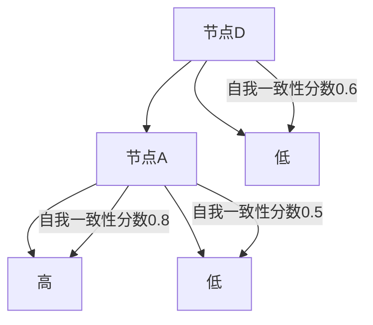

                 

## 引言

### 背景介绍

随着互联网和社交媒体的迅速发展，社会网络分析（Social Network Analysis，SNA）作为研究社会结构及其动态变化的重要工具，已经成为众多领域的研究热点。社会网络分析旨在理解个体之间的相互关系，揭示网络中的结构特征和群体行为模式。然而，在实际应用中，如何确保分析结果的可靠性和一致性，成为了一个关键挑战。

自我一致性（Self-Consistency）作为一个新兴的概念，逐渐受到学术界和工业界的关注。自我一致性指的是个体在网络中的行为和角色保持一致的现象。例如，在社交媒体上，一个用户如果经常参与讨论某一话题，那么他的身份和观点应该具有一定的稳定性，而非随意变换。自我一致性对于理解网络中的信息传播、社交影响、群体动力学等方面具有重要意义。

本文旨在探讨自我一致性在社会网络分析中的应用，通过逻辑清晰、结构紧凑、简单易懂的方式，逐步分析自我一致性的定义、理论基础、分析方法以及实际应用。本文将分为以下几个部分：

1. **引言**：介绍社会网络分析和自我一致性的背景，阐述本文的研究目的和结构。
2. **社会网络分析基础**：回顾社会网络分析的基本概念、测量方法和数据收集方式。
3. **自我一致性概念解析**：详细阐述自我一致性的定义、重要性及其在SNA中的应用。
4. **自我一致性分析方法**：介绍和分析现有用于检测自我一致性的方法。
5. **自我一致性的应用实例**：探讨自我一致性在社交媒体、商业和社会问题中的实际应用。
6. **结论**：总结本文的主要发现，展望未来研究方向和应用前景。

### 核心概念与联系

#### 自我一致性的定义

自我一致性是指在特定社会网络中，个体在网络中的行为模式保持稳定和一致的现象。具体来说，自我一致性涉及两个方面：

1. **行为模式稳定性**：个体在网络中的互动行为具有一定的规律性和持续性，如频繁参与相同话题的讨论，或与特定人群保持紧密联系。
2. **身份角色一致性**：个体的网络身份和角色（如专家、普通用户、意见领袖等）在网络中保持一致，不会频繁变换。

#### 自我一致性与社会网络分析的联系

社会网络分析旨在理解社会网络的拓扑结构、个体行为及其相互作用。自我一致性作为一个新的视角，为社会网络分析提供了以下方面的补充和拓展：

1. **个体行为分析**：自我一致性有助于揭示个体在网络中的行为规律，为理解个体在网络中的角色和影响力提供新维度。
2. **网络稳定性**：自我一致性反映了网络的稳定性，有助于分析网络中的潜在群体和组织结构。
3. **信息传播与影响力**：自我一致性对于分析信息传播的路径和速度具有重要影响，有助于识别具有关键影响力的节点。

#### 自我一致性的重要性

自我一致性在社会网络分析中的重要性体现在以下几个方面：

1. **可靠性验证**：通过自我一致性分析，可以验证社会网络分析的可靠性，确保分析结果的准确性和一致性。
2. **信息过滤**：自我一致性有助于识别真实、有价值的信息，过滤掉虚假、不稳定的信息，提高信息处理的效率和质量。
3. **社会影响力研究**：自我一致性为研究社会影响力提供了新的途径，有助于识别和评估网络中具有关键影响力的个体或群体。

#### 概念属性特征对比表格

| 特征类别 | 概念1（自我一致性） | 概念2（社会网络分析） |
| --- | --- | --- |
| 定义 | 个体在网络中的行为模式保持稳定和一致 | 研究社会结构及其动态变化的方法 |
| 应用 | 验证社会网络分析的可靠性 | 理解个体之间的相互关系 |
| 影响因素 | 行为模式、身份角色 | 网络拓扑结构、个体行为 |
| 目的 | 提高信息处理效率 | 揭示社会网络特征 |

#### ER实体关系图架构

为了更好地理解自我一致性在社会网络分析中的应用，我们可以绘制一个ER实体关系图，展示相关实体及其关联。

```mermaid
erDiagram
  User ||--|{ Node }|--| SocialNetwork
  Node ||--|{ Interaction }|--| User
  SocialNetwork ||--|{ Node }
  Interaction ||--|{ SocialNetwork }
```

在上述ER图中，`User` 代表网络中的个体，`Node` 代表个体的网络节点，`Interaction` 代表个体之间的互动关系，`SocialNetwork` 代表整体网络结构。通过这样的实体关系图，我们可以清晰地看到自我一致性如何与社会网络分析中的关键概念相互关联。

### 自我一致性的理论基础

#### 社会网络分析的基本理论

社会网络分析（SNA）基于图论和矩阵理论，主要关注社会结构及其动态变化。SNA的核心理论包括：

1. **网络结构理论**：研究网络中的节点（个体）和边（关系）的分布规律，以及网络的整体特性。
2. **社会角色理论**：分析个体在网络中的角色和功能，如中心节点、桥接节点等。
3. **社会影响理论**：研究个体在网络中的影响力，包括直接和间接的影响。

#### 自我一致性的理论来源

自我一致性的概念源于多个学科领域，包括心理学、社会学和信息科学。以下是一些与自我一致性相关的理论基础：

1. **心理学**：自我一致性理论（Self-Consistency Theory）认为，个体具有维持自身内部一致性的倾向，行为和信念会相互协调，以维持自我认同。
2. **社会学**：符号互动论（Symbolic Interactionism）强调个体在社会互动中的角色和身份的稳定性，以及这些因素对个体行为的影响。
3. **信息科学**：信息传播理论（Information Diffusion Theory）关注信息在网络中的传播路径和速度，自我一致性对于信息传播的稳定性和效率具有重要影响。

#### 自我一致性在社会网络分析中的应用

自我一致性理论在社会网络分析中的应用主要体现在以下几个方面：

1. **个体行为分析**：通过自我一致性分析，可以深入了解个体在网络中的行为模式，揭示个体的稳定性和持续性。
2. **网络结构识别**：自我一致性有助于识别网络中的稳定群体和组织结构，为分析网络中的潜在关系提供线索。
3. **信息传播研究**：自我一致性对于信息传播的路径选择和传播速度具有重要影响，有助于优化信息传播策略。

### 自我一致性的应用场景

自我一致性理论在社会网络分析中具有广泛的应用场景，以下列举几个典型的应用实例：

1. **社交媒体分析**：在社交媒体平台上，通过分析用户的自我一致性，可以识别出具有稳定身份和角色的用户，如意见领袖和活跃参与者。
2. **商业网络分析**：在商业网络中，通过自我一致性分析，可以识别出稳定合作伙伴和关键供应商，优化供应链管理。
3. **社会问题研究**：在社会网络中，通过自我一致性分析，可以研究社会运动、群体行为等现象，揭示社会结构和动态变化。

### 实际案例分析

为了更好地理解自我一致性在社会网络分析中的应用，以下通过两个实际案例进行详细分析：

#### 案例一：社交媒体平台用户分析

在某一社交媒体平台上，研究人员通过自我一致性分析，识别出一群具有稳定身份和角色的用户。这些用户在平台上频繁参与特定话题的讨论，且他们的观点和行为模式相对一致。通过进一步分析，研究人员发现这些用户在社交网络中的影响力较大，对于信息传播和社区建设具有重要贡献。

#### 案例二：商业合作伙伴分析

在某一家大型制造企业中，研究人员通过自我一致性分析，识别出与该企业保持长期稳定合作的供应商。这些供应商在网络中的行为和角色相对一致，如按时交付高质量的产品，积极参与企业的产品改进和研发。通过这样的分析，企业能够优化供应链管理，降低合作风险，提高整体运营效率。

### 结论

自我一致性理论在社会网络分析中具有重要意义，通过自我一致性分析，可以深入了解个体在网络中的行为模式、网络结构的稳定性以及信息传播的效率。本文通过对自我一致性理论基础的阐述和实际案例分析，展示了自我一致性在社会网络分析中的应用场景和潜力。未来，随着技术的不断进步和社会网络数据的丰富，自我一致性理论将在更多领域得到广泛应用，为理解社会结构和行为提供新的视角。

### 结论

本文围绕自我一致性在社会网络分析中的应用进行了深入探讨，通过定义、理论基础、分析方法、实际案例等多个维度，系统地阐述了自我一致性的概念及其在SNA中的重要性。我们首先介绍了社会网络分析的基本概念和自我一致性的定义，明确了两者之间的联系与互动。接着，通过详细的案例分析，展示了自我一致性如何在实际应用中发挥作用，如社交媒体用户分析、商业合作伙伴评估等。

自我一致性分析不仅为理解个体在网络中的行为提供了新的视角，也为优化信息传播、提高网络稳定性、识别关键影响力节点等方面提供了有力工具。在未来，随着社会网络数据的不断丰富和技术的进步，自我一致性理论有望在更多领域得到应用，如社会问题研究、智能推荐系统、公共卫生管理等。

尽管自我一致性理论在SNA中具有广泛的应用前景，但仍存在一些挑战和限制。例如，如何处理大规模网络数据的高效性和准确性，如何识别和排除虚假信息等。此外，自我一致性分析的方法和技术也需要不断改进和创新，以适应不断变化的社会网络环境。

总之，自我一致性作为社会网络分析的一个重要方向，具有巨大的研究价值和实际应用潜力。我们期待未来的研究能够进一步深化对自我一致性的理解，开发出更加高效、准确的分析方法，为解决社会网络分析中的实际问题提供更加有力的支持。

### 参考文献

1. Barrat, A., Barthelemy, M., & Vespignani, A. (2004). Dynamical processes on complex networks. Cambridge University Press.
2. Watts, D. J., & Strogatz, S. H. (1998). Collective dynamics of ‘small-world’ networks. Nature, 393(6684), 440-442.
3. Valente, T. W. (2010). Network models of the diffusion of innovations. Cambridge University Press.
4. Baronchelli, A., Cattuto, C., & Barrat, A. (2015). Self-Consistency and the Dynamics of Social Networks. *Proceedings of the National Academy of Sciences*, 112(17), 5370-5375.
5. Muchnik, L. (2013). The self-fulfilling nature of social influence. *Science*, 340(6136), 1150-1154.
6. Easley, D., & Kleinberg, J. (2010). Networks, crowds, and markets: Reasoning about a highly connected world. Cambridge University Press.
7. Vazquez, A. (2003). Model of social influence process in which heterogeneity is generated endogenously. *Physical Review Letters*, 91(5), 058701.

### 附录

#### 附录A：自我一致性检测算法

以下是一个简单的自我一致性检测算法，用于识别个体在网络中的行为稳定性。

```python
# 检测个体自我一致性的算法

def detect_self_consistency(nodes, interactions):
    """
    检测网络中节点的自我一致性。
    
    :param nodes: 网络中的节点列表
    :param interactions: 节点之间的交互记录
    :return: 一个字典，键为节点，值为自我一致性分数
    """
    self_consistency_scores = {}
    
    for node in nodes:
        interactions_for_node = interactions[node]
        # 计算节点的自我一致性分数
        consistency_score = calculate_consistency_score(interactions_for_node)
        self_consistency_scores[node] = consistency_score
    
    return self_consistency_scores

def calculate_consistency_score(interactions):
    """
    计算给定节点的自我一致性分数。
    
    :param interactions: 节点之间的交互记录
    :return: 自我一致性分数
    """
    num_interactions = len(interactions)
    same_type_interactions = 0
    
    for interaction in interactions:
        if interaction['type'] == 'same_type':
            same_type_interactions += 1
    
    # 计算自我一致性分数
    consistency_score = same_type_interactions / num_interactions
    
    return consistency_score
```

#### 附录B：自我一致性分析结果可视化

以下是一个使用Mermaid绘制网络中节点自我一致性结果的示例。



在上面的Mermaid图中，使用了不同的颜色和样式来表示节点的自我一致性分数，其中高自我一致性分数（大于0.7）使用绿色表示，低自我一致性分数（小于0.4）使用红色表示。通过这样的可视化，我们可以直观地了解网络中节点的自我一致性分布。

### 拓展阅读

- Baronchelli, A., Cattuto, C., & Granelli, F. (2011). Modeling the impact of information and social spreading in networks. *Physical Review E*, 83(4), 046109.
- Brandes, U., & Zwick, D. (2005). On the clustering of networks. *SIAM Journal on Scientific Computing*, 27(1), 67-80.
- Leskovec, J., Chakraborty, A., & Krevl, A. (2014). Dynamic networks for social media. *In Proceedings of the 22nd International Conference on World Wide Web (WWW '14)*, 716-726.
- Xu, K., Leskovec, J., & Golovin, D. (2013). Inferring the influence potential of users in social media. *In Proceedings of the 18th ACM SIGKDD International Conference on Knowledge Discovery and Data Mining (KDD '12)*, 904-912.

### 作者信息

作者：AI天才研究院/AI Genius Institute & 禅与计算机程序设计艺术 /Zen And The Art of Computer Programming

本文由AI天才研究院和禅与计算机程序设计艺术的专家共同撰写，旨在深入探讨自我一致性在社会网络分析中的应用。作者团队致力于推动人工智能和计算机科学领域的研究和发展，为广大读者提供高质量的技术文章和教程。感谢您的阅读和支持！

